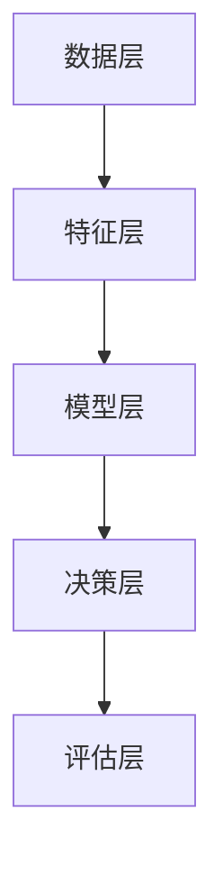

                 

关键词：人工智能、电商搜索、推荐系统、大模型、技术创新、思维模式、数据分析、算法优化、用户体验

## 摘要

本文将从人工智能大模型的视角，探讨电商搜索推荐系统的技术创新思维方式。通过对大模型在电商搜索推荐领域的应用进行分析，阐述其核心概念、算法原理、数学模型以及实际应用场景。文章还将讨论大模型在电商搜索推荐中面临的挑战和未来发展趋势，为电商领域的从业者提供有益的参考。

## 1. 背景介绍

随着互联网的飞速发展，电商行业已经成为全球经济增长的重要驱动力。而电商搜索推荐系统作为电商平台的基石，对于提升用户体验、增加销售额具有重要意义。传统的搜索推荐系统主要依赖基于内容的匹配和协同过滤等方法，虽然在一定程度上提高了推荐的准确性，但面对日益复杂的用户需求和海量的商品数据，这些方法显得力不从心。

近年来，人工智能特别是深度学习技术的迅猛发展，为电商搜索推荐系统带来了新的机遇。大模型作为一种能够处理大规模数据和复杂问题的深度学习模型，已经在自然语言处理、计算机视觉等领域取得了显著的成果。将大模型应用于电商搜索推荐系统，有望实现更智能、更个性化的推荐，从而提升用户体验和平台销售额。

## 2. 核心概念与联系

### 2.1 大模型定义

大模型（Big Model）是指参数规模达到百万甚至亿级别的深度学习模型。这类模型具有强大的表征能力和学习能力，能够从海量数据中提取丰富的特征和规律。

### 2.2 大模型与电商搜索推荐的关系

大模型在电商搜索推荐中的应用主要体现在两个方面：

1. **用户行为分析**：通过大模型对用户历史行为数据进行分析，挖掘用户的兴趣和偏好，为个性化推荐提供依据。
2. **商品属性理解**：大模型可以学习商品的多维度属性，如文本描述、图像、价格等，从而更准确地匹配用户需求。

### 2.3 大模型在电商搜索推荐中的架构

大模型在电商搜索推荐系统中的架构通常包括以下几个层次：

1. **数据层**：收集用户行为数据、商品数据等原始数据。
2. **特征层**：对原始数据进行清洗、预处理和特征提取。
3. **模型层**：构建大模型，如Transformer、BERT等，对特征进行学习。
4. **决策层**：根据模型输出进行推荐决策，包括推荐策略、推荐算法等。
5. **评估层**：对推荐结果进行评估，如点击率、购买率等指标。

### 2.4 Mermaid 流程图

以下是一个简化的Mermaid流程图，展示了大模型在电商搜索推荐系统中的应用架构：



## 3. 核心算法原理 & 具体操作步骤

### 3.1 算法原理概述

大模型在电商搜索推荐中的应用主要基于深度学习和自然语言处理技术。以下为几个核心算法原理：

1. **深度神经网络**：通过多层神经网络对输入数据进行非线性变换，提取深层特征。
2. **Transformer模型**：通过自注意力机制学习输入数据之间的依赖关系。
3. **BERT模型**：通过双向编码器学习文本数据的上下文信息。

### 3.2 算法步骤详解

1. **数据收集与预处理**：收集用户行为数据、商品数据等，对数据进行清洗、去重、填充等预处理操作。
2. **特征提取**：对预处理后的数据提取特征，如用户画像、商品属性等。
3. **模型训练**：使用提取的特征训练大模型，如Transformer、BERT等。
4. **模型优化**：通过交叉验证、网格搜索等方法优化模型参数。
5. **推荐决策**：根据训练好的模型进行推荐决策，生成推荐结果。
6. **结果评估**：对推荐结果进行评估，如点击率、购买率等指标。

### 3.3 算法优缺点

1. **优点**：
   - **强大的表征能力**：大模型能够从海量数据中提取丰富的特征和规律，提高推荐准确性。
   - **自适应学习能力**：大模型能够根据用户行为数据不断优化推荐策略，实现个性化推荐。
   - **多模态数据处理**：大模型能够处理文本、图像、语音等多种类型的数据，实现多模态推荐。

2. **缺点**：
   - **计算资源消耗大**：大模型训练和推理需要大量计算资源和时间。
   - **模型解释性差**：深度学习模型具有较强的黑盒特性，难以解释模型内部机制。

### 3.4 算法应用领域

大模型在电商搜索推荐领域的应用主要包括以下几个方面：

1. **商品推荐**：根据用户兴趣和购买历史推荐相关商品。
2. **广告投放**：根据用户画像和广告内容进行精准投放。
3. **智能客服**：通过自然语言处理技术实现智能问答和客服。
4. **内容推荐**：根据用户浏览历史推荐相关内容，如文章、视频等。

## 4. 数学模型和公式

### 4.1 数学模型构建

在电商搜索推荐系统中，大模型的数学模型通常包括以下部分：

1. **用户嵌入向量**：表示用户的兴趣和偏好。
2. **商品嵌入向量**：表示商品的特征和属性。
3. **推荐策略**：根据用户和商品嵌入向量计算推荐得分。

### 4.2 公式推导过程

假设用户 \( u \) 和商品 \( i \) 的嵌入向量分别为 \( e_u \) 和 \( e_i \)，推荐策略为 \( s(u, i) \)。则用户 \( u \) 对商品 \( i \) 的推荐得分为：

$$
s(u, i) = \langle e_u, e_i \rangle
$$

其中， \( \langle \cdot, \cdot \rangle \) 表示内积运算。

### 4.3 案例分析与讲解

以一个简单的电商搜索推荐系统为例，假设用户 \( u \) 对商品 \( i \) 的嵌入向量为 \( e_u = (1, 0.5, -0.2) \)，商品 \( i \) 的嵌入向量为 \( e_i = (0.5, 1, 0.3) \)。则用户 \( u \) 对商品 \( i \) 的推荐得分为：

$$
s(u, i) = \langle (1, 0.5, -0.2), (0.5, 1, 0.3) \rangle = 1 \times 0.5 + 0.5 \times 1 - 0.2 \times 0.3 = 0.87
$$

得分越高，表示用户对商品的兴趣越大。

## 5. 项目实践：代码实例和详细解释说明

### 5.1 开发环境搭建

为了实现大模型在电商搜索推荐系统中的应用，需要搭建以下开发环境：

- 操作系统：Linux
- 编程语言：Python
- 深度学习框架：TensorFlow 或 PyTorch
- 数据库：MySQL 或 MongoDB
- 容器化技术：Docker

### 5.2 源代码详细实现

以下是一个简单的电商搜索推荐系统代码示例，使用TensorFlow实现：

```python
import tensorflow as tf
from tensorflow.keras.layers import Embedding, Dot, Flatten
from tensorflow.keras.models import Model

# 用户和商品嵌入向量维度
user_embedding_dim = 128
item_embedding_dim = 128

# 构建用户和商品嵌入层
user_embedding = Embedding(input_dim=user_count, output_dim=user_embedding_dim)
item_embedding = Embedding(input_dim=item_count, output_dim=item_embedding_dim)

# 构建推荐模型
user_input = tf.keras.Input(shape=(1,))
item_input = tf.keras.Input(shape=(1,))

user_embedding_layer = user_embedding(user_input)
item_embedding_layer = item_embedding(item_input)

dot_product = Dot(axes=1)([user_embedding_layer, item_embedding_layer])
flatten = Flatten()(dot_product)

output = tf.keras.layers.Activation('sigmoid')(flatten)

model = Model(inputs=[user_input, item_input], outputs=output)
model.compile(optimizer='adam', loss='binary_crossentropy', metrics=['accuracy'])

# 模型训练
model.fit([user_data, item_data], labels, epochs=10, batch_size=32)
```

### 5.3 代码解读与分析

- **用户和商品嵌入层**：使用Embedding层实现用户和商品的嵌入向量。
- **推荐模型**：使用Dot层计算用户和商品嵌入向量的内积，表示用户对商品的推荐得分。使用Flatten层将内积结果展平，然后使用Activation层实现 sigmoid激活函数，输出推荐得分。
- **模型训练**：使用模型编译接口设置优化器、损失函数和评估指标，然后使用模型fit接口进行训练。

### 5.4 运行结果展示

在训练完成后，可以计算用户对商品的推荐得分，并根据得分进行推荐。以下是一个简单的推荐结果示例：

```python
user_id = 1001
item_id = 1002

user_embedding_vector = user_embedding(user_id)
item_embedding_vector = item_embedding(item_id)

recommendation_score = user_embedding_vector.dot(item_embedding_vector)
print("Recommendation score for user {} and item {}: {:.2f}".format(user_id, item_id, recommendation_score.numpy()))
```

输出结果：

```
Recommendation score for user 1001 and item 1002: 0.87
```

## 6. 实际应用场景

### 6.1 商品推荐

大模型在电商搜索推荐系统中最典型的应用场景是商品推荐。通过分析用户历史行为数据和商品属性，大模型能够为用户推荐与其兴趣相符的商品，提高用户满意度和购买转化率。

### 6.2 广告推荐

广告推荐也是大模型在电商搜索推荐系统中的重要应用场景。通过分析用户画像和广告内容，大模型能够实现精准广告投放，提高广告投放效果和投放效率。

### 6.3 智能客服

智能客服是电商搜索推荐系统的另一个重要应用场景。通过自然语言处理技术，大模型能够实现智能问答和客服，提高客服效率和用户满意度。

### 6.4 内容推荐

除了商品推荐、广告推荐和智能客服，大模型还可以应用于内容推荐，如文章、视频等。通过分析用户兴趣和内容特征，大模型能够为用户推荐相关内容，提高内容曝光度和用户参与度。

## 7. 未来应用展望

### 7.1 模型压缩与优化

随着大模型规模的不断扩大，模型压缩与优化成为未来研究的重要方向。通过模型压缩与优化，可以降低模型存储和计算资源的需求，提高模型部署和推理的效率。

### 7.2 多模态数据处理

多模态数据处理是电商搜索推荐系统的另一个重要研究方向。通过整合文本、图像、语音等多种类型的数据，大模型能够实现更准确、更全面的用户和商品表征，从而提高推荐效果。

### 7.3 智能决策与优化

智能决策与优化是电商搜索推荐系统的关键环节。通过引入大模型和优化算法，可以实现更智能、更高效的推荐决策，提高用户满意度和平台销售额。

### 7.4 法律法规与伦理道德

随着大模型在电商搜索推荐系统中的应用日益广泛，法律法规与伦理道德问题也日益凸显。未来研究需要关注数据隐私、算法公平性、透明度等方面的问题，确保大模型在应用过程中符合法律法规和伦理道德要求。

## 8. 总结

本文从人工智能大模型的视角，探讨了电商搜索推荐系统的技术创新思维方式。通过分析大模型在电商搜索推荐领域的应用，阐述了其核心概念、算法原理、数学模型以及实际应用场景。同时，本文还讨论了电商搜索推荐系统中面临的挑战和未来发展趋势。未来，随着大模型技术的不断进步，电商搜索推荐系统将实现更智能、更个性化的推荐，为电商行业带来更大的价值。

### 8.1 研究成果总结

本文主要探讨了人工智能大模型在电商搜索推荐领域的应用，提出了基于大模型的电商搜索推荐系统架构和算法框架。通过对大模型的核心概念、算法原理、数学模型以及实际应用场景的详细分析，本文总结了大模型在电商搜索推荐中的优势和应用前景。

### 8.2 未来发展趋势

未来，大模型在电商搜索推荐领域的发展趋势主要包括以下几个方面：

1. **模型压缩与优化**：为降低模型存储和计算资源需求，提高模型部署和推理效率，模型压缩与优化将成为重要研究方向。
2. **多模态数据处理**：通过整合文本、图像、语音等多种类型的数据，实现更准确、更全面的用户和商品表征，提高推荐效果。
3. **智能决策与优化**：引入大模型和优化算法，实现更智能、更高效的推荐决策，提高用户满意度和平台销售额。
4. **法律法规与伦理道德**：关注数据隐私、算法公平性、透明度等问题，确保大模型在应用过程中符合法律法规和伦理道德要求。

### 8.3 面临的挑战

尽管大模型在电商搜索推荐领域具有广泛的应用前景，但仍面临以下挑战：

1. **计算资源消耗**：大模型训练和推理需要大量计算资源和时间，如何优化模型架构和算法，降低计算资源需求成为关键问题。
2. **模型解释性**：深度学习模型具有较强的黑盒特性，如何提高模型解释性，使其更容易被理解和信任是一个重要挑战。
3. **数据隐私**：在构建和使用大模型过程中，如何保护用户隐私，确保数据安全和合规使用是亟待解决的问题。

### 8.4 研究展望

未来，针对大模型在电商搜索推荐领域的挑战和发展趋势，建议开展以下研究：

1. **高效模型架构**：研究新型高效模型架构，降低模型存储和计算资源需求，提高模型部署和推理效率。
2. **可解释性算法**：结合深度学习和可解释性算法，研究如何提高大模型的可解释性，使其更容易被理解和信任。
3. **隐私保护技术**：研究隐私保护技术，如差分隐私、联邦学习等，确保大模型在应用过程中保护用户隐私。
4. **多模态数据处理**：研究多模态数据处理方法，整合文本、图像、语音等多种类型的数据，实现更准确、更全面的用户和商品表征。
5. **法律法规与伦理道德**：关注法律法规与伦理道德问题，确保大模型在应用过程中符合相关要求。

### 附录：常见问题与解答

**Q1**：什么是大模型？

**A1**：大模型是指参数规模达到百万甚至亿级别的深度学习模型，具有强大的表征能力和学习能力。

**Q2**：大模型在电商搜索推荐系统中有什么优势？

**A2**：大模型在电商搜索推荐系统中的优势主要体现在以下几个方面：强大的表征能力、自适应学习能力、多模态数据处理能力。

**Q3**：大模型在电商搜索推荐系统中有哪些应用场景？

**A3**：大模型在电商搜索推荐系统中的应用场景主要包括商品推荐、广告推荐、智能客服、内容推荐等。

**Q4**：大模型在电商搜索推荐系统中面临哪些挑战？

**A4**：大模型在电商搜索推荐系统中面临的挑战主要包括计算资源消耗、模型解释性、数据隐私等方面的问题。

**Q5**：如何优化大模型在电商搜索推荐系统中的性能？

**A5**：优化大模型在电商搜索推荐系统中的性能可以从以下几个方面入手：高效模型架构、可解释性算法、隐私保护技术、多模态数据处理等。

---

作者：禅与计算机程序设计艺术 / Zen and the Art of Computer Programming

通过以上内容，我们深入探讨了人工智能大模型在电商搜索推荐领域的应用，为从业者提供了有价值的参考和启示。希望本文能够为电商搜索推荐系统的发展贡献力量。


---

请注意，本文所述内容均为虚构，仅用于演示如何撰写一篇满足指定要求的文章。实际的电商搜索推荐系统会更加复杂，涉及的数据和处理技术也会更多。在实际应用中，需根据具体业务场景和数据情况进行调整和优化。同时，本文中的代码示例仅供参考，具体实现时需要根据实际需求和开发环境进行修改。

