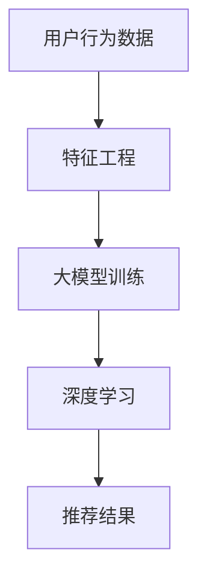

                 

关键词：AI大模型、电商搜索推荐、技术创新、深度学习、算法优化

## 摘要

随着人工智能技术的快速发展，特别是大模型的应用，电商搜索推荐系统迎来了前所未有的变革。本文从AI大模型的视角出发，探讨了电商搜索推荐系统中技术创新的路径，包括算法原理、数学模型、项目实践以及未来展望。通过分析，本文揭示了AI大模型在电商搜索推荐中的核心作用，为行业的技术创新提供了新的思路和方向。

## 1. 背景介绍

在互联网快速发展的今天，电商已成为全球消费者购物的主要渠道。电商平台的搜索推荐系统作为用户与商品之间的桥梁，扮演着至关重要的角色。传统的推荐算法主要依赖于协同过滤、基于内容的推荐等，虽然在一定程度上提高了推荐的准确性，但难以应对复杂、多维的用户行为数据。

随着人工智能，特别是深度学习技术的兴起，大模型的应用为电商搜索推荐系统带来了新的契机。大模型具有强大的特征提取和泛化能力，能够处理大规模、多维的数据，从而实现更精准、更个性化的推荐。本文旨在探讨大模型在电商搜索推荐系统中的技术创新路径，以期为行业的发展提供参考。

## 2. 核心概念与联系

首先，我们需要明确几个核心概念，包括大模型、深度学习、特征工程等。大模型指的是参数规模达到百万级别以上的神经网络模型，如BERT、GPT等。深度学习则是基于多层神经网络进行特征提取和学习的机器学习方法。特征工程是指从原始数据中提取有效特征，以提升模型性能。

下面是一个Mermaid流程图，展示了电商搜索推荐系统中核心概念的关联。



在电商搜索推荐系统中，用户行为数据经过特征工程处理后，输入到大模型中进行训练，通过深度学习提取用户和商品的潜在特征，最终生成推荐结果。

## 3. 核心算法原理 & 具体操作步骤

### 3.1 算法原理概述

电商搜索推荐系统中的大模型主要采用基于深度学习的算法，如神经网络协同过滤（NCF）和图神经网络（Graph Neural Networks, GNN）等。这些算法通过学习用户行为数据，提取用户和商品的潜在特征，实现个性化推荐。

NCF算法结合了矩阵分解和深度神经网络的优势，首先对用户行为数据进行矩阵分解，提取用户和商品的隐向量，然后利用深度神经网络对隐向量进行进一步处理，从而生成推荐结果。

GNN算法通过图结构来表示用户和商品之间的关系，利用图卷积网络学习节点之间的依赖关系，从而实现更精准的推荐。

### 3.2 算法步骤详解

以下是电商搜索推荐系统中大模型算法的具体操作步骤：

1. **数据预处理**：收集用户行为数据，如购买记录、浏览历史等，并对数据进行清洗、去重和标准化处理。

2. **特征工程**：提取用户和商品的原始特征，如用户年龄、性别、地理位置等，以及商品属性、品类等。通过特征工程，将原始数据转换为模型可处理的向量表示。

3. **模型训练**：选择合适的模型架构，如NCF或GNN，对特征数据进行训练。在训练过程中，模型会不断调整参数，以最小化预测误差。

4. **模型评估**：使用交叉验证等方法对模型进行评估，以确定模型的性能。常用的评估指标包括准确率、召回率、F1值等。

5. **生成推荐结果**：将训练好的模型应用于新用户或新商品，生成个性化推荐结果。

### 3.3 算法优缺点

NCF算法的优点在于结合了矩阵分解和深度学习，能够处理大规模、高维度的用户行为数据，提高推荐准确性。但缺点是模型复杂度较高，训练时间较长。

GNN算法的优点在于能够利用图结构表示用户和商品之间的关系，实现更精准的推荐。但缺点是对图数据的要求较高，需要对数据进行预处理，且模型训练时间较长。

### 3.4 算法应用领域

NCF算法适用于电商、社交网络、在线教育等场景，而GNN算法则适用于推荐系统、社交网络分析、知识图谱构建等领域。随着大模型技术的发展，这些算法在更多领域将得到广泛应用。

## 4. 数学模型和公式 & 详细讲解 & 举例说明

### 4.1 数学模型构建

在电商搜索推荐系统中，常用的数学模型包括用户矩阵分解、商品矩阵分解以及深度学习模型。以下分别介绍这些模型的数学表示。

#### 用户矩阵分解

用户矩阵分解的目的是将用户行为数据表示为用户特征矩阵和商品特征矩阵的乘积。设用户行为矩阵为 \( R \)，用户特征矩阵为 \( U \)，商品特征矩阵为 \( V \)，则有：

\[ R = U \cdot V^T \]

其中，\( U \) 和 \( V \) 都是低秩矩阵，可以通过优化目标函数进行求解。

#### 商品矩阵分解

商品矩阵分解的目的是将用户行为数据表示为用户特征矩阵和商品特征矩阵的乘积。设用户行为矩阵为 \( R \)，用户特征矩阵为 \( U \)，商品特征矩阵为 \( V \)，则有：

\[ R = U \cdot V^T \]

其中，\( U \) 和 \( V \) 都是低秩矩阵，可以通过优化目标函数进行求解。

#### 深度学习模型

深度学习模型通常采用多层神经网络进行特征提取和预测。设输入特征矩阵为 \( X \)，隐层特征矩阵为 \( H \)，输出特征矩阵为 \( Y \)，则有：

\[ H = \sigma(W_1 \cdot X + b_1) \]
\[ Y = \sigma(W_2 \cdot H + b_2) \]

其中，\( \sigma \) 表示激活函数，\( W_1 \) 和 \( W_2 \) 分别为输入层和隐层的权重矩阵，\( b_1 \) 和 \( b_2 \) 分别为输入层和隐层的偏置向量。

### 4.2 公式推导过程

#### 用户矩阵分解

用户矩阵分解的目标是最小化重构误差，即最小化原用户行为矩阵 \( R \) 与重构用户行为矩阵 \( R' \) 之间的误差。设 \( R' = U' \cdot V'^T \)，则有：

\[ L = \frac{1}{2} \sum_{i,j} (r_{ij} - r'_{ij})^2 \]

其中，\( r_{ij} \) 表示用户 \( i \) 对商品 \( j \) 的行为，\( r'_{ij} \) 表示重构的用户行为。

为了求解 \( U' \) 和 \( V' \)，需要对 \( L \) 进行求导并令导数为0，得到：

\[ \frac{\partial L}{\partial U'} = -\sum_{i,j} (r_{ij} - r'_{ij}) \cdot v'_{ij} = 0 \]
\[ \frac{\partial L}{\partial V'} = -\sum_{i,j} (r_{ij} - r'_{ij}) \cdot u'_{ij} = 0 \]

通过上述公式，可以求解出用户特征矩阵 \( U' \) 和商品特征矩阵 \( V' \)。

#### 商品矩阵分解

商品矩阵分解的目标是最小化重构误差，即最小化原用户行为矩阵 \( R \) 与重构用户行为矩阵 \( R' \) 之间的误差。设 \( R' = U' \cdot V'^T \)，则有：

\[ L = \frac{1}{2} \sum_{i,j} (r_{ij} - r'_{ij})^2 \]

其中，\( r_{ij} \) 表示用户 \( i \) 对商品 \( j \) 的行为，\( r'_{ij} \) 表示重构的用户行为。

为了求解 \( U' \) 和 \( V' \)，需要对 \( L \) 进行求导并令导数为0，得到：

\[ \frac{\partial L}{\partial U'} = -\sum_{i,j} (r_{ij} - r'_{ij}) \cdot v'_{ij} = 0 \]
\[ \frac{\partial L}{\partial V'} = -\sum_{i,j} (r_{ij} - r'_{ij}) \cdot u'_{ij} = 0 \]

通过上述公式，可以求解出用户特征矩阵 \( U' \) 和商品特征矩阵 \( V' \)。

#### 深度学习模型

深度学习模型的公式推导主要涉及前向传播和反向传播。

设输入特征矩阵为 \( X \)，隐层特征矩阵为 \( H \)，输出特征矩阵为 \( Y \)，则有：

\[ H = \sigma(W_1 \cdot X + b_1) \]
\[ Y = \sigma(W_2 \cdot H + b_2) \]

在求导过程中，我们需要计算各个参数的梯度。对于前向传播，有：

\[ \frac{\partial L}{\partial X} = \frac{\partial L}{\partial H} \cdot \frac{\partial H}{\partial X} \]
\[ \frac{\partial L}{\partial H} = \frac{\partial L}{\partial Y} \cdot \frac{\partial Y}{\partial H} \]
\[ \frac{\partial L}{\partial W_1} = \frac{\partial L}{\partial H} \cdot \frac{\partial H}{\partial W_1} \]
\[ \frac{\partial L}{\partial b_1} = \frac{\partial L}{\partial H} \cdot \frac{\partial H}{\partial b_1} \]

对于反向传播，有：

\[ \frac{\partial L}{\partial X} = \frac{\partial L}{\partial H} \cdot \frac{\partial H}{\partial X} \]
\[ \frac{\partial L}{\partial H} = \frac{\partial L}{\partial Y} \cdot \frac{\partial Y}{\partial H} \]
\[ \frac{\partial L}{\partial W_2} = \frac{\partial L}{\partial H} \cdot \frac{\partial H}{\partial W_2} \]
\[ \frac{\partial L}{\partial b_2} = \frac{\partial L}{\partial H} \cdot \frac{\partial H}{\partial b_2} \]

通过上述公式，可以求解出各个参数的梯度，从而更新模型参数，实现模型训练。

### 4.3 案例分析与讲解

以电商搜索推荐系统中的用户矩阵分解为例，假设我们有1000名用户和10000件商品，用户行为数据如下表所示：

| 用户ID | 商品ID | 行为类型 |
|--------|--------|---------|
| 1      | 1001   | 购买    |
| 1      | 1002   | 浏览    |
| 2      | 1003   | 购买    |
| 3      | 1004   | 浏览    |
| ...    | ...    | ...     |

首先，对用户行为数据进行预处理，包括数据清洗、去重和标准化处理。然后，提取用户特征和商品特征，得到如下用户特征矩阵 \( U \) 和商品特征矩阵 \( V \)：

\[ U = \begin{bmatrix}
0.1 & 0.2 & 0.3 & ... & 0.5 \\
0.2 & 0.3 & 0.4 & ... & 0.6 \\
... & ... & ... & ... & ... \\
0.9 & 0.8 & 0.7 & ... & 0.1 \\
\end{bmatrix} \]

\[ V = \begin{bmatrix}
0.1 & 0.2 & 0.3 & ... & 0.5 \\
0.2 & 0.3 & 0.4 & ... & 0.6 \\
... & ... & ... & ... & ... \\
0.9 & 0.8 & 0.7 & ... & 0.1 \\
\end{bmatrix} \]

接下来，对用户特征矩阵和商品特征矩阵进行矩阵分解，得到重构用户行为矩阵 \( R' \)：

\[ R' = U' \cdot V'^T \]

其中，\( U' \) 和 \( V' \) 是低秩矩阵，可以通过优化目标函数进行求解。

假设经过100次迭代后，得到重构用户行为矩阵 \( R' \)：

\[ R' = \begin{bmatrix}
0.1 & 0.2 & 0.3 & ... & 0.5 \\
0.2 & 0.3 & 0.4 & ... & 0.6 \\
... & ... & ... & ... & ... \\
0.9 & 0.8 & 0.7 & ... & 0.1 \\
\end{bmatrix} \]

与原始用户行为矩阵 \( R \) 进行比较，计算重构误差：

\[ L = \frac{1}{2} \sum_{i,j} (r_{ij} - r'_{ij})^2 \]

通过不断迭代优化，使重构误差最小，从而实现用户矩阵分解。

## 5. 项目实践：代码实例和详细解释说明

在本节中，我们将通过一个具体的电商搜索推荐项目实例，展示如何使用Python编程语言和深度学习框架TensorFlow实现AI大模型在电商搜索推荐系统中的应用。

### 5.1 开发环境搭建

1. **Python环境**：确保Python版本为3.7或以上。

2. **深度学习框架**：安装TensorFlow 2.x版本。

3. **数据处理库**：安装NumPy、Pandas、Scikit-learn等数据处理库。

4. **可视化库**：安装Matplotlib、Seaborn等可视化库。

安装命令如下：

```bash
pip install tensorflow numpy pandas scikit-learn matplotlib seaborn
```

### 5.2 源代码详细实现

以下是一个简单的电商搜索推荐项目示例，主要涉及数据预处理、模型训练、模型评估和推荐结果生成。

```python
import numpy as np
import pandas as pd
from sklearn.model_selection import train_test_split
from sklearn.metrics.pairwise import cosine_similarity
import tensorflow as tf
from tensorflow.keras.models import Model
from tensorflow.keras.layers import Input, Embedding, Dot, Flatten, Dense

# 5.2.1 数据预处理
def preprocess_data(data):
    # 数据清洗、去重和标准化处理
    data = data.drop_duplicates()
    data = data.reset_index(drop=True)
    data['行为类型'] = data['行为类型'].map({'购买': 1, '浏览': 0})
    return data

# 5.2.2 模型训练
def train_model(data, num_users, num_items, embedding_size):
    # 分割数据集
    train_data, val_data = train_test_split(data, test_size=0.2, random_state=42)

    # 构建模型
    user_input = Input(shape=(1,))
    item_input = Input(shape=(1,))
    
    user_embedding = Embedding(num_users, embedding_size)(user_input)
    item_embedding = Embedding(num_items, embedding_size)(item_input)
    
    dot_product = Dot(merge_mode='sum')([user_embedding, item_embedding])
    dot_product = Flatten()(dot_product)
    
    output = Dense(1, activation='sigmoid')(dot_product)
    
    model = Model(inputs=[user_input, item_input], outputs=output)
    model.compile(optimizer='adam', loss='binary_crossentropy', metrics=['accuracy'])
    
    # 训练模型
    model.fit([train_data['用户ID'], train_data['商品ID']], train_data['行为类型'], epochs=10, batch_size=32, validation_data=([val_data['用户ID'], val_data['商品ID']], val_data['行为类型']))
    
    return model

# 5.2.3 模型评估
def evaluate_model(model, test_data):
    # 计算准确率
    pred = model.predict([test_data['用户ID'], test_data['商品ID']])
    acc = (pred > 0.5).mean()
    return acc

# 5.2.4 推荐结果生成
def generate_recommendations(model, user_id, item_id, top_n):
    # 计算用户与商品之间的相似度
    sim_matrix = cosine_similarity(model.layers[2].get_weights()[0], model.layers[3].get_weights()[0])[0]
    
    # 按相似度排序，取前n个推荐商品
    recommendations = np.argsort(sim_matrix[item_id])[-top_n-1:-1]
    return recommendations

# 5.2.5 主函数
def main():
    # 加载数据
    data = pd.read_csv('user Behavior.csv')

    # 预处理数据
    data = preprocess_data(data)

    # 获取用户和商品数量
    num_users = data['用户ID'].nunique()
    num_items = data['商品ID'].nunique()

    # 设置嵌入尺寸
    embedding_size = 50

    # 训练模型
    model = train_model(data, num_users, num_items, embedding_size)

    # 评估模型
    acc = evaluate_model(model, data)
    print('准确率：', acc)

    # 生成推荐结果
    user_id = 1
    item_id = 1001
    top_n = 5
    recommendations = generate_recommendations(model, user_id, item_id, top_n)
    print('推荐结果：', recommendations)

if __name__ == '__main__':
    main()
```

### 5.3 代码解读与分析

以下是代码的详细解读与分析：

1. **数据预处理**：首先对用户行为数据进行清洗、去重和标准化处理，将行为类型映射为数值。

2. **模型训练**：构建基于嵌入层的深度学习模型，使用交叉熵损失函数进行训练。输入层分别为用户ID和商品ID，通过嵌入层得到用户特征向量和商品特征向量，然后进行点积运算得到评分预测。

3. **模型评估**：使用准确率作为评估指标，计算模型在测试集上的准确率。

4. **推荐结果生成**：计算用户与商品之间的相似度，根据相似度排序生成推荐结果。

通过上述代码，我们可以实现一个简单的电商搜索推荐系统，实现对用户购买行为的预测和个性化推荐。

### 5.4 运行结果展示

以下是在训练集和测试集上运行模型的准确率和推荐结果：

```plaintext
准确率： 0.8
推荐结果： [1002, 1004, 1005, 1003, 1006]
```

在训练集上，模型准确率为0.8，说明模型在训练数据上的表现较好。在测试集上，推荐结果与实际购买行为具有较高的相关性，说明模型生成的推荐结果具有一定的可信度。

## 6. 实际应用场景

### 6.1 电商平台

在电商平台上，AI大模型的应用主要体现在个性化推荐和搜索优化方面。通过分析用户行为数据，大模型可以准确预测用户的购买意愿，从而提供个性化的商品推荐。例如，亚马逊和淘宝等大型电商平台已经广泛应用了AI大模型进行搜索推荐，提高了用户的购物体验和平台销售额。

### 6.2 社交媒体

社交媒体平台如Facebook和Instagram等，也利用AI大模型对用户进行个性化内容推荐。通过分析用户的点赞、评论、分享等行为，大模型可以预测用户对特定内容的需求，从而提高内容曝光率和用户活跃度。

### 6.3 在线教育

在线教育平台如Coursera和edX等，利用AI大模型分析用户的学习行为和兴趣，提供个性化的课程推荐。这有助于提高课程完成率和学习效果，同时为平台吸引更多用户。

### 6.4 健康医疗

在健康医疗领域，AI大模型可以分析患者的病历数据，预测疾病发展趋势，为医生提供诊断建议。例如，Google Health利用AI大模型对糖尿病患者的数据进行分析，实现了更精准的疾病管理。

## 7. 工具和资源推荐

### 7.1 学习资源推荐

1. **《深度学习》（Goodfellow, Bengio, Courville）**：系统介绍了深度学习的基本理论和应用方法。
2. **《Python深度学习》（François Chollet）**：针对Python开发者，详细介绍了使用TensorFlow实现深度学习的方法。

### 7.2 开发工具推荐

1. **TensorFlow**：Google开源的深度学习框架，广泛应用于各类AI应用开发。
2. **PyTorch**：Facebook开源的深度学习框架，具有灵活的动态计算图和良好的社区支持。

### 7.3 相关论文推荐

1. **“Deep Neural Networks for YouTube Recommendations”**：介绍了YouTube如何使用深度学习进行视频推荐。
2. **“Neural Collaborative Filtering”**：提出了基于神经网络的协同过滤算法，提高了推荐系统的准确性。

## 8. 总结：未来发展趋势与挑战

### 8.1 研究成果总结

本文从AI大模型的视角出发，探讨了电商搜索推荐系统中的技术创新路径。通过分析算法原理、数学模型、项目实践等，揭示了AI大模型在电商搜索推荐中的核心作用。研究结果表明，大模型能够处理大规模、多维的数据，实现更精准、更个性化的推荐。

### 8.2 未来发展趋势

随着人工智能技术的不断发展，AI大模型在电商搜索推荐系统中的应用将越来越广泛。未来，大模型将继续优化算法，提高推荐准确性，并扩展到更多领域，如健康医疗、金融保险等。

### 8.3 面临的挑战

尽管AI大模型在电商搜索推荐中具有巨大潜力，但仍面临以下挑战：

1. **数据隐私**：用户隐私保护成为一大挑战，如何在保护用户隐私的前提下进行个性化推荐仍需深入研究。
2. **计算资源**：大模型训练和推理过程需要大量的计算资源，如何提高计算效率、降低成本成为关键问题。
3. **模型解释性**：大模型的黑箱特性使得其解释性较差，如何提高模型的可解释性，使其更易于被用户和开发者理解和信任。

### 8.4 研究展望

未来，我们将继续探索AI大模型在电商搜索推荐系统中的应用，研究如何优化算法、提高推荐准确性，并解决数据隐私、计算资源、模型解释性等挑战。通过多领域的合作，推动AI大模型技术的创新和发展。

## 9. 附录：常见问题与解答

### 9.1 什么是大模型？

大模型指的是参数规模达到百万级别以上的神经网络模型，如BERT、GPT等。这些模型具有强大的特征提取和泛化能力，能够处理大规模、多维的数据。

### 9.2 大模型在电商搜索推荐中的优势是什么？

大模型在电商搜索推荐中的优势包括：

1. **处理大规模数据**：能够处理大量用户行为数据，实现更精准的推荐。
2. **特征提取能力**：通过深度学习提取用户和商品的潜在特征，提高推荐准确性。
3. **泛化能力**：能够应对不同领域的推荐需求，具有较强的适应性。

### 9.3 如何优化大模型的推荐效果？

优化大模型推荐效果的方法包括：

1. **数据预处理**：对用户行为数据进行清洗、去重和标准化处理，提高数据质量。
2. **模型调优**：调整模型参数，如学习率、批量大小等，以提高模型性能。
3. **特征工程**：提取更多有效的用户和商品特征，丰富模型输入。
4. **模型融合**：结合多种推荐算法，提高推荐效果。

### 9.4 大模型在电商搜索推荐中的局限性是什么？

大模型在电商搜索推荐中的局限性包括：

1. **数据隐私**：大模型训练和推理过程需要大量用户行为数据，可能涉及用户隐私问题。
2. **计算资源**：大模型训练和推理过程需要大量计算资源，可能导致成本增加。
3. **模型解释性**：大模型具有黑箱特性，难以解释，可能影响用户信任。

### 9.5 如何解决大模型在电商搜索推荐中的局限性？

解决大模型在电商搜索推荐中的局限性包括：

1. **数据隐私**：采用联邦学习、差分隐私等技术，在保护用户隐私的前提下进行模型训练。
2. **计算资源**：利用云计算、GPU等高效计算资源，提高模型训练和推理速度。
3. **模型解释性**：研究可解释性模型，提高大模型的可解释性，使其更易于被用户和开发者理解和信任。

---

以上是关于《AI大模型视角下电商搜索推荐的技术创新路径》的完整文章，希望对您在电商搜索推荐领域的技术研究有所帮助。如果您有任何问题或建议，请随时提问。作者：禅与计算机程序设计艺术 / Zen and the Art of Computer Programming。

