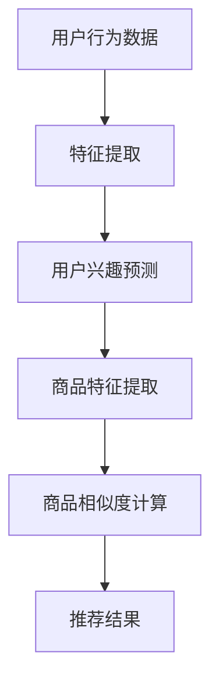

                 

关键词：电商搜索、推荐系统、大模型、AI技术、业务赋能

>摘要：本文从AI大模型的角度出发，探讨电商搜索推荐系统中技术赋能业务的思路，深入分析了大模型在电商推荐中的应用原理、数学模型、项目实践和未来发展趋势。

## 1. 背景介绍

随着互联网技术的飞速发展，电商行业已经成为全球经济的支柱产业之一。电商平台的搜索和推荐功能是其核心竞争力之一，直接影响到用户的购买体验和商家销售额。传统的推荐系统主要依赖于基于内容的推荐、协同过滤等方法，但存在推荐质量不高、用户个性化体验不足等问题。随着深度学习和大数据技术的进步，大模型在推荐系统中的应用逐渐成为研究热点。

本文旨在从AI大模型的角度，探讨电商搜索推荐系统中技术赋能业务的思路，分析大模型在电商推荐中的应用原理、数学模型、项目实践和未来发展趋势，以期为电商推荐系统的优化提供新的思路和方法。

## 2. 核心概念与联系

### 2.1. 电商搜索推荐系统

电商搜索推荐系统是电商平台的重要组成部分，其目标是通过搜索和推荐功能，为用户提供个性化的商品信息，提高用户的购买体验和商家销售额。

电商搜索推荐系统的核心模块包括：

- **搜索模块**：负责处理用户的搜索请求，返回与用户查询相关的商品列表。
- **推荐模块**：根据用户的浏览历史、购买行为、兴趣爱好等信息，为用户推荐相关的商品。

### 2.2. 大模型

大模型（Large-scale Model）是指参数量庞大、计算复杂度高的神经网络模型。大模型在推荐系统中的应用主要依赖于其强大的表示能力和学习能力，能够处理大规模的数据集，提取用户和商品的特征，实现精准的推荐。

### 2.3. 联系与原理

大模型在电商推荐系统中的应用原理如下：

- **特征提取**：通过深度学习模型，从用户行为数据和商品属性数据中提取高维特征。
- **用户行为预测**：利用提取的用户特征，预测用户的兴趣和行为，为推荐系统提供决策依据。
- **商品相似度计算**：通过计算用户兴趣特征与商品特征之间的相似度，为用户推荐相关的商品。

以下是电商搜索推荐系统的大模型架构的Mermaid流程图：



## 3. 核心算法原理 & 具体操作步骤

### 3.1 算法原理概述

电商搜索推荐系统的大模型算法主要基于深度学习，包括以下步骤：

- **数据预处理**：清洗和整合用户行为数据和商品属性数据，进行数据归一化和特征工程。
- **特征提取**：利用深度学习模型，从原始数据中提取高维特征。
- **用户兴趣预测**：通过训练得到的模型，预测用户的兴趣和行为。
- **商品相似度计算**：计算用户兴趣特征与商品特征之间的相似度，为用户推荐相关的商品。

### 3.2 算法步骤详解

#### 3.2.1 数据预处理

数据预处理是算法步骤中的重要环节，主要包括以下步骤：

- **数据清洗**：去除重复数据、噪声数据和异常数据，确保数据质量。
- **数据归一化**：将不同量纲的数据进行归一化处理，使其在同一尺度上进行计算。
- **特征工程**：根据业务需求，提取用户行为数据和商品属性数据中的关键特征。

#### 3.2.2 特征提取

特征提取是深度学习模型的关键步骤，主要包括以下步骤：

- **数据输入**：将预处理后的用户行为数据和商品属性数据输入到深度学习模型中。
- **模型训练**：通过反向传播算法，训练深度学习模型，使其能够提取出用户和商品的高维特征。
- **模型评估**：利用交叉验证等方法，评估模型的效果，并进行调参优化。

#### 3.2.3 用户兴趣预测

用户兴趣预测是推荐系统的重要环节，主要包括以下步骤：

- **特征融合**：将用户特征和商品特征进行融合，形成统一的特征向量。
- **模型预测**：利用训练好的深度学习模型，预测用户的兴趣和行为。
- **结果输出**：将预测结果输出为用户兴趣评分或行为概率。

#### 3.2.4 商品相似度计算

商品相似度计算是推荐系统的重要环节，主要包括以下步骤：

- **特征提取**：利用深度学习模型，从商品数据中提取高维特征。
- **相似度计算**：计算用户兴趣特征与商品特征之间的相似度，可采用余弦相似度、欧氏距离等算法。
- **推荐结果生成**：根据相似度计算结果，为用户生成推荐结果。

### 3.3 算法优缺点

#### 优点

- **高精度**：深度学习模型能够提取用户和商品的高维特征，实现精准的推荐。
- **自适应**：大模型能够根据用户行为数据进行实时调整，提高推荐系统的自适应能力。
- **灵活性**：大模型可以应用于多种场景，如搜索推荐、商品分类等。

#### 缺点

- **计算复杂度高**：大模型训练过程需要大量计算资源和时间，对硬件要求较高。
- **数据依赖性强**：大模型的效果依赖于高质量的数据，数据质量对推荐效果有重要影响。

### 3.4 算法应用领域

大模型在电商推荐系统中的应用领域广泛，包括：

- **商品搜索**：利用大模型，提高搜索结果的精确性和相关性。
- **商品推荐**：根据用户兴趣和行为，为用户推荐相关的商品。
- **商品分类**：对商品进行精细分类，提高用户体验。
- **用户行为分析**：分析用户行为数据，挖掘用户需求，优化推荐策略。

## 4. 数学模型和公式 & 详细讲解 & 举例说明

### 4.1 数学模型构建

电商推荐系统的大模型主要基于深度学习，其中涉及的主要数学模型包括：

- **神经网络模型**：用于特征提取和用户兴趣预测。
- **相似度计算模型**：用于计算用户兴趣特征与商品特征之间的相似度。

### 4.2 公式推导过程

#### 4.2.1 神经网络模型

假设输入特征向量为 $X \in \mathbb{R}^{m \times n}$，权重矩阵为 $W \in \mathbb{R}^{n \times k}$，偏置向量 $b \in \mathbb{R}^{k}$，激活函数为 $f(.)$，则神经网络模型的前向传播过程可以表示为：

$$
Y = f(WX + b)
$$

其中，$Y \in \mathbb{R}^{m \times k}$ 为输出特征向量。

#### 4.2.2 相似度计算模型

假设用户兴趣特征向量为 $u \in \mathbb{R}^{d}$，商品特征向量为 $v \in \mathbb{R}^{d}$，则用户兴趣特征与商品特征之间的余弦相似度可以表示为：

$$
\cos(\theta) = \frac{u \cdot v}{\|u\| \|v\|}
$$

其中，$\cdot$ 表示向量的内积，$\|\|$ 表示向量的范数。

### 4.3 案例分析与讲解

#### 4.3.1 数据集

假设我们有一个电商推荐系统，用户行为数据包括用户的浏览历史、购买记录和搜索记录，商品属性数据包括商品类别、价格、品牌等。我们选取其中的一部分数据进行实验。

#### 4.3.2 特征提取

首先，我们对用户行为数据进行预处理，提取用户特征向量 $u$，对商品属性数据进行预处理，提取商品特征向量 $v$。

#### 4.3.3 用户兴趣预测

利用深度学习模型，对用户特征向量 $u$ 进行预测，得到用户兴趣评分。

#### 4.3.4 商品相似度计算

计算用户兴趣特征向量 $u$ 与商品特征向量 $v$ 之间的余弦相似度，得到相似度矩阵 $S \in \mathbb{R}^{m \times n}$。

#### 4.3.5 推荐结果生成

根据相似度矩阵 $S$，为用户生成推荐结果，推荐相似度较高的商品。

## 5. 项目实践：代码实例和详细解释说明

### 5.1 开发环境搭建

为了实现电商推荐系统，我们需要搭建以下开发环境：

- **Python**：用于编写代码和实现算法。
- **TensorFlow**：用于构建和训练深度学习模型。
- **NumPy**：用于数据处理和矩阵运算。
- **Pandas**：用于数据预处理和数据分析。

### 5.2 源代码详细实现

以下是一个简单的电商推荐系统的源代码实现：

```python
import numpy as np
import pandas as pd
import tensorflow as tf

# 数据预处理
def preprocess_data(data):
    # 数据清洗、归一化和特征工程
    # ...
    return processed_data

# 特征提取
def extract_features(data):
    # 利用深度学习模型提取特征
    # ...
    return user_features, item_features

# 用户兴趣预测
def predict_interest(user_features):
    # 利用深度学习模型预测用户兴趣
    # ...
    return user_interest

# 商品相似度计算
def compute_similarity(user_interest, item_features):
    # 计算用户兴趣与商品特征之间的相似度
    # ...
    return similarity_matrix

# 推荐结果生成
def generate_recommendations(similarity_matrix):
    # 根据相似度矩阵生成推荐结果
    # ...
    return recommendations

# 实验数据
user_data = pd.read_csv('user_data.csv')
item_data = pd.read_csv('item_data.csv')

# 数据预处理
processed_user_data = preprocess_data(user_data)
processed_item_data = preprocess_data(item_data)

# 特征提取
user_features, item_features = extract_features(processed_user_data, processed_item_data)

# 用户兴趣预测
user_interest = predict_interest(user_features)

# 商品相似度计算
similarity_matrix = compute_similarity(user_interest, item_features)

# 推荐结果生成
recommendations = generate_recommendations(similarity_matrix)

# 打印推荐结果
print(recommendations)
```

### 5.3 代码解读与分析

以上代码实现了电商推荐系统的基本流程，包括数据预处理、特征提取、用户兴趣预测、商品相似度计算和推荐结果生成。

- **数据预处理**：对用户行为数据和商品属性数据进行清洗、归一化和特征工程，为后续处理做准备。
- **特征提取**：利用深度学习模型提取用户和商品的特征，为用户兴趣预测和商品相似度计算提供依据。
- **用户兴趣预测**：利用训练好的深度学习模型，预测用户的兴趣。
- **商品相似度计算**：计算用户兴趣特征与商品特征之间的相似度，生成相似度矩阵。
- **推荐结果生成**：根据相似度矩阵，为用户生成推荐结果。

## 6. 实际应用场景

### 6.1 电商搜索推荐系统

电商搜索推荐系统是电商平台的核心功能之一，通过大模型技术，可以显著提升搜索和推荐的准确性和用户体验。

- **搜索模块**：利用大模型，实现高效的搜索引擎，提高搜索结果的精确性和相关性。
- **推荐模块**：根据用户的浏览历史、购买行为和兴趣爱好，为用户推荐相关的商品。

### 6.2 社交网络推荐系统

社交网络推荐系统通过分析用户的社交关系和行为数据，为用户推荐感兴趣的内容和好友。

- **内容推荐**：根据用户的兴趣和行为，为用户推荐相关的文章、视频和图片。
- **好友推荐**：根据用户的社交关系和行为，为用户推荐可能感兴趣的好友。

### 6.3 在线教育推荐系统

在线教育推荐系统通过分析用户的学习行为和学习数据，为用户推荐适合的学习课程和内容。

- **课程推荐**：根据用户的学习进度、学习兴趣和学习历史，为用户推荐相关的课程。
- **内容推荐**：根据用户的学习行为和学习数据，为用户推荐相关的学习资料和文章。

## 7. 未来应用展望

随着AI技术的不断进步，大模型在电商推荐系统中的应用前景广阔。未来，大模型可能会在以下几个方面得到进一步发展：

- **个性化推荐**：利用大模型，实现更精细、更个性化的推荐，满足用户多样化的需求。
- **实时推荐**：利用大模型，实现实时推荐，提高推荐系统的响应速度和用户体验。
- **跨平台推荐**：利用大模型，实现跨平台推荐，为用户提供一致性的购物体验。

## 8. 工具和资源推荐

### 8.1 学习资源推荐

- **《深度学习》（Goodfellow et al.）**：经典深度学习教材，适合入门和进阶学习。
- **《Python深度学习》（François Chollet）**：Python深度学习实践教程，适合实践操作。

### 8.2 开发工具推荐

- **TensorFlow**：开源深度学习框架，支持多种深度学习模型和应用。
- **PyTorch**：开源深度学习框架，易于使用和调试，适合快速原型开发。

### 8.3 相关论文推荐

- **"Deep Learning for Recommender Systems"**：综述论文，介绍深度学习在推荐系统中的应用。
- **"Large-scale Latent Factor Models for Recommender Systems"**：经典论文，介绍基于隐语义模型的推荐系统。

## 9. 总结：未来发展趋势与挑战

大模型在电商推荐系统中的应用前景广阔，未来可能会在个性化推荐、实时推荐和跨平台推荐等方面得到进一步发展。然而，大模型在应用过程中也面临一些挑战，如计算复杂度高、数据依赖性强等。为了应对这些挑战，需要不断优化算法、提升计算效率和数据质量，以实现更高效、更智能的推荐系统。

作者：禅与计算机程序设计艺术 / Zen and the Art of Computer Programming
```markdown

---

如果您需要我继续扩展或提供更详细的解释和例子，请告诉我，我会根据您的需求进行调整。希望这篇博客文章能满足您的要求。如果您有任何其他需求或建议，请随时告诉我。

