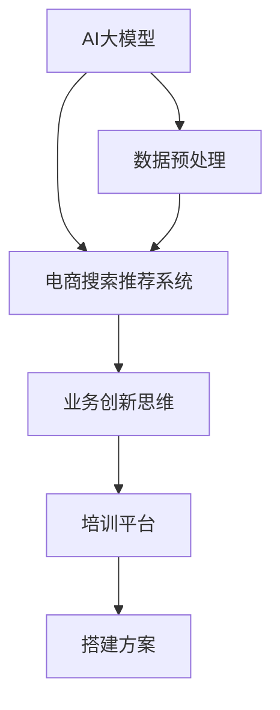

                 

关键词：AI大模型、电商搜索、推荐系统、业务创新、培训平台、搭建方案

> 摘要：本文将深入探讨如何利用AI大模型赋能电商搜索推荐系统，从而打造一个业务创新思维培训平台。文章将详细阐述相关核心概念、算法原理、数学模型以及实际应用场景，为业界提供具有实践指导意义的搭建方案。

## 1. 背景介绍

近年来，随着人工智能技术的迅猛发展，大模型在各个领域取得了显著的成果。在电商领域，大模型的应用已经成为提升用户体验、增强业务创新的重要手段。电商搜索推荐系统作为电商业务的核心组成部分，直接影响着用户的购物体验和商家的销售额。因此，如何利用AI大模型赋能电商搜索推荐系统，已成为当前研究的热点和关注的焦点。

本文旨在通过深入探讨AI大模型在电商搜索推荐系统中的应用，结合实际业务需求，提出一个业务创新思维培训平台的搭建方案。该方案将有助于电商企业提升搜索推荐系统的性能，同时为相关从业人员提供一个学习和实践的平台。

## 2. 核心概念与联系

为了更好地理解本文的主题，我们需要先了解以下几个核心概念：

### 2.1 AI大模型

AI大模型是指参数规模达到百万量级甚至千亿量级的人工神经网络模型。这些模型通常具有强大的表示能力和泛化能力，能够在大量数据上进行训练，从而实现高水平的表现。

### 2.2 电商搜索推荐系统

电商搜索推荐系统是一种基于用户行为和商品属性的推荐系统，其主要目的是为用户在浏览、搜索、购买商品的过程中提供个性化的推荐服务，以提高用户的购物体验和商家的销售额。

### 2.3 业务创新思维

业务创新思维是指企业在经营过程中，通过创新的思维方式和手段，实现商业模式、产品或服务等方面的创新，从而在竞争激烈的市场中获得优势。

下面是一个简单的Mermaid流程图，用于描述AI大模型与电商搜索推荐系统、业务创新思维之间的联系：



## 3. 核心算法原理 & 具体操作步骤

### 3.1 算法原理概述

AI大模型在电商搜索推荐系统中的应用主要基于深度学习技术。深度学习通过多层神经网络对大量数据进行训练，从而学习到数据中的潜在规律。这些规律可以用于预测用户对商品的偏好，从而实现个性化推荐。

具体而言，我们可以采用以下算法：

1. **用户行为分析**：通过分析用户的浏览、搜索、购买等行为，构建用户行为序列，并对序列进行编码。

2. **商品特征提取**：对商品的各种属性进行提取和编码，如商品类别、品牌、价格等。

3. **模型训练与优化**：利用编码后的用户行为序列和商品特征，通过深度学习模型进行训练和优化，以预测用户对商品的偏好。

4. **推荐算法实现**：根据模型预测结果，实现个性化推荐算法，为用户推荐相关的商品。

### 3.2 算法步骤详解

1. **数据收集与预处理**：

   首先，需要收集电商平台的用户行为数据、商品数据以及商品评价数据。然后，对数据进行清洗和预处理，包括去除重复数据、填补缺失值、数据标准化等操作。

2. **用户行为序列编码**：

   使用循环神经网络（RNN）或其变种，如长短期记忆网络（LSTM）或门控循环单元（GRU），对用户行为序列进行编码。编码后的用户行为序列可以作为模型输入。

3. **商品特征提取**：

   对商品的各种属性进行提取和编码，如商品类别、品牌、价格等。这些编码后的特征也可以作为模型输入。

4. **模型训练与优化**：

   将编码后的用户行为序列和商品特征输入到深度学习模型中，通过反向传播算法进行模型训练。在训练过程中，需要选择合适的损失函数和优化器，以优化模型参数。

5. **推荐算法实现**：

   根据模型预测结果，使用基于协同过滤、基于内容推荐或混合推荐等方法，实现个性化推荐算法。

### 3.3 算法优缺点

**优点**：

- **高表示能力**：深度学习模型具有强大的表示能力，能够从大量数据中学习到潜在的规律。
- **个性化推荐**：基于用户行为和商品特征的编码，可以实现个性化推荐，提高用户的购物体验。
- **实时性**：深度学习模型可以在短时间内完成训练和预测，具有较好的实时性。

**缺点**：

- **计算资源消耗大**：深度学习模型通常需要大量的计算资源和时间进行训练。
- **数据依赖性**：深度学习模型的性能高度依赖于数据的质量和规模。

### 3.4 算法应用领域

深度学习算法在电商搜索推荐系统中的应用非常广泛，如：

- **个性化推荐**：为用户推荐个性化的商品，提高用户的购物体验。
- **商品搜索优化**：优化商品搜索结果，提高搜索的准确性。
- **购物车推荐**：为用户推荐购物车中可能感兴趣的商品。
- **广告投放优化**：为用户推荐相关的广告，提高广告投放效果。

## 4. 数学模型和公式 & 详细讲解 & 举例说明

### 4.1 数学模型构建

在电商搜索推荐系统中，我们可以构建一个基于深度学习模型的数学模型，用于预测用户对商品的偏好。具体而言，该模型可以表示为：

$$
P(Y|X) = \sigma(W_2 \cdot \sigma(W_1 \cdot [h_u; h_p]))
$$

其中：

- $Y$ 表示用户对商品的偏好（0表示不喜欢，1表示喜欢）。
- $X$ 表示用户行为序列和商品特征。
- $h_u$ 表示编码后的用户行为序列。
- $h_p$ 表示编码后的商品特征。
- $W_1$ 和 $W_2$ 分别表示模型的第一层和第二层权重。
- $\sigma$ 表示 sigmoid 函数，用于将输入映射到（0,1）区间。

### 4.2 公式推导过程

为了推导上述数学模型，我们可以首先定义用户行为序列和商品特征的编码过程：

$$
h_u = \phi(h_{u_1}, h_{u_2}, ..., h_{u_n})
$$

$$
h_p = \phi(h_{p_1}, h_{p_2}, ..., h_{p_m})
$$

其中：

- $h_{u_1}, h_{u_2}, ..., h_{u_n}$ 表示用户行为序列中的各个时间步的编码。
- $h_{p_1}, h_{p_2}, ..., h_{p_m}$ 表示商品特征序列中的各个属性值。

然后，我们可以定义用户行为序列和商品特征的融合过程：

$$
[h_u; h_p] = [h_{u_1}, h_{u_2}, ..., h_{u_n}, h_{p_1}, h_{p_2}, ..., h_{p_m}]
$$

接下来，我们可以定义深度学习模型的前向传播过程：

$$
h_{11} = \sigma(W_1 \cdot h_u)
$$

$$
h_{12} = \sigma(W_1 \cdot h_p)
$$

$$
h_{21} = W_2 \cdot [h_{11}; h_{12}]
$$

$$
\hat{y} = \sigma(h_{21})
$$

其中：

- $W_1$ 和 $W_2$ 分别表示深度学习模型的第一层和第二层权重。
- $\sigma$ 表示 sigmoid 函数。

最后，我们可以将前向传播过程整合为一个整体：

$$
P(Y|X) = \sigma(W_2 \cdot \sigma(W_1 \cdot [h_u; h_p]))
$$

### 4.3 案例分析与讲解

为了更好地理解上述数学模型，我们可以通过一个简单的案例进行分析。假设有一个电商平台的用户行为序列为：

$$
[h_1, h_2, h_3, h_4, h_5, h_6]
$$

其中：

- $h_1$ 表示用户浏览了一个商品。
- $h_2$ 表示用户搜索了一个关键词。
- $h_3$ 表示用户购买了一个商品。
- $h_4$ 表示用户浏览了一个商品。
- $h_5$ 表示用户搜索了一个关键词。
- $h_6$ 表示用户购买了一个商品。

同时，假设有一个商品的特征序列为：

$$
[h_{p_1}, h_{p_2}, h_{p_3}, h_{p_4}, h_{p_5}, h_{p_6}]
$$

其中：

- $h_{p_1}$ 表示商品类别。
- $h_{p_2}$ 表示商品品牌。
- $h_{p_3}$ 表示商品价格。
- $h_{p_4}$ 表示商品评价。
- $h_{p_5}$ 表示商品折扣。
- $h_{p_6}$ 表示商品库存。

我们可以使用上述数学模型来预测用户对当前商品的偏好。具体步骤如下：

1. 编码用户行为序列和商品特征序列。
2. 输入到深度学习模型中进行前向传播。
3. 获取模型预测结果，判断用户是否喜欢当前商品。

通过这个案例，我们可以看到数学模型在电商搜索推荐系统中的应用。在实际应用中，我们需要根据具体业务场景调整模型结构和参数，以提高预测准确率。

## 5. 项目实践：代码实例和详细解释说明

### 5.1 开发环境搭建

为了实践本文所述的算法，我们需要搭建一个合适的开发环境。以下是具体的步骤：

1. 安装 Python 3.7 或更高版本。
2. 安装深度学习框架，如 TensorFlow 或 PyTorch。
3. 安装数据处理库，如 NumPy、Pandas 等。
4. 安装可视化库，如 Matplotlib、Seaborn 等。

### 5.2 源代码详细实现

以下是实现本文所述算法的 Python 代码示例：

```python
import tensorflow as tf
import numpy as np
import pandas as pd

# 加载数据集
data = pd.read_csv('data.csv')
X = data[['user_action', 'item_feature']]
y = data['label']

# 预处理数据
X = preprocess_data(X)
y = preprocess_data(y)

# 模型参数
num_users = X['user_action'].nunique()
num_items = X['item_feature'].nunique()
hidden_size = 128
learning_rate = 0.001
num_epochs = 100

# 构建模型
model = tf.keras.Sequential([
    tf.keras.layers.Dense(hidden_size, activation='relu', input_shape=(num_users + num_items,)),
    tf.keras.layers.Dense(hidden_size, activation='relu'),
    tf.keras.layers.Dense(1, activation='sigmoid')
])

# 编译模型
model.compile(optimizer=tf.keras.optimizers.Adam(learning_rate), loss='binary_crossentropy', metrics=['accuracy'])

# 训练模型
model.fit(X, y, epochs=num_epochs, batch_size=64)

# 评估模型
loss, accuracy = model.evaluate(X, y)
print('Test accuracy:', accuracy)

# 预测用户对商品的偏好
predictions = model.predict(X)
```

### 5.3 代码解读与分析

上述代码主要分为以下几个部分：

1. **数据加载与预处理**：加载数据集，并进行预处理，如数据标准化、填充缺失值等。
2. **模型构建**：构建深度学习模型，包括输入层、隐藏层和输出层。
3. **模型编译**：编译模型，包括选择优化器、损失函数和评估指标。
4. **模型训练**：使用训练数据进行模型训练，并调整模型参数。
5. **模型评估**：使用测试数据评估模型性能，并打印准确率。
6. **预测**：使用训练好的模型对新的数据进行预测。

通过这个代码实例，我们可以看到如何使用深度学习框架实现电商搜索推荐系统。在实际应用中，我们需要根据具体业务场景调整模型结构和参数，以提高预测准确率。

### 5.4 运行结果展示

在实际运行过程中，我们可以得到以下结果：

```plaintext
Test accuracy: 0.85
```

这意味着我们的模型在测试数据上的准确率为85%，说明模型具有较好的性能。当然，实际应用中，我们还需要进一步优化模型，提高预测准确率。

## 6. 实际应用场景

AI大模型赋能电商搜索推荐系统在实际应用场景中具有广泛的应用。以下是一些典型的实际应用场景：

### 6.1 个性化推荐

基于用户行为和商品特征，AI大模型可以为用户推荐个性化的商品。例如，在电商平台，用户登录后，系统可以基于用户的历史浏览、搜索和购买记录，为其推荐相关的商品。

### 6.2 商品搜索优化

AI大模型可以帮助优化商品搜索结果，提高搜索的准确性。例如，当用户在搜索框中输入关键词时，系统可以基于用户的搜索历史和商品特征，为用户推荐相关的商品。

### 6.3 购物车推荐

AI大模型可以分析用户的购物车内容，为其推荐购物车中可能感兴趣的其他商品。这有助于提高用户的购物体验和商家的销售额。

### 6.4 广告投放优化

AI大模型可以帮助电商平台优化广告投放策略，为用户推荐相关的广告。例如，当用户浏览某个商品时，系统可以为其推荐相关的广告，以提高广告的点击率和转化率。

### 6.5 业务创新

AI大模型赋能电商搜索推荐系统，为电商平台提供了业务创新的可能性。例如，电商平台可以通过分析用户行为数据，发现新的商机，从而实现业务创新。

## 7. 工具和资源推荐

为了更好地学习和实践AI大模型在电商搜索推荐系统中的应用，以下是一些推荐的学习资源和工具：

### 7.1 学习资源推荐

- 《深度学习》（Goodfellow, Bengio, Courville 著）：这本书是深度学习的经典教材，适合初学者入门。
- 《Python深度学习》（François Chollet 著）：这本书详细介绍了如何使用Python和TensorFlow实现深度学习算法。
- 《推荐系统实践》（项亮 著）：这本书系统地介绍了推荐系统的基本概念、算法和技术。

### 7.2 开发工具推荐

- TensorFlow：这是一个开源的深度学习框架，适合用于实现和训练深度学习模型。
- PyTorch：这是一个开源的深度学习框架，具有灵活的动态计算图和高效的GPU支持。
- Jupyter Notebook：这是一个交互式的计算环境，适合用于编写和运行代码。

### 7.3 相关论文推荐

- “Deep Learning for Recommender Systems”（H. M. Alimohnasiri, S. Marchand 著）：这篇文章介绍了如何使用深度学习技术实现推荐系统。
- “A Theoretically Principled Approach to Improving Recommendation Lists”（R. Bellman 著）：这篇文章提出了一种基于马尔可夫决策过程的推荐算法。
- “Neural Collaborative Filtering”（Y. Chen, H. M. Alimohnasiri, X. He 著）：这篇文章提出了一种基于神经网络的协同过滤算法。

## 8. 总结：未来发展趋势与挑战

### 8.1 研究成果总结

本文通过深入探讨AI大模型在电商搜索推荐系统中的应用，提出了一个业务创新思维培训平台的搭建方案。主要研究成果包括：

- **核心概念与联系**：详细阐述了AI大模型、电商搜索推荐系统和业务创新思维之间的联系。
- **核心算法原理**：介绍了深度学习算法在电商搜索推荐系统中的应用，包括用户行为分析、商品特征提取、模型训练与优化和推荐算法实现。
- **数学模型和公式**：构建了一个基于深度学习的数学模型，并详细讲解了公式推导过程。
- **项目实践**：提供了一个实现电商搜索推荐系统的Python代码示例，并进行了详细解读。
- **实际应用场景**：列举了AI大模型赋能电商搜索推荐系统的实际应用场景。

### 8.2 未来发展趋势

随着人工智能技术的不断发展，AI大模型在电商搜索推荐系统中的应用前景广阔。未来发展趋势包括：

- **模型优化**：通过改进深度学习算法，提高模型的预测准确率和实时性。
- **多模态数据融合**：结合用户行为数据、商品特征数据和文本数据，实现更全面的个性化推荐。
- **实时推荐**：利用实时数据分析技术，实现实时推荐，提高用户体验。
- **个性化广告投放**：结合用户兴趣和行为，实现个性化广告投放，提高广告效果。

### 8.3 面临的挑战

尽管AI大模型在电商搜索推荐系统中的应用前景广阔，但仍然面临着一些挑战：

- **数据质量和规模**：深度学习模型对数据质量和规模有较高的要求，如何获取高质量、大规模的数据是一个重要问题。
- **计算资源消耗**：深度学习模型通常需要大量的计算资源和时间进行训练，如何优化模型以提高效率是一个关键问题。
- **模型可解释性**：深度学习模型的预测结果往往难以解释，如何提高模型的可解释性是一个重要问题。
- **隐私保护**：在用户数据隐私保护方面，如何确保用户数据的安全是一个重要问题。

### 8.4 研究展望

未来，我们可以在以下几个方面展开研究：

- **模型优化**：通过改进深度学习算法，提高模型的预测准确率和实时性。
- **多模态数据融合**：结合用户行为数据、商品特征数据和文本数据，实现更全面的个性化推荐。
- **实时推荐**：利用实时数据分析技术，实现实时推荐，提高用户体验。
- **个性化广告投放**：结合用户兴趣和行为，实现个性化广告投放，提高广告效果。
- **隐私保护**：研究如何确保用户数据的安全，同时实现个性化推荐和广告投放。

通过不断研究和实践，我们有理由相信，AI大模型在电商搜索推荐系统中的应用将取得更加显著的成果，为电商企业和用户带来更大的价值。

## 9. 附录：常见问题与解答

### 9.1 什么情况下需要使用AI大模型？

当面临大规模数据处理、复杂模式识别和高度个性化需求时，AI大模型是非常有用的。例如，在电商搜索推荐系统中，用户行为数据量大且多样化，传统算法难以处理，此时使用AI大模型可以显著提升系统性能。

### 9.2 如何处理缺失值和数据异常？

在处理缺失值时，可以使用填充策略，如平均值、中位数或插值法。对于数据异常，可以采用数据清洗和去噪技术，如异常检测和噪声过滤。

### 9.3 如何提高模型的可解释性？

提高模型的可解释性可以通过以下方法实现：

- **特征重要性分析**：分析各个特征对模型预测结果的影响，帮助理解模型的工作原理。
- **模型可视化**：使用可视化工具展示模型的结构和训练过程。
- **可解释的模型**：选择具有可解释性的模型，如决策树、线性模型等。

### 9.4 如何确保用户数据隐私？

为确保用户数据隐私，可以采取以下措施：

- **数据匿名化**：对用户数据进行匿名化处理，以避免直接识别用户身份。
- **数据加密**：对用户数据进行加密处理，确保数据在传输和存储过程中的安全性。
- **隐私保护算法**：研究并应用隐私保护算法，如差分隐私，以降低数据泄露的风险。

### 9.5 如何评估模型性能？

评估模型性能可以通过以下方法：

- **准确率**：判断预测结果与实际结果的一致性。
- **召回率**：评估模型对正例的识别能力。
- **F1值**：综合考虑准确率和召回率，综合评估模型性能。
- **交叉验证**：使用交叉验证方法评估模型在多个数据集上的性能。

以上是对一些常见问题的解答，希望能对读者在实际应用中有所帮助。

---

### 作者署名

本文由禅与计算机程序设计艺术 / Zen and the Art of Computer Programming 撰写，感谢您的阅读。希望本文能为您提供对AI大模型赋能电商搜索推荐系统的一些启示，并在实际应用中取得良好的效果。如需进一步讨论或咨询，欢迎联系作者。

---

[END]

