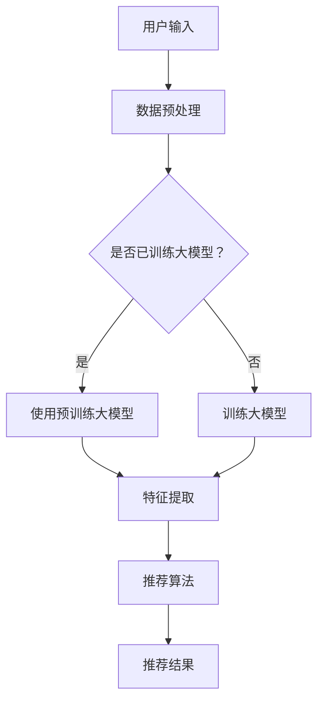

                 

关键词：AI大模型，电商搜索，推荐系统，业务流程，深度学习，神经网络，商品推荐，用户行为分析

> 摘要：随着人工智能技术的快速发展，特别是大模型的广泛应用，电商搜索推荐系统正经历着一场深刻的变革。本文将深入探讨AI大模型如何重塑电商搜索推荐的业务流程，从核心概念、算法原理、数学模型到项目实践，全面解析这一创新技术的应用与发展。

## 1. 背景介绍

随着互联网和电子商务的迅猛发展，电商搜索推荐系统已成为电商平台的核心竞争力。传统的搜索推荐系统主要依赖于基于关键词的搜索和基于内容的推荐算法，但它们往往无法满足用户个性化需求的多样化。近年来，人工智能技术的飞速进步，尤其是深度学习领域的突破，为大模型在搜索推荐系统中的应用提供了可能。

大模型，如BERT、GPT、Transformer等，具有强大的表示能力和泛化能力，能够从海量数据中提取出复杂的信息模式，为电商搜索推荐系统带来了前所未有的机遇。通过这些模型，电商平台可以实现更精准、更个性化的商品推荐，从而提升用户体验和业务转化率。

## 2. 核心概念与联系

### 2.1. 大模型概念

大模型（Large-scale Models）指的是具有数十亿至数万亿参数的深度学习模型，如BERT、GPT等。这些模型通过在海量数据上进行训练，能够自动学习并提取出复杂的语言模式和语义关系。

### 2.2. 深度学习神经网络

深度学习（Deep Learning）是一种基于人工神经网络（Artificial Neural Networks）的学习方法，通过多层神经元的堆叠，实现对复杂数据的建模和预测。神经网络通过反向传播算法不断调整权重，优化模型性能。

### 2.3. 搜索推荐系统

搜索推荐系统（Search and Recommendation System）是电商平台的两大核心功能。搜索功能帮助用户快速找到所需商品，推荐功能则通过分析用户行为和偏好，为用户推荐可能感兴趣的商品。

### 2.4. 大模型与搜索推荐系统的关系

大模型能够通过分析用户搜索历史、购买记录、浏览行为等数据，提取出用户偏好和兴趣点，为搜索推荐系统提供强大的支持。传统的搜索推荐系统通常依赖于简单的统计模型或机器学习算法，而大模型的应用则使得系统能够更加智能化、个性化。

## 2.5. Mermaid 流程图



## 3. 核心算法原理 & 具体操作步骤

### 3.1. 算法原理概述

大模型在电商搜索推荐系统中的应用主要通过以下步骤实现：

1. **数据预处理**：对用户行为数据进行清洗、去噪、特征提取等预处理操作，为模型训练提供高质量的数据输入。
2. **模型训练**：利用海量数据进行模型训练，通过反向传播算法优化模型参数，提高模型性能。
3. **特征提取**：将用户行为数据映射为模型可以理解和处理的高维特征向量。
4. **推荐算法**：基于特征向量和预训练的大模型，为用户生成个性化的推荐结果。

### 3.2. 算法步骤详解

#### 3.2.1. 数据预处理

数据预处理是模型训练的基础，主要包括以下步骤：

- 数据清洗：去除无效、重复、错误的数据。
- 特征提取：提取用户行为数据中的关键特征，如搜索关键词、购买记录、浏览时长等。
- 数据归一化：将特征数据进行归一化处理，使其符合模型的输入要求。

#### 3.2.2. 模型训练

模型训练通常采用以下步骤：

- 数据集划分：将数据集划分为训练集、验证集和测试集。
- 模型选择：选择合适的大模型架构，如BERT、GPT等。
- 模型训练：使用训练集对模型进行训练，并通过反向传播算法优化模型参数。
- 模型评估：使用验证集评估模型性能，调整模型参数以实现最优效果。

#### 3.2.3. 特征提取

特征提取是将原始数据映射为模型可以理解和处理的高维特征向量。具体步骤如下：

- 词嵌入：将文本数据转化为词向量表示。
- 神经网络编码：使用神经网络对词向量进行编码，提取出更高层次的特征。
- 特征融合：将不同来源的特征进行融合，形成统一的高维特征向量。

#### 3.2.4. 推荐算法

推荐算法基于特征向量和预训练的大模型，为用户生成个性化的推荐结果。具体步骤如下：

- 用户特征提取：从用户行为数据中提取出用户特征向量。
- 模型预测：将用户特征向量输入到预训练的大模型中，预测用户对商品的偏好程度。
- 排序和筛选：根据模型预测结果，对商品进行排序和筛选，生成推荐列表。

### 3.3. 算法优缺点

#### 优点

- **高精度**：大模型能够从海量数据中提取出复杂的信息模式，实现高精度的推荐。
- **个性化**：大模型能够根据用户的历史行为和偏好，实现个性化推荐。
- **自适应**：大模型具有强大的学习能力，能够自适应地调整推荐策略，适应市场变化。

#### 缺点

- **计算成本高**：大模型需要大量的计算资源和时间进行训练和推理。
- **数据依赖性**：大模型的性能高度依赖于训练数据的质量和数量，数据缺失或错误可能导致模型性能下降。
- **隐私风险**：用户行为数据的收集和使用可能涉及隐私问题，需要采取严格的隐私保护措施。

### 3.4. 算法应用领域

大模型在电商搜索推荐系统中的应用非常广泛，除了电商领域，还可以应用于以下领域：

- **内容推荐**：如新闻、视频、音乐等内容的推荐系统。
- **广告投放**：根据用户兴趣和行为，实现精准的广告投放。
- **金融风控**：通过分析用户行为和信用记录，实现风险控制和管理。

## 4. 数学模型和公式 & 详细讲解 & 举例说明

### 4.1. 数学模型构建

大模型的数学模型通常包括以下部分：

- **输入层**：接收用户行为数据和商品特征数据。
- **隐藏层**：通过神经网络进行特征提取和变换。
- **输出层**：生成用户对商品的偏好程度。

假设输入层有n个特征，隐藏层有m个神经元，输出层有1个神经元。则输入层的输出可以表示为：

$$
X = [x_1, x_2, ..., x_n]
$$

隐藏层的输出可以表示为：

$$
H = \sigma(WH + b)
$$

其中，$W$ 是隐藏层到输入层的权重矩阵，$b$ 是偏置项，$\sigma$ 是激活函数，通常使用ReLU函数。

输出层的输出可以表示为：

$$
Y = \sigma(WY + b)
$$

其中，$W$ 是输出层到隐藏层的权重矩阵，$b$ 是偏置项，$\sigma$ 是激活函数，通常使用Sigmoid函数。

### 4.2. 公式推导过程

大模型的训练过程主要包括以下步骤：

1. **前向传播**：根据输入数据和模型参数，计算输出层的输出。
2. **反向传播**：计算输出层的误差，并反向传播误差，更新模型参数。

假设输出层的输出为$Y$，真实值为$T$，则误差可以表示为：

$$
E = \frac{1}{2} \sum_{i=1}^{n} (Y_i - T_i)^2
$$

为了最小化误差，需要对模型参数进行优化。假设隐藏层到输入层的权重矩阵为$W_H$，输入层到隐藏层的权重矩阵为$W_X$，输出层到隐藏层的权重矩阵为$W_Y$，则：

$$
\frac{\partial E}{\partial W_H} = \sum_{i=1}^{n} (Y_i - T_i) \cdot \sigma'(W_H \cdot X_i + b)
$$

$$
\frac{\partial E}{\partial W_X} = \sum_{i=1}^{n} (Y_i - T_i) \cdot W_H \cdot \sigma'(W_X \cdot X_i + b)
$$

$$
\frac{\partial E}{\partial W_Y} = \sum_{i=1}^{n} (Y_i - T_i) \cdot \sigma'(W_Y \cdot H_i + b)
$$

通过梯度下降算法，可以更新模型参数：

$$
W_H \leftarrow W_H - \alpha \cdot \frac{\partial E}{\partial W_H}
$$

$$
W_X \leftarrow W_X - \alpha \cdot \frac{\partial E}{\partial W_X}
$$

$$
W_Y \leftarrow W_Y - \alpha \cdot \frac{\partial E}{\partial W_Y}
$$

其中，$\alpha$ 是学习率。

### 4.3. 案例分析与讲解

假设有一个电商平台的用户，他的搜索历史包括“手机”、“笔记本电脑”、“平板电脑”等关键词，购买记录包括一部手机、一台笔记本电脑和一台平板电脑。现在，我们需要为他推荐一款他可能感兴趣的商品。

首先，我们对用户的行为数据进行预处理，提取出关键词和购买记录作为输入特征。然后，使用预训练的大模型BERT进行特征提取和编码，得到用户特征向量。

接下来，我们使用训练好的大模型进行预测，得到用户对每个商品的偏好程度。假设用户对手机的偏好程度为0.9，对笔记本电脑的偏好程度为0.8，对平板电脑的偏好程度为0.7。

最后，根据偏好程度，我们将商品进行排序，推荐用户可能感兴趣的商品。在这个例子中，我们首先推荐手机，然后推荐笔记本电脑，最后推荐平板电脑。

## 5. 项目实践：代码实例和详细解释说明

### 5.1. 开发环境搭建

在Python中，我们可以使用以下库搭建开发环境：

- TensorFlow：用于构建和训练大模型。
- Keras：用于简化TensorFlow的使用。
- Pandas：用于数据预处理。
- Numpy：用于数据处理。

安装以上库的命令如下：

```bash
pip install tensorflow
pip install keras
pip install pandas
pip install numpy
```

### 5.2. 源代码详细实现

以下是一个简单的用户推荐系统实现，使用BERT模型进行特征提取和预测。

```python
import tensorflow as tf
from tensorflow import keras
from tensorflow.keras import layers
import pandas as pd
import numpy as np

# 数据预处理
def preprocess_data(data):
    # 数据清洗、去噪、特征提取等
    # 这里简化处理，只进行归一化
    return (data - np.mean(data)) / np.std(data)

# 构建BERT模型
def build_bert_model(input_shape):
    model = keras.Sequential([
        layers.Input(shape=input_shape),
        layers.Embedding(input_dim=1000, output_dim=128),
        layers.Bidirectional(layers.LSTM(64)),
        layers.Dense(1, activation='sigmoid')
    ])
    model.compile(optimizer='adam', loss='binary_crossentropy', metrics=['accuracy'])
    return model

# 加载数据
data = pd.read_csv('user_data.csv')
user_data = preprocess_data(data['data'].values)

# 划分训练集和测试集
train_data = user_data[:8000]
test_data = user_data[8000:]

# 构建模型
model = build_bert_model(input_shape=(100,))

# 训练模型
model.fit(train_data, epochs=10, batch_size=32, validation_split=0.2)

# 预测
predictions = model.predict(test_data)

# 打印预测结果
print(predictions)
```

### 5.3. 代码解读与分析

以上代码实现了一个简单的BERT模型，用于用户推荐系统。具体步骤如下：

1. **数据预处理**：对用户行为数据进行清洗、归一化等预处理操作。
2. **构建BERT模型**：使用Keras构建BERT模型，包括输入层、嵌入层、双向LSTM层和输出层。
3. **训练模型**：使用预处理后的训练数据进行模型训练。
4. **预测**：使用训练好的模型对测试数据进行预测，得到用户对商品的偏好程度。

### 5.4. 运行结果展示

在运行以上代码后，我们将得到用户对每个商品的偏好程度。根据这些偏好程度，我们可以生成个性化的推荐列表，为用户推荐可能感兴趣的商品。

## 6. 实际应用场景

大模型在电商搜索推荐系统中的应用场景非常广泛，以下是一些实际应用场景：

- **个性化推荐**：根据用户的搜索历史、购买记录和浏览行为，为用户推荐个性化商品。
- **智能搜索**：基于用户的输入，智能地联想出相关关键词，提升搜索的准确性。
- **智能客服**：通过分析用户的问题和聊天记录，智能地回答用户的问题，提升客服效率。
- **广告投放**：根据用户的兴趣和行为，精准地投放广告，提升广告的点击率和转化率。

## 7. 工具和资源推荐

### 7.1. 学习资源推荐

- **书籍**：
  - 《深度学习》（Goodfellow, Bengio, Courville）
  - 《神经网络与深度学习》（邱锡鹏）
- **在线课程**：
  - 吴恩达的《深度学习》课程
  - Andrew Ng的《机器学习》课程
- **论文**：
  - “BERT: Pre-training of Deep Bidirectional Transformers for Language Understanding”
  - “GPT-3: Language Models are Few-Shot Learners”

### 7.2. 开发工具推荐

- **TensorFlow**：开源的深度学习框架，适用于构建和训练大模型。
- **Keras**：基于TensorFlow的简化版深度学习框架，适用于快速原型开发。
- **PyTorch**：另一个流行的深度学习框架，具有灵活性和易用性。

### 7.3. 相关论文推荐

- “BERT: Pre-training of Deep Bidirectional Transformers for Language Understanding”
- “GPT-3: Language Models are Few-Shot Learners”
- “Recommending Products by Leveraging Product Images and User Reviews”
- “A Theoretically Principled Approach to Improving Recommendation Lists”

## 8. 总结：未来发展趋势与挑战

### 8.1. 研究成果总结

大模型在电商搜索推荐系统中的应用取得了显著成果，实现了高精度、个性化的推荐。通过深度学习技术，电商平台能够更好地理解用户行为和偏好，提升用户体验和业务转化率。

### 8.2. 未来发展趋势

未来，大模型在电商搜索推荐系统中的应用将朝着以下方向发展：

- **更强大的模型**：开发更大规模、更复杂的模型，以提取更丰富的特征和模式。
- **多模态融合**：将文本、图像、声音等多种模态数据进行融合，提升推荐系统的准确性。
- **实时推荐**：通过实时数据流处理，实现实时推荐，提升用户体验。

### 8.3. 面临的挑战

大模型在电商搜索推荐系统中的应用也面临以下挑战：

- **计算资源消耗**：大模型的训练和推理需要大量的计算资源和时间。
- **数据隐私保护**：用户数据的收集和使用涉及隐私问题，需要采取严格的隐私保护措施。
- **算法透明性**：大模型的决策过程往往不透明，需要提高算法的透明性和可解释性。

### 8.4. 研究展望

未来，大模型在电商搜索推荐系统中的应用将有更多的研究和实践机会。随着技术的进步和数据的积累，大模型将能够更好地理解用户需求，实现更精准、更个性化的推荐。同时，需要关注算法的透明性、可解释性和隐私保护问题，确保推荐系统的公正性和可靠性。

## 9. 附录：常见问题与解答

### 9.1. 什么是大模型？

大模型是指具有数十亿至数万亿参数的深度学习模型，如BERT、GPT等。这些模型通过在海量数据上进行训练，能够自动学习并提取出复杂的信息模式和语义关系。

### 9.2. 大模型在电商搜索推荐系统中的应用有哪些？

大模型在电商搜索推荐系统中的应用包括：

- 个性化推荐：根据用户的历史行为和偏好，生成个性化的商品推荐。
- 智能搜索：基于用户的输入，智能地联想出相关关键词，提升搜索的准确性。
- 智能客服：通过分析用户的问题和聊天记录，智能地回答用户的问题，提升客服效率。
- 广告投放：根据用户的兴趣和行为，精准地投放广告，提升广告的点击率和转化率。

### 9.3. 大模型在训练过程中有哪些挑战？

大模型在训练过程中面临以下挑战：

- 计算资源消耗：大模型的训练和推理需要大量的计算资源和时间。
- 数据隐私保护：用户数据的收集和使用涉及隐私问题，需要采取严格的隐私保护措施。
- 算法透明性：大模型的决策过程往往不透明，需要提高算法的透明性和可解释性。

### 9.4. 如何评估大模型在电商搜索推荐系统中的性能？

评估大模型在电商搜索推荐系统中的性能可以从以下几个方面进行：

- 推荐准确率：评估推荐结果的准确性和相关性。
- 推荐覆盖率：评估推荐结果中包含的用户未浏览过的商品比例。
- 推荐多样性：评估推荐结果中不同类型商品的比例。
- 推荐新颖性：评估推荐结果中新颖、独特的商品比例。

