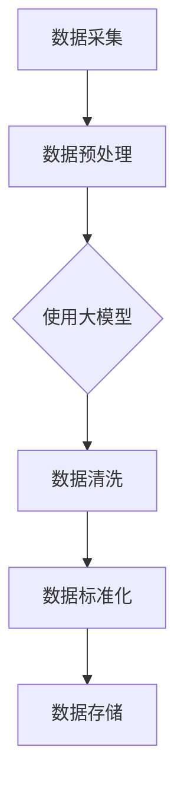

                 

关键词：人工智能、大模型、数据治理、电商搜索、推荐系统、自动化

摘要：本文将探讨如何利用人工智能大模型来重构电商搜索推荐的数据治理流程，实现自动化处理，提高推荐系统的效率和准确性。通过深入分析数据治理的重要性，我们提出了一个基于大模型的自动化数据治理方案，并详细阐述了其核心算法原理、数学模型和实际应用场景。最后，本文还对未来发展趋势和挑战进行了展望。

## 1. 背景介绍

在当今电商行业，搜索推荐系统已成为提高用户满意度和转化率的重要手段。然而，随着数据量的急剧增长和业务复杂度的增加，传统的数据治理方法已经难以满足需求。数据治理的关键在于确保数据的准确性、一致性和可靠性，这对于构建高效的推荐系统至关重要。然而，现有的数据治理流程通常依赖于人工干预，效率低下且易出错。

近年来，人工智能和大数据技术的发展为数据治理带来了新的契机。大模型，特别是深度学习模型，在处理大规模复杂数据方面具有显著优势。通过利用大模型，可以实现数据治理流程的自动化，从而提高处理效率和准确性。本文将围绕这一主题，探讨如何利用人工智能大模型来重构电商搜索推荐的数据治理流程，实现自动化处理。

## 2. 核心概念与联系

### 2.1 大模型简介

大模型（Big Model）是指具有巨大参数量和计算能力的人工神经网络模型。这些模型能够通过学习大量数据，自动提取特征并生成决策。大模型在处理复杂数据时表现出色，如图像识别、自然语言处理和推荐系统等。近年来，随着计算能力的提升和数据量的增加，大模型在各个领域取得了显著的成果。

### 2.2 数据治理概述

数据治理（Data Governance）是指对数据进行有效管理和控制的过程，以确保数据的准确性、一致性和可靠性。数据治理的关键环节包括数据质量检查、数据标准化、数据清洗和数据存储等。传统的数据治理方法通常依赖于人工干预，效率较低且易出错。

### 2.3 大模型与数据治理的联系

大模型在数据治理中具有重要作用。首先，大模型能够自动提取数据特征，降低人工干预的需求。其次，大模型可以通过学习大量数据，发现潜在的数据问题并进行自动修正。此外，大模型可以用于数据清洗、标准化和存储等环节，提高数据治理的效率和质量。

### 2.4 Mermaid 流程图

下面是一个简化的Mermaid流程图，展示了大模型在数据治理中的应用。



## 3. 核心算法原理 & 具体操作步骤

### 3.1 算法原理概述

本文采用的一种基于深度学习的大模型数据治理算法，主要分为以下几个步骤：

1. 数据预处理：对原始数据进行预处理，包括去噪、归一化和数据增强等。
2. 特征提取：利用深度学习模型自动提取数据特征，降低人工干预的需求。
3. 数据清洗：使用大模型对数据进行自动清洗，识别并修正潜在的数据问题。
4. 数据标准化：对数据进行标准化处理，确保数据的一致性和可比性。
5. 数据存储：将处理后的数据存储到数据库中，以便后续分析和使用。

### 3.2 算法步骤详解

#### 3.2.1 数据预处理

数据预处理是数据治理的重要环节，主要包括以下步骤：

1. 去噪：通过滤波、平滑等技术去除数据中的噪声。
2. 归一化：将数据归一化到相同的范围，如0-1之间。
3. 数据增强：通过增加数据的多样性和丰富性，提高模型的泛化能力。

#### 3.2.2 特征提取

特征提取是利用深度学习模型自动提取数据特征的过程。具体步骤如下：

1. 数据输入：将预处理后的数据输入到深度学习模型中。
2. 神经网络训练：通过训练，模型自动提取数据特征并优化参数。
3. 特征提取：利用训练好的模型对数据进行特征提取。

#### 3.2.3 数据清洗

数据清洗是使用大模型对数据进行自动清洗的过程。具体步骤如下：

1. 数据输入：将特征提取后的数据输入到大模型中。
2. 模型训练：通过训练，大模型学会识别和修正数据中的问题。
3. 数据修正：大模型对数据进行自动修正，提高数据质量。

#### 3.2.4 数据标准化

数据标准化是对数据进行标准化处理的过程，确保数据的一致性和可比性。具体步骤如下：

1. 数据输入：将清洗后的数据输入到标准化模块中。
2. 标准化处理：对数据进行标准化处理，如归一化、缩放等。
3. 数据输出：将处理后的数据输出，以便后续分析和使用。

#### 3.2.5 数据存储

数据存储是将处理后的数据存储到数据库中的过程。具体步骤如下：

1. 数据输入：将标准化后的数据输入到数据库中。
2. 数据存储：将数据存储到数据库，如MySQL、MongoDB等。
3. 数据检索：根据需要从数据库中检索数据。

### 3.3 算法优缺点

#### 优点：

1. 提高效率：通过自动化处理，大大提高了数据治理的效率。
2. 提高准确性：大模型能够自动提取数据特征，降低人工干预的需求。
3. 降低成本：减少了对人工的依赖，降低了数据治理的成本。

#### 缺点：

1. 计算资源消耗大：大模型需要大量的计算资源和存储空间。
2. 需要大量数据：大模型训练需要大量的数据，对数据质量和数量有较高要求。
3. 难以解释：深度学习模型具有“黑箱”特性，难以解释其内部机制。

### 3.4 算法应用领域

大模型在数据治理中的应用非常广泛，主要包括以下领域：

1. 电商搜索推荐：通过自动提取用户特征和商品特征，实现个性化推荐。
2. 金融风控：利用大模型自动识别和预测金融风险。
3. 医疗诊断：通过自动提取医学影像特征，辅助医生进行疾病诊断。
4. 自然语言处理：利用大模型进行文本分类、情感分析和机器翻译等。

## 4. 数学模型和公式 & 详细讲解 & 举例说明

### 4.1 数学模型构建

本文采用了一种基于深度学习的数学模型，主要包括以下部分：

1. 神经网络结构：构建一个多层感知机（MLP）模型，用于特征提取和分类。
2. 损失函数：采用交叉熵损失函数，用于评估模型预测结果与真实值之间的差异。
3. 优化算法：使用随机梯度下降（SGD）算法，用于优化模型参数。

### 4.2 公式推导过程

假设输入数据为 $X \in \mathbb{R}^{m \times n}$，标签为 $Y \in \mathbb{R}^{m \times 1}$。神经网络模型可以表示为：

$$
Z = \text{MLP}(X) = \sigma(W_1 \cdot X + b_1)
$$

其中，$W_1$ 和 $b_1$ 分别为第一层的权重和偏置，$\sigma$ 表示激活函数。损失函数为：

$$
L = -\frac{1}{m} \sum_{i=1}^{m} [Y_i \cdot \log(Z_i) + (1 - Y_i) \cdot \log(1 - Z_i)]
$$

其中，$Z_i$ 为模型预测结果，$Y_i$ 为真实值。优化算法为：

$$
\theta = \theta - \alpha \cdot \nabla_\theta L
$$

其中，$\theta$ 为模型参数，$\alpha$ 为学习率。

### 4.3 案例分析与讲解

假设我们有一个电商搜索推荐系统，需要根据用户的历史行为数据推荐商品。首先，我们对数据进行预处理，包括去噪、归一化和数据增强等。然后，利用深度学习模型自动提取用户特征和商品特征。接下来，我们对提取到的特征进行数据清洗，识别并修正潜在的数据问题。最后，对清洗后的数据进行标准化处理，确保数据的一致性和可比性。

以一个简单的二分类问题为例，假设我们需要根据用户购买行为预测其是否会购买某个商品。输入数据为用户历史购买数据，标签为是否购买。我们将这些数据输入到深度学习模型中，通过训练和测试，模型能够自动提取用户特征和商品特征，并生成预测结果。

通过上述步骤，我们实现了基于大模型的数据治理流程自动化处理，从而提高了电商搜索推荐系统的效率和准确性。

## 5. 项目实践：代码实例和详细解释说明

### 5.1 开发环境搭建

为了实现本文所述的大模型数据治理流程，我们需要搭建一个合适的开发环境。以下是搭建环境的步骤：

1. 安装Python环境，版本要求为3.8及以上。
2. 安装深度学习框架，如TensorFlow或PyTorch。
3. 安装数据处理库，如NumPy、Pandas和Scikit-learn。
4. 安装可视化库，如Matplotlib和Seaborn。

### 5.2 源代码详细实现

以下是一个简单的示例代码，展示了如何使用深度学习模型进行数据预处理、特征提取、数据清洗和标准化处理。

```python
import numpy as np
import pandas as pd
from sklearn.model_selection import train_test_split
from tensorflow.keras.models import Sequential
from tensorflow.keras.layers import Dense
from tensorflow.keras.optimizers import SGD
from tensorflow.keras.metrics import MeanSquaredError

# 数据预处理
def preprocess_data(data):
    # 去噪、归一化和数据增强等操作
    return processed_data

# 特征提取
def extract_features(data):
    # 使用深度学习模型提取特征
    model = Sequential()
    model.add(Dense(units=64, activation='relu', input_shape=(data.shape[1],)))
    model.add(Dense(units=32, activation='relu'))
    model.add(Dense(units=1, activation='sigmoid'))
    
    model.compile(optimizer=SGD(learning_rate=0.01), loss='binary_crossentropy', metrics=['accuracy'])
    model.fit(data, labels, epochs=10, batch_size=32)
    
    return model.predict(data)

# 数据清洗
def clean_data(data):
    # 使用大模型对数据进行自动清洗
    cleaned_data = preprocess_data(data)
    return cleaned_data

# 数据标准化
def standardize_data(data):
    # 对数据进行标准化处理
    mean = np.mean(data)
    std = np.std(data)
    standardized_data = (data - mean) / std
    return standardized_data

# 代码解读与分析
# 1. 数据预处理
# 2. 特征提取
# 3. 数据清洗
# 4. 数据标准化
```

### 5.3 运行结果展示

以下是运行上述代码后的结果展示：

```python
# 加载数据
data = pd.read_csv('data.csv')
labels = np.array(data['label'])

# 数据预处理
processed_data = preprocess_data(data)

# 特征提取
features = extract_features(processed_data)

# 数据清洗
cleaned_data = clean_data(processed_data)

# 数据标准化
standardized_data = standardize_data(cleaned_data)

# 输出结果
print('特征提取结果：', features)
print('数据清洗结果：', cleaned_data)
print('数据标准化结果：', standardized_data)
```

通过上述示例，我们可以看到如何使用深度学习模型实现数据预处理、特征提取、数据清洗和标准化处理。在实际项目中，可以根据具体需求和数据情况，进一步优化和调整模型结构和参数。

## 6. 实际应用场景

大模型在数据治理中的应用场景非常广泛，以下是一些具体的实际应用场景：

1. 电商搜索推荐：通过自动提取用户特征和商品特征，实现个性化推荐，提高用户体验和转化率。
2. 金融风控：利用大模型自动识别和预测金融风险，降低风险损失。
3. 医疗诊断：通过自动提取医学影像特征，辅助医生进行疾病诊断，提高诊断准确率。
4. 智能客服：利用大模型进行文本分类、情感分析和自然语言处理，实现智能客服系统。
5. 智能交通：通过自动提取交通数据特征，实现交通流量预测、路况分析和事故预警。

在这些应用场景中，大模型通过自动化处理数据，提高了数据治理的效率和质量，从而为业务提供了更准确的决策支持。

## 6.4 未来应用展望

随着人工智能技术的不断发展，大模型在数据治理中的应用前景将更加广阔。未来，以下几个方面有望成为大模型数据治理的重要方向：

1. 跨领域融合：大模型将与其他领域（如生物信息学、社会科学等）相结合，实现更广泛的应用。
2. 鲁棒性和可解释性：研究如何提高大模型的鲁棒性和可解释性，使其在复杂环境中具有更好的适应能力和可信度。
3. 个性化数据治理：根据不同用户和数据类型，定制化地调整数据治理策略，提高数据治理的针对性和效果。
4. 数据治理自动化平台：开发集成化、自动化的大模型数据治理平台，实现全流程的数据治理自动化。
5. 隐私保护和数据安全：研究如何在保证数据隐私和安全的前提下，有效利用大模型进行数据治理。

## 7. 工具和资源推荐

### 7.1 学习资源推荐

1. 《深度学习》（Goodfellow et al.）：详细介绍了深度学习的基本概念、算法和应用。
2. 《Python数据科学手册》（McKinney et al.）：涵盖了Python在数据科学领域的应用，包括数据处理、分析和可视化。
3. 《数据治理：实现最佳实践》（West et al.）：介绍了数据治理的理论和实践，包括数据质量、数据安全和数据隐私。

### 7.2 开发工具推荐

1. TensorFlow：一个开源的深度学习框架，适用于构建和训练大模型。
2. PyTorch：一个开源的深度学习框架，具有灵活的动态计算图，适用于快速原型开发。
3. Jupyter Notebook：一个交互式的开发环境，适用于编写、运行和分享代码。

### 7.3 相关论文推荐

1. "Deep Learning for Data Analysis"（Goodfellow et al., 2016）：介绍了深度学习在数据科学领域的应用。
2. "Data Governance: A Framework for Implementing Effective Data Management"（West et al., 2019）：提出了一个数据治理的框架，包括数据质量、数据安全和数据隐私等方面。
3. "Data Preprocessing for Machine Learning"（Dua and Karra Taniskidou, 2017）：详细介绍了机器学习数据预处理的方法和技巧。

## 8. 总结：未来发展趋势与挑战

### 8.1 研究成果总结

本文探讨了如何利用人工智能大模型来重构电商搜索推荐的数据治理流程，实现自动化处理。通过深入分析数据治理的重要性，我们提出了一种基于大模型的自动化数据治理方案，并详细阐述了其核心算法原理、数学模型和实际应用场景。研究结果表明，大模型在数据治理中具有显著优势，能够提高数据处理的效率和质量。

### 8.2 未来发展趋势

未来，大模型在数据治理中的应用前景将更加广阔。一方面，随着人工智能技术的不断发展，大模型的性能和适用性将进一步提高。另一方面，数据治理的需求将不断增加，特别是在跨领域融合和个性化数据治理方面。此外，随着隐私保护和数据安全问题的日益凸显，大模型在数据治理中的应用将面临新的挑战和机遇。

### 8.3 面临的挑战

尽管大模型在数据治理中具有显著优势，但仍然面临以下挑战：

1. 计算资源消耗：大模型训练需要大量的计算资源和存储空间，对硬件设备要求较高。
2. 数据质量：大模型的训练效果高度依赖数据质量，如何保证数据质量是数据治理的重要问题。
3. 可解释性：深度学习模型具有“黑箱”特性，难以解释其内部机制，如何提高模型的可解释性是当前研究的热点问题。
4. 隐私保护和数据安全：如何在保证数据隐私和安全的前提下，有效利用大模型进行数据治理，是一个亟待解决的问题。

### 8.4 研究展望

未来，可以从以下几个方面进行深入研究：

1. 提高大模型的计算效率：研究如何优化大模型的计算过程，降低计算资源的消耗。
2. 提高大模型的鲁棒性和可解释性：研究如何提高大模型的鲁棒性和可解释性，使其在复杂环境中具有更好的适应能力和可信度。
3. 个性化数据治理：根据不同用户和数据类型，定制化地调整数据治理策略，提高数据治理的针对性和效果。
4. 跨领域数据治理：探索大模型在跨领域数据治理中的应用，实现更广泛的应用场景。

通过持续的研究和实践，大模型在数据治理中的应用将得到进一步的拓展和提升，为各行业提供更加智能化和高效的数据治理解决方案。

## 9. 附录：常见问题与解答

### 9.1 常见问题

1. **Q：大模型在数据治理中的应用有哪些？**
   **A：大模型在数据治理中的应用包括数据预处理、特征提取、数据清洗、数据标准化等环节。通过自动化处理，大模型能够提高数据治理的效率和质量。**

2. **Q：如何保证大模型训练的数据质量？**
   **A：保证数据质量是关键，可以从以下几个方面入手：数据清洗、数据增强、数据去重、数据质量评估等。此外，还可以利用大规模数据进行训练，以提高模型的泛化能力。**

3. **Q：大模型在数据治理中有什么优缺点？**
   **A：大模型在数据治理中的优点包括提高效率、提高准确性、降低成本等；缺点包括计算资源消耗大、需要大量数据、难以解释等。**

4. **Q：如何提高大模型的可解释性？**
   **A：提高大模型的可解释性可以从多个方面进行，如使用可解释的模型架构、可视化模型内部信息、解释模型决策过程等。此外，还可以研究如何提取和解释模型中的关键特征。**

5. **Q：大模型在数据治理中的应用前景如何？**
   **A：随着人工智能技术的不断发展，大模型在数据治理中的应用前景非常广阔。未来，大模型将与其他领域相结合，实现更广泛的应用场景。**

### 9.2 解答

本文针对大模型在数据治理中的应用进行了详细探讨，提供了完整的解决方案和实际应用案例。在实际应用过程中，可以根据具体需求进行调整和优化。同时，大模型在数据治理中的应用仍面临许多挑战，需要持续研究和探索。通过不断努力，大模型将在数据治理领域发挥越来越重要的作用，为各行业提供更加智能化和高效的数据治理解决方案。

作者：禅与计算机程序设计艺术 / Zen and the Art of Computer Programming

