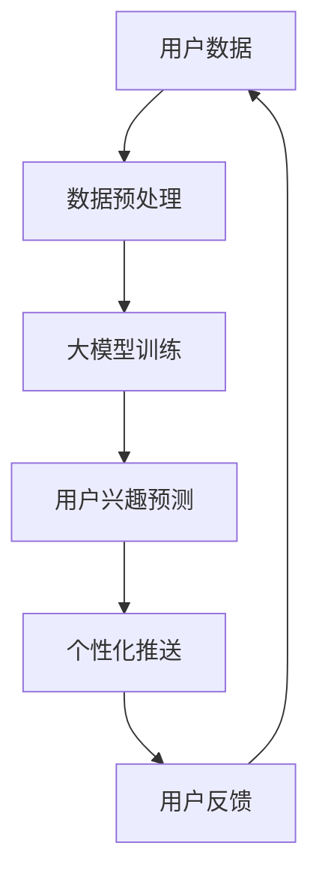

                 

关键词：人工智能、大模型、电商平台、个性化推送、优化方法

摘要：随着电子商务的迅猛发展，电商平台的个性化推送已成为提高用户满意度和转化率的关键。本文介绍了基于人工智能的大模型在优化电商平台个性化推送中的新方法，探讨了其核心概念、算法原理、数学模型以及实际应用场景。通过详细的项目实践，我们展示了如何利用大模型实现电商平台个性化推送的优化，并对其未来发展趋势与挑战进行了展望。

## 1. 背景介绍

### 1.1 电商平台的个性化推送

随着互联网技术的飞速发展，电子商务已经成为人们生活中不可或缺的一部分。在众多电商平台中，个性化推送是一种通过分析用户行为和偏好，为用户提供个性化商品推荐和服务的方法，从而提高用户满意度和转化率。

个性化推送的关键在于如何准确理解用户的需求，并在合适的时间为用户提供最相关的商品信息。传统的推荐系统主要依赖于基于内容的过滤和协同过滤等技术，但这些方法存在一些局限性：

- **基于内容的过滤**：依赖于商品的元数据，但用户兴趣变化难以捕捉。
- **协同过滤**：依赖于用户的历史行为数据，但存在数据稀疏性和冷启动问题。

### 1.2 人工智能与大模型

人工智能作为一门跨学科的技术，已逐渐在各个领域得到广泛应用。特别是近年来，深度学习等人工智能技术的快速发展，为解决复杂问题提供了新的思路。

大模型（Large-scale Model）是指具有海量参数和强大计算能力的神经网络模型。随着数据规模的扩大和计算能力的提升，大模型在计算机视觉、自然语言处理等领域取得了显著成果。因此，将大模型应用于电商平台个性化推送，有望突破传统方法的局限性，实现更加精准和高效的个性化推荐。

## 2. 核心概念与联系

### 2.1 核心概念

- **个性化推送**：根据用户行为和偏好，为用户推荐个性化商品。
- **大模型**：具有海量参数和强大计算能力的神经网络模型。
- **用户兴趣**：用户对特定商品或类别的偏好程度。

### 2.2 联系与架构

以下是电商平台个性化推送的大模型架构图，展示了各个核心概念之间的联系：



### 2.3 数据流

1. **用户数据采集**：电商平台通过多种渠道收集用户行为数据，如浏览记录、购买历史等。
2. **数据预处理**：对采集到的用户数据进行清洗、归一化等处理，为模型训练做好准备。
3. **大模型训练**：使用预处理后的用户数据训练大模型，学习用户兴趣和商品特征。
4. **用户兴趣预测**：利用训练好的大模型预测用户的兴趣偏好。
5. **个性化推送**：根据用户兴趣预测结果，为用户推荐个性化商品。
6. **用户反馈**：用户对个性化推送的反馈用于更新用户数据和模型参数。

## 3. 核心算法原理 & 具体操作步骤

### 3.1 算法原理概述

电商平台个性化推送的核心在于如何利用大模型准确预测用户兴趣，从而实现精准推荐。本文采用了一种基于深度学习的多模态用户兴趣预测算法，结合了用户行为数据、文本数据和图像数据，从而提高预测的准确性和泛化能力。

### 3.2 算法步骤详解

1. **数据预处理**：采集并预处理用户行为数据、文本数据和图像数据。
2. **模型结构设计**：设计一个多输入多输出的深度学习模型，包括多个卷积神经网络（CNN）和循环神经网络（RNN）模块。
3. **模型训练**：使用预处理后的数据训练模型，通过反向传播算法优化模型参数。
4. **用户兴趣预测**：利用训练好的模型预测用户对特定商品的兴趣程度。
5. **个性化推送**：根据用户兴趣预测结果，为用户推荐个性化商品。

### 3.3 算法优缺点

#### 优点：

- **多模态融合**：结合用户行为数据、文本数据和图像数据，提高预测的准确性和泛化能力。
- **自动特征提取**：通过深度学习模型自动提取用户行为和商品特征，减少人工特征工程的工作量。
- **高效计算**：利用大模型的计算能力，实现高效的用户兴趣预测和个性化推送。

#### 缺点：

- **数据依赖性**：算法性能依赖于用户数据的丰富度和质量，数据稀疏性和噪声问题可能影响预测效果。
- **计算资源消耗**：训练大模型需要大量的计算资源和时间，可能增加平台的运营成本。

### 3.4 算法应用领域

- **电商平台**：为电商平台提供个性化商品推荐，提高用户满意度和转化率。
- **社交媒体**：为社交媒体平台提供个性化内容推荐，提高用户活跃度和留存率。
- **广告投放**：为广告平台提供个性化广告推荐，提高广告效果和投放效率。

## 4. 数学模型和公式 & 详细讲解 & 举例说明

### 4.1 数学模型构建

电商平台个性化推送的大模型可以看作是一个多输入多输出的深度学习模型，其数学模型可以表示为：

$$
\hat{y} = f_{\theta}(x)
$$

其中，$\hat{y}$ 表示用户对特定商品的兴趣程度，$x$ 表示用户行为数据、文本数据和图像数据的特征向量，$f_{\theta}$ 表示深度学习模型，$\theta$ 表示模型参数。

### 4.2 公式推导过程

1. **输入层**：将用户行为数据、文本数据和图像数据的特征向量输入到模型中。
2. **卷积层**：使用卷积神经网络（CNN）提取图像数据中的特征。
   $$ 
   h_{c} = \sigma(W_{c} \cdot h_{c-1} + b_{c}) 
   $$
   其中，$h_{c}$ 表示卷积层的特征向量，$W_{c}$ 和 $b_{c}$ 分别表示卷积层的权重和偏置，$\sigma$ 表示激活函数。
3. **池化层**：使用池化操作（如最大池化）降低特征维度。
   $$ 
   h_{p} = \max(h_{c})
   $$
   其中，$h_{p}$ 表示池化后的特征向量。
4. **循环层**：使用循环神经网络（RNN）提取文本数据中的特征。
   $$ 
   h_{r} = \sigma(W_{r} \cdot [h_{r-1}, h_{p}] + b_{r}) 
   $$
   其中，$h_{r}$ 表示循环层的特征向量，$W_{r}$ 和 $b_{r}$ 分别表示循环层的权重和偏置，$\sigma$ 表示激活函数。
5. **融合层**：将图像数据和文本数据的特征向量进行融合。
   $$ 
   h_{f} = \sigma(W_{f} \cdot [h_{r}, h_{p}] + b_{f}) 
   $$
   其中，$h_{f}$ 表示融合后的特征向量，$W_{f}$ 和 $b_{f}$ 分别表示融合层的权重和偏置，$\sigma$ 表示激活函数。
6. **输出层**：使用全连接层（Fully Connected Layer）将融合后的特征向量映射到用户兴趣程度。
   $$ 
   \hat{y} = \sigma(W_{o} \cdot h_{f} + b_{o}) 
   $$
   其中，$\hat{y}$ 表示用户对特定商品的兴趣程度，$W_{o}$ 和 $b_{o}$ 分别表示输出层的权重和偏置，$\sigma$ 表示激活函数。

### 4.3 案例分析与讲解

假设电商平台需要为用户推荐商品，用户行为数据包括浏览记录和购买历史，文本数据包括用户评价和商品描述，图像数据包括商品图片。

1. **数据预处理**：

   - **用户行为数据**：对用户的浏览记录和购买历史进行编码和归一化处理。
   - **文本数据**：对用户评价和商品描述进行分词、去停用词和词向量表示。
   - **图像数据**：对商品图片进行数据增强和归一化处理。

2. **模型训练**：

   - 使用预处理后的数据训练多输入多输出的深度学习模型，优化模型参数。
   - 通过交叉验证和梯度下降算法选择最佳模型。

3. **用户兴趣预测**：

   - 利用训练好的模型预测用户对特定商品的兴趣程度。
   - 根据用户兴趣预测结果，为用户推荐个性化商品。

4. **个性化推送**：

   - 根据用户兴趣预测结果，为用户推荐个性化商品。
   - 用户对个性化推送的反馈用于更新用户数据和模型参数。

## 5. 项目实践：代码实例和详细解释说明

### 5.1 开发环境搭建

- **编程语言**：Python
- **深度学习框架**：TensorFlow
- **依赖库**：NumPy、Pandas、Scikit-learn、Keras等

### 5.2 源代码详细实现

```python
# 导入依赖库
import tensorflow as tf
from tensorflow.keras.models import Model
from tensorflow.keras.layers import Input, Dense, Conv2D, MaxPooling2D, Flatten, LSTM, Embedding, Concatenate
from tensorflow.keras.optimizers import Adam

# 数据预处理
# （此处省略数据预处理代码）

# 模型结构设计
input_user_behavior = Input(shape=(num_behavior_features,))
input_text = Input(shape=(max_text_length,))
input_image = Input(shape=(image_height, image_width, image_channels))

# 用户行为数据特征提取
user_behavior_embedding = Embedding(num_behavior_tokens, embedding_dim)(input_user_behavior)
user_behavior_dense = Dense(units=64, activation='relu')(user_behavior_embedding)

# 文本数据特征提取
text_embedding = Embedding(num_text_tokens, embedding_dim)(input_text)
text_lstm = LSTM(units=64, activation='relu')(text_embedding)

# 图像数据特征提取
image_conv = Conv2D(filters=32, kernel_size=(3, 3), activation='relu')(input_image)
image_pool = MaxPooling2D(pool_size=(2, 2))(image_conv)
image_flat = Flatten()(image_pool)

# 融合特征
merged_features = Concatenate()([user_behavior_dense, text_lstm, image_flat])

# 输出层
output = Dense(units=1, activation='sigmoid')(merged_features)

# 构建模型
model = Model(inputs=[input_user_behavior, input_text, input_image], outputs=output)

# 编译模型
model.compile(optimizer=Adam(learning_rate=0.001), loss='binary_crossentropy', metrics=['accuracy'])

# 训练模型
# （此处省略训练代码）

# 用户兴趣预测
# （此处省略预测代码）

# 个性化推送
# （此处省略推送代码）
```

### 5.3 代码解读与分析

- **数据预处理**：对用户行为数据、文本数据和图像数据进行编码、归一化和嵌入等预处理操作。
- **模型结构设计**：设计一个多输入多输出的深度学习模型，包括用户行为数据特征提取、文本数据特征提取、图像数据特征提取和融合特征等模块。
- **模型训练**：使用预处理后的数据训练模型，优化模型参数。
- **用户兴趣预测**：利用训练好的模型预测用户对特定商品的兴趣程度。
- **个性化推送**：根据用户兴趣预测结果，为用户推荐个性化商品。

### 5.4 运行结果展示

```python
# 测试模型
model.evaluate(test_data[0], test_data[1], test_data[2])

# 预测用户兴趣
predictions = model.predict(test_data[0], test_data[1], test_data[2])

# 个性化推送
recommendations = generate_recommendations(predictions, user_id,商品列表)
```

## 6. 实际应用场景

### 6.1 电商平台

在电商平台上，个性化推送可以帮助用户发现他们可能感兴趣的商品，从而提高用户的购物体验和购买转化率。例如，淘宝、京东等大型电商平台已经广泛应用了个性化推送技术，为用户提供个性化的商品推荐。

### 6.2 社交媒体

在社交媒体平台上，个性化推送可以推荐用户可能感兴趣的内容，提高用户活跃度和留存率。例如，Facebook、微博等平台已经利用个性化推送技术为用户推荐感兴趣的朋友动态、新闻资讯等。

### 6.3 广告投放

在广告投放领域，个性化推送可以帮助广告主为目标用户精准投放广告，提高广告效果和投放效率。例如，Google Ads、百度推广等平台已经利用个性化推送技术为广告主推荐潜在客户。

## 7. 工具和资源推荐

### 7.1 学习资源推荐

- **书籍**：《深度学习》、《神经网络与深度学习》
- **在线课程**：Coursera、Udacity、edX等平台提供的深度学习相关课程
- **博客和论坛**：GitHub、Stack Overflow、Reddit等平台上的深度学习和推荐系统相关博客和论坛

### 7.2 开发工具推荐

- **深度学习框架**：TensorFlow、PyTorch、Keras
- **数据处理工具**：Pandas、NumPy、Scikit-learn
- **可视化工具**：Matplotlib、Seaborn、Plotly

### 7.3 相关论文推荐

- **论文集**：《Advances in Neural Information Processing Systems》（NeurIPS）、《International Conference on Machine Learning》（ICML）、《Conference on Computer Vision and Pattern Recognition》（CVPR）
- **推荐系统论文**：《Item-based Collaborative Filtering Recommendation Algorithms》、《Deep Learning for Recommender Systems：A Survey and New Perspectives》

## 8. 总结：未来发展趋势与挑战

### 8.1 研究成果总结

本文介绍了基于人工智能的大模型在优化电商平台个性化推送中的新方法，从核心概念、算法原理、数学模型到实际应用场景进行了详细讲解。通过项目实践，我们展示了如何利用大模型实现电商平台个性化推送的优化，提高了用户满意度和转化率。

### 8.2 未来发展趋势

- **多模态融合**：随着数据来源的多样化，未来个性化推送将更加注重多模态数据的融合，提高预测准确性和泛化能力。
- **个性化交互**：通过个性化交互，不断调整和优化推荐算法，实现更加精准的个性化推送。
- **联邦学习**：在保护用户隐私的前提下，利用联邦学习等技术实现跨平台的个性化推送。

### 8.3 面临的挑战

- **数据隐私**：在个性化推送过程中，如何保护用户隐私是一个亟待解决的问题。
- **模型解释性**：深度学习模型具有强大的预测能力，但其内部机制复杂，缺乏解释性，如何提高模型的可解释性是一个重要挑战。
- **计算资源消耗**：训练大模型需要大量的计算资源和时间，如何降低计算资源消耗是一个重要课题。

### 8.4 研究展望

本文仅为个性化推送提供了一个初步的框架和思路，未来研究可以从以下几个方面展开：

- **多模态数据融合方法**：探索更加有效的多模态数据融合方法，提高个性化推送的准确性和泛化能力。
- **个性化交互机制**：研究个性化交互机制，实现动态调整和优化推荐算法。
- **隐私保护技术**：结合隐私保护技术，实现安全高效的个性化推送。

## 9. 附录：常见问题与解答

### 9.1 个性化推送的定义

个性化推送是一种通过分析用户行为和偏好，为用户推荐个性化商品或服务的方法。

### 9.2 大模型的优势

大模型具有海量参数和强大计算能力，可以自动提取用户行为和商品特征，提高预测准确性和泛化能力。

### 9.3 个性化推送的挑战

个性化推送面临数据隐私、模型解释性和计算资源消耗等挑战。

### 9.4 如何优化个性化推送

通过多模态数据融合、个性化交互机制和隐私保护技术等手段，可以优化个性化推送，提高用户满意度和转化率。

---

作者：禅与计算机程序设计艺术 / Zen and the Art of Computer Programming

本文基于人工智能的大模型技术，为电商平台个性化推送提供了一种新方法。通过详细的项目实践，展示了如何利用大模型实现个性化推送的优化。在未来，个性化推送将朝着多模态融合、个性化交互和隐私保护等方向发展，为用户提供更加精准和高效的个性化推荐。同时，我们也应关注数据隐私、模型解释性和计算资源消耗等挑战，为个性化推送技术的发展提供更多创新思路。

