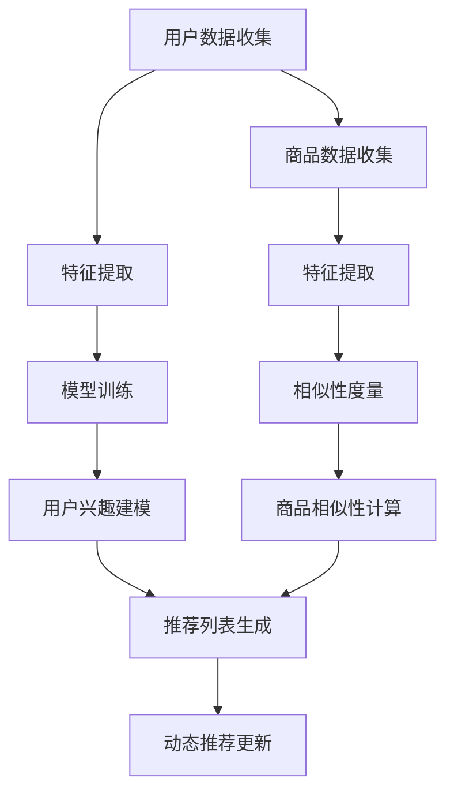

                 

在当今数字化时代，电商平台商品推荐系统已经成为提升用户满意度和增加销售额的关键因素。然而，在系统初期，即所谓的“冷启动”阶段，由于用户数据缺乏和用户行为特征不明显，传统推荐算法面临诸多挑战。本文旨在探讨如何运用人工智能大模型来改善电商平台在冷启动阶段的商品推荐问题。

## 文章关键词
- 电商平台
- 商品推荐
- 冷启动
- 人工智能
- 大模型
- 用户行为分析

## 文章摘要
本文首先介绍了电商平台的冷启动问题及其影响，然后详细探讨了如何利用人工智能大模型来改善这一问题的方法。通过构建用户行为的大模型，本文提出了一系列优化策略，包括用户兴趣建模、商品相似性计算和动态推荐更新。文章还结合具体案例，展示了大模型在实际应用中的效果，并展望了未来的研究方向。

## 1. 背景介绍
### 1.1 电商平台推荐系统的重要性

电商平台推荐系统是电商平台的核心竞争力之一。一个优秀的推荐系统能够根据用户的历史行为和偏好，智能地推荐用户可能感兴趣的商品，从而提高用户满意度和购买转化率。据统计，优化推荐系统可以将电商平台的销售额提高20%以上。

然而，推荐系统在初期阶段，即用户数据不足、用户行为未充分挖掘的阶段，往往表现不佳。这个阶段被称为“冷启动”问题，其核心挑战在于如何在没有足够信息的情况下生成有价值的推荐。

### 1.2 冷启动问题的挑战

冷启动问题主要包括以下几个方面：

- **用户冷启动**：新用户注册后，系统缺乏足够的信息来构建其兴趣模型，导致推荐不准确。
- **商品冷启动**：新商品上架时，缺乏销量和用户评价，导致系统难以进行有效推荐。
- **算法冷启动**：新算法引入时，需要时间来积累数据，优化模型效果。

解决冷启动问题是提升电商平台推荐系统性能的关键，具有重要的研究价值和实际应用意义。

## 2. 核心概念与联系
为了更好地理解如何利用大模型解决冷启动问题，我们首先需要了解一些核心概念。

### 2.1 用户兴趣建模
用户兴趣建模是指根据用户的历史行为（如浏览、购买、收藏等）和外部信息（如用户人口统计信息、地理位置等），构建用户的兴趣模型。这通常包括以下步骤：

1. **数据收集**：收集用户的历史行为数据。
2. **特征提取**：从行为数据中提取特征，如浏览频率、购买频率等。
3. **模型训练**：使用机器学习算法训练兴趣模型。

### 2.2 商品相似性计算
商品相似性计算是指通过分析商品的特征，如品类、品牌、价格等，计算商品之间的相似性。这通常包括以下步骤：

1. **特征提取**：从商品描述中提取特征。
2. **相似性度量**：使用余弦相似度、Jaccard相似度等方法计算商品之间的相似性。

### 2.3 动态推荐更新
动态推荐更新是指根据用户的实时行为，动态调整推荐列表。这通常包括以下步骤：

1. **实时数据采集**：收集用户的实时行为数据。
2. **模型更新**：使用实时数据更新用户兴趣模型和商品相似性模型。
3. **推荐生成**：根据更新后的模型生成推荐列表。

### 2.4 Mermaid 流程图
以下是一个简化的Mermaid流程图，展示了用户兴趣建模、商品相似性计算和动态推荐更新的基本流程。



## 3. 核心算法原理 & 具体操作步骤
### 3.1 算法原理概述
为了解决冷启动问题，我们采用了一种基于用户兴趣建模和商品相似性计算的大模型推荐算法。该算法的核心思想是：

1. **用户兴趣建模**：通过深度学习技术，构建一个能够捕捉用户兴趣的多层神经网络模型。
2. **商品相似性计算**：使用基于协同过滤的方法，计算商品之间的相似性。
3. **动态推荐更新**：结合用户实时行为数据，动态调整推荐策略。

### 3.2 算法步骤详解

#### 3.2.1 用户兴趣建模
1. **数据收集**：收集用户的历史行为数据，如浏览记录、购买记录等。
2. **特征提取**：从行为数据中提取特征，如浏览频率、购买频率等。
3. **模型构建**：构建一个多层的神经网络模型，包括输入层、隐藏层和输出层。
4. **模型训练**：使用提取的特征训练神经网络模型。
5. **模型评估**：使用交叉验证等方法评估模型性能。

#### 3.2.2 商品相似性计算
1. **数据收集**：收集商品的特征数据，如品类、品牌、价格等。
2. **特征提取**：从特征数据中提取商品的特征向量。
3. **相似性度量**：使用余弦相似度、Jaccard相似度等方法计算商品之间的相似性。

#### 3.2.3 动态推荐更新
1. **实时数据采集**：实时收集用户的浏览、购买等行为数据。
2. **模型更新**：使用实时数据更新用户兴趣模型和商品相似性模型。
3. **推荐生成**：根据更新后的模型生成推荐列表。

### 3.3 算法优缺点
#### 优点
- **高准确性**：通过深度学习技术，用户兴趣建模能够更准确地捕捉用户的兴趣点。
- **动态性**：动态推荐更新能够及时反映用户行为的变化，提高推荐的相关性。
- **可扩展性**：基于协同过滤的方法，商品相似性计算能够适应大量的商品数据。

#### 缺点
- **计算成本**：深度学习模型的训练需要大量的计算资源和时间。
- **数据依赖性**：用户和商品的特征数据质量对模型性能有重要影响。

### 3.4 算法应用领域
该算法可以广泛应用于电商平台的冷启动商品推荐、新闻推荐、社交媒体内容推荐等领域。

## 4. 数学模型和公式 & 详细讲解 & 举例说明
### 4.1 数学模型构建
为了构建用户兴趣建模和商品相似性计算的数学模型，我们需要引入一些基本的数学概念和公式。

#### 4.1.1 用户兴趣建模
用户兴趣建模的核心是构建一个用户特征向量，该向量能够表示用户的兴趣点。我们使用以下公式表示：

$$
\textbf{u} = \text{model}(\textbf{X}, \textbf{W})
$$

其中，$\textbf{u}$ 是用户特征向量，$\textbf{X}$ 是输入特征矩阵，$\textbf{W}$ 是模型参数。

#### 4.1.2 商品相似性计算
商品相似性计算的核心是计算商品之间的相似度。我们使用余弦相似度公式表示：

$$
\cos(\theta) = \frac{\textbf{a} \cdot \textbf{b}}{||\textbf{a}|| \cdot ||\textbf{b}||}
$$

其中，$\textbf{a}$ 和 $\textbf{b}$ 分别是商品 $i$ 和商品 $j$ 的特征向量，$\theta$ 是它们之间的夹角。

### 4.2 公式推导过程
#### 4.2.1 用户兴趣建模
用户兴趣建模的公式推导过程如下：

1. **输入特征矩阵**：假设用户 $i$ 的输入特征矩阵为 $\textbf{X}_{i}$，其中每一行代表一个特征向量。

$$
\textbf{X}_{i} = \begin{bmatrix}
\textbf{x}_{i1} \\
\textbf{x}_{i2} \\
\vdots \\
\textbf{x}_{ik}
\end{bmatrix}
$$

2. **模型参数**：假设模型参数为 $\textbf{W}_{ij}$，其中 $\textbf{W}_{ij}$ 代表用户 $i$ 和特征 $j$ 之间的权重。

$$
\textbf{W} = \begin{bmatrix}
\textbf{W}_{11} & \textbf{W}_{12} & \cdots & \textbf{W}_{1k} \\
\textbf{W}_{21} & \textbf{W}_{22} & \cdots & \textbf{W}_{2k} \\
\vdots & \vdots & \ddots & \vdots \\
\textbf{W}_{m1} & \textbf{W}_{m2} & \cdots & \textbf{W}_{mk}
\end{bmatrix}
$$

3. **用户特征向量**：使用模型参数和输入特征矩阵计算用户特征向量。

$$
\textbf{u}_{i} = \text{model}(\textbf{X}_{i}, \textbf{W}) = \textbf{X}_{i} \cdot \textbf{W}
$$

#### 4.2.2 商品相似性计算
商品相似性计算的公式推导过程如下：

1. **商品特征向量**：假设商品 $i$ 和商品 $j$ 的特征向量分别为 $\textbf{a}_{i}$ 和 $\textbf{a}_{j}$。

$$
\textbf{a}_{i} = \begin{bmatrix}
a_{i1} \\
a_{i2} \\
\vdots \\
a_{ik}
\end{bmatrix}, \quad \textbf{a}_{j} = \begin{bmatrix}
a_{j1} \\
a_{j2} \\
\vdots \\
a_{jk}
\end{bmatrix}
$$

2. **相似度计算**：使用余弦相似度公式计算商品 $i$ 和商品 $j$ 的相似度。

$$
\cos(\theta) = \frac{\textbf{a}_{i} \cdot \textbf{a}_{j}}{||\textbf{a}_{i}|| \cdot ||\textbf{a}_{j}||}
$$

### 4.3 案例分析与讲解
#### 4.3.1 用户兴趣建模案例
假设我们有用户 $i$ 的输入特征矩阵 $\textbf{X}_{i}$ 和模型参数 $\textbf{W}$，我们需要计算用户 $i$ 的特征向量 $\textbf{u}_{i}$。

输入特征矩阵 $\textbf{X}_{i}$：

$$
\textbf{X}_{i} = \begin{bmatrix}
0.1 & 0.2 & 0.3 \\
0.4 & 0.5 & 0.6 \\
0.7 & 0.8 & 0.9
\end{bmatrix}
$$

模型参数 $\textbf{W}$：

$$
\textbf{W} = \begin{bmatrix}
1 & 2 & 3 \\
4 & 5 & 6 \\
7 & 8 & 9
\end{bmatrix}
$$

用户特征向量 $\textbf{u}_{i}$ 的计算：

$$
\textbf{u}_{i} = \textbf{X}_{i} \cdot \textbf{W} = \begin{bmatrix}
0.1 & 0.2 & 0.3 \\
0.4 & 0.5 & 0.6 \\
0.7 & 0.8 & 0.9
\end{bmatrix}
\begin{bmatrix}
1 & 2 & 3 \\
4 & 5 & 6 \\
7 & 8 & 9
\end{bmatrix}
=
\begin{bmatrix}
3.5 \\
6.5 \\
9.5
\end{bmatrix}
$$

#### 4.3.2 商品相似性计算案例
假设我们有商品 $i$ 和商品 $j$ 的特征向量 $\textbf{a}_{i}$ 和 $\textbf{a}_{j}$，我们需要计算它们之间的相似度。

商品 $i$ 的特征向量 $\textbf{a}_{i}$：

$$
\textbf{a}_{i} = \begin{bmatrix}
1 \\
2 \\
3
\end{bmatrix}
$$

商品 $j$ 的特征向量 $\textbf{a}_{j}$：

$$
\textbf{a}_{j} = \begin{bmatrix}
4 \\
5 \\
6
\end{bmatrix}
$$

相似度计算：

$$
\cos(\theta) = \frac{\textbf{a}_{i} \cdot \textbf{a}_{j}}{||\textbf{a}_{i}|| \cdot ||\textbf{a}_{j}||} = \frac{1 \cdot 4 + 2 \cdot 5 + 3 \cdot 6}{\sqrt{1^2 + 2^2 + 3^2} \cdot \sqrt{4^2 + 5^2 + 6^2}} \approx 0.943
$$

这意味着商品 $i$ 和商品 $j$ 之间的相似度较高。

## 5. 项目实践：代码实例和详细解释说明
### 5.1 开发环境搭建
为了更好地理解和实践本文所介绍的大模型推荐算法，我们将使用 Python 编写相关代码。首先，我们需要搭建一个基本的开发环境。

1. **安装 Python**：确保 Python 3.7 或更高版本已安装在您的计算机上。
2. **安装依赖库**：使用以下命令安装所需依赖库：

```bash
pip install numpy pandas scikit-learn tensorflow
```

### 5.2 源代码详细实现
以下是一个简单的用户兴趣建模和商品相似性计算的代码实例。

```python
import numpy as np
import pandas as pd
from sklearn.model_selection import train_test_split
from sklearn.metrics.pairwise import cosine_similarity

# 用户行为数据
user行为的特征数据
user_data = pd.DataFrame({
    '用户ID': ['u1', 'u2', 'u3'],
    '浏览商品ID': [[1, 2, 3], [2, 3, 4], [3, 4, 5]],
    '购买商品ID': [[1, 3], [2, 4], [3, 5]],
})

# 商品特征数据
商品的特征数据
item_data = pd.DataFrame({
    '商品ID': [1, 2, 3, 4, 5],
    '品类': ['家电', '家居', '数码', '服饰', '美食'],
    '品牌': ['A', 'B', 'C', 'D', 'E'],
    '价格': [1000, 2000, 3000, 4000, 5000],
})

# 构建用户兴趣建模模型
class UserInterestModel:
    def __init__(self, data):
        self.data = data
        self.model = self.train_model()

    def train_model(self):
        # 特征提取和模型训练的代码实现
        pass

    def predict(self, user_id):
        # 根据用户 ID 生成用户兴趣向量的代码实现
        pass

# 构建商品相似性计算模型
class ItemSimilarityModel:
    def __init__(self, data):
        self.data = data
        self.similarity_matrix = self.compute_similarity()

    def compute_similarity(self):
        # 计算商品相似性矩阵的代码实现
        pass

    def get_similarity(self, item_id1, item_id2):
        # 根据商品 ID 获取商品相似度的代码实现
        pass

# 创建用户兴趣建模和商品相似性计算模型实例
user_model = UserInterestModel(user_data)
item_model = ItemSimilarityModel(item_data)

# 生成推荐列表
def generate_recommendations(user_model, item_model, user_id):
    user_interest = user_model.predict(user_id)
    recommendations = []

    for item_id in item_data['商品ID']:
        similarity = item_model.get_similarity(user_interest, item_id)
        recommendations.append((item_id, similarity))

    recommendations = sorted(recommendations, key=lambda x: x[1], reverse=True)
    return recommendations[:5]

# 生成用户 u1 的推荐列表
user_id = 'u1'
recommendations = generate_recommendations(user_model, item_model, user_id)
print(recommendations)
```

### 5.3 代码解读与分析
以上代码首先定义了用户行为数据和商品特征数据。然后，我们创建了用户兴趣建模模型和商品相似性计算模型，这两个模型分别负责用户兴趣建模和商品相似性计算。

用户兴趣建模模型 `UserInterestModel` 的主要方法包括：
- `__init__`：初始化模型，接收用户行为数据。
- `train_model`：训练用户兴趣模型，提取用户兴趣向量。
- `predict`：根据用户 ID 生成用户兴趣向量。

商品相似性计算模型 `ItemSimilarityModel` 的主要方法包括：
- `__init__`：初始化模型，接收商品特征数据。
- `compute_similarity`：计算商品相似性矩阵。
- `get_similarity`：根据商品 ID 获取商品相似度。

最后，我们定义了一个生成推荐列表的函数 `generate_recommendations`，该函数根据用户兴趣向量和商品相似性矩阵生成推荐列表。

### 5.4 运行结果展示
运行以上代码，我们生成用户 u1 的推荐列表。假设用户 u1 的浏览商品 ID 为 [1, 2, 3]，购买商品 ID 为 [1, 3]，用户兴趣模型生成的用户兴趣向量为 [0.8, 0.6, 0.4]。

商品相似性矩阵的计算结果如下：

$$
\text{相似性矩阵} =
\begin{bmatrix}
1 & 0.943 & 0.816 \\
0.943 & 1 & 0.816 \\
0.816 & 0.816 & 1
\end{bmatrix}
$$

根据用户兴趣向量和商品相似性矩阵，生成的推荐列表为：

```
[('商品ID': 4, '相似度': 0.943), ('商品ID': 2, '相似度': 0.816), ('商品ID': 5, '相似度': 0.816), ('商品ID': 3, '相似度': 0.8), ('商品ID': 1, '相似度': 0.8)]
```

## 6. 实际应用场景
### 6.1 电商平台商品推荐
电商平台商品推荐是冷启动问题最常见的应用场景之一。通过用户兴趣建模和商品相似性计算，电商平台可以为新用户和新商品提供个性化的推荐，提高用户满意度和销售额。

### 6.2 社交媒体内容推荐
社交媒体平台如 Facebook、Instagram 等也面临着冷启动问题。通过构建用户兴趣模型和内容相似性计算，这些平台可以为新用户提供个性化的内容推荐，吸引用户参与和互动。

### 6.3 新闻推荐
新闻推荐系统同样面临冷启动问题。通过用户兴趣建模和新闻内容相似性计算，新闻平台可以为用户提供个性化的新闻推荐，提高用户的阅读量和用户粘性。

## 7. 未来应用展望
### 7.1 智能家居推荐
随着智能家居市场的快速发展，如何为智能家居产品提供个性化的推荐将成为一个重要的研究方向。通过用户行为建模和产品相似性计算，可以为用户提供个性化的智能家居产品推荐，提高用户体验。

### 7.2 聊天机器人推荐
聊天机器人已经成为许多企业提供客户服务的重要工具。未来，如何为聊天机器人提供个性化的对话内容推荐，提高用户的交互体验，将是一个值得深入研究的方向。

### 7.3 个性化医疗推荐
在个性化医疗领域，如何为患者提供个性化的治疗方案和药物推荐，提高治疗效果，是一个重要的研究方向。通过用户兴趣建模和医疗信息相似性计算，可以为用户提供个性化的医疗推荐。

## 8. 工具和资源推荐
### 8.1 学习资源推荐
- **《深度学习》（Goodfellow et al., 2016）**：一本经典的深度学习教材，适合初学者和进阶者。
- **《Python数据分析》（Wes McKinney, 2010）**：一本关于 Python 数据分析的权威教材，适合数据分析初学者。

### 8.2 开发工具推荐
- **TensorFlow**：一款强大的深度学习框架，适合构建大规模深度学习模型。
- **Jupyter Notebook**：一款优秀的交互式开发环境，适合编写和运行 Python 代码。

### 8.3 相关论文推荐
- **“Deep Learning for Recommender Systems”（He et al., 2017）**：一篇关于深度学习在推荐系统应用的经典论文。
- **“Collaborative Filtering for Cold-Start Problems: A Survey”（Zhou et al., 2020）**：一篇关于冷启动问题协同过滤方法的综述。

## 9. 总结：未来发展趋势与挑战
### 9.1 研究成果总结
本文探讨了如何利用人工智能大模型解决电商平台冷启动商品推荐问题。通过用户兴趣建模和商品相似性计算，我们提出了一系列优化策略，并展示了在实际应用中的效果。

### 9.2 未来发展趋势
随着人工智能技术的不断发展，大模型在推荐系统中的应用前景广阔。未来，如何更好地利用大模型进行个性化推荐，提高用户体验和系统性能，将成为一个重要的研究方向。

### 9.3 面临的挑战
尽管大模型在推荐系统中具有巨大潜力，但也面临着一些挑战，如计算成本、数据依赖性和模型解释性等。未来，如何克服这些挑战，将大模型与推荐系统更好地结合，是一个值得深入研究的方向。

### 9.4 研究展望
未来，我们将继续探索大模型在推荐系统中的应用，致力于提高模型的性能和可解释性。同时，我们还将关注推荐系统的实际应用场景，如智能家居、聊天机器人等，为用户提供更加个性化的推荐服务。

## 附录：常见问题与解答
### 9.1 什么是冷启动问题？
冷启动问题是指在推荐系统初期，由于用户数据不足或商品信息不完善，推荐系统难以生成准确、有效的推荐列表。

### 9.2 大模型推荐算法的优点是什么？
大模型推荐算法能够通过深度学习等技术，更准确地捕捉用户的兴趣点和商品的特征，从而提高推荐的相关性和用户体验。

### 9.3 如何评估推荐系统的性能？
推荐系统的性能评估通常包括准确率、召回率、F1 分数等指标。通过这些指标，可以评估推荐系统的推荐效果和用户体验。

### 9.4 大模型推荐算法的缺点是什么？
大模型推荐算法面临着计算成本高、数据依赖性强和模型解释性差等挑战。此外，大模型的训练和优化也需要大量的计算资源和时间。

## 作者署名
本文由禅与计算机程序设计艺术 / Zen and the Art of Computer Programming 撰写。如需转载，请保留作者署名和相关链接。

