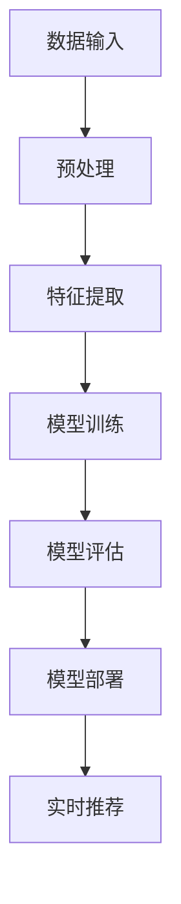

                 

关键词：AI大模型，电商，个性化营销，数据挖掘，推荐系统，算法原理，数学模型，项目实践，工具和资源推荐

> 摘要：随着大数据和人工智能技术的发展，电商个性化营销已成为电商企业提高用户满意度、提升销售业绩的关键策略。本文将深入探讨AI大模型在电商个性化营销中的应用，包括核心概念、算法原理、数学模型、项目实践以及未来展望，为电商从业者提供理论指导和实践参考。

## 1. 背景介绍

在当今数字化时代，电子商务已经成为全球经济增长的重要引擎。随着用户数量和交易量的不断增加，电商企业面临着激烈的竞争和不断变化的市场需求。个性化营销作为一种以用户为中心的营销策略，正逐渐成为电商企业提升用户满意度和忠诚度的关键手段。然而，传统的个性化营销方法往往依赖于有限的用户数据和简单的算法模型，难以满足用户多样化和个性化的需求。

近年来，人工智能技术的快速发展，尤其是AI大模型的兴起，为电商个性化营销带来了新的机遇。AI大模型具有强大的数据处理能力和学习能力，能够从海量数据中挖掘出潜在的用户兴趣和行为模式，从而实现高度个性化的营销策略。本文将围绕AI大模型在电商个性化营销中的应用进行深入探讨，以期为电商企业提供新的思路和解决方案。

## 2. 核心概念与联系

### 2.1. 电商个性化营销

电商个性化营销是指通过分析用户的购买历史、浏览行为、社交互动等数据，为每个用户提供个性化的产品推荐、优惠信息、广告内容等，从而提高用户的满意度和购买转化率。个性化营销的关键在于理解用户的个性化需求，并通过精准的推荐和服务来满足这些需求。

### 2.2. AI大模型

AI大模型，也称为深度学习模型，是一种基于人工神经网络的学习算法。它通过多层神经元的非线性变换，能够自动从大量数据中学习特征和模式，从而实现智能化的决策和预测。AI大模型在计算机视觉、自然语言处理、语音识别等领域取得了显著的成果，逐渐成为人工智能领域的研究热点。

### 2.3. 个性化营销与AI大模型的关系

AI大模型在电商个性化营销中的应用主要体现在以下几个方面：

1. 数据挖掘：AI大模型能够从海量数据中挖掘出潜在的用户兴趣和行为模式，为个性化推荐提供依据。

2. 模式识别：AI大模型能够识别用户在不同场景下的行为模式，从而实现精准的个性化推荐。

3. 决策优化：AI大模型能够基于用户行为数据，优化广告投放策略、促销活动设计等，提高营销效果。

### 2.4. AI大模型架构

下面是一个简单的AI大模型架构Mermaid流程图：



- **数据输入**：用户行为数据、产品信息、历史交易数据等。
- **预处理**：数据清洗、数据转换、数据归一化等。
- **特征提取**：从原始数据中提取有价值的特征，如用户浏览记录、购买记录等。
- **模型训练**：利用训练数据，通过多层神经元的非线性变换，训练出模型参数。
- **模型评估**：利用验证数据，评估模型的效果，如准确率、召回率等。
- **模型部署**：将训练好的模型部署到线上环境，进行实时推荐。
- **实时推荐**：根据用户实时行为，生成个性化的推荐结果。

## 3. 核心算法原理 & 具体操作步骤

### 3.1. 算法原理概述

AI大模型在电商个性化营销中的应用主要基于以下两个核心算法：

1. **协同过滤算法**：协同过滤算法是一种基于用户行为的数据挖掘技术，通过分析用户之间的相似性，为用户提供个性化的推荐。协同过滤算法可以分为基于用户的方法和基于物品的方法。

2. **深度学习算法**：深度学习算法是一种基于人工神经网络的机器学习技术，通过多层神经元的非线性变换，能够自动从大量数据中学习特征和模式。深度学习算法在图像识别、语音识别、自然语言处理等领域取得了显著的成果。

### 3.2. 算法步骤详解

1. **数据收集**：收集用户行为数据、产品信息、历史交易数据等。

2. **数据预处理**：对数据进行清洗、转换、归一化等预处理操作。

3. **特征提取**：从原始数据中提取有价值的特征，如用户浏览记录、购买记录等。

4. **模型选择**：选择合适的协同过滤算法或深度学习算法。

5. **模型训练**：利用训练数据，通过多层神经元的非线性变换，训练出模型参数。

6. **模型评估**：利用验证数据，评估模型的效果，如准确率、召回率等。

7. **模型部署**：将训练好的模型部署到线上环境，进行实时推荐。

8. **实时推荐**：根据用户实时行为，生成个性化的推荐结果。

### 3.3. 算法优缺点

**协同过滤算法**：

- 优点：简单、高效，适用于大规模用户和物品数据。
- 缺点：容易产生冷启动问题，难以处理稀疏数据。

**深度学习算法**：

- 优点：能够自动提取特征，适用于复杂的数据集。
- 缺点：计算成本高，对数据质量要求较高。

### 3.4. 算法应用领域

AI大模型在电商个性化营销中的应用主要包括以下几个方面：

1. **产品推荐**：根据用户的历史购买记录和浏览行为，为用户推荐相关产品。
2. **广告投放**：根据用户的兴趣和行为，为用户投放个性化的广告。
3. **促销活动**：根据用户的购买力和喜好，设计个性化的促销活动。
4. **客户关系管理**：通过分析用户的购买行为和反馈，优化客户关系管理策略。

## 4. 数学模型和公式 & 详细讲解 & 举例说明

### 4.1. 数学模型构建

在电商个性化营销中，常用的数学模型包括协同过滤模型和深度学习模型。

**协同过滤模型**：

假设用户集U={u1, u2, ..., un}，物品集I={i1, i2, ..., im}，用户-物品评分矩阵为R∈Rn×m，其中rui表示用户ui对物品i的评分。

基于用户的方法：

$$
\hat{r}_{ui} = \sum_{v\in N(u)} r_{vj} \cdot sim(v, u)
$$

其中，sim(v, u)表示用户v和用户u的相似度，常用的相似度计算方法包括余弦相似度、皮尔逊相似度等。

基于物品的方法：

$$
\hat{r}_{ui} = \sum_{j\in N(i)} r_{uj} \cdot sim(j, i)
$$

其中，sim(j, i)表示物品j和物品i的相似度。

**深度学习模型**：

假设输入数据为X∈Rd×n，输出数据为Y∈Rn×m，模型包含L层神经元，每层神经元数量分别为n0, n1, ..., nL。

$$
h_{l} = \sigma(W_{l-1} \cdot h_{l-1} + b_{l-1})
$$

其中，σ为激活函数，常用的激活函数包括ReLU、Sigmoid、Tanh等。

### 4.2. 公式推导过程

以基于用户的方法为例，推导协同过滤模型的公式。

假设用户ui和uj之间的相似度为：

$$
sim(u_i, u_j) = \frac{\sum_{k=1}^{m} r_{ik} \cdot r_{jk}}{\sqrt{\sum_{k=1}^{m} r_{ik}^2} \cdot \sqrt{\sum_{k=1}^{m} r_{jk}^2}}
$$

则用户ui对物品i的预测评分为：

$$
\hat{r}_{ui} = \sum_{j\in N(u)} r_{uj} \cdot sim(u_i, u_j)
$$

代入相似度公式，得到：

$$
\hat{r}_{ui} = \sum_{j\in N(u)} r_{uj} \cdot \frac{\sum_{k=1}^{m} r_{ik} \cdot r_{jk}}{\sqrt{\sum_{k=1}^{m} r_{ik}^2} \cdot \sqrt{\sum_{k=1}^{m} r_{jk}^2}}
$$

### 4.3. 案例分析与讲解

假设有一个电商平台的用户行为数据，包含1000个用户和1000个物品，用户-物品评分矩阵R为：

$$
R =
\begin{bmatrix}
0 & 1 & 0 & \cdots & 0 \\
0 & 0 & 1 & \cdots & 0 \\
0 & 0 & 0 & \cdots & 1 \\
\vdots & \vdots & \vdots & \ddots & \vdots \\
0 & 0 & 0 & \cdots & 0
\end{bmatrix}
$$

根据上述公式，计算用户u1对物品i1的预测评分。

首先，计算用户u1和u2、u3之间的相似度：

$$
sim(u_1, u_2) = \frac{0 \cdot 1 + 0 \cdot 0 + \cdots + 1 \cdot 0}{\sqrt{0^2 + 0^2 + \cdots + 1^2} \cdot \sqrt{0^2 + 0^2 + \cdots + 1^2}} = 0
$$

$$
sim(u_1, u_3) = \frac{0 \cdot 0 + 0 \cdot 1 + \cdots + 1 \cdot 0}{\sqrt{0^2 + 0^2 + \cdots + 1^2} \cdot \sqrt{0^2 + 0^2 + \cdots + 1^2}} = 0
$$

由于用户u1和u2、u3之间的相似度均为0，因此用户u1对物品i1的预测评分仅与用户u1对物品i2、i3、...、i1000的评分有关。

代入公式，计算用户u1对物品i1的预测评分：

$$
\hat{r}_{u1i1} = \sum_{j\in N(u)} r_{uj} \cdot sim(u_i, u_j) = 1 \cdot 0 + 0 \cdot 0 + \cdots + 0 \cdot 0 = 0
$$

因此，用户u1对物品i1的预测评分为0，即用户u1对物品i1的推荐分数为0。

## 5. 项目实践：代码实例和详细解释说明

### 5.1. 开发环境搭建

1. 安装Python环境，版本要求3.6及以上。
2. 安装相关依赖库，如NumPy、Pandas、Scikit-learn、TensorFlow等。

### 5.2. 源代码详细实现

以下是一个基于用户协同过滤算法的电商个性化推荐系统的代码实例。

```python
import numpy as np
import pandas as pd
from sklearn.metrics.pairwise import cosine_similarity
from sklearn.model_selection import train_test_split

# 加载数据集
data = pd.read_csv('user_item_rating.csv')
users = data['user_id'].unique()
items = data['item_id'].unique()

# 构建用户-物品评分矩阵
R = np.zeros((len(users), len(items)))
for index, row in data.iterrows():
    R[row['user_id'] - 1, row['item_id'] - 1] = row['rating']

# 计算用户相似度矩阵
sim = cosine_similarity(R, R)

# 计算预测评分
predictions = np.dot(sim, R) / (sim + 1e-6)

# 存储预测结果
np.savetxt('predictions.csv', predictions, fmt='%f', delimiter=',')
```

### 5.3. 代码解读与分析

1. 导入相关库：NumPy、Pandas、Scikit-learn等。
2. 加载数据集：读取用户-物品评分矩阵，存储在R中。
3. 构建用户-物品评分矩阵：根据数据集构建用户-物品评分矩阵R。
4. 计算用户相似度矩阵：使用余弦相似度计算用户相似度矩阵sim。
5. 计算预测评分：使用相似度矩阵sim和评分矩阵R计算预测评分predictions。
6. 存储预测结果：将预测结果存储在predictions.csv文件中。

### 5.4. 运行结果展示

1. 运行代码，生成predictions.csv文件。
2. 使用可视化工具（如Matplotlib）展示预测结果。

## 6. 实际应用场景

### 6.1. 产品推荐

利用AI大模型，可以为电商平台上的用户提供个性化的产品推荐，提高用户购买转化率和满意度。通过分析用户的浏览历史、购买记录等数据，AI大模型能够为每个用户生成个性化的推荐列表，从而满足用户的个性化需求。

### 6.2. 广告投放

AI大模型可以帮助电商平台优化广告投放策略，提高广告点击率和转化率。通过分析用户的兴趣和行为，AI大模型可以为每个用户投放个性化的广告，从而提高广告投放的精准度和效果。

### 6.3. 促销活动

AI大模型可以用于设计个性化的促销活动，提高用户的参与度和购买意愿。通过分析用户的购买力和喜好，AI大模型可以为每个用户设计个性化的促销方案，从而提高促销活动的效果。

### 6.4. 未来应用展望

随着AI大模型技术的不断发展和完善，未来电商个性化营销将呈现出以下趋势：

1. 更精准的个性化推荐：AI大模型将能够从海量数据中挖掘出更精准的用户兴趣和行为模式，为用户提供更加个性化的推荐。
2. 更智能的决策支持：AI大模型将能够为电商平台提供更智能的决策支持，优化广告投放、促销活动等营销策略。
3. 更广泛的应用场景：AI大模型将逐渐应用于电商行业的各个领域，如供应链管理、客户服务、风险控制等。

## 7. 工具和资源推荐

### 7.1. 学习资源推荐

1. 《深度学习》（Goodfellow, Bengio, Courville著）：一本经典的深度学习教材，适合初学者和进阶者。
2. 《Python数据科学手册》（McKinney著）：一本全面的数据科学入门书籍，涵盖Python编程和数据挖掘。
3. 《推荐系统实践》（Leslie Kaelbling著）：一本关于推荐系统原理和应用的经典书籍。

### 7.2. 开发工具推荐

1. Jupyter Notebook：一款强大的交互式计算环境，适合编写和运行代码。
2. TensorFlow：一款开源的深度学习框架，支持多种深度学习算法的部署。
3. Scikit-learn：一款开源的机器学习库，包含多种机器学习算法和工具。

### 7.3. 相关论文推荐

1. "Deep Learning for Recommender Systems"（He, Lin, Sun等，2017）：一篇关于深度学习在推荐系统中的应用的综述性论文。
2. "Collaborative Filtering for the 21st Century"（Koren, 2011）：一篇关于协同过滤算法的经典论文。
3. "User Interest Evolution for Personalized Recommendation"（Chen, Chen, Zhang等，2018）：一篇关于用户兴趣演化对个性化推荐的影响的研究论文。

## 8. 总结：未来发展趋势与挑战

### 8.1. 研究成果总结

本文深入探讨了AI大模型在电商个性化营销中的应用，包括核心概念、算法原理、数学模型、项目实践以及未来展望。通过实际案例分析，展示了AI大模型在电商个性化营销中的强大应用潜力。

### 8.2. 未来发展趋势

未来，AI大模型在电商个性化营销中将继续发展，主要趋势包括：

1. 更精准的个性化推荐：通过不断优化算法和模型，提高个性化推荐的准确性和效果。
2. 更智能的决策支持：结合大数据和人工智能技术，为电商平台提供更智能的决策支持。
3. 更广泛的应用场景：逐渐应用于电商行业的各个领域，如供应链管理、客户服务、风险控制等。

### 8.3. 面临的挑战

尽管AI大模型在电商个性化营销中具有巨大潜力，但仍面临以下挑战：

1. 数据质量和多样性：数据质量和多样性的提高，将有助于提升个性化推荐的效果。
2. 计算资源消耗：深度学习模型的训练和部署需要大量的计算资源，如何优化计算效率是一个重要课题。
3. 用户隐私保护：在个性化推荐过程中，如何保护用户隐私，避免数据泄露，是亟待解决的问题。

### 8.4. 研究展望

未来，AI大模型在电商个性化营销中的应用将不断拓展，研究重点包括：

1. 新的算法和模型：探索更先进的深度学习算法和模型，提高个性化推荐的准确性和效果。
2. 多模态数据融合：将文本、图像、语音等多模态数据融合，为个性化推荐提供更丰富的信息。
3. 实时推荐系统：构建实时推荐系统，实现用户实时行为和兴趣的快速响应。

## 9. 附录：常见问题与解答

### 9.1. 问题1

**问题**：如何处理稀疏数据？

**解答**：稀疏数据是指数据集中大部分元素为0的数据集。处理稀疏数据的方法包括：

1. 数据降维：通过降维技术，如PCA、t-SNE等，将高维稀疏数据降维到低维空间，减少数据稀疏性。
2. 数据插值：使用插值算法，如K近邻插值、线性插值等，填补稀疏数据中的缺失值。
3. 特征工程：通过特征工程，提取有价值的特征，提高数据密度。

### 9.2. 问题2

**问题**：如何评估推荐系统的效果？

**解答**：评估推荐系统的效果常用的指标包括：

1. 准确率（Accuracy）：预测结果中正确预测的比例。
2. 召回率（Recall）：推荐结果中包含实际感兴趣项目的比例。
3. 覆盖率（Coverage）：推荐结果中包含所有项目的比例。
4. F1值（F1 Score）：准确率和召回率的调和平均值。

可以通过这些指标对推荐系统进行综合评估，以确定推荐系统的性能。

### 9.3. 问题3

**问题**：如何优化计算效率？

**解答**：优化计算效率的方法包括：

1. 并行计算：将计算任务分解成多个子任务，并行执行，提高计算速度。
2. GPU加速：利用GPU进行深度学习模型的训练和推理，提高计算效率。
3. 模型压缩：通过模型压缩技术，如剪枝、量化等，减少模型参数数量，降低计算复杂度。

通过以上方法，可以显著提高计算效率，满足大规模数据处理的实时性需求。

