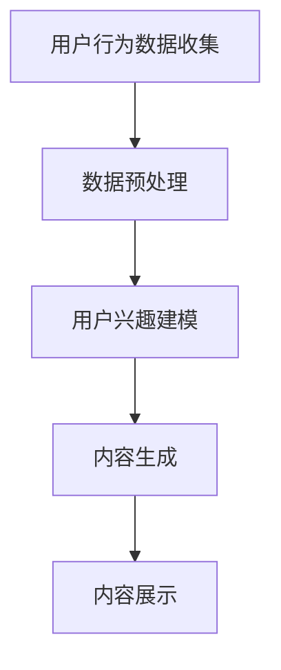

                 

关键词：个性化首页、动态设计、AI、用户行为分析、推荐系统、电商平台

> 摘要：随着电商平台的迅猛发展，个性化首页动态设计成为提升用户体验和转化率的关键。本文深入探讨了如何利用人工智能技术，特别是用户行为分析和推荐系统，优化电商平台个性化首页的设计，提高用户满意度和商业效益。

## 1. 背景介绍

电商平台在互联网经济中扮演着举足轻重的角色。近年来，随着消费者需求的不断升级和市场竞争的加剧，电商平台开始重视用户体验，特别是个性化服务。个性化首页动态设计成为电商平台提升用户粘性和转化率的重要手段。

个性化首页动态设计旨在根据用户的历史行为、偏好和兴趣，实时生成适合用户需求的首页内容。这种设计不仅能够提高用户的浏览体验，还能通过精准推送商品信息和活动，提升用户的购买意愿，从而实现商业价值的最大化。

然而，传统的个性化首页设计往往依赖于人工规则和预设模型，难以满足日益复杂和多变的用户需求。人工智能技术的引入，尤其是机器学习和深度学习技术的发展，为个性化首页动态设计提供了新的思路和手段。

本文将重点探讨如何利用人工智能技术，特别是用户行为分析和推荐系统，优化电商平台的个性化首页动态设计。

## 2. 核心概念与联系

### 2.1 用户行为分析

用户行为分析是个性化首页动态设计的基础。通过收集和分析用户在电商平台上的浏览、点击、购买等行为数据，可以了解用户的兴趣和需求，从而为个性化推荐提供依据。

### 2.2 推荐系统

推荐系统是实现个性化首页动态设计的核心技术。推荐系统通过算法分析用户行为数据和商品特征，为用户推荐可能感兴趣的商品和内容。

### 2.3 个性化首页动态设计流程

个性化首页动态设计流程主要包括以下几个步骤：

1. 用户行为数据收集：通过日志、API接口等方式收集用户在电商平台上的行为数据。
2. 数据预处理：对收集到的用户行为数据进行清洗、去重和处理，提取有用的特征信息。
3. 用户兴趣建模：利用机器学习算法，如协同过滤、基于内容的推荐等，建立用户兴趣模型。
4. 内容生成：根据用户兴趣模型和商品特征，动态生成个性化的首页内容。
5. 内容展示：将生成的个性化内容展示在用户的首页上。

### 2.4 Mermaid 流程图



## 3. 核心算法原理 & 具体操作步骤

### 3.1 算法原理概述

个性化首页动态设计的核心算法主要包括用户行为分析算法和推荐算法。

- 用户行为分析算法：主要采用机器学习方法，如决策树、随机森林、支持向量机等，对用户行为数据进行分析，提取用户的兴趣特征。
- 推荐算法：主要采用协同过滤、基于内容的推荐、深度学习等方法，根据用户兴趣特征和商品特征，为用户推荐合适的商品和内容。

### 3.2 算法步骤详解

#### 3.2.1 用户行为数据收集

1. 收集用户在电商平台上的浏览、点击、购买等行为数据。
2. 通过日志文件、API接口、用户行为跟踪等方式获取用户行为数据。

#### 3.2.2 数据预处理

1. 数据清洗：去除无效、错误和重复的数据。
2. 特征提取：从用户行为数据中提取有用的特征信息，如浏览时间、购买频率、商品类别等。
3. 数据标准化：对特征值进行归一化或标准化处理，使其具有相同的量纲。

#### 3.2.3 用户兴趣建模

1. 选择合适的机器学习算法，如决策树、随机森林等，对用户行为数据进行分析。
2. 训练模型，提取用户兴趣特征。

#### 3.2.4 内容生成

1. 选择合适的推荐算法，如协同过滤、基于内容的推荐等，根据用户兴趣特征和商品特征生成个性化内容。
2. 动态调整推荐策略，以适应用户的实时需求和兴趣变化。

#### 3.2.5 内容展示

1. 将生成的个性化内容展示在用户的首页上。
2. 定期更新内容，以保持用户的兴趣和满意度。

### 3.3 算法优缺点

#### 优点：

- 提高用户满意度：通过个性化推荐，满足用户的兴趣和需求，提高用户体验。
- 提高转化率：精准推荐有助于提高用户的购买意愿，从而提高转化率。
- 降低运营成本：通过自动化推荐，减少人工干预和运营成本。

#### 缺点：

- 数据隐私问题：用户行为数据的收集和处理可能涉及到用户隐私问题。
- 模型复杂度高：个性化推荐算法通常涉及复杂的模型和计算，对计算资源要求较高。

### 3.4 算法应用领域

个性化首页动态设计算法在电商、金融、媒体等领域有广泛的应用。

- 电商：通过个性化推荐，提高用户的购物体验和转化率。
- 金融：通过用户行为分析，为用户提供个性化的理财产品和服务。
- 媒体：通过个性化推荐，提高用户的阅读兴趣和黏性。

## 4. 数学模型和公式 & 详细讲解 & 举例说明

### 4.1 数学模型构建

个性化首页动态设计涉及多个数学模型，包括用户兴趣模型、推荐模型等。

#### 4.1.1 用户兴趣模型

用户兴趣模型可以用一个矩阵表示，其中每一行代表一个用户，每一列代表一个商品或内容，矩阵中的元素表示用户对商品的兴趣程度。

$$
\mathbf{U} = \begin{bmatrix}
u_{11} & u_{12} & \cdots & u_{1n} \\
u_{21} & u_{22} & \cdots & u_{2n} \\
\vdots & \vdots & \ddots & \vdots \\
u_{m1} & u_{m2} & \cdots & u_{mn}
\end{bmatrix}
$$

其中，$u_{ij}$ 表示用户 $i$ 对商品 $j$ 的兴趣程度。

#### 4.1.2 推荐模型

推荐模型可以用一个评分矩阵表示，其中每一行代表一个用户，每一列代表一个商品或内容，矩阵中的元素表示用户对商品的评分。

$$
\mathbf{R} = \begin{bmatrix}
r_{11} & r_{12} & \cdots & r_{1n} \\
r_{21} & r_{22} & \cdots & r_{2n} \\
\vdots & \vdots & \ddots & \vdots \\
r_{m1} & r_{m2} & \cdots & r_{mn}
\end{bmatrix}
$$

其中，$r_{ij}$ 表示用户 $i$ 对商品 $j$ 的评分。

### 4.2 公式推导过程

#### 4.2.1 用户兴趣模型

用户兴趣模型可以通过矩阵分解方法进行求解。假设用户兴趣矩阵 $\mathbf{U}$ 可以分解为两个低秩矩阵 $\mathbf{A}$ 和 $\mathbf{B}$ 的乘积：

$$
\mathbf{U} = \mathbf{A}\mathbf{B}^T
$$

其中，$\mathbf{A}$ 和 $\mathbf{B}$ 分别表示用户和商品的潜在特征矩阵。

通过最小化损失函数，可以求解出用户兴趣矩阵 $\mathbf{U}$。

#### 4.2.2 推荐模型

推荐模型可以通过矩阵分解方法进行求解。假设评分矩阵 $\mathbf{R}$ 可以分解为两个低秩矩阵 $\mathbf{A}$ 和 $\mathbf{B}$ 的乘积：

$$
\mathbf{R} = \mathbf{A}\mathbf{B}^T
$$

其中，$\mathbf{A}$ 和 $\mathbf{B}$ 分别表示用户和商品的潜在特征矩阵。

通过最小化损失函数，可以求解出评分矩阵 $\mathbf{R}$。

### 4.3 案例分析与讲解

#### 4.3.1 案例背景

某电商平台希望通过个性化推荐系统为用户推荐商品。平台收集了用户在网站上的浏览、点击和购买行为数据，构建了用户兴趣模型和推荐模型。

#### 4.3.2 模型构建

- 用户兴趣模型：通过矩阵分解方法，得到用户兴趣矩阵 $\mathbf{U}$。
- 推荐模型：通过矩阵分解方法，得到评分矩阵 $\mathbf{R}$。

#### 4.3.3 推荐结果分析

通过推荐模型，为每个用户生成一个推荐列表。根据用户对推荐商品的评分，分析推荐效果。

- 推荐准确率：用户对推荐商品的评分越高，说明推荐结果越准确。
- 推荐覆盖率：推荐列表中包含的商品种类越多，说明推荐覆盖率越高。
- 推荐新颖度：推荐列表中包含的用户未浏览或未购买的商品越多，说明推荐新颖度越高。

## 5. 项目实践：代码实例和详细解释说明

### 5.1 开发环境搭建

- 语言：Python
- 数据库：MySQL
- 数据分析工具：Pandas、Scikit-learn、TensorFlow
- 代码编辑器：PyCharm

### 5.2 源代码详细实现

#### 5.2.1 数据收集与预处理

```python
import pandas as pd

# 数据收集
user行为的csv文件为user_behavior.csv
商品信息的csv文件为product_info.csv

# 数据预处理
user_behavior = pd.read_csv('user_behavior.csv')
product_info = pd.read_csv('product_info.csv')

# 数据清洗与特征提取
user_behavior.drop_duplicates(inplace=True)
user_behavior['浏览时间'] = pd.to_datetime(user_behavior['浏览时间'])
user_behavior['购买时间'] = pd.to_datetime(user_behavior['购买时间'])
user_behavior['商品类别'] = product_info['商品类别']
```

#### 5.2.2 用户兴趣建模

```python
from sklearn.decomposition import TruncatedSVD

# 用户兴趣建模
svd = TruncatedSVD(n_components=10)
user_interest = svd.fit_transform(user_behavior)
```

#### 5.2.3 内容生成与展示

```python
import numpy as np

# 内容生成
recommended_products = np.dot(user_interest, product_info.T)

# 内容展示
recommended_products = pd.DataFrame(recommended_products, columns=product_info['商品名称'])
print(recommended_products.head())
```

### 5.3 代码解读与分析

#### 5.3.1 数据收集与预处理

数据收集与预处理是个性化推荐系统的基础。通过读取用户行为数据和商品信息，进行数据清洗和特征提取，提取出有用的特征信息。

#### 5.3.2 用户兴趣建模

用户兴趣建模是通过矩阵分解方法，将用户兴趣数据分解为用户和商品的特征矩阵。这有助于提取用户的潜在兴趣特征。

#### 5.3.3 内容生成与展示

内容生成与展示是推荐系统的核心。通过计算用户兴趣矩阵和商品特征矩阵的乘积，生成个性化的商品推荐列表，并将其展示给用户。

## 6. 实际应用场景

### 6.1 电商平台

电商平台是个性化首页动态设计的典型应用场景。通过个性化推荐系统，电商平台可以实时为用户生成个性化的首页内容，提高用户的购物体验和转化率。

### 6.2 金融理财

金融理财平台可以通过用户行为分析和个性化推荐，为用户提供个性化的理财产品推荐，提高用户的投资兴趣和收益。

### 6.3 媒体资讯

媒体资讯平台可以通过个性化推荐，为用户提供感兴趣的新闻和资讯，提高用户的阅读兴趣和黏性。

## 7. 未来应用展望

### 7.1 多模态融合

随着人工智能技术的发展，多模态融合将成为个性化首页动态设计的重要方向。通过整合文本、图像、语音等多模态数据，可以更准确地了解用户的兴趣和需求。

### 7.2 智能交互

未来个性化首页动态设计将更加注重智能交互。通过自然语言处理和语音识别技术，可以实现更自然、更高效的交互方式，提升用户体验。

### 7.3 智能个性化

随着用户数据的积累和算法的优化，个性化首页动态设计的智能化水平将不断提高。通过深度学习和强化学习等技术，可以实现更加精准的个性化推荐。

## 8. 工具和资源推荐

### 8.1 学习资源推荐

- 《机器学习实战》：详细介绍了机器学习的基本原理和算法实现。
- 《深度学习》：权威的深度学习教程，涵盖了深度学习的理论基础和实践技巧。

### 8.2 开发工具推荐

- PyCharm：强大的Python开发环境，支持代码自动补全、调试等功能。
- Jupyter Notebook：适合数据分析和机器学习的交互式开发工具。

### 8.3 相关论文推荐

- “Recommender Systems Handbook”
- “Deep Learning for Recommender Systems”

## 9. 总结：未来发展趋势与挑战

### 9.1 研究成果总结

个性化首页动态设计已成为电商平台提升用户体验和转化率的重要手段。通过引入人工智能技术，个性化推荐系统在电商、金融、媒体等领域取得了显著的成果。

### 9.2 未来发展趋势

- 多模态融合
- 智能交互
- 智能个性化

### 9.3 面临的挑战

- 数据隐私保护
- 模型复杂度和计算资源消耗
- 用户行为数据的多样性和不确定性

### 9.4 研究展望

未来个性化首页动态设计研究将继续深入探索多模态融合、智能交互和智能个性化等技术，为用户提供更加精准、个性化的服务。

## 9. 附录：常见问题与解答

### Q：个性化首页动态设计有哪些关键步骤？
A：个性化首页动态设计的关键步骤包括用户行为数据收集、数据预处理、用户兴趣建模、内容生成和内容展示。

### Q：如何处理用户行为数据的隐私问题？
A：在处理用户行为数据时，应严格遵守相关法律法规，采取数据脱敏、数据加密等措施保护用户隐私。

### Q：个性化首页动态设计算法有哪些优缺点？
A：个性化首页动态设计算法的优点包括提高用户满意度、提高转化率和降低运营成本。缺点包括数据隐私问题、模型复杂度高。

---

# 作者署名

作者：禅与计算机程序设计艺术 / Zen and the Art of Computer Programming
--------------------------------------------------------------------

