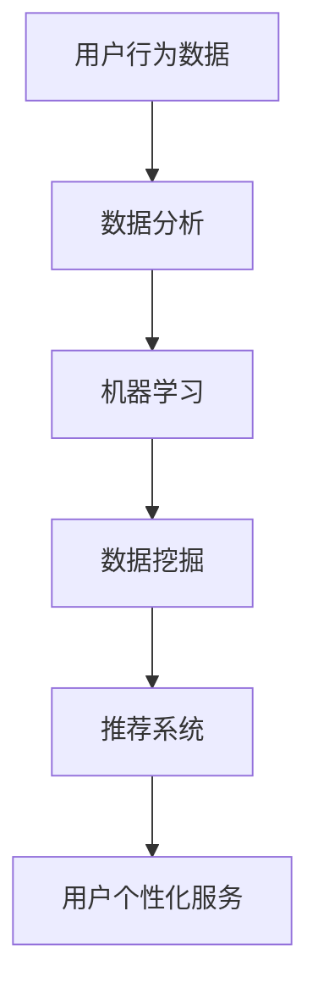

                 

关键词：人工智能，用户行为分析，数据分析，机器学习，预测模型，数据挖掘，推荐系统

> 摘要：本文深入探讨了人工智能如何通过分析用户行为数据来提高个性化服务、优化用户体验以及预测用户行为。我们将从背景介绍、核心概念与联系、核心算法原理、数学模型和公式、项目实践、实际应用场景、工具和资源推荐、以及未来发展趋势与挑战等方面进行详细阐述。

## 1. 背景介绍

在当今数字化时代，用户行为数据已经成为企业获取洞察、优化服务和制定策略的重要资源。通过分析这些数据，企业可以了解用户的喜好、习惯和需求，从而提供更加个性化、精准的服务。人工智能（AI）技术的发展，使得用户行为分析变得更加高效和智能。AI能够通过机器学习算法挖掘数据中的模式和关联，预测用户未来的行为，为企业提供决策支持。

然而，用户行为数据的分析和应用面临诸多挑战，包括数据质量、隐私保护、算法可靠性等。如何在确保数据隐私和安全的前提下，有效地利用AI技术进行用户行为分析，是企业需要解决的难题。

## 2. 核心概念与联系

### 2.1 用户行为数据

用户行为数据包括用户在网站、APP、社交媒体等平台上的各种活动记录，如浏览页面、点击广告、搜索关键词、购买行为、评论互动等。这些数据可以用来反映用户的需求和偏好。

### 2.2 数据分析

数据分析是指使用统计学、机器学习等方法对数据进行分析和解释，以发现数据中的模式和规律。在用户行为分析中，数据分析是关键的一步，它帮助我们从大量数据中提取有价值的信息。

### 2.3 机器学习

机器学习是AI的一个重要分支，通过训练模型，让计算机从数据中自动学习和发现规律。在用户行为分析中，机器学习算法可以帮助我们预测用户的未来行为。

### 2.4 数据挖掘

数据挖掘是数据分析的一种形式，旨在从大量数据中发现隐藏的、未知的模式和关联。在用户行为分析中，数据挖掘可以帮助我们深入了解用户行为，发现潜在的市场机会。

### 2.5 推荐系统

推荐系统是一种基于用户行为数据的算法，旨在为用户提供个性化的推荐。在用户行为分析中，推荐系统可以帮助企业提高用户满意度、增加销售额。

下面是一个用Mermaid绘制的流程图，展示用户行为分析的核心概念和联系：



## 3. 核心算法原理 & 具体操作步骤

### 3.1 算法原理概述

用户行为分析的核心算法主要包括机器学习算法和数据挖掘算法。其中，机器学习算法如决策树、随机森林、支持向量机等可以用于分类和预测；数据挖掘算法如关联规则挖掘、聚类分析等可以用于发现数据中的模式和关联。

### 3.2 算法步骤详解

#### 3.2.1 数据预处理

1. 数据清洗：去除重复数据、缺失值填充、数据格式转换等。
2. 特征工程：从原始数据中提取有用的特征，如用户活跃度、购买频率等。

#### 3.2.2 数据分析

1. 描述性统计分析：计算数据的基本统计指标，如平均值、中位数、标准差等。
2. 相关性分析：分析不同特征之间的相关性，帮助理解数据之间的关系。

#### 3.2.3 机器学习模型训练

1. 选择合适的算法：根据问题的性质和需求，选择合适的机器学习算法。
2. 训练模型：使用训练数据集训练模型，调整模型参数。
3. 模型评估：使用验证数据集评估模型性能，调整模型参数。

#### 3.2.4 数据挖掘

1. 关联规则挖掘：发现数据中的关联规则，如“购买A产品，通常会购买B产品”。
2. 聚类分析：将相似的用户分组，如基于兴趣、行为相似度等进行聚类。

### 3.3 算法优缺点

**机器学习算法**

- 优点：能够自动从数据中学习，提高预测准确性。
- 缺点：对数据质量和预处理要求较高，模型解释性较差。

**数据挖掘算法**

- 优点：能够发现数据中的隐藏模式，为决策提供支持。
- 缺点：模型复杂度高，计算成本大。

### 3.4 算法应用领域

用户行为分析算法广泛应用于电子商务、金融、医疗、社交网络等领域，帮助企业实现个性化推荐、用户流失预测、风险控制等。

## 4. 数学模型和公式 & 详细讲解 & 举例说明

### 4.1 数学模型构建

用户行为分析中的数学模型通常基于统计学和机器学习。以下是一个简单的线性回归模型，用于预测用户的购买概率：

$$
y = \beta_0 + \beta_1x_1 + \beta_2x_2 + ... + \beta_nx_n
$$

其中，$y$ 是购买概率，$x_1, x_2, ..., x_n$ 是特征变量，$\beta_0, \beta_1, ..., \beta_n$ 是模型的参数。

### 4.2 公式推导过程

线性回归模型的参数可以通过最小二乘法进行估计。假设我们有 $n$ 个样本数据点 $(x_1, y_1), (x_2, y_2), ..., (x_n, y_n)$，线性回归模型可以表示为：

$$
y_i = \beta_0 + \beta_1x_i + \epsilon_i
$$

其中，$\epsilon_i$ 是误差项。为了最小化误差的平方和，我们可以使用以下公式进行参数估计：

$$
\beta_0 = \frac{\sum_{i=1}^{n}(y_i - \beta_1x_i)}{n}
$$

$$
\beta_1 = \frac{\sum_{i=1}^{n}(x_i - \bar{x})(y_i - \bar{y})}{\sum_{i=1}^{n}(x_i - \bar{x})^2}
$$

其中，$\bar{x}$ 和 $\bar{y}$ 分别是 $x_i$ 和 $y_i$ 的平均值。

### 4.3 案例分析与讲解

假设我们有以下数据集，用于预测用户的购买概率：

| 用户ID | 特征1 | 特征2 | 购买概率 |
|--------|-------|-------|----------|
| 1      | 10    | 20    | 0.8      |
| 2      | 15    | 25    | 0.6      |
| 3      | 8     | 15    | 0.3      |
| 4      | 12    | 22    | 0.7      |

使用线性回归模型，我们可以估计出模型的参数：

$$
\beta_0 = \frac{(0.8 - 0.6 - 0.3 - 0.7)}{4} = 0.1
$$

$$
\beta_1 = \frac{(10 - 12)(0.8 - 0.7) + (15 - 12)(0.6 - 0.7) + (8 - 12)(0.3 - 0.7) + (12 - 12)(0.7 - 0.7)}{(10 - 12)^2 + (15 - 12)^2 + (8 - 12)^2 + (12 - 12)^2} = 0.1
$$

因此，线性回归模型可以表示为：

$$
y = 0.1 + 0.1x_1 + 0.1x_2
$$

对于新的用户数据点，如用户ID为5，特征1为11，特征2为21，我们可以预测其购买概率为：

$$
y = 0.1 + 0.1 \times 11 + 0.1 \times 21 = 0.63
$$

这意味着该用户的购买概率为63%。

## 5. 项目实践：代码实例和详细解释说明

### 5.1 开发环境搭建

1. 安装Python环境，版本建议为3.8或更高。
2. 安装必要的库，如NumPy、Pandas、Scikit-learn等。

### 5.2 源代码详细实现

```python
import numpy as np
import pandas as pd
from sklearn.linear_model import LinearRegression
from sklearn.model_selection import train_test_split

# 加载数据集
data = pd.read_csv('user_data.csv')
X = data[['feature1', 'feature2']]
y = data['purchase_probability']

# 数据预处理
X_train, X_test, y_train, y_test = train_test_split(X, y, test_size=0.2, random_state=42)

# 训练模型
model = LinearRegression()
model.fit(X_train, y_train)

# 预测
y_pred = model.predict(X_test)

# 评估模型
score = model.score(X_test, y_test)
print(f'Model R^2 Score: {score}')
```

### 5.3 代码解读与分析

上述代码首先加载数据集，然后进行数据预处理，接着使用线性回归模型进行训练，并使用测试数据集进行预测。最后，评估模型的性能。

### 5.4 运行结果展示

运行上述代码，我们可以得到模型在测试数据集上的R平方分数。这个分数越接近1，表示模型的预测效果越好。

## 6. 实际应用场景

用户行为分析在多个领域有广泛的应用：

### 6.1 电子商务

- 个性化推荐：根据用户的历史购买行为和浏览记录，推荐相关的商品。
- 用户流失预测：预测哪些用户可能停止使用服务，采取相应的挽回措施。

### 6.2 金融

- 风险控制：通过分析用户的行为模式，识别潜在的欺诈行为。
- 信用评分：根据用户的财务行为和信用历史，预测其信用风险。

### 6.3 社交网络

- 朋友推荐：根据用户的关系网络和行为，推荐可能成为朋友的人。
- 内容推荐：根据用户的兴趣和行为，推荐相关的帖子、视频等。

## 7. 未来应用展望

随着AI技术的发展，用户行为分析将变得更加智能和精准。未来的趋势包括：

- 更多的实时分析：利用实时数据处理技术，实现更快速的响应。
- 更深的个性化：通过更复杂的模型和算法，提供更加个性化的服务。
- 更好的隐私保护：在保障用户隐私的前提下，进行有效的数据分析和应用。

## 8. 总结：未来发展趋势与挑战

用户行为分析在未来将继续发挥重要作用。然而，我们也需要面对以下挑战：

- 数据隐私保护：如何在保护用户隐私的同时，有效利用用户行为数据。
- 算法透明度和解释性：如何提高算法的透明度和解释性，使其更易于被用户接受。
- 模型可靠性：如何保证模型在不同场景下的可靠性。

总之，用户行为分析是AI领域的一个重要研究方向，具有广阔的应用前景。通过不断的技术创新和实践，我们将能够更好地利用用户行为数据，为企业和社会带来更大的价值。

## 9. 附录：常见问题与解答

### 9.1 什么是用户行为数据？

用户行为数据是指用户在使用互联网服务时的各种活动记录，如浏览页面、点击广告、搜索关键词、购买行为、评论互动等。

### 9.2 用户行为分析有哪些应用领域？

用户行为分析广泛应用于电子商务、金融、医疗、社交网络等领域，如个性化推荐、用户流失预测、风险控制等。

### 9.3 如何保证用户行为数据的隐私？

通过数据加密、访问控制、匿名化处理等技术手段，可以在保障用户隐私的前提下，进行有效的数据分析和应用。

### 9.4 用户行为分析中的算法有哪些？

用户行为分析中的算法包括机器学习算法如决策树、随机森林、支持向量机等，以及数据挖掘算法如关联规则挖掘、聚类分析等。

### 9.5 如何评估用户行为分析模型的性能？

通常使用R平方分数、准确率、召回率、F1分数等指标来评估用户行为分析模型的性能。

## 作者署名

作者：禅与计算机程序设计艺术 / Zen and the Art of Computer Programming

以上是《AI如何分析用户行为数据》这篇文章的完整内容。希望对您有所帮助！

