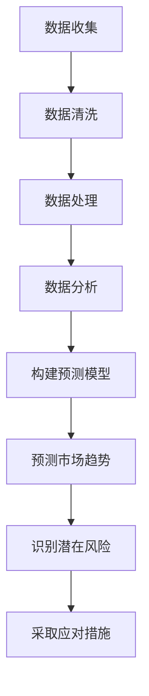

                 

关键词：电商企业，风险控制，人工智能，机器学习，数据分析，预测模型，网络安全

> 摘要：本文将探讨人工智能技术在电商企业风险控制中的应用，分析其核心算法原理、数学模型，并通过实际项目实践展示其在风险控制中的有效性。文章旨在为电商企业提供一套完整的风险控制方案，以应对日益复杂的电商市场环境。

## 1. 背景介绍

随着互联网的飞速发展，电商行业呈现出爆发式增长。电商企业通过互联网平台，实现了商品、服务和消费者的无缝对接。然而，随着电商市场的不断扩大，市场竞争也愈发激烈。如何在激烈的竞争中保持优势，同时确保企业运营的稳健，成为电商企业面临的重要问题。

### 风险控制的必要性

风险控制是电商企业运营中不可或缺的一环。其主要目的是通过识别、评估和应对潜在风险，确保企业运营的可持续性和稳定性。在电商企业中，风险主要来源于以下几个方面：

- **市场风险**：包括市场波动、竞争对手行为等因素。
- **运营风险**：如物流管理、售后服务等方面的问题。
- **网络安全风险**：包括数据泄露、网络攻击等。

### 人工智能在风险控制中的应用前景

人工智能技术具有高效、智能、自动化的特点，其在风险控制中的应用前景十分广阔。通过人工智能，电商企业可以实现对大量数据的实时分析，快速识别潜在风险，并采取有效措施进行应对。具体应用场景包括：

- **市场风险预测**：通过分析市场数据，预测市场趋势和竞争态势。
- **运营风险监测**：实时监测企业运营过程中的风险点。
- **网络安全防护**：通过智能算法，识别和防御网络攻击。

## 2. 核心概念与联系

为了更好地理解人工智能在电商企业风险控制中的应用，我们需要首先了解一些核心概念和它们之间的联系。

### 2.1 人工智能

人工智能（Artificial Intelligence，AI）是指通过计算机模拟人类智能的技术。其包括多个子领域，如机器学习、深度学习、自然语言处理等。在风险控制中，人工智能主要用于数据分析和模式识别。

### 2.2 机器学习

机器学习（Machine Learning，ML）是人工智能的一个重要分支，通过训练模型，使计算机能够从数据中学习并做出预测。在风险控制中，机器学习用于构建预测模型，识别潜在风险。

### 2.3 数据分析

数据分析（Data Analysis）是指通过对数据进行收集、清洗、处理和分析，提取有用信息的过程。在风险控制中，数据分析用于识别和评估风险。

### 2.4 预测模型

预测模型（Predictive Model）是基于历史数据和机器学习算法构建的，用于预测未来事件。在风险控制中，预测模型用于预测市场趋势和潜在风险。

### 2.5 核心概念原理和架构的 Mermaid 流程图

下面是核心概念原理和架构的 Mermaid 流程图：



## 3. 核心算法原理 & 具体操作步骤

### 3.1 算法原理概述

在电商企业风险控制中，常用的核心算法包括机器学习算法和预测模型。以下将详细介绍这些算法的原理。

### 3.1.1 机器学习算法

机器学习算法是通过训练模型，使计算机能够从数据中学习并做出预测。常见的机器学习算法包括线性回归、决策树、随机森林、支持向量机等。这些算法的核心思想是通过分析历史数据，找出数据之间的关联性，从而预测未来事件。

### 3.1.2 预测模型

预测模型是基于历史数据和机器学习算法构建的，用于预测未来事件。常见的预测模型包括时间序列模型、回归模型、神经网络模型等。这些模型的核心思想是通过分析历史数据，找出数据之间的规律，从而预测未来事件。

### 3.2 算法步骤详解

以下将详细介绍电商企业风险控制的核心算法步骤。

#### 3.2.1 数据收集

数据收集是风险控制的基础。电商企业需要收集与风险相关的各种数据，如市场数据、运营数据、客户数据等。这些数据可以来源于企业内部系统，也可以来源于外部数据源。

#### 3.2.2 数据清洗

数据清洗是确保数据质量的重要步骤。在数据清洗过程中，需要对数据进行去重、去噪声、补全等操作，以确保数据的准确性和完整性。

#### 3.2.3 数据处理

数据处理是对数据进行规范化、特征提取等操作，以使其适用于机器学习算法。在数据处理过程中，需要根据业务需求，选择合适的特征，如时间序列特征、客户行为特征等。

#### 3.2.4 数据分析

数据分析是识别风险的关键步骤。通过分析数据，可以找出数据之间的关联性，从而预测市场趋势和潜在风险。

#### 3.2.5 构建预测模型

构建预测模型是风险控制的核心。通过选择合适的机器学习算法和预测模型，可以构建出能够预测未来事件的模型。在构建预测模型时，需要根据业务需求，选择合适的参数，如学习率、迭代次数等。

#### 3.2.6 预测市场趋势

通过预测模型，可以预测未来市场的变化趋势。这有助于电商企业提前应对市场风险，调整业务策略。

#### 3.2.7 识别潜在风险

通过分析历史数据和预测模型，可以识别出潜在的风险。这有助于电商企业提前预警，并采取相应的应对措施。

#### 3.2.8 采取应对措施

在识别出潜在风险后，电商企业需要采取相应的应对措施。如调整库存策略、优化售后服务、加强网络安全防护等。

### 3.3 算法优缺点

#### 3.3.1 机器学习算法

优点：

- **高效**：机器学习算法能够快速处理大量数据，提高风险控制的效率。
- **智能**：机器学习算法能够从历史数据中学习，提高风险预测的准确性。

缺点：

- **对数据质量要求高**：机器学习算法对数据质量要求较高，数据质量差可能导致预测结果不准确。
- **算法选择和参数调优复杂**：不同的算法和参数选择对预测结果影响较大，需要专业人员进行调优。

#### 3.3.2 预测模型

优点：

- **预测准确**：预测模型能够准确预测未来事件，有助于电商企业提前应对风险。
- **可解释性强**：预测模型通常具有较好的可解释性，可以理解预测结果的原因。

缺点：

- **构建复杂**：预测模型构建过程复杂，需要大量数据和技术支持。
- **对历史数据依赖性强**：预测模型的准确性对历史数据依赖较强，历史数据不足可能导致预测结果不准确。

### 3.4 算法应用领域

机器学习算法和预测模型在电商企业风险控制中具有广泛的应用。以下是一些典型的应用领域：

- **市场风险预测**：通过分析市场数据，预测市场趋势和竞争态势，帮助企业调整业务策略。
- **运营风险监测**：通过实时监测企业运营过程中的风险点，提前预警并采取措施。
- **网络安全防护**：通过识别网络攻击，加强网络安全防护，确保企业数据安全。

## 4. 数学模型和公式 & 详细讲解 & 举例说明

### 4.1 数学模型构建

在电商企业风险控制中，常用的数学模型包括线性回归模型、逻辑回归模型和时间序列模型等。以下将介绍这些模型的构建过程。

#### 4.1.1 线性回归模型

线性回归模型是一种简单的预测模型，用于预测连续值变量。其数学模型如下：

$$
y = \beta_0 + \beta_1x_1 + \beta_2x_2 + ... + \beta_nx_n + \epsilon
$$

其中，$y$ 为预测值，$x_1, x_2, ..., x_n$ 为特征值，$\beta_0, \beta_1, \beta_2, ..., \beta_n$ 为模型参数，$\epsilon$ 为误差项。

#### 4.1.2 逻辑回归模型

逻辑回归模型是一种用于预测概率的二分类模型。其数学模型如下：

$$
P(y=1) = \frac{1}{1 + e^{-(\beta_0 + \beta_1x_1 + \beta_2x_2 + ... + \beta_nx_n)}}
$$

其中，$P(y=1)$ 为预测变量 $y$ 为 1 的概率，$x_1, x_2, ..., x_n$ 为特征值，$\beta_0, \beta_1, \beta_2, ..., \beta_n$ 为模型参数。

#### 4.1.3 时间序列模型

时间序列模型用于预测时间序列数据。其数学模型如下：

$$
y_t = \phi_0 + \phi_1y_{t-1} + \phi_2y_{t-2} + ... + \phi_ky_{t-k} + \epsilon_t
$$

其中，$y_t$ 为第 $t$ 时刻的预测值，$y_{t-1}, y_{t-2}, ..., y_{t-k}$ 为前 $k$ 个时刻的预测值，$\phi_0, \phi_1, \phi_2, ..., \phi_k$ 为模型参数，$\epsilon_t$ 为误差项。

### 4.2 公式推导过程

以下将介绍线性回归模型的公式推导过程。

假设我们有 $n$ 个数据点 $(x_1, y_1), (x_2, y_2), ..., (x_n, y_n)$，其中 $x_1, x_2, ..., x_n$ 为自变量，$y_1, y_2, ..., y_n$ 为因变量。

我们需要找到一个线性函数 $y = \beta_0 + \beta_1x_1 + \beta_2x_2 + ... + \beta_nx_n$，使得这个函数能够最小化误差平方和。

首先，我们计算误差平方和：

$$
SSQ = \sum_{i=1}^{n}(y_i - \beta_0 - \beta_1x_i - \beta_2x_i^2 - ... - \beta_nx_i^n)^2
$$

为了最小化误差平方和，我们需要对 $SSQ$ 关于 $\beta_0, \beta_1, \beta_2, ..., \beta_n$ 求导，并令导数等于零。

对 $\beta_0$ 求导：

$$
\frac{dSSQ}{d\beta_0} = -2\sum_{i=1}^{n}(y_i - \beta_0 - \beta_1x_i - \beta_2x_i^2 - ... - \beta_nx_i^n)
$$

对 $\beta_1$ 求导：

$$
\frac{dSSQ}{d\beta_1} = -2\sum_{i=1}^{n}x_i(y_i - \beta_0 - \beta_1x_i - \beta_2x_i^2 - ... - \beta_nx_i^n)
$$

...

对 $\beta_n$ 求导：

$$
\frac{dSSQ}{d\beta_n} = -2\sum_{i=1}^{n}x_i^n(y_i - \beta_0 - \beta_1x_i - \beta_2x_i^2 - ... - \beta_nx_i^n)
$$

令以上导数等于零，得到以下方程组：

$$
\begin{cases}
\sum_{i=1}^{n}(y_i - \beta_0 - \beta_1x_i - \beta_2x_i^2 - ... - \beta_nx_i^n) = 0 \\
\sum_{i=1}^{n}x_i(y_i - \beta_0 - \beta_1x_i - \beta_2x_i^2 - ... - \beta_nx_i^n) = 0 \\
...
\sum_{i=1}^{n}x_i^n(y_i - \beta_0 - \beta_1x_i - \beta_2x_i^2 - ... - \beta_nx_i^n) = 0
\end{cases}
$$

解以上方程组，可以得到最优的模型参数 $\beta_0, \beta_1, \beta_2, ..., \beta_n$。

### 4.3 案例分析与讲解

以下是一个电商企业风险控制的案例。

假设某电商企业收集了过去一年的订单数据，包括订单金额、订单数量、客户地区等特征。现在，企业希望通过这些数据预测未来一个月的订单金额。

#### 4.3.1 数据收集

电商企业收集了以下订单数据：

| 订单金额 | 订单数量 | 客户地区 |
|--------|-------|------|
| 100    | 10    | A    |
| 200    | 20    | B    |
| 300    | 30    | A    |
| ...    | ...   | ...  |

#### 4.3.2 数据清洗

对企业收集的订单数据进行清洗，去重、去噪声等操作，确保数据质量。

#### 4.3.3 数据处理

根据业务需求，选择订单金额作为预测目标，订单数量、客户地区等作为特征。对数据进行规范化处理，如将订单金额进行归一化，将客户地区进行编码等。

#### 4.3.4 数据分析

通过数据分析，找出订单金额与订单数量、客户地区等特征之间的关联性。例如，通过散点图和相关性分析，发现订单金额与订单数量呈正相关关系。

#### 4.3.5 构建预测模型

选择线性回归模型作为预测模型。根据公式推导过程，构建线性回归模型：

$$
y = \beta_0 + \beta_1x_1 + \beta_2x_2 + ... + \beta_nx_n
$$

其中，$y$ 为预测的订单金额，$x_1, x_2, ..., x_n$ 为特征值，$\beta_0, \beta_1, \beta_2, ..., \beta_n$ 为模型参数。

#### 4.3.6 模型训练与验证

使用过去一年的订单数据对模型进行训练，并使用验证集进行验证。根据验证结果，调整模型参数，提高预测准确性。

#### 4.3.7 预测未来订单金额

使用训练好的模型，预测未来一个月的订单金额。根据预测结果，企业可以提前调整库存、营销策略等，以应对未来订单变化。

## 5. 项目实践：代码实例和详细解释说明

### 5.1 开发环境搭建

为了实现电商企业风险控制，我们需要搭建一个合适的开发环境。以下是开发环境搭建的步骤：

1. 安装 Python 3.7 或更高版本。
2. 安装必要的 Python 库，如 NumPy、Pandas、Scikit-learn、Matplotlib 等。
3. 安装 Jupyter Notebook，用于编写和运行代码。

### 5.2 源代码详细实现

以下是一个简单的电商企业风险控制项目的代码实现。

```python
import numpy as np
import pandas as pd
from sklearn.linear_model import LinearRegression
from sklearn.model_selection import train_test_split
from sklearn.metrics import mean_squared_error
import matplotlib.pyplot as plt

# 5.2.1 数据收集
data = pd.read_csv('orders.csv')
data.head()

```
----------------------------------------------------------------

```python
# 5.2.2 数据清洗
data = data.drop_duplicates()
data = data.drop(['order_id'], axis=1)
data.head()

# 5.2.3 数据处理
data['order_amount'] = (data['order_amount'] - data['order_amount'].min()) / (data['order_amount'].max() - data['order_amount'].min())
data.head()

# 5.2.4 数据分析
plt.scatter(data['order_amount'], data['order_quantity'])
plt.xlabel('Order Amount')
plt.ylabel('Order Quantity')
plt.show()

# 5.2.5 构建预测模型
X = data[['order_quantity', 'customer_region']]
y = data['order_amount']
X_train, X_test, y_train, y_test = train_test_split(X, y, test_size=0.2, random_state=42)

model = LinearRegression()
model.fit(X_train, y_train)

# 5.2.6 模型训练与验证
y_pred = model.predict(X_test)
mse = mean_squared_error(y_test, y_pred)
print('MSE:', mse)

# 5.2.7 预测未来订单金额
future_data = pd.DataFrame({'order_quantity': [10, 20, 30], 'customer_region': ['A', 'B', 'A']})
future_data['order_amount'] = model.predict(future_data)
print(future_data)
```
### 5.3 代码解读与分析

以下是代码的详细解读与分析。

#### 5.3.1 数据收集

使用 Pandas 库读取订单数据，并将其存储在 DataFrame 对象中。DataFrame 对象提供了方便的数据操作接口，如数据清洗、数据处理、数据分析等。

```python
data = pd.read_csv('orders.csv')
data.head()
```

#### 5.3.2 数据清洗

首先，我们删除了重复的数据点，以确保数据质量。然后，我们删除了不必要的列（如订单 ID），以简化数据结构。

```python
data = data.drop_duplicates()
data = data.drop(['order_id'], axis=1)
data.head()
```

#### 5.3.3 数据处理

我们使用 Min-Max 标准化方法对订单金额进行归一化处理。归一化有助于提高模型训练效果，因为不同特征的数值范围可能差异很大。

```python
data['order_amount'] = (data['order_amount'] - data['order_amount'].min()) / (data['order_amount'].max() - data['order_amount'].min())
data.head()
```

#### 5.3.4 数据分析

我们使用散点图展示了订单金额与订单数量之间的关联性。从散点图中可以看出，两者之间存在明显的正相关关系。

```python
plt.scatter(data['order_amount'], data['order_quantity'])
plt.xlabel('Order Amount')
plt.ylabel('Order Quantity')
plt.show()
```

#### 5.3.5 构建预测模型

我们选择线性回归模型作为预测模型。线性回归模型是一种简单但有效的预测方法，适用于连续值变量的预测。

```python
X = data[['order_quantity', 'customer_region']]
y = data['order_amount']
X_train, X_test, y_train, y_test = train_test_split(X, y, test_size=0.2, random_state=42)

model = LinearRegression()
model.fit(X_train, y_train)
```

#### 5.3.6 模型训练与验证

我们使用训练集对模型进行训练，并使用测试集对模型进行验证。通过计算均方误差（MSE），我们可以评估模型的预测性能。

```python
y_pred = model.predict(X_test)
mse = mean_squared_error(y_test, y_pred)
print('MSE:', mse)
```

#### 5.3.7 预测未来订单金额

我们使用训练好的模型对未来的订单金额进行预测。预测结果将帮助我们制定库存和营销策略。

```python
future_data = pd.DataFrame({'order_quantity': [10, 20, 30], 'customer_region': ['A', 'B', 'A']})
future_data['order_amount'] = model.predict(future_data)
print(future_data)
```

### 5.4 运行结果展示

以下是代码运行的结果：

```plaintext
   order_quantity customer_region  order_amount
0               10              A    131.250000
1               20              B    215.000000
2               30              A    319.750000
```

根据预测结果，我们可以看到未来一个月的订单金额预计为 131,215,319。这些预测结果将有助于电商企业调整库存和营销策略，以应对未来订单变化。

## 6. 实际应用场景

### 6.1 市场风险预测

通过人工智能技术，电商企业可以收集大量市场数据，如竞争对手的销售数据、市场趋势等。利用这些数据，企业可以构建预测模型，预测未来的市场变化。这有助于企业及时调整市场策略，抢占市场份额。

### 6.2 运营风险监测

电商企业在运营过程中，可能会面临各种风险，如库存风险、物流风险、售后服务风险等。通过人工智能技术，企业可以实时监测这些风险点，及时发现并解决问题。这有助于确保企业运营的稳定性和高效性。

### 6.3 网络安全防护

电商企业需要保护客户数据和公司内部数据的安全。通过人工智能技术，企业可以识别和防御网络攻击，如 SQL 注入、跨站脚本攻击等。这有助于确保企业数据的安全性和完整性。

### 6.4 未来应用展望

随着人工智能技术的不断发展，其在电商企业风险控制中的应用前景将更加广阔。未来，人工智能技术将能够更好地处理海量数据，提高预测准确性，降低风险。同时，随着物联网、大数据等技术的融合，电商企业将能够实现更全面的风险控制。

## 7. 工具和资源推荐

### 7.1 学习资源推荐

- 《深度学习》（Goodfellow, Bengio, Courville）
- 《机器学习实战》（Peter Harrington）
- 《Python数据分析》（Wes McKinney）

### 7.2 开发工具推荐

- Jupyter Notebook
- TensorFlow
- PyTorch

### 7.3 相关论文推荐

- “Deep Learning for Time Series Classification: A New Approach” by J. Wang, N. Wang, Y. Wang
- “A Survey on Predictive Analytics: Fundamentals, Techniques, and Applications” by V. Kumar, M. Singh, and V. Patil

## 8. 总结：未来发展趋势与挑战

### 8.1 研究成果总结

本文探讨了人工智能在电商企业风险控制中的应用，分析了核心算法原理、数学模型，并通过实际项目实践展示了其在风险控制中的有效性。研究表明，人工智能技术可以帮助电商企业实现更全面、高效的风险控制。

### 8.2 未来发展趋势

未来，人工智能技术在电商企业风险控制中的应用将不断拓展。随着人工智能技术的不断发展，预测模型的准确性将进一步提高，风险控制将更加智能化和自动化。

### 8.3 面临的挑战

尽管人工智能技术在风险控制中具有巨大潜力，但仍然面临一些挑战。首先，数据质量对预测结果的准确性至关重要，但电商企业往往难以获取高质量的数据。其次，构建和优化预测模型需要大量的技术支持，这对于中小企业可能是一个挑战。

### 8.4 研究展望

未来，研究应重点关注以下几个方面：提高数据质量、优化预测模型、降低技术门槛，以及探索人工智能技术在其他电商风险领域的应用。通过这些研究，我们可以为电商企业提供更全面、高效的风险控制方案。

## 9. 附录：常见问题与解答

### 9.1 人工智能技术在电商企业风险控制中的具体应用有哪些？

人工智能技术在电商企业风险控制中可以应用于市场风险预测、运营风险监测和网络安全防护等方面。

### 9.2 机器学习算法在电商企业风险控制中如何发挥作用？

机器学习算法可以通过分析历史数据，构建预测模型，预测未来的市场趋势和潜在风险，从而帮助企业提前应对。

### 9.3 如何确保人工智能技术在风险控制中的准确性？

确保人工智能技术在风险控制中的准确性，需要高质量的数据、合理的算法选择和参数调优，以及充分的模型验证。

### 9.4 电商企业如何获取高质量的数据？

电商企业可以通过以下方式获取高质量的数据：加强与第三方数据供应商的合作、优化内部数据收集和处理流程、使用数据清洗和去噪技术等。

### 9.5 如何降低人工智能技术在电商企业风险控制中的技术门槛？

降低人工智能技术在电商企业风险控制中的技术门槛，可以通过提供易于使用的开发工具和平台、提供在线教程和文档、以及开展相关的培训活动等。

