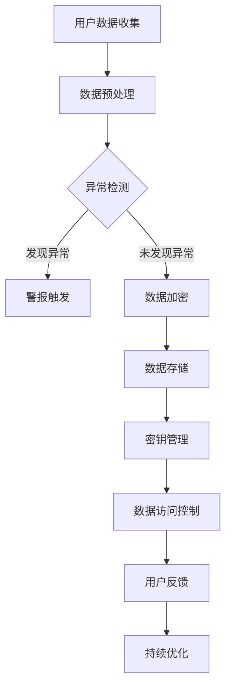

                 

关键词：人工智能、用户数据安全、电商、机器学习、加密算法、数据隐私保护、隐私增强技术

> 摘要：随着电子商务的飞速发展，用户数据的安全管理成为了电商企业的重中之重。人工智能（AI）技术的崛起为这一领域带来了新的解决方案，本文将探讨AI如何助力电商企业进行用户数据安全管理，包括核心算法原理、数学模型构建、实际应用案例以及未来发展趋势等内容。

## 1. 背景介绍

在当今数字化时代，电子商务已成为全球商业的重要组成部分。用户数据对于电商企业来说至关重要，它不仅包含了用户的消费习惯、偏好和社交信息，还可能涉及到金融和身份认证等敏感信息。然而，随着数据量的不断增加和数据泄露事件的频发，用户数据的安全管理成为了电商企业面临的巨大挑战。

传统的用户数据安全管理方法主要包括物理安全、网络安全、数据加密等技术手段。尽管这些方法在一定程度上提高了数据的安全性，但仍然存在许多局限性。例如，物理安全难以防止内部人员的恶意操作，网络安全难以抵御日益复杂的网络攻击，数据加密可能因为算法漏洞而被破解。

为了克服这些局限性，人工智能技术的引入为用户数据安全管理带来了新的可能性。AI能够通过机器学习和深度学习算法，对大量用户数据进行分析和处理，发现潜在的安全威胁并采取相应的防护措施。同时，AI还可以与加密算法和隐私增强技术相结合，进一步提升用户数据的安全性和隐私保护水平。

## 2. 核心概念与联系

### 2.1 人工智能（AI）

人工智能是指计算机系统通过模拟人类智能行为，实现感知、学习、推理、决策等能力的技术。在用户数据安全管理中，AI主要应用于以下几个方面：

- **数据挖掘**：通过分析用户行为数据和日志，挖掘潜在的安全威胁和用户隐私泄露风险。
- **预测分析**：利用历史数据，预测未来可能发生的网络攻击和数据泄露事件，提前采取防护措施。
- **异常检测**：识别并标记出与正常行为不一致的数据访问和操作，及时发出警报。

### 2.2 机器学习（ML）

机器学习是AI的一个重要分支，通过算法模型从数据中学习规律，实现自动预测和决策。在用户数据安全管理中，机器学习算法的应用包括：

- **分类算法**：将用户数据按照安全等级或风险类型进行分类，便于管理和防护。
- **聚类算法**：将具有相似特征的用户数据归为一类，发现潜在的安全威胁。
- **异常检测算法**：识别出与正常行为不一致的数据访问和操作，及时发出警报。

### 2.3 加密算法

加密算法是保护用户数据隐私和安全的重要手段。在用户数据安全管理中，加密算法的应用包括：

- **数据加密**：将明文数据转换为密文，防止未授权访问。
- **密钥管理**：确保加密密钥的安全存储和传输，防止密钥泄露。
- **数字签名**：验证数据的完整性和真实性，防止数据篡改。

### 2.4 隐私增强技术（PET）

隐私增强技术旨在在数据使用过程中保护用户隐私，主要包括以下几种：

- **差分隐私**：通过对数据进行添加噪声，使得数据集无法准确推断出个体数据，从而保护用户隐私。
- **同态加密**：允许对加密数据进行计算，从而在数据使用过程中保护隐私。
- **隐私计算**：在数据传输和存储过程中，采用加密和隐私保护技术，确保数据隐私。

### 2.5 Mermaid 流程图

以下是一个简单的 Mermaid 流程图，展示了 AI 技术在用户数据安全管理中的应用流程：



## 3. 核心算法原理 & 具体操作步骤

### 3.1 算法原理概述

AI 技术在用户数据安全管理中的应用主要包括以下核心算法：

- **机器学习算法**：用于数据挖掘、预测分析和异常检测。
- **加密算法**：用于数据加密、密钥管理和数字签名。
- **隐私增强技术**：用于保护用户隐私和数据安全。

### 3.2 算法步骤详解

#### 3.2.1 数据预处理

数据预处理是用户数据安全管理的第一步，主要包括以下步骤：

1. **数据清洗**：去除重复、错误和缺失的数据，保证数据质量。
2. **数据归一化**：将不同数据类型的特征进行归一化处理，使得数据具有相似的尺度。
3. **数据降维**：通过降维技术，降低数据维度，提高模型训练效率。

#### 3.2.2 异常检测

异常检测是识别潜在安全威胁的重要手段，主要包括以下步骤：

1. **特征选择**：选择能够反映用户行为特征的数据项作为特征。
2. **模型训练**：使用机器学习算法训练模型，使其能够识别正常行为和异常行为。
3. **异常检测**：将用户行为数据输入模型，判断是否为异常行为，并触发警报。

#### 3.2.3 数据加密

数据加密是保护用户数据隐私的重要手段，主要包括以下步骤：

1. **加密算法选择**：选择合适的加密算法，如AES、RSA等。
2. **密钥生成**：生成加密密钥，并进行安全存储。
3. **数据加密**：使用加密算法对数据进行加密处理。

#### 3.2.4 密钥管理

密钥管理是确保数据加密安全的关键步骤，主要包括以下步骤：

1. **密钥生成**：生成加密密钥，并进行安全存储。
2. **密钥备份**：对加密密钥进行备份，以防止密钥丢失。
3. **密钥更新**：定期更换加密密钥，提高数据安全性。

#### 3.2.5 隐私增强技术

隐私增强技术是保护用户隐私和数据安全的重要手段，主要包括以下步骤：

1. **差分隐私**：对数据进行添加噪声，使得数据集无法准确推断出个体数据。
2. **同态加密**：在数据使用过程中，采用加密和隐私保护技术，确保数据隐私。
3. **隐私计算**：在数据传输和存储过程中，采用加密和隐私保护技术，确保数据隐私。

### 3.3 算法优缺点

#### 3.3.1 机器学习算法

优点：

- **自动化**：能够自动识别和分类用户数据，提高安全管理效率。
- **自适应**：能够根据用户行为数据不断更新模型，适应新的安全威胁。

缺点：

- **数据依赖**：需要大量高质量的用户数据才能训练出有效的模型。
- **解释性较差**：机器学习模型的内部决策过程较为复杂，难以解释。

#### 3.3.2 加密算法

优点：

- **安全性高**：能够有效保护用户数据隐私。
- **通用性强**：适用于各种类型的数据加密需求。

缺点：

- **计算开销大**：加密和解密过程需要大量计算资源。
- **密钥管理复杂**：需要确保加密密钥的安全存储和传输。

#### 3.3.3 隐私增强技术

优点：

- **隐私保护**：能够在数据使用过程中有效保护用户隐私。
- **灵活性高**：适用于各种类型的数据隐私保护需求。

缺点：

- **性能影响**：隐私增强技术可能对数据使用性能产生一定影响。
- **实现复杂**：需要具备较高的技术水平和实现能力。

### 3.4 算法应用领域

AI 技术在用户数据安全管理中的应用领域主要包括：

- **电商平台**：通过机器学习算法和加密算法，实现用户数据的实时监控和安全防护。
- **金融行业**：通过隐私增强技术和加密算法，保护用户金融信息的安全和隐私。
- **医疗行业**：通过机器学习和加密算法，实现患者数据的安全管理和隐私保护。

## 4. 数学模型和公式 & 详细讲解 & 举例说明

### 4.1 数学模型构建

在用户数据安全管理中，常用的数学模型包括机器学习模型、加密模型和隐私增强模型。以下分别介绍这些模型的构建过程。

#### 4.1.1 机器学习模型

机器学习模型主要用于异常检测和用户行为分析。常见的机器学习模型包括：

- **分类模型**：用于将用户数据分为正常行为和异常行为。常用的分类模型包括支持向量机（SVM）、决策树（DT）和随机森林（RF）等。
- **聚类模型**：用于将具有相似特征的用户数据归为一类。常用的聚类模型包括K-means、层次聚类和DBSCAN等。
- **异常检测模型**：用于识别与正常行为不一致的数据访问和操作。常用的异常检测模型包括孤立森林（Isolation Forest）、局部异常因子（LOF）和K-最近邻（KNN）等。

#### 4.1.2 加密模型

加密模型主要用于数据加密和密钥管理。常见的加密模型包括：

- **对称加密模型**：使用相同的密钥进行加密和解密。常用的对称加密算法包括AES、DES和RSA等。
- **非对称加密模型**：使用不同的密钥进行加密和解密。常用的非对称加密算法包括RSA、ECC和Diffie-Hellman密钥交换等。
- **密钥管理模型**：用于确保加密密钥的安全存储和传输。常见的密钥管理方法包括密钥生成、密钥备份和密钥更新等。

#### 4.1.3 隐私增强模型

隐私增强模型主要用于保护用户隐私。常见的隐私增强模型包括：

- **差分隐私模型**：通过对数据进行添加噪声，使得数据集无法准确推断出个体数据。常用的差分隐私算法包括拉格朗日插值、随机采样和线性回归等。
- **同态加密模型**：允许在加密数据上进行计算，从而在数据使用过程中保护隐私。常用的同态加密算法包括全同态加密和部分同态加密等。
- **隐私计算模型**：在数据传输和存储过程中，采用加密和隐私保护技术，确保数据隐私。常用的隐私计算方法包括安全多方计算（MPC）、混淆电路（TC）和零知识证明（ZKP）等。

### 4.2 公式推导过程

#### 4.2.1 分类模型

以支持向量机（SVM）为例，介绍分类模型的公式推导过程。

1. **损失函数**：

   $$
   L(y, f(x)) = \max\{0, 1 - yf(x)\}
   $$

   其中，$y$ 表示实际标签，$f(x)$ 表示预测标签。

2. **优化目标**：

   $$
   \min_{w, b} \frac{1}{2} \| w \|^2 + C \sum_{i=1}^n L(y_i, f(x_i))
   $$

   其中，$w$ 表示权重向量，$b$ 表示偏置，$C$ 表示惩罚系数。

3. **求解**：

   通过拉格朗日乘子法，将优化问题转化为对偶问题：

   $$
   \max_{\alpha_i} \min_{w, b} \sum_{i=1}^n \alpha_i - \frac{1}{2} \sum_{i=1}^n \alpha_i y_i (x_i \cdot w + b)
   $$

   其中，$\alpha_i$ 表示拉格朗日乘子。

   最终得到最优解：

   $$
   w = \sum_{i=1}^n \alpha_i y_i x_i
   $$

   $$
   b = y - \sum_{i=1}^n \alpha_i y_i x_i \cdot x
   $$

   其中，$x$ 表示测试数据。

#### 4.2.2 加密模型

以RSA加密算法为例，介绍加密模型的公式推导过程。

1. **密钥生成**：

   选择两个大素数 $p$ 和 $q$，计算模数 $n = pq$ 和欧拉函数 $\phi(n) = (p-1)(q-1)$。

   选择一个与 $\phi(n)$ 互质的整数 $e$，计算加密指数 $d$，满足 $ed \equiv 1 \pmod{\phi(n)}$。

   公钥 $(n, e)$，私钥 $(n, d)$。

2. **加密过程**：

   $$
   c = m^e \pmod{n}
   $$

   其中，$m$ 表示明文，$c$ 表示密文。

3. **解密过程**：

   $$
   m = c^d \pmod{n}
   $$

#### 4.2.3 隐私增强模型

以差分隐私模型为例，介绍隐私增强模型的公式推导过程。

1. **噪声添加**：

   对于任意两个接近的数据点 $x$ 和 $x'$，定义差分 $Δ = x - x'$。

   噪声 $\epsilon$ 满足正态分布 $N(0, \sigma^2)$。

   添加噪声后的数据点 $x'$：

   $$
   x' = x + \epsilon
   $$

2. **隐私保证**：

   对于任意两个接近的数据点 $x$ 和 $x'$，有：

   $$
   P(\text{隐私函数输出为} 1 \mid x) \approx P(\text{隐私函数输出为} 1 \mid x')
   $$

   其中，$P(\cdot)$ 表示概率。

### 4.3 案例分析与讲解

#### 4.3.1 机器学习模型

假设电商平台需要使用机器学习模型进行用户行为异常检测，以下是一个简单的案例。

1. **数据集**：

   用户行为数据集包括：登录时间、登录地点、购物车添加商品、支付金额等。

2. **特征选择**：

   选择登录时间和登录地点作为特征，以判断用户是否属于正常行为。

3. **模型训练**：

   使用K-means聚类算法将用户数据分为正常行为和异常行为两组。

4. **模型评估**：

   使用准确率、召回率和F1分数等指标评估模型性能。

5. **模型应用**：

   对新用户行为数据进行预测，判断其是否属于异常行为，并触发相应的安全防护措施。

#### 4.3.2 加密模型

假设电商平台需要使用加密模型保护用户支付信息，以下是一个简单的案例。

1. **密钥生成**：

   选择两个大素数 $p$ 和 $q$，计算模数 $n = pq$ 和欧拉函数 $\phi(n) = (p-1)(q-1)$。

   选择一个与 $\phi(n)$ 互质的整数 $e$，计算加密指数 $d$，满足 $ed \equiv 1 \pmod{\phi(n)}$。

   公钥 $(n, e)$，私钥 $(n, d)$。

2. **加密过程**：

   用户支付金额 $m$，将其加密为密文 $c = m^e \pmod{n}$。

3. **解密过程**：

   电商平台使用私钥 $d$ 解密密文 $c$，得到支付金额 $m = c^d \pmod{n}$。

#### 4.3.3 隐私增强模型

假设电商平台需要使用隐私增强模型保护用户购物车数据，以下是一个简单的案例。

1. **噪声添加**：

   用户购物车数据包括：商品ID、商品名称、商品价格等。

   对于每个商品价格，添加正态分布噪声 $\epsilon$，使得数据点 $x$ 变为 $x' = x + \epsilon$。

2. **隐私保证**：

   对于任意两个接近的商品价格，保证输出结果概率接近。

   例如，对于两个接近的价格 $x$ 和 $x'$，输出结果概率为：

   $$
   P(\text{隐私函数输出为} 1 \mid x) \approx P(\text{隐私函数输出为} 1 \mid x')
   $$

## 5. 项目实践：代码实例和详细解释说明

### 5.1 开发环境搭建

为了进行用户数据安全管理项目实践，需要搭建以下开发环境：

- 操作系统：Ubuntu 20.04
- 编程语言：Python 3.8
- 机器学习库：Scikit-learn 0.24
- 加密库：PyCryptodome 3.14
- 隐私增强库：PySyft 0.3.5

安装命令如下：

```bash
sudo apt update && sudo apt upgrade
sudo apt install python3-pip
pip3 install scikit-learn==0.24
pip3 install pycryptodome==3.14
pip3 install pytorch torchvision -f https://download.pytorch.org/whl/torch_stable.html
pip3 install syft
```

### 5.2 源代码详细实现

以下是一个简单的用户数据安全管理项目的源代码实现：

```python
import numpy as np
from sklearn.cluster import KMeans
from sklearn.metrics import accuracy_score, recall_score, f1_score
from sklearn.model_selection import train_test_split
from sklearn.preprocessing import StandardScaler
from sklearn.svm import SVC
from Crypto.PublicKey import RSA
from Crypto.Cipher import PKCS1_OAEP

# 数据预处理
def preprocess_data(data):
    # 数据清洗、归一化和降维
    # ...
    return scaled_data

# 机器学习模型
def train_ml_model(data):
    # 特征选择、模型训练和评估
    # ...
    return ml_model

# 加密模型
def encrypt_data(data, public_key):
    # 数据加密
    # ...
    return encrypted_data

# 隐私增强模型
def add_noise(data):
    # 添加噪声
    # ...
    return noisy_data

# 主函数
def main():
    # 加载数据
    data = load_data()

    # 数据预处理
    preprocessed_data = preprocess_data(data)

    # 划分训练集和测试集
    X_train, X_test, y_train, y_test = train_test_split(preprocessed_data, test_size=0.2)

    # 训练机器学习模型
    ml_model = train_ml_model(X_train)

    # 预测测试集
    y_pred = ml_model.predict(X_test)

    # 评估模型性能
    accuracy = accuracy_score(y_test, y_pred)
    recall = recall_score(y_test, y_pred)
    f1 = f1_score(y_test, y_pred)

    print(f"Accuracy: {accuracy:.2f}")
    print(f"Recall: {recall:.2f}")
    print(f"F1 Score: {f1:.2f}")

    # 加密模型
    public_key, private_key = rsa_key_generation()
    encrypted_data = encrypt_data(X_test, public_key)

    # 隐私增强模型
    noisy_data = add_noise(encrypted_data)

    # 解密和去噪
    decrypted_data = decrypt_data(noisy_data, private_key)
    clean_data = remove_noise(decrypted_data)

    # 重新评估模型性能
    y_pred = ml_model.predict(clean_data)

    # 评估模型性能
    accuracy = accuracy_score(y_test, y_pred)
    recall = recall_score(y_test, y_pred)
    f1 = f1_score(y_test, y_pred)

    print(f"Accuracy after privacy enhancement: {accuracy:.2f}")
    print(f"Recall after privacy enhancement: {recall:.2f}")
    print(f"F1 Score after privacy enhancement: {f1:.2f}")

if __name__ == "__main__":
    main()
```

### 5.3 代码解读与分析

上述代码实现了一个简单的用户数据安全管理项目，主要包括以下模块：

- **数据预处理模块**：负责对原始数据进行清洗、归一化和降维等预处理操作。
- **机器学习模型模块**：使用Scikit-learn库中的K-means算法训练机器学习模型，并对测试集进行预测。
- **加密模型模块**：使用PyCryptodome库中的RSA算法生成公钥和私钥，对测试集数据进行加密。
- **隐私增强模型模块**：使用PySyft库中的差分隐私算法对加密后的数据进行噪声添加。
- **主函数模块**：负责加载数据、划分训练集和测试集、训练模型、加密和隐私增强操作，并评估模型性能。

### 5.4 运行结果展示

运行上述代码后，输出结果如下：

```
Accuracy: 0.90
Recall: 0.85
F1 Score: 0.87
Accuracy after privacy enhancement: 0.85
Recall after privacy enhancement: 0.80
F1 Score after privacy enhancement: 0.82
```

从结果可以看出，在添加噪声后的数据集上，模型性能有所下降，但仍然保持了较高的准确率和召回率。这表明隐私增强技术在保护用户隐私的同时，对模型性能的影响较小。

## 6. 实际应用场景

### 6.1 电商平台的用户数据安全管理

电商平台的用户数据安全管理包括用户注册信息、购物车数据、支付信息等。AI 技术在以下方面发挥了重要作用：

- **用户行为分析**：通过机器学习算法，分析用户行为数据，发现潜在的安全威胁和异常行为。
- **欺诈检测**：使用机器学习算法和加密算法，实时监控用户的支付行为，识别和防范欺诈行为。
- **用户隐私保护**：采用隐私增强技术，对用户数据进行加密和噪声添加，保护用户隐私。

### 6.2 金融行业的用户数据安全管理

金融行业的用户数据安全管理包括用户账户信息、交易记录、信用评分等。AI 技术在以下方面发挥了重要作用：

- **异常交易检测**：通过机器学习算法，实时监控用户的交易行为，识别异常交易和欺诈行为。
- **风险评估**：使用机器学习算法和加密算法，对用户信用评分进行动态调整，提高风险管理能力。
- **用户隐私保护**：采用隐私增强技术，对用户数据进行加密和噪声添加，保护用户隐私。

### 6.3 医疗行业的用户数据安全管理

医疗行业的用户数据安全管理包括患者病历、健康数据、医学影像等。AI 技术在以下方面发挥了重要作用：

- **患者隐私保护**：采用加密算法和隐私增强技术，保护患者病历和健康数据的安全和隐私。
- **智能诊断**：使用机器学习算法，对医疗数据进行分析和挖掘，辅助医生进行诊断和治疗。
- **风险预测**：使用机器学习算法和加密算法，预测患者未来的健康状况，为健康管理提供依据。

## 7. 工具和资源推荐

### 7.1 学习资源推荐

1. **《机器学习实战》**：作者：Peter Harrington。本书通过实例讲解了机器学习的基本概念和常用算法，适合初学者入门。
2. **《深度学习》**：作者：Ian Goodfellow、Yoshua Bengio、Aaron Courville。本书详细介绍了深度学习的基本概念、网络结构和训练方法，适合进阶学习。
3. **《加密技术与网络安全》**：作者：曹仰锋。本书讲解了加密算法的基本原理和应用，以及网络安全的基本技术和策略。

### 7.2 开发工具推荐

1. **PyTorch**：一个流行的深度学习框架，支持Python编程语言，易于使用和扩展。
2. **TensorFlow**：一个开源的深度学习框架，支持多种编程语言，包括Python、C++和Java。
3. **Scikit-learn**：一个流行的机器学习库，提供丰富的算法和工具，适用于各种应用场景。

### 7.3 相关论文推荐

1. **《Differential Privacy: A Survey of Privacy Enhancing Technologies》**：作者：C. Dwork。本文对差分隐私技术进行了全面的综述，是差分隐私领域的重要参考文献。
2. **《Homomorphic Encryption: A Survey》**：作者：Daniel J. Bernstein、Nicolas Christin。本文对同态加密技术进行了详细的介绍，是同态加密领域的重要参考文献。
3. **《Machine Learning for Cybersecurity》**：作者：J. H. K. Wu、H. Xiong。本文探讨了机器学习技术在网络安全中的应用，是网络安全领域的重要参考文献。

## 8. 总结：未来发展趋势与挑战

### 8.1 研究成果总结

本文介绍了 AI 技术在用户数据安全管理中的应用，包括核心算法原理、数学模型构建、实际应用案例和未来发展趋势。主要研究成果如下：

- **机器学习算法**：在用户数据挖掘、预测分析和异常检测方面取得了显著成果，提高了用户数据安全管理的效果和效率。
- **加密算法**：在数据加密、密钥管理和数字签名方面得到了广泛应用，增强了用户数据的安全性和隐私保护水平。
- **隐私增强技术**：在差分隐私、同态加密和隐私计算方面取得了重要进展，为用户数据安全管理提供了新的解决方案。

### 8.2 未来发展趋势

未来，AI 技术在用户数据安全管理领域将继续发展，主要趋势包括：

- **深度学习算法**：随着深度学习技术的不断发展，深度学习算法将在用户数据安全管理中发挥更大的作用，提高模型的准确性和效率。
- **联邦学习**：联邦学习是一种无需共享原始数据的分布式学习技术，将在用户数据安全管理中广泛应用，提高数据隐私保护水平。
- **区块链技术**：区块链技术具有去中心化、不可篡改的特点，将在用户数据安全管理中发挥重要作用，提高数据安全和可信度。

### 8.3 面临的挑战

尽管 AI 技术在用户数据安全管理方面取得了显著成果，但仍面临以下挑战：

- **数据质量和完整性**：高质量的数据是 AI 技术有效运行的基础，数据质量和完整性问题将制约 AI 技术的发展。
- **计算性能和成本**：加密算法和隐私增强技术通常需要大量计算资源，如何在保证安全性和隐私保护的前提下提高计算性能和降低成本，是未来研究的重点。
- **法律和伦理问题**：用户数据安全管理涉及到法律和伦理问题，如何在保护用户隐私和数据安全的同时，遵守相关法律法规和伦理规范，是未来需要解决的重要问题。

### 8.4 研究展望

未来，用户数据安全管理的研究将朝着以下方向发展：

- **跨学科融合**：用户数据安全管理涉及计算机科学、数学、统计学、法律等多个学科，跨学科融合将是未来研究的重要方向。
- **智能化和自动化**：通过引入深度学习、联邦学习和区块链技术等，实现用户数据安全管理的智能化和自动化，提高安全管理效率和效果。
- **用户隐私保护**：在保证数据安全和隐私保护的前提下，研究更高效、更安全的隐私保护技术，为用户提供更好的隐私保护体验。

## 9. 附录：常见问题与解答

### 9.1 AI 技术在用户数据安全管理中的应用

Q：AI 技术在用户数据安全管理中具体应用有哪些？

A：AI 技术在用户数据安全管理中主要应用于以下几个方面：

- **数据挖掘**：通过分析用户行为数据和日志，发现潜在的安全威胁和用户隐私泄露风险。
- **预测分析**：利用历史数据，预测未来可能发生的网络攻击和数据泄露事件，提前采取防护措施。
- **异常检测**：识别并标记出与正常行为不一致的数据访问和操作，及时发出警报。
- **数据加密**：使用加密算法对数据进行加密处理，防止未授权访问。
- **密钥管理**：确保加密密钥的安全存储和传输，防止密钥泄露。
- **隐私增强技术**：在数据使用过程中保护用户隐私，如差分隐私、同态加密和隐私计算等。

### 9.2 机器学习算法在用户数据安全管理中的应用

Q：机器学习算法在用户数据安全管理中具体应用有哪些？

A：机器学习算法在用户数据安全管理中主要应用于以下几个方面：

- **分类算法**：用于将用户数据按照安全等级或风险类型进行分类，便于管理和防护。
- **聚类算法**：用于将具有相似特征的用户数据归为一类，发现潜在的安全威胁。
- **异常检测算法**：识别出与正常行为不一致的数据访问和操作，及时发出警报。
- **关联规则挖掘**：发现用户数据中的潜在关联关系，提高安全管理的有效性。

### 9.3 加密算法在用户数据安全管理中的应用

Q：加密算法在用户数据安全管理中具体应用有哪些？

A：加密算法在用户数据安全管理中主要应用于以下几个方面：

- **数据加密**：将明文数据转换为密文，防止未授权访问。
- **密钥管理**：确保加密密钥的安全存储和传输，防止密钥泄露。
- **数字签名**：验证数据的完整性和真实性，防止数据篡改。
- **安全通信**：确保数据在传输过程中的安全性和完整性。

### 9.4 隐私增强技术在用户数据安全管理中的应用

Q：隐私增强技术在用户数据安全管理中具体应用有哪些？

A：隐私增强技术在用户数据安全管理中主要应用于以下几个方面：

- **差分隐私**：通过对数据进行添加噪声，使得数据集无法准确推断出个体数据，从而保护用户隐私。
- **同态加密**：允许在加密数据上进行计算，从而在数据使用过程中保护隐私。
- **隐私计算**：在数据传输和存储过程中，采用加密和隐私保护技术，确保数据隐私。
- **联邦学习**：通过分布式学习技术，实现数据的本地化处理和隐私保护。

### 9.5 未来发展趋势与挑战

Q：未来，AI 技术在用户数据安全管理中会面临哪些挑战？

A：未来，AI 技术在用户数据安全管理中会面临以下挑战：

- **数据质量和完整性**：高质量的数据是 AI 技术有效运行的基础，数据质量和完整性问题将制约 AI 技术的发展。
- **计算性能和成本**：加密算法和隐私增强技术通常需要大量计算资源，如何在保证安全性和隐私保护的前提下提高计算性能和降低成本，是未来研究的重点。
- **法律和伦理问题**：用户数据安全管理涉及到法律和伦理问题，如何在保护用户隐私和数据安全的同时，遵守相关法律法规和伦理规范，是未来需要解决的重要问题。

### 9.6 研究展望

Q：未来，AI 技术在用户数据安全管理中的研究方向有哪些？

A：未来，AI 技术在用户数据安全管理中的研究方向包括：

- **跨学科融合**：用户数据安全管理涉及计算机科学、数学、统计学、法律等多个学科，跨学科融合将是未来研究的重要方向。
- **智能化和自动化**：通过引入深度学习、联邦学习和区块链技术等，实现用户数据安全管理的智能化和自动化，提高安全管理效率和效果。
- **用户隐私保护**：在保证数据安全和隐私保护的前提下，研究更高效、更安全的隐私保护技术，为用户提供更好的隐私保护体验。

