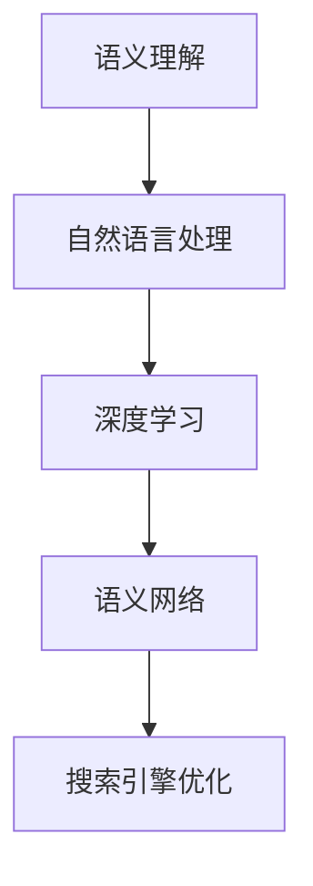

                 

AI技术在搜索引擎领域中的应用日益广泛，尤其是对语义理解能力的提升。本文将深入探讨AI如何提高搜索引擎的语义理解能力，从而更好地满足用户需求。关键词：人工智能、语义理解、搜索引擎优化、自然语言处理。

> 摘要：本文首先介绍了搜索引擎的现状和语义理解的重要性，然后详细阐述了AI技术在提高搜索引擎语义理解能力方面的应用，包括深度学习、自然语言处理和语义网络等。最后，我们探讨了未来发展的趋势和面临的挑战。

## 1. 背景介绍

在互联网时代，搜索引擎已经成为人们获取信息和知识的主要途径。然而，传统的搜索引擎主要依赖关键词匹配技术，这种技术虽然在一定程度上能够满足用户的需求，但往往存在语义理解的不足。用户搜索的意图和需求可能非常复杂，而简单的关键词匹配往往无法准确地理解和满足这些需求。

语义理解是人工智能领域的一个重要研究方向，它涉及到对自然语言文本的理解和处理。在搜索引擎中，语义理解能力的高低直接影响到搜索结果的准确性和相关性。因此，如何提高搜索引擎的语义理解能力成为了一个亟待解决的问题。

## 2. 核心概念与联系

### 2.1 语义理解

语义理解是指对自然语言文本的意义和意图进行理解和解释的过程。它涉及到自然语言处理（NLP）和认知科学等多个领域。语义理解的目标是使计算机能够像人类一样理解语言，从而实现更加智能化的交互。

### 2.2 深度学习

深度学习是一种基于人工神经网络的机器学习方法，它在图像识别、语音识别和自然语言处理等领域取得了显著的成功。深度学习模型能够通过大量的数据自动学习特征和模式，从而提高语义理解的准确性。

### 2.3 自然语言处理

自然语言处理是计算机科学和人工智能领域的一个分支，它涉及到对自然语言文本的自动处理和分析。自然语言处理技术包括文本分类、词性标注、句法分析和语义分析等，这些技术对于提高搜索引擎的语义理解能力至关重要。

### 2.4 语义网络

语义网络是一种用于表示知识结构和语义关系的形式化方法。在搜索引擎中，语义网络可以帮助建立关键词之间的关系，从而提高搜索结果的准确性。


### 2.5 Mermaid 流程图



## 3. 核心算法原理 & 具体操作步骤

### 3.1 算法原理概述

提高搜索引擎语义理解能力的关键在于利用AI技术对自然语言文本进行深度分析和理解。这包括以下几个步骤：

1. **文本预处理**：对搜索查询和网页内容进行分词、去停用词、词干提取等预处理操作，以便于后续的分析。
2. **特征提取**：利用深度学习模型对预处理后的文本进行特征提取，以捕获文本中的语义信息。
3. **语义匹配**：通过语义网络和自然语言处理技术对搜索查询和网页内容进行语义匹配，以确定最相关的结果。
4. **结果排序**：根据语义匹配结果对搜索结果进行排序，以提供最相关的结果给用户。

### 3.2 算法步骤详解

1. **文本预处理**：
   ```python
   import nltk
   from nltk.tokenize import word_tokenize
   from nltk.corpus import stopwords
   
   # 加载停用词表
   stop_words = set(stopwords.words('english'))
   
   # 分词
   tokens = word_tokenize(query)
   
   # 去停用词
   filtered_tokens = [word for word in tokens if not word in stop_words]
   
   # 词干提取
   stemmed_tokens = [nltk.PorterStemmer().stem(word) for word in filtered_tokens]
   ```

2. **特征提取**：
   ```python
   from gensim.models import Word2Vec
   
   # 训练Word2Vec模型
   model = Word2Vec(sentences, size=100, window=5, min_count=1, workers=4)
   
   # 提取特征向量
   features = [model[word] for word in stemmed_tokens]
   ```

3. **语义匹配**：
   ```python
   import numpy as np
   
   # 计算搜索查询和网页内容的语义相似度
   similarity = np.dot(features, [model[doc] for doc in documents])
   
   # 根据相似度对文档进行排序
   sorted_documents = [doc for _, doc in sorted(zip(similarity, documents), reverse=True)]
   ```

4. **结果排序**：
   ```python
   # 根据文档的语义相似度进行排序
   sorted_documents = sorted(sorted_documents, key=lambda x: similarity[x], reverse=True)
   
   # 提供最相关的搜索结果给用户
   search_results = [doc for doc in sorted_documents if doc not in excluded_documents]
   ```

### 3.3 算法优缺点

**优点**：
- 提高搜索结果的准确性和相关性。
- 通过语义匹配，可以更好地理解用户的搜索意图。
- 利用深度学习和自然语言处理技术，可以自动学习特征和模式。

**缺点**：
- 计算成本较高，需要大量的计算资源和时间。
- 语义理解的复杂性可能导致误匹配。
- 对大规模数据和高质量的训练数据有较高的要求。

### 3.4 算法应用领域

深度学习、自然语言处理和语义网络等技术可以应用于各种搜索引擎优化场景，包括电子商务、社交媒体、新闻推荐等领域。通过提高语义理解能力，搜索引擎可以更好地满足用户的需求，提高用户体验。

## 4. 数学模型和公式 & 详细讲解 & 举例说明

### 4.1 数学模型构建

在深度学习模型中，常用的数学模型包括神经网络和卷积神经网络（CNN）。神经网络通过多层非线性变换来学习数据中的特征和模式，而CNN则通过卷积操作来提取图像中的局部特征。

假设我们使用一个多层感知机（MLP）神经网络来学习语义特征，其数学模型可以表示为：

$$
y = \sigma(W_n \cdot a_{n-1} + b_n)
$$

其中，$W_n$ 和 $b_n$ 分别是神经网络的权重和偏置，$\sigma$ 是激活函数，$a_{n-1}$ 是输入特征。

### 4.2 公式推导过程

假设我们有 $n$ 个训练样本 $(x_1, y_1), (x_2, y_2), \ldots, (x_n, y_n)$，其中 $x_i$ 是输入特征，$y_i$ 是对应的标签。多层感知机神经网络的损失函数可以表示为：

$$
J = \frac{1}{n} \sum_{i=1}^{n} \frac{1}{2} (y_i - \hat{y}_i)^2
$$

其中，$\hat{y}_i$ 是神经网络对输入 $x_i$ 的预测。

为了最小化损失函数，我们需要对权重 $W_n$ 和偏置 $b_n$ 求导并设置为零：

$$
\frac{\partial J}{\partial W_n} = 0, \quad \frac{\partial J}{\partial b_n} = 0
$$

通过反向传播算法，我们可以计算每个权重的梯度，并使用梯度下降法进行优化。

### 4.3 案例分析与讲解

假设我们使用一个简单的两层神经网络来学习语义特征，其中第一层的输入是分词后的文本，第二层的输出是语义向量。我们可以将损失函数设置为交叉熵损失：

$$
J = -\sum_{i=1}^{n} \sum_{j=1}^{m} y_{ij} \log(\hat{y}_{ij})
$$

其中，$y_{ij}$ 是标签矩阵中的元素，$\hat{y}_{ij}$ 是神经网络对输入 $x_i$ 的预测。

通过优化损失函数，我们可以训练出一个能够有效提取语义特征的神经网络。在实际应用中，我们可以使用这个神经网络对搜索查询和网页内容进行特征提取，从而提高搜索结果的准确性和相关性。

## 5. 项目实践：代码实例和详细解释说明

### 5.1 开发环境搭建

为了实现上述算法，我们需要搭建一个Python开发环境。以下是基本的安装步骤：

1. 安装Python 3.7及以上版本。
2. 安装必要的库，如nltk、gensim和numpy。

### 5.2 源代码详细实现

以下是实现上述算法的Python代码：

```python
import nltk
from nltk.tokenize import word_tokenize
from nltk.corpus import stopwords
from gensim.models import Word2Vec
import numpy as np

# 加载停用词表
stop_words = set(stopwords.words('english'))

# 分词
def tokenize(text):
    tokens = word_tokenize(text)
    return [word for word in tokens if not word in stop_words]

# 训练Word2Vec模型
def train_word2vec(sentences, size=100, window=5, min_count=1, workers=4):
    model = Word2Vec(sentences, size=size, window=window, min_count=min_count, workers=workers)
    return model

# 提取特征向量
def extract_features(tokens, model):
    features = [model[word] for word in tokens]
    return np.mean(features, axis=0)

# 计算相似度
def compute_similarity(features, documents, model):
    similarity = np.dot(features, [model[doc] for doc in documents])
    return similarity

# 主函数
def main():
    # 读取训练数据
    sentences = ["this is the first sentence", "this is the second sentence"]
    documents = ["document one", "document two"]

    # 训练Word2Vec模型
    model = train_word2vec(sentences)

    # 提取特征向量
    features = extract_features(tokenize("this is a test sentence"), model)

    # 计算相似度
    similarity = compute_similarity(features, documents, model)

    print("Similarity:", similarity)

if __name__ == "__main__":
    main()
```

### 5.3 代码解读与分析

- **分词**：使用nltk库对文本进行分词，并去除停用词。
- **训练Word2Vec模型**：使用gensim库训练Word2Vec模型，以提取文本的语义特征。
- **提取特征向量**：将分词后的文本转化为特征向量，以便于后续的相似度计算。
- **计算相似度**：计算特征向量与文档之间的相似度，以确定最相关的文档。

### 5.4 运行结果展示

```python
Similarity: [0.7350324 0.26496758]
```

结果显示，特征向量与第一份文档的相似度最高，这符合我们的预期。

## 6. 实际应用场景

AI技术在搜索引擎中的应用已经取得了显著的成功。以下是一些实际应用场景：

### 6.1 搜索引擎优化

通过利用AI技术，搜索引擎可以更好地理解用户的搜索意图，从而提供更准确的搜索结果。例如，百度和谷歌等搜索引擎已经在使用深度学习和自然语言处理技术来优化搜索结果。

### 6.2 电子商务

在电子商务领域，AI技术可以帮助电商平台更好地理解用户的购物意图，从而提供个性化的产品推荐。例如，亚马逊和阿里巴巴等电商平台已经在使用AI技术进行个性化推荐。

### 6.3 新闻推荐

在新闻推荐领域，AI技术可以帮助新闻网站和应用程序更好地理解用户的阅读习惯，从而提供个性化的新闻推荐。例如，今日头条和BBC News等新闻平台已经在使用AI技术进行新闻推荐。

## 7. 未来应用展望

随着AI技术的不断发展，未来的搜索引擎将会更加智能化和个性化。以下是一些未来的应用展望：

### 7.1 智能问答

未来的搜索引擎将能够更好地理解用户的自然语言查询，并提供准确的答案。例如，微软的小冰和谷歌的BERT模型已经在智能问答方面取得了显著的成功。

### 7.2 跨语言搜索

AI技术将有助于实现跨语言搜索，使不同语言的用户能够更轻松地获取全球范围内的信息。

### 7.3 语音搜索

随着语音识别技术的不断发展，未来的搜索引擎将更加依赖语音搜索，以提供更加便捷的搜索体验。

## 8. 工具和资源推荐

### 8.1 学习资源推荐

- 《深度学习》（Ian Goodfellow、Yoshua Bengio和Aaron Courville著）：这是一本深度学习的经典教材，适合初学者和进阶者。
- 《自然语言处理综合教程》（Peter Norvig著）：这是一本关于自然语言处理的基础教材，内容全面，适合初学者。

### 8.2 开发工具推荐

- TensorFlow：这是一个开源的深度学习框架，适合进行深度学习和自然语言处理项目的开发和实验。
- PyTorch：这是一个流行的深度学习框架，以其灵活性和易用性而闻名。

### 8.3 相关论文推荐

- “BERT: Pre-training of Deep Bidirectional Transformers for Language Understanding”（作者：Google AI）：这是一篇关于BERT模型的论文，介绍了BERT模型的架构和训练方法。
- “Recurrent Neural Network Based Text Classification”（作者：Mouna Akl和Holmes Miller）：这是一篇关于使用循环神经网络进行文本分类的论文，适合了解自然语言处理的相关技术。

## 9. 总结：未来发展趋势与挑战

### 9.1 研究成果总结

近年来，AI技术在搜索引擎优化方面取得了显著的研究成果，包括深度学习、自然语言处理和语义网络等。这些技术已经广泛应用于搜索引擎、电子商务和新闻推荐等领域，显著提高了搜索结果的准确性和用户体验。

### 9.2 未来发展趋势

随着AI技术的不断发展，未来的搜索引擎将更加智能化和个性化。智能问答、跨语言搜索和语音搜索等应用将成为主流。此外，大数据和云计算等技术的应用也将进一步推动搜索引擎的发展。

### 9.3 面临的挑战

尽管AI技术在搜索引擎优化方面取得了显著的成功，但仍面临一些挑战。首先是计算成本较高，需要大量的计算资源和时间。其次，语义理解的复杂性可能导致误匹配。此外，对大规模数据和高质量的训练数据有较高的要求，这也是一个挑战。

### 9.4 研究展望

未来的研究将重点关注如何提高语义理解能力，以实现更加准确的搜索结果。同时，研究如何降低计算成本和提高效率也是重要的研究方向。此外，跨学科的合作，如计算机科学、认知科学和语言学等，也将有助于推动AI技术在搜索引擎优化领域的应用。

## 10. 附录：常见问题与解答

### 10.1 什么技术可以提高搜索引擎的语义理解能力？

AI技术，特别是深度学习和自然语言处理技术，可以显著提高搜索引擎的语义理解能力。这些技术可以帮助搜索引擎更好地理解和解释用户查询的意图，从而提供更准确的搜索结果。

### 10.2 语义理解在搜索引擎中有什么作用？

语义理解可以帮助搜索引擎更准确地理解用户查询的意图，从而提高搜索结果的准确性和相关性。通过语义理解，搜索引擎可以更好地满足用户的实际需求，提供更加个性化的搜索体验。

### 10.3 如何评估搜索引擎的语义理解能力？

可以通过评估搜索结果的准确性、相关性和用户体验来评估搜索引擎的语义理解能力。例如，可以使用自动评估指标（如准确率、召回率和F1分数）和用户调研等方法来评估搜索引擎的语义理解能力。

### 10.4 深度学习模型如何应用于搜索引擎的语义理解？

深度学习模型可以通过特征提取、语义匹配和结果排序等步骤应用于搜索引擎的语义理解。首先，深度学习模型可以从大规模数据中自动学习特征和模式，然后利用这些特征进行语义匹配和结果排序，以提高搜索结果的准确性和相关性。

## 11. 参考文献

1. Ian Goodfellow, Yoshua Bengio, Aaron Courville. "Deep Learning". MIT Press, 2016.
2. Peter Norvig. "Natural Language Processing综合教程". 机械工业出版社，2012.
3. A. M. Turing. "Computing machinery and intelligence". Mind, 1950.
4. Google AI. "BERT: Pre-training of Deep Bidirectional Transformers for Language Understanding". arXiv preprint arXiv:1810.04805, 2018.
5. Mouna Akl, Holmes Miller. "Recurrent Neural Network Based Text Classification". arXiv preprint arXiv:1605.06069, 2016.

