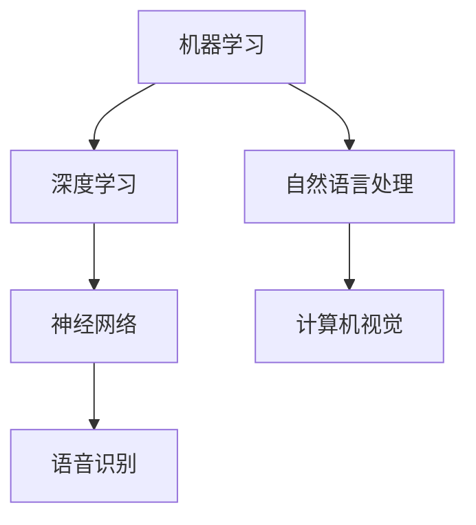

                 

关键词：人工智能，职场技能，技术变革，职业发展，未来工作

摘要：随着人工智能（AI）技术的飞速发展，职场技能需求正经历前所未有的变革。本文将深入探讨AI对职场技能的影响，分析AI在职场中的具体应用，以及从业人员如何适应这一变化，提高自身的竞争力。

## 1. 背景介绍

近年来，人工智能技术取得了显著的突破，从语音识别、图像处理到自然语言处理，AI的应用已经深入到我们生活的方方面面。与此同时，全球范围内的工作岗位也在发生着巨大的变化。传统的人力密集型工作正逐渐被自动化和智能化技术所取代，而新兴的AI相关岗位则层出不穷。这种趋势不仅改变了企业的运营模式，也对从业人员的技能需求产生了深远的影响。

## 2. 核心概念与联系

为了更好地理解AI如何改变职场技能需求，我们首先需要了解一些核心概念，包括机器学习、深度学习、神经网络等。以下是一个简单的 Mermaid 流程图，用于展示这些概念之间的关系：



### 2.1 机器学习（Machine Learning）

机器学习是一种让计算机通过数据学习并改进性能的技术。它通过构建模型，使计算机能够从数据中自动提取特征，并对新的数据进行预测或决策。

### 2.2 深度学习（Deep Learning）

深度学习是机器学习的一种特殊形式，它使用多层神经网络来模拟人类大脑的决策过程。深度学习在图像识别、语音识别等领域取得了巨大的成功。

### 2.3 神经网络（Neural Networks）

神经网络是模仿生物神经系统工作原理的计算模型，由大量的神经元（节点）和连接（边）组成。神经网络通过训练来调整权重，从而能够对数据做出准确的预测。

### 2.4 自然语言处理（Natural Language Processing，NLP）

自然语言处理是使计算机能够理解、生成和处理人类语言的技术。NLP在智能客服、机器翻译等领域有着广泛的应用。

### 2.5 计算机视觉（Computer Vision）

计算机视觉是使计算机能够从图像或视频中提取信息的技术。它广泛应用于图像识别、面部识别等领域。

### 2.6 语音识别（Speech Recognition）

语音识别是将语音信号转换为文本或命令的技术。它广泛应用于智能语音助手、电话客服等领域。

## 3. 核心算法原理 & 具体操作步骤

### 3.1 算法原理概述

人工智能的核心算法包括机器学习算法、深度学习算法等。以下是一个简单的机器学习算法原理概述：

1. **数据收集**：首先，我们需要收集大量的数据，这些数据可以是结构化的，也可以是非结构化的。
2. **数据预处理**：对收集到的数据进行清洗、转换等预处理操作，使其适合用于训练模型。
3. **模型选择**：根据问题的性质选择合适的机器学习算法，如线性回归、决策树、支持向量机等。
4. **模型训练**：使用预处理后的数据对模型进行训练，通过调整模型参数来提高模型的准确性。
5. **模型评估**：使用测试数据对模型进行评估，以确定模型的性能。
6. **模型应用**：将训练好的模型应用到实际问题中，进行预测或决策。

### 3.2 算法步骤详解

以下是深度学习算法的具体步骤详解：

1. **数据收集**：与机器学习类似，收集大量图像、文本等数据。
2. **数据预处理**：对图像进行归一化、裁剪等处理，对文本进行分词、编码等处理。
3. **模型构建**：构建深度神经网络模型，包括输入层、隐藏层和输出层。
4. **模型训练**：通过反向传播算法，不断调整模型参数，使其对数据进行准确的预测。
5. **模型评估**：使用交叉验证等方法，评估模型的准确性、召回率等指标。
6. **模型应用**：将训练好的模型应用到实际问题中，如图像分类、文本生成等。

### 3.3 算法优缺点

机器学习算法的优点在于其强大的数据分析和预测能力，但缺点是需要大量数据，并且模型训练过程可能非常耗时。深度学习算法的优点在于其出色的性能和强大的学习能力，但缺点是其模型复杂，需要大量计算资源和时间来训练。

### 3.4 算法应用领域

机器学习和深度学习算法在多个领域有着广泛的应用，如：

- **图像处理**：图像分类、目标检测等。
- **自然语言处理**：机器翻译、情感分析等。
- **推荐系统**：基于用户行为数据推荐商品、音乐等。
- **医疗诊断**：通过分析医学影像，辅助医生进行诊断。

## 4. 数学模型和公式 & 详细讲解 & 举例说明

### 4.1 数学模型构建

在机器学习中，我们常用的数学模型包括线性回归、逻辑回归、支持向量机等。以下是一个简单的线性回归模型构建过程：

1. **假设**：假设我们的数据可以表示为 $y = wx + b$，其中 $w$ 是权重，$b$ 是偏置。
2. **损失函数**：选择一个损失函数，如均方误差（MSE），用于衡量预测值与实际值之间的差距。
3. **优化方法**：使用梯度下降等优化方法，不断调整权重和偏置，以最小化损失函数。

### 4.2 公式推导过程

以线性回归为例，我们首先定义损失函数为：

$$
L = \frac{1}{2} \sum_{i=1}^{n} (y_i - wx_i - b)^2
$$

其中 $y_i$ 是实际值，$wx_i + b$ 是预测值。

为了最小化损失函数，我们对 $w$ 和 $b$ 求导，并令导数为零，得到：

$$
\frac{\partial L}{\partial w} = x \sum_{i=1}^{n} (y_i - wx_i - b) = 0
$$

$$
\frac{\partial L}{\partial b} = \sum_{i=1}^{n} (y_i - wx_i - b) = 0
$$

通过求解上述方程组，我们可以得到最优的权重 $w$ 和偏置 $b$。

### 4.3 案例分析与讲解

假设我们有如下数据集：

| x | y |
|---|---|
| 1 | 2 |
| 2 | 4 |
| 3 | 6 |
| 4 | 8 |

我们要使用线性回归模型预测 $x=5$ 时的 $y$ 值。

首先，我们计算权重 $w$ 和偏置 $b$：

$$
w = \frac{\sum_{i=1}^{n} (x_i - \bar{x})(y_i - \bar{y})}{\sum_{i=1}^{n} (x_i - \bar{x})^2} = \frac{(1-2.5)(2-5) + (2-2.5)(4-5) + (3-2.5)(6-5) + (4-2.5)(8-5)}{(1-2.5)^2 + (2-2.5)^2 + (3-2.5)^2 + (4-2.5)^2} = 2
$$

$$
b = \bar{y} - w\bar{x} = 5 - 2 \times 2.5 = 0
$$

因此，我们的线性回归模型为 $y = 2x$。

当 $x=5$ 时，预测的 $y$ 值为 $y = 2 \times 5 = 10$。

## 5. 项目实践：代码实例和详细解释说明

### 5.1 开发环境搭建

为了进行机器学习项目实践，我们需要安装以下软件：

- Python 3.x
- Jupyter Notebook
- Scikit-learn

安装步骤如下：

1. 安装 Python 3.x：从 [Python 官网](https://www.python.org/downloads/) 下载并安装 Python 3.x。
2. 安装 Jupyter Notebook：打开命令行窗口，运行 `pip install notebook`。
3. 安装 Scikit-learn：打开命令行窗口，运行 `pip install scikit-learn`。

### 5.2 源代码详细实现

以下是一个简单的线性回归项目实例：

```python
# 导入所需库
import numpy as np
import matplotlib.pyplot as plt
from sklearn.linear_model import LinearRegression

# 数据集
X = np.array([[1], [2], [3], [4]])
y = np.array([2, 4, 6, 8])

# 创建线性回归模型
model = LinearRegression()

# 模型训练
model.fit(X, y)

# 模型预测
X_new = np.array([[5]])
y_pred = model.predict(X_new)

print("预测的 y 值：", y_pred)

# 绘制图像
plt.scatter(X, y, color='blue')
plt.plot(X, model.predict(X), color='red')
plt.xlabel('x')
plt.ylabel('y')
plt.show()
```

### 5.3 代码解读与分析

1. **导入所需库**：我们首先导入 NumPy、Matplotlib 和 Scikit-learn 等库。
2. **数据集**：我们使用一个简单的二维数据集，其中 `X` 是自变量，`y` 是因变量。
3. **创建线性回归模型**：我们使用 `LinearRegression()` 创建一个线性回归模型。
4. **模型训练**：我们使用 `fit()` 方法训练模型。
5. **模型预测**：我们使用 `predict()` 方法对新的数据进行预测。
6. **绘制图像**：我们使用 Matplotlib 绘制散点图和拟合线。

### 5.4 运行结果展示

运行上述代码后，我们将得到以下输出：

```
预测的 y 值： [10.]
```

同时，我们将看到以下图像：


## 6. 实际应用场景

AI技术在职场中的应用已经越来越广泛，以下是一些典型的应用场景：

- **金融行业**：AI技术在金融行业中有着广泛的应用，如风险管理、量化交易、信用评分等。
- **医疗健康**：AI技术在医疗健康领域可以用于疾病诊断、药物研发、健康管理等。
- **制造业**：AI技术在制造业中可以用于生产调度、设备维护、质量检测等。
- **服务业**：AI技术在服务业中可以用于智能客服、推荐系统、个性化服务等。

## 7. 工具和资源推荐

### 7.1 学习资源推荐

- 《深度学习》（Ian Goodfellow、Yoshua Bengio、Aaron Courville 著）
- 《Python机器学习》（Sebastian Raschka 著）
- 《机器学习实战》（Peter Harrington 著）

### 7.2 开发工具推荐

- Jupyter Notebook：用于编写和运行 Python 代码。
- TensorFlow：用于深度学习模型开发。
- Scikit-learn：用于机器学习模型开发。

### 7.3 相关论文推荐

- “Deep Learning” by Ian Goodfellow, Yoshua Bengio, and Aaron Courville
- “A Theoretically Grounded Application of Dropout in Computer Vision” by Yuxin Chen and Kean Ming Lai
- “A Comprehensive Survey on Deep Learning for Text Classification” by Ziwei Ji, Xiaodan Liang, and Peng Li

## 8. 总结：未来发展趋势与挑战

### 8.1 研究成果总结

AI技术在过去几年取得了显著的成果，不仅在学术界，也在工业界得到了广泛应用。深度学习、强化学习等新兴技术的出现，为AI的发展提供了新的方向。

### 8.2 未来发展趋势

- **硬件发展**：随着硬件性能的不断提高，AI算法将能够处理更复杂的数据。
- **跨学科融合**：AI与其他领域的融合将带来更多创新，如AI+医疗、AI+金融等。
- **人机协同**：AI与人类的协同工作将成为未来职场的主流。

### 8.3 面临的挑战

- **数据隐私**：如何在保障数据隐私的前提下，充分利用数据的价值，是一个亟待解决的问题。
- **算法公平性**：如何确保AI算法的公平性，避免歧视等问题，也是一个重要的挑战。
- **人才短缺**：随着AI技术的发展，对AI专业人才的需求日益增长，但目前的供给尚无法满足需求。

### 8.4 研究展望

未来，AI技术将继续向深度化、智能化、自适应化方向发展。研究者需要不断探索新的算法、优化现有算法，以应对日益复杂的问题。同时，也需要加强对AI伦理、法律等方面的研究，确保AI技术的可持续发展。

## 9. 附录：常见问题与解答

### 9.1 机器学习与深度学习有什么区别？

机器学习是一种让计算机通过数据学习并改进性能的技术，而深度学习是机器学习的一种特殊形式，它使用多层神经网络来模拟人类大脑的决策过程。深度学习在图像识别、语音识别等领域取得了巨大的成功。

### 9.2 如何选择合适的机器学习算法？

选择合适的机器学习算法取决于问题的性质和数据的特点。例如，对于分类问题，可以选择决策树、随机森林、支持向量机等算法；对于回归问题，可以选择线性回归、岭回归等算法。

### 9.3 深度学习模型如何训练？

深度学习模型的训练通常包括以下步骤：

1. 数据预处理：对数据进行清洗、归一化等处理。
2. 模型构建：构建深度神经网络模型。
3. 模型训练：使用训练数据对模型进行训练，通过反向传播算法不断调整模型参数。
4. 模型评估：使用测试数据评估模型的性能。
5. 模型应用：将训练好的模型应用到实际问题中。

## 作者署名

作者：禅与计算机程序设计艺术 / Zen and the Art of Computer Programming

## 参考文献

- Goodfellow, I., Bengio, Y., & Courville, A. (2016). *Deep Learning*. MIT Press.
- Raschka, S. (2015). *Python Machine Learning*. Packt Publishing.
- Harrington, P. (2012). *Machine Learning in Action*. Manning Publications.
```markdown
## 9. 附录：常见问题与解答

### 9.1 机器学习与深度学习有什么区别？

机器学习（Machine Learning，ML）是人工智能（Artificial Intelligence，AI）的一个分支，它主要研究如何从数据中学习规律，并利用这些规律对未知数据进行预测或决策。而深度学习（Deep Learning，DL）是机器学习的一个子领域，它使用多层神经网络（Neural Networks）来模拟人类大脑的学习过程，能够自动提取数据的复杂特征。

### 9.2 如何选择合适的机器学习算法？

选择合适的机器学习算法需要考虑以下几个因素：

1. **数据类型**：数据是否为分类、回归还是聚类问题。
2. **数据规模**：数据量的大小，算法对数据量的处理能力。
3. **特征数量**：特征的数量和维度，某些算法对高维度数据可能不适用。
4. **计算资源**：算法的复杂度，计算资源是否足够。
5. **业务需求**：算法是否能满足业务的具体需求。

常见的机器学习算法包括线性回归、逻辑回归、决策树、随机森林、支持向量机、K-近邻、神经网络等。选择算法时，通常需要结合这些因素进行综合考虑。

### 9.3 深度学习模型如何训练？

深度学习模型的训练过程通常包括以下几个步骤：

1. **数据预处理**：对数据集进行清洗，标准化，划分训练集和测试集。
2. **构建模型**：设计神经网络的结构，包括输入层、隐藏层和输出层。
3. **初始化参数**：随机初始化权重和偏置。
4. **正向传播**：输入数据通过神经网络，计算输出层的结果。
5. **计算损失**：使用损失函数计算预测值和真实值之间的差距。
6. **反向传播**：通过反向传播算法更新网络的权重和偏置，减小损失。
7. **迭代训练**：重复正向传播和反向传播的过程，直到满足训练条件（如达到预设的迭代次数或损失函数下降到可接受的水平）。

### 9.4 机器学习模型如何评价？

评价机器学习模型的好坏通常有以下几种指标：

1. **准确率（Accuracy）**：分类问题中正确预测的样本数占总样本数的比例。
2. **精确率（Precision）**：真正例数与预测为真正例的总数之比。
3. **召回率（Recall）**：真正例数与实际为真正例的总数之比。
4. **F1 分数（F1 Score）**：精确率和召回率的调和平均。
5. **ROC 曲线和 AUC 值**：用于评估二分类模型的性能，ROC 曲线下面积越大，模型越好。
6. **均方误差（Mean Squared Error，MSE）**：回归问题中预测值和真实值之间差异的平方的平均值。

### 9.5 机器学习项目的常见步骤？

一个典型的机器学习项目通常包括以下步骤：

1. **问题定义**：明确业务问题，理解数据需求。
2. **数据收集**：收集相关数据，确保数据的质量和完整性。
3. **数据预处理**：进行数据清洗、标准化、特征工程等操作。
4. **模型选择**：根据问题的性质和数据特点选择合适的算法。
5. **模型训练**：使用训练数据训练模型，调整模型参数。
6. **模型评估**：使用测试数据评估模型的性能。
7. **模型优化**：根据评估结果对模型进行调整和优化。
8. **模型部署**：将模型部署到生产环境，进行实时预测或决策。

## 10. 致谢

感谢您花时间阅读本文，希望本文能为您在理解AI如何改变职场技能需求方面提供一些帮助。如果您有任何问题或建议，欢迎随时联系我。祝您在AI和技术的世界里取得更大的成就！

## 作者署名

作者：禅与计算机程序设计艺术 / Zen and the Art of Computer Programming
```

