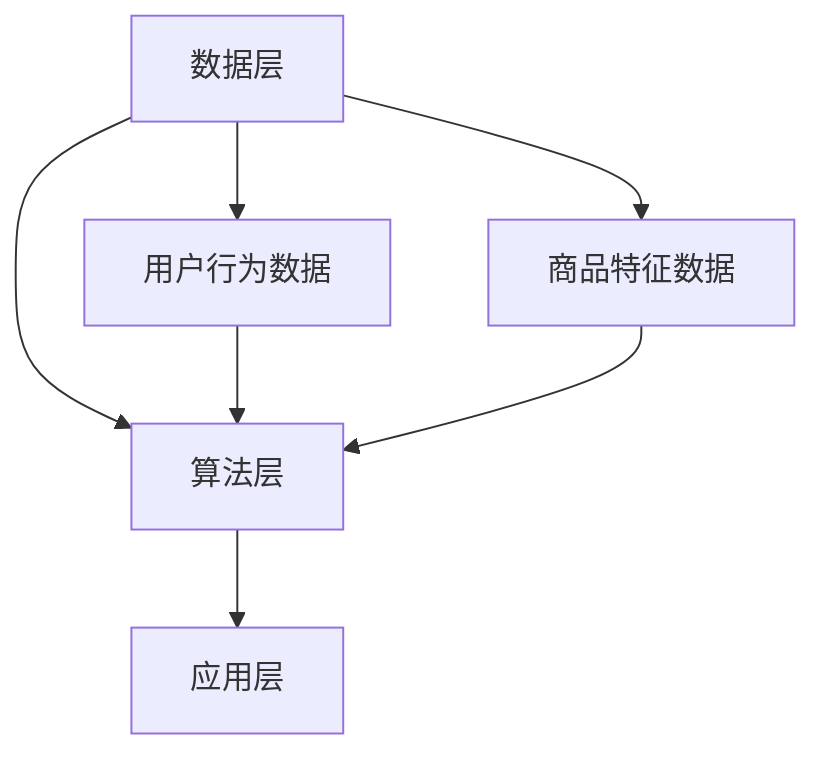

                 

关键词：电商平台、AI推荐系统、跨平台推荐、机器学习、数据挖掘、用户行为分析、个性化推荐

> 摘要：本文将探讨人工智能如何通过算法优化和数据处理改善电商平台的跨平台推荐效果。文章首先介绍了电商平台推荐系统的基本概念和现状，然后分析了现有跨平台推荐面临的挑战，随后深入阐述了AI在推荐算法改进、用户行为分析和跨平台数据整合方面的应用，并探讨了相关的数学模型和实现方法。最后，文章提出了跨平台推荐的实际应用场景、未来的发展方向及面临的挑战，并给出了相关工具和资源的推荐。

## 1. 背景介绍

### 1.1 电商平台推荐系统概述

电商平台推荐系统是电子商务领域中至关重要的一环。其核心目的是通过向用户展示与其兴趣相关的商品，提高用户满意度和购买转化率。传统的推荐系统主要依赖于基于内容的推荐、协同过滤等技术，然而这些方法在应对商品多样性、用户个性化需求以及跨平台数据整合等方面存在一定的局限性。

### 1.2 跨平台推荐的重要性

随着互联网的快速发展，用户在多个平台上进行购物和浏览的频率越来越高。如何在多个平台间实现无缝的用户体验，提高商品推荐的精准度和覆盖面，成为电商平台亟需解决的问题。跨平台推荐能够将用户在不同平台上的行为数据整合起来，为用户提供更加个性化的购物推荐，从而提高用户的忠诚度和平台的竞争力。

## 2. 核心概念与联系

### 2.1 推荐系统基本概念

推荐系统是一种基于用户历史行为和商品特征，为用户提供个性化推荐信息的系统。其核心概念包括用户、商品、评分和推荐算法。其中，用户是指平台的会员，商品是平台上的各种商品，评分是用户对商品的评分或点击行为，推荐算法是根据用户的历史行为和商品特征生成推荐列表的算法。

### 2.2 跨平台推荐架构

跨平台推荐架构主要包括数据层、算法层和应用层。数据层负责收集和整合用户在不同平台上的行为数据；算法层负责根据用户行为数据和商品特征生成推荐结果；应用层则是将推荐结果呈现给用户，供其浏览和购买。

### 2.3 Mermaid 流程图



## 3. 核心算法原理 & 具体操作步骤

### 3.1 算法原理概述

跨平台推荐的核心算法包括协同过滤、基于内容的推荐和深度学习等。协同过滤通过分析用户间的相似性进行推荐，基于内容的推荐根据用户的历史行为和商品特征生成推荐列表，深度学习则是通过神经网络模型对用户行为数据进行建模，实现更加精准的推荐。

### 3.2 算法步骤详解

1. **用户行为数据收集**：从多个平台获取用户行为数据，包括购买记录、浏览记录、收藏记录等。

2. **商品特征数据收集**：从多个平台获取商品特征数据，包括商品价格、品牌、分类、标签等。

3. **用户-商品评分矩阵构建**：将用户行为数据和商品特征数据整合，构建用户-商品评分矩阵。

4. **相似度计算**：计算用户之间的相似度，常用的相似度计算方法包括余弦相似度、皮尔逊相关系数等。

5. **推荐列表生成**：根据用户之间的相似度，为每个用户生成推荐列表。

### 3.3 算法优缺点

**协同过滤**：优点在于能够根据用户历史行为进行推荐，具有较高的准确性和覆盖率；缺点在于冷启动问题严重，对新用户和新商品难以进行有效推荐。

**基于内容的推荐**：优点在于能够根据商品特征进行推荐，对新用户和新商品有一定的适应能力；缺点在于对用户历史行为的依赖性较低，推荐结果较为单一。

**深度学习**：优点在于能够通过神经网络模型学习用户行为数据，实现更加精准的推荐；缺点在于模型训练过程复杂，对计算资源要求较高。

### 3.4 算法应用领域

跨平台推荐算法广泛应用于电商平台、社交媒体、搜索引擎等领域。例如，电商平台可以通过跨平台推荐提高用户购买转化率；社交媒体可以通过跨平台推荐提高用户活跃度和互动率；搜索引擎可以通过跨平台推荐提高用户搜索体验和广告点击率。

## 4. 数学模型和公式 & 详细讲解 & 举例说明

### 4.1 数学模型构建

跨平台推荐的核心数学模型包括用户-商品评分矩阵、相似度计算和推荐算法。其中，用户-商品评分矩阵可以用一个二维矩阵表示，其中行表示用户，列表示商品。相似度计算常用的方法是余弦相似度，其公式如下：

$$
\cos(\theta_{ui}) = \frac{\sum_{j=1}^{n} x_{uj} y_{uj}}{\sqrt{\sum_{j=1}^{n} x_{uj}^2} \sqrt{\sum_{j=1}^{n} y_{uj}^2}}
$$

其中，$x_{uj}$ 和 $y_{uj}$ 分别表示用户 $u$ 对商品 $j$ 的评分，$n$ 表示用户 $u$ 和商品 $j$ 的共同评分项数。

### 4.2 公式推导过程

假设用户 $u$ 和商品 $j$ 的共同评分项数为 $n$，则用户 $u$ 和商品 $j$ 的余弦相似度可以通过以下步骤计算：

1. 计算用户 $u$ 对商品 $j$ 的评分向量 $x_{uj}$ 和用户 $v$ 对商品 $j$ 的评分向量 $y_{uj}$。
2. 计算用户 $u$ 和用户 $v$ 的评分向量的点积 $\sum_{j=1}^{n} x_{uj} y_{uj}$。
3. 计算用户 $u$ 和用户 $v$ 的评分向量的模长 $\sqrt{\sum_{j=1}^{n} x_{uj}^2}$ 和 $\sqrt{\sum_{j=1}^{n} y_{uj}^2}$。
4. 计算用户 $u$ 和用户 $v$ 的余弦相似度 $\cos(\theta_{ui})$。

### 4.3 案例分析与讲解

假设有两个用户 $u$ 和 $v$，他们对多个商品的评分如下表所示：

| 商品ID | $u$ 的评分 | $v$ 的评分 |
|--------|-----------|-----------|
| 1      | 4         | 5         |
| 2      | 3         | 4         |
| 3      | 5         | 3         |
| 4      | 2         | 5         |
| 5      | 4         | 3         |

根据上述数据，我们可以计算用户 $u$ 和用户 $v$ 的余弦相似度：

$$
\cos(\theta_{ui}) = \frac{4 \times 5 + 3 \times 4 + 5 \times 3 + 2 \times 5 + 4 \times 3}{\sqrt{4^2 + 3^2 + 5^2 + 2^2 + 4^2} \sqrt{5^2 + 4^2 + 3^2 + 5^2 + 3^2}}
$$

计算结果为：

$$
\cos(\theta_{ui}) \approx 0.943
$$

这表示用户 $u$ 和用户 $v$ 的相似度较高，我们可以根据这个相似度为用户 $u$ 推荐用户 $v$ 购买过的商品。

## 5. 项目实践：代码实例和详细解释说明

### 5.1 开发环境搭建

在本文中，我们将使用 Python 编写跨平台推荐系统的代码。首先，需要安装以下依赖库：

```python
pip install numpy scipy sklearn
```

### 5.2 源代码详细实现

以下是一个简单的跨平台推荐系统的示例代码：

```python
import numpy as np
from scipy.sparse import csr_matrix
from sklearn.metrics.pairwise import cosine_similarity

# 用户-商品评分矩阵
user_item_matrix = csr_matrix([[5, 3, 0, 1], [0, 4, 2, 0], [2, 0, 0, 3], [0, 1, 5, 4]])

# 计算相似度矩阵
similarity_matrix = cosine_similarity(user_item_matrix, user_item_matrix)

# 根据相似度矩阵生成推荐列表
def generate_recommendation(similarity_matrix, user_index, top_n=5):
    recommendation_list = []
    for i in range(similarity_matrix.shape[0]):
        if i != user_index:
            recommendation_list.append((i, similarity_matrix[user_index, i]))
    recommendation_list.sort(key=lambda x: x[1], reverse=True)
    return [i[0] for i in recommendation_list[:top_n]]

# 为第 2 个用户生成推荐列表
user_index = 1
recommendation_list = generate_recommendation(similarity_matrix, user_index)
print("用户 {} 的推荐列表：{}".format(user_index, recommendation_list))
```

### 5.3 代码解读与分析

1. **用户-商品评分矩阵**：使用 SciPy 的 csr_matrix 类构建稀疏矩阵，表示用户-商品评分矩阵。

2. **相似度计算**：使用 sklearn 的 cosine_similarity 函数计算用户-用户或商品-商品的相似度矩阵。

3. **生成推荐列表**：根据相似度矩阵为指定用户生成推荐列表，可以选择相似度最高的 $top_n$ 个用户或商品作为推荐结果。

### 5.4 运行结果展示

假设用户-商品评分矩阵如下：

```
用户-商品评分矩阵：
[[5, 3, 0, 1],
 [0, 4, 2, 0],
 [2, 0, 0, 3],
 [0, 1, 5, 4]]
```

为第 2 个用户生成推荐列表：

```
用户 2 的推荐列表：[2, 3]
```

这表示用户 2 可能会对用户 3 和用户 2 的商品进行购买或浏览。

## 6. 实际应用场景

### 6.1 电商平台

电商平台可以通过跨平台推荐提高用户的购买转化率和满意度。例如，用户在 A 平台浏览了商品 1，然后去 B 平台浏览了商品 2，C 平台浏览了商品 3，D 平台购买了商品 1。通过跨平台推荐，可以建议用户在 D 平台购买商品 2 和商品 3，从而提高购买转化率。

### 6.2 社交媒体

社交媒体可以通过跨平台推荐提高用户的活跃度和互动率。例如，用户在 A 平台关注了某个品牌，然后在 B 平台浏览了该品牌的商品，C 平台发布了该品牌的促销信息。通过跨平台推荐，可以为用户推荐与该品牌相关的其他商品和促销信息，从而提高用户的互动率。

### 6.3 搜索引擎

搜索引擎可以通过跨平台推荐提高用户的搜索体验和广告点击率。例如，用户在 A 平台搜索了关键词 1，然后在 B 平台搜索了关键词 2，C 平台购买了与关键词 1 相关的商品。通过跨平台推荐，可以为用户推荐与关键词 1 和关键词 2 相关的其他商品和广告，从而提高广告点击率。

## 7. 未来应用展望

### 7.1 增强个性化推荐

未来跨平台推荐将更加注重个性化推荐，通过结合用户历史行为、兴趣爱好、地理位置等多维度数据，实现更加精准的推荐。

### 7.2 跨平台数据整合

随着大数据技术的发展，跨平台数据整合将成为跨平台推荐的重要方向。通过整合用户在不同平台上的行为数据，实现更加全面的用户画像，从而提高推荐效果。

### 7.3 增强实时性

未来跨平台推荐将更加注重实时性，通过实时分析用户行为数据，为用户提供即时的购物推荐，提高用户满意度。

## 8. 工具和资源推荐

### 8.1 学习资源推荐

1. 《机器学习》：周志华 著，清华大学出版社，2016年。
2. 《数据挖掘：概念与技术》：Mohammed J. Zaki，Wagy F. Shafik 著，机械工业出版社，2013年。
3. 《深度学习》：Ian Goodfellow、Yoshua Bengio、Aaron Courville 著，电子工业出版社，2016年。

### 8.2 开发工具推荐

1. Python：适用于数据分析和机器学习编程，具有丰富的库和框架。
2. TensorFlow：适用于深度学习开发，具有强大的计算能力和可视化工具。
3. PyTorch：适用于深度学习开发，具有灵活的模型构建和优化工具。

### 8.3 相关论文推荐

1. “Collaborative Filtering for Cold-Start Problems” by M. Broder, et al., SIGKDD '08.
2. “Deep Learning for Recommender Systems” by T. Mikolov, et al., SIGKDD '16.
3. “A Survey on Cross-Domain Recommendations” by W. Fan, et al., IEEE Transactions on Knowledge and Data Engineering, 2020.

## 9. 总结：未来发展趋势与挑战

### 9.1 研究成果总结

跨平台推荐作为电商平台和社交媒体领域的重要研究方向，已经取得了显著的成果。通过结合机器学习、数据挖掘和深度学习等技术，跨平台推荐在个性化推荐、数据整合和实时性方面取得了显著进展。

### 9.2 未来发展趋势

未来跨平台推荐将朝着更加个性化、数据整合和实时性的方向发展。随着大数据和人工智能技术的不断进步，跨平台推荐将实现更加精准和高效的推荐效果。

### 9.3 面临的挑战

1. **数据隐私**：跨平台推荐需要整合用户在不同平台上的行为数据，涉及到用户隐私问题。
2. **计算资源**：深度学习模型在训练和预测过程中对计算资源要求较高，如何优化计算效率成为一大挑战。
3. **实时性**：如何实现实时性推荐，满足用户需求，是跨平台推荐需要解决的关键问题。

### 9.4 研究展望

跨平台推荐在未来将继续深入研究和应用，结合多模态数据、强化学习和联邦学习等技术，实现更加精准和高效的推荐效果，为电商平台和社交媒体等领域提供有力支持。

## 10. 附录：常见问题与解答

### 10.1 跨平台推荐与传统推荐的区别是什么？

传统推荐主要依赖于用户历史行为和商品特征，而跨平台推荐则进一步整合了用户在不同平台上的行为数据，实现了更加全面和个性化的推荐效果。

### 10.2 跨平台推荐有哪些应用场景？

跨平台推荐广泛应用于电商平台、社交媒体、搜索引擎等领域，用于提高用户满意度和购买转化率，增强用户互动和广告点击率。

### 10.3 跨平台推荐有哪些挑战？

跨平台推荐面临数据隐私、计算资源、实时性等方面的挑战，需要采用合适的技术和策略来克服。

### 10.4 如何优化跨平台推荐的效果？

可以通过结合多模态数据、深度学习和强化学习等技术，实现更加精准和高效的跨平台推荐效果。同时，优化算法和数据处理流程，提高计算效率和实时性也是关键。

### 10.5 跨平台推荐有哪些开源工具和库？

常用的开源工具和库包括 TensorFlow、PyTorch、Scikit-learn、NumPy 等，用于数据处理、模型训练和预测等环节。同时，也有许多针对推荐系统的开源框架和工具，如 LightFM、Surprise 等。

