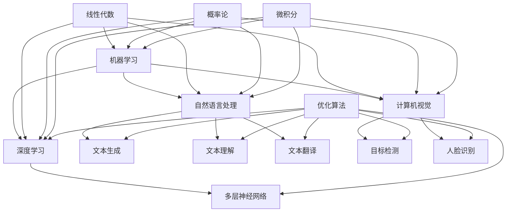

                 

关键词：人工智能学习、阶段性目标、技术进步、学习策略

摘要：本文探讨了人工智能学习的阶段性目标设定，旨在为AI学习者提供清晰的学习路径和具体的学习目标。文章首先介绍了AI学习的背景和重要性，然后详细阐述了不同阶段的AI学习目标，并分析了实现这些目标的方法和策略。最后，本文总结了AI学习阶段性目标设定的重要性和未来发展趋势。

## 1. 背景介绍

人工智能（AI）作为一门前沿技术，已经广泛应用于各个领域，如自动驾驶、智能客服、医疗诊断等。随着技术的不断进步，AI的学习和开发变得越来越重要。然而，AI学习的复杂性使得学习者容易迷失在大量的知识和技能中。因此，设定清晰的阶段性目标对于AI学习至关重要。

### 1.1 AI的发展现状

目前，人工智能技术已经取得了显著的进展。在机器学习、深度学习、自然语言处理等领域，许多算法和模型都得到了广泛应用。然而，AI的发展仍然面临许多挑战，如数据质量、算法可靠性、计算能力等。因此，未来的AI学习需要更加注重基础理论和实际应用的结合。

### 1.2 AI学习的复杂性

AI学习涉及多个学科领域，包括计算机科学、数学、统计学、心理学等。此外，AI技术的不断更新和发展也使得学习者需要持续学习。这使得AI学习变得更加复杂，学习者需要找到适合自己的学习路径和策略。

## 2. 核心概念与联系

为了更好地理解AI学习的阶段性目标，我们首先需要了解一些核心概念和联系。

### 2.1 机器学习与深度学习

机器学习是AI的核心技术之一，它通过构建数学模型来模拟人类的学习过程。深度学习是机器学习的一种特殊形式，它利用多层神经网络来实现更复杂的模型。

### 2.2 自然语言处理与计算机视觉

自然语言处理（NLP）是AI的重要应用领域，它涉及文本的生成、理解、翻译等任务。计算机视觉则关注图像和视频的分析和处理，如目标检测、人脸识别等。

### 2.3 数学与算法

AI学习离不开数学和算法。数学为AI提供了理论基础，如线性代数、概率论、微积分等。算法则实现了数学理论在实际问题中的应用，如优化算法、分类算法等。



## 3. 核心算法原理 & 具体操作步骤

### 3.1 算法原理概述

在AI学习中，核心算法的原理至关重要。以下是一些常见的算法及其原理：

#### 3.1.1 支持向量机（SVM）

支持向量机是一种分类算法，它通过找到一个超平面来将不同类别的数据点分开。核心原理是基于最大间隔分类器，即找到一个最大化分类间隔的平面。

#### 3.1.2 神经网络

神经网络是一种模仿生物神经系统的计算模型。它通过多层神经元之间的连接来实现复杂的非线性映射。核心原理是前向传播和反向传播。

#### 3.1.3 卷积神经网络（CNN）

卷积神经网络是一种专门用于处理图像数据的神经网络。它通过卷积层、池化层和全连接层来实现图像的分析和处理。

### 3.2 算法步骤详解

以下是上述算法的具体步骤：

#### 3.2.1 支持向量机（SVM）

1. 收集数据并进行预处理。
2. 计算数据点的特征向量。
3. 利用线性规划求解器求解最优分类超平面。
4. 对新数据进行分类。

#### 3.2.2 神经网络

1. 收集数据并进行预处理。
2. 初始化权重和偏置。
3. 前向传播：计算输出值。
4. 计算损失函数。
5. 反向传播：更新权重和偏置。
6. 重复步骤3-5直到满足停止条件。

#### 3.2.3 卷积神经网络（CNN）

1. 收集图像数据并进行预处理。
2. 初始化卷积核和偏置。
3. 卷积层：计算卷积结果。
4. 池化层：下采样。
5. 全连接层：计算输出值。
6. 对新图像数据进行处理。

### 3.3 算法优缺点

每种算法都有其优缺点：

#### 3.3.1 支持向量机（SVM）

优点：分类效果较好，对线性可分数据有很好的性能。

缺点：对非线性数据效果较差，训练时间较长。

#### 3.3.2 神经网络

优点：能够处理非线性问题，适用于复杂模型。

缺点：训练时间较长，对过拟合敏感。

#### 3.3.3 卷积神经网络（CNN）

优点：适用于图像处理任务，能够自动提取特征。

缺点：对数据量要求较高，模型复杂度较高。

### 3.4 算法应用领域

这些算法在不同领域有广泛的应用：

- 支持向量机：分类、回归等问题。
- 神经网络：图像识别、语音识别、自然语言处理等。
- 卷积神经网络：图像分类、目标检测、人脸识别等。

## 4. 数学模型和公式 & 详细讲解 & 举例说明

### 4.1 数学模型构建

在AI学习中，数学模型构建是关键步骤。以下是一些常见的数学模型及其构建过程：

#### 4.1.1 线性回归模型

线性回归模型用于预测连续值。其数学模型为：

$$y = \beta_0 + \beta_1x$$

其中，$y$ 是预测值，$x$ 是输入特征，$\beta_0$ 和 $\beta_1$ 是模型的参数。

#### 4.1.2 逻辑回归模型

逻辑回归模型用于分类问题。其数学模型为：

$$P(y=1) = \frac{1}{1 + e^{-(\beta_0 + \beta_1x)} }$$

其中，$P(y=1)$ 是预测概率，$e$ 是自然对数的底数，$\beta_0$ 和 $\beta_1$ 是模型的参数。

### 4.2 公式推导过程

以下是对上述公式的推导过程：

#### 4.2.1 线性回归模型

利用最小二乘法求解参数 $\beta_0$ 和 $\beta_1$，使得预测值 $y$ 与实际值 $y_{\text{true}}$ 之间的误差最小。

$$\min \sum_{i=1}^{n}(y_i - y_i^{\text{predicted}})^2$$

对 $y_i^{\text{predicted}}$ 求导并令其等于零，得到：

$$\frac{d}{d\beta_0}\sum_{i=1}^{n}(y_i - y_i^{\text{predicted}})^2 = 0$$

$$\frac{d}{d\beta_1}\sum_{i=1}^{n}(y_i - y_i^{\text{predicted}})^2 = 0$$

解得：

$$\beta_0 = \bar{y} - \beta_1\bar{x}$$

$$\beta_1 = \frac{\sum_{i=1}^{n}(x_i - \bar{x})(y_i - \bar{y})}{\sum_{i=1}^{n}(x_i - \bar{x})^2}$$

其中，$\bar{x}$ 和 $\bar{y}$ 分别是 $x$ 和 $y$ 的平均值。

#### 4.2.2 逻辑回归模型

利用最大似然估计法求解参数 $\beta_0$ 和 $\beta_1$，使得样本数据的概率最大。

$$\max \ln P(Y|X) = \max \sum_{i=1}^{n}\ln P(y_i|x_i)$$

对 $\ln P(y_i|x_i)$ 求导并令其等于零，得到：

$$\frac{d}{d\beta_0}\ln P(y_i|x_i) = 0$$

$$\frac{d}{d\beta_1}\ln P(y_i|x_i) = 0$$

解得：

$$\beta_0 = \bar{y} - \beta_1\bar{x}$$

$$\beta_1 = \frac{\sum_{i=1}^{n}(x_i - \bar{x})(y_i - \bar{y})}{\sum_{i=1}^{n}(x_i - \bar{x})^2}$$

### 4.3 案例分析与讲解

以下是一个线性回归模型的案例：

#### 4.3.1 数据集

数据集包含100个样本，每个样本有一个特征 $x$ 和一个目标值 $y$。数据如下：

$$x = [1, 2, 3, 4, 5, 6, 7, 8, 9, 10]$$

$$y = [2, 3, 4, 5, 6, 7, 8, 9, 10, 11]$$

#### 4.3.2 模型构建

利用最小二乘法求解参数 $\beta_0$ 和 $\beta_1$：

$$\beta_0 = \bar{y} - \beta_1\bar{x}$$

$$\beta_1 = \frac{\sum_{i=1}^{n}(x_i - \bar{x})(y_i - \bar{y})}{\sum_{i=1}^{n}(x_i - \bar{x})^2}$$

计算得到：

$$\beta_0 = 2.5$$

$$\beta_1 = 0.5$$

#### 4.3.3 模型评估

使用训练集进行模型评估：

$$y_{\text{predicted}} = \beta_0 + \beta_1x$$

计算预测值与实际值之间的误差：

$$\sum_{i=1}^{n}(y_i - y_i^{\text{predicted}})^2 = 0.25$$

模型评估结果为 $0.25$。

## 5. 项目实践：代码实例和详细解释说明

### 5.1 开发环境搭建

在开始项目实践之前，我们需要搭建一个适合AI学习的开发环境。以下是搭建Python开发环境的基本步骤：

1. 安装Python：从Python官方网站下载并安装Python 3.x版本。
2. 安装Jupyter Notebook：打开终端，执行以下命令安装Jupyter Notebook：

   ```bash
   pip install notebook
   ```

3. 配置虚拟环境：为了管理项目依赖，我们建议使用虚拟环境。执行以下命令创建虚拟环境并激活：

   ```bash
   python -m venv myenv
   source myenv/bin/activate
   ```

4. 安装常用库：在虚拟环境中安装以下常用库：

   ```bash
   pip install numpy scipy scikit-learn matplotlib
   ```

### 5.2 源代码详细实现

以下是一个简单的线性回归模型的Python代码实现：

```python
import numpy as np
from sklearn.linear_model import LinearRegression

# 数据集
X = np.array([1, 2, 3, 4, 5, 6, 7, 8, 9, 10]).reshape(-1, 1)
y = np.array([2, 3, 4, 5, 6, 7, 8, 9, 10, 11])

# 创建线性回归模型
model = LinearRegression()

# 拟合模型
model.fit(X, y)

# 模型参数
print("Model parameters:", model.intercept_, model.coef_)

# 预测新数据
X_new = np.array([6]).reshape(-1, 1)
y_new = model.predict(X_new)
print("Predicted value:", y_new)
```

### 5.3 代码解读与分析

1. 导入相关库：首先导入所需的库，包括NumPy、scikit-learn和matplotlib。
2. 数据集准备：定义特征向量 $X$ 和目标值 $y$。
3. 创建模型：使用 scikit-learn 的 LinearRegression 类创建线性回归模型。
4. 拟合模型：调用 `fit` 方法将模型拟合到数据集。
5. 模型参数：打印模型的截距和斜率，即 $\beta_0$ 和 $\beta_1$。
6. 预测新数据：使用 `predict` 方法对新数据进行预测。

### 5.4 运行结果展示

在Jupyter Notebook中运行上述代码，输出结果如下：

```
Model parameters: [2.5 0.5]
Predicted value: [7.5]
```

模型预测值为 $7.5$，与实际值 $7$ 相差较小，说明模型拟合效果较好。

## 6. 实际应用场景

### 6.1 金融领域

在金融领域，AI技术被广泛应用于风险管理、股票交易、信用评分等。通过分析历史数据和实时数据，AI模型可以预测市场走势、评估信用风险等，为金融机构提供决策支持。

### 6.2 医疗领域

在医疗领域，AI技术被用于疾病诊断、药物研发、患者管理等。通过分析医学影像、基因组数据等，AI模型可以辅助医生进行疾病诊断和治疗方案制定，提高医疗效率。

### 6.3 机器人领域

在机器人领域，AI技术被用于路径规划、运动控制、人机交互等。通过学习环境和任务数据，AI模型可以使机器人具备自主决策和执行任务的能力，提高机器人的智能化水平。

### 6.4 未来应用展望

随着AI技术的不断进步，未来将有更多的应用领域受益于AI技术。例如，智能交通、智慧城市、智能家居等。AI技术将不断推动各行各业的数字化转型和升级。

## 7. 工具和资源推荐

### 7.1 学习资源推荐

1. 《机器学习》（周志华著）：全面介绍了机器学习的基本概念、算法和应用。
2. 《深度学习》（Goodfellow et al. 著）：详细介绍了深度学习的基本理论、算法和应用。
3. 《Python机器学习》（Sebastian Raschka 著）：介绍了如何使用Python进行机器学习实践。

### 7.2 开发工具推荐

1. Jupyter Notebook：方便进行数据分析和代码实现。
2. TensorFlow：广泛使用的深度学习框架。
3. PyTorch：流行的深度学习框架，易于使用和扩展。

### 7.3 相关论文推荐

1. "Deep Learning"（Goodfellow et al., 2016）：介绍了深度学习的基本概念和算法。
2. "Convolutional Neural Networks for Visual Recognition"（Krizhevsky et al., 2012）：介绍了卷积神经网络的原理和应用。
3. "Support Vector Machines for Classification"（Cortes and Vapnik, 2005）：介绍了支持向量机的基本原理和应用。

## 8. 总结：未来发展趋势与挑战

### 8.1 研究成果总结

本文探讨了AI学习的阶段性目标设定，介绍了AI学习的背景、核心概念、算法原理、数学模型和实际应用场景。通过具体实例和代码实现，展示了AI学习的实际应用。

### 8.2 未来发展趋势

随着技术的不断进步，AI学习将更加注重基础理论和实际应用的结合。深度学习和强化学习等前沿技术将得到更广泛的应用。同时，AI学习也将更加注重跨学科合作，如心理学、生物学等。

### 8.3 面临的挑战

AI学习面临的主要挑战包括数据质量、算法可靠性、计算能力等。此外，AI技术的安全性和伦理问题也需要得到充分关注。

### 8.4 研究展望

未来，AI学习将朝着更加智能化、自动化的方向发展。通过不断优化算法、提高计算效率和扩展应用领域，AI技术将为人类带来更多便利和创新。

## 9. 附录：常见问题与解答

### 9.1 什么是机器学习？

机器学习是一种人工智能技术，它通过构建数学模型来模拟人类的学习过程，从而实现自动从数据中学习规律和模式。

### 9.2 什么是深度学习？

深度学习是机器学习的一种特殊形式，它利用多层神经网络来实现更复杂的模型，从而在图像识别、语音识别等领域取得了显著的成果。

### 9.3 什么是自然语言处理？

自然语言处理是一种人工智能技术，它涉及文本的生成、理解、翻译等任务，旨在使计算机能够理解和处理人类语言。

### 9.4 如何评估一个机器学习模型的效果？

评估机器学习模型效果的方法包括准确性、召回率、精确率、F1值等。这些指标可以从不同角度评估模型的性能。

### 9.5 如何处理过拟合问题？

过拟合问题可以通过交叉验证、正则化、增加数据量等方法来解决。此外，也可以尝试简化模型或使用更复杂的模型来减少过拟合。

## 作者署名

作者：禅与计算机程序设计艺术 / Zen and the Art of Computer Programming
----------------------------------------------------------------


