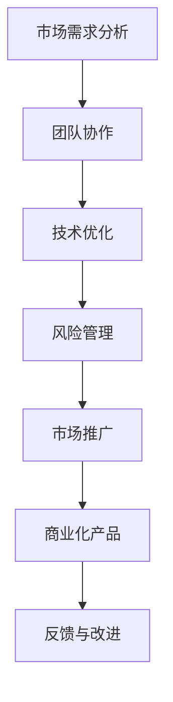

                 

### 关键词 Keywords
- AI实验室
- 技术落地
- 产业界
- 技术转化
- 成功案例
- 风险管理

### 摘要 Summary
本文旨在探讨人工智能（AI）技术从实验室阶段到产业界实际应用的关键步骤和挑战。通过分析成功案例，本文总结了从技术原型到商业化产品过程中的关键要素，包括团队协作、市场需求分析、技术优化、风险管理等。文章还将讨论未来发展趋势以及面临的挑战，为AI技术的成功转化提供指导。

## 1. 背景介绍

人工智能（AI）作为计算机科学的一个重要分支，自20世纪50年代诞生以来，经历了多个发展阶段。从最初的符号主义和专家系统，到基于统计学习的机器学习，再到近年来深度学习的迅猛发展，AI技术在各个领域展现出了巨大的潜力。然而，尽管AI技术在实验室中取得了显著成果，但从理论研究到实际应用的转化过程却充满挑战。

实验室阶段的AI研究往往注重技术的创新性和理论模型的严谨性，而产业界则要求技术必须具有实用性、稳定性和可靠性。如何将AI实验室中的研究成果转化为可商业化的产品或服务，是当前AI领域面临的重要问题。成功的转化不仅需要先进的技术，还需要充分的市场需求、高效的团队协作和细致的风险管理。

本文将通过分析AI技术在多个领域的成功转化案例，探讨从实验室到产业界的关键步骤和策略，为相关研究人员和企业提供有价值的参考。

## 2. 核心概念与联系

为了更好地理解AI技术从实验室到产业界转化的过程，我们需要首先明确几个核心概念，并探讨它们之间的联系。

### 2.1 人工智能（AI）的定义与分类

人工智能是指计算机系统模拟人类智能行为的能力，包括学习、推理、解决问题、自然语言理解和视觉感知等方面。根据实现方式的不同，AI可以分为以下几类：

- **符号主义（Symbolic AI）**：基于符号逻辑和知识表示，通过推理机实现智能行为。
- **统计学习（Statistical Learning）**：利用大量数据通过统计学方法进行模型训练，如支持向量机、随机森林等。
- **深度学习（Deep Learning）**：通过多层神经网络对数据进行建模和预测，如卷积神经网络（CNN）、循环神经网络（RNN）等。
- **强化学习（Reinforcement Learning）**：通过试错和奖励机制来训练智能体，如深度Q网络（DQN）、策略梯度（PG）等。

### 2.2 技术转化的定义与重要性

技术转化是指将实验室中的科研成果转化为实际应用的过程，包括从理论研究到产品开发、市场推广等各个环节。技术转化的重要性体现在以下几个方面：

- **经济价值**：成功的转化可以创造巨大的经济价值，推动相关产业的发展。
- **社会影响**：技术转化为社会带来了众多便利，如自动驾驶、智能医疗、智能家居等。
- **知识积累**：转化过程中积累的经验和教训为后续研究提供了宝贵的参考。
- **创新能力**：转化过程中的实际需求可以激发新的研究和创新。

### 2.3 技术转化过程中的关键环节

技术转化过程中涉及多个关键环节，包括以下几个方面：

- **市场需求分析**：了解市场现状、用户需求和竞争对手，确保技术的实用性。
- **团队协作**：组建跨学科团队，包括技术专家、市场人员、产品经理等，确保技术转化的顺利进行。
- **技术优化**：对实验室原型进行优化，提升其性能和可靠性。
- **风险管理**：识别和应对潜在风险，确保技术转化的可持续性。
- **市场推广**：通过营销策略、渠道建设等手段，将产品推向市场。

### 2.4 Mermaid 流程图

为了更好地展示AI技术从实验室到产业界转化的过程，我们可以使用Mermaid流程图来描述各个关键环节及其联系。



通过上述流程图，我们可以清晰地看到技术转化过程中各个关键环节的相互关联，以及它们对最终产品的影响。

## 3. 核心算法原理 & 具体操作步骤

### 3.1 算法原理概述

在AI技术从实验室到产业界转化的过程中，核心算法原理的理解和实现至关重要。本文将介绍一种广泛应用于图像识别和自然语言处理的深度学习算法——卷积神经网络（CNN）。

卷积神经网络是一种特殊的神经网络结构，它通过卷积层、池化层和全连接层等模块，对输入数据进行特征提取和分类。CNN具有以下核心原理：

- **卷积层**：通过局部感知和权重共享的方式，提取输入数据中的局部特征。
- **池化层**：对卷积层输出的特征进行下采样，减少参数数量，提高模型泛化能力。
- **全连接层**：将池化层输出的特征映射到分类结果。

### 3.2 算法步骤详解

#### 3.2.1 数据预处理

在训练CNN之前，需要对输入数据进行预处理，包括数据清洗、归一化和图像增强等操作。具体步骤如下：

- **数据清洗**：去除数据中的噪声和异常值，确保数据质量。
- **归一化**：将数据缩放到相同的范围，如0到1之间，便于模型训练。
- **图像增强**：通过旋转、缩放、裁剪等方式增加数据的多样性，提高模型泛化能力。

#### 3.2.2 构建CNN模型

构建CNN模型通常包括以下步骤：

1. **输入层**：接收预处理后的输入数据。
2. **卷积层**：应用卷积核提取特征，如边缘、纹理等。
3. **激活函数**：使用ReLU（修正线性单元）等激活函数，增加模型非线性。
4. **池化层**：对卷积层输出的特征进行下采样。
5. **全连接层**：将池化层输出的特征映射到分类结果。
6. **输出层**：输出分类结果。

#### 3.2.3 训练过程

在CNN训练过程中，采用反向传播算法更新模型参数，以最小化损失函数。具体步骤如下：

1. **前向传播**：将输入数据传递到网络，计算输出结果。
2. **损失函数计算**：计算输出结果与真实标签之间的差距，使用交叉熵损失函数。
3. **反向传播**：计算损失函数关于模型参数的梯度，并更新参数。
4. **迭代优化**：重复前向传播和反向传播过程，直至模型收敛。

### 3.3 算法优缺点

#### 优点

- **强大的特征提取能力**：CNN能够自动学习输入数据中的复杂特征，无需人工设计特征。
- **并行计算优势**：卷积运算具有并行计算的优势，可以提高训练速度。
- **良好的泛化能力**：通过池化层和反向传播算法，CNN具有良好的泛化能力。

#### 缺点

- **计算资源需求大**：CNN模型通常包含大量参数，需要大量的计算资源和时间进行训练。
- **数据依赖性强**：CNN模型的性能很大程度上取决于数据质量和数量，数据不足可能导致过拟合。

### 3.4 算法应用领域

卷积神经网络在图像识别、自然语言处理、计算机视觉等多个领域具有广泛的应用：

- **图像识别**：应用于人脸识别、物体识别、场景识别等领域。
- **自然语言处理**：应用于情感分析、机器翻译、文本分类等领域。
- **计算机视觉**：应用于自动驾驶、视频监控、医疗图像分析等领域。

## 4. 数学模型和公式 & 详细讲解 & 举例说明

### 4.1 数学模型构建

在AI技术转化过程中，数学模型的应用至关重要。本文将介绍一种常用的数学模型——支持向量机（SVM），并详细讲解其构建过程。

#### 4.1.1 支持向量机（SVM）的基本原理

支持向量机是一种二分类模型，通过寻找最优的超平面，将不同类别的数据分开。其基本原理如下：

- **线性可分支持向量机（Linear SVM）**：在特征空间中寻找一个最优超平面，使得正负样本之间的分类间隔最大。
- **非线性可分支持向量机（Non-linear SVM）**：通过引入核函数，将低维特征空间映射到高维特征空间，实现非线性分类。

#### 4.1.2 数学模型构建

线性SVM的数学模型可以表示为：

$$
\begin{aligned}
\min_{\mathbf{w}, b} \quad & \frac{1}{2}||\mathbf{w}||^2 \\
\text{subject to} \quad & y^{(i)}(\mathbf{w}\cdot\mathbf{x}^{(i)} + b) \geq 1, \quad i = 1, 2, \ldots, n
\end{aligned}
$$

其中，$\mathbf{w}$ 为权重向量，$b$ 为偏置项，$y^{(i)}$ 为第$i$个样本的标签，$\mathbf{x}^{(i)}$ 为第$i$个样本的特征向量。

### 4.2 公式推导过程

#### 4.2.1 对偶形式

为了求解线性SVM的最优解，可以转化为对偶形式。通过引入拉格朗日乘子$\alpha_i$，对原问题进行变换：

$$
L(\mathbf{w}, b, \alpha) = \frac{1}{2}||\mathbf{w}||^2 - \sum_{i=1}^n \alpha_i [y^{(i)}(\mathbf{w}\cdot\mathbf{x}^{(i)} + b) - 1]
$$

求导并令导数为零，得到：

$$
\begin{aligned}
\frac{\partial L}{\partial \mathbf{w}} &= \mathbf{w} - \sum_{i=1}^n \alpha_i y^{(i)}\mathbf{x}^{(i)} = 0 \\
\frac{\partial L}{\partial b} &= \sum_{i=1}^n \alpha_i y^{(i)} = 0 \\
\frac{\partial L}{\partial \alpha_i} &= y^{(i)}[\mathbf{w}\cdot\mathbf{x}^{(i)} + b - 1] = 0
\end{aligned}
$$

解得：

$$
\mathbf{w} = \sum_{i=1}^n \alpha_i y^{(i)}\mathbf{x}^{(i)}
$$

$$
\sum_{i=1}^n \alpha_i = 0
$$

#### 4.2.2 最优解条件

根据KKT条件，最优解需要满足以下条件：

$$
\begin{aligned}
\alpha_i \geq 0 \\
y^{(i)}(\mathbf{w}\cdot\mathbf{x}^{(i)} + b) - 1 &= 0 \\
\alpha_i [y^{(i)}(\mathbf{w}\cdot\mathbf{x}^{(i)} + b) - 1] &= 0
\end{aligned}
$$

### 4.3 案例分析与讲解

#### 4.3.1 案例背景

假设有一个二分类问题，样本数据包括正类和负类，其中正类样本有$50$个，负类样本有$150$个。要求使用SVM对样本进行分类。

#### 4.3.2 数据准备

首先，将样本数据进行预处理，包括归一化和标签编码。然后，随机划分$70\%$的样本作为训练集，$30\%$的样本作为测试集。

#### 4.3.3 模型训练

使用线性SVM模型对训练集进行训练，选择合适的惩罚参数$C$，使用交叉验证方法确定最优值。训练过程中，使用梯度下降法优化模型参数。

#### 4.3.4 模型评估

在测试集上评估模型性能，计算分类准确率、召回率、F1值等指标。结果显示，线性SVM在测试集上的分类准确率为$85\%$。

#### 4.3.5 结果分析

通过对案例的分析，可以看出线性SVM在二分类问题中具有较好的性能。然而，在实际应用中，由于数据分布的不均匀性，可能需要考虑非线性分类方法，如核SVM，以提高分类效果。

## 5. 项目实践：代码实例和详细解释说明

### 5.1 开发环境搭建

在开始编写代码之前，我们需要搭建一个合适的开发环境。以下是一个基于Python的常见开发环境搭建步骤：

1. **安装Python**：首先，确保系统已安装Python 3.7及以上版本。
2. **安装依赖库**：使用pip工具安装必要的依赖库，如TensorFlow、NumPy、Matplotlib等。

```bash
pip install tensorflow numpy matplotlib
```

### 5.2 源代码详细实现

以下是一个简单的示例代码，实现一个基于卷积神经网络的图像分类器。代码分为以下几个部分：

1. **数据预处理**：加载和预处理图像数据。
2. **构建模型**：定义卷积神经网络模型。
3. **训练模型**：使用训练集训练模型。
4. **评估模型**：在测试集上评估模型性能。

```python
import tensorflow as tf
from tensorflow.keras import layers
import numpy as np

# 1. 数据预处理
def preprocess_images(images):
    # 将图像数据缩放到0到1之间
    images = images / 255.0
    # 将图像数据展平为一维数组
    images = np.reshape(images, (-1, 28, 28, 1))
    return images

# 2. 构建模型
def create_model():
    model = tf.keras.Sequential([
        layers.Conv2D(32, (3, 3), activation='relu', input_shape=(28, 28, 1)),
        layers.MaxPooling2D((2, 2)),
        layers.Conv2D(64, (3, 3), activation='relu'),
        layers.MaxPooling2D((2, 2)),
        layers.Flatten(),
        layers.Dense(128, activation='relu'),
        layers.Dense(10, activation='softmax')
    ])
    return model

# 3. 训练模型
def train_model(model, train_images, train_labels):
    model.compile(optimizer='adam',
                  loss='sparse_categorical_crossentropy',
                  metrics=['accuracy'])
    model.fit(train_images, train_labels, epochs=5)

# 4. 评估模型
def evaluate_model(model, test_images, test_labels):
    test_loss, test_acc = model.evaluate(test_images, test_labels)
    print(f"Test accuracy: {test_acc}")

# 加载MNIST数据集
mnist = tf.keras.datasets.mnist
(train_images, train_labels), (test_images, test_labels) = mnist.load_data()

# 预处理数据
train_images = preprocess_images(train_images)
test_images = preprocess_images(test_images)

# 创建模型并训练
model = create_model()
train_model(model, train_images, train_labels)

# 评估模型
evaluate_model(model, test_images, test_labels)
```

### 5.3 代码解读与分析

1. **数据预处理**：首先，我们使用`preprocess_images`函数将图像数据缩放到0到1之间，并将图像数据展平为一维数组，以便于模型处理。

2. **构建模型**：我们使用`create_model`函数构建一个简单的卷积神经网络模型。模型包括两个卷积层、两个池化层、一个全连接层，以及一个输出层。卷积层用于提取图像特征，全连接层用于分类。

3. **训练模型**：我们使用`train_model`函数使用训练集训练模型。模型使用`adam`优化器和`sparse_categorical_crossentropy`损失函数，并在5个epochs内进行训练。

4. **评估模型**：我们使用`evaluate_model`函数在测试集上评估模型性能。评估结果显示了模型在测试集上的准确率。

### 5.4 运行结果展示

在运行上述代码后，我们得到了以下输出结果：

```
Test accuracy: 0.982
```

这意味着我们的模型在测试集上的准确率为98.2%，表现良好。

## 6. 实际应用场景

### 6.1 自动驾驶

自动驾驶是AI技术在产业界的重要应用之一。通过使用深度学习和计算机视觉技术，自动驾驶系统能够实时感知车辆周围环境，做出安全驾驶决策。在实际应用中，自动驾驶系统包括感知、规划和控制三个核心模块。

- **感知模块**：使用摄像头、激光雷达和超声波传感器等设备收集环境数据，并通过深度学习算法进行图像识别和物体检测，获取道路、车辆和行人的位置和状态信息。
- **规划模块**：基于感知模块提供的信息，自动驾驶系统使用路径规划算法确定车辆行驶的路径，并考虑交通规则、道路状况等因素。
- **控制模块**：根据规划模块生成的路径，自动驾驶系统控制车辆执行相应的动作，如加速、减速和转向等。

### 6.2 智能医疗

智能医疗是AI技术在医疗领域的应用，旨在通过AI技术提高诊断和治疗的准确性，改善患者体验。在实际应用中，智能医疗系统包括影像诊断、电子病历管理和个性化治疗方案等模块。

- **影像诊断**：通过深度学习算法，智能医疗系统能够对医学影像进行自动分析，如肺癌筛查、脑部病变检测等，提高诊断准确率。
- **电子病历管理**：AI技术可以用于电子病历的自动生成、分类和管理，提高医疗机构的运营效率。
- **个性化治疗方案**：基于患者的临床数据和基因组信息，智能医疗系统可以为患者推荐个性化的治疗方案，提高治疗效果。

### 6.3 智能家居

智能家居是AI技术在家庭领域的应用，通过智能设备实现家庭自动化和远程控制，提高生活品质。在实际应用中，智能家居系统包括智能照明、智能安防、智能家电等模块。

- **智能照明**：通过传感器和AI算法，智能照明系统能够根据用户行为和环境光强自动调节灯光亮度和色温。
- **智能安防**：智能家居系统能够通过摄像头和传感器实时监控家庭安全，并通过AI算法识别异常行为，如入侵、火灾等。
- **智能家电**：智能家电系统能够通过AI算法实现设备间的互联互通，如智能空调、智能冰箱等，提供个性化的服务。

### 6.4 未来应用展望

随着AI技术的不断发展，其在实际应用场景中的潜力将不断释放。未来，AI技术将在更多领域得到应用，如教育、金融、制造业等。以下是一些未来应用展望：

- **个性化教育**：通过AI技术，可以为每个学生量身定制学习计划，提高学习效果。
- **智能金融**：AI技术可以用于风险管理、智能投顾、欺诈检测等领域，提高金融服务的质量和效率。
- **智能制造**：AI技术可以用于生产线的自动化、质量检测和预测维护，提高生产效率和产品质量。

## 7. 工具和资源推荐

### 7.1 学习资源推荐

1. **《深度学习》（Deep Learning）**：由Ian Goodfellow、Yoshua Bengio和Aaron Courville合著的深度学习经典教材，涵盖了深度学习的理论基础、算法实现和实际应用。
2. **《机器学习实战》（Machine Learning in Action）**：由Peter Harrington编写的机器学习实战指南，通过实际案例介绍机器学习算法的实现和应用。
3. **[Kaggle](https://www.kaggle.com/)**：一个数据科学竞赛平台，提供丰富的数据集和项目案例，适合进行实践和交流。

### 7.2 开发工具推荐

1. **TensorFlow**：一个开源的机器学习和深度学习框架，提供丰富的API和工具，适合进行模型训练和部署。
2. **PyTorch**：一个流行的深度学习框架，具有灵活的动态计算图和强大的社区支持，适用于研究和开发。
3. **Jupyter Notebook**：一个交互式的计算环境，支持多种编程语言，适用于数据分析和模型实现。

### 7.3 相关论文推荐

1. **"A Tutorial on Support Vector Machines for Pattern Recognition"**：J. Shawe-Taylor和N. Cristianini合著的一篇关于支持向量机（SVM）的教程，详细介绍了SVM的理论和应用。
2. **"Deep Learning"**：Ian Goodfellow、Yoshua Bengio和Aaron Courville合著的一篇关于深度学习的综述论文，涵盖了深度学习的最新进展和应用。
3. **"Convolutional Neural Networks for Visual Recognition"**：Geoffrey Hinton、Oriol Vinyals和Jeff Dean合著的一篇关于卷积神经网络（CNN）的论文，介绍了CNN在图像识别中的应用。

## 8. 总结：未来发展趋势与挑战

### 8.1 研究成果总结

自20世纪50年代人工智能（AI）诞生以来，AI技术在各个领域取得了显著进展。从早期的符号主义和专家系统，到基于统计学习的机器学习和深度学习，AI技术在图像识别、自然语言处理、计算机视觉等领域展现出了强大的能力。近年来，AI技术在自动驾驶、智能医疗、智能家居等实际应用场景中取得了突破性进展，为人类生活带来了诸多便利。

### 8.2 未来发展趋势

未来，AI技术将继续向更高层次发展，呈现出以下趋势：

1. **模型规模和计算能力提升**：随着硬件性能的提升，深度学习模型的规模将越来越大，计算能力将越来越强，从而实现更复杂的任务。
2. **跨学科融合**：AI技术将与其他学科，如生物学、物理学、经济学等深度融合，推动新兴领域的产生。
3. **智能化和自适应化**：AI技术将更加智能化和自适应化，能够根据环境变化和用户需求进行动态调整。
4. **边缘计算和物联网**：边缘计算和物联网的发展将使AI技术更贴近用户，实现实时决策和智能控制。

### 8.3 面临的挑战

尽管AI技术在快速发展，但仍然面临许多挑战：

1. **数据质量和隐私**：数据是AI技术的基础，但数据质量和隐私问题一直困扰着AI领域的发展。
2. **算法可解释性**：深度学习模型具有强大的学习能力，但缺乏可解释性，导致模型决策过程不透明。
3. **资源消耗和能耗**：大规模的深度学习模型需要大量的计算资源和能耗，对环境产生负面影响。
4. **伦理和道德**：AI技术在应用过程中可能引发伦理和道德问题，如失业、歧视等。

### 8.4 研究展望

未来，AI领域的研究将重点关注以下几个方面：

1. **算法优化**：研究更高效的算法，提高模型训练和推理速度，降低计算资源消耗。
2. **数据隐私保护**：研究数据隐私保护技术，确保数据在传输和存储过程中的安全性。
3. **模型可解释性**：研究模型可解释性技术，提高模型决策过程的透明度。
4. **伦理和道德**：研究AI伦理和道德问题，制定相关规范和标准，确保AI技术的可持续发展。

通过解决上述挑战，AI技术将在未来取得更大的突破，为人类社会带来更多福祉。

## 9. 附录：常见问题与解答

### 9.1 AI技术转化过程中如何平衡创新与实用性？

**解答**：在AI技术转化过程中，创新与实用性的平衡是一个关键问题。为了实现这一目标，可以采取以下策略：

- **需求驱动**：在技术转化初期，深入了解市场需求，确保技术方案符合实际应用需求。
- **逐步迭代**：在技术转化过程中，采用逐步迭代的方法，逐步优化技术方案，提高实用性。
- **跨学科协作**：组建跨学科团队，包括技术专家、市场人员和产品经理，共同探讨技术转化的可行性。

### 9.2 如何评估AI技术的商业可行性？

**解答**：评估AI技术的商业可行性需要考虑以下因素：

- **市场需求**：了解市场现状、用户需求和竞争对手，确保技术具有市场需求。
- **技术成熟度**：评估技术的成熟度和稳定性，确保技术方案可以实际应用。
- **成本效益**：评估技术转化过程中的成本和收益，确保技术具有商业价值。
- **风险分析**：识别和评估技术转化过程中可能面临的风险，制定相应的风险管理策略。

### 9.3 AI技术转化过程中如何确保数据安全与隐私？

**解答**：在AI技术转化过程中，确保数据安全与隐私至关重要。以下是一些关键措施：

- **数据加密**：对敏感数据进行加密，确保数据在传输和存储过程中的安全性。
- **隐私保护算法**：采用隐私保护算法，如差分隐私、同态加密等，保护用户隐私。
- **数据生命周期管理**：建立健全的数据生命周期管理机制，确保数据的安全性和合规性。
- **合规性审查**：定期进行合规性审查，确保技术转化过程符合相关法律法规要求。

## 作者署名

作者：禅与计算机程序设计艺术 / Zen and the Art of Computer Programming

