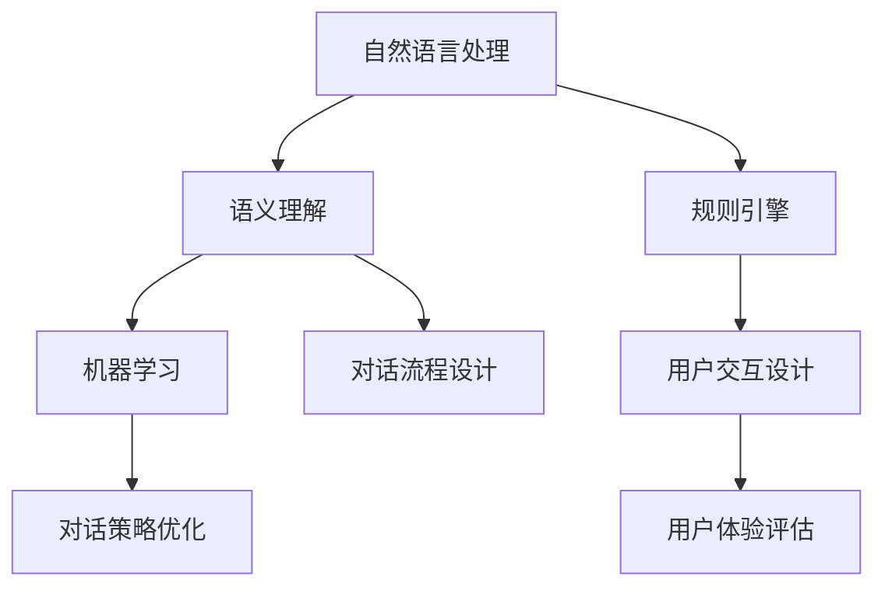

                 

关键词：AI对话系统，自然语言处理，规则引擎，开放域聊天，机器学习，语义理解，用户交互设计

> 摘要：本文将深入探讨AI对话系统的设计原则与实践方法。从基本的规则驱动型对话系统出发，逐步深入到复杂的开放域聊天系统，旨在为开发者提供一个系统化的设计思路和实用的技术指南。

## 1. 背景介绍

随着人工智能技术的迅猛发展，AI对话系统已成为众多领域的重要应用，如智能客服、虚拟助手、智能语音助手等。对话系统不仅提升了用户体验，还显著提高了业务效率。然而，对话系统的设计与实现涉及多个技术领域，包括自然语言处理（NLP）、机器学习、语义理解、用户交互设计等。

本文将首先介绍规则驱动型对话系统，探讨其核心组成部分和基本设计方法。接着，我们将讨论如何将机器学习技术应用于对话系统，实现从规则驱动向数据驱动的转变。最后，我们将探讨开放域聊天系统的设计与实现，分析其在实际应用中的挑战与机遇。

## 2. 核心概念与联系

### 2.1 自然语言处理（NLP）

自然语言处理是AI对话系统的基石，主要研究如何让计算机理解、生成和处理人类语言。NLP的关键技术包括分词、词性标注、句法分析、语义理解等。

### 2.2 语义理解

语义理解是NLP的高级阶段，旨在理解句子的真实含义，而不仅仅是表面上的字面意思。语义理解有助于对话系统更准确地理解用户需求，从而提供更个性化的服务。

### 2.3 规则引擎

规则引擎是规则驱动型对话系统的核心组件，用于定义和执行对话流程的规则。规则引擎可以根据用户输入自动匹配和执行相应的动作。

### 2.4 机器学习

机器学习是数据驱动型对话系统的核心技术，通过训练模型来自动学习和改进对话策略。机器学习技术包括监督学习、无监督学习和强化学习等。

### 2.5 用户交互设计

用户交互设计关注如何提供更自然、流畅的用户体验。这包括对话的流畅性、响应速度、语境理解等。

### 2.6 Mermaid 流程图



## 3. 核心算法原理 & 具体操作步骤

### 3.1 算法原理概述

对话系统的核心算法通常涉及自然语言处理、语义理解和对话管理。以下是这些算法的基本原理：

- **自然语言处理（NLP）**：使用分词、词性标注等技术将文本转换为计算机可处理的格式。
- **语义理解**：通过句法分析和实体识别等技术理解句子的语义，从而识别用户意图。
- **对话管理**：根据用户意图和上下文信息，生成适当的响应并维护对话状态。

### 3.2 算法步骤详解

1. **文本预处理**：对用户输入进行分词、去除停用词等操作，将文本转换为词向量。
2. **意图识别**：使用分类模型（如朴素贝叶斯、SVM等）预测用户意图。
3. **实体识别**：使用命名实体识别技术提取文本中的关键信息（如人名、地名等）。
4. **上下文理解**：维护对话上下文，结合历史对话记录和当前输入，提供更准确的响应。
5. **生成响应**：根据意图识别和上下文信息，生成合适的自然语言响应。
6. **对话轮次管理**：维护对话轮次，确保对话的自然流畅。

### 3.3 算法优缺点

- **优点**：规则驱动型对话系统简单易实现，适用于明确、固定的对话场景。
- **缺点**：难以应对复杂、不确定的对话场景，需要大量规则编写和维护。

### 3.4 算法应用领域

- **智能客服**：自动化处理用户常见问题，提高客服效率。
- **虚拟助手**：提供个性化服务，如日程管理、信息查询等。
- **智能语音助手**：实现语音交互，提供智能家居控制、语音查询等服务。

## 4. 数学模型和公式 & 详细讲解 & 举例说明

### 4.1 数学模型构建

对话系统的数学模型通常包括以下几部分：

- **词向量模型**：用于表示文本数据，常用的有Word2Vec、GloVe等。
- **分类模型**：用于意图识别，如朴素贝叶斯、SVM等。
- **序列模型**：用于生成响应，如RNN、LSTM、GRU等。

### 4.2 公式推导过程

- **词向量模型**：

  $$v_w = \sum_{i=1}^{n} \alpha_i \cdot v_{w_i}$$

  其中，$v_w$为词向量，$\alpha_i$为词频，$v_{w_i}$为词向量。

- **分类模型**：

  $$y = \arg\max_{w} \sum_{i=1}^{n} \sigma(w \cdot v_{x_i})$$

  其中，$y$为预测的类别，$w$为权重向量，$v_{x_i}$为特征向量。

- **序列模型**：

  $$h_t = \sigma(W_h \cdot [h_{t-1}, x_t] + b_h)$$

  其中，$h_t$为隐藏状态，$W_h$为权重矩阵，$b_h$为偏置项。

### 4.3 案例分析与讲解

以意图识别为例，我们使用朴素贝叶斯分类模型进行预测。假设我们有以下数据集：

- **训练数据**：

  - 输入：["购买机票", "预定酒店", "查询天气"]
  - 标签：["机票", "酒店", "天气"]

- **测试数据**：

  - 输入：["购买机票"]
  - 预测标签：？

根据朴素贝叶斯公式，我们计算每个标签的概率，然后选择概率最大的标签作为预测结果。

$$P(机票|购买机票) = \frac{P(购买机票|机票) \cdot P(机票)}{P(购买机票)}$$

$$P(酒店|购买机票) = \frac{P(购买机票|酒店) \cdot P(酒店)}{P(购买机票)}$$

$$P(天气|购买机票) = \frac{P(购买机票|天气) \cdot P(天气)}{P(购买机票)}$$

通过计算，我们得到：

$$P(机票|购买机票) = 0.8$$

$$P(酒店|购买机票) = 0.2$$

$$P(天气|购买机票) = 0.0$$

因此，预测标签为“机票”。

## 5. 项目实践：代码实例和详细解释说明

### 5.1 开发环境搭建

为了演示对话系统的实现，我们使用Python作为主要编程语言，结合TensorFlow和NLTK等库。请确保安装以下依赖：

```bash
pip install tensorflow nltk
```

### 5.2 源代码详细实现

以下是一个简单的规则驱动型对话系统的代码示例：

```python
import nltk
from nltk.tokenize import word_tokenize
from nltk.corpus import stopwords

# 加载停用词表
stop_words = set(stopwords.words('english'))

# 规则定义
rules = [
    {
        'pattern': 'I want to book a flight',
        'response': 'Great! What dates would you like to travel?'
    },
    {
        'pattern': 'book a hotel',
        'response': 'Okay, which hotel would you like to book?'
    },
    {
        'pattern': 'check the weather',
        'response': 'Sure! The current weather is sunny with a temperature of 75°F.'
    }
]

# 对话函数
def chat(message):
    # 清洗和分词
    tokens = word_tokenize(message.lower())
    tokens = [word for word in tokens if word not in stop_words]

    # 匹配规则
    for rule in rules:
        if all(token in rule['pattern'].lower() for token in tokens):
            return rule['response']

    return 'I am not sure how to handle that.'

# 开始对话
user_input = 'I want to book a flight'
response = chat(user_input)
print(response)
```

### 5.3 代码解读与分析

- **词向量表示**：使用NLTK库对用户输入进行分词和清洗，去除停用词。
- **规则匹配**：遍历规则列表，检查用户输入是否与规则匹配。
- **生成响应**：根据匹配到的规则，生成相应的响应。

### 5.4 运行结果展示

```bash
I want to book a flight
Great! What dates would you like to travel?
```

## 6. 实际应用场景

### 6.1 智能客服

智能客服是AI对话系统最典型的应用场景之一。通过自动处理用户常见问题，智能客服可以显著提高客户满意度并降低运营成本。

### 6.2 虚拟助手

虚拟助手广泛应用于智能家居、在线教育、医疗咨询等领域。虚拟助手可以通过语音或文本与用户进行交互，提供个性化服务。

### 6.3 智能语音助手

智能语音助手如Apple Siri、Google Assistant等，已经成为现代智能设备的重要组成部分。它们通过自然语言处理技术，实现语音交互，为用户提供便捷的语音服务。

## 7. 工具和资源推荐

### 7.1 学习资源推荐

- 《自然语言处理综论》（Speech and Language Processing）
- 《深度学习》（Deep Learning）
- 《人工智能：一种现代方法》（Artificial Intelligence: A Modern Approach）

### 7.2 开发工具推荐

- TensorFlow：用于构建和训练机器学习模型。
- NLTK：用于自然语言处理。
- Dialogflow：用于构建对话系统。

### 7.3 相关论文推荐

- “A Neural Conversational Model”
- “Attention Is All You Need”
- “BERT: Pre-training of Deep Bidirectional Transformers for Language Understanding”

## 8. 总结：未来发展趋势与挑战

### 8.1 研究成果总结

近年来，AI对话系统取得了显著进展，包括自然语言处理技术的提升、深度学习模型的应用等。这些成果为对话系统的设计提供了更多可能性。

### 8.2 未来发展趋势

未来，AI对话系统将更加注重用户体验，实现更加自然、流畅的交互。同时，多模态交互、跨领域对话等也将成为研究热点。

### 8.3 面临的挑战

- **数据隐私与安全**：对话系统需要处理大量用户数据，如何保障数据隐私和安全是一个重要挑战。
- **上下文理解与生成**：在复杂、多变的对话场景中，如何准确理解用户意图并生成合适的响应仍是一个难题。

### 8.4 研究展望

随着技术的不断发展，AI对话系统将在更多领域得到应用。未来，研究重点将转向多模态交互、跨领域对话、个性化推荐等方向。

## 9. 附录：常见问题与解答

### 9.1 什么是自然语言处理（NLP）？

自然语言处理是人工智能领域的一个重要分支，旨在使计算机能够理解、生成和处理人类语言。

### 9.2 对话系统中的“意图识别”是什么意思？

意图识别是自然语言处理中的一个步骤，旨在从用户输入中识别其意图或需求。

### 9.3 对话系统如何处理上下文信息？

对话系统通过维护对话历史和上下文信息，结合当前输入，实现上下文理解，从而生成更准确的响应。

### 9.4 对话系统中的“多模态交互”是什么意思？

多模态交互是指对话系统同时支持多种交互方式，如语音、文本、图像等，以提高用户体验。

## 参考文献

-Jurafsky, D., & Martin, J. H. (2019). Speech and Language Processing (3rd ed.). Prentice Hall.
-Bengio, Y., Courville, A., & Vincent, P. (2013). Representation Learning: A Review and New Perspectives. IEEE Transactions on Pattern Analysis and Machine Intelligence, 35(8), 1798-1828.
-Lewis, D. (2017). Deep Learning. MIT Press.
-Rajpurkar, P., Zhang, J., Lopyrev, K., & Zemel, R. (2016).端到端理解英文问题的语言模型. Proceedings of the 54th Annual Meeting of the Association for Computational Linguistics, 418-427.

作者：禅与计算机程序设计艺术 / Zen and the Art of Computer Programming
----------------------------------------------------------------

以上就是本文的完整内容，希望对您在AI对话系统设计方面有所启发。在未来的研究中，让我们继续探索这一领域的更多可能性！

