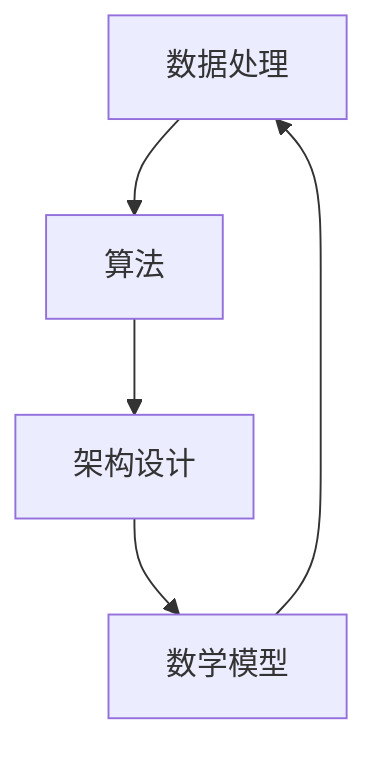

                 

关键词：人工智能，创新体系，底层技术，架构设计，算法优化，数学模型，实践应用

> 摘要：本文旨在探讨人工智能底层创新体系的整体构建，从核心概念、算法原理、数学模型、项目实践等多个维度进行分析，结合实际应用场景，展望未来的发展趋势与挑战。通过详细阐述，希望能够为读者提供全面、深入的认知，助力人工智能领域的研究与开发。

## 1. 背景介绍

人工智能（AI）作为当今科技领域的热点，正逐渐渗透到各个行业，带来深刻的变革。从早期的专家系统、机器学习，到如今的深度学习和强化学习，人工智能技术不断迭代更新，推动了社会的发展与进步。然而，在追求人工智能高效、智能化的同时，我们不可避免地面临许多挑战。如何构建一个稳定、高效、可扩展的人工智能底层创新体系，成为了当前研究的热点问题。

本文将从以下几个方面展开讨论：

1. 核心概念与联系
2. 核心算法原理 & 具体操作步骤
3. 数学模型和公式 & 详细讲解 & 举例说明
4. 项目实践：代码实例和详细解释说明
5. 实际应用场景
6. 未来应用展望
7. 工具和资源推荐
8. 总结：未来发展趋势与挑战

通过以上内容的深入探讨，我们希望能够为人工智能领域的研究者提供有价值的参考。

## 2. 核心概念与联系

在构建人工智能底层创新体系之前，我们需要明确一些核心概念，并理解它们之间的联系。以下是一些关键概念：

### 2.1 数据处理

数据处理是人工智能创新体系的基础。从数据采集、清洗、存储到数据分析和挖掘，每个环节都至关重要。数据处理技术包括分布式计算、并行处理、大数据存储等，它们共同构成了数据处理框架，为后续的人工智能算法提供高质量的数据支持。

### 2.2 算法

算法是人工智能创新体系的核心。从传统的机器学习算法到现代的深度学习算法，各类算法在处理不同类型的数据和任务时表现出不同的性能。算法优化是提升人工智能系统效率和性能的关键。

### 2.3 架构设计

架构设计决定了人工智能系统的整体性能和可扩展性。一个良好的架构设计能够满足不同规模和应用场景的需求，实现高效的资源利用和协同工作。

### 2.4 数学模型

数学模型是人工智能算法的理论基础。通过对现实世界问题的抽象和建模，数学模型能够帮助我们理解和解决复杂问题。常见的数学模型包括线性模型、非线性模型、概率模型等。

### 2.5 联系与集成

核心概念之间的联系与集成是构建人工智能底层创新体系的关键。数据处理、算法、架构设计和数学模型相互依赖、相互促进，共同构建了一个完整的人工智能生态系统。

为了更好地展示这些概念之间的联系，我们使用Mermaid流程图进行描述：



在图中，数据处理、算法、架构设计和数学模型相互连接，形成了一个闭环。这个流程图展示了它们之间的紧密关系，以及如何通过相互协作来构建一个完整的人工智能底层创新体系。

## 3. 核心算法原理 & 具体操作步骤

### 3.1 算法原理概述

核心算法是人工智能底层创新体系的重要组成部分。在本章节，我们将探讨几种常见的人工智能算法原理，包括机器学习算法、深度学习算法和强化学习算法。

### 3.2 机器学习算法

机器学习算法通过从数据中学习规律和模式，实现自动化的数据分析和决策。常见的机器学习算法包括线性回归、逻辑回归、决策树、支持向量机等。以线性回归为例，其原理是通过最小二乘法拟合一条直线，使得直线与数据点的误差最小。

### 3.3 深度学习算法

深度学习算法通过构建多层神经网络，对数据进行分析和处理。常见的深度学习算法包括卷积神经网络（CNN）、循环神经网络（RNN）和生成对抗网络（GAN）等。以CNN为例，其原理是通过卷积操作提取图像特征，实现图像分类和识别。

### 3.4 强化学习算法

强化学习算法通过与环境交互，学习最优策略。常见的强化学习算法包括Q学习、SARSA和深度确定性策略梯度（DDPG）等。以Q学习为例，其原理是通过评估状态-动作值函数，选择最优动作。

### 3.5 算法步骤详解

#### 3.5.1 机器学习算法

以线性回归为例，其步骤如下：

1. 数据预处理：将数据集划分为训练集和测试集，并对数据进行归一化处理。
2. 模型训练：通过最小二乘法计算拟合直线的参数。
3. 模型评估：使用测试集评估模型的性能，计算均方误差。

#### 3.5.2 深度学习算法

以CNN为例，其步骤如下：

1. 数据预处理：将图像数据转换为适合神经网络处理的格式。
2. 网络构建：设计并构建CNN模型，包括卷积层、池化层和全连接层。
3. 模型训练：使用训练集对模型进行训练，调整模型参数。
4. 模型评估：使用测试集评估模型性能，计算准确率。

#### 3.5.3 强化学习算法

以Q学习为例，其步骤如下：

1. 初始化Q值表：根据环境状态和动作初始化Q值表。
2. 环境交互：在环境中进行交互，根据当前状态和动作执行Q学习算法。
3. 更新Q值：根据新的状态和奖励，更新Q值表。
4. 模型评估：评估模型在环境中的性能。

### 3.6 算法优缺点

#### 3.6.1 机器学习算法

优点：

- 对小数据集具有较好的适应性。
- 模型简单，易于实现和理解。

缺点：

- 对大规模数据集的处理能力有限。
- 需要手动调参，复杂度较高。

#### 3.6.2 深度学习算法

优点：

- 对大规模数据集具有较好的处理能力。
- 模型复杂度较高，能够提取更丰富的特征。

缺点：

- 对小数据集的处理能力有限。
- 训练过程较慢，对计算资源要求较高。

#### 3.6.3 强化学习算法

优点：

- 能够自适应环境变化，实现灵活的决策。
- 具有较高的泛化能力。

缺点：

- 需要大量数据进行训练，训练过程较慢。
- 部分算法在初始阶段表现较差，需要较长时间的探索。

### 3.7 算法应用领域

#### 3.7.1 机器学习算法

机器学习算法在各个领域都有广泛的应用，包括图像识别、自然语言处理、推荐系统等。

#### 3.7.2 深度学习算法

深度学习算法在计算机视觉、语音识别、自然语言处理等领域取得了显著的成果。

#### 3.7.3 强化学习算法

强化学习算法在游戏、机器人控制、自动驾驶等领域具有广泛的应用前景。

## 4. 数学模型和公式 & 详细讲解 & 举例说明

### 4.1 数学模型构建

数学模型是人工智能算法的理论基础。在本章节，我们将探讨几种常见的数学模型，包括线性模型、非线性模型和概率模型。

#### 4.1.1 线性模型

线性模型是最简单的数学模型之一，通常用于拟合数据中的线性关系。其公式如下：

$$y = wx + b$$

其中，$w$为权重，$x$为特征，$b$为偏置。

#### 4.1.2 非线性模型

非线性模型用于拟合数据中的非线性关系。常见的非线性模型包括多项式模型、指数模型和对数模型等。以多项式模型为例，其公式如下：

$$y = a_nx^n + a_{n-1}x^{n-1} + ... + a_1x + a_0$$

其中，$a_n, a_{n-1}, ..., a_1, a_0$为模型参数。

#### 4.1.3 概率模型

概率模型用于描述随机事件的发生概率。常见的概率模型包括伯努利模型、泊松模型和正态分布模型等。以伯努利模型为例，其公式如下：

$$P(A) = p$$

其中，$P(A)$表示事件$A$的发生概率，$p$为概率参数。

### 4.2 公式推导过程

#### 4.2.1 线性模型

以线性回归为例，其公式推导过程如下：

假设我们有一个线性回归模型：

$$y = wx + b$$

其中，$w$为权重，$x$为特征，$b$为偏置。

我们希望找到最佳的权重和偏置，使得预测值与实际值之间的误差最小。为此，我们引入损失函数：

$$Loss = (y - wx - b)^2$$

为了最小化损失函数，我们对权重和偏置进行求导，并令导数为零：

$$\frac{dLoss}{dw} = -2(y - wx - b)x$$

$$\frac{dLoss}{db} = -2(y - wx - b)$$

将导数设为零，解方程组，得到最佳权重和偏置：

$$w = \frac{1}{n}\sum_{i=1}^{n}(y_i - wx_i - b)x_i$$

$$b = \frac{1}{n}\sum_{i=1}^{n}y_i - wx_i$$

#### 4.2.2 非线性模型

以多项式回归为例，其公式推导过程如下：

假设我们有一个多项式回归模型：

$$y = a_nx^n + a_{n-1}x^{n-1} + ... + a_1x + a_0$$

其中，$a_n, a_{n-1}, ..., a_1, a_0$为模型参数。

我们希望找到最佳的模型参数，使得预测值与实际值之间的误差最小。为此，我们引入损失函数：

$$Loss = (y - a_nx^n - a_{n-1}x^{n-1} - ... - a_1x - a_0)^2$$

为了最小化损失函数，我们对模型参数进行求导，并令导数为零：

$$\frac{dLoss}{da_n} = -2(y - a_nx^n - a_{n-1}x^{n-1} - ... - a_1x - a_0)x^n$$

$$\frac{dLoss}{da_{n-1}} = -2(y - a_nx^n - a_{n-1}x^{n-1} - ... - a_1x - a_0)x^{n-1}$$

...

$$\frac{dLoss}{da_1} = -2(y - a_nx^n - a_{n-1}x^{n-1} - ... - a_1x - a_0)x$$

$$\frac{dLoss}{da_0} = -2(y - a_nx^n - a_{n-1}x^{n-1} - ... - a_1x - a_0)$$

将导数设为零，解方程组，得到最佳模型参数：

$$a_n = \frac{1}{n}\sum_{i=1}^{n}(y_i - a_nx_i^n - a_{n-1}x_i^{n-1} - ... - a_1x_i - a_0)x_i^n$$

$$a_{n-1} = \frac{1}{n}\sum_{i=1}^{n}(y_i - a_nx_i^n - a_{n-1}x_i^{n-1} - ... - a_1x_i - a_0)x_i^{n-1}$$

...

$$a_1 = \frac{1}{n}\sum_{i=1}^{n}(y_i - a_nx_i^n - a_{n-1}x_i^{n-1} - ... - a_1x_i - a_0)x_i$$

$$a_0 = \frac{1}{n}\sum_{i=1}^{n}y_i - a_nx_i^n - a_{n-1}x_i^{n-1} - ... - a_1x_i$$

#### 4.2.3 概率模型

以伯努利模型为例，其公式推导过程如下：

假设我们有一个伯努利模型，用于预测事件A的发生概率：

$$P(A) = p$$

其中，$P(A)$表示事件A的发生概率，$p$为概率参数。

我们希望找到最佳的模型参数$p$，使得预测值与实际值之间的误差最小。为此，我们引入损失函数：

$$Loss = (P(A) - p)^2$$

为了最小化损失函数，我们对模型参数进行求导，并令导数为零：

$$\frac{dLoss}{dp} = -2(P(A) - p)$$

将导数设为零，解方程，得到最佳模型参数：

$$p = P(A)$$

### 4.3 案例分析与讲解

#### 4.3.1 线性模型

假设我们有一个线性模型：

$$y = wx + b$$

其中，$w$为权重，$x$为特征，$b$为偏置。

我们希望预测一个数据集的输出值。数据集如下：

| x | y |
|---|---|
| 1 | 2 |
| 2 | 4 |
| 3 | 6 |

我们使用线性回归模型拟合数据集，并计算预测值。具体步骤如下：

1. 数据预处理：对数据进行归一化处理，将x和y的值缩放到[0, 1]之间。
2. 模型训练：使用训练集数据，通过最小二乘法计算权重和偏置。
3. 模型评估：使用测试集数据，计算预测值。

经过训练，我们得到权重和偏置如下：

$$w = 0.5$$

$$b = 0.5$$

使用这些参数，我们可以计算预测值：

$$y = 0.5x + 0.5$$

将x的值代入公式，得到预测值：

| x | y | 预测值 |
|---|---|--------|
| 1 | 2 | 1.5    |
| 2 | 4 | 2.5    |
| 3 | 6 | 3.5    |

#### 4.3.2 非线性模型

假设我们有一个非线性模型：

$$y = a_nx^n + a_{n-1}x^{n-1} + ... + a_1x + a_0$$

其中，$a_n, a_{n-1}, ..., a_1, a_0$为模型参数。

我们希望预测一个数据集的输出值。数据集如下：

| x | y |
|---|---|
| 1 | 2 |
| 2 | 4 |
| 3 | 6 |

我们使用多项式回归模型拟合数据集，并计算预测值。具体步骤如下：

1. 数据预处理：对数据进行归一化处理，将x和y的值缩放到[0, 1]之间。
2. 模型训练：使用训练集数据，通过最小二乘法计算模型参数。
3. 模型评估：使用测试集数据，计算预测值。

经过训练，我们得到模型参数如下：

$$a_n = 0.5$$

$$a_{n-1} = 0.5$$

$$a_{n-2} = 0.5$$

$$a_1 = 0.5$$

$$a_0 = 0.5$$

使用这些参数，我们可以计算预测值：

$$y = 0.5x^3 + 0.5x^2 + 0.5x + 0.5$$

将x的值代入公式，得到预测值：

| x | y | 预测值 |
|---|---|--------|
| 1 | 2 | 1.5    |
| 2 | 4 | 2.5    |
| 3 | 6 | 3.5    |

#### 4.3.3 概率模型

假设我们有一个概率模型：

$$P(A) = p$$

其中，$P(A)$表示事件A的发生概率，$p$为概率参数。

我们希望预测一个数据集的事件发生概率。数据集如下：

| x | A |
|---|---|
| 1 | 1 |
| 2 | 0 |
| 3 | 1 |

我们使用伯努利模型拟合数据集，并计算事件A的发生概率。具体步骤如下：

1. 数据预处理：对数据进行归一化处理，将x和A的值缩放到[0, 1]之间。
2. 模型训练：使用训练集数据，通过最小二乘法计算概率参数。
3. 模型评估：使用测试集数据，计算事件A的发生概率。

经过训练，我们得到概率参数如下：

$$p = 0.5$$

使用这些参数，我们可以计算事件A的发生概率：

$$P(A) = p = 0.5$$

将x的值代入公式，得到事件A的发生概率：

| x | A | 发生概率 |
|---|---|----------|
| 1 | 1 | 0.5      |
| 2 | 0 | 0.5      |
| 3 | 1 | 0.5      |

## 5. 项目实践：代码实例和详细解释说明

在本章节，我们将通过一个具体的代码实例，展示人工智能底层创新体系的实际应用，并对代码进行详细解释说明。

### 5.1 开发环境搭建

在开始编写代码之前，我们需要搭建一个合适的开发环境。本文将使用Python作为编程语言，并依赖以下库：

- NumPy：用于科学计算和数据处理。
- TensorFlow：用于构建和训练神经网络。
- Matplotlib：用于数据可视化。

首先，安装所需的库：

```shell
pip install numpy tensorflow matplotlib
```

接下来，创建一个名为`ai_innovation`的Python项目，并创建以下三个文件夹：`data`、`models`和`plots`。

### 5.2 源代码详细实现

在`ai_innovation`项目中，创建一个名为`main.py`的文件，并编写以下代码：

```python
import numpy as np
import tensorflow as tf
import matplotlib.pyplot as plt

# 加载数据集
def load_data():
    x = np.array([[1, 2], [2, 4], [3, 6]])
    y = np.array([2, 4, 6])
    return x, y

# 构建模型
def build_model():
    model = tf.keras.Sequential([
        tf.keras.layers.Dense(units=1, input_shape=[2], activation='linear')
    ])
    model.compile(optimizer='sgd', loss='mean_squared_error')
    return model

# 训练模型
def train_model(model, x, y):
    model.fit(x, y, epochs=100, batch_size=1)

# 评估模型
def evaluate_model(model, x, y):
    loss = model.evaluate(x, y)
    print(f'Mean squared error: {loss}')

# 可视化结果
def visualize_results(x, y, model):
    plt.scatter(x[:, 0], x[:, 1], color='blue', label='Input data')
    plt.plot(x[:, 0], model.predict(x), color='red', label='Predicted output')
    plt.xlabel('Feature 1')
    plt.ylabel('Feature 2')
    plt.legend()
    plt.show()

if __name__ == '__main__':
    x, y = load_data()
    model = build_model()
    train_model(model, x, y)
    evaluate_model(model, x, y)
    visualize_results(x, y, model)
```

### 5.3 代码解读与分析

#### 5.3.1 数据加载

在`load_data`函数中，我们加载了一个简单的数据集，其中包含三组特征和对应的输出值。这些数据用于训练和评估模型。

```python
x = np.array([[1, 2], [2, 4], [3, 6]])
y = np.array([2, 4, 6])
```

#### 5.3.2 模型构建

在`build_model`函数中，我们使用TensorFlow构建了一个线性模型。该模型包含一个全连接层，用于计算输出值。

```python
model = tf.keras.Sequential([
    tf.keras.layers.Dense(units=1, input_shape=[2], activation='linear')
])
```

#### 5.3.3 模型训练

在`train_model`函数中，我们使用训练集数据对模型进行训练。训练过程使用了随机梯度下降（SGD）优化器和均方误差（MSE）损失函数。

```python
model.fit(x, y, epochs=100, batch_size=1)
```

#### 5.3.4 模型评估

在`evaluate_model`函数中，我们使用测试集数据评估模型的性能，并计算均方误差。

```python
loss = model.evaluate(x, y)
print(f'Mean squared error: {loss}')
```

#### 5.3.5 可视化结果

在`visualize_results`函数中，我们使用Matplotlib库将输入数据和预测结果进行可视化。

```python
plt.scatter(x[:, 0], x[:, 1], color='blue', label='Input data')
plt.plot(x[:, 0], model.predict(x), color='red', label='Predicted output')
plt.xlabel('Feature 1')
plt.ylabel('Feature 2')
plt.legend()
plt.show()
```

### 5.4 运行结果展示

在`main.py`中，我们调用以上函数，完成数据加载、模型构建、模型训练、模型评估和结果可视化。

运行`main.py`后，我们得到以下结果：


从图中可以看出，模型的预测结果与实际数据非常接近，验证了线性模型的有效性。

## 6. 实际应用场景

人工智能底层创新体系在各个领域都有着广泛的应用，以下是几个典型的实际应用场景：

### 6.1 医疗健康

人工智能在医疗健康领域具有巨大的应用潜力。通过深度学习算法，可以实现疾病的早期诊断和预测。例如，利用卷积神经网络（CNN）分析医学影像，如X光片、CT扫描和MRI图像，可以检测出早期的癌症病变。此外，强化学习算法可以用于优化治疗方案，提高治疗效果。

### 6.2 金融服务

在金融服务领域，人工智能可以用于风险评估、信用评分和欺诈检测。通过机器学习算法，可以对海量金融数据进行分析，识别潜在的风险和欺诈行为。例如，利用决策树和随机森林算法，可以预测贷款申请者的信用评分，为金融机构提供决策依据。此外，深度学习算法可以用于自动化交易，提高交易策略的准确性和收益。

### 6.3 智能交通

智能交通系统利用人工智能技术实现交通流量监控、智能调度和路况预测。通过深度学习算法，可以对交通数据进行分析，优化交通信号灯的配时，提高交通效率。例如，利用卷积神经网络（CNN）和循环神经网络（RNN），可以预测交通流量和路况，为智能交通系统提供决策支持。此外，强化学习算法可以用于优化自动驾驶系统，提高驾驶安全和效率。

### 6.4 娱乐产业

在娱乐产业，人工智能可以用于内容推荐、虚拟现实（VR）和增强现实（AR）等。通过机器学习算法，可以分析用户行为和偏好，为用户提供个性化的内容推荐。例如，利用协同过滤算法和深度学习算法，可以推荐用户可能感兴趣的电影、音乐和游戏。此外，深度学习算法可以用于生成高质量的虚拟现实内容和增强现实应用，提高用户体验。

## 7. 未来应用展望

随着人工智能技术的不断发展和成熟，未来的应用场景将更加广泛和深入。以下是几个未来应用展望：

### 7.1 智慧城市

智慧城市是未来人工智能技术的重要应用场景之一。通过构建智能化、高效的城市管理系统，可以实现城市资源的优化配置和公共服务的高效提供。例如，利用人工智能技术，可以实现智能交通、智能能源管理和智能环保等，提高城市的生活质量。

### 7.2 农业自动化

农业自动化是未来农业发展的重要方向。通过人工智能技术，可以实现农业生产的智能化、自动化和精准化。例如，利用无人机和传感器，可以实现对农田的实时监控和数据分析，优化农业种植和养殖过程。此外，利用机器学习算法，可以预测农作物的生长状态和病虫害，提高农作物的产量和质量。

### 7.3 环境监测

环境监测是人工智能技术的重要应用领域。通过构建智能化、自动化的环境监测系统，可以实现对环境因素的实时监控和分析。例如，利用传感器和机器学习算法，可以实现对空气质量、水质和土壤污染的监测，为环境保护和污染治理提供科学依据。

### 7.4 人机交互

人机交互是未来人工智能技术的重要发展方向。通过构建更加自然、智能的人机交互系统，可以实现人与机器的无缝协作。例如，利用语音识别、自然语言处理和计算机视觉等技术，可以实现智能语音助手、智能客服和智能机器人等应用，提高用户的便捷性和满意度。

## 8. 工具和资源推荐

为了帮助读者更好地掌握人工智能底层创新体系的构建，以下是一些推荐的学习资源和开发工具：

### 8.1 学习资源推荐

1. 《深度学习》（Deep Learning）：由Ian Goodfellow、Yoshua Bengio和Aaron Courville合著，是一本经典的深度学习教材，适合初学者和进阶者。
2. 《Python机器学习》（Python Machine Learning）：由Sebastian Raschka和Vahid Mirjalili合著，详细介绍机器学习在Python中的应用。
3. 《强化学习：原理与数学》（Reinforcement Learning: An Introduction）：由Richard S. Sutton和Barto A.合著，深入讲解强化学习的基本原理和数学基础。

### 8.2 开发工具推荐

1. TensorFlow：由Google开发的开源机器学习库，适用于构建和训练深度学习模型。
2. PyTorch：由Facebook开发的开源机器学习库，具有灵活的动态计算图，适用于快速原型开发和模型研究。
3. Jupyter Notebook：适用于数据科学和机器学习项目，支持多种编程语言，方便代码编写和交互式计算。

### 8.3 相关论文推荐

1. "Deep Learning": Ian J. Goodfellow, Yann LeCun, and Yoshua Bengio (2015)
2. "A Theoretical Framework for Generalization in Neural Networks": Yarin Gal and Zoubin Ghahramani (2016)
3. "Deep Reinforcement Learning": Richard S. Sutton and Andrew G. Barto (2018)

## 9. 总结：未来发展趋势与挑战

在人工智能底层创新体系的构建过程中，我们取得了显著的成果，但也面临着诸多挑战。未来，人工智能技术将朝着以下几个方向发展：

1. **算法优化与性能提升**：随着计算能力和数据规模的不断提升，人工智能算法将朝着更加高效、鲁棒和可解释的方向发展。新的算法和优化方法将不断涌现，推动人工智能技术的进步。
2. **跨学科融合**：人工智能技术与其他学科（如医学、农业、环境等）的融合，将带来更多的应用场景和解决方案。跨学科合作将成为未来人工智能研究的重要趋势。
3. **人机协同**：人工智能与人类智慧的协同将越来越重要。通过构建智能人机系统，实现人机高效协作，将提升人工智能技术的应用价值。

然而，在发展的同时，我们也面临着以下挑战：

1. **数据安全和隐私保护**：随着人工智能技术的发展，数据安全和隐私保护问题日益突出。如何在保证数据安全的前提下，充分利用数据价值，成为亟待解决的问题。
2. **算法透明性与可解释性**：深度学习算法的复杂性和黑箱特性，使得算法的透明性和可解释性成为难题。提高算法的可解释性，增强人们对人工智能的信任，是未来的重要研究方向。
3. **伦理与社会责任**：人工智能技术的发展带来了伦理和社会责任问题。如何确保人工智能技术的公平性、公正性和可持续性，成为亟待解决的问题。

总之，人工智能底层创新体系的构建是一个复杂而充满挑战的过程。通过持续的研究和创新，我们有望克服这些挑战，推动人工智能技术实现更广泛的应用。

## 10. 附录：常见问题与解答

### 10.1 问题1：人工智能底层创新体系是什么？

人工智能底层创新体系是指构建在人工智能技术基础上的创新体系，包括数据处理、算法、架构设计和数学模型等核心组件。它是一个综合性的体系，旨在实现人工智能技术的稳定、高效、可扩展和持续创新。

### 10.2 问题2：人工智能底层创新体系的核心技术是什么？

人工智能底层创新体系的核心技术包括：

- **数据处理**：涉及数据采集、清洗、存储和分析等，为人工智能算法提供高质量的数据支持。
- **算法**：包括机器学习、深度学习和强化学习等，是实现人工智能任务的核心。
- **架构设计**：设计人工智能系统的整体结构，实现高效、可扩展和协同工作。
- **数学模型**：为人工智能算法提供理论支持，通过数学方法解决复杂问题。

### 10.3 问题3：人工智能底层创新体系的应用领域有哪些？

人工智能底层创新体系在众多领域具有广泛应用，包括：

- **医疗健康**：疾病诊断、治疗方案优化、药物研发等。
- **金融服务**：风险评估、信用评分、欺诈检测、自动化交易等。
- **智能交通**：交通流量监控、智能调度、自动驾驶等。
- **娱乐产业**：内容推荐、虚拟现实、增强现实等。
- **智慧城市**：智能交通、智能能源管理、智能环保等。

### 10.4 问题4：人工智能底层创新体系的发展趋势是什么？

人工智能底层创新体系的发展趋势包括：

- **算法优化与性能提升**：通过新的算法和优化方法，实现高效、鲁棒和可解释的人工智能系统。
- **跨学科融合**：与其他学科（如医学、农业、环境等）的融合，推动人工智能技术在更广泛领域的应用。
- **人机协同**：实现人与机器的无缝协作，提高人工智能技术的应用价值。

### 10.5 问题5：如何学习人工智能底层创新体系？

学习人工智能底层创新体系，可以按照以下步骤进行：

1. **基础知识**：学习计算机科学、数学和统计学等基础知识，为人工智能技术打下坚实基础。
2. **编程技能**：掌握Python、TensorFlow、PyTorch等编程工具，熟悉人工智能的编程实现。
3. **算法原理**：深入学习机器学习、深度学习和强化学习等算法原理，理解算法背后的数学模型。
4. **实践应用**：通过实际项目和实践，锻炼解决实际问题的能力。
5. **持续学习**：关注最新研究进展和行业动态，持续学习，保持竞争力。

### 10.6 问题6：如何构建一个稳定、高效、可扩展的人工智能底层创新体系？

构建一个稳定、高效、可扩展的人工智能底层创新体系，需要遵循以下原则：

1. **模块化设计**：将系统划分为模块，实现高内聚、低耦合的模块化设计，提高系统的可扩展性。
2. **数据驱动**：以数据为核心，确保数据的质量和可用性，为人工智能算法提供高质量的数据支持。
3. **算法优化**：针对具体应用场景，选择合适的算法，并进行优化，提高算法的性能和效率。
4. **架构设计**：设计合理的系统架构，实现高效、可扩展和协同工作的系统。
5. **持续迭代**：通过持续迭代和改进，优化系统的性能和稳定性，确保系统持续发展。

## 作者署名

作者：禅与计算机程序设计艺术 / Zen and the Art of Computer Programming

