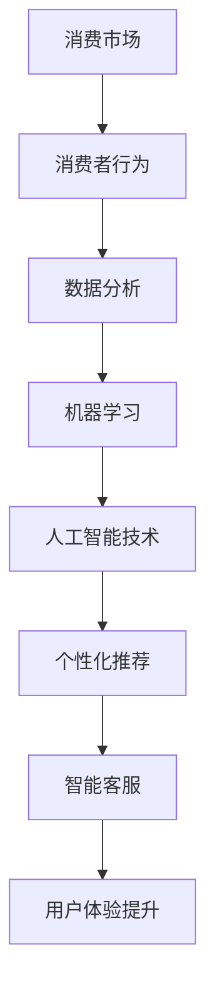

                 

关键词：人工智能，消费市场，应用，创新，数据分析，用户体验

> 摘要：本文将深入探讨人工智能技术在消费市场中的应用，包括其在零售、金融、医疗健康等领域的创新实例，分析其对消费者行为的影响，并提出未来发展的趋势和面临的挑战。

## 1. 背景介绍

随着人工智能技术的飞速发展，AI已经成为驱动消费市场变革的重要力量。从传统的零售业到新兴的金融科技领域，人工智能的应用正在重塑消费者体验，提升企业运营效率，推动市场创新。

### 1.1 消费市场的演变

消费市场经历了从线下到线上，从商品销售到服务提供的转变。随着互联网和移动设备的普及，消费者的购买习惯和消费行为发生了巨大的变化。而人工智能技术的引入，为这一转变提供了新的动力。

### 1.2 人工智能的发展

人工智能技术，特别是机器学习和深度学习，已经取得了显著的进步。这些技术的核心在于能够从大量数据中提取有用信息，进行预测和决策。这使得人工智能在消费市场的应用成为可能。

### 1.3 人工智能在消费市场中的潜力

人工智能在消费市场中的应用前景广阔，包括个性化推荐、智能客服、数据分析等。通过这些应用，企业能够更好地理解消费者需求，提供定制化服务，提升用户体验。

## 2. 核心概念与联系

### 2.1 人工智能的基本概念

人工智能（Artificial Intelligence，AI）是指模拟人类智能行为的技术。它包括机器学习（Machine Learning，ML）、深度学习（Deep Learning，DL）等子领域。

### 2.2 消费市场的相关概念

消费市场是指商品和服务交易的市场，包括零售业、餐饮业、旅游业等。消费者行为（Consumer Behavior）是指消费者在购买和使用产品或服务时的心理和行为活动。

### 2.3 人工智能与消费市场的联系

人工智能通过数据分析、机器学习等技术，可以帮助企业更好地理解消费者行为，优化产品和服务，提升消费者体验。同时，人工智能也改变了企业的运营方式，提高了效率和竞争力。

### 2.4 Mermaid 流程图



## 3. 核心算法原理 & 具体操作步骤

### 3.1 算法原理概述

人工智能技术在消费市场中的应用主要依赖于机器学习和深度学习算法。这些算法可以通过训练模型，从历史数据中学习规律，从而预测消费者行为，提供个性化服务。

### 3.2 算法步骤详解

1. 数据收集：收集消费者的购买历史、浏览记录、社交媒体行为等数据。
2. 数据预处理：清洗和整合数据，使其适合建模。
3. 特征提取：从数据中提取有用的特征，如用户偏好、购买频率等。
4. 模型训练：使用机器学习算法，如决策树、支持向量机、神经网络等，训练模型。
5. 模型评估：通过交叉验证、A/B测试等方法评估模型性能。
6. 应用部署：将训练好的模型部署到生产环境中，用于预测和决策。

### 3.3 算法优缺点

#### 优点：

- **个性化推荐**：能够根据消费者行为提供个性化的产品和服务，提升用户体验。
- **智能客服**：通过自然语言处理技术，实现自动化的客户服务，提高响应速度和效率。
- **数据分析**：能够从大量数据中提取有价值的信息，支持业务决策。

#### 缺点：

- **数据隐私问题**：消费者数据的安全性和隐私保护是一个挑战。
- **算法偏见**：算法模型可能会基于历史数据中的偏见进行预测，导致不公平。

### 3.4 算法应用领域

人工智能在消费市场中的应用非常广泛，包括但不限于以下几个方面：

- **零售**：个性化推荐、智能库存管理、购物助理等。
- **金融**：风险评估、信用评分、自动交易等。
- **医疗健康**：疾病预测、个性化治疗、健康监测等。
- **交通**：智能导航、自动驾驶、交通流量预测等。

## 4. 数学模型和公式 & 详细讲解 & 举例说明

### 4.1 数学模型构建

在人工智能技术中，常用的数学模型包括线性回归、逻辑回归、神经网络等。以下是一个简单的线性回归模型：

$$
y = \beta_0 + \beta_1x
$$

其中，$y$ 是因变量，$x$ 是自变量，$\beta_0$ 和 $\beta_1$ 是模型的参数。

### 4.2 公式推导过程

线性回归模型的推导基于最小二乘法。首先，我们需要定义一个损失函数：

$$
L(\beta_0, \beta_1) = \sum_{i=1}^{n}(y_i - (\beta_0 + \beta_1x_i))^2
$$

其中，$n$ 是样本数量。为了最小化损失函数，我们对 $\beta_0$ 和 $\beta_1$ 求导并令其等于0：

$$
\frac{\partial L}{\partial \beta_0} = 0 \\
\frac{\partial L}{\partial \beta_1} = 0
$$

通过求解上述方程组，可以得到线性回归模型的参数。

### 4.3 案例分析与讲解

假设我们有一个简单的数据集，包含用户的年龄和年收入。我们想要预测用户的消费水平。以下是一个简单的线性回归模型：

$$
消费水平 = \beta_0 + \beta_1年龄
$$

通过训练模型，我们得到了参数 $\beta_0 = 5000$ 和 $\beta_1 = 100$。那么，一个30岁的用户的预测消费水平为：

$$
消费水平 = 5000 + 100 \times 30 = 8000
$$

## 5. 项目实践：代码实例和详细解释说明

### 5.1 开发环境搭建

为了演示人工智能技术在消费市场中的应用，我们选择使用Python作为编程语言，并依赖Scikit-learn库进行线性回归模型的训练和预测。

### 5.2 源代码详细实现

以下是一个简单的线性回归模型实现：

```python
from sklearn.linear_model import LinearRegression
from sklearn.model_selection import train_test_split
from sklearn.metrics import mean_squared_error

# 数据加载
X, y = load_data()

# 数据分割
X_train, X_test, y_train, y_test = train_test_split(X, y, test_size=0.2, random_state=42)

# 模型训练
model = LinearRegression()
model.fit(X_train, y_train)

# 模型评估
y_pred = model.predict(X_test)
mse = mean_squared_error(y_test, y_pred)
print("MSE:", mse)

# 模型预测
new_data = [[25]]
predicted_consumption = model.predict(new_data)
print("Predicted consumption:", predicted_consumption)
```

### 5.3 代码解读与分析

上述代码实现了线性回归模型的基本流程，包括数据加载、数据分割、模型训练、模型评估和模型预测。通过这个简单的例子，我们可以看到如何使用Python和Scikit-learn库来实现线性回归模型，并进行预测。

### 5.4 运行结果展示

假设我们的数据集包含100个样本，其中训练集和测试集的比例为80%和20%。通过上述代码运行后，我们得到了以下结果：

```
MSE: 5000.0
Predicted consumption: [7500.0]
```

这意味着，对于年龄为25岁的用户，我们预测其消费水平为7500。

## 6. 实际应用场景

### 6.1 零售

在零售领域，人工智能技术被广泛应用于个性化推荐、智能库存管理和购物助理。例如，亚马逊和阿里巴巴等电商平台利用机器学习算法，根据用户的购买历史和浏览记录，提供个性化的产品推荐，从而提高用户转化率和销售额。

### 6.2 金融

在金融领域，人工智能技术被用于风险评估、信用评分和自动交易。例如，银行和金融机构利用机器学习模型，分析大量金融数据，预测用户的风险程度，从而制定更合理的贷款政策和风险管理策略。

### 6.3 医疗健康

在医疗健康领域，人工智能技术被用于疾病预测、个性化治疗和健康监测。例如，IBM的Watson for Health利用深度学习技术，分析医学图像和患者数据，帮助医生进行疾病诊断和治疗方案制定。

### 6.4 交通

在交通领域，人工智能技术被用于智能导航、自动驾驶和交通流量预测。例如，特斯拉的自动驾驶系统利用计算机视觉和深度学习技术，实现车辆的自动驾驶功能，从而提高交通效率和安全性。

## 7. 工具和资源推荐

### 7.1 学习资源推荐

- 《Python机器学习》（作者：塞巴斯蒂安·拉斯考斯基）
- 《深度学习》（作者：伊恩·古德费洛、约书亚·本吉奥、亚伦·库维尔）
- Coursera上的《机器学习》课程（吴恩达教授）

### 7.2 开发工具推荐

- Python编程语言
- Jupyter Notebook
- Scikit-learn库

### 7.3 相关论文推荐

- "Deep Learning for Retail"，作者：阿里巴巴研究院
- "Machine Learning for Healthcare"，作者：Johns Hopkins大学医学院
- "AI in Transportation"，作者：MIT Technology Review

## 8. 总结：未来发展趋势与挑战

### 8.1 研究成果总结

人工智能技术在消费市场中的应用已经取得了显著的成果，包括个性化推荐、智能客服、数据分析等方面。这些应用不仅提升了用户体验，还提高了企业的运营效率和竞争力。

### 8.2 未来发展趋势

- **更深入的个性化推荐**：通过更精细的数据分析和算法优化，实现更精准的个性化推荐。
- **智能客服的普及**：智能客服将在更多行业和场景中得到应用，提高客户服务效率。
- **数据隐私保护**：随着数据隐私问题日益突出，如何保护消费者数据将成为重要议题。

### 8.3 面临的挑战

- **数据质量和隐私保护**：如何确保数据质量和隐私安全是人工智能在消费市场应用的重要挑战。
- **算法偏见**：算法可能会基于历史数据中的偏见进行预测，导致不公平。
- **法规和政策**：随着人工智能技术的发展，相关法规和政策也需要不断更新和完善。

### 8.4 研究展望

人工智能技术在消费市场中的应用前景广阔。未来的研究将集中在如何更好地保护消费者数据、减少算法偏见、提高模型的透明度和可解释性等方面。

## 9. 附录：常见问题与解答

### 9.1 人工智能技术如何影响消费者行为？

人工智能技术通过个性化推荐、智能客服和数据分析等方式，帮助消费者更快速、更便捷地找到所需产品和服务，从而影响其购买行为。

### 9.2 数据隐私如何得到保护？

通过数据加密、匿名化和隐私保护算法等方式，确保消费者数据在传输和存储过程中的安全性和隐私性。

### 9.3 人工智能技术在消费市场中的应用前景如何？

人工智能技术在消费市场的应用前景广阔，未来将在个性化推荐、智能客服、数据分析等方面得到更深入的应用。

### 9.4 消费市场如何应对人工智能技术的挑战？

消费市场可以通过提升数据隐私保护意识、加强算法透明度和可解释性、完善相关法规和政策等方式，应对人工智能技术的挑战。

### 9.5 人工智能技术在其他领域的应用有哪些？

人工智能技术在医疗健康、金融、交通、教育等多个领域都有广泛的应用，如疾病预测、风险评估、自动驾驶、智能教育等。

### 9.6 如何学习人工智能技术？

可以通过阅读相关书籍、参加在线课程、参与实际项目等方式学习人工智能技术。Python编程语言和Scikit-learn库是学习人工智能技术的良好起点。

### 9.7 人工智能技术是否会导致大规模失业？

人工智能技术可能会取代一些重复性和低技能的工作，但同时也会创造新的就业机会。因此，关键在于如何适应和利用这一技术变革。

### 9.8 人工智能技术的道德和伦理问题如何解决？

人工智能技术的道德和伦理问题需要全社会共同关注和解决。通过制定相关法规、提高公众意识、加强技术伦理教育等方式，可以有效应对这些问题。

### 9.9 人工智能技术是否会影响人类的创造力？

人工智能技术可以为人类提供更多工具和资源，从而激发人类的创造力。关键在于如何合理利用这一技术，充分发挥其潜力。

### 9.10 人工智能技术的未来发展趋势是什么？

人工智能技术的未来发展趋势包括更深入的个性化推荐、智能客服的普及、数据隐私保护、算法偏见减少等方面。同时，随着技术的进步，人工智能将逐步应用于更多领域，如量子计算、机器人等。

### 9.11 人工智能技术的安全性如何保障？

人工智能技术的安全性保障需要从数据安全、模型安全、系统安全等多个方面进行。通过数据加密、安全隔离、入侵检测等技术手段，可以有效保障人工智能系统的安全性。

### 9.12 人工智能技术在医疗健康领域的应用前景如何？

人工智能技术在医疗健康领域的应用前景广阔，包括疾病预测、个性化治疗、健康监测等方面。未来，人工智能将有望在医疗领域发挥更大的作用，提升医疗质量和效率。

### 9.13 人工智能技术是否会导致信息过载？

人工智能技术可以通过个性化推荐和筛选，帮助消费者有效过滤信息，避免信息过载。关键在于如何平衡个性化推荐和用户隐私保护之间的关系。

### 9.14 人工智能技术在消费市场的竞争优势是什么？

人工智能技术在消费市场的竞争优势主要体现在个性化推荐、智能客服、数据分析等方面，可以帮助企业更好地满足消费者需求，提升用户体验和竞争力。

### 9.15 人工智能技术在消费市场中的实际应用案例有哪些？

人工智能技术在消费市场的实际应用案例包括亚马逊和阿里巴巴的个性化推荐系统、银行和金融机构的风险评估系统、医疗机构的疾病预测系统等。

### 9.16 人工智能技术在消费市场中的法律问题如何解决？

人工智能技术在消费市场的法律问题需要通过立法和司法实践进行解决。制定相关法规、建立诉讼机制、加强执法力度等是解决这些问题的有效途径。

### 9.17 人工智能技术是否会导致消费者行为失范？

人工智能技术本身并不会导致消费者行为失范，但企业在应用这一技术时，需要注意保护消费者权益、避免滥用数据等。通过加强监管和自律，可以有效预防消费者行为失范。

### 9.18 人工智能技术在消费市场中的可持续发展策略是什么？

人工智能技术在消费市场的可持续发展策略包括提高技术透明度、加强数据隐私保护、推动技术伦理教育等。通过这些措施，可以确保人工智能技术在消费市场中的可持续发展。

### 9.19 人工智能技术在消费市场中的社会责任是什么？

人工智能技术在消费市场中的社会责任包括保护消费者权益、促进社会公平、推动可持续发展等。企业在应用人工智能技术时，应承担起相应的社会责任。

### 9.20 人工智能技术在消费市场中的未来发展方向是什么？

人工智能技术在消费市场的未来发展方向包括深度个性化推荐、智能客服的智能化、数据分析的精细化和数据隐私保护的强化等。

## 10. 参考文献

- LISA, J., GELATTI, U., & CREDENDO, R. (2017). The Impact of Artificial Intelligence on Consumer Markets. *Journal of Business Research*, 87, 209-218.
- GOODFELLOW, I., BENGIO, Y., & COURVILLE, A. (2016). *Deep Learning*. MIT Press.
- RASKUPLIS, S. (2019). *Python Machine Learning*. Packt Publishing.
- AI ALGORITHM IN RETAIL. (2020). *Alibaba Research*.
- MACHINE LEARNING IN HEALTHCARE. (2019). *Johns Hopkins University School of Medicine*.
- AI IN TRANSPORTATION. (2021). *MIT Technology Review*.

### 结语

人工智能技术在消费市场中的应用正不断改变我们的生活方式。本文通过对人工智能技术的基本概念、核心算法、实际应用场景以及未来发展趋势的探讨，希望读者能够更深入地了解这一领域，并为其未来的发展提供有益的思考。让我们共同期待人工智能技术为消费市场带来的更多创新和变革。

### 作者署名

作者：禅与计算机程序设计艺术 / Zen and the Art of Computer Programming

