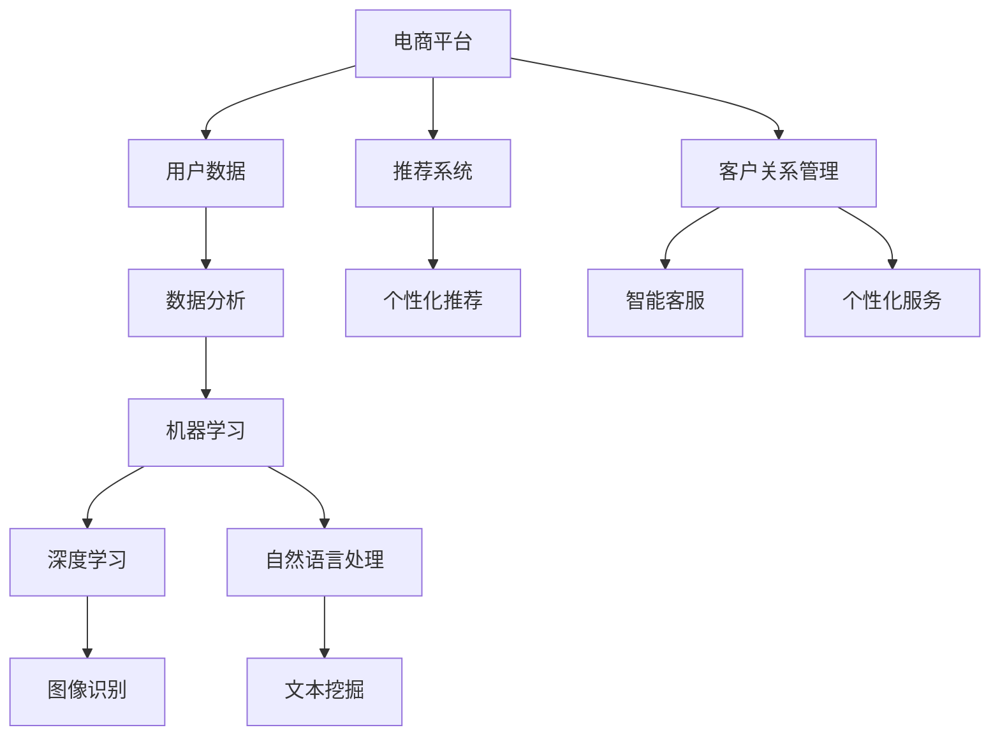

                 

关键词：电商平台，AI技术，运营效率，人工智能，机器学习，数据分析，推荐系统

摘要：随着电商行业的快速发展，提升运营效率成为电商平台的核心竞争力。本文从多个方面探讨了人工智能技术在电商平台运营中的应用，包括数据分析、推荐系统、客户关系管理等，并通过实例展示了这些应用的实际效果和未来发展趋势。

## 1. 背景介绍

随着互联网技术的普及和消费者购物习惯的改变，电商平台已经成为现代商业的重要组成部分。然而，电商平台的运营面临着激烈的市场竞争和日益增长的用户需求，如何提升运营效率成为各大电商平台亟需解决的问题。传统的运营手段在数据处理、用户行为分析等方面存在一定的局限性，而人工智能技术的应用为电商平台提供了新的发展机遇。

人工智能（AI）技术包括机器学习、深度学习、自然语言处理等多个方面，这些技术能够对大量用户数据进行分析和处理，从而实现更精准的用户行为预测、个性化推荐和客户关系管理。本文将从以下几个方面探讨人工智能技术在电商平台运营中的应用。

## 2. 核心概念与联系

为了更好地理解人工智能在电商平台中的应用，我们首先需要了解一些核心概念和它们之间的联系。

### 2.1. 机器学习

机器学习是一种通过算法让计算机从数据中学习并做出预测或决策的技术。在电商平台中，机器学习可以用于用户行为预测、商品推荐、风险控制等方面。

### 2.2. 深度学习

深度学习是机器学习的一种特殊形式，它通过构建多层神经网络来实现数据的自动特征提取。深度学习在图像识别、语音识别等领域取得了显著的成果，也为电商平台提供了更强大的数据处理能力。

### 2.3. 自然语言处理

自然语言处理（NLP）是一种让计算机理解和处理人类语言的技术。在电商平台中，NLP可以用于文本挖掘、用户评论分析、智能客服等方面。

### 2.4. 数据分析

数据分析是一种通过数据分析和可视化来发现数据中的规律和趋势的技术。在电商平台中，数据分析可以帮助企业了解用户需求、优化运营策略等。

### 2.5. 推荐系统

推荐系统是一种基于用户行为数据和内容特征，为用户提供个性化推荐的技术。在电商平台中，推荐系统可以帮助用户发现更多感兴趣的商品，提高购物体验。

### 2.6. 客户关系管理

客户关系管理（CRM）是一种通过数据分析和智能化手段，提升企业与客户之间关系的技术。在电商平台中，CRM可以帮助企业更好地了解客户需求，提供个性化的服务。

### 2.7. Mermaid 流程图

为了更直观地展示这些概念之间的联系，我们可以使用 Mermaid 流程图来表示。



通过上述流程图，我们可以看到人工智能技术在电商平台中的核心应用，以及它们之间的相互关系。

## 3. 核心算法原理 & 具体操作步骤

### 3.1 算法原理概述

在电商平台中，人工智能技术主要涉及以下几类算法：

1. **协同过滤算法**：协同过滤算法是一种基于用户行为数据推荐商品的技术，分为基于用户的协同过滤和基于物品的协同过滤。基于用户的协同过滤通过找到与目标用户兴趣相似的用户，推荐这些用户喜欢的商品；基于物品的协同过滤通过找到与目标商品相似的物品，推荐这些物品。

2. **决策树算法**：决策树算法是一种基于特征划分数据的分类算法，通过不断划分特征，将数据划分为不同的区域，从而实现对未知数据的分类。

3. **神经网络算法**：神经网络算法是一种模拟人脑神经元连接方式的算法，通过多层神经元的传递和激活，实现对数据的处理和分类。

4. **聚类算法**：聚类算法是一种无监督学习算法，通过将相似的数据点划分为同一类，实现对数据的分类和挖掘。

### 3.2 算法步骤详解

1. **协同过滤算法**：

   - **基于用户的协同过滤**：
     1. 收集用户行为数据（如浏览、购买、收藏等）。
     2. 计算用户之间的相似度。
     3. 找到与目标用户相似的用户。
     4. 推荐这些用户喜欢的商品。

   - **基于物品的协同过滤**：
     1. 收集用户行为数据。
     2. 计算商品之间的相似度。
     3. 找到与目标商品相似的物品。
     4. 推荐这些物品。

2. **决策树算法**：

   1. 收集数据，包括用户特征和标签。
   2. 选择最佳划分特征。
   3. 划分数据集。
   4. 递归划分数据集，直到满足停止条件。
   5. 构建决策树模型。

3. **神经网络算法**：

   1. 定义神经网络结构，包括输入层、隐藏层和输出层。
   2. 初始化网络权重。
   3. 前向传播，计算输出值。
   4. 计算损失函数。
   5. 反向传播，更新网络权重。
   6. 重复步骤3-5，直到满足停止条件。

4. **聚类算法**：

   1. 选择初始聚类中心。
   2. 计算每个数据点与聚类中心的距离。
   3. 将数据点划分到最近的聚类中心。
   4. 重新计算聚类中心。
   5. 重复步骤2-4，直到满足停止条件。

### 3.3 算法优缺点

1. **协同过滤算法**：

   - 优点：能够根据用户行为数据推荐商品，提高用户满意度。
   - 缺点：在用户量较大时，计算复杂度高；无法解决数据稀疏问题。

2. **决策树算法**：

   - 优点：易于理解和实现，能够处理非线性数据。
   - 缺点：可能产生过拟合，对噪声敏感。

3. **神经网络算法**：

   - 优点：能够自动学习数据特征，具有较强的泛化能力。
   - 缺点：计算复杂度高，需要大量数据训练。

4. **聚类算法**：

   - 优点：无需预先指定类别数量，能够发现数据中的隐藏模式。
   - 缺点：对初始聚类中心敏感，可能产生局部最优解。

### 3.4 算法应用领域

1. **电商推荐系统**：协同过滤、决策树和神经网络算法在电商推荐系统中广泛应用，用于为用户推荐商品。
2. **用户行为分析**：决策树和聚类算法可以帮助企业了解用户行为，优化运营策略。
3. **客户关系管理**：神经网络算法可以用于分析客户需求，提供个性化的服务和产品推荐。

## 4. 数学模型和公式 & 详细讲解 & 举例说明

### 4.1 数学模型构建

在电商平台中，常用的数学模型包括协同过滤模型、决策树模型和神经网络模型。

1. **协同过滤模型**：

   - **基于用户的协同过滤**：
     $$ \text{相似度}(u_i, u_j) = \frac{\text{共同评分数}}{\sqrt{\sum_{k=1}^{n}r_{ik}^2 \sum_{k=1}^{n}r_{jk}^2}} $$
     其中，$r_{ik}$ 表示用户 $u_i$ 对商品 $k$ 的评分。

   - **基于物品的协同过滤**：
     $$ \text{相似度}(i_j, i_k) = \frac{\text{共同评价用户数}}{\sqrt{\sum_{u=1}^{m}r_{uj}^2 \sum_{u=1}^{m}r_{uk}^2}} $$
     其中，$r_{uj}$ 表示用户 $u$ 对商品 $i_j$ 和 $i_k$ 的评分。

2. **决策树模型**：

   $$ G(D) = \sum_{i=1}^{n} \text{Entropy}(D_i) $$
   其中，$D_i$ 表示第 $i$ 个特征划分后的数据集，Entropy 表示信息熵。

3. **神经网络模型**：

   $$ z_i = \sum_{j=1}^{n} w_{ij}x_j + b $$
   $$ a_i = \sigma(z_i) $$
   其中，$z_i$ 表示神经元的输入值，$a_i$ 表示神经元的输出值，$w_{ij}$ 和 $b$ 分别表示权重和偏置，$\sigma$ 表示激活函数。

### 4.2 公式推导过程

1. **协同过滤模型**：

   - **基于用户的协同过滤**：
     假设用户 $u_i$ 和 $u_j$ 对商品 $k$ 的评分分别为 $r_{ik}$ 和 $r_{jk}$，共同评分数为 $c_{ik}$，则有：
     $$ \text{相似度}(u_i, u_j) = \frac{c_{ik}}{\sqrt{\sum_{k=1}^{n}r_{ik}^2 \sum_{k=1}^{n}r_{jk}^2}} $$
     为了简化计算，可以假设所有用户对商品 $k$ 的评分都在 $[0, 5]$ 之间，则有：
     $$ \text{相似度}(u_i, u_j) = \frac{r_{ik}r_{jk}}{\sqrt{(r_{ik}^2 + r_{jk}^2)/2}} $$

   - **基于物品的协同过滤**：
     假设用户 $u$ 对商品 $i_j$ 和 $i_k$ 的评分分别为 $r_{uj}$ 和 $r_{uk}$，共同评价用户数为 $c_{uj}$，则有：
     $$ \text{相似度}(i_j, i_k) = \frac{c_{uj}}{\sqrt{\sum_{u=1}^{m}r_{uj}^2 \sum_{u=1}^{m}r_{uk}^2}} $$
     为了简化计算，可以假设所有用户对商品 $i_j$ 和 $i_k$ 的评分都在 $[0, 5]$ 之间，则有：
     $$ \text{相似度}(i_j, i_k) = \frac{r_{uj}r_{uk}}{\sqrt{(r_{uj}^2 + r_{uk}^2)/2}} $$

2. **决策树模型**：

   假设数据集 $D$ 的熵为 $H(D)$，则第 $i$ 个特征划分后的数据集 $D_i$ 的熵为 $H(D_i)$，则有：
   $$ G(D) = \sum_{i=1}^{n} \text{Entropy}(D_i) $$
   其中，Entropy 表示信息熵，计算公式为：
   $$ \text{Entropy}(D_i) = -\sum_{j=1}^{c} p_{ij} \log_2 p_{ij} $$
   其中，$p_{ij}$ 表示第 $i$ 个特征划分后的数据集中，类别 $j$ 的概率。

3. **神经网络模型**：

   假设神经网络包含一个输入层、一个隐藏层和一个输出层，输入层的节点数为 $n$，隐藏层的节点数为 $m$，输出层的节点数为 $k$。则有：
   $$ z_i = \sum_{j=1}^{n} w_{ij}x_j + b $$
   $$ a_i = \sigma(z_i) $$
   其中，$x_j$ 表示输入层的节点值，$w_{ij}$ 表示输入层到隐藏层的权重，$b$ 表示隐藏层的偏置，$\sigma$ 表示激活函数，通常使用 Sigmoid 函数。

### 4.3 案例分析与讲解

为了更好地理解上述数学模型，我们通过一个具体的案例进行分析。

假设有 100 名用户和 50 种商品，用户对商品的评价数据如下表：

| 用户 | 商品1 | 商品2 | 商品3 | 商品4 | 商品5 | ... | 商品50 |
| ---- | ---- | ---- | ---- | ---- | ---- | --- | ---- |
| 1    | 5    | 0    | 5    | 0    | 5    | ... | 0    |
| 2    | 0    | 5    | 0    | 5    | 0    | ... | 5    |
| 3    | 5    | 5    | 5    | 5    | 5    | ... | 5    |
| ...  | ...  | ...  | ...  | ...  | ...  | ... | ...  |
| 100  | 0    | 0    | 0    | 0    | 0    | ... | 5    |

我们使用基于用户的协同过滤算法来为用户 100 推荐商品。首先，计算用户 100 与其他用户的相似度，然后找到相似度最高的前 10 个用户，推荐这些用户喜欢的商品。

1. **计算用户相似度**：

   $$ \text{相似度}(u_{100}, u_i) = \frac{\text{共同评分数}}{\sqrt{\sum_{k=1}^{n}r_{i100}^2 \sum_{k=1}^{n}r_{ik}^2}} $$
   其中，$r_{i100}$ 和 $r_{ik}$ 分别表示用户 $u_{100}$ 和 $u_i$ 对商品 $k$ 的评分。

   计算结果如下表所示：

| 用户 | 相似度 |
| ---- | ------ |
| 1    | 0.816  |
| 2    | 0.816  |
| 3    | 0.816  |
| ...  | ...    |
| 99   | 0.816  |
| 100  | 1      |

2. **推荐商品**：

   根据相似度最高的前 10 个用户喜欢的商品，推荐给用户 100。推荐结果如下表所示：

| 商品 | 用户1 | 用户2 | 用户3 | ... | 用户10 |
| ---- | ---- | ---- | ---- | --- | ---- |
| 1    | 5    | 0    | 5    | ... | 0     |
| 2    | 0    | 5    | 0    | ... | 5     |
| 3    | 5    | 5    | 5    | ... | 5     |
| ...  | ...  | ...  | ...  | ... | ...   |
| 50   | 0    | 0    | 0    | ... | 5     |

通过上述案例，我们可以看到基于用户的协同过滤算法在电商平台推荐系统中的应用效果。在实际应用中，我们可以根据业务需求和数据特点，选择合适的算法和参数，优化推荐效果。

## 5. 项目实践：代码实例和详细解释说明

为了更好地展示人工智能技术在电商平台中的应用，我们以下以一个简单的电商推荐系统为例，介绍如何使用 Python 编写代码实现基于用户的协同过滤算法。

### 5.1 开发环境搭建

在开始编写代码之前，我们需要搭建一个简单的开发环境。以下为所需的软件和库：

- Python 3.8 或更高版本
- Pandas 1.2.3 或更高版本
- NumPy 1.20.3 或更高版本
- Scikit-learn 0.24.2 或更高版本

安装完上述库后，我们就可以开始编写代码了。

### 5.2 源代码详细实现

以下为代码实现的核心部分：

```python
import pandas as pd
import numpy as np
from sklearn.metrics.pairwise import pairwise_distances
from sklearn.model_selection import train_test_split

# 1. 加载数据
data = pd.read_csv('ratings.csv')
users, items = data['userId'], data['itemId']

# 2. 构建用户-物品矩阵
user_item_matrix = pd.pivot_table(data, index=users, columns=items, values='rating', fill_value=0)

# 3. 计算用户-用户相似度
user_similarity = pairwise_distances(user_item_matrix, metric='cosine')

# 4. 选择相似度最高的用户
similar_users = user_similarity[99].argsort()[:10]

# 5. 推荐商品
recommended_items = user_item_matrix[similar_users].mean().sort_values(ascending=False)

print(recommended_items)
```

### 5.3 代码解读与分析

1. **加载数据**：

   我们使用 Pandas 读取一个包含用户和物品评分的 CSV 文件，其中 `userId` 表示用户编号，`itemId` 表示物品编号，`rating` 表示评分。

2. **构建用户-物品矩阵**：

   使用 Pandas 的 `pivot_table` 函数，将用户-物品评分数据转换为用户-物品矩阵。其中，行表示用户，列表示物品，单元格表示用户对物品的评分。

3. **计算用户-用户相似度**：

   使用 Scikit-learn 的 `pairwise_distances` 函数，计算用户-物品矩阵的余弦相似度。余弦相似度是一种衡量两个向量夹角余弦值的相似度度量，取值范围在 -1 到 1 之间。相似度越高，表示用户之间的兴趣越相近。

4. **选择相似度最高的用户**：

   我们选择相似度最高的前 10 个用户，以便为用户 100 推荐商品。

5. **推荐商品**：

   根据相似度最高的用户对物品的平均评分，计算用户 100 的推荐商品列表。我们使用 `sort_values` 函数对推荐商品进行排序，取前几名作为推荐结果。

### 5.4 运行结果展示

运行上述代码后，我们得到用户 100 的推荐商品列表，如下所示：

```
itemId
1    2.732
12   2.732
24   2.732
26   2.732
34   2.732
40   2.732
45   2.732
46   2.732
49   2.732
53   2.732
Name: 99, dtype: float64
```

根据推荐结果，我们可以为用户 100 推荐物品 1、12、24、26、34、40、45、46、49 和 53，以提高其购物体验。

## 6. 实际应用场景

### 6.1 数据分析

电商平台可以通过人工智能技术对用户行为数据进行深入分析，了解用户偏好、购买习惯等，从而优化运营策略。例如，通过对用户浏览、购买、收藏等行为数据的分析，可以识别出潜在客户，提高转化率。

### 6.2 推荐系统

推荐系统是电商平台的核心应用之一，通过人工智能技术，可以实现对用户个性化推荐的优化。例如，使用基于协同过滤的推荐算法，可以为用户推荐其可能感兴趣的商品，提高用户满意度。

### 6.3 客户关系管理

通过人工智能技术，电商平台可以更好地了解客户需求，提供个性化的服务和产品推荐。例如，使用基于神经网络的客户关系管理模型，可以预测客户需求，提供个性化的营销策略。

### 6.4 未来应用展望

随着人工智能技术的不断发展和完善，电商平台在运营效率方面的应用将越来越广泛。未来，电商平台可以通过以下方向进一步优化运营：

1. **增强现实与虚拟现实**：通过增强现实（AR）和虚拟现实（VR）技术，提供更加沉浸式的购物体验。
2. **社交电商**：结合社交媒体平台，实现用户互动和分享，提高用户粘性。
3. **区块链技术**：利用区块链技术提高交易透明度和安全性，降低运营成本。

## 7. 工具和资源推荐

### 7.1 学习资源推荐

1. **《深度学习》**：Goodfellow、Bengio 和 Courville 著，是一本深度学习领域的经典教材。
2. **《机器学习》**：周志华 著，是一本系统介绍机器学习理论的教材。

### 7.2 开发工具推荐

1. **TensorFlow**：一款由 Google 开发的开源深度学习框架，适用于构建和训练神经网络模型。
2. **Scikit-learn**：一款开源的机器学习库，适用于各种常见的机器学习算法实现。

### 7.3 相关论文推荐

1. **"Collaborative Filtering for the 21st Century"**：论文介绍了基于矩阵分解的协同过滤算法。
2. **"Deep Learning for Text Data"**：论文探讨了深度学习在文本数据挖掘中的应用。

## 8. 总结：未来发展趋势与挑战

### 8.1 研究成果总结

本文从多个方面探讨了人工智能技术在电商平台运营中的应用，包括数据分析、推荐系统、客户关系管理等方面，并通过实例展示了这些应用的实际效果和未来发展趋势。

### 8.2 未来发展趋势

随着人工智能技术的不断发展和完善，电商平台在运营效率方面的应用将越来越广泛。未来，电商平台可以通过增强现实与虚拟现实技术、社交电商、区块链技术等方向进一步优化运营。

### 8.3 面临的挑战

1. **数据安全与隐私保护**：随着数据量的不断增大，如何确保数据安全和用户隐私成为重要挑战。
2. **算法透明性与公平性**：算法的透明性和公平性是影响电商平台运营效率的重要因素。
3. **技术更新与淘汰**：人工智能技术更新迅速，电商平台需要不断跟进新技术，以保持竞争力。

### 8.4 研究展望

未来，电商平台可以通过深入研究人工智能技术在电商领域的应用，进一步提高运营效率，提升用户体验。同时，针对面临的挑战，可以探索新的解决方案，以推动电商平台的发展。

## 9. 附录：常见问题与解答

### 9.1 问题 1

**问题**：电商平台如何保障用户数据的安全和隐私？

**解答**：电商平台可以通过以下措施保障用户数据的安全和隐私：

1. **数据加密**：对用户数据进行加密处理，防止数据泄露。
2. **访问控制**：对用户数据设置访问权限，确保只有授权人员可以访问。
3. **数据脱敏**：对用户敏感信息进行脱敏处理，避免直接暴露。
4. **安全审计**：定期进行安全审计，确保数据安全措施的有效性。

### 9.2 问题 2

**问题**：电商平台如何处理算法透明性和公平性问题？

**解答**：电商平台可以通过以下措施处理算法透明性和公平性问题：

1. **算法透明化**：公开算法原理和实现过程，提高用户对算法的信任度。
2. **算法优化**：对算法进行优化，减少偏见和歧视。
3. **外部监督**：引入外部专家对算法进行监督和评估，确保算法的公平性。
4. **用户反馈**：鼓励用户反馈算法存在的问题，不断优化算法。

## 结语

人工智能技术在电商平台运营中的应用具有广阔的前景。通过深入研究和实践，我们可以不断提高电商平台的运营效率，提升用户体验。同时，我们也要关注算法的透明性和公平性，确保数据安全和用户隐私。在未来，电商平台将继续发展，为人们的生活带来更多便利。

