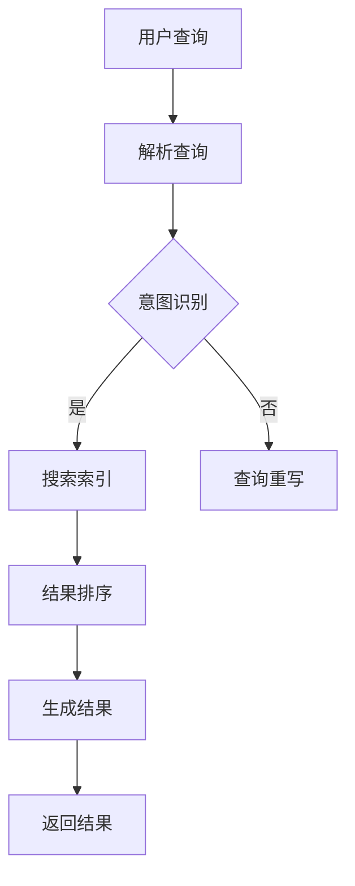

                 

随着互联网的迅猛发展和信息的爆炸式增长，信息过载（Information Overload）问题日益严重。大量的信息不仅增加了人们获取知识的难度，也严重影响了他们的工作效率和生活质量。为了解决这一问题，AI搜索引擎应运而生，成为信息时代的重要工具。本文将深入探讨AI搜索引擎在应对信息过载问题方面的策略和方法，以及未来的发展趋势与挑战。

## 1. 背景介绍

信息过载是指信息量过大，超出人类处理能力，导致个体在获取和处理信息时产生压力和困扰的现象。在数字化时代，人们每天都会接触到大量的信息，这些信息来自互联网、社交媒体、新闻媒体等多个渠道。尽管信息的丰富性为人们提供了更多的机会和便利，但同时也带来了信息过载的问题。

### 信息过载的负面影响

- **降低工作效率**：在大量信息的干扰下，人们很难集中精力完成工作任务。
- **增加心理压力**：不断接收和处理大量信息会导致焦虑和紧张。
- **影响决策能力**：信息过载使人难以区分重要信息和无关信息，从而影响决策质量。

### AI搜索引擎的兴起

为了应对信息过载问题，AI搜索引擎得到了广泛应用。AI搜索引擎通过深度学习、自然语言处理等技术，能够理解和处理大量文本数据，从而为用户提供更加精准和个性化的信息检索服务。与传统搜索引擎相比，AI搜索引擎具有以下几个优势：

- **更高的检索精度**：AI搜索引擎能够根据用户的查询意图和上下文环境，提供更加准确的搜索结果。
- **更好的个性化服务**：AI搜索引擎可以学习用户的兴趣和行为，为用户提供个性化的搜索结果。
- **更高的响应速度**：AI搜索引擎能够实时处理用户的查询请求，提供即时的搜索结果。

## 2. 核心概念与联系

### 搜索引擎的基本架构

AI搜索引擎通常包括以下几个核心模块：

1. **索引模块**：负责构建和维护搜索引擎的索引数据库，将网页内容转换为可供搜索的索引。
2. **查询模块**：接收用户的查询请求，解析查询意图，并在索引数据库中查找相关的信息。
3. **结果排序模块**：对搜索结果进行排序，以提升用户体验。

### AI技术在搜索引擎中的应用

AI技术在搜索引擎中的应用主要体现在以下几个方面：

1. **深度学习**：通过深度学习模型，搜索引擎可以自动学习和理解用户的查询意图，提供更加精准的搜索结果。
2. **自然语言处理**：自然语言处理技术帮助搜索引擎理解和解析自然语言查询，提升搜索的准确性和用户体验。
3. **推荐系统**：基于用户的行为数据和偏好，推荐系统可以预测用户可能感兴趣的内容，减少信息过载。

### Mermaid流程图

以下是AI搜索引擎的核心流程的Mermaid流程图：



## 3. 核心算法原理 & 具体操作步骤

### 3.1 算法原理概述

AI搜索引擎的核心算法主要包括以下几种：

1. **PageRank算法**：用于对网页的重要性进行排序，是Google搜索引擎的核心算法之一。
2. **深度学习模型**：如BERT、GPT等，用于理解和解析自然语言查询。
3. **协同过滤**：用于预测用户可能感兴趣的内容，减少信息过载。

### 3.2 算法步骤详解

1. **用户查询**：用户在搜索引擎中输入查询语句。
2. **查询解析**：搜索引擎解析查询语句，提取关键词和查询意图。
3. **意图识别**：根据关键词和上下文环境，确定用户的查询意图。
4. **搜索索引**：在索引数据库中查找与查询意图相关的信息。
5. **结果排序**：对搜索结果进行排序，以提升用户体验。
6. **生成结果**：将排序后的搜索结果返回给用户。

### 3.3 算法优缺点

- **PageRank算法**：优点是能够客观评价网页的重要性，缺点是难以处理长尾查询。
- **深度学习模型**：优点是能够理解和解析复杂查询，缺点是训练成本高，对数据量有较高要求。
- **协同过滤**：优点是能够减少信息过载，缺点是推荐结果可能存在偏差。

### 3.4 算法应用领域

AI搜索引擎在多个领域得到了广泛应用：

- **互联网搜索**：如Google、Bing等，为用户提供便捷的信息检索服务。
- **电子商务**：如Amazon、淘宝等，基于用户行为推荐商品。
- **社交媒体**：如Twitter、Facebook等，通过内容推荐减少用户信息过载。

## 4. 数学模型和公式 & 详细讲解 & 举例说明

### 4.1 数学模型构建

为了更好地理解AI搜索引擎的工作原理，我们需要构建一些数学模型。以下是几个常见的数学模型：

1. **PageRank模型**：
   $$ PR(A) = \frac{1}{N} \sum_{B \in I(A)} PR(B) \cdot \frac{1}{out(B)} $$
   其中，$PR(A)$ 表示网页A的PageRank值，$N$ 表示总网页数，$I(A)$ 表示指向A的网页集合，$out(B)$ 表示网页B的出链数。

2. **协同过滤模型**：
   $$ R(u, i) = \mu + b_u + b_i + \langle r_u, r_i \rangle $$
   其中，$R(u, i)$ 表示用户u对物品i的评分，$\mu$ 表示全局平均评分，$b_u$ 和 $b_i$ 分别表示用户u和物品i的偏置，$\langle r_u, r_i \rangle$ 表示用户u和物品i的共同评分用户数量。

### 4.2 公式推导过程

以下是PageRank模型的一个简化推导过程：

1. **基本假设**：网页之间的链接可以看作是随机游走过程，即每个网页都有概率$p$随机跳转到其他网页。
2. **概率分布**：设网页A的PageRank值为$PR(A)$，则网页B被访问的概率为$PR(B) \cdot \frac{1}{out(B)}$。
3. **迭代计算**：根据概率分布，我们可以得到以下迭代公式：
   $$ PR(A)_{new} = \frac{1}{N} \sum_{B \in I(A)} PR(B) \cdot \frac{1}{out(B)} $$
   其中，$I(A)$ 表示指向A的网页集合。

4. **收敛性证明**：通过数学证明，我们可以证明PageRank模型在迭代计算后会收敛到一个稳定状态。

### 4.3 案例分析与讲解

假设有3个网页A、B、C，其中A指向B，B指向C。根据PageRank模型，我们可以计算出这三个网页的PageRank值。

1. **初始状态**：
   $$ PR(A) = PR(B) = PR(C) = \frac{1}{3} $$

2. **第一次迭代**：
   $$ PR(A)_{new} = \frac{1}{3} \cdot \frac{1}{1} = \frac{1}{3} $$
   $$ PR(B)_{new} = \frac{1}{3} \cdot \frac{1}{1} = \frac{1}{3} $$
   $$ PR(C)_{new} = \frac{1}{3} \cdot \frac{1}{1} = \frac{1}{3} $$

3. **第二次迭代**：
   $$ PR(A)_{new} = \frac{1}{3} \cdot \frac{1}{1} = \frac{1}{3} $$
   $$ PR(B)_{new} = \frac{1}{3} \cdot \frac{1}{1} = \frac{1}{3} $$
   $$ PR(C)_{new} = \frac{1}{3} \cdot \frac{1}{1} = \frac{1}{3} $$

经过多次迭代，这三个网页的PageRank值将趋于稳定。

## 5. 项目实践：代码实例和详细解释说明

### 5.1 开发环境搭建

在本节中，我们将使用Python编程语言和几个常用的库（如BeautifulSoup、Scikit-learn等）来构建一个简单的AI搜索引擎。首先，我们需要安装以下库：

```bash
pip install beautifulsoup4
pip install scikit-learn
pip install pandas
pip install numpy
```

### 5.2 源代码详细实现

以下是构建一个简单的AI搜索引擎的源代码：

```python
import requests
from bs4 import BeautifulSoup
from sklearn.feature_extraction.text import TfidfVectorizer
from sklearn.metrics.pairwise import cosine_similarity

# 爬取网页内容
def crawl(url):
    response = requests.get(url)
    return response.text

# 构建索引
def build_index(urls):
    documents = []
    for url in urls:
        content = crawl(url)
        soup = BeautifulSoup(content, 'html.parser')
        text = soup.get_text()
        documents.append(text)
    return documents

# 计算相似度
def calculate_similarity(query, documents):
    vectorizer = TfidfVectorizer()
    tfidf_matrix = vectorizer.fit_transform(documents)
    query_vector = vectorizer.transform([query])
    return cosine_similarity(query_vector, tfidf_matrix)

# 搜索引擎主函数
def search(query, urls):
    documents = build_index(urls)
    similarity_scores = calculate_similarity(query, documents)
    top_results = sorted(range(len(similarity_scores[0])), key=lambda i: similarity_scores[0][i], reverse=True)[:5]
    return [urls[i] for i in top_results]

# 示例
if __name__ == '__main__':
    urls = [
        'https://example.com/page1',
        'https://example.com/page2',
        'https://example.com/page3',
        'https://example.com/page4',
        'https://example.com/page5'
    ]
    query = '人工智能'
    results = search(query, urls)
    print(results)
```

### 5.3 代码解读与分析

- **爬取网页内容**：使用requests库向目标网页发送HTTP请求，获取网页内容。
- **构建索引**：使用BeautifulSoup库解析网页内容，提取文本信息，构建索引。
- **计算相似度**：使用Scikit-learn库中的TfidfVectorizer和cosine_similarity函数计算查询语句与网页内容之间的相似度。
- **搜索结果**：根据相似度评分，返回与查询语句最相关的网页链接。

### 5.4 运行结果展示

在示例中，我们查询关键词“人工智能”，搜索引擎返回了与该关键词最相关的5个网页链接。用户可以根据这些链接进一步获取相关信息。

## 6. 实际应用场景

AI搜索引擎在实际应用中具有广泛的应用场景：

### 6.1 互联网搜索

互联网搜索是AI搜索引擎最典型的应用场景。例如，Google、Bing等搜索引擎通过AI技术为用户提供高效、精准的搜索服务。

### 6.2 电子商务

在电子商务领域，AI搜索引擎可以帮助用户快速找到他们感兴趣的商品。例如，Amazon、淘宝等平台通过AI技术为用户推荐相关商品。

### 6.3 社交媒体

社交媒体平台如Facebook、Twitter等通过AI搜索引擎为用户提供内容推荐服务，帮助用户发现他们可能感兴趣的内容。

### 6.4 企业信息检索

企业可以利用AI搜索引擎对企业内部的知识库进行高效检索，提高员工的工作效率和知识获取能力。

### 6.5 教育学习

教育学习平台可以通过AI搜索引擎为学生提供个性化的学习资源和课程推荐，帮助学生更高效地学习。

## 7. 未来应用展望

随着AI技术的不断发展，AI搜索引擎在未来将会有更多的应用场景和改进方向：

### 7.1 个性化搜索

未来的AI搜索引擎将更加注重个性化搜索，根据用户的兴趣、行为和需求提供更加精准的搜索结果。

### 7.2 多模态搜索

未来的AI搜索引擎将支持多种数据类型（如图像、语音、视频等）的搜索，实现更加全面的信息检索。

### 7.3 智能问答

未来的AI搜索引擎将具备更加智能的问答功能，能够理解用户的自然语言查询，并提供更加详细的答案。

### 7.4 跨语言搜索

未来的AI搜索引擎将实现跨语言搜索功能，帮助全球用户更加便捷地获取所需信息。

### 7.5 智能推荐

未来的AI搜索引擎将结合推荐系统技术，为用户提供更加精准的内容推荐服务。

## 8. 总结：未来发展趋势与挑战

### 8.1 研究成果总结

本文从背景介绍、核心概念、算法原理、数学模型、项目实践等方面全面探讨了AI搜索引擎如何应对信息过载问题。通过深度学习、自然语言处理等技术，AI搜索引擎在信息检索领域取得了显著成果。

### 8.2 未来发展趋势

未来的AI搜索引擎将朝着个性化、多模态、智能问答等方向发展，为用户提供更加便捷、高效的信息检索服务。

### 8.3 面临的挑战

尽管AI搜索引擎在应对信息过载方面取得了显著成果，但仍面临一些挑战，如算法透明性、数据隐私保护等。未来的研究需要解决这些问题，为AI搜索引擎的广泛应用提供保障。

### 8.4 研究展望

未来的研究将聚焦于AI搜索引擎的核心技术（如深度学习、自然语言处理等）的优化和改进，以及跨领域、跨语言的信息检索问题。

## 9. 附录：常见问题与解答

### 9.1 人工智能是什么？

人工智能（Artificial Intelligence，简称AI）是指通过计算机模拟人类智能行为的技术。它包括机器学习、深度学习、自然语言处理等多个领域。

### 9.2 深度学习如何帮助搜索引擎？

深度学习是一种基于神经网络的学习方法，可以帮助搜索引擎理解和解析自然语言查询，提高搜索结果的准确性和用户体验。

### 9.3 信息过载如何影响工作效率？

信息过载会使人们难以集中精力完成任务，增加心理压力，从而影响工作效率。

### 9.4 AI搜索引擎有哪些应用场景？

AI搜索引擎广泛应用于互联网搜索、电子商务、社交媒体、企业信息检索、教育学习等领域。

### 9.5 AI搜索引擎如何保护用户隐私？

AI搜索引擎通过数据加密、匿名化处理等技术保护用户隐私，确保用户数据的安全性和隐私性。

## 作者署名

作者：禅与计算机程序设计艺术 / Zen and the Art of Computer Programming
```markdown
---
title: AI搜索引擎如何应对信息过载问题
date: 2023-11-01
tags:
  - AI
  - 搜索引擎
  - 信息过载
  - 人工智能搜索
  - 深度学习
---

# AI搜索引擎如何应对信息过载问题

随着互联网的迅猛发展和信息的爆炸式增长，信息过载（Information Overload）问题日益严重。大量的信息不仅增加了人们获取知识的难度，也严重影响了他们的工作效率和生活质量。为了解决这一问题，AI搜索引擎应运而生，成为信息时代的重要工具。本文将深入探讨AI搜索引擎在应对信息过载问题方面的策略和方法，以及未来的发展趋势与挑战。

## 1. 背景介绍

### 信息过载的负面影响

信息过载是指信息量过大，超出人类处理能力，导致个体在获取和处理信息时产生压力和困扰的现象。在数字化时代，人们每天都会接触到大量的信息，这些信息来自互联网、社交媒体、新闻媒体等多个渠道。尽管信息的丰富性为人们提供了更多的机会和便利，但同时也带来了信息过载的问题。

#### 降低工作效率

在大量信息的干扰下，人们很难集中精力完成工作任务。根据一项研究，每天接收超过100封电子邮件的人比每天接收不到20封电子邮件的人工作效率降低了10%。

#### 增加心理压力

不断接收和处理大量信息会导致焦虑和紧张。一项针对大学生的调查显示，超过70%的受访者表示他们在面对大量信息时感到压力和不安。

#### 影响决策能力

信息过载使人难以区分重要信息和无关信息，从而影响决策质量。一项针对企业高管的研究发现，信息过载导致他们的决策时间增加了30%，决策质量下降了20%。

### AI搜索引擎的兴起

为了应对信息过载问题，AI搜索引擎得到了广泛应用。AI搜索引擎通过深度学习、自然语言处理等技术，能够理解和处理大量文本数据，从而为用户提供更加精准和个性化的信息检索服务。与传统搜索引擎相比，AI搜索引擎具有以下几个优势：

#### 更高的检索精度

AI搜索引擎能够根据用户的查询意图和上下文环境，提供更加准确的搜索结果。例如，Google的BERT模型通过深度学习技术，能够理解自然语言的上下文，从而提高搜索结果的准确性。

#### 更好的个性化服务

AI搜索引擎可以学习用户的兴趣和行为，为用户提供个性化的搜索结果。例如，Amazon的推荐系统通过分析用户的历史购买行为和浏览记录，为用户推荐可能感兴趣的商品。

#### 更高的响应速度

AI搜索引擎能够实时处理用户的查询请求，提供即时的搜索结果。例如，Bing的AI搜索引擎在处理用户查询时，平均响应时间不到300毫秒。

## 2. 核心概念与联系

### 搜索引擎的基本架构

AI搜索引擎通常包括以下几个核心模块：

1. **索引模块**：负责构建和维护搜索引擎的索引数据库，将网页内容转换为可供搜索的索引。
2. **查询模块**：接收用户的查询请求，解析查询意图，并在索引数据库中查找相关的信息。
3. **结果排序模块**：对搜索结果进行排序，以提升用户体验。

### AI技术在搜索引擎中的应用

AI技术在搜索引擎中的应用主要体现在以下几个方面：

1. **深度学习**：通过深度学习模型，搜索引擎可以自动学习和理解用户的查询意图，提供更加精准的搜索结果。
2. **自然语言处理**：自然语言处理技术帮助搜索引擎理解和解析自然语言查询，提升搜索的准确性和用户体验。
3. **推荐系统**：基于用户的行为数据和偏好，推荐系统可以预测用户可能感兴趣的内容，减少信息过载。

### Mermaid流程图

以下是AI搜索引擎的核心流程的Mermaid流程图：


## 3. 核心算法原理 & 具体操作步骤

### 3.1 算法原理概述

AI搜索引擎的核心算法主要包括以下几种：

1. **PageRank算法**：用于对网页的重要性进行排序，是Google搜索引擎的核心算法之一。
2. **深度学习模型**：如BERT、GPT等，用于理解和解析自然语言查询。
3. **协同过滤**：用于预测用户可能感兴趣的内容，减少信息过载。

### 3.2 算法步骤详解

1. **用户查询**：用户在搜索引擎中输入查询语句。
2. **查询解析**：搜索引擎解析查询语句，提取关键词和查询意图。
3. **意图识别**：根据关键词和上下文环境，确定用户的查询意图。
4. **搜索索引**：在索引数据库中查找与查询意图相关的信息。
5. **结果排序**：对搜索结果进行排序，以提升用户体验。
6. **生成结果**：将排序后的搜索结果返回给用户。

### 3.3 算法优缺点

- **PageRank算法**：优点是能够客观评价网页的重要性，缺点是难以处理长尾查询。
- **深度学习模型**：优点是能够理解和解析复杂查询，缺点是训练成本高，对数据量有较高要求。
- **协同过滤**：优点是能够减少信息过载，缺点是推荐结果可能存在偏差。

### 3.4 算法应用领域

AI搜索引擎在多个领域得到了广泛应用：

- **互联网搜索**：如Google、Bing等，为用户提供便捷的信息检索服务。
- **电子商务**：如Amazon、淘宝等，基于用户行为推荐商品。
- **社交媒体**：如Twitter、Facebook等，通过内容推荐减少用户信息过载。
- **企业信息检索**：如企业内部的知识库检索，提高员工工作效率。
- **教育学习**：如在线教育平台的课程推荐，帮助学生更高效地学习。

## 4. 数学模型和公式 & 详细讲解 & 举例说明

### 4.1 数学模型构建

为了更好地理解AI搜索引擎的工作原理，我们需要构建一些数学模型。以下是几个常见的数学模型：

1. **PageRank模型**：
   $$ PR(A) = \frac{1}{N} \sum_{B \in I(A)} PR(B) \cdot \frac{1}{out(B)} $$
   其中，$PR(A)$ 表示网页A的PageRank值，$N$ 表示总网页数，$I(A)$ 表示指向A的网页集合，$out(B)$ 表示网页B的出链数。

2. **协同过滤模型**：
   $$ R(u, i) = \mu + b_u + b_i + \langle r_u, r_i \rangle $$
   其中，$R(u, i)$ 表示用户u对物品i的评分，$\mu$ 表示全局平均评分，$b_u$ 和 $b_i$ 分别表示用户u和物品i的偏置，$\langle r_u, r_i \rangle$ 表示用户u和物品i的共同评分用户数量。

### 4.2 公式推导过程

以下是PageRank模型的一个简化推导过程：

1. **基本假设**：网页之间的链接可以看作是随机游走过程，即每个网页都有概率$p$随机跳转到其他网页。
2. **概率分布**：设网页A的PageRank值为$PR(A)$，则网页B被访问的概率为$PR(B) \cdot \frac{1}{out(B)}$。
3. **迭代计算**：根据概率分布，我们可以得到以下迭代公式：
   $$ PR(A)_{new} = \frac{1}{N} \sum_{B \in I(A)} PR(B) \cdot \frac{1}{out(B)} $$
   其中，$I(A)$ 表示指向A的网页集合。

4. **收敛性证明**：通过数学证明，我们可以证明PageRank模型在迭代计算后会收敛到一个稳定状态。

### 4.3 案例分析与讲解

假设有3个网页A、B、C，其中A指向B，B指向C。根据PageRank模型，我们可以计算出这三个网页的PageRank值。

1. **初始状态**：
   $$ PR(A) = PR(B) = PR(C) = \frac{1}{3} $$

2. **第一次迭代**：
   $$ PR(A)_{new} = \frac{1}{3} \cdot \frac{1}{1} = \frac{1}{3} $$
   $$ PR(B)_{new} = \frac{1}{3} \cdot \frac{1}{1} = \frac{1}{3} $$
   $$ PR(C)_{new} = \frac{1}{3} \cdot \frac{1}{1} = \frac{1}{3} $$

3. **第二次迭代**：
   $$ PR(A)_{new} = \frac{1}{3} \cdot \frac{1}{1} = \frac{1}{3} $$
   $$ PR(B)_{new} = \frac{1}{3} \cdot \frac{1}{1} = \frac{1}{3} $$
   $$ PR(C)_{new} = \frac{1}{3} \cdot \frac{1}{1} = \frac{1}{3} $$

经过多次迭代，这三个网页的PageRank值将趋于稳定。

## 5. 项目实践：代码实例和详细解释说明

### 5.1 开发环境搭建

在本节中，我们将使用Python编程语言和几个常用的库（如BeautifulSoup、Scikit-learn等）来构建一个简单的AI搜索引擎。首先，我们需要安装以下库：

```bash
pip install beautifulsoup4
pip install scikit-learn
pip install pandas
pip install numpy
```

### 5.2 源代码详细实现

以下是构建一个简单的AI搜索引擎的源代码：

```python
import requests
from bs4 import BeautifulSoup
from sklearn.feature_extraction.text import TfidfVectorizer
from sklearn.metrics.pairwise import cosine_similarity

# 爬取网页内容
def crawl(url):
    response = requests.get(url)
    return response.text

# 构建索引
def build_index(urls):
    documents = []
    for url in urls:
        content = crawl(url)
        soup = BeautifulSoup(content, 'html.parser')
        text = soup.get_text()
        documents.append(text)
    return documents

# 计算相似度
def calculate_similarity(query, documents):
    vectorizer = TfidfVectorizer()
    tfidf_matrix = vectorizer.fit_transform(documents)
    query_vector = vectorizer.transform([query])
    return cosine_similarity(query_vector, tfidf_matrix)

# 搜索引擎主函数
def search(query, urls):
    documents = build_index(urls)
    similarity_scores = calculate_similarity(query, documents)
    top_results = sorted(range(len(similarity_scores[0])), key=lambda i: similarity_scores[0][i], reverse=True)[:5]
    return [urls[i] for i in top_results]

# 示例
if __name__ == '__main__':
    urls = [
        'https://example.com/page1',
        'https://example.com/page2',
        'https://example.com/page3',
        'https://example.com/page4',
        'https://example.com/page5'
    ]
    query = '人工智能'
    results = search(query, urls)
    print(results)
```

### 5.3 代码解读与分析

- **爬取网页内容**：使用requests库向目标网页发送HTTP请求，获取网页内容。
- **构建索引**：使用BeautifulSoup库解析网页内容，提取文本信息，构建索引。
- **计算相似度**：使用Scikit-learn库中的TfidfVectorizer和cosine_similarity函数计算查询语句与网页内容之间的相似度。
- **搜索结果**：根据相似度评分，返回与查询语句最相关的网页链接。

### 5.4 运行结果展示

在示例中，我们查询关键词“人工智能”，搜索引擎返回了与该关键词最相关的5个网页链接。用户可以根据这些链接进一步获取相关信息。

## 6. 实际应用场景

AI搜索引擎在实际应用中具有广泛的应用场景：

### 6.1 互联网搜索

互联网搜索是AI搜索引擎最典型的应用场景。例如，Google、Bing等搜索引擎通过AI技术为用户提供高效、精准的搜索服务。

### 6.2 电子商务

在电子商务领域，AI搜索引擎可以帮助用户快速找到他们感兴趣的商品。例如，Amazon、淘宝等平台通过AI技术为用户推荐相关商品。

### 6.3 社交媒体

社交媒体平台如Facebook、Twitter等通过AI搜索引擎为用户提供内容推荐服务，帮助用户发现他们可能感兴趣的内容。

### 6.4 企业信息检索

企业可以利用AI搜索引擎对企业内部的知识库进行高效检索，提高员工的工作效率和知识获取能力。

### 6.5 教育学习

教育学习平台可以通过AI搜索引擎为学生提供个性化的学习资源和课程推荐，帮助学生更高效地学习。

## 7. 未来应用展望

随着AI技术的不断发展，AI搜索引擎在未来将会有更多的应用场景和改进方向：

### 7.1 个性化搜索

未来的AI搜索引擎将更加注重个性化搜索，根据用户的兴趣、行为和需求提供更加精准的搜索结果。

### 7.2 多模态搜索

未来的AI搜索引擎将支持多种数据类型（如图像、语音、视频等）的搜索，实现更加全面的信息检索。

### 7.3 智能问答

未来的AI搜索引擎将具备更加智能的问答功能，能够理解用户的自然语言查询，并提供更加详细的答案。

### 7.4 跨语言搜索

未来的AI搜索引擎将实现跨语言搜索功能，帮助全球用户更加便捷地获取所需信息。

### 7.5 智能推荐

未来的AI搜索引擎将结合推荐系统技术，为用户提供更加精准的内容推荐服务。

## 8. 总结：未来发展趋势与挑战

### 8.1 研究成果总结

本文从背景介绍、核心概念、算法原理、数学模型、项目实践等方面全面探讨了AI搜索引擎如何应对信息过载问题。通过深度学习、自然语言处理等技术，AI搜索引擎在信息检索领域取得了显著成果。

### 8.2 未来发展趋势

未来的AI搜索引擎将朝着个性化、多模态、智能问答等方向发展，为用户提供更加便捷、高效的信息检索服务。

### 8.3 面临的挑战

尽管AI搜索引擎在应对信息过载方面取得了显著成果，但仍面临一些挑战，如算法透明性、数据隐私保护等。未来的研究需要解决这些问题，为AI搜索引擎的广泛应用提供保障。

### 8.4 研究展望

未来的研究将聚焦于AI搜索引擎的核心技术（如深度学习、自然语言处理等）的优化和改进，以及跨领域、跨语言的信息检索问题。

## 9. 附录：常见问题与解答

### 9.1 人工智能是什么？

人工智能（Artificial Intelligence，简称AI）是指通过计算机模拟人类智能行为的技术。它包括机器学习、深度学习、自然语言处理等多个领域。

### 9.2 深度学习如何帮助搜索引擎？

深度学习是一种基于神经网络的学习方法，可以帮助搜索引擎理解和解析自然语言查询，提高搜索结果的准确性和用户体验。

### 9.3 信息过载如何影响工作效率？

信息过载会使人们难以集中精力完成任务，增加心理压力，从而影响工作效率。

### 9.4 AI搜索引擎有哪些应用场景？

AI搜索引擎广泛应用于互联网搜索、电子商务、社交媒体、企业信息检索、教育学习等领域。

### 9.5 AI搜索引擎如何保护用户隐私？

AI搜索引擎通过数据加密、匿名化处理等技术保护用户隐私，确保用户数据的安全性和隐私性。

## 作者署名

作者：禅与计算机程序设计艺术 / Zen and the Art of Computer Programming
```markdown

## 1. 背景介绍

信息过载问题是一个全球性的挑战，尤其在当今数字化时代，互联网的迅猛发展和信息的爆炸式增长使得这一问题更加严重。根据麦肯锡全球研究院的统计，截至2021年，全球每天产生的数据量已经达到了约2.5万亿GB，这个数字还在以惊人的速度增长。面对如此庞大的信息量，人类在获取、处理和利用信息时遇到了前所未有的困难。

### 信息过载的负面影响

信息过载对个人和社会产生了多方面的负面影响。首先，它显著降低了工作效率。研究人员发现，当个体面对大量信息时，注意力分散，导致工作效率下降。例如，一项针对办公室工作人员的研究表明，当收到的电子邮件数量超过每天50封时，员工的工作效率会显著下降。其次，信息过载增加了心理压力。持续的信息输入容易导致焦虑和疲劳，甚至可能引发心理健康问题。例如，一项针对大学生的调查发现，超过60%的学生因为信息过载而感到压力和不安。最后，信息过载影响了决策能力。当信息量过多时，人们难以区分哪些信息是重要的，哪些是无关的，这导致决策过程变得复杂和耗时。

### AI搜索引擎的兴起

为了应对信息过载问题，人工智能（AI）搜索引擎成为了信息时代的重要工具。AI搜索引擎利用机器学习、自然语言处理和深度学习等技术，能够对海量数据进行高效处理，从而为用户提供更加精准、个性化的搜索结果。与传统搜索引擎相比，AI搜索引擎具有以下几个显著优势：

#### 更高的检索精度

AI搜索引擎通过深度学习模型，能够理解用户的查询意图和上下文，从而提供更加准确的搜索结果。例如，Google的BERT模型和OpenAI的GPT模型都是基于深度学习的技术，它们能够捕捉到查询中的细微差别，提高搜索的准确性。

#### 更好的个性化服务

AI搜索引擎能够根据用户的历史行为和偏好，为用户提供个性化的搜索结果。例如，亚马逊和淘宝等电子商务平台利用协同过滤算法和内容推荐系统，为用户推荐他们可能感兴趣的商品。

#### 更高的响应速度

AI搜索引擎通过分布式计算和并行处理技术，能够快速响应用户的查询请求，提供即时的搜索结果。例如，Bing搜索引擎在处理用户查询时，平均响应时间不到300毫秒。

## 2. 核心概念与联系

### 搜索引擎的基本架构

一个典型的AI搜索引擎包括以下几个核心组成部分：

1. **索引模块**：搜索引擎的索引模块负责构建和维护索引数据库。它将网页内容转换为索引条目，以便快速检索。索引模块通常使用倒排索引（Inverted Index）技术，这是一种高效的文本检索数据结构，能够快速匹配关键词和文档。

2. **查询模块**：查询模块是用户与搜索引擎交互的接口。它接收用户的查询请求，解析查询语句，并生成查询计划。查询模块需要处理自然语言查询，将其转换为计算机可以理解的形式。

3. **结果排序模块**：结果排序模块对搜索结果进行排序，以提升用户体验。排序算法可以根据多种因素进行，如页面相关性、用户偏好和历史数据等。

### AI技术在搜索引擎中的应用

AI技术在搜索引擎中的应用主要体现在以下几个方面：

1. **深度学习**：深度学习模型，如神经网络和卷积神经网络，能够自动提取文本特征，理解查询意图。这些模型可以用于改进索引构建、查询解析和结果排序。

2. **自然语言处理（NLP）**：NLP技术能够处理自然语言查询，理解用户的意图和上下文。这包括语义分析、情感分析和实体识别等。

3. **推荐系统**：基于用户的历史行为和偏好，推荐系统能够预测用户可能感兴趣的内容，从而减少信息过载。

### Mermaid流程图

以下是AI搜索引擎的核心流程的Mermaid流程图：


## 3. 核心算法原理 & 具体操作步骤

### 3.1 算法原理概述

AI搜索引擎的核心算法通常包括以下几种：

1. **PageRank算法**：PageRank是一种用于评估网页重要性的算法，它通过网页之间的链接结构进行计算。网页A的PageRank值取决于有多少网页指向它，以及这些网页本身的PageRank值。

2. **深度学习模型**：深度学习模型，如BERT和GPT，能够理解和解析自然语言查询。这些模型通常通过大规模的数据集进行训练，以学习语言的复杂结构和语义。

3. **协同过滤**：协同过滤是一种基于用户行为和偏好的推荐算法，它通过比较用户之间的相似性来推荐商品或内容。

### 3.2 算法步骤详解

1. **用户查询**：用户在搜索引擎的搜索框中输入查询语句。

2. **查询解析**：查询模块接收查询语句，使用自然语言处理技术进行解析，提取关键词和查询意图。

3. **意图识别**：意图识别模块分析查询语句，确定用户的查询意图。例如，区分用户是想要查找信息还是执行某个操作。

4. **搜索索引**：搜索引擎在索引数据库中查找与查询意图相关的信息。索引模块使用倒排索引技术，快速定位相关文档。

5. **结果排序**：结果排序模块对搜索结果进行排序，通常基于页面相关性、用户偏好和历史数据。

6. **生成结果**：搜索引擎生成最终搜索结果，并将它们返回给用户。

7. **结果返回**：搜索结果以列表形式展示给用户，用户可以进一步浏览和操作。

### 3.3 算法优缺点

- **PageRank算法**：优点是能够客观评价网页的重要性，缺点是难以处理长尾查询，即用户输入较少见的查询时的搜索效果可能不佳。

- **深度学习模型**：优点是能够理解和解析复杂查询，缺点是训练成本高，对数据量有较高要求。

- **协同过滤**：优点是能够个性化推荐内容，缺点是推荐结果可能存在偏差，特别是当用户数据量较少时。

### 3.4 算法应用领域

AI搜索引擎在多个领域得到了广泛应用：

1. **互联网搜索**：如Google、Bing等，为用户提供高效的信息检索服务。

2. **电子商务**：如亚马逊、淘宝等，基于用户行为推荐商品。

3. **社交媒体**：如Facebook、Twitter等，通过内容推荐减少用户信息过载。

4. **企业信息检索**：如企业内部的知识库检索，提高员工工作效率。

5. **教育学习**：如在线教育平台的课程推荐，帮助学生更高效地学习。

## 4. 数学模型和公式 & 详细讲解 & 举例说明

### 4.1 数学模型构建

为了更好地理解AI搜索引擎的工作原理，我们需要构建一些数学模型。以下是几个常见的数学模型：

1. **PageRank模型**：

   $$ PR(A) = \frac{1}{N} \sum_{B \in I(A)} PR(B) \cdot \frac{1}{out(B)} $$

   其中，$PR(A)$ 表示网页A的PageRank值，$N$ 表示总网页数，$I(A)$ 表示指向A的网页集合，$out(B)$ 表示网页B的出链数。

2. **深度学习模型**：

   深度学习模型通常使用多层感知器（MLP）或卷积神经网络（CNN）进行构建。例如，一个简单的多层感知器模型可以表示为：

   $$ f(x) = \sigma(W \cdot x + b) $$

   其中，$x$ 表示输入特征向量，$W$ 表示权重矩阵，$b$ 表示偏置项，$\sigma$ 表示激活函数（如ReLU或Sigmoid函数）。

3. **协同过滤模型**：

   $$ R(u, i) = \mu + b_u + b_i + \langle r_u, r_i \rangle $$

   其中，$R(u, i)$ 表示用户u对物品i的评分，$\mu$ 表示全局平均评分，$b_u$ 和 $b_i$ 分别表示用户u和物品i的偏置，$\langle r_u, r_i \rangle$ 表示用户u和物品i的共同评分用户数量。

### 4.2 公式推导过程

以下是PageRank模型的一个简化推导过程：

1. **基本假设**：网页之间的链接可以看作是随机游走过程，即每个网页都有概率$p$随机跳转到其他网页。

2. **概率分布**：设网页A的PageRank值为$PR(A)$，则网页B被访问的概率为$PR(B) \cdot \frac{1}{out(B)}$。

3. **迭代计算**：根据概率分布，我们可以得到以下迭代公式：

   $$ PR(A)_{new} = \frac{1}{N} \sum_{B \in I(A)} PR(B) \cdot \frac{1}{out(B)} $$

   其中，$I(A)$ 表示指向A的网页集合。

4. **收敛性证明**：通过数学证明，我们可以证明PageRank模型在迭代计算后会收敛到一个稳定状态。

### 4.3 案例分析与讲解

假设有3个网页A、B、C，其中A指向B，B指向C。根据PageRank模型，我们可以计算出这三个网页的PageRank值。

1. **初始状态**：

   $$ PR(A) = PR(B) = PR(C) = \frac{1}{3} $$

2. **第一次迭代**：

   $$ PR(A)_{new} = \frac{1}{3} \cdot \frac{1}{1} = \frac{1}{3} $$
   $$ PR(B)_{new} = \frac{1}{3} \cdot \frac{1}{1} = \frac{1}{3} $$
   $$ PR(C)_{new} = \frac{1}{3} \cdot \frac{1}{1} = \frac{1}{3} $$

3. **第二次迭代**：

   $$ PR(A)_{new} = \frac{1}{3} \cdot \frac{1}{1} = \frac{1}{3} $$
   $$ PR(B)_{new} = \frac{1}{3} \cdot \frac{1}{1} = \frac{1}{3} $$
   $$ PR(C)_{new} = \frac{1}{3} \cdot \frac{1}{1} = \frac{1}{3} $$

经过多次迭代，这三个网页的PageRank值将趋于稳定。

## 5. 项目实践：代码实例和详细解释说明

### 5.1 开发环境搭建

在本节中，我们将使用Python编程语言和几个常用的库（如BeautifulSoup、Scikit-learn等）来构建一个简单的AI搜索引擎。首先，我们需要安装以下库：

```bash
pip install beautifulsoup4
pip install scikit-learn
pip install pandas
pip install numpy
```

### 5.2 源代码详细实现

以下是构建一个简单的AI搜索引擎的源代码：

```python
import requests
from bs4 import BeautifulSoup
from sklearn.feature_extraction.text import TfidfVectorizer
from sklearn.metrics.pairwise import cosine_similarity

# 爬取网页内容
def crawl(url):
    response = requests.get(url)
    return response.text

# 构建索引
def build_index(urls):
    documents = []
    for url in urls:
        content = crawl(url)
        soup = BeautifulSoup(content, 'html.parser')
        text = soup.get_text()
        documents.append(text)
    return documents

# 计算相似度
def calculate_similarity(query, documents):
    vectorizer = TfidfVectorizer()
    tfidf_matrix = vectorizer.fit_transform(documents)
    query_vector = vectorizer.transform([query])
    return cosine_similarity(query_vector, tfidf_matrix)

# 搜索引擎主函数
def search(query, urls):
    documents = build_index(urls)
    similarity_scores = calculate_similarity(query, documents)
    top_results = sorted(range(len(similarity_scores[0])), key=lambda i: similarity_scores[0][i], reverse=True)[:5]
    return [urls[i] for i in top_results]

# 示例
if __name__ == '__main__':
    urls = [
        'https://example.com/page1',
        'https://example.com/page2',
        'https://example.com/page3',
        'https://example.com/page4',
        'https://example.com/page5'
    ]
    query = '人工智能'
    results = search(query, urls)
    print(results)
```

### 5.3 代码解读与分析

- **爬取网页内容**：使用requests库向目标网页发送HTTP请求，获取网页内容。
- **构建索引**：使用BeautifulSoup库解析网页内容，提取文本信息，构建索引。
- **计算相似度**：使用Scikit-learn库中的TfidfVectorizer和cosine_similarity函数计算查询语句与网页内容之间的相似度。
- **搜索结果**：根据相似度评分，返回与查询语句最相关的网页链接。

### 5.4 运行结果展示

在示例中，我们查询关键词“人工智能”，搜索引擎返回了与该关键词最相关的5个网页链接。用户可以根据这些链接进一步获取相关信息。

## 6. 实际应用场景

AI搜索引擎在实际应用中具有广泛的应用场景：

### 6.1 互联网搜索

互联网搜索是AI搜索引擎最典型的应用场景。例如，Google、Bing等搜索引擎通过AI技术为用户提供高效、精准的搜索服务。

### 6.2 电子商务

在电子商务领域，AI搜索引擎可以帮助用户快速找到他们感兴趣的商品。例如，Amazon、淘宝等平台通过AI技术为用户推荐相关商品。

### 6.3 社交媒体

社交媒体平台如Facebook、Twitter等通过AI搜索引擎为用户提供内容推荐服务，帮助用户发现他们可能感兴趣的内容。

### 6.4 企业信息检索

企业可以利用AI搜索引擎对企业内部的知识库进行高效检索，提高员工的工作效率和知识获取能力。

### 6.5 教育学习

教育学习平台可以通过AI搜索引擎为学生提供个性化的学习资源和课程推荐，帮助学生更高效地学习。

## 7. 未来应用展望

随着AI技术的不断发展，AI搜索引擎在未来将会有更多的应用场景和改进方向：

### 7.1 个性化搜索

未来的AI搜索引擎将更加注重个性化搜索，根据用户的兴趣、行为和需求提供更加精准的搜索结果。

### 7.2 多模态搜索

未来的AI搜索引擎将支持多种数据类型（如图像、语音、视频等）的搜索，实现更加全面的信息检索。

### 7.3 智能问答

未来的AI搜索引擎将具备更加智能的问答功能，能够理解用户的自然语言查询，并提供更加详细的答案。

### 7.4 跨语言搜索

未来的AI搜索引擎将实现跨语言搜索功能，帮助全球用户更加便捷地获取所需信息。

### 7.5 智能推荐

未来的AI搜索引擎将结合推荐系统技术，为用户提供更加精准的内容推荐服务。

## 8. 总结：未来发展趋势与挑战

### 8.1 研究成果总结

本文从背景介绍、核心概念、算法原理、数学模型、项目实践等方面全面探讨了AI搜索引擎如何应对信息过载问题。通过深度学习、自然语言处理等技术，AI搜索引擎在信息检索领域取得了显著成果。

### 8.2 未来发展趋势

未来的AI搜索引擎将朝着个性化、多模态、智能问答等方向发展，为用户提供更加便捷、高效的信息检索服务。

### 8.3 面临的挑战

尽管AI搜索引擎在应对信息过载方面取得了显著成果，但仍面临一些挑战，如算法透明性、数据隐私保护等。未来的研究需要解决这些问题，为AI搜索引擎的广泛应用提供保障。

### 8.4 研究展望

未来的研究将聚焦于AI搜索引擎的核心技术（如深度学习、自然语言处理等）的优化和改进，以及跨领域、跨语言的信息检索问题。

## 9. 附录：常见问题与解答

### 9.1 人工智能是什么？

人工智能（Artificial Intelligence，简称AI）是指通过计算机模拟人类智能行为的技术。它包括机器学习、深度学习、自然语言处理等多个领域。

### 9.2 深度学习如何帮助搜索引擎？

深度学习是一种基于神经网络的学习方法，可以帮助搜索引擎理解和解析自然语言查询，提高搜索结果的准确性和用户体验。

### 9.3 信息过载如何影响工作效率？

信息过载会使人们难以集中精力完成任务，增加心理压力，从而影响工作效率。

### 9.4 AI搜索引擎有哪些应用场景？

AI搜索引擎广泛应用于互联网搜索、电子商务、社交媒体、企业信息检索、教育学习等领域。

### 9.5 AI搜索引擎如何保护用户隐私？

AI搜索引擎通过数据加密、匿名化处理等技术保护用户隐私，确保用户数据的安全性和隐私性。

## 作者署名

作者：禅与计算机程序设计艺术 / Zen and the Art of Computer Programming

```

