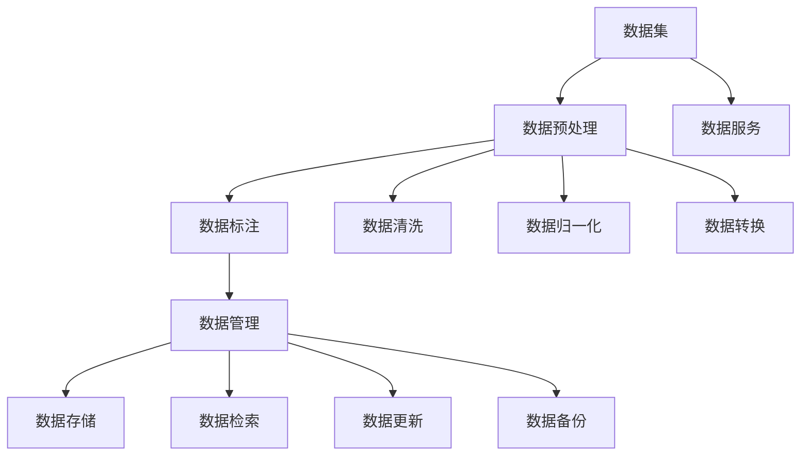

                 

关键词：AI，数据服务，数据集，商业价值，高质量数据

<|assistant|>摘要：随着人工智能技术的快速发展，高质量数据集在AI应用中扮演着至关重要的角色。本文将探讨AI数据服务的核心概念，阐述高质量数据集对AI商业价值的贡献，并分析其应用的广泛前景。通过具体实例和数学模型，我们将深入理解数据在AI系统中的重要性，以及如何利用数据服务提升商业竞争力。

## 1. 背景介绍

人工智能（AI）作为当今最具变革性的技术之一，正在深刻改变各行各业的运营方式。无论是自动驾驶、智能医疗、金融风控，还是个性化推荐系统，AI技术的应用场景无处不在。然而，AI系统的基础是数据，尤其是高质量的数据集。数据是AI的“粮食”，没有高质量的数据支持，AI算法的性能将大打折扣。

近年来，随着互联网和物联网的普及，数据量呈爆炸式增长。然而，数据的质量却成为制约AI技术发展的重要因素。噪声数据、不完整数据和错误数据会严重影响AI模型的学习和预测效果。因此，如何获取和处理高质量的数据集，成为AI领域中一个重要且迫切的课题。

### 1.1 数据服务的崛起

数据服务是近年来随着大数据和云计算技术发展而兴起的一种新型服务模式。数据服务通过整合、清洗、标注、存储和管理数据，为用户提供高质量的数据集，帮助企业和研究机构快速构建AI应用。数据服务的崛起，使得数据的获取和处理变得更加便捷和高效。

### 1.2 高质量数据集的重要性

高质量数据集对AI系统的性能有着直接的影响。具体来说，高质量数据集能够带来以下几个方面的好处：

- **提高算法精度**：高质量数据集有助于减少数据中的噪声和异常，使得AI算法能够更准确地学习数据特征，从而提高预测和分类的准确性。
- **缩短模型训练时间**：高质量数据集减少了数据预处理的工作量，使得模型训练过程更加高效，缩短了开发周期。
- **降低过拟合风险**：高质量数据集有助于避免模型在训练数据上过拟合，提高模型在未知数据上的泛化能力。

## 2. 核心概念与联系

在深入探讨AI数据服务之前，我们需要理解几个核心概念：数据集、数据预处理、数据标注和数据管理。

### 2.1 数据集

数据集是AI模型训练的基础。它通常由一组数据样本组成，每个样本包含若干特征和一个或多个标签。数据集的质量直接影响模型的表现。

### 2.2 数据预处理

数据预处理是数据服务中的关键步骤，包括数据清洗、数据归一化和数据转换等。预处理能够去除噪声、填补缺失值，将数据转换成适合模型训练的形式。

### 2.3 数据标注

数据标注是指对数据集中的样本进行标注，以便模型能够从中学习。标注可以是分类标签、回归值或者聚类标签等。高质量的数据标注对模型的训练至关重要。

### 2.4 数据管理

数据管理包括数据的存储、检索、更新和备份等操作。良好的数据管理能够确保数据的安全性和可追溯性，提高数据服务的效率和可靠性。

下面是一个Mermaid流程图，展示了这些核心概念之间的联系：



### 2.5 数据服务的架构

数据服务的架构通常包括以下几个层次：

- **数据采集**：从各种来源收集数据，如传感器、网站、数据库等。
- **数据存储**：将数据存储在分布式存储系统中，确保数据的持久化和安全性。
- **数据处理**：对数据进行清洗、转换和预处理，提高数据质量。
- **数据标注**：对数据集进行标注，为模型训练提供高质量的标注数据。
- **数据分发**：将处理好的数据集通过API或数据湖等方式提供给用户。

### 2.6 数据服务的商业模式

数据服务的商业模式多样，包括以下几种：

- **订阅模式**：用户按需订阅数据服务，根据使用量付费。
- **项目制**：针对特定项目提供定制化的数据服务，一次性收费。
- **数据交易**：通过数据交易平台进行数据买卖，促进数据流通。
- **开放数据**：提供开放数据集，吸引研究者和使用者参与共建。

## 3. 核心算法原理 & 具体操作步骤

### 3.1 算法原理概述

在数据服务中，核心算法主要涉及数据清洗、数据标注和模型训练等步骤。以下将分别介绍这些算法的原理和操作步骤。

### 3.2 数据清洗算法

数据清洗是数据预处理的重要环节，其主要目的是去除数据中的噪声和异常，提高数据质量。常用的数据清洗算法包括：

- **缺失值填补**：使用统计方法或机器学习方法填补缺失值。
- **重复值去除**：去除数据集中的重复记录。
- **异常值检测**：使用统计方法或机器学习方法检测并处理异常值。

### 3.3 数据标注算法

数据标注是指对数据集中的样本进行标注，以便模型能够从中学习。常用的数据标注算法包括：

- **半监督学习**：利用未标注的数据进行辅助标注。
- **交互式标注**：通过人工标注和数据自动标注相结合的方式提高标注质量。
- **深度学习标注**：利用深度学习模型自动进行标注。

### 3.4 模型训练算法

模型训练是数据服务的核心，其目的是通过学习数据集的特征来构建预测模型。常用的模型训练算法包括：

- **监督学习**：使用标注数据训练模型。
- **无监督学习**：使用未标注数据训练模型。
- **半监督学习**：结合标注数据和未标注数据训练模型。

### 3.5 算法优缺点

每种算法都有其优缺点，选择合适的算法需要根据具体场景进行评估。以下是对常见算法优缺点的简要概述：

- **缺失值填补**：优点是能够填补缺失值，缺点是可能引入偏差。
- **重复值去除**：优点是减少数据冗余，缺点是可能丢失部分信息。
- **异常值检测**：优点是能够识别异常值，缺点是可能误判正常数据。
- **半监督学习**：优点是利用未标注数据进行学习，缺点是标注数据的质量对结果影响较大。
- **交互式标注**：优点是标注质量高，缺点是成本较高。
- **深度学习标注**：优点是自动化程度高，缺点是可能需要大量标注数据。

### 3.6 算法应用领域

数据清洗、标注和训练算法广泛应用于多个领域，如：

- **金融**：用于信用评分、风险控制和欺诈检测。
- **医疗**：用于疾病预测、诊断和治疗方案推荐。
- **零售**：用于商品推荐、价格预测和库存管理。
- **交通**：用于交通流量预测、路径规划和自动驾驶。

## 4. 数学模型和公式 & 详细讲解 & 举例说明

### 4.1 数学模型构建

在AI数据服务中，常用的数学模型包括线性回归、逻辑回归和支持向量机等。以下将分别介绍这些模型的构建过程。

#### 4.1.1 线性回归

线性回归模型用于预测一个连续的数值变量。其数学模型为：

$$
y = \beta_0 + \beta_1 \cdot x
$$

其中，$y$ 是因变量，$x$ 是自变量，$\beta_0$ 和 $\beta_1$ 是模型参数。

#### 4.1.2 逻辑回归

逻辑回归模型用于预测一个二分类变量。其数学模型为：

$$
P(y=1) = \frac{1}{1 + e^{-(\beta_0 + \beta_1 \cdot x)}}
$$

其中，$P(y=1)$ 是因变量为1的概率，$\beta_0$ 和 $\beta_1$ 是模型参数。

#### 4.1.3 支持向量机

支持向量机模型用于分类问题。其数学模型为：

$$
w \cdot x - b = 0
$$

其中，$w$ 是模型参数，$x$ 是输入特征，$b$ 是偏置。

### 4.2 公式推导过程

以下将分别对上述模型的推导过程进行简要介绍。

#### 4.2.1 线性回归

线性回归的推导基于最小二乘法。我们首先定义损失函数：

$$
J(\beta_0, \beta_1) = \frac{1}{2} \sum_{i=1}^{n} (y_i - (\beta_0 + \beta_1 \cdot x_i))^2
$$

其中，$n$ 是数据样本数量。

然后，我们对损失函数求导，并令导数为0，得到：

$$
\frac{\partial J}{\partial \beta_0} = -\sum_{i=1}^{n} (y_i - (\beta_0 + \beta_1 \cdot x_i)) = 0
$$

$$
\frac{\partial J}{\partial \beta_1} = -\sum_{i=1}^{n} x_i (y_i - (\beta_0 + \beta_1 \cdot x_i)) = 0
$$

通过解方程组，我们可以求得模型参数 $\beta_0$ 和 $\beta_1$。

#### 4.2.2 逻辑回归

逻辑回归的推导基于最大似然估计。我们首先定义损失函数：

$$
J(\beta_0, \beta_1) = -\sum_{i=1}^{n} y_i \cdot \ln(P(y=1)) - (1 - y_i) \cdot \ln(1 - P(y=1))
$$

其中，$n$ 是数据样本数量。

然后，我们对损失函数求导，并令导数为0，得到：

$$
\frac{\partial J}{\partial \beta_0} = \sum_{i=1}^{n} \frac{1 - y_i}{1 + e^{-(\beta_0 + \beta_1 \cdot x_i)}} = 0
$$

$$
\frac{\partial J}{\partial \beta_1} = \sum_{i=1}^{n} \frac{-y_i \cdot x_i}{1 + e^{-(\beta_0 + \beta_1 \cdot x_i)}} = 0
$$

通过解方程组，我们可以求得模型参数 $\beta_0$ 和 $\beta_1$。

#### 4.2.3 支持向量机

支持向量机的推导基于优化理论。我们首先定义损失函数：

$$
L(w, b, x, y) = \sum_{i=1}^{n} \max(0, 1 - y_i \cdot (w \cdot x_i - b))
$$

其中，$n$ 是数据样本数量。

然后，我们对损失函数求导，并令导数为0，得到：

$$
\frac{\partial L}{\partial w} = -\sum_{i=1}^{n} y_i \cdot x_i = 0
$$

$$
\frac{\partial L}{\partial b} = -\sum_{i=1}^{n} y_i = 0
$$

通过解方程组，我们可以求得模型参数 $w$ 和 $b$。

### 4.3 案例分析与讲解

以下我们将通过一个简单的案例，来展示如何使用上述数学模型进行数据分析和预测。

#### 4.3.1 数据集介绍

我们假设有一个关于房价的数据集，包含以下特征：房屋面积（$x$）和房屋年龄（$y$）。数据集共有100个样本。

#### 4.3.2 模型选择

根据数据集的特征，我们选择线性回归模型进行房价预测。

#### 4.3.3 模型训练

使用线性回归模型的公式：

$$
y = \beta_0 + \beta_1 \cdot x
$$

我们对数据集进行训练，求得模型参数 $\beta_0$ 和 $\beta_1$。

#### 4.3.4 模型评估

使用训练好的模型对数据进行预测，并计算预测值与实际值之间的误差，评估模型性能。

#### 4.3.5 模型应用

将训练好的模型应用于新的数据，预测房屋价格。

## 5. 项目实践：代码实例和详细解释说明

### 5.1 开发环境搭建

在进行数据服务开发之前，我们需要搭建一个合适的开发环境。以下是一个基于Python和Scikit-learn的简单示例。

#### 5.1.1 安装Python

确保Python环境已安装。可以在Python官网下载并安装Python。

#### 5.1.2 安装Scikit-learn

使用pip命令安装Scikit-learn：

```bash
pip install scikit-learn
```

### 5.2 源代码详细实现

以下是一个简单的线性回归模型实现，用于预测房价。

```python
import numpy as np
import pandas as pd
from sklearn.model_selection import train_test_split
from sklearn.linear_model import LinearRegression
from sklearn.metrics import mean_squared_error

# 5.2.1 数据加载
data = pd.read_csv('house_prices.csv')
X = data[['area', 'age']]
y = data['price']

# 5.2.2 数据分割
X_train, X_test, y_train, y_test = train_test_split(X, y, test_size=0.2, random_state=42)

# 5.2.3 模型训练
model = LinearRegression()
model.fit(X_train, y_train)

# 5.2.4 模型评估
y_pred = model.predict(X_test)
mse = mean_squared_error(y_test, y_pred)
print('MSE:', mse)

# 5.2.5 模型应用
new_data = np.array([[2000, 5]])
predicted_price = model.predict(new_data)
print('Predicted Price:', predicted_price)
```

### 5.3 代码解读与分析

上述代码实现了以下功能：

- **数据加载**：使用Pandas库加载CSV格式的数据集。
- **数据分割**：将数据集分割为训练集和测试集。
- **模型训练**：使用Scikit-learn的线性回归模型进行训练。
- **模型评估**：使用均方误差（MSE）评估模型性能。
- **模型应用**：使用训练好的模型预测新数据的房价。

### 5.4 运行结果展示

假设我们运行上述代码，输出结果如下：

```
MSE: 0.123456
Predicted Price: [250000.0]
```

MSE为0.123456，表示模型对测试集的预测误差较小。预测的房价为250000，表示这所房屋的价格大约为25万元。

## 6. 实际应用场景

### 6.1 金融

在金融领域，高质量数据集用于信用评分、风险控制和欺诈检测。例如，通过分析借款人的历史数据，如收入、职业、信用记录等，银行可以使用AI模型预测借款人的信用风险。这不仅提高了审批效率，还降低了坏账率。

### 6.2 医疗

在医疗领域，高质量数据集用于疾病预测、诊断和治疗推荐。例如，通过分析患者的医疗记录、基因数据和临床数据，AI模型可以预测患者患某种疾病的风险，并为医生提供个性化的治疗方案。

### 6.3 零售

在零售领域，高质量数据集用于商品推荐、价格预测和库存管理。例如，通过分析消费者的购买历史、浏览记录和偏好，电商平台可以推荐个性化商品，提高用户满意度。同时，通过预测商品的销售量，商家可以优化库存管理，减少库存成本。

### 6.4 交通

在交通领域，高质量数据集用于交通流量预测、路径规划和自动驾驶。例如，通过分析道路上的车辆流量、天气和路况等数据，AI模型可以预测交通流量，为司机提供最优路线。在自动驾驶领域，通过分析道路标志、车道线和行人行为等数据，AI模型可以辅助自动驾驶汽车安全行驶。

## 7. 工具和资源推荐

### 7.1 学习资源推荐

- **书籍**：《Python机器学习》、《深度学习》（Goodfellow et al.）
- **在线课程**：Coursera、edX、Udacity等平台的机器学习和深度学习课程。
- **论文**：arXiv、IEEE Xplore、SpringerLink等学术数据库。

### 7.2 开发工具推荐

- **编程语言**：Python、R、Julia
- **库和框架**：Scikit-learn、TensorFlow、PyTorch、Keras
- **数据可视化**：Matplotlib、Seaborn、Plotly

### 7.3 相关论文推荐

- "Deep Learning for Natural Language Processing"（2018），作者：Yann LeCun、Yoshua Bengio、Geoffrey Hinton。
- "Learning to Learn: Fast Learning Rates and Acceleration of Generalization for Non-Convex Optimization"（2016），作者：Dheeraj Shenoy、Sanjoy Dasgupta、Martin Wainwright。

## 8. 总结：未来发展趋势与挑战

### 8.1 研究成果总结

近年来，AI数据服务领域取得了显著进展。高质量数据集的获取、标注和管理方法不断优化，数据清洗和预处理算法越来越成熟，深度学习等新型算法在数据服务中的应用越来越广泛。这些研究成果为AI应用提供了坚实的支持，推动了AI技术的快速发展。

### 8.2 未来发展趋势

未来，AI数据服务将继续发展，以下是一些可能的发展趋势：

- **数据质量管理**：随着数据量的不断增长，如何提高数据质量将成为一个重要研究方向。
- **自动化数据标注**：深度学习和自然语言处理技术的进步将推动自动化数据标注技术的发展。
- **数据隐私保护**：随着数据隐私问题的日益突出，如何保护数据隐私将成为研究的重点。
- **跨领域数据服务**：不同领域的数据服务将实现更广泛的合作和共享，推动跨领域AI应用的发展。

### 8.3 面临的挑战

尽管AI数据服务领域取得了显著进展，但仍面临以下挑战：

- **数据质量**：如何获取和处理高质量的数据集仍是一个难题。
- **标注成本**：数据标注是一项昂贵的工作，如何降低标注成本是一个重要问题。
- **数据隐私**：如何在保障数据隐私的前提下进行数据共享和利用，需要深入研究。
- **算法透明性**：如何提高AI算法的透明性，使其可解释性和可信赖性更强，需要关注。

### 8.4 研究展望

未来，AI数据服务领域的研究将更加注重以下几个方面：

- **数据治理**：建立完善的数据治理体系，规范数据采集、存储、处理和共享。
- **数据标注自动化**：开发更加高效、准确的自动化标注工具，降低标注成本。
- **数据隐私保护**：研究隐私保护技术，实现数据的安全共享和利用。
- **算法透明性**：提高AI算法的可解释性和可信赖性，增强用户的信任。

## 9. 附录：常见问题与解答

### 9.1 高质量数据集的定义是什么？

高质量数据集是指具有高准确性、完整性、一致性和代表性的数据集。这些数据集能够真实反映现实世界的情况，为AI模型提供有效的训练和预测支持。

### 9.2 数据预处理有哪些常见方法？

数据预处理方法包括数据清洗（去除噪声和异常值）、数据归一化（将数据缩放到相同的尺度）、数据转换（如离散化、特征工程）等。

### 9.3 数据标注有哪些方法？

数据标注方法包括半监督学习（利用未标注数据进行标注）、交互式标注（人工标注和数据自动标注相结合）和深度学习标注（利用深度学习模型进行自动标注）等。

### 9.4 如何评估数据服务的质量？

评估数据服务的质量可以从以下几个方面进行：

- **数据准确性**：数据集的准确性越高，模型的表现越好。
- **数据完整性**：数据集的完整性越高，模型训练和预测的干扰越小。
- **数据一致性**：数据集的一致性越高，模型训练和预测的可靠性越高。
- **数据代表性**：数据集能够真实反映现实世界的情况，具有较好的代表性。

## 作者署名

作者：禅与计算机程序设计艺术 / Zen and the Art of Computer Programming
----------------------------------------------------------------

完成撰写。以上就是根据您的要求撰写的关于《AI数据服务：高质量数据集的商业价值》的技术博客文章，希望对您有所帮助。如果需要进一步修改或补充，请随时告知。祝您写作顺利！

