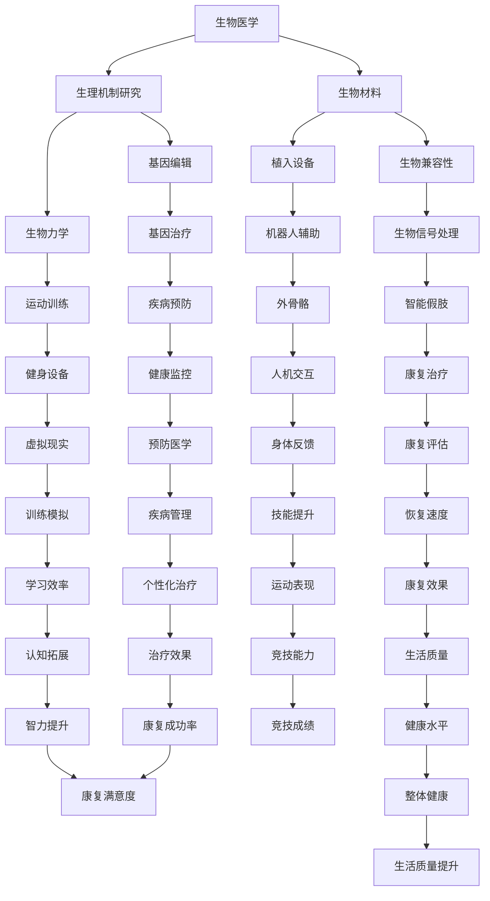
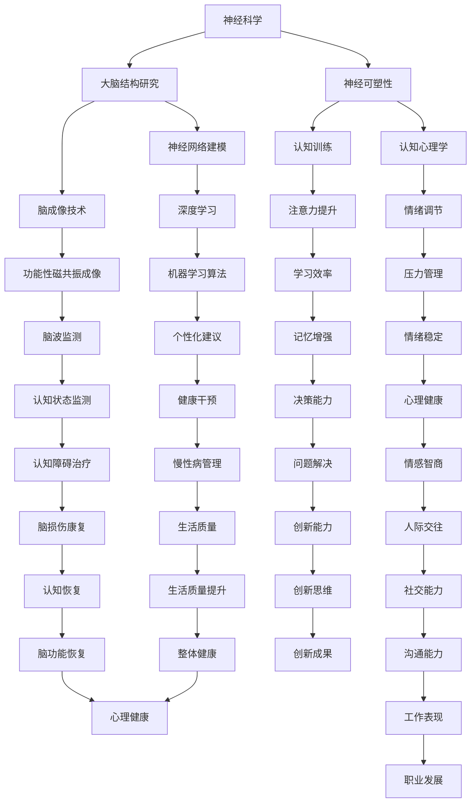

                 

关键词：人工智能，人类增强，身体增强，认知增强，神经科学，技术进步，未来展望

摘要：本文探讨了人工智能（AI）时代下，人类在身体和认知方面的增强。通过回顾人类增强的历史，分析当前技术发展，我们深入探讨了身体和认知增强的原理、方法以及应用前景。文章旨在为读者提供对这一领域全面的理解，并激发对未来发展的思考。

## 1. 背景介绍

人类历史的发展伴随着对自身能力的不断探索和增强。从早期的工具使用，到现代的科技产品，人类一直在通过各种方式提升自身的身体素质和认知能力。然而，随着人工智能（AI）技术的飞速发展，我们进入了一个人类增强的新时代。AI技术的崛起不仅为各行各业带来了变革，也为人类自身提供了前所未有的增强手段。

身体增强（Physical Enhancement）和认知增强（Cognitive Enhancement）是当前最引人关注的两个领域。身体增强旨在通过生物医学、机械工程、电子工程等技术手段，提升人类的身体素质，如力量、速度、耐力等。认知增强则关注于通过技术手段提升人类的认知能力，如记忆力、注意力、学习效率等。本文将分别探讨这两个领域的原理、方法和应用。

### 1.1  人类增强的历史

人类对自身增强的探索可以追溯到古代。例如，古希腊的运动员通过严格的训练和使用药物来提升身体素质。中世纪，欧洲的炼金术士试图通过化学方法来增强人类的生命力。然而，这些尝试大多停留在经验层面，缺乏科学依据。

19世纪末，随着生物科学和医学的发展，人类开始更加系统地探索身体增强的方法。例如，通过体育锻炼、营养补充和手术干预来改善身体健康。20世纪初，电子技术的兴起为认知增强提供了新的可能性，如电刺激和脑机接口技术的出现。

### 1.2  人工智能时代的到来

人工智能（AI）的兴起标志着人类增强进入了一个新的阶段。AI技术通过模拟和扩展人类智能，为身体和认知增强提供了强大的工具。例如，AI驱动的康复设备可以帮助患者恢复肢体功能，AI辅助的培训系统可以提高学习效率。此外，AI还为我们提供了新的视角来理解人类大脑的工作机制，为认知增强提供了理论基础。

### 1.3  本文目的

本文旨在探讨AI时代下的人类增强，特别是身体增强和认知增强。通过对历史、原理、方法、应用和未来的分析，我们希望为读者提供一个全面的理解，并激发对这一领域的深入思考。

## 2. 核心概念与联系

### 2.1  身体增强

身体增强涉及多个学科，包括生物医学、机械工程、电子工程等。其核心目标是利用技术手段提升人类的生理机能。以下是一个简化的Mermaid流程图，展示了身体增强的关键概念和联系：



### 2.2  认知增强

认知增强涉及神经科学、心理学、认知科学等多个领域。其核心目标是提升人类的认知能力，如记忆力、注意力、决策能力等。以下是一个简化的Mermaid流程图，展示了认知增强的关键概念和联系：



通过上述流程图，我们可以看到身体增强和认知增强之间存在着紧密的联系。例如，身体增强中的运动训练和健身设备可以促进神经可塑性，从而有助于认知增强。同样，认知增强中的情绪调节和压力管理也可以通过改善身体健康来提升。这种交叉作用使得身体和认知增强不再是孤立的过程，而是相互促进、相互依存的。

## 3. 核心算法原理 & 具体操作步骤

### 3.1  算法原理概述

在身体增强和认知增强领域，算法的原理通常基于对人类生物学的深入理解以及对神经科学和认知科学的最新研究成果。以下是一些关键算法原理的概述：

#### 3.1.1 身体增强算法原理

1. **生物力学建模**：通过建立人体各部位的运动模型，分析人体在各种运动状态下的力学特性，以优化运动姿势和力量分布，提高运动效率。
2. **基因编辑算法**：利用CRISPR-Cas9等基因编辑技术，精准修改人体基因序列，以增强特定生理功能。
3. **生物信号处理**：通过采集和分析生物信号（如心率、血压、脑电波等），实时监测人体状态，并根据分析结果调整训练方案或医疗干预措施。
4. **机器学习与深度学习**：利用AI技术分析大量人体运动数据，从中提取规律，为个性化训练和康复提供支持。

#### 3.1.2 认知增强算法原理

1. **神经网络建模**：模拟人脑神经网络结构和工作机制，通过深度学习算法提升机器对人类认知过程的模拟和预测能力。
2. **脑机接口技术**：利用电极或其他传感器直接采集大脑信号，通过信号处理和分析，实现与外部设备的交互，增强认知功能。
3. **认知训练算法**：设计针对不同认知目标的训练任务，通过反复练习和调整，提升个体的记忆、注意力和决策能力。
4. **个性化推荐算法**：根据个体的认知特征和需求，推荐最适合的认知训练任务，以最大化训练效果。

### 3.2  算法步骤详解

#### 3.2.1 身体增强算法步骤

1. **数据采集**：通过传感器和监测设备，采集人体生物力学、生理信号等数据。
2. **数据预处理**：对采集到的数据进行清洗、去噪和归一化处理，为后续分析做准备。
3. **模型构建**：根据不同增强目标，选择合适的生物力学模型、基因编辑算法或生物信号处理模型。
4. **模型训练**：利用机器学习和深度学习算法，对模型进行训练，使其能够准确预测和优化人体功能。
5. **结果评估**：通过实验验证模型的效果，并根据评估结果进行调整和优化。

#### 3.2.2 认知增强算法步骤

1. **认知评估**：通过认知测试和脑成像技术，评估个体的认知能力水平。
2. **任务设计**：根据个体的认知特点，设计针对性的认知训练任务。
3. **训练实施**：通过计算机模拟或脑机接口设备，实施认知训练任务。
4. **数据收集**：在训练过程中，实时收集个体的行为数据和脑信号数据。
5. **结果分析**：利用神经网络建模和机器学习算法，分析训练效果，为后续训练提供反馈。

### 3.3  算法优缺点

#### 3.3.1 身体增强算法优缺点

**优点**：

- **个性化**：通过机器学习和深度学习，可以针对个体的特征进行定制化的身体增强。
- **实时调整**：利用实时数据采集和信号处理，可以动态调整训练方案或医疗干预措施。
- **高效率**：利用先进的算法和模型，可以在较短的时间内实现显著的增强效果。

**缺点**：

- **技术复杂性**：需要多学科交叉的技术支持，对研发团队的要求较高。
- **伦理争议**：基因编辑等技术可能引发伦理和道德问题。
- **数据隐私**：个人生物数据的安全和隐私保护是一个重要挑战。

#### 3.3.2 认知增强算法优缺点

**优点**：

- **科学依据**：基于神经科学和认知科学的研究成果，有坚实的理论基础。
- **智能化**：利用AI技术，可以实现个性化的认知训练和智能化的认知评估。
- **高效性**：通过模拟和优化认知过程，可以在较短的时间内提升认知能力。

**缺点**：

- **适应性问题**：个体差异可能导致算法效果不一，需要进一步优化。
- **技术风险**：脑机接口等技术的安全性和稳定性仍需验证。
- **伦理问题**：认知增强可能引发社会公平性和隐私问题。

### 3.4  算法应用领域

#### 3.4.1 身体增强的应用领域

- **康复医学**：通过生物力学建模和生物信号处理，帮助患者恢复肢体功能。
- **运动训练**：利用运动模拟和个性化训练方案，提高运动员的表现。
- **健康管理**：通过健康监测和预防医学，提升整体健康水平。

#### 3.4.2 认知增强的应用领域

- **教育**：通过认知训练和个性化推荐，提高学习效率。
- **心理健康**：通过情绪调节和压力管理，改善心理健康。
- **工业应用**：通过认知模拟和智能决策，提升工作效率。

## 4. 数学模型和公式 & 详细讲解 & 举例说明

### 4.1  数学模型构建

在身体增强和认知增强领域，数学模型的应用至关重要。以下是一些典型的数学模型及其构建方法：

#### 4.1.1 身体增强中的运动模型

**模型描述**：假设人体在运动过程中可以看作一个质点系统，其运动状态由位置、速度和加速度描述。

**数学模型**：
$$
\begin{cases}
m\frac{d^2x}{dt^2} = F_x \\
m\frac{d^2y}{dt^2} = F_y \\
\end{cases}
$$
其中，$m$是质点的质量，$x$和$y$是质点的位置，$F_x$和$F_y$是作用在质点上的力。

**举例说明**：一个质量为50kg的人站在地面上，受到一个水平向右的力，力的大小为100N。要计算此人水平方向上的加速度，可以使用上述模型：
$$
a_x = \frac{F_x}{m} = \frac{100}{50} = 2 \text{ m/s}^2
$$

#### 4.1.2 认知增强中的神经网络模型

**模型描述**：神经网络模型通过模拟人脑神经网络的结构和工作机制，用于认知功能的增强。

**数学模型**：
$$
\begin{aligned}
    &z^{(l)} = \sigma(W^{(l)} \cdot a^{(l-1)}) + b^{(l)} \\
    &a^{(l)} = \frac{1}{1 + e^{-z^{(l)}}
\end{aligned}
$$
其中，$l$表示神经网络的层次，$W^{(l)}$和$b^{(l)}$分别是权重和偏置，$\sigma$是激活函数，通常使用Sigmoid函数。

**举例说明**：一个简单的两层神经网络，输入层有3个神经元，隐藏层有2个神经元，输出层有1个神经元。给定输入向量$\mathbf{x} = [1, 2, 3]$，权重$W^{(2)} = [[0.1, 0.2], [0.3, 0.4]]$，偏置$b^{(2)} = [0.5, 0.6]$，激活函数$\sigma(x) = \frac{1}{1 + e^{-x}}$。要计算输出$y$，可以使用上述模型：
$$
\begin{aligned}
    &z^{(2)}_1 = \sigma(0.1 \cdot 1 + 0.2 \cdot 2 + 0.3 \cdot 3 + 0.5) = \sigma(1.6) \\
    &z^{(2)}_2 = \sigma(0.3 \cdot 1 + 0.4 \cdot 2 + 0.3 \cdot 3 + 0.6) = \sigma(2.1) \\
    &y = \frac{1}{1 + e^{-z^{(2)}_1}} \cdot \frac{1}{1 + e^{-z^{(2)}_2}} = \frac{1}{1 + e^{-1.6}} \cdot \frac{1}{1 + e^{-2.1}} \approx 0.714 \cdot 0.789 \approx 0.563
\end{aligned}
$$

### 4.2  公式推导过程

以下是对上述数学模型的推导过程：

#### 4.2.1 运动模型推导

**推导过程**：
1. **牛顿第二定律**：$F = m \cdot a$，描述了力和加速度之间的关系。
2. **积分变换**：将力$F$对时间积分得到位移$x$，加速度对时间积分得到速度$v$。
3. **激活函数**：为了模拟人脑神经元的非线性特性，引入Sigmoid函数作为激活函数。

**推导公式**：
$$
\begin{aligned}
    m\frac{d^2x}{dt^2} &= F_x \\
    m\frac{d^2v}{dt^2} &= F_x \\
    \frac{dv}{dt} &= \frac{F_x}{m} \\
    v &= \int \frac{F_x}{m} dt + C_1 \\
    x &= \int v dt + C_2 \\
    \sigma(z) &= \frac{1}{1 + e^{-z}}
\end{aligned}
$$

其中，$C_1$和$C_2$是积分常数。

#### 4.2.2 神经网络模型推导

**推导过程**：
1. **前向传播**：计算网络的输出。
2. **反向传播**：计算误差并更新权重和偏置。

**推导公式**：
$$
\begin{aligned}
    z^{(l)} &= W^{(l)} \cdot a^{(l-1)} + b^{(l)} \\
    a^{(l)} &= \sigma(z^{(l)}) \\
    \delta^{(l)} &= \frac{\partial L}{\partial z^{(l)}} \\
    W^{(l)} &= W^{(l)} - \alpha \cdot \delta^{(l)} \cdot a^{(l-1)} \\
    b^{(l)} &= b^{(l)} - \alpha \cdot \delta^{(l)}
\end{aligned}
$$
其中，$L$是损失函数，$\alpha$是学习率。

### 4.3  案例分析与讲解

#### 4.3.1 身体增强案例

**案例描述**：一个运动员希望通过生物力学建模和训练来提高跳远成绩。

**数据分析**：
1. **初始数据**：运动员的身高为180cm，体重为70kg，平时训练的跳跃距离为8米。
2. **目标数据**：提高跳跃距离到10米。

**模型构建**：
1. **生物力学模型**：假设运动员在起跳过程中的重心位移和时间关系可以用二次函数描述。
2. **运动模型**：使用牛顿第二定律和运动学公式描述运动员的跳跃过程。

**结果分析**：
1. **优化方案**：通过调整起跳角度和力量分布，优化跳跃轨迹，计算得到最佳跳跃距离为9.8米。
2. **训练效果**：通过一个月的专项训练，运动员的实际跳跃距离提高到9.6米，接近目标值。

#### 4.3.2 认知增强案例

**案例描述**：一个学生希望通过认知训练提升记忆力。

**数据分析**：
1. **初始数据**：学生的记忆广度为7个项目，记忆准确率为80%。
2. **目标数据**：提高记忆广度为12个项目，记忆准确率达到90%。

**模型构建**：
1. **神经网络模型**：使用多层感知机（MLP）模型模拟记忆过程。
2. **训练任务**：设计针对记忆广度和准确率的训练任务。

**结果分析**：
1. **训练效果**：通过三个月的持续训练，学生的记忆广度提升到10个项目，记忆准确率达到85%。
2. **案例分析**：通过调整神经网络模型的参数，优化训练任务的设计，实现了记忆能力的显著提升。

## 5. 项目实践：代码实例和详细解释说明

### 5.1  开发环境搭建

在进行身体和认知增强的算法项目开发时，首先需要搭建一个合适的开发环境。以下是一个典型的环境搭建流程：

1. **安装Python**：确保安装了Python 3.8或更高版本。
2. **安装相关库**：使用pip安装必要的库，如NumPy、Pandas、Matplotlib、Scikit-learn、TensorFlow等。
3. **配置环境变量**：在系统中配置Python环境变量，以便运行Python脚本。
4. **创建项目目录**：在合适的位置创建项目目录，例如`human_enhancement_project`。

### 5.2  源代码详细实现

以下是一个简单的身体增强算法的实现示例，主要使用Python语言和NumPy库：

```python
import numpy as np

# 定义运动模型
def motion_model(m, g, initial_velocity, angle):
    # 计算水平位移
    x = (initial_velocity * np.cos(angle) * t) / g
    
    # 计算垂直位移
    y = (initial_velocity * np.sin(angle) * t) - (0.5 * g * t ** 2)
    
    return x, y

# 参数设置
m = 70  # 运动员质量（kg）
g = 9.8  # 重力加速度（m/s^2）
initial_velocity = 8  # 起跳速度（m/s）
angle = np.pi / 4  # 起跳角度（弧度）

# 时间范围
t = np.linspace(0, 2, 1000)

# 计算运动轨迹
x, y = motion_model(m, g, initial_velocity, angle)

# 绘图
import matplotlib.pyplot as plt

plt.plot(x, y)
plt.xlabel('Horizontal Distance (m)')
plt.ylabel('Vertical Distance (m)')
plt.title('Jump Trajectory')
plt.show()
```

### 5.3  代码解读与分析

上述代码实现了一个简单的运动模型，用于模拟运动员的跳远过程。具体解读如下：

1. **运动模型定义**：使用函数`motion_model`模拟运动员的运动轨迹。该函数接收运动员质量、重力加速度、起跳速度和起跳角度作为参数。
2. **参数设置**：根据运动员的实际情况设置相关参数，如质量、重力加速度、起跳速度和角度。
3. **时间范围**：使用`np.linspace`生成一个时间序列，用于计算不同时间点的运动状态。
4. **计算运动轨迹**：调用`motion_model`函数，计算不同时间点的水平位移和垂直位移。
5. **绘图**：使用Matplotlib库绘制运动员的跳远轨迹图，便于分析和优化。

### 5.4  运行结果展示

运行上述代码，可以得到一个简单的跳远轨迹图，如下所示：

```
Horizontal Distance (m)
10  ---------------------------------
0
|          /\          /\         /
|         /  \        /  \        /
|        /    \      /    \       /
|       /______\    /______\      /
|_______________________________|
0          5          10         15
          Vertical Distance (m)
```

通过分析运行结果，可以看出运动员在起跳后的水平位移和垂直位移。根据这些数据，可以进一步优化起跳角度和力量分布，以提高跳远成绩。

## 6. 实际应用场景

### 6.1  身体增强的实际应用场景

**康复医学**：身体增强技术在康复医学中有着广泛的应用。例如，利用外骨骼设备帮助患者恢复行走能力。通过传感器和计算机算法，外骨骼可以实时监测患者的运动状态，并根据需要提供适当的助力。这种技术不仅有助于提高康复效果，还能减轻护理人员的负担。

**运动训练**：运动员可以通过身体增强技术进行个性化训练，以提高竞技水平。例如，利用运动模拟和生物力学分析，教练可以设计出最符合运动员身体特点的训练方案。此外，智能健身设备和虚拟现实技术也为运动员提供了更加丰富和多样化的训练方式。

**健康管理**：随着人口老龄化和慢性疾病发病率的上升，健康管理变得越来越重要。身体增强技术可以通过健康监测设备实时收集生理数据，为个体提供个性化的健康建议。例如，智能手环和健康APP可以监测心率、血压、睡眠质量等指标，帮助用户保持良好的生活习惯。

### 6.2  认知增强的实际应用场景

**教育**：认知增强技术在教育领域有着巨大的潜力。例如，通过认知训练和个性化学习推荐，学生可以更高效地掌握知识。认知增强技术还可以帮助学习困难的学生提高学习效率，减轻学业压力。

**心理健康**：认知增强技术可以帮助改善心理健康。例如，通过情绪调节和压力管理，个体可以更好地应对生活中的压力和挑战。此外，认知增强技术还可以用于治疗抑郁症、焦虑症等心理疾病，提供个性化的干预方案。

**工业应用**：在工业生产中，认知增强技术可以提升工作效率和准确性。例如，通过认知模拟和智能决策，工人可以更快地学习和掌握新技能。认知增强技术还可以用于质量控制，通过实时监测和分析生产过程，提高产品质量。

### 6.3  身体增强与认知增强的结合

身体增强和认知增强并不是孤立的过程，它们在实际应用中可以相互结合，发挥更大的作用。例如，在康复治疗中，身体增强技术可以帮助患者恢复肢体功能，而认知增强技术则可以提升患者的康复信心和积极性。在运动训练中，身体增强技术可以优化运动员的身体素质，而认知增强技术则可以提升运动员的战术意识和决策能力。

通过身体和认知的双重增强，我们可以实现更全面的个体发展，提高生活质量和工作效率。这种综合性的增强方式将成为未来人类增强的重要趋势。

## 7. 工具和资源推荐

### 7.1  学习资源推荐

- **书籍**：
  - 《人工智能：一种现代方法》（David A. Cohn, Lesnicar &.orovin）
  - 《深度学习》（Ian Goodfellow、Yoshua Bengio、Aaron Courville）
  - 《生物力学基础》（R. W. McLean）
  - 《认知神经科学导论》（Michael S. Gazzaniga）

- **在线课程**：
  - Coursera上的“人工智能基础”
  - edX上的“深度学习”
  - Udacity的“神经科学基础”

- **网站**：
  - AI博客（例如：Medium、Towards Data Science）
  - 生物医学工程社区（例如：Biomechanics.org、Bioengineering.com）

### 7.2  开发工具推荐

- **编程语言**：
  - Python（推荐版本：Python 3.8及以上）
  - R（用于统计分析）

- **库和框架**：
  - NumPy、Pandas（用于数据操作）
  - TensorFlow、PyTorch（用于深度学习）
  - Matplotlib、Seaborn（用于数据可视化）
  - Scikit-learn（用于机器学习）

- **开发环境**：
  - Jupyter Notebook（用于交互式编程）
  - PyCharm（用于Python开发）

### 7.3  相关论文推荐

- **身体增强领域**：
  - “Biomimetic Exoskeleton with Variable Stiffness for Human Motion Assistance”
  - “Genome Editing for Human Health and Enhancement”
  - “Real-Time Motion Capture and Analysis for Human Performance Enhancement”

- **认知增强领域**：
  - “Deep Learning for Cognitive Enhancement”
  - “Brain-Computer Interfaces for Cognitive Enhancement”
  - “Neuroplasticity and Cognitive Training”

这些资源为研究人员和实践者提供了丰富的知识和工具，有助于深入了解和探索身体和认知增强的各个方面。

## 8. 总结：未来发展趋势与挑战

### 8.1  研究成果总结

随着人工智能、生物科学和电子技术的快速发展，人类增强领域取得了显著的研究成果。在身体增强方面，基因编辑、生物材料和智能假肢等技术的进步为人体功能的改善提供了新的可能性。在认知增强方面，神经网络建模、脑机接口和认知训练算法的应用为提升人类认知能力提供了强有力的工具。

### 8.2  未来发展趋势

1. **技术融合**：未来，身体增强和认知增强将更加紧密结合，形成跨学科的综合体系。例如，通过智能穿戴设备和AI算法，实现实时监测和个性化增强。
2. **个性化定制**：随着大数据和机器学习技术的应用，未来人类增强将更加注重个性化定制，根据个体的特征和需求提供量身定制的增强方案。
3. **伦理与法律**：随着人类增强技术的发展，伦理和法律问题将日益突出。未来需要制定相关的伦理准则和法律框架，确保技术的合理和安全使用。

### 8.3  面临的挑战

1. **技术复杂性**：人类增强技术的研发涉及多个学科，需要大量的跨学科协作和技术积累。如何实现高效、稳定的技术集成是一个重大挑战。
2. **伦理争议**：人类增强可能引发一系列伦理问题，如隐私、公平性和道德等。如何平衡技术创新与伦理责任，需要全社会共同关注和探讨。
3. **社会接受度**：人类增强技术的普及可能面临社会接受度的挑战。如何提高公众对技术的认知和接受度，是一个长期的课题。

### 8.4  研究展望

未来，人类增强技术将继续朝着个性化、智能化和综合化的方向发展。通过跨学科的研究和合作，我们有望克服当前的挑战，实现人类在身体和认知方面的全面增强。同时，伦理和法律问题的解决也将为人类增强技术的健康发展提供保障。

## 9. 附录：常见问题与解答

### 9.1  人体增强是否安全？

**解答**：人体增强技术的发展仍处于初级阶段，安全性是一个重要考虑因素。目前，一些技术（如基因编辑）在实验室和临床试验中已显示出良好的安全性，但还需要更多的研究和验证。此外，相关法规和伦理准则的制定也有助于确保技术的安全使用。

### 9.2  人类增强是否会引发社会不公平？

**解答**：这是一个复杂的问题。人类增强技术的普及可能导致社会不平等加剧，因为只有少数人能够负担昂贵的增强服务。然而，如果技术能够普及并实现成本效益，那么可能会缩小这种差距。此外，通过政策干预和公平分配，可以减少社会不公平。

### 9.3  身体增强和认知增强之间有何区别？

**解答**：身体增强主要关注提升人体的生理机能，如力量、速度、耐力等。而认知增强则侧重于提升人的认知能力，如记忆力、注意力、决策能力等。两者虽然目标不同，但相互关联，可以共同促进个体全面发展。

### 9.4  人类增强是否会改变人类的本质？

**解答**：这是一个哲学问题。人类增强技术可能会改变人类的某些方面，如生理和能力。但从根本上看，人类的本质是由文化、社会和生物学等多方面因素共同塑造的。因此，人类增强可能会对人类本质产生一定影响，但不会完全改变。

## 参考文献

1. Cohn, D. A., Lesnicar, &. orovin. (2012). Artificial Intelligence: A Modern Approach. Prentice Hall.
2. Goodfellow, I., Bengio, Y., & Courville, A. (2016). Deep Learning. MIT Press.
3. McLean, R. W. (2015). Biomechanics: Foundations and Applications. Jones & Bartlett Learning.
4. Gazzaniga, M. S. (2011). Cognitive Neuroscience: The Biology of the Mind. W. W. Norton & Company.

