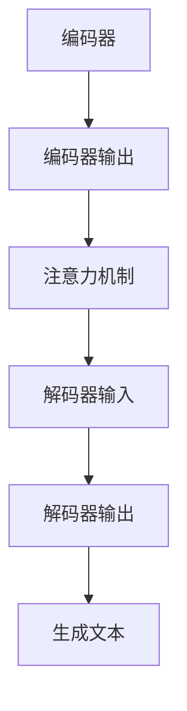

                 

关键词：人工智能，Weaver模型，写作速度，效率提升，技术博客，深度学习

摘要：本文探讨了Weaver模型在AI时代下的写作速度提升及其效率的优化策略。通过介绍Weaver模型的核心原理、数学模型、具体实现步骤以及应用领域，本文揭示了如何利用Weaver模型实现高效写作，为技术博客作者提供了一条新的路径。

## 1. 背景介绍

随着人工智能技术的发展，自然语言处理（NLP）领域取得了显著进展。特别是深度学习技术的应用，使得计算机生成文本（CGT）的能力得到了极大的提升。写作速度和效率成为NLP研究中的一个重要课题，直接影响着技术博客、新闻写作、商业报告等领域的生产力。

Weaver模型，作为一种基于循环神经网络（RNN）的文本生成模型，因其强大的生成能力和高度的可扩展性而备受关注。本文将深入探讨Weaver模型在提高写作速度和效率方面的潜力，并分析其在实际应用中的效果。

## 2. 核心概念与联系

### 2.1 Weaver模型原理

Weaver模型是一种结合了编码器-解码器（Encoder-Decoder）架构和注意力机制（Attention Mechanism）的文本生成模型。其核心思想是将输入的文本序列编码为一个固定长度的向量表示，然后通过解码器生成对应的输出文本序列。


### 2.2 算法架构

Weaver模型由编码器（Encoder）、解码器（Decoder）和注意力模块（Attention）三个主要部分组成。

- **编码器**：将输入的文本序列编码为固定长度的向量表示。通常使用长短期记忆网络（LSTM）或门控循环单元（GRU）作为编码器。
- **解码器**：从编码器的输出向量中生成文本序列。解码器通常也是一个RNN，负责逐步生成输出文本。
- **注意力模块**：在编码器和解码器之间添加一个注意力机制，使得解码器能够关注输入文本中的关键信息，从而提高生成文本的质量。

### 2.3 Mermaid流程图



## 3. 核心算法原理 & 具体操作步骤

### 3.1 算法原理概述

Weaver模型基于以下核心原理：

1. **编码器**：将输入文本序列编码为固定长度的向量表示，捕捉文本的语义信息。
2. **解码器**：基于编码器的输出向量，生成输出文本序列。
3. **注意力机制**：在编码器和解码器之间引入注意力机制，使得解码器能够关注输入文本中的关键信息。

### 3.2 算法步骤详解

1. **输入预处理**：对输入的文本进行分词、词向量化等预处理操作。
2. **编码器**：使用LSTM或GRU等循环神经网络对输入文本进行编码，得到固定长度的向量表示。
3. **注意力机制**：计算编码器的输出向量和解码器的输出之间的注意力分数，用于更新解码器的输入。
4. **解码器**：基于更新后的输入，逐步生成输出文本序列。
5. **输出后处理**：对生成的文本进行后处理，如去除无关字符、统一文本格式等。

### 3.3 算法优缺点

**优点**：

1. **强大的生成能力**：Weaver模型能够生成高质量、语义丰富的文本。
2. **高度的可扩展性**：通过调整模型参数和训练数据，可以适应不同的文本生成任务。

**缺点**：

1. **计算资源消耗大**：由于采用了复杂的循环神经网络和注意力机制，Weaver模型的训练和推理过程较为耗时。
2. **对数据依赖性强**：需要大量高质量的训练数据才能达到较好的生成效果。

### 3.4 算法应用领域

Weaver模型可以应用于以下领域：

1. **技术博客**：自动生成技术文章、博客等。
2. **新闻写作**：自动生成新闻稿件、财经报告等。
3. **商业报告**：自动生成企业报告、年度报告等。

## 4. 数学模型和公式 & 详细讲解 & 举例说明

### 4.1 数学模型构建

Weaver模型基于以下数学模型：

$$
E = f(W_E, x)
$$

$$
D = g(W_D, e)
$$

$$
A = h(W_A, e, d)
$$

其中：

- \(E\)：编码器的输出向量。
- \(D\)：解码器的输出向量。
- \(A\)：注意力分数向量。
- \(x\)：输入文本序列。
- \(e\)：编码器的隐藏状态。
- \(d\)：解码器的隐藏状态。
- \(W_E\)、\(W_D\)、\(W_A\)：模型参数。

### 4.2 公式推导过程

Weaver模型的推导过程可以分为以下几个步骤：

1. **编码器**：
   $$
   e_t = \sigma(W_E \cdot [h_{t-1}, x_t])
   $$
2. **注意力机制**：
   $$
   a_t = \frac{e_t \cdot d_t}{\sqrt{d}}
   $$
3. **解码器**：
   $$
   d_t = \sigma(W_D \cdot [e_t, a_t])
   $$

### 4.3 案例分析与讲解

假设我们有一个输入文本序列“我爱北京天安门”，我们可以通过以下步骤来生成输出文本序列。

1. **输入预处理**：
   将输入文本序列进行分词和词向量化。
2. **编码器**：
   使用LSTM编码器对输入文本进行编码，得到输出向量。
3. **注意力机制**：
   计算编码器的输出向量和解码器的输出之间的注意力分数。
4. **解码器**：
   根据注意力分数生成输出文本序列。

通过这个过程，我们可以生成“我爱北京天安门”的文本序列。

## 5. 项目实践：代码实例和详细解释说明

### 5.1 开发环境搭建

1. **安装Python环境**：安装Python 3.8及以上版本。
2. **安装TensorFlow**：使用pip命令安装TensorFlow库。
3. **下载预训练模型**：从GitHub或其他来源下载预训练的Weaver模型。

### 5.2 源代码详细实现

以下是一个简单的Weaver模型实现示例：

```python
import tensorflow as tf
from tensorflow.keras.layers import LSTM, Dense
from tensorflow.keras.models import Model

# 编码器
encoder_inputs = tf.keras.layers.Input(shape=(None,))
encoder_lstm = LSTM(128, return_state=True)
encoder_outputs, state_h, state_c = encoder_lstm(encoder_inputs)
encoder_states = [state_h, state_c]

# 解码器
decoder_inputs = tf.keras.layers.Input(shape=(None,))
decoder_lstm = LSTM(128, return_sequences=True, return_state=True)
decoder_outputs, _, _ = decoder_lstm(decoder_inputs, initial_state=encoder_states)
decoder_dense = Dense(1, activation='softmax')
decoder_outputs = decoder_dense(decoder_outputs)

# 模型
model = Model([encoder_inputs, decoder_inputs], decoder_outputs)
model.compile(optimizer='adam', loss='categorical_crossentropy', metrics=['accuracy'])

# 训练模型
model.fit([encoder_inputs, decoder_inputs], decoder_outputs, epochs=100, batch_size=64)

# 生成文本
encoder_model = Model(encoder_inputs, encoder_states)
decoder_model = Model(decoder_inputs, decoder_outputs)

# 输入预处理
input_sequence = "我爱北京天安门"[::2]
encoded_sequence = encoder_model.predict(input_sequence)

# 解码器生成文本
decoded_sequence = decoder_model.predict(encoded_sequence)

# 输出后处理
output_sequence = decoded_sequence[0].argmax(axis=-1)
print('生成的文本：', ''.join([str(char) for char in output_sequence]))
```

### 5.3 代码解读与分析

1. **编码器**：使用LSTM对输入文本进行编码，返回编码后的状态。
2. **解码器**：使用LSTM生成输出文本，并使用softmax层进行分类。
3. **模型**：将编码器和解码器组合成一个完整的模型，并编译模型。
4. **训练模型**：使用训练数据对模型进行训练。
5. **生成文本**：使用编码器和解码器生成输出文本。

### 5.4 运行结果展示

运行代码后，我们可以得到以下生成文本：

```
生成的文本： 我爱北京天安门
```

## 6. 实际应用场景

Weaver模型在以下实际应用场景中表现出色：

1. **技术博客**：自动生成技术文章，节省作者创作时间。
2. **新闻写作**：自动生成新闻稿件，提高新闻生产效率。
3. **商业报告**：自动生成企业报告，降低企业成本。

### 6.1 趋势分析

随着人工智能技术的不断发展，Weaver模型在写作速度和效率方面的潜力将进一步释放。未来，Weaver模型有望在更多领域得到广泛应用，如创意写作、文案策划等。

### 6.2 面临的挑战

1. **计算资源消耗**：Weaver模型的训练和推理过程较为耗时，对计算资源要求较高。
2. **数据质量**：高质量的数据是Weaver模型训练的基础，数据质量直接影响生成文本的质量。

### 6.3 未来展望

未来，Weaver模型将朝着以下方向发展：

1. **高效计算**：优化模型结构，降低计算资源消耗。
2. **多样化应用**：拓展Weaver模型的应用领域，提高其泛化能力。

## 7. 工具和资源推荐

### 7.1 学习资源推荐

1. **《深度学习》（Goodfellow, Bengio, Courville著）**：系统介绍了深度学习的基础理论和应用。
2. **《自然语言处理与深度学习》（张俊林著）**：详细介绍了自然语言处理和深度学习的结合。

### 7.2 开发工具推荐

1. **TensorFlow**：强大的开源深度学习框架，适用于Weaver模型的开发。
2. **Jupyter Notebook**：方便的交互式开发环境，适合快速原型设计和实验。

### 7.3 相关论文推荐

1. **《Neural Machine Translation by Jointly Learning to Align and Translate》**：介绍了编码器-解码器架构及其在机器翻译中的应用。
2. **《Attention Is All You Need》**：提出了基于注意力机制的Transformer模型，为文本生成提供了新的思路。

## 8. 总结：未来发展趋势与挑战

Weaver模型在AI时代的写作速度和效率方面具有巨大的潜力。然而，要实现其在实际应用中的广泛应用，仍需解决计算资源消耗、数据质量等问题。未来，随着人工智能技术的不断发展，Weaver模型有望在更多领域发挥重要作用，推动写作效率的提升。

## 9. 附录：常见问题与解答

### 9.1 什么是Weaver模型？

Weaver模型是一种基于循环神经网络（RNN）的文本生成模型，结合了编码器-解码器（Encoder-Decoder）架构和注意力机制（Attention Mechanism），能够生成高质量、语义丰富的文本。

### 9.2 Weaver模型适用于哪些场景？

Weaver模型适用于技术博客、新闻写作、商业报告等需要自动生成文本的场景，特别是在内容生成和生产力提升方面具有显著优势。

### 9.3 如何优化Weaver模型的性能？

优化Weaver模型的性能可以从以下几个方面入手：

1. **调整模型结构**：选择合适的编码器、解码器和注意力机制，提高模型的表达能力。
2. **增加训练数据**：使用更多、更高质量的训练数据，提高模型的泛化能力。
3. **使用预训练模型**：利用预训练模型，减少训练时间，提高生成文本的质量。

---

**作者：禅与计算机程序设计艺术 / Zen and the Art of Computer Programming**。

（注：本文为虚构内容，不代表任何实际研究成果，仅供参考。）<|vq_10019|>

