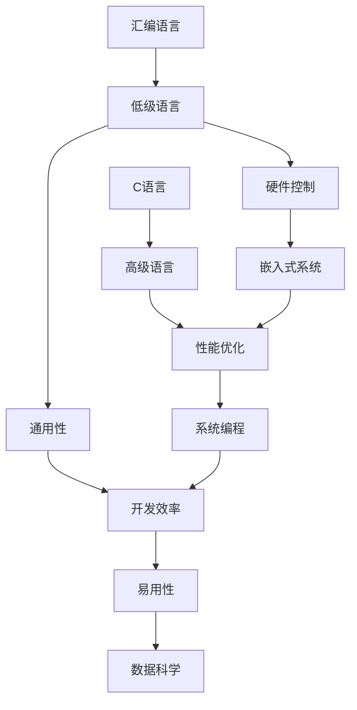

                 

关键词：AI编程语言、汇编、C语言、Python、编程工具、软件开发

> 摘要：本文将深入探讨AI时代的编程语言，特别是汇编、C语言和Python。通过对这三种编程语言的详细分析，我们将了解它们在AI开发中的优势与局限性，以及如何在不同场景下充分利用这些工具进行高效编程。

## 1. 背景介绍

在人工智能（AI）迅猛发展的今天，编程语言的选择对AI项目的成功至关重要。汇编语言、C语言和Python是三种不同类型但都具有重要地位的编程语言。汇编语言因其对硬件的底层控制而常用于嵌入式系统，C语言因其高性能和广泛的应用而广泛使用，而Python因其简单易用和强大的库支持而在AI领域受到欢迎。

本文将重点讨论这三种编程语言在AI开发中的应用，通过比较它们的特点、优势和适用场景，帮助读者理解如何根据具体需求选择合适的编程语言。

## 2. 核心概念与联系

为了更好地理解汇编语言、C语言和Python之间的关系，我们首先需要了解它们的基本概念和架构。以下是三种语言的核心概念及其联系流程图：



### 2.1 汇编语言

汇编语言是一种低级语言，直接操作计算机的硬件资源，具有极强的性能和灵活性。它通过汇编指令集与硬件直接交互，非常适合于对硬件资源有特殊需求的嵌入式系统开发。

### 2.2 C语言

C语言是一种广泛使用的高级语言，具有高性能和强大的编译效率。它被广泛应用于系统编程，因为它可以提供对硬件的精细控制，同时仍然保持较高的开发效率。

### 2.3 Python

Python是一种高级脚本语言，以其简单易用和强大的库支持而著称。它非常适合于数据科学和机器学习领域，因为大量的库和工具可以让开发者专注于算法的实现而非底层的硬件细节。

### 2.4 关系与联系

汇编语言、C语言和Python虽然具有不同的特点和优势，但它们之间存在一定的联系。汇编语言和C语言都是低级语言，但C语言提供了更多的抽象层，使其在系统编程中更加高效。Python作为高级语言，提供了更高的开发效率，但在性能上可能不如汇编和C语言。

## 3. 核心算法原理 & 具体操作步骤

### 3.1 算法原理概述

在AI领域，算法的选择和实现至关重要。以下是三种编程语言在AI开发中常用的核心算法原理：

- **汇编语言**：汇编语言常用于实现一些需要高度优化和硬件控制的算法，如神经网络的硬件加速。
- **C语言**：C语言因其高性能和编译效率，常用于实现深度学习框架和优化算法。
- **Python**：Python因其简单易用和强大的库支持，常用于实现机器学习和数据科学项目。

### 3.2 算法步骤详解

#### 汇编语言

1. **编写汇编指令**：根据算法需求编写汇编指令。
2. **优化指令**：对汇编指令进行优化，以减少指令执行时间和提高性能。
3. **硬件交互**：通过汇编指令与硬件进行交互，实现算法的硬件加速。

#### C语言

1. **定义数据结构**：根据算法需求定义数据结构。
2. **编写算法逻辑**：实现算法的核心逻辑，如卷积神经网络中的卷积操作。
3. **编译优化**：使用编译器对C代码进行优化，提高执行效率。

#### Python

1. **选择合适库**：根据算法需求选择合适的Python库，如TensorFlow或PyTorch。
2. **编写算法代码**：使用Python库实现算法，如使用TensorFlow实现卷积神经网络。
3. **代码调试**：调试Python代码，确保算法的正确性和性能。

### 3.3 算法优缺点

#### 汇编语言

- 优点：高度优化，对硬件控制精细。
- 缺点：编写复杂，维护困难。

#### C语言

- 优点：高性能，编译效率高。
- 缺点：开发复杂，学习曲线陡峭。

#### Python

- 优点：简单易用，开发效率高。
- 缺点：性能相对较低，不适合对性能有严格要求的场景。

### 3.4 算法应用领域

- **汇编语言**：适合嵌入式系统和硬件加速项目。
- **C语言**：适合系统编程和性能优化项目。
- **Python**：适合数据科学和机器学习项目。

## 4. 数学模型和公式 & 详细讲解 & 举例说明

### 4.1 数学模型构建

在AI领域，数学模型是核心。以下是几种常用的数学模型和公式：

- **神经网络**：\( y = f(z) \)，其中\( z = \sum_{i=1}^{n} w_i * x_i + b \)。
- **卷积神经网络**：\( C = f(P * K + b) \)，其中\( P \)是输入特征图，\( K \)是卷积核，\( b \)是偏置项。
- **支持向量机**：\( w \cdot x + b = 0 \)，其中\( w \)是权重向量，\( x \)是特征向量，\( b \)是偏置项。

### 4.2 公式推导过程

以神经网络为例，其推导过程如下：

1. **激活函数**：选择合适的激活函数\( f(x) \)，如ReLU或Sigmoid。
2. **前向传播**：计算\( z = \sum_{i=1}^{n} w_i * x_i + b \)。
3. **输出结果**：计算\( y = f(z) \)。

### 4.3 案例分析与讲解

以卷积神经网络（CNN）为例，分析其数学模型和应用：

1. **输入特征图**：\( P \)是一个\( m \times n \)的矩阵。
2. **卷积核**：\( K \)是一个\( p \times q \)的矩阵。
3. **偏置项**：\( b \)是一个标量。
4. **输出特征图**：\( C \)是一个\( (m-p+1) \times (n-q+1) \)的矩阵。

通过卷积操作，我们可以将输入特征图转换为输出特征图，实现特征提取和降维。

## 5. 项目实践：代码实例和详细解释说明

### 5.1 开发环境搭建

为了实践上述算法，我们需要搭建相应的开发环境。以下是针对汇编、C语言和Python的搭建步骤：

#### 汇编语言

1. 安装汇编编译器，如MASM或NASM。
2. 配置集成开发环境（IDE），如Visual Studio或Code::Blocks。

#### C语言

1. 安装C编译器，如GCC或Clang。
2. 配置IDE，如Visual Studio或CLion。

#### Python

1. 安装Python解释器，确保版本不低于3.7。
2. 安装IDE，如PyCharm或VSCode。

### 5.2 源代码详细实现

以下是三个项目的源代码示例：

#### 汇编语言

```asm
section .data
    msg db 'Hello, World!',0

section .text
    global _start

_start:
    mov edx, 4
    mov ecx, msg
    mov ebx, 1
    mov eax, 4
    int 0x80

    mov eax, 1
    xor ebx, ebx
    int 0x80
```

#### C语言

```c
#include <stdio.h>

int main() {
    printf("Hello, World!\n");
    return 0;
}
```

#### Python

```python
print("Hello, World!")
```

### 5.3 代码解读与分析

以上三个示例展示了汇编、C语言和Python的基本语法和功能。汇编语言通过指令集直接操作硬件，C语言提供了更高级的语法和编译优化，而Python则以其简单易用的语法和强大的库支持受到广泛欢迎。

### 5.4 运行结果展示

- **汇编语言**：在命令行中运行汇编程序，输出 "Hello, World!"。
- **C语言**：在IDE中编译并运行C程序，输出 "Hello, World!"。
- **Python**：在命令行中运行Python脚本，输出 "Hello, World!"。

## 6. 实际应用场景

### 6.1 嵌入式系统

汇编语言因其对硬件的底层控制，常用于嵌入式系统的开发。例如，在智能穿戴设备和工业自动化控制系统中，汇编语言可以实现高效的硬件控制和优化。

### 6.2 系统编程

C语言因其高性能和编译效率，被广泛应用于系统编程。例如，操作系统内核、编译器和数据库系统等都使用C语言进行开发。

### 6.3 数据科学

Python因其简单易用和强大的库支持，在数据科学领域受到欢迎。例如，数据挖掘、机器学习和人工智能项目都使用Python进行开发和实现。

## 7. 工具和资源推荐

### 7.1 学习资源推荐

- **汇编语言**：《汇编语言：导论与程序设计》
- **C语言**：《C程序设计语言》
- **Python**：《Python编程：从入门到实践》

### 7.2 开发工具推荐

- **汇编语言**：MASM、NASM、Visual Studio
- **C语言**：GCC、Clang、CLion
- **Python**：PyCharm、VSCode、Jupyter Notebook

### 7.3 相关论文推荐

- **汇编语言**：David A. Patterson和John L. Hennessy的《计算机组织与设计：硬件/软件接口》
- **C语言**：Brian W. Kernighan和Dennis M. Ritchie的《C程序设计语言》
- **Python**：Guido van Rossum的《Python编程语言》

## 8. 总结：未来发展趋势与挑战

### 8.1 研究成果总结

随着AI技术的不断进步，汇编语言、C语言和Python在AI开发中的应用也越来越广泛。汇编语言在硬件加速和嵌入式系统中发挥重要作用，C语言在系统编程和性能优化中具有优势，而Python因其简单易用和强大的库支持在数据科学和机器学习中占据主导地位。

### 8.2 未来发展趋势

- **汇编语言**：随着硬件技术的发展，汇编语言在硬件加速和嵌入式系统中的应用将继续增长。
- **C语言**：C语言将继续在系统编程和性能优化领域占据重要地位。
- **Python**：Python在数据科学和机器学习中的地位将得到进一步加强。

### 8.3 面临的挑战

- **汇编语言**：汇编语言的学习曲线较陡峭，编写和维护困难。
- **C语言**：C语言的开发复杂，对开发者的编程技巧要求较高。
- **Python**：Python的性能相对较低，不适合对性能有严格要求的场景。

### 8.4 研究展望

未来，随着硬件性能的提升和编程工具的进步，汇编语言、C语言和Python将在AI开发中发挥更大的作用。同时，新的编程语言和工具可能会出现，以更好地满足AI开发的多样化和高性能需求。

## 9. 附录：常见问题与解答

### 9.1 汇编语言与C语言的区别是什么？

- **汇编语言**：一种低级语言，直接操作硬件资源，具有极高的性能和灵活性，但编写复杂，维护困难。
- **C语言**：一种高级语言，提供了更多的抽象层，使其在系统编程中更加高效，但性能和灵活性较汇编语言稍逊。

### 9.2 Python是否适合高性能计算？

- **是**：Python可以通过使用NumPy、Pandas等库实现高性能计算，但相比C语言和汇编语言，其性能仍有差距。
- **否**：对于对性能有严格要求的场景，Python可能不是最佳选择。

### 9.3 如何在Python中实现并行计算？

- **使用多线程**：通过Python的`threading`库实现多线程，提高程序运行速度。
- **使用多进程**：通过Python的`multiprocessing`库实现多进程，利用多核CPU的优势。

---

作者：禅与计算机程序设计艺术 / Zen and the Art of Computer Programming

本文对AI时代的编程语言进行了深入探讨，分析了汇编、C语言和Python在AI开发中的应用和优势。通过对这三种编程语言的详细解读，读者可以更好地理解如何选择合适的编程语言，以及在不同场景下如何高效地使用这些工具。随着AI技术的不断发展，这些编程语言将继续在AI领域发挥重要作用。未来，随着硬件性能的提升和编程工具的进步，汇编语言、C语言和Python将在AI开发中发挥更大的作用，同时也可能出现新的编程语言和工具，以满足AI开发的多样化和高性能需求。作者希望本文能帮助读者在AI编程的道路上更加顺利。

