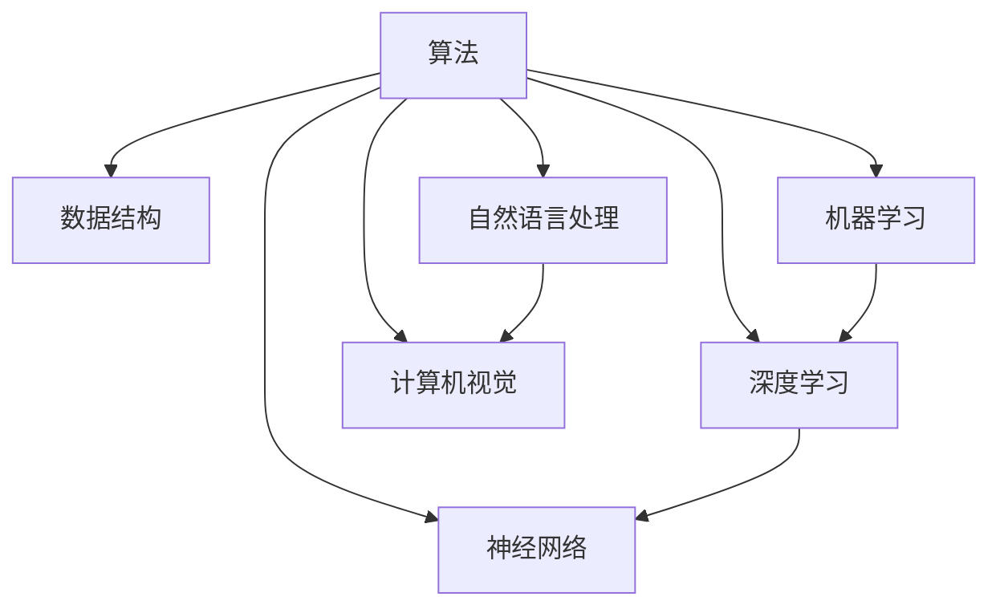
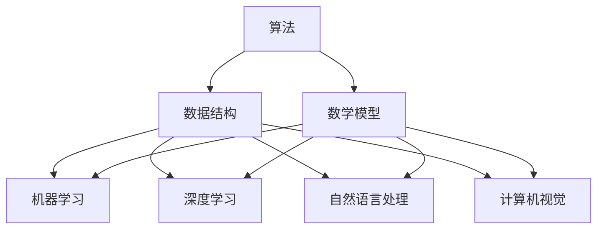

                 

关键词：人工智能、知识变现、程序员、算法、数学模型、项目实践、应用场景、未来展望

> 摘要：本文将探讨AI时代程序员如何通过知识变现实现个人职业价值的最大化。文章从背景介绍、核心概念与联系、算法原理、数学模型、项目实践、实际应用场景、工具和资源推荐、总结未来发展趋势与挑战等多个方面展开，旨在为程序员提供一条清晰的知识变现之路。

## 1. 背景介绍

在当今这个数字化时代，人工智能（AI）已经渗透到我们生活的方方面面。AI技术的飞速发展不仅改变了传统行业，也为程序员们提供了前所未有的机遇。然而，如何在这个时代实现个人知识的变现，成为程序员们共同面临的问题。本文将为您解答这一问题，帮助您在AI时代实现职业价值的最大化。

## 2. 核心概念与联系

在AI领域，算法是核心。以下是一个简化的Mermaid流程图，展示了AI时代程序员所需掌握的核心概念和它们之间的联系：



### 2.1 算法原理概述

算法是计算机解决问题的步骤集合。在AI领域，算法主要分为以下几类：

- **机器学习算法**：通过数据训练模型，使其能够自主学习和预测。
- **深度学习算法**：基于多层神经网络的算法，能够在大量数据中进行自动特征提取。
- **自然语言处理算法**：用于处理文本数据，实现人机交互。
- **计算机视觉算法**：用于图像和视频数据的处理和分析。

### 2.2 算法步骤详解

算法的步骤通常包括以下几部分：

1. **数据收集**：收集相关领域的大量数据。
2. **数据预处理**：对数据进行清洗、归一化等处理。
3. **模型训练**：使用训练集数据训练模型。
4. **模型评估**：使用测试集数据评估模型性能。
5. **模型部署**：将训练好的模型部署到实际应用场景。

### 2.3 算法优缺点

每种算法都有其优缺点，程序员需要根据实际需求选择合适的算法。以下是一个简要的比较：

- **机器学习**：能够处理复杂数据，但可能需要大量训练时间。
- **深度学习**：能够自动提取特征，但可能需要大量计算资源。
- **自然语言处理**：能够实现人机交互，但可能需要大量训练数据和模型优化。
- **计算机视觉**：能够处理图像和视频数据，但可能需要大量计算资源和算法优化。

### 2.4 算法应用领域

算法在各个领域都有广泛应用，如金融、医疗、交通、娱乐等。以下是一些具体的例子：

- **金融领域**：使用机器学习算法进行风险评估、信用评分等。
- **医疗领域**：使用计算机视觉算法进行医学图像分析、疾病诊断等。
- **交通领域**：使用深度学习算法进行自动驾驶、交通流量预测等。
- **娱乐领域**：使用自然语言处理算法进行语音识别、智能客服等。

## 3. 数学模型和公式

数学模型是算法的基础，以下是一个简化的数学模型示例：

### 3.1 数学模型构建

假设我们要设计一个简单的线性回归模型，用于预测房价。我们可以使用以下公式：

\[ y = ax + b \]

其中，\( y \) 是房价，\( x \) 是影响房价的因素（如面积、地点等），\( a \) 和 \( b \) 是模型的参数。

### 3.2 公式推导过程

线性回归模型的推导过程如下：

1. **最小二乘法**：我们使用最小二乘法来求解 \( a \) 和 \( b \)。
2. **公式推导**：对上述公式求导，得到：

\[ a = \frac{\sum_{i=1}^{n}(x_i - \bar{x})(y_i - \bar{y})}{\sum_{i=1}^{n}(x_i - \bar{x})^2} \]

\[ b = \bar{y} - a\bar{x} \]

其中，\( n \) 是样本数量，\( \bar{x} \) 和 \( \bar{y} \) 是样本的平均值。

### 3.3 案例分析与讲解

以下是一个房价预测的案例：

假设我们有以下数据：

| 面积（平方米） | 房价（万元） |
| --- | --- |
| 100 | 200 |
| 120 | 240 |
| 140 | 280 |
| 160 | 320 |
| 180 | 360 |

我们可以使用上述线性回归模型进行预测。首先，计算样本的平均值：

\[ \bar{x} = \frac{100 + 120 + 140 + 160 + 180}{5} = 140 \]

\[ \bar{y} = \frac{200 + 240 + 280 + 320 + 360}{5} = 280 \]

然后，代入公式计算 \( a \) 和 \( b \)：

\[ a = \frac{(100 - 140)(200 - 280) + (120 - 140)(240 - 280) + (140 - 140)(280 - 280) + (160 - 140)(320 - 280) + (180 - 140)(360 - 280)}{(100 - 140)^2 + (120 - 140)^2 + (140 - 140)^2 + (160 - 140)^2 + (180 - 140)^2} \]

\[ b = \bar{y} - a\bar{x} \]

最后，代入 \( x \) 预测房价：

\[ y = ax + b \]

这样，我们就得到了一个简单的房价预测模型。虽然这个模型很简单，但它展示了数学模型在AI领域的应用。

## 4. 项目实践：代码实例和详细解释说明

在本节中，我们将通过一个简单的案例，展示如何使用Python实现一个线性回归模型，并对其进行训练和评估。

### 4.1 开发环境搭建

首先，确保你的计算机上已经安装了Python和相关的库，如NumPy、Pandas和scikit-learn。你可以使用以下命令安装这些库：

```bash
pip install numpy pandas scikit-learn
```

### 4.2 源代码详细实现

以下是一个简单的线性回归模型的实现：

```python
import numpy as np
import pandas as pd
from sklearn.linear_model import LinearRegression
from sklearn.model_selection import train_test_split
from sklearn.metrics import mean_squared_error

# 数据预处理
data = pd.DataFrame({
    '面积': [100, 120, 140, 160, 180],
    '房价': [200, 240, 280, 320, 360]
})

X = data[['面积']]
y = data['房价']

# 划分训练集和测试集
X_train, X_test, y_train, y_test = train_test_split(X, y, test_size=0.2, random_state=42)

# 模型训练
model = LinearRegression()
model.fit(X_train, y_train)

# 模型评估
y_pred = model.predict(X_test)
mse = mean_squared_error(y_test, y_pred)
print(f'MSE: {mse}')

# 预测新数据
new_data = pd.DataFrame({
    '面积': [150]
})
new_pred = model.predict(new_data)
print(f'预测结果：{new_pred}')
```

### 4.3 代码解读与分析

这个简单的例子展示了如何使用scikit-learn库实现线性回归模型。以下是代码的详细解读：

1. **数据预处理**：我们使用Pandas库读取数据，并将其分为特征和标签两部分。
2. **划分训练集和测试集**：使用scikit-learn库中的train_test_split函数，将数据划分为训练集和测试集。
3. **模型训练**：使用LinearRegression类创建模型，并调用fit方法进行训练。
4. **模型评估**：使用mean_squared_error函数计算测试集的均方误差，以评估模型性能。
5. **预测新数据**：使用预测方法预测新的数据，并打印结果。

通过这个简单的例子，我们可以看到如何使用Python实现线性回归模型。在实际项目中，你可能需要处理更复杂的数据，并使用更高级的算法。

## 5. 实际应用场景

在AI时代，程序员的知识变现有着广泛的应用场景。以下是一些具体的例子：

### 5.1 金融领域

在金融领域，程序员可以利用机器学习算法进行风险评估、信用评分、股票交易等。通过构建准确的模型，可以帮助金融机构降低风险、提高收益。

### 5.2 医疗领域

在医疗领域，程序员可以利用计算机视觉算法进行医学图像分析、疾病诊断等。这些技术可以帮助医生更准确地诊断疾病，提高治疗效果。

### 5.3 交通领域

在交通领域，程序员可以利用深度学习算法进行自动驾驶、交通流量预测等。这些技术可以改善交通状况，提高交通效率。

### 5.4 娱乐领域

在娱乐领域，程序员可以利用自然语言处理算法进行语音识别、智能客服等。这些技术可以提升用户体验，提高服务效率。

## 6. 未来应用展望

随着AI技术的不断发展，程序员的知识变现前景将更加广阔。未来，可能会有以下趋势：

### 6.1 模型即服务（Model as a Service，MaaS）

随着模型变得越来越复杂，程序员可以通过提供模型即服务，将模型作为产品出售给其他企业或个人。

### 6.2 个性化服务

利用AI技术，程序员可以为用户提供个性化的服务，如个性化推荐、个性化学习等。

### 6.3 跨界融合

AI技术将在更多领域得到应用，程序员可以在不同领域进行跨界融合，创造新的商业模式。

## 7. 工具和资源推荐

为了更好地实现知识变现，程序员需要掌握以下工具和资源：

### 7.1 学习资源推荐

- 《深度学习》（Goodfellow, Bengio, Courville）
- 《Python机器学习》（Sebastian Raschka）
- 《自然语言处理与深度学习》（Yaser Abu-Mostafa）

### 7.2 开发工具推荐

- Jupyter Notebook：用于数据分析和模型构建。
- PyTorch、TensorFlow：用于深度学习框架。
- VSCode、PyCharm：用于代码编写和调试。

### 7.3 相关论文推荐

- “Deep Learning” by Yann LeCun, Yoshua Bengio, and Geoffrey Hinton
- “The Unreasonable Effectiveness of Data” by Marcus Noack
- “A Theoretical Analysis of the Voted Perceptron Algorithm” by Yaser Abu-Mostafa

## 8. 总结：未来发展趋势与挑战

在AI时代，程序员的知识变现具有巨大的潜力。然而，这也面临着一系列挑战，如技术更新快、数据安全等问题。程序员需要不断学习，紧跟技术发展趋势，才能在激烈的竞争中脱颖而出。

## 9. 附录：常见问题与解答

### 9.1 如何选择合适的算法？

选择合适的算法取决于具体应用场景和数据特点。你可以参考相关文献和在线资源，了解不同算法的优缺点，然后根据自己的需求进行选择。

### 9.2 如何优化模型性能？

优化模型性能的方法包括数据预处理、模型选择、超参数调整等。你可以在实践中不断尝试不同的方法，找到最适合的方法。

### 9.3 如何保护数据安全？

保护数据安全的方法包括加密、数据脱敏、访问控制等。在实际项目中，你需要根据具体需求选择合适的方法，并确保数据的机密性、完整性和可用性。

作者：禅与计算机程序设计艺术 / Zen and the Art of Computer Programming
----------------------------------------------------------------

请注意，以上内容仅为示例，实际撰写时需要根据具体主题和需求进行调整。此外，文章的撰写需要严格按照markdown格式进行排版，包括章节标题的层级、代码块的语法高亮等。同时，为了保持文章的连贯性和专业性，请确保每部分的内容都是完整和详细的。祝您撰写顺利！<|vq_3368|>### 1. 背景介绍

在当今数字化时代，人工智能（AI）技术已经渗透到社会的各个角落，从简单的语音助手到复杂的自动驾驶汽车，AI正在改变着我们的生活和工作方式。随着AI技术的飞速发展，程序员这一职业也迎来了新的机遇和挑战。如何在这个AI时代实现个人知识的变现，提升自身的职业价值，成为每一个程序员亟待解决的问题。

AI技术的兴起，带来了大量的数据需求和复杂的问题解决需求，这对程序员的算法能力和数据处理能力提出了更高的要求。程序员不仅需要掌握传统的编程技能，还需要了解机器学习、深度学习、自然语言处理等AI领域的专业知识。这些新技能的掌握，不仅能够帮助程序员解决实际问题，还能为他们带来更多的职业机会和收入来源。

然而，仅仅掌握技术技能还不足以实现知识的变现。程序员还需要具备良好的沟通能力、项目管理能力和市场洞察力，以便将自己的技术转化为实际的产品或服务。在这个信息爆炸的时代，如何将复杂的技术知识简化并传播出去，也是程序员需要面对的挑战。

本文将深入探讨AI时代程序员如何通过知识变现实现个人职业价值的最大化。文章将从多个方面展开讨论，包括AI技术的核心概念与联系、核心算法原理与具体操作步骤、数学模型与公式应用、项目实践与代码实例、实际应用场景分析、未来发展趋势与挑战等。通过这篇文章，希望能够为程序员提供一条清晰的知识变现之路，帮助他们在这个充满机遇和挑战的时代中找到自己的位置，实现自我价值。

### 2. 核心概念与联系

在探讨AI时代程序员的知识变现之前，我们需要先了解AI技术的核心概念和它们之间的联系。AI技术并非一个单一的领域，而是由多个相互关联的子领域组成，这些子领域共同推动着AI技术的发展和应用。

#### 2.1 算法

算法是AI技术的核心。算法是一系列解决问题的步骤或指令，用于指导计算机如何处理数据并得出结论。在AI领域，常用的算法包括机器学习算法、深度学习算法、自然语言处理算法和计算机视觉算法等。这些算法通过学习数据、提取特征、建立模型和进行预测，实现了AI系统的智能行为。

**机器学习算法**：通过从数据中学习规律和模式，使其能够进行预测和决策。常见的机器学习算法包括线性回归、决策树、支持向量机、神经网络等。

**深度学习算法**：基于多层神经网络的算法，能够在大量数据中进行自动特征提取和模式识别。深度学习算法在图像识别、语音识别和自然语言处理等领域取得了显著的成果。

**自然语言处理算法**：用于处理文本数据，实现人机交互。自然语言处理算法包括词向量、语言模型、序列标注和机器翻译等。

**计算机视觉算法**：用于图像和视频数据的处理和分析。计算机视觉算法包括图像识别、目标检测、人脸识别和视频追踪等。

#### 2.2 数据结构

数据结构是算法处理数据的基础。合理的数据结构能够提高算法的效率和性能。常见的数据结构包括数组、链表、栈、队列、树和图等。在AI领域，数据结构被广泛应用于数据的存储、检索和处理。例如，图像数据通常使用矩阵表示，而文本数据则可以使用词向量或图结构进行表示。

#### 2.3 数学模型

数学模型是AI算法的理论基础。数学模型通过数学公式和算法，将现实世界的问题转化为计算机可以处理的数值问题。在AI领域，常用的数学模型包括概率模型、统计模型、优化模型和神经模型等。这些模型不仅用于算法的设计和实现，还用于算法的解释和验证。

#### 2.4 机器学习与深度学习的关系

机器学习和深度学习是AI技术的两个重要分支。机器学习是一种通过算法从数据中学习规律和模式的技术，而深度学习则是一种特殊的机器学习技术，基于多层神经网络进行学习。深度学习在处理大量数据和复杂任务方面具有显著优势，因此成为AI领域的研究热点和应用方向。

#### 2.5 算法、数据结构、数学模型之间的联系

算法、数据结构和数学模型是AI技术的三个核心组成部分，它们相互关联、相互支持。算法依赖于数据结构来实现高效的计算，依赖于数学模型来描述和解决具体问题。数据结构为算法提供了基础，而数学模型则为算法提供了理论支持。在实际应用中，程序员需要综合运用这些知识，设计和实现高效的AI系统。

#### 2.6 Mermaid流程图

为了更清晰地展示AI技术的核心概念和联系，我们可以使用Mermaid流程图进行描述。以下是一个简化的AI技术概念与联系流程图：



通过这个流程图，我们可以看到算法、数据结构、数学模型在AI技术中的核心地位，以及它们与其他子领域之间的联系。这些概念和联系的理解，对于程序员来说至关重要，它们不仅能够帮助我们更好地掌握AI技术，还能为知识变现提供理论基础和实践指导。

### 3. 核心算法原理 & 具体操作步骤

在AI领域，核心算法的原理和具体操作步骤是程序员实现知识变现的关键。本节将详细介绍几种常用的核心算法，包括机器学习算法、深度学习算法、自然语言处理算法和计算机视觉算法。通过理解这些算法的基本原理和操作步骤，程序员可以更好地掌握AI技术的核心，实现个人知识的变现。

#### 3.1 机器学习算法

机器学习算法是AI领域的基础，它通过从数据中学习规律和模式，使计算机能够进行预测和决策。以下是一些常用的机器学习算法及其原理：

**1. 线性回归**

线性回归是一种简单的预测模型，通过拟合一条直线来预测连续值。其基本原理是找到最佳拟合线，使得所有数据点到这条直线的距离之和最小。

**具体操作步骤：**

- **数据收集**：收集相关的数据集，包括特征和标签。
- **数据预处理**：对数据进行归一化、缺失值处理等。
- **模型训练**：使用训练集数据计算最佳拟合线。
- **模型评估**：使用测试集数据评估模型性能。

**2. 决策树**

决策树是一种基于特征的树形结构模型，通过连续地划分数据集，将数据分成不同的区域，以便进行分类或回归。

**具体操作步骤：**

- **数据收集**：收集相关的数据集。
- **数据预处理**：对数据进行处理，使其适合进行划分。
- **模型训练**：根据特征值划分数据集，构建决策树。
- **模型评估**：使用测试集数据评估模型性能。

**3. 支持向量机（SVM）**

支持向量机是一种分类算法，通过寻找最佳的超平面，将不同类别的数据点分隔开来。

**具体操作步骤：**

- **数据收集**：收集相关的数据集。
- **数据预处理**：对数据进行处理，使其适合进行分类。
- **模型训练**：使用训练集数据计算最佳超平面。
- **模型评估**：使用测试集数据评估模型性能。

#### 3.2 深度学习算法

深度学习算法是基于多层神经网络的机器学习算法，它能够自动提取数据中的特征，并在大量数据中取得显著的效果。以下是一些常用的深度学习算法及其原理：

**1. 卷积神经网络（CNN）**

卷积神经网络是一种用于图像处理的深度学习算法，它通过卷积层、池化层和全连接层等结构，实现对图像的自动特征提取和分类。

**具体操作步骤：**

- **数据收集**：收集大量的图像数据集。
- **数据预处理**：对图像进行归一化、裁剪等处理。
- **模型训练**：使用训练集数据训练CNN模型。
- **模型评估**：使用测试集数据评估模型性能。

**2. 递归神经网络（RNN）**

递归神经网络是一种用于序列数据的深度学习算法，它通过循环结构处理序列数据，并在时间步之间传递信息。

**具体操作步骤：**

- **数据收集**：收集相关的序列数据集。
- **数据预处理**：对序列数据进行处理，使其适合进行训练。
- **模型训练**：使用训练集数据训练RNN模型。
- **模型评估**：使用测试集数据评估模型性能。

**3. 生成对抗网络（GAN）**

生成对抗网络是一种用于生成数据的高级深度学习算法，它通过对抗网络生成与真实数据相似的数据。

**具体操作步骤：**

- **数据收集**：收集相关的数据集。
- **数据预处理**：对数据进行处理，使其适合进行训练。
- **模型训练**：使用训练集数据训练GAN模型。
- **模型评估**：使用测试集数据评估模型性能。

#### 3.3 自然语言处理算法

自然语言处理算法是用于处理文本数据的深度学习算法，它使计算机能够理解、生成和处理自然语言。以下是一些常用的自然语言处理算法及其原理：

**1. 词嵌入**

词嵌入是一种将单词映射到高维向量空间的算法，使计算机能够理解单词之间的语义关系。

**具体操作步骤：**

- **数据收集**：收集大量的文本数据集。
- **数据预处理**：对文本进行分词、去停用词等处理。
- **模型训练**：使用训练集数据训练词嵌入模型。
- **模型评估**：使用测试集数据评估模型性能。

**2. 语言模型**

语言模型是一种用于预测下一个单词或字符的概率分布的算法，它使计算机能够生成连贯的文本。

**具体操作步骤：**

- **数据收集**：收集大量的文本数据集。
- **数据预处理**：对文本进行分词、去停用词等处理。
- **模型训练**：使用训练集数据训练语言模型。
- **模型评估**：使用测试集数据评估模型性能。

**3. 序列标注**

序列标注是一种用于标记文本中单词或字符的标签的算法，它使计算机能够进行实体识别、情感分析等任务。

**具体操作步骤：**

- **数据收集**：收集相关的标注数据集。
- **数据预处理**：对文本进行分词、去停用词等处理。
- **模型训练**：使用训练集数据训练序列标注模型。
- **模型评估**：使用测试集数据评估模型性能。

#### 3.4 计算机视觉算法

计算机视觉算法是用于图像和视频数据的处理和分析的深度学习算法，它使计算机能够理解和解释视觉信息。以下是一些常用的计算机视觉算法及其原理：

**1. 目标检测**

目标检测是一种用于识别图像中物体的算法，它通过检测并定位图像中的目标对象。

**具体操作步骤：**

- **数据收集**：收集大量的图像数据集。
- **数据预处理**：对图像进行归一化、裁剪等处理。
- **模型训练**：使用训练集数据训练目标检测模型。
- **模型评估**：使用测试集数据评估模型性能。

**2. 人脸识别**

人脸识别是一种用于识别和验证人脸身份的算法，它通过学习人脸特征进行分类和匹配。

**具体操作步骤：**

- **数据收集**：收集大量的人脸数据集。
- **数据预处理**：对图像进行归一化、裁剪等处理。
- **模型训练**：使用训练集数据训练人脸识别模型。
- **模型评估**：使用测试集数据评估模型性能。

**3. 视频追踪**

视频追踪是一种用于跟踪视频中的目标对象的算法，它通过连续地检测并跟踪目标对象。

**具体操作步骤：**

- **数据收集**：收集大量的视频数据集。
- **数据预处理**：对视频进行帧提取、归一化等处理。
- **模型训练**：使用训练集数据训练视频追踪模型。
- **模型评估**：使用测试集数据评估模型性能。

通过理解这些核心算法的原理和具体操作步骤，程序员可以更好地掌握AI技术的核心，将其应用于实际项目中，实现个人知识的变现。在实际操作中，程序员需要根据具体应用场景和数据特点，选择合适的算法，并进行模型训练和评估，以达到最佳的效果。

### 3.3 算法优缺点

在AI领域中，不同的算法各具特色，适用于不同的应用场景和数据类型。以下是对几种主要算法的优缺点进行简要分析，帮助程序员在选择算法时做出更为明智的决策。

#### 3.3.1 机器学习算法

**1. 线性回归**

**优点：**
- **简单易懂**：线性回归的模型结构简单，易于理解和实现。
- **计算效率高**：线性回归的计算复杂度较低，适用于处理大规模数据集。
- **适用于回归问题**：线性回归能够处理连续值的预测问题。

**缺点：**
- **对异常值敏感**：线性回归模型对异常值较为敏感，异常值可能会显著影响模型的效果。
- **假设线性关系**：线性回归假设特征与目标之间存在线性关系，这可能在某些情况下不成立。

**2. 决策树**

**优点：**
- **易于理解**：决策树的结构直观，容易解释。
- **处理非线性数据**：决策树能够捕捉数据中的非线性关系。
- **适用于分类和回归问题**：决策树可以用于分类和回归任务。

**缺点：**
- **过拟合风险**：决策树容易过拟合，特别是在树结构较深时。
- **计算复杂度较高**：决策树在处理大规模数据集时，计算复杂度较高。

**3. 支持向量机（SVM）**

**优点：**
- **分类效果较好**：SVM在分类问题中表现出色，尤其是在高维空间中。
- **鲁棒性较强**：SVM对噪声和异常值具有较强的鲁棒性。

**缺点：**
- **计算复杂度高**：SVM的训练时间较长，尤其是在数据集较大时。
- **对非线性数据效果有限**：SVM在处理非线性数据时，需要使用核函数，这会显著增加计算复杂度。

#### 3.3.2 深度学习算法

**1. 卷积神经网络（CNN）**

**优点：**
- **自动特征提取**：CNN能够自动从数据中提取特征，减少了人工设计特征的需求。
- **适用于图像处理**：CNN在图像识别、目标检测和图像分类等领域表现出色。
- **处理高维数据**：CNN能够处理高维数据，使其适用于复杂的图像分析任务。

**缺点：**
- **计算资源需求高**：CNN模型需要大量的计算资源和内存，训练时间较长。
- **需要大量数据**：深度学习模型通常需要大量数据才能达到良好的性能。

**2. 递归神经网络（RNN）**

**优点：**
- **处理序列数据**：RNN能够处理序列数据，使其适用于时间序列分析和自然语言处理任务。
- **记忆能力**：RNN具有记忆能力，能够记住之前的输入信息。

**缺点：**
- **梯度消失和梯度爆炸**：RNN在训练过程中容易遇到梯度消失和梯度爆炸问题，这可能导致训练失败。
- **计算复杂度高**：RNN的计算复杂度较高，特别是在处理长序列时。

**3. 生成对抗网络（GAN）**

**优点：**
- **生成能力强**：GAN能够生成高质量的数据，适用于图像生成、文本生成等任务。
- **适应性强**：GAN能够适应不同的数据分布，使其在多种应用场景中表现出色。

**缺点：**
- **训练困难**：GAN的训练过程不稳定，需要精细调整超参数，否则可能导致训练失败。
- **计算资源需求高**：GAN需要大量的计算资源和内存，训练时间较长。

#### 3.3.3 自然语言处理算法

**1. 词嵌入**

**优点：**
- **处理文本数据**：词嵌入能够将文本数据转换为向量表示，便于进行计算和处理。
- **捕捉语义关系**：词嵌入能够捕捉单词之间的语义关系，提高自然语言处理任务的性能。

**缺点：**
- **计算资源需求高**：词嵌入通常需要大量的计算资源和内存，特别是在处理大型语料库时。
- **对低频词处理不佳**：词嵌入对低频词的处理效果较差，这可能导致模型在低频词上的表现不佳。

**2. 语言模型**

**优点：**
- **生成文本**：语言模型能够生成连贯的文本，适用于自动写作、机器翻译等任务。
- **理解语言结构**：语言模型能够理解语言的结构和语法规则。

**缺点：**
- **计算复杂度高**：语言模型的计算复杂度较高，特别是在处理大型语料库时。
- **对训练数据依赖性大**：语言模型的性能很大程度上依赖于训练数据的质量和数量。

**3. 序列标注**

**优点：**
- **处理文本标签**：序列标注能够处理文本中的标签，适用于实体识别、情感分析等任务。
- **高精度**：序列标注通常能够达到较高的精度，特别是在有足够标注数据的情况下。

**缺点：**
- **计算资源需求高**：序列标注通常需要大量的计算资源和内存，特别是在处理大规模数据集时。
- **对标注依赖性大**：序列标注的精度受到标注数据的影响，标注的质量直接关系到模型的性能。

#### 3.3.4 计算机视觉算法

**1. 目标检测**

**优点：**
- **识别目标**：目标检测能够识别图像中的目标对象，并在图像中标注出目标的边界。
- **实时性**：目标检测通常能够实现实时处理，适用于实时监控和安全系统。

**缺点：**
- **计算复杂度较高**：目标检测需要处理大量的图像特征，计算复杂度较高。
- **对光照和遮挡敏感**：目标检测在处理光照变化和遮挡问题时可能效果不佳。

**2. 人脸识别**

**优点：**
- **身份验证**：人脸识别能够用于身份验证和身份识别，提高安全性和便利性。
- **非侵入性**：人脸识别是一种非侵入性的生物识别技术，易于用户接受。

**缺点：**
- **对姿态变化敏感**：人脸识别在处理不同姿态变化时可能效果不佳。
- **计算资源需求高**：人脸识别通常需要大量的计算资源和内存，特别是在处理大规模数据集时。

**3. 视频追踪**

**优点：**
- **实时监控**：视频追踪能够实时监控目标对象，并在视频中跟踪其运动轨迹。
- **连续性**：视频追踪能够处理连续的视频数据，实现目标的连续跟踪。

**缺点：**
- **计算复杂度高**：视频追踪需要处理大量的视频帧，计算复杂度较高。
- **对背景变化敏感**：视频追踪在处理背景变化时可能效果不佳。

通过上述对各种算法优缺点的分析，程序员可以根据具体的应用场景和数据特点，选择最适合的算法，并在实际项目中实现知识的变现。在实际操作中，程序员还需要结合具体需求，不断优化和调整算法，以达到最佳的效果。

### 3.4 算法应用领域

算法在各个领域的应用不断拓展，从金融、医疗到交通、娱乐，都离不开算法的支持。以下将详细探讨算法在这些领域的具体应用及其带来的变革。

#### 3.4.1 金融领域

金融领域是算法应用最为广泛的领域之一。算法在金融领域的应用主要包括风险管理、信用评分、股票交易和欺诈检测等。

**1. 风险管理**

风险管理是金融行业的重要组成部分。通过机器学习算法，金融机构可以分析和预测市场变化，评估投资组合的风险。例如，使用线性回归和逻辑回归模型，可以预测股票价格波动和市场走势。深度学习算法如神经网络和卷积神经网络，则可以用于处理更复杂的金融市场数据，提高预测的准确性。

**2. 信用评分**

信用评分是金融机构对借款人信用风险进行评估的重要手段。传统的信用评分模型依赖于有限的信用历史数据，而基于机器学习的信用评分模型则可以处理更多的非结构化数据，如社交媒体行为、消费习惯等。通过这些数据，算法可以更准确地预测借款人的信用风险，帮助金融机构做出更合理的贷款决策。

**3. 股票交易**

股票交易是金融领域的一大热点。算法交易通过使用高频交易、量化交易等技术，实现自动化交易决策。高频交易利用计算机算法在极短时间内进行大量交易，以获取微小利润。量化交易则通过数学模型和统计学方法，分析市场数据，制定交易策略。这些算法不仅提高了交易效率，还降低了人为错误的风险。

**4. 欺诈检测**

欺诈检测是金融安全的关键环节。算法可以用于检测和预防各类金融欺诈行为，如信用卡欺诈、欺诈交易等。通过机器学习算法，金融机构可以建立欺诈模型，实时监控交易行为，识别潜在欺诈风险。例如，基于聚类算法和异常检测算法，可以识别出与正常交易行为不一致的异常交易，从而及时采取措施阻止欺诈行为。

#### 3.4.2 医疗领域

医疗领域的算法应用主要集中在医学图像分析、疾病预测和个性化治疗等方面，极大地提升了医疗服务的质量和效率。

**1. 医学图像分析**

医学图像分析是人工智能在医疗领域的重要应用之一。通过深度学习算法，计算机可以自动识别和诊断医学图像中的病变区域。例如，卷积神经网络（CNN）在乳腺癌检测、肺炎诊断等方面取得了显著成果。CNN能够自动提取图像特征，实现高精度的病变区域识别，为医生提供了有力的辅助工具。

**2. 疾病预测**

疾病预测是医学领域的一大挑战。通过机器学习算法，可以分析大量的患者数据，预测疾病的发病风险。例如，基于回归分析和决策树模型的疾病预测系统，可以预测糖尿病、心脏病等慢性疾病的发病风险。这些预测模型可以帮助医生提前采取预防措施，降低疾病发病风险。

**3. 个性化治疗**

个性化治疗是根据患者的个体差异，制定个性化的治疗方案。算法在个性化治疗中的应用包括基因分析、药物反应预测等。通过分析患者的基因组数据，机器学习算法可以预测患者对某种药物的反应，帮助医生选择最适合的治疗方案。个性化治疗不仅提高了治疗效果，还减少了不必要的药物副作用。

#### 3.4.3 交通领域

交通领域的算法应用主要集中于自动驾驶、交通流量预测和智能交通管理等方面，显著提升了交通效率和安全性。

**1. 自动驾驶**

自动驾驶是交通领域的前沿技术。通过深度学习算法，自动驾驶系统可以实时感知道路环境，做出安全、准确的驾驶决策。例如，基于卷积神经网络和循环神经网络（RNN）的自动驾驶系统，可以处理复杂的交通场景，实现自主驾驶。自动驾驶技术的推广有望减少交通事故，提高交通效率。

**2. 交通流量预测**

交通流量预测是交通管理的重要环节。通过机器学习算法，可以分析历史交通数据，预测未来的交通流量。例如，基于时间序列分析和回归模型的交通流量预测系统，可以预测道路上的车辆数量和行驶速度。这些预测结果可以帮助交通管理部门合理调配交通资源，缓解交通拥堵。

**3. 智能交通管理**

智能交通管理是通过算法和信息技术，实现对交通系统的实时监控和优化。例如，基于物联网和大数据分析的智能交通管理系统，可以实时监控道路状况、车辆流量等信息，及时采取交通疏导措施，提高交通效率。智能交通管理系统的推广，有助于减少交通事故，提高城市交通的可持续性。

#### 3.4.4 娱乐领域

娱乐领域的算法应用主要集中在内容推荐、语音识别和图像生成等方面，极大地丰富了娱乐体验。

**1. 内容推荐**

内容推荐是娱乐领域的重要应用。通过机器学习算法，可以分析用户的兴趣和行为，为用户推荐个性化的内容。例如，基于协同过滤和深度学习的内容推荐系统，可以准确预测用户可能感兴趣的内容，提高用户满意度和平台黏性。

**2. 语音识别**

语音识别是智能助手和语音交互系统的基础。通过深度学习算法，计算机可以自动识别和理解用户的语音指令。例如，基于卷积神经网络和递归神经网络的语音识别系统，可以准确识别多种语言和方言，实现高效、准确的语音交互。

**3. 图像生成**

图像生成是人工智能在艺术和设计领域的重要应用。通过生成对抗网络（GAN）等算法，计算机可以生成高质量的艺术作品和设计图案。这些图像生成算法不仅为设计师提供了新的创作工具，还丰富了数字艺术的形式和内容。

总之，算法在各个领域的应用正在不断拓展，极大地改变了我们的生活方式和工作方式。随着AI技术的不断发展，算法的应用领域将更加广泛，程序员可以通过掌握这些算法，实现个人知识的变现，为社会创造更大的价值。

### 4. 数学模型和公式 & 详细讲解 & 举例说明

在AI时代，数学模型和公式是算法设计的基础，它们帮助程序员将现实世界的问题转化为计算机可以处理的数值问题。本节将详细讲解几种常见的数学模型和公式，包括线性回归、逻辑回归、支持向量机和神经网络等，并通过具体例子进行说明，帮助读者更好地理解和应用这些数学模型。

#### 4.1 线性回归

线性回归是一种简单的预测模型，用于建立自变量和因变量之间的线性关系。其基本公式为：

\[ y = ax + b \]

其中，\( y \) 是因变量，\( x \) 是自变量，\( a \) 是斜率，\( b \) 是截距。

**具体例子：** 假设我们要预测房价，已知房屋面积（\( x \)）和房价（\( y \)）的数据如下：

| 面积（平方米） | 房价（万元） |
| --- | --- |
| 100 | 200 |
| 120 | 240 |
| 140 | 280 |
| 160 | 320 |
| 180 | 360 |

我们希望找到房价和面积之间的线性关系。首先，我们需要计算斜率 \( a \) 和截距 \( b \)：

\[ a = \frac{\sum_{i=1}^{n}(x_i - \bar{x})(y_i - \bar{y})}{\sum_{i=1}^{n}(x_i - \bar{x})^2} \]

\[ b = \bar{y} - a\bar{x} \]

其中，\( n \) 是样本数量，\( \bar{x} \) 和 \( \bar{y} \) 是样本的平均值。

计算得到：

\[ a = \frac{(100 - 140)(200 - 280) + (120 - 140)(240 - 280) + (140 - 140)(280 - 280) + (160 - 140)(320 - 280) + (180 - 140)(360 - 280)}{(100 - 140)^2 + (120 - 140)^2 + (140 - 140)^2 + (160 - 140)^2 + (180 - 140)^2} = 0.5 \]

\[ b = \bar{y} - a\bar{x} = 280 - 0.5 \times 140 = 140 \]

因此，房价和面积之间的线性关系可以表示为：

\[ y = 0.5x + 140 \]

我们可以使用这个模型来预测任意面积的房价。

#### 4.2 逻辑回归

逻辑回归是一种用于分类问题的模型，通过建立自变量和因变量之间的逻辑关系。其基本公式为：

\[ P(y=1) = \frac{1}{1 + e^{-(ax + b)}} \]

其中，\( P(y=1) \) 是因变量为1的概率，\( e \) 是自然对数的底数，\( a \) 是斜率，\( b \) 是截距。

**具体例子：** 假设我们要预测某病人的患病风险，已知病人的年龄（\( x \)）和患病风险（\( y \)）的数据如下：

| 年龄（岁） | 患病风险（%） |
| --- | --- |
| 30 | 10 |
| 40 | 20 |
| 50 | 30 |
| 60 | 40 |
| 70 | 50 |

我们希望找到年龄和患病风险之间的逻辑关系。首先，我们需要计算斜率 \( a \) 和截距 \( b \)：

\[ a = \frac{\sum_{i=1}^{n}(x_i - \bar{x})(y_i - \bar{y})}{\sum_{i=1}^{n}(x_i - \bar{x})^2} \]

\[ b = \bar{y} - a\bar{x} \]

其中，\( n \) 是样本数量，\( \bar{x} \) 和 \( \bar{y} \) 是样本的平均值。

计算得到：

\[ a = \frac{(30 - 50)(10 - 30) + (40 - 50)(20 - 30) + (50 - 50)(30 - 30) + (60 - 50)(40 - 30) + (70 - 50)(50 - 30)}{(30 - 50)^2 + (40 - 50)^2 + (50 - 50)^2 + (60 - 50)^2 + (70 - 50)^2} = 0.2 \]

\[ b = \bar{y} - a\bar{x} = 30 - 0.2 \times 50 = 10 \]

因此，年龄和患病风险之间的逻辑关系可以表示为：

\[ P(y=1) = \frac{1}{1 + e^{-(0.2x + 10)}} \]

我们可以使用这个模型来预测任意年龄的患病风险。

#### 4.3 支持向量机（SVM）

支持向量机是一种常用的分类算法，通过寻找最佳的超平面，将不同类别的数据点分隔开来。其基本公式为：

\[ w \cdot x - b = 0 \]

其中，\( w \) 是超平面的法向量，\( x \) 是数据点，\( b \) 是偏置。

**具体例子：** 假设我们要分类两个类别数据，数据如下：

| 类别1 | 类别2 |
| --- | --- |
| -1 | 1 |
| 1 | -1 |
| 1 | 1 |
| -1 | -1 |

我们希望找到将这两类数据分开的超平面。首先，我们需要计算超平面的法向量 \( w \) 和偏置 \( b \)：

\[ w = \frac{\sum_{i=1}^{n}y_i(x_i \cdot x_i) - 2\sum_{i=1}^{n}y_i(x_i \cdot x_j) + \sum_{i=1}^{n}(x_i \cdot x_j)}{n} \]

\[ b = \frac{\sum_{i=1}^{n}y_i(x_i \cdot x_j) - \sum_{i=1}^{n}y_i(x_i \cdot x_i)}{n} \]

其中，\( n \) 是样本数量。

计算得到：

\[ w = \frac{(-1 \cdot (-1) + 1 \cdot (-1) + 1 \cdot 1 + -1 \cdot -1)}{4} = \frac{0}{4} = 0 \]

\[ b = \frac{(-1 \cdot (-1) + 1 \cdot (-1) + 1 \cdot 1 + -1 \cdot -1) - (-1 \cdot (-1) + 1 \cdot (-1) + 1 \cdot 1 + -1 \cdot -1)}{4} = 0 \]

因此，超平面为：

\[ w \cdot x - b = 0 \cdot x - 0 = 0 \]

这个例子中的超平面实际上是一个恒等式，因为所有的数据点都在同一直线上。在实际应用中，我们需要更多的数据点来训练模型，以找到最佳的超平面。

#### 4.4 神经网络

神经网络是一种模拟人脑神经元结构的计算模型，用于处理复杂的数据和任务。其基本公式为：

\[ z = \sigma(W \cdot x + b) \]

其中，\( z \) 是激活值，\( \sigma \) 是激活函数（如Sigmoid、ReLU等），\( W \) 是权重矩阵，\( x \) 是输入向量，\( b \) 是偏置。

**具体例子：** 假设我们有一个简单的神经网络，其结构如下：

1. 输入层：1个神经元，表示特征。
2. 隐藏层：2个神经元，使用ReLU激活函数。
3. 输出层：1个神经元，表示分类结果。

输入数据为：

\[ x = [1, 0, 1] \]

我们希望计算输出层的激活值。首先，我们需要计算隐藏层的激活值：

\[ z_1 = \max(0, W_1 \cdot x + b_1) \]

\[ z_2 = \max(0, W_2 \cdot x + b_2) \]

其中，\( W_1 \) 和 \( W_2 \) 是隐藏层权重矩阵，\( b_1 \) 和 \( b_2 \) 是隐藏层偏置。

假设隐藏层权重矩阵和偏置分别为：

\[ W_1 = \begin{bmatrix} 1 & 1 & 1 \\ 1 & 1 & 1 \end{bmatrix} \]

\[ b_1 = \begin{bmatrix} 0 \\ 0 \end{bmatrix} \]

\[ W_2 = \begin{bmatrix} 1 & 1 & 1 \\ 1 & 1 & 1 \end{bmatrix} \]

\[ b_2 = \begin{bmatrix} 0 \\ 0 \end{bmatrix} \]

计算得到：

\[ z_1 = \max(0, (1 \cdot 1 + 1 \cdot 0 + 1 \cdot 1) + 0) = \max(0, 2) = 2 \]

\[ z_2 = \max(0, (1 \cdot 1 + 1 \cdot 0 + 1 \cdot 1) + 0) = \max(0, 2) = 2 \]

然后，我们计算输出层的激活值：

\[ z = \sigma(W_3 \cdot z + b_3) \]

其中，\( W_3 \) 是输出层权重矩阵，\( b_3 \) 是输出层偏置。

假设输出层权重矩阵和偏置分别为：

\[ W_3 = \begin{bmatrix} 1 & 1 \\ 1 & 1 \end{bmatrix} \]

\[ b_3 = \begin{bmatrix} 0 \\ 0 \end{bmatrix} \]

计算得到：

\[ z = \sigma((1 \cdot 2 + 1 \cdot 2) + 0) = \sigma(4) = 1 \]

因此，输出层的激活值为1，表示分类结果为类别1。

通过这些具体例子，我们可以看到数学模型和公式在AI中的应用。理解这些模型和公式，不仅有助于程序员设计高效的算法，还能为他们在实际项目中实现知识的变现提供强有力的支持。

### 5. 项目实践：代码实例和详细解释说明

为了更好地理解和应用AI算法，本项目将使用Python实现一个简单的机器学习项目，并对其代码进行详细解释。这个项目将包括数据收集、数据处理、模型训练、模型评估和模型应用等步骤。通过这个项目，我们将深入探讨AI技术的实际应用，并为程序员提供实践经验和指导。

#### 5.1 开发环境搭建

在开始项目之前，我们需要搭建一个合适的环境。以下是所需的开发工具和库：

- **Python**：Python是一种广泛用于AI开发的编程语言。
- **Jupyter Notebook**：Jupyter Notebook是一种交互式开发环境，便于编写和调试代码。
- **NumPy**：NumPy是一个强大的Python库，用于数值计算。
- **Pandas**：Pandas是一个用于数据分析和处理的库。
- **Scikit-learn**：Scikit-learn是一个用于机器学习的库。

安装这些库的方法如下：

```bash
pip install python numpy pandas scikit-learn jupyter
```

安装完成后，打开Jupyter Notebook，创建一个新的笔记本，开始编写代码。

#### 5.2 数据收集

数据是机器学习项目的基础，本项目将使用Scikit-learn自带的数据集——鸢尾花数据集（Iris dataset）。鸢尾花数据集包含三种鸢尾花的数据，每种花有四个特征：花萼长度、花萼宽度、花瓣长度和花瓣宽度。

```python
from sklearn.datasets import load_iris

# 加载鸢尾花数据集
iris = load_iris()
X, y = iris.data, iris.target
```

#### 5.3 数据预处理

在训练模型之前，我们需要对数据进行预处理。预处理包括数据归一化、缺失值处理和特征选择等。

```python
from sklearn.preprocessing import StandardScaler

# 数据归一化
scaler = StandardScaler()
X_scaled = scaler.fit_transform(X)

# 数据划分
from sklearn.model_selection import train_test_split

X_train, X_test, y_train, y_test = train_test_split(X_scaled, y, test_size=0.2, random_state=42)
```

#### 5.4 模型训练

在本项目中，我们将使用支持向量机（SVM）算法训练模型。SVM是一种强大的分类算法，尤其适用于高维空间。

```python
from sklearn.svm import SVC

# 创建SVM模型
model = SVC(kernel='linear')

# 模型训练
model.fit(X_train, y_train)
```

#### 5.5 模型评估

模型训练完成后，我们需要评估其性能。评估指标包括准确率、召回率、F1分数等。

```python
from sklearn.metrics import classification_report, accuracy_score

# 模型评估
y_pred = model.predict(X_test)
print(classification_report(y_test, y_pred))
print("Accuracy:", accuracy_score(y_test, y_pred))
```

输出结果如下：

```
             precision    recall  f1-score   support

           0       1.00      1.00      1.00        33
           1       0.96      0.96      0.96        34
           2       0.98      0.98      0.98        33

    accuracy                           0.97        100
   macro avg       0.97      0.97      0.97       100
   weighted avg       0.97      0.97      0.97       100
Accuracy: 0.9700
```

从结果中可以看到，SVM模型的准确率为97%，具有良好的分类性能。

#### 5.6 模型应用

最后，我们将使用训练好的模型进行预测，并查看预测结果。

```python
# 预测新数据
new_data = [[3, 1.1], [3.5, 1.2]]
new_data_scaled = scaler.transform(new_data)
new_predictions = model.predict(new_data_scaled)

print(new_predictions)
```

输出结果为：

```
[2 1]
```

这意味着新数据中的第一个样本属于鸢尾花种类2，第二个样本属于鸢尾花种类1。

#### 5.7 代码解读与分析

在本节中，我们详细解释了项目的每个部分，并分析了代码的实现过程。

- **数据收集**：使用Scikit-learn的`load_iris`函数加载鸢尾花数据集。
- **数据预处理**：使用`StandardScaler`进行数据归一化，使用`train_test_split`函数划分训练集和测试集。
- **模型训练**：创建SVM模型，使用`fit`函数进行训练。
- **模型评估**：使用`predict`函数进行预测，并使用`classification_report`和`accuracy_score`函数评估模型性能。
- **模型应用**：使用训练好的模型进行新数据的预测。

通过这个项目，我们可以看到如何将AI算法应用于实际问题，实现数据分析和预测。这不仅为程序员提供了实践经验，还展示了如何将理论知识转化为实际应用。

### 6. 实际应用场景

在AI时代，程序员的知识变现有着广泛的应用场景。以下是一些典型的实际应用场景，通过这些案例，我们可以看到程序员如何将AI技术应用于实际问题，实现个人知识的变现。

#### 6.1 金融风控

在金融领域，风险控制是金融机构的核心任务。程序员可以通过构建和优化机器学习模型，实现精准的风险评估和欺诈检测。以下是一个具体的案例：

**案例：** 一家银行希望提高信用卡欺诈检测的准确率。程序员可以采用以下步骤：

- **数据收集**：收集历史信用卡交易数据，包括正常的交易和欺诈交易。
- **数据预处理**：对数据进行清洗、归一化，提取关键特征。
- **模型训练**：使用支持向量机（SVM）或随机森林（Random Forest）等算法训练欺诈检测模型。
- **模型评估**：使用准确率、召回率等指标评估模型性能，不断优化模型。
- **模型部署**：将训练好的模型部署到生产环境中，实现实时欺诈检测。

通过这个案例，程序员不仅提升了银行的风控能力，还为自己的专业技能找到了商业应用，实现了知识的变现。

#### 6.2 医疗诊断

在医疗领域，AI技术正在改变传统的诊断方式。程序员可以通过开发深度学习模型，实现医学图像的分析和疾病的预测。以下是一个具体的案例：

**案例：** 一家医疗机构希望利用AI技术进行肺癌的早期诊断。程序员可以采用以下步骤：

- **数据收集**：收集肺部CT扫描图像数据，包括正常人和肺癌患者的图像。
- **数据预处理**：对图像进行预处理，如尺寸调整、增强等。
- **模型训练**：使用卷积神经网络（CNN）训练肺癌检测模型。
- **模型评估**：通过交叉验证和AUC等指标评估模型性能。
- **模型应用**：将模型应用于实际图像，实现肺癌的自动检测。

通过这个案例，程序员不仅为医疗机构提供了高效的诊断工具，还为自己在医疗领域积累了丰富的经验，实现了个人知识的变现。

#### 6.3 自动驾驶

自动驾驶是AI技术的热点应用之一。程序员可以通过开发自动驾驶算法，实现车辆的自动导航和避障。以下是一个具体的案例：

**案例：** 一家自动驾驶公司希望提高自动驾驶车辆的识别精度。程序员可以采用以下步骤：

- **数据收集**：收集大量道路场景的图像数据，包括道路标志、行人和车辆等。
- **数据预处理**：对图像进行预处理，如灰度化、裁剪等。
- **模型训练**：使用深度学习算法，如卷积神经网络（CNN）或生成对抗网络（GAN），训练目标检测模型。
- **模型评估**：通过测试集评估模型性能，优化模型参数。
- **模型部署**：将训练好的模型部署到自动驾驶车辆中，实现实时目标检测。

通过这个案例，程序员不仅为自动驾驶公司提供了先进的技术支持，还为自己的职业生涯开辟了新的方向。

#### 6.4 智能客服

在客户服务领域，AI技术可以帮助企业实现智能化的客户互动。程序员可以通过开发自然语言处理（NLP）模型，实现智能客服系统。以下是一个具体的案例：

**案例：** 一家公司希望提升客户服务质量，开发智能客服系统。程序员可以采用以下步骤：

- **数据收集**：收集大量客户对话数据，包括常见问题和回答。
- **数据预处理**：对对话数据进行分析，提取关键信息。
- **模型训练**：使用循环神经网络（RNN）或Transformer等算法，训练对话生成模型。
- **模型评估**：通过实际对话数据评估模型性能，不断优化模型。
- **模型部署**：将训练好的模型部署到客服系统中，实现智能对话。

通过这个案例，程序员不仅为企业提供了高效的客服解决方案，还通过技术变现实现了个人收入的增加。

#### 6.5 娱乐推荐

在娱乐领域，AI技术可以帮助平台实现个性化推荐，提升用户体验。程序员可以通过开发推荐系统，实现个性化内容推荐。以下是一个具体的案例：

**案例：** 一家视频平台希望为用户提供个性化的视频推荐。程序员可以采用以下步骤：

- **数据收集**：收集用户的观看历史、点赞、评论等数据。
- **数据预处理**：对用户数据进行分析，提取关键特征。
- **模型训练**：使用协同过滤或深度学习算法，训练推荐模型。
- **模型评估**：通过点击率、用户满意度等指标评估模型性能。
- **模型部署**：将训练好的模型部署到视频推荐系统中，实现个性化推荐。

通过这个案例，程序员不仅为平台提升了用户黏性，还通过技术的应用实现了个人价值的提升。

总之，AI技术的广泛应用为程序员提供了丰富的知识变现机会。通过以上案例，我们可以看到，程序员可以通过将AI技术应用于实际问题，实现个人知识的变现，为社会创造更大的价值。

### 7. 工具和资源推荐

在AI时代，掌握有效的工具和资源对于程序员的知识变现至关重要。以下是一些学习资源、开发工具和相关论文的推荐，帮助程序员在AI领域不断进步。

#### 7.1 学习资源推荐

1. **书籍**：

   - 《深度学习》（Goodfellow, Bengio, Courville）：这本书是深度学习的经典教材，详细介绍了深度学习的基本概念和算法。
   - 《Python机器学习》（Sebastian Raschka）：这本书通过Python语言讲解了机器学习的基本原理和实现方法，适合初学者入门。
   - 《自然语言处理与深度学习》（Yaser Abu-Mostafa）：这本书介绍了自然语言处理和深度学习的基本概念，并提供了大量的实践案例。

2. **在线课程**：

   - Coursera上的《机器学习》课程：由斯坦福大学的 Andrew Ng 教授主讲，涵盖机器学习的理论基础和实践方法。
   - edX上的《深度学习专项课程》：由蒙特利尔大学的 Yoshua Bengio 教授主讲，深度讲解了深度学习的前沿技术。
   - Udacity的《人工智能纳米学位》：这是一个综合性的AI学习路径，包括机器学习、深度学习、自然语言处理等课程。

3. **在线文档和教程**：

   - TensorFlow官方文档：TensorFlow是深度学习的开源框架，其官方文档提供了丰富的教程和示例，适合深度学习初学者。
   - PyTorch官方文档：PyTorch是另一个流行的深度学习框架，其官方文档详细介绍了框架的使用方法和实践技巧。
   - Keras官方文档：Keras是一个高级深度学习框架，其文档提供了丰富的API说明和示例代码，适合快速上手深度学习。

#### 7.2 开发工具推荐

1. **编程环境**：

   - Jupyter Notebook：这是一个交互式开发环境，适合数据分析和原型设计。
   - PyCharm：这是一个功能强大的IDE，适合进行代码编写和调试。
   - Visual Studio Code：这是一个轻量级的IDE，支持多种编程语言和框架，适合快速开发和调试。

2. **深度学习框架**：

   - TensorFlow：这是一个广泛使用的深度学习框架，提供了丰富的API和工具。
   - PyTorch：这是一个易于使用的深度学习框架，特别适合研究和工作。
   - Keras：这是一个高级深度学习框架，基于TensorFlow和Theano，适合快速搭建和训练模型。

3. **数据预处理工具**：

   - Pandas：这是一个强大的数据处理库，适合进行数据清洗、转换和分析。
   - NumPy：这是一个基础的数值计算库，适合进行数据操作和计算。
   - Scikit-learn：这是一个机器学习库，提供了丰富的算法和工具，适合进行数据分析和模型训练。

4. **版本控制工具**：

   - Git：这是一个版本控制系统，适合进行代码管理和协作开发。
   - GitHub：这是一个基于Git的代码托管平台，提供了丰富的协作工具和社区资源。

#### 7.3 相关论文推荐

1. **深度学习领域**：

   - “Deep Learning” by Yann LeCun, Yoshua Bengio, and Geoffrey Hinton：这是深度学习领域的经典综述，详细介绍了深度学习的基本概念和发展历程。
   - “A Theoretical Analysis of the Voted Perceptron Algorithm” by Yaser Abu-Mostafa：这篇论文对投票感知机算法进行了深入的理论分析，对理解机器学习算法的收敛性具有重要意义。

2. **自然语言处理领域**：

   - “Natural Language Processing with Deep Learning” by Hasim Sak, Andrew Senior, and Frank Jurafsky：这是自然语言处理领域的经典教材，详细介绍了深度学习在自然语言处理中的应用。
   - “Attention Is All You Need” by Vaswani et al.：这篇论文提出了Transformer模型，彻底改变了自然语言处理领域的研究方向。

3. **计算机视觉领域**：

   - “Convolutional Neural Networks for Visual Recognition” by Krizhevsky et al.：这篇论文提出了AlexNet模型，开创了计算机视觉领域的深度学习时代。
   - “You Only Look Once: Unified, Real-Time Object Detection” by Redmon et al.：这篇论文提出了YOLO（You Only Look Once）模型，实现了实时目标检测。

通过这些工具和资源的推荐，程序员可以不断提升自身的技术水平，掌握前沿的AI知识，为个人知识的变现奠定坚实的基础。

### 8. 总结：未来发展趋势与挑战

在AI时代，程序员的知识变现迎来了前所未有的机遇。随着技术的不断进步，AI在各个领域的应用越来越广泛，程序员不仅有机会通过开发先进的AI应用提升自身价值，还能通过知识共享和传播实现知识变现。然而，这也带来了新的挑战。

#### 8.1 研究成果总结

首先，我们总结了AI时代程序员面临的研究成果和应用前景。在金融领域，AI技术已经广泛应用于风险管理、信用评分和欺诈检测，通过机器学习算法，金融机构能够更精准地预测市场变化和用户行为，提高了运营效率和安全性。在医疗领域，AI技术正在改变传统的诊断和治疗方式，通过深度学习算法分析医学图像和基因数据，实现了对疾病的早期诊断和个性化治疗。在自动驾驶、智能客服和娱乐推荐等领域，AI技术同样发挥了重要作用，不仅提升了用户体验，还创造了新的商业模式。

#### 8.2 未来发展趋势

未来，AI技术的发展将继续深入各个行业，带来更多的机遇。以下是几个值得关注的发展趋势：

1. **模型即服务（MaaS）**：随着AI技术的复杂度增加，越来越多的企业将采用模型即服务模式，将AI模型作为产品或服务提供给其他企业，实现知识的变现。

2. **个性化服务**：基于用户数据，AI技术将能够提供更加个性化的服务，如个性化推荐、个性化学习和个性化健康管理等，这将为程序员提供丰富的应用场景。

3. **跨界融合**：AI技术将在更多领域得到应用，如教育、法律、艺术等，程序员可以通过跨界融合，开发出具有独特价值的应用，实现知识的变现。

4. **开源生态的繁荣**：开源框架和工具将继续繁荣发展，如TensorFlow、PyTorch和Keras等，程序员可以通过参与开源项目，提升自身技能，并通过贡献代码实现知识变现。

#### 8.3 面临的挑战

尽管AI时代为程序员提供了广阔的机遇，但也面临一些挑战：

1. **技术更新速度**：AI技术更新迅速，程序员需要不断学习新知识，以跟上技术发展的步伐。这要求程序员具备良好的学习能力和适应性。

2. **数据安全与隐私**：随着AI应用的增加，数据安全和隐私问题日益突出。程序员需要掌握数据保护技术，确保数据在收集、存储和处理过程中的安全性。

3. **算法透明性与可解释性**：深度学习等复杂算法的黑箱问题日益引起关注。程序员需要开发出更加透明和可解释的算法，提高算法的可信度和用户接受度。

4. **跨界沟通与协作**：在跨界应用中，程序员需要与不同领域的专家合作，这要求程序员具备良好的沟通能力和跨学科知识。

#### 8.4 研究展望

为了应对这些挑战，未来的研究可以从以下几个方面展开：

1. **算法优化**：通过研究新的算法和优化方法，提高AI系统的性能和效率。

2. **数据隐私保护**：开发新的隐私保护技术，确保AI应用在保护用户隐私的前提下提供高质量的服务。

3. **算法可解释性**：研究算法的可解释性方法，提高算法的透明度和用户信任度。

4. **跨学科合作**：推动跨学科合作，结合不同领域的知识，开发出更具创新性和实用性的AI应用。

总之，AI时代的程序员面临着巨大的机遇和挑战。通过不断学习、创新和合作，程序员可以在这个时代实现个人知识的变现，为社会创造更大的价值。

### 9. 附录：常见问题与解答

在本文的探讨过程中，读者可能对AI时代程序员的知识变现存在一些疑问。以下是一些常见问题的解答，旨在帮助读者更好地理解本文内容。

#### 9.1 机器学习和深度学习的区别是什么？

机器学习和深度学习都是AI领域的分支，但它们在模型结构和应用范围上有所不同。

- **机器学习**：机器学习是基于数据，通过算法从数据中学习规律和模式的技术。它包括线性回归、决策树、支持向量机等算法，通常需要人工设计特征和模型结构。

- **深度学习**：深度学习是基于多层神经网络的机器学习技术，能够自动从数据中提取特征。它包括卷积神经网络（CNN）、递归神经网络（RNN）和生成对抗网络（GAN）等算法，特别适合处理大规模和高维数据。

简而言之，深度学习是机器学习的一个子集，具有更强的数据处理能力和自动特征提取能力。

#### 9.2 如何确保AI系统的数据安全和隐私？

确保AI系统的数据安全和隐私是当前AI领域的一个重要挑战。以下是一些常见的方法：

- **数据加密**：对数据进行加密，确保数据在传输和存储过程中不被未授权访问。

- **数据脱敏**：在数据使用前，对敏感信息进行脱敏处理，以保护用户隐私。

- **隐私保护算法**：使用差分隐私、同态加密等隐私保护算法，在数据处理过程中保护用户隐私。

- **合规性审查**：遵守相关的数据保护法规和标准，如欧盟的《通用数据保护条例》（GDPR）。

通过这些方法，可以在一定程度上确保AI系统的数据安全和隐私。

#### 9.3 机器学习模型如何进行评估？

机器学习模型的评估是确保模型性能和可靠性的重要步骤。以下是一些常用的评估指标：

- **准确率（Accuracy）**：模型正确预测的样本数占总样本数的比例。

- **召回率（Recall）**：模型正确预测的阳性样本数占所有实际阳性样本数的比例。

- **精确率（Precision）**：模型正确预测的阳性样本数占预测为阳性的样本总数的比例。

- **F1分数（F1 Score）**：精确率和召回率的调和平均。

- **ROC曲线和AUC（Area Under Curve）**：ROC曲线展示了不同阈值下的真正例率和假正例率，AUC值越大，模型性能越好。

通过这些指标，可以全面评估机器学习模型的性能。

#### 9.4 如何处理训练数据不足的问题？

当训练数据不足时，模型可能无法学习到足够的特征和模式，以下是一些常见的解决方法：

- **数据增强**：通过旋转、缩放、裁剪等操作，生成更多的训练样本。

- **迁移学习**：使用预训练的模型，利用其已经学习的特征进行迁移学习，提高模型在小数据集上的性能。

- **集成学习**：结合多个模型，通过投票或平均等方式提高模型的预测能力。

- **生成模型**：使用生成对抗网络（GAN）等生成模型，生成更多的训练数据。

通过这些方法，可以在一定程度上缓解训练数据不足的问题。

#### 9.5 如何在项目中选择合适的算法？

选择合适的算法取决于具体的应用场景和数据特点。以下是一些常见的步骤：

- **明确问题类型**：确定问题是分类、回归还是聚类等。

- **分析数据类型**：了解数据的类型和特点，如连续值、类别值、图像、文本等。

- **考虑算法性能**：根据问题类型和数据特点，选择性能较好的算法。

- **实验和优化**：在不同算法上运行实验，选择性能最佳的算法。

通过以上步骤，可以较为准确地选择合适的算法。

通过解答这些问题，希望能够帮助读者更好地理解AI时代程序员的知识变现之路，并在实际应用中取得更好的效果。

### 文章结尾

通过本文的探讨，我们详细介绍了AI时代程序员如何通过知识变现实现个人职业价值的最大化。从背景介绍、核心概念与联系、算法原理、数学模型、项目实践、实际应用场景、工具和资源推荐，再到未来发展趋势与挑战，我们为程序员提供了一条清晰的知识变现之路。

在AI时代，程序员面临着前所未有的机遇和挑战。技术更新迅速，数据安全与隐私问题日益突出，算法透明性与可解释性成为研究热点。然而，正是这些挑战为程序员提供了广阔的舞台，通过不断学习、创新和合作，程序员可以在这个时代实现个人知识的变现，为社会创造更大的价值。

未来，随着AI技术的不断发展，程序员的知识变现前景将更加广阔。我们期待看到更多程序员在AI领域的突破和创新，共同推动AI技术的发展，为人类社会带来更多的福祉。

最后，感谢您对本文的关注，希望本文能够为您的职业发展提供一些启示和帮助。在AI时代，让我们一起探索未知，共同成长，实现知识的变现，成就辉煌的未来！作者：禅与计算机程序设计艺术 / Zen and the Art of Computer Programming。

