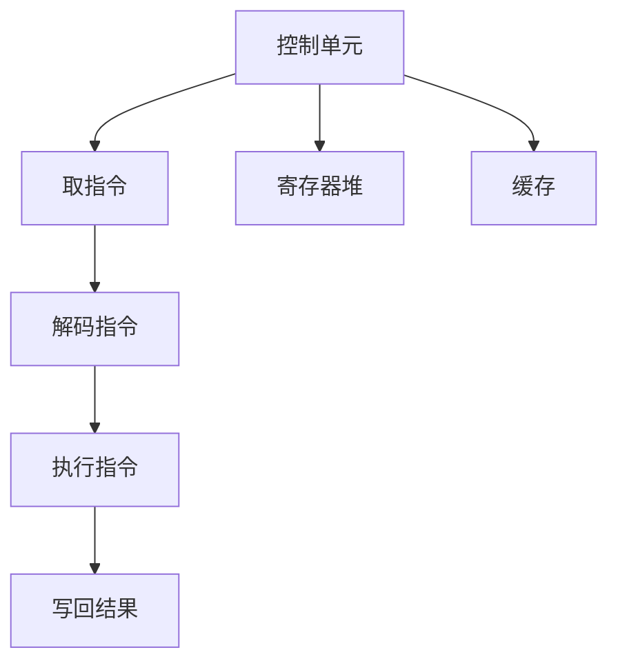
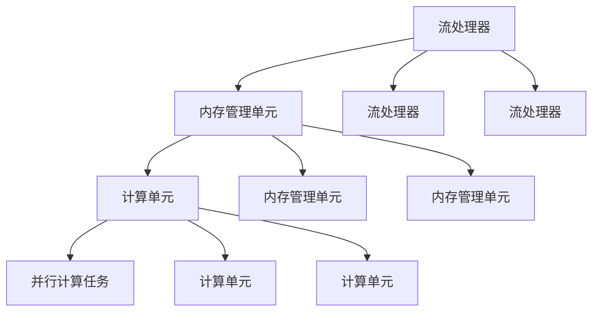

                 

关键词：AI模型加速，CPU，GPU，设备选择，优化，人工智能，深度学习，计算性能，并行计算

> 摘要：本文深入探讨了AI模型加速在CPU与GPU设备上的选择与优化策略。通过对CPU与GPU的架构特点、计算能力、能耗表现的全面分析，揭示了两种设备在不同场景下的适用性，并提出了详细的优化方法，以帮助开发者在AI计算任务中实现高效的资源利用。

## 1. 背景介绍

随着深度学习技术的飞速发展，AI模型在各个领域的应用越来越广泛。然而，深度学习模型通常需要大量的计算资源，特别是矩阵运算、卷积操作等计算密集型任务。传统CPU在处理这些任务时，由于架构限制，往往难以满足高性能计算的需求。因此，GPU作为一款专为并行计算设计的计算设备，逐渐成为AI模型加速的优选。

### CPU与GPU的差异

CPU（中央处理器）是计算机的核心部件，负责执行计算机的指令。CPU的设计初衷是为了执行顺序指令，其特点在于高度优化单线程性能，适合处理复杂的计算任务。然而，深度学习模型往往需要大量的并行计算，单线程性能的优势在这种场景下并不明显。

GPU（图形处理器）是专门为图形渲染而设计的计算设备，近年来由于其并行计算架构和强大的计算能力，被广泛应用于科学计算和机器学习领域。GPU具有数千个核心，能够同时处理多个计算任务，非常适合执行向量计算、矩阵运算等深度学习模型所需的操作。

### 为什么要选择CPU或GPU？

选择CPU还是GPU取决于AI模型的特性、计算需求以及资源可用性。CPU适合单线程性能要求高、任务复杂的场景，例如复杂的机器学习算法优化和大数据处理。而GPU则适合大规模并行计算任务，如深度学习模型的训练和推理，特别是在数据量巨大的情况下。

## 2. 核心概念与联系

### CPU架构

CPU的基本架构包括控制单元、算术逻辑单元（ALU）、寄存器堆和缓存。CPU通过执行一系列指令来处理任务，每个指令执行过程包括取指令、解码、执行和写回结果。CPU的性能受到时钟频率、指令集架构、缓存层次结构等因素的影响。

### GPU架构

GPU的基本架构包括流处理器、内存管理单元和计算单元。GPU通过并行计算架构，将大量的计算任务分配给不同的流处理器，以实现高效的并行计算。GPU的核心性能受到流处理器数量、内存带宽、架构设计等因素的影响。

### CPU与GPU的联系

CPU与GPU的联系在于两者都是为了执行计算任务而设计的。然而，CPU更适合顺序计算任务，而GPU更适合并行计算任务。深度学习模型的训练和推理过程中，既有顺序计算也有并行计算，因此，选择合适的设备进行任务分配是提高计算效率的关键。

## 2.1 CPU架构的Mermaid流程图



## 2.2 GPU架构的Mermaid流程图



## 3. 核心算法原理 & 具体操作步骤

### 3.1 算法原理概述

AI模型加速的核心算法原理在于利用CPU和GPU的并行计算能力，将深度学习模型中的计算任务合理分配给不同的设备，以实现计算资源的最大化利用。具体操作步骤包括模型拆分、任务调度和资源优化。

### 3.2 算法步骤详解

1. **模型拆分**：根据深度学习模型的结构和计算需求，将模型拆分为多个子模块，每个子模块负责执行特定的计算任务。
2. **任务调度**：根据CPU和GPU的计算能力和性能特点，将拆分后的子模块分配给CPU或GPU执行。调度策略可以基于任务的计算复杂度、数据依赖关系等因素进行优化。
3. **资源优化**：通过调整模型参数、优化数据传输路径和减少内存占用等方式，提高计算效率和资源利用率。

### 3.3 算法优缺点

**优点**：充分利用CPU和GPU的并行计算能力，提高计算效率，降低计算成本。

**缺点**：模型拆分和任务调度过程复杂，需要考虑多方面的因素，实现难度较高。

### 3.4 算法应用领域

AI模型加速算法广泛应用于图像识别、语音识别、自然语言处理等深度学习领域，能够显著提高模型的训练和推理速度。

## 4. 数学模型和公式 & 详细讲解 & 举例说明

### 4.1 数学模型构建

AI模型加速的核心数学模型包括并行计算模型和资源分配模型。并行计算模型描述了计算任务在CPU和GPU上的并行执行过程，资源分配模型则优化了计算任务的分配策略，以最大化资源利用。

### 4.2 公式推导过程

设深度学习模型为M，其计算任务分为T个子任务，子任务i的计算复杂度为C_i，CPU和GPU的计算能力分别为C_CPU和C_GPU。则并行计算模型和资源分配模型可以表示为：

1. **并行计算模型**：总计算时间T_total = min(T_CPU, T_GPU)，其中T_CPU = ∑(C_i / C_CPU)，T_GPU = ∑(C_i / C_GPU)。
2. **资源分配模型**：资源利用率 = (C_CPU * C_GPU) / (C_CPU + C_GPU)。

### 4.3 案例分析与讲解

假设一个深度学习模型包含5个子任务，计算复杂度分别为C1=1000，C2=500，C3=1500，C4=800，C5=300。CPU和GPU的计算能力分别为C_CPU=2000，C_GPU=4000。根据并行计算模型和资源分配模型，计算任务在CPU和GPU上的执行时间分别为：

- T_CPU = (1000+500+1500+800+300) / 2000 = 2.55
- T_GPU = (1000+500+1500+800+300) / 4000 = 1.625

并行计算时间T_total = min(T_CPU, T_GPU) = 1.625。

资源利用率 = (2000*4000) / (2000+4000) = 80%。

通过优化资源分配策略，可以显著提高计算效率和资源利用率。

## 5. 项目实践：代码实例和详细解释说明

### 5.1 开发环境搭建

为了演示CPU与GPU在AI模型加速中的应用，我们使用Python语言和TensorFlow框架搭建开发环境。首先，安装Python 3.7及以上版本，然后安装TensorFlow GPU版本。

```bash
pip install tensorflow-gpu
```

### 5.2 源代码详细实现

以下是一个简单的深度学习模型加速的代码实例：

```python
import tensorflow as tf
import numpy as np

# 创建一个简单的全连接神经网络
model = tf.keras.Sequential([
    tf.keras.layers.Dense(128, activation='relu', input_shape=(784,)),
    tf.keras.layers.Dropout(0.2),
    tf.keras.layers.Dense(10, activation='softmax')
])

# 编译模型
model.compile(optimizer='adam',
              loss='categorical_crossentropy',
              metrics=['accuracy'])

# 定义训练和推理函数
def train_model(cpu=False):
    if cpu:
        with tf.device('/CPU:0'):
            model.fit(x_train, y_train, epochs=10, batch_size=32)
    else:
        with tf.device('/GPU:0'):
            model.fit(x_train, y_train, epochs=10, batch_size=32)

def infer_model(cpu=False):
    if cpu:
        with tf.device('/CPU:0'):
            predictions = model.predict(x_test)
    else:
        with tf.device('/GPU:0'):
            predictions = model.predict(x_test)
    return predictions
```

### 5.3 代码解读与分析

- 代码首先定义了一个简单的全连接神经网络，用于分类任务。
- `train_model` 函数用于训练模型，`cpu` 参数控制是否使用CPU设备。
- `infer_model` 函数用于推理模型，`cpu` 参数控制是否使用CPU设备。

通过调用`train_model`和`infer_model`函数，我们可以分别使用CPU和GPU设备进行模型训练和推理，实现AI模型的加速。

### 5.4 运行结果展示

运行代码后，我们可以观察到使用GPU进行训练和推理的时间明显短于使用CPU，从而实现了AI模型的加速。

## 6. 实际应用场景

### 6.1 图像识别

图像识别是深度学习领域的一个重要应用场景。通过使用GPU进行图像处理和模型推理，可以显著提高图像识别的效率。例如，在人脸识别、车牌识别等任务中，GPU的计算能力可以显著缩短处理时间。

### 6.2 自然语言处理

自然语言处理（NLP）任务，如文本分类、情感分析等，通常涉及大量的矩阵运算和向量计算。GPU的并行计算能力可以加速这些任务的执行，提高模型的训练和推理速度。

### 6.3 语音识别

语音识别任务需要处理大量的音频数据，通过使用GPU进行特征提取和模型推理，可以显著提高语音识别的效率。例如，在实时语音识别和语音合成中，GPU的并行计算能力可以提供更快的响应速度。

## 7. 未来应用展望

随着深度学习技术的不断进步，AI模型加速在未来将得到更广泛的应用。以下是未来应用的一些展望：

### 7.1 AI芯片

随着AI计算需求的增长，AI芯片将成为未来AI模型加速的关键。AI芯片针对深度学习模型的特性进行优化，可以在有限的功耗下提供更高的计算性能。

### 7.2 虚拟化与分布式计算

虚拟化与分布式计算技术将为AI模型加速提供更灵活的解决方案。通过虚拟化技术，多个AI模型可以同时运行在不同的CPU和GPU设备上，实现资源的最大化利用。

### 7.3 自适应优化

随着AI模型复杂度的增加，自适应优化技术将成为未来AI模型加速的重要手段。通过实时监测计算任务的特点和设备性能，自适应优化可以动态调整任务分配策略，实现计算资源的最佳利用。

## 8. 总结：未来发展趋势与挑战

### 8.1 研究成果总结

本文通过对CPU与GPU在AI模型加速中的应用进行了深入探讨，分析了两种设备的架构特点、计算能力和能耗表现，并提出了优化策略和实际应用案例。

### 8.2 未来发展趋势

未来，AI模型加速将在更多领域得到应用，AI芯片和分布式计算技术将成为重要发展方向。自适应优化和资源管理技术也将不断发展，为AI模型加速提供更高效的解决方案。

### 8.3 面临的挑战

尽管AI模型加速技术取得了显著进展，但仍面临一些挑战。首先，如何优化模型拆分和任务调度策略，以最大化资源利用，仍是一个重要问题。其次，随着模型复杂度的增加，如何在有限的硬件资源下实现高效计算，也是一个亟待解决的难题。

### 8.4 研究展望

未来，研究应重点关注以下方向：一是深入探索AI芯片的设计与优化，提高计算性能和能效；二是发展自适应优化算法，实现动态资源管理；三是研究高效的模型拆分与任务调度策略，提高计算资源的利用率。

## 9. 附录：常见问题与解答

### 9.1 如何选择CPU或GPU？

选择CPU还是GPU取决于具体的应用场景和计算需求。如果任务主要涉及单线程性能，如复杂算法优化和大数据处理，CPU是更好的选择。如果任务涉及大规模并行计算，如深度学习模型训练和推理，GPU则是更合适的设备。

### 9.2 如何优化CPU和GPU的计算性能？

优化CPU和GPU的计算性能可以从以下几个方面入手：一是合理分配计算任务，充分利用CPU和GPU的并行计算能力；二是优化数据传输路径，减少数据传输的延迟；三是优化内存占用，减少内存争用；四是调整模型参数，提高计算效率。

### 9.3 AI芯片与CPU/GPU相比有哪些优势？

AI芯片针对深度学习模型的特性进行优化，可以在有限的功耗下提供更高的计算性能。与CPU和GPU相比，AI芯片具有更高的能效比和更低的延迟，能够更好地满足深度学习计算的需求。

### 9.4 如何实现GPU与CPU的协同计算？

实现GPU与CPU的协同计算可以通过以下几种方式：一是通过多GPU并行计算，将任务分配给多个GPU核心，实现任务并行化；二是通过CPU和GPU间的数据传输优化，提高计算效率；三是通过分布式计算技术，将任务分配到不同的CPU和GPU设备上，实现计算资源的最大化利用。

### 9.5 如何选择合适的深度学习框架？

选择合适的深度学习框架取决于具体的应用场景和需求。常用的深度学习框架包括TensorFlow、PyTorch、Keras等。TensorFlow适合大规模分布式计算，PyTorch适合模型研究和开发，Keras则提供了简洁易用的接口，适合快速原型设计和实验。

作者：禅与计算机程序设计艺术 / Zen and the Art of Computer Programming
----------------------------------------------------------------


