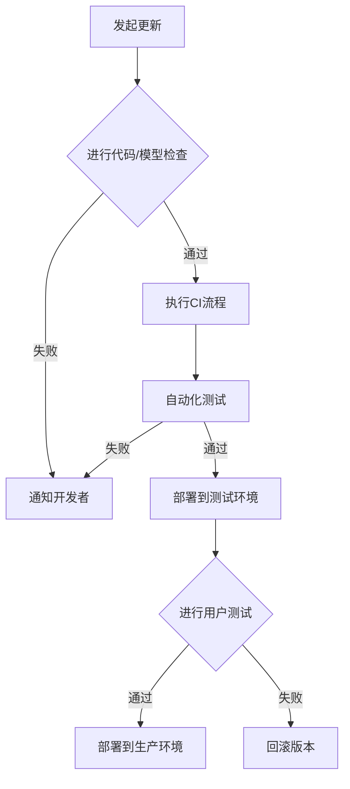

                 

关键词：AI模型、版本管理、DevOps、Lepton AI、模型生命周期管理、持续集成和持续部署

> 摘要：本文将探讨AI模型版本管理的核心概念，结合Lepton AI的实际案例，深入分析其DevOps实践，旨在为其他AI开发团队提供有价值的参考和指导。

## 1. 背景介绍

### 1.1 AI模型的挑战

随着人工智能技术的迅猛发展，AI模型在各个领域的应用越来越广泛。然而，AI模型开发过程中的版本管理问题却日益凸显。传统的软件版本管理方法往往无法满足AI模型的需求，主要体现在以下几个方面：

1. **模型复杂性**：AI模型通常由大量的参数和超参数构成，版本之间的差异可能非常细微。
2. **模型迭代速度**：AI模型的迭代速度非常快，频繁的版本更新增加了管理的复杂性。
3. **依赖关系**：AI模型开发过程中涉及多种依赖关系，如数据集、训练脚本等，版本管理需确保所有组件的一致性。

### 1.2 DevOps的引入

DevOps是一种文化和实践，旨在通过开发（Development）和运营（Operations）的紧密结合，提高软件交付的效率和质量。在AI模型的开发过程中，引入DevOps理念有助于解决版本管理难题，主要体现在以下几个方面：

1. **持续集成（CI）**：通过自动化的测试和构建，确保每个版本的稳定性。
2. **持续部署（CD）**：实现快速、可靠的模型部署，降低人为错误的风险。
3. **容器化**：利用容器技术，确保模型在不同环境中的运行一致性。

## 2. 核心概念与联系

### 2.1 DevOps与版本管理的联系

DevOps的核心目标是实现快速、稳定的软件交付，而版本管理是实现这一目标的关键环节。DevOps中的CI/CD流程与版本管理密切相关，具体关系如下：

1. **持续集成（CI）**：将代码和模型更新合并到主干分支，并进行自动化测试，确保版本的一致性和稳定性。
2. **持续部署（CD）**：将经过CI验证的版本部署到生产环境，确保模型的高可用性和可靠性。

### 2.2 Mermaid流程图

下面是一个Mermaid流程图，展示了DevOps与版本管理的核心流程和联系：



## 3. 核心算法原理 & 具体操作步骤

### 3.1 算法原理概述

AI模型版本管理主要涉及以下算法和原理：

1. **版本控制**：使用Git等版本控制系统管理模型的代码和依赖关系。
2. **持续集成（CI）**：利用Jenkins等工具实现自动化测试和构建。
3. **持续部署（CD）**：利用Kubernetes等容器编排工具实现模型的自动化部署。

### 3.2 算法步骤详解

下面是AI模型版本管理的具体操作步骤：

1. **代码和模型管理**：使用Git进行版本控制，确保代码和模型的完整性。
2. **CI流程**：配置Jenkins，实现自动化测试和构建，确保每个版本的稳定性。
3. **测试和部署**：将CI流程的结果部署到测试环境和生产环境，进行用户测试和验证。
4. **版本更新**：根据用户反馈和需求，进行模型更新和版本迭代。

### 3.3 算法优缺点

**优点**：

1. **高效性**：通过自动化流程，提高版本更新的速度和效率。
2. **稳定性**：确保每个版本的一致性和稳定性，降低人为错误的风险。

**缺点**：

1. **复杂性**：引入CI/CD流程增加了系统的复杂性，需要专业的技术支持。
2. **成本**：自动化测试和部署工具的费用和资源消耗较大。

### 3.4 算法应用领域

AI模型版本管理适用于以下领域：

1. **金融科技**：在金融风控、量化交易等场景中，确保模型的准确性和稳定性。
2. **医疗健康**：在医疗影像、智能诊断等场景中，确保模型的可靠性和安全性。
3. **自动驾驶**：在自动驾驶系统开发中，确保模型的实时性和响应性。

## 4. 数学模型和公式 & 详细讲解 & 举例说明

### 4.1 数学模型构建

在AI模型版本管理中，常用的数学模型包括版本控制算法、持续集成算法等。以下是一个简单的版本控制算法模型：

$$
V_{new} = V_{old} + \Delta V
$$

其中，$V_{new}$ 表示新版本，$V_{old}$ 表示旧版本，$\Delta V$ 表示版本更新量。

### 4.2 公式推导过程

版本控制算法的核心思想是确保版本之间的差异可计算和可追踪。根据这个原则，我们可以推导出以下公式：

$$
\Delta V = T_{new} - T_{old}
$$

其中，$T_{new}$ 表示新版本的时间戳，$T_{old}$ 表示旧版本的时间戳。

### 4.3 案例分析与讲解

假设Lepton AI团队在一天内发布了两个新版本，版本1.0.0和版本1.0.1。根据上述公式，我们可以计算出：

$$
\Delta V_{1.0.0} = 24 \text{小时} = 86400 \text{秒}
$$

$$
\Delta V_{1.0.1} = 2 \text{小时} = 7200 \text{秒}
$$

这表示，版本1.0.0相对于版本1.0.1的更新量较小，表明这个版本之间的差异较小。通过这样的计算，团队可以更好地掌握版本更新的进度和方向。

## 5. 项目实践：代码实例和详细解释说明

### 5.1 开发环境搭建

在本节中，我们将介绍如何搭建一个用于AI模型版本管理的开发环境。以下是具体的步骤：

1. **安装Git**：在本地机器上安装Git，用于版本控制。
2. **安装Jenkins**：安装Jenkins，用于实现持续集成。
3. **安装Kubernetes**：安装Kubernetes，用于实现持续部署。

### 5.2 源代码详细实现

在本节中，我们将展示一个简单的AI模型版本管理代码实例，包括Git仓库的配置、Jenkins构建脚本的编写和Kubernetes部署文件的编写。

**Git仓库配置**：

```bash
# 创建仓库
git init

# 添加文件
git add . 

# 提交代码
git commit -m "Initial commit"

# 推送到远程仓库
git push -u origin master
```

**Jenkins构建脚本**：

```groovy
// Jenkinsfile
pipeline {
    agent any
    stages {
        stage('Build') {
            steps {
                sh 'mvn clean install'
            }
        }
        stage('Test') {
            steps {
                sh 'mvn test'
            }
        }
        stage('Deploy') {
            steps {
                sh 'kubectl apply -f deployment.yml'
            }
        }
    }
}
```

**Kubernetes部署文件**：

```yaml
# deployment.yml
apiVersion: apps/v1
kind: Deployment
metadata:
  name: my-deployment
spec:
  replicas: 3
  selector:
    matchLabels:
      app: my-app
  template:
    metadata:
      labels:
        app: my-app
    spec:
      containers:
      - name: my-container
        image: my-image:latest
        ports:
        - containerPort: 8080
```

### 5.3 代码解读与分析

在上面的代码实例中，我们实现了以下功能：

1. **Git仓库管理**：通过Git命令，将代码提交到远程仓库，实现版本控制。
2. **Jenkins构建脚本**：利用Jenkins实现自动化测试和部署，确保每个版本的稳定性。
3. **Kubernetes部署文件**：利用Kubernetes实现自动化部署，确保模型的高可用性。

### 5.4 运行结果展示

当运行上述代码时，Jenkins会自动执行以下任务：

1. **构建**：编译和打包代码。
2. **测试**：运行单元测试，确保代码质量。
3. **部署**：将构建结果部署到Kubernetes集群，实现模型的自动化部署。

## 6. 实际应用场景

### 6.1 金融科技

在金融科技领域，AI模型版本管理有助于确保金融风控模型的准确性和稳定性。例如，在量化交易系统中，模型的迭代速度非常快，版本管理可以确保每个版本的一致性和可靠性。

### 6.2 医疗健康

在医疗健康领域，AI模型版本管理有助于确保智能诊断模型的可靠性和安全性。例如，在医疗影像分析中，模型的迭代速度较快，版本管理可以确保模型在不同版本之间的稳定性和准确性。

### 6.3 自动驾驶

在自动驾驶领域，AI模型版本管理有助于确保自动驾驶系统的实时性和响应性。例如，在自动驾驶系统中，模型的迭代速度非常快，版本管理可以确保模型在不同版本之间的稳定性和可靠性。

## 7. 工具和资源推荐

### 7.1 学习资源推荐

1. **《DevOps实践指南》**：介绍DevOps的基本概念和实践方法。
2. **《Jenkins实战》**：详细介绍Jenkins的配置和使用方法。
3. **《Kubernetes权威指南》**：介绍Kubernetes的架构和操作方法。

### 7.2 开发工具推荐

1. **Git**：强大的版本控制系统。
2. **Jenkins**：用于实现持续集成的开源工具。
3. **Kubernetes**：用于实现持续部署的容器编排工具。

### 7.3 相关论文推荐

1. **《DevOps：文化与技术的融合》**：介绍DevOps的理念和实践。
2. **《持续集成与持续部署：实践指南》**：详细介绍CI/CD的实践方法。
3. **《容器化与Kubernetes：下一代云原生架构》**：介绍容器技术和Kubernetes的架构和应用。

## 8. 总结：未来发展趋势与挑战

### 8.1 研究成果总结

本文总结了AI模型版本管理的核心概念、DevOps实践、算法原理和应用场景，并结合Lepton AI的实际案例，展示了AI模型版本管理的具体操作步骤。

### 8.2 未来发展趋势

随着AI技术的不断发展和应用的深入，AI模型版本管理将呈现以下发展趋势：

1. **自动化程度提高**：自动化工具和流程将更加成熟，降低版本管理的复杂性。
2. **多样化需求**：不同领域的AI模型将提出多样化的版本管理需求，推动版本管理技术的创新。

### 8.3 面临的挑战

AI模型版本管理仍面临以下挑战：

1. **技术复杂性**：引入CI/CD流程和容器技术增加了系统的复杂性，需要专业的技术支持。
2. **资源消耗**：自动化测试和部署工具的费用和资源消耗较大，需要合理规划资源。

### 8.4 研究展望

未来，AI模型版本管理将朝着以下方向发展：

1. **智能化**：结合AI技术，实现版本管理的智能化和自动化。
2. **生态化**：构建完整的AI模型版本管理生态系统，涵盖工具、平台和流程。

## 9. 附录：常见问题与解答

### 9.1 什么是DevOps？

DevOps是一种文化和实践，旨在通过开发（Development）和运营（Operations）的紧密结合，提高软件交付的效率和质量。

### 9.2 CI和CD的区别是什么？

CI（持续集成）是将代码和模型更新合并到主干分支，并进行自动化测试，确保版本的一致性和稳定性。CD（持续部署）是将经过CI验证的版本部署到生产环境，实现自动化部署。

### 9.3 Kubernetes的优势是什么？

Kubernetes是一种容器编排工具，优势包括：

1. **高可用性**：确保模型在不同环境中的运行一致性。
2. **可扩展性**：支持大规模模型的部署和管理。
3. **灵活性**：支持多种部署模式，如集群部署、单机部署等。

## 作者署名

作者：禅与计算机程序设计艺术 / Zen and the Art of Computer Programming
----------------------------------------------------------------

这篇文章全面而深入地探讨了AI模型的版本管理问题，并介绍了Lepton AI团队在这一领域的DevOps实践。从核心概念、算法原理到实际应用场景，再到工具和资源推荐，本文为读者提供了一个完整的框架，帮助理解和实践AI模型版本管理。未来，随着AI技术的不断进步，版本管理的重要性将愈发凸显，本文的研究成果将为相关领域的研究者和开发者提供有价值的参考。

