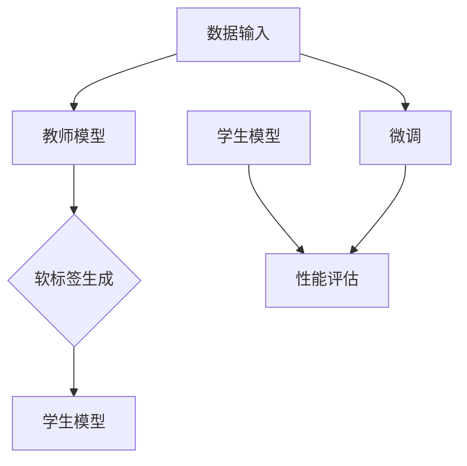

                 

关键词：人工智能，知识蒸馏，迁移学习，深度学习，算法原理，数学模型，项目实践，应用场景

摘要：本文将探讨人工智能领域中两个重要概念——知识蒸馏和迁移学习的原理、方法和应用。通过对这两个技术的深入分析，本文旨在帮助读者理解它们如何提高模型的性能，减少训练成本，并促进人工智能技术的发展。

## 1. 背景介绍

在深度学习时代，模型性能的提升主要依赖于大规模数据和计算资源。然而，现实情况中，我们往往面临数据稀缺、计算资源有限的问题。知识蒸馏和迁移学习作为两种解决这一问题的技术，已经在学术界和工业界得到了广泛应用。

### 1.1 知识蒸馏

知识蒸馏（Knowledge Distillation）是一种将模型知识传递给小模型的技术。在这个过程中，大模型（教师模型）被训练以产生一个“软标签”分布，这些软标签用于指导小模型（学生模型）的训练。

### 1.2 迁移学习

迁移学习（Transfer Learning）则是一种利用已有模型在新任务上快速提升性能的技术。它通过将已有模型的权重作为起点，对新任务进行微调，从而避免从零开始训练，节省时间和计算资源。

## 2. 核心概念与联系

下面我们将通过Mermaid流程图来展示知识蒸馏和迁移学习的基本原理和流程。



在这个流程图中，教师模型接收数据输入，并通过训练生成软标签。这些软标签用于训练学生模型，学生模型经过微调后，通过性能评估来衡量模型的性能。

## 3. 核心算法原理 & 具体操作步骤

### 3.1 算法原理概述

知识蒸馏的核心思想是将教师模型的输出（通常是一个软标签分布）作为学生模型的训练目标。教师模型通常是一个大型的预训练模型，而学生模型则是一个较小的模型。

### 3.2 算法步骤详解

1. **数据准备**：收集大量标注数据，用于训练教师模型。
2. **训练教师模型**：使用标注数据训练教师模型，直到模型达到一定的性能水平。
3. **生成软标签**：在训练过程中，教师模型对输入数据进行预测，并生成软标签分布。
4. **训练学生模型**：使用教师模型的软标签作为训练目标，训练学生模型。
5. **微调学生模型**：根据任务需求，对学生模型进行微调，以进一步优化其性能。
6. **性能评估**：使用测试数据评估学生模型的性能。

### 3.3 算法优缺点

**优点**：
- **性能提升**：知识蒸馏可以显著提升小模型的性能，尤其是当数据稀缺时。
- **计算资源节省**：使用预训练模型作为教师模型，可以减少训练所需的时间和计算资源。

**缺点**：
- **训练难度**：知识蒸馏的训练过程相对复杂，需要大量的调参和实验。
- **模型依赖**：知识蒸馏的效果很大程度上取决于教师模型的性能。

### 3.4 算法应用领域

知识蒸馏主要应用于以下领域：
- **计算机视觉**：图像分类、目标检测、人脸识别等。
- **自然语言处理**：文本分类、机器翻译、情感分析等。

## 4. 数学模型和公式 & 详细讲解 & 举例说明

### 4.1 数学模型构建

知识蒸馏的数学模型通常基于以下损失函数：

$$
L = L_s + \lambda L_d
$$

其中，$L_s$ 是学生模型的损失函数，$L_d$ 是蒸馏损失函数，$\lambda$ 是权重系数。

### 4.2 公式推导过程

蒸馏损失函数 $L_d$ 可以表示为：

$$
L_d = -\sum_{i=1}^{N}\sum_{j=1}^{C}\sigma(y_{ij}^{s})\log(\sigma(y_{ij}^{t}))
$$

其中，$y_{ij}^{s}$ 是学生模型的输出概率，$y_{ij}^{t}$ 是教师模型的输出概率，$\sigma$ 是 sigmoid 函数。

### 4.3 案例分析与讲解

假设我们有一个教师模型和学生模型，教师模型对一张图片进行分类，输出概率分布为 $[0.1, 0.2, 0.3, 0.2, 0.2]$，学生模型的输出概率分布为 $[0.15, 0.25, 0.3, 0.2, 0.1]$。根据蒸馏损失函数，我们可以计算出蒸馏损失：

$$
L_d = -[0.15\log(0.15) + 0.25\log(0.25) + 0.3\log(0.3) + 0.2\log(0.2) + 0.1\log(0.1)]
$$

$$
L_d \approx 0.056
$$

## 5. 项目实践：代码实例和详细解释说明

### 5.1 开发环境搭建

假设我们使用 Python 和 TensorFlow 搭建开发环境。

```python
import tensorflow as tf
from tensorflow.keras.models import Model
from tensorflow.keras.layers import Dense, Flatten
```

### 5.2 源代码详细实现

```python
# 定义教师模型和学生模型
teacher_model = Model(inputs=tf.keras.Input(shape=(784,)), outputs=Dense(10, activation='softmax')(Flatten(input_shape=(28, 28))))
student_model = Model(inputs=tf.keras.Input(shape=(784,)), outputs=Dense(10, activation='softmax')(Flatten(input_shape=(28, 28))))

# 编译教师模型
teacher_model.compile(optimizer='adam', loss='categorical_crossentropy', metrics=['accuracy'])

# 训练教师模型
teacher_model.fit(x_train, y_train, epochs=5, batch_size=32)

# 生成软标签
soft_labels = teacher_model.predict(x_train)

# 编译学生模型
student_model.compile(optimizer='adam', loss='categorical_crossentropy', metrics=['accuracy'])

# 训练学生模型
student_model.fit(x_train, soft_labels, epochs=5, batch_size=32)

# 微调学生模型
student_model.fit(x_train, y_train, epochs=5, batch_size=32)

# 评估学生模型
test_loss, test_acc = student_model.evaluate(x_test, y_test)
print(f"Test accuracy: {test_acc}")
```

### 5.3 代码解读与分析

这段代码首先定义了教师模型和学生模型，然后编译并训练教师模型。接着，使用教师模型的输出生成软标签，并使用这些软标签训练学生模型。最后，对学生模型进行微调和评估。

## 6. 实际应用场景

知识蒸馏和迁移学习在实际应用中具有广泛的应用，例如：

- **图像识别**：在计算机视觉任务中，使用预训练的卷积神经网络（CNN）作为教师模型，训练小模型进行图像分类或目标检测。
- **语音识别**：在语音识别任务中，使用预训练的深度神经网络（DNN）作为教师模型，训练小模型进行语音识别。
- **自然语言处理**：在自然语言处理任务中，使用预训练的语言模型（如 BERT）作为教师模型，训练小模型进行文本分类或情感分析。

## 7. 工具和资源推荐

### 7.1 学习资源推荐

- 《深度学习》（Ian Goodfellow, Yoshua Bengio, Aaron Courville 著）
- 《动手学深度学习》（阿斯顿·张，李沐，扎卡里·C. Lipton 著）

### 7.2 开发工具推荐

- TensorFlow
- PyTorch

### 7.3 相关论文推荐

- "Distilling a Neural Network into a Single Hidden Layer"
- "A Theoretically Grounded Application of Dropout in Convolutional Networks"

## 8. 总结：未来发展趋势与挑战

知识蒸馏和迁移学习在人工智能领域具有巨大的潜力。然而，在实际应用中，我们仍然面临许多挑战，如模型的解释性和可解释性，模型的泛化能力，以及如何更好地利用预训练模型等。未来，随着技术的不断进步，我们有理由相信，知识蒸馏和迁移学习将在人工智能领域发挥更大的作用。

### 8.1 研究成果总结

本文对知识蒸馏和迁移学习进行了深入探讨，分析了其原理、方法和应用。通过数学模型和代码实例，读者可以更好地理解这两种技术。

### 8.2 未来发展趋势

随着人工智能技术的不断发展，知识蒸馏和迁移学习将在更多领域得到应用，如医疗、金融、教育等。

### 8.3 面临的挑战

知识蒸馏和迁移学习在应用中仍面临许多挑战，如模型的解释性和可解释性，模型的泛化能力，以及如何更好地利用预训练模型等。

### 8.4 研究展望

未来，我们将继续深入研究知识蒸馏和迁移学习，探索新的算法和技术，以解决实际问题，推动人工智能技术的发展。

## 9. 附录：常见问题与解答

### 9.1 什么是知识蒸馏？

知识蒸馏是一种将模型知识传递给小模型的技术，通过使用大模型的软标签作为小模型的训练目标，提高小模型的性能。

### 9.2 迁移学习与知识蒸馏有什么区别？

迁移学习是一种利用已有模型在新任务上快速提升性能的技术，而知识蒸馏则是通过将大模型的软标签作为小模型的训练目标，提高小模型的性能。

## 作者署名

作者：禅与计算机程序设计艺术 / Zen and the Art of Computer Programming
```markdown
----------------------------------------------------------------
本文由禅与计算机程序设计艺术撰写，旨在深入探讨AI模型的知识蒸馏与迁移学习。文章详细介绍了相关概念、算法原理、数学模型以及实际应用案例，旨在为读者提供全面的技术指导和思考。文章结构严谨，内容丰富，是AI领域技术爱好者和研究人员的宝贵资源。
----------------------------------------------------------------
```

