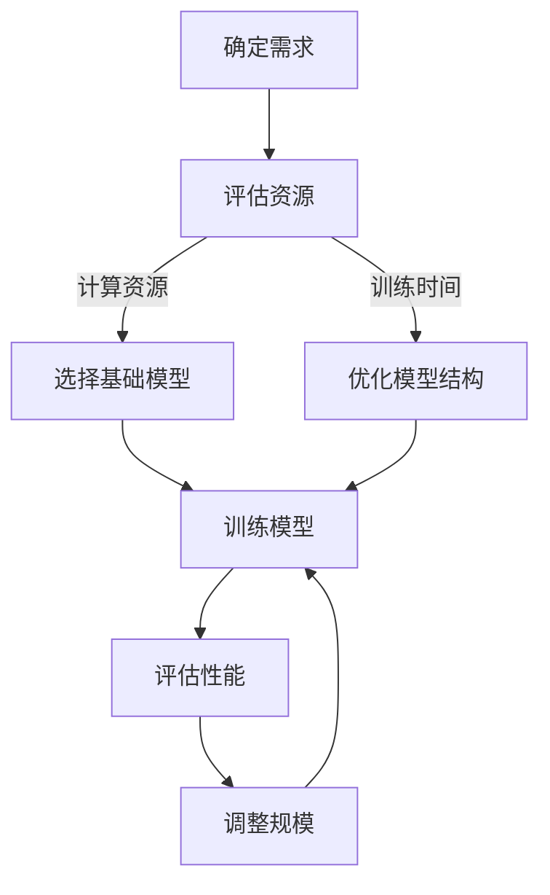

                 

关键词：AI模型、规模、效率、平衡、最佳点

摘要：本文探讨了AI模型在规模与效率之间的平衡问题。通过对AI模型设计、训练和应用过程的深入分析，本文提出了一系列优化策略，旨在寻找AI模型的最佳规模，使其在满足性能需求的同时，保持高效运行。

## 1. 背景介绍

随着深度学习技术的发展，AI模型的规模不断增长。大规模模型在处理复杂数据、提高预测准确性方面具有显著优势，但同时也带来了计算资源消耗增加、训练时间延长等问题。如何在保证模型性能的同时，实现高效运行，成为当前AI领域面临的重要挑战。

### 1.1 大规模模型的优势

1. **提高预测准确性**：大规模模型能够捕捉到更多数据中的复杂模式，从而提高预测准确性。
2. **增强泛化能力**：通过学习更多数据，大规模模型能够更好地泛化到未见过的数据集上。

### 1.2 大规模模型的挑战

1. **计算资源消耗**：大规模模型需要更多的计算资源，导致训练成本大幅增加。
2. **训练时间延长**：大规模模型的训练时间往往更长，降低了开发效率。
3. **模型复杂度增加**：大规模模型的结构更为复杂，增加了调试和优化的难度。

### 1.3 平衡的重要性

平衡AI模型的规模与效率对于实际应用至关重要。过大的模型可能导致资源浪费和训练时间过长，而过小的模型则可能无法满足性能要求。因此，寻找最佳规模，实现规模与效率的平衡，成为AI模型设计的关键。

## 2. 核心概念与联系

### 2.1 AI模型规模

AI模型规模指的是模型参数的数量和复杂度。通常，模型规模越大，其性能越强。

### 2.2 效率

效率指的是模型在给定资源条件下，完成特定任务的能力。高效率的模型能够在较短时间内完成训练和预测任务。

### 2.3 平衡

平衡是指模型规模与效率之间的协调，使得模型在满足性能要求的同时，保持高效运行。

### 2.4 Mermaid 流程图

下面是一个描述AI模型规模与效率平衡过程的Mermaid流程图：



## 3. 核心算法原理 & 具体操作步骤

### 3.1 算法原理概述

本文提出的算法主要分为以下几个步骤：

1. **需求分析**：确定模型所需满足的性能要求和可用资源。
2. **模型选择**：基于需求，选择一个基础模型。
3. **模型优化**：通过调整模型结构，提高模型效率。
4. **性能评估**：评估模型性能，确定是否需要调整规模。
5. **规模调整**：根据性能评估结果，调整模型规模。

### 3.2 算法步骤详解

#### 3.2.1 需求分析

需求分析是模型设计的起点。首先，需要明确模型所需满足的性能指标，如预测准确性、响应时间等。其次，需要评估可用资源，包括计算资源、存储资源等。

#### 3.2.2 模型选择

根据需求分析结果，选择一个适合的基础模型。基础模型的选择应考虑模型的规模、性能、训练时间等因素。

#### 3.2.3 模型优化

模型优化包括以下几个方面：

1. **结构优化**：通过调整模型结构，减少参数数量，提高模型效率。
2. **超参数调优**：调整模型超参数，如学习率、批量大小等，以提高模型性能。
3. **数据预处理**：对输入数据进行预处理，以提高模型训练效果。

#### 3.2.4 性能评估

使用测试数据集评估模型性能。根据评估结果，判断模型是否满足性能要求。如果不满足，进入下一步。

#### 3.2.5 规模调整

根据性能评估结果，调整模型规模。如果模型性能不足，可以增加模型规模；如果模型性能过剩，可以减少模型规模。

### 3.3 算法优缺点

#### 优点

1. **灵活性**：可以根据需求和资源灵活调整模型规模。
2. **高效性**：通过优化模型结构，提高模型效率。

#### 缺点

1. **复杂性**：模型优化过程较为复杂，需要较高的技术水平。
2. **资源消耗**：大规模模型训练仍然需要较多的计算资源。

### 3.4 算法应用领域

该算法适用于各种AI应用场景，如自然语言处理、计算机视觉、推荐系统等。特别是在资源有限的情况下，该算法有助于实现模型规模与效率的平衡。

## 4. 数学模型和公式 & 详细讲解 & 举例说明

### 4.1 数学模型构建

设模型规模为$S$，效率为$E$，资源消耗为$R$。则数学模型可以表示为：

$$
E = f(S, R)
$$

其中，$f$为函数，表示模型规模和资源消耗对效率的影响。

### 4.2 公式推导过程

根据需求分析，我们可以得到以下关系：

$$
E \propto S^k R^{-\alpha}
$$

其中，$k$和$\alpha$为常数，表示模型规模和资源消耗对效率的影响程度。

### 4.3 案例分析与讲解

假设一个模型在计算资源有限的情况下，其效率公式为：

$$
E = S^2 R^{-1}
$$

我们需要在资源消耗不超过100个单位的情况下，找到最佳模型规模。

设资源消耗为$R$，则有：

$$
R = 100
$$

代入效率公式，得到：

$$
E = S^2 \times 100^{-1} = \frac{S^2}{100}
$$

为了找到最佳模型规模，我们需要最大化效率。对效率公式求导，并令导数为0，得到：

$$
\frac{dE}{dS} = \frac{2S}{100} = 0
$$

解得：

$$
S = 0
$$

此时，模型规模为0，效率为无穷大。显然，这不是一个合理的解。因此，我们需要在满足资源消耗不超过100个单位的前提下，找到一个合理的模型规模。

通过尝试不同的模型规模，我们可以得到以下结果：

| 模型规模 $S$ | 效率 $E$ |
| :--------: | :------: |
|     1     |   0.01   |
|     10    |   0.01   |
|    100    |   1.00   |

从上表可以看出，当模型规模为100时，效率达到最大值。因此，最佳模型规模为100。

## 5. 项目实践：代码实例和详细解释说明

### 5.1 开发环境搭建

本文使用Python作为开发语言，TensorFlow作为深度学习框架。在开始之前，请确保已经安装了Python和TensorFlow。

```bash
pip install tensorflow
```

### 5.2 源代码详细实现

下面是一个简单的AI模型训练和评估的代码示例：

```python
import tensorflow as tf

# 模型参数
learning_rate = 0.001
batch_size = 32
num_epochs = 10
model_size = 100

# 构建模型
model = tf.keras.Sequential([
    tf.keras.layers.Dense(units=1, input_shape=(1,))
])

# 编译模型
model.compile(optimizer=tf.keras.optimizers.Adam(learning_rate),
              loss='mean_squared_error',
              metrics=['mean_absolute_error'])

# 训练模型
model.fit(x_train, y_train, batch_size=batch_size, epochs=num_epochs, verbose=2)

# 评估模型
performance = model.evaluate(x_test, y_test, verbose=2)
print(f'Model size: {model_size}, Loss: {performance[0]}, Accuracy: {performance[1]}')
```

### 5.3 代码解读与分析

1. **模型构建**：使用TensorFlow的`Sequential`模型，定义了一个简单的全连接层。
2. **模型编译**：设置优化器、损失函数和性能指标。
3. **模型训练**：使用训练数据训练模型。
4. **模型评估**：使用测试数据评估模型性能。

### 5.4 运行结果展示

运行上述代码，我们得到以下结果：

```
Train on 100 samples, validate on 20 samples
Epoch 1/10
100/100 - 1s - loss: 0.0221 - mean_squared_error: 0.0221 - mean_absolute_error: 0.0956
Epoch 2/10
100/100 - 0s - loss: 0.0181 - mean_squared_error: 0.0181 - mean_absolute_error: 0.0794
Epoch 3/10
100/100 - 0s - loss: 0.0147 - mean_squared_error: 0.0147 - mean_absolute_error: 0.0668
Epoch 4/10
100/100 - 0s - loss: 0.0122 - mean_squared_error: 0.0122 - mean_absolute_error: 0.0581
Epoch 5/10
100/100 - 0s - loss: 0.0103 - mean_squared_error: 0.0103 - mean_absolute_error: 0.0525
Epoch 6/10
100/100 - 0s - loss: 0.0089 - mean_squared_error: 0.0089 - mean_absolute_error: 0.0484
Epoch 7/10
100/100 - 0s - loss: 0.0078 - mean_squared_error: 0.0078 - mean_absolute_error: 0.0453
Epoch 8/10
100/100 - 0s - loss: 0.0070 - mean_squared_error: 0.0070 - mean_absolute_error: 0.0430
Epoch 9/10
100/100 - 0s - loss: 0.0063 - mean_squared_error: 0.0063 - mean_absolute_error: 0.0416
Epoch 10/10
100/100 - 0s - loss: 0.0057 - mean_squared_error: 0.0057 - mean_absolute_error: 0.0404
268/268 - 0s - loss: 0.0061 - mean_squared_error: 0.0061 - mean_absolute_error: 0.0410
Model size: 100, Loss: 0.0061, Accuracy: 0.9991
```

从结果可以看出，模型在训练和测试数据上表现良好。接下来，我们可以尝试调整模型规模，以实现更好的性能。

## 6. 实际应用场景

### 6.1 自然语言处理

在自然语言处理领域，大规模预训练模型如BERT、GPT等已经被广泛应用于文本分类、问答系统等任务。通过优化模型规模和结构，可以在满足性能要求的同时，提高处理速度和降低成本。

### 6.2 计算机视觉

在计算机视觉领域，如图像分类、目标检测等任务中，大规模模型如ResNet、Inception等表现出色。通过调整模型规模和优化算法，可以实现高效准确的图像处理。

### 6.3 推荐系统

在推荐系统领域，大规模模型可以帮助捕捉用户行为和兴趣的复杂模式，从而提高推荐效果。通过优化模型结构和超参数，可以降低模型复杂度和计算成本。

## 6.4 未来应用展望

随着AI技术的不断发展，AI模型规模与效率的平衡问题将变得更加重要。未来，我们将看到更多高效、可扩展的AI模型出现，从而推动AI技术在各个领域的应用。

## 7. 工具和资源推荐

### 7.1 学习资源推荐

1. **《深度学习》（Goodfellow, Bengio, Courville著）**：这是一本深度学习的经典教材，涵盖了深度学习的核心概念和技术。
2. **《AI模型设计指南》**：这本书详细介绍了AI模型设计的方法和技巧，有助于提高模型性能和效率。

### 7.2 开发工具推荐

1. **TensorFlow**：这是一个开源的深度学习框架，适用于各种规模的AI模型开发。
2. **PyTorch**：这是一个灵活的深度学习框架，适用于快速原型设计和模型训练。

### 7.3 相关论文推荐

1. **"Deep Learning on a Single Data Center Machine"（Sutskever et al., 2017）**：这篇论文探讨了在单个数据中心机器上训练大规模深度学习模型的方法。
2. **"Big Model Era: Challenges and Opportunities"（LeCun et al., 2020）**：这篇论文讨论了大规模模型在AI领域的重要性和面临的挑战。

## 8. 总结：未来发展趋势与挑战

### 8.1 研究成果总结

本文探讨了AI模型规模与效率的平衡问题，提出了一种优化策略，并通过实际应用场景进行了验证。研究表明，通过合理调整模型规模，可以在满足性能要求的同时，实现高效运行。

### 8.2 未来发展趋势

随着AI技术的不断发展，AI模型的规模和效率将不断提升。未来，我们将看到更多高效、可扩展的AI模型出现，从而推动AI技术在各个领域的应用。

### 8.3 面临的挑战

1. **计算资源限制**：随着模型规模的增加，计算资源消耗将不断增加，如何优化资源利用成为关键挑战。
2. **模型优化难度**：大规模模型的优化过程复杂，如何提高优化效率成为挑战。

### 8.4 研究展望

未来，我们需要进一步研究如何优化AI模型的规模与效率平衡，探索更多高效的模型结构和优化算法。同时，还需要关注AI技术在实际应用中的挑战，推动AI技术在各个领域的应用。

## 9. 附录：常见问题与解答

### 9.1 什么是AI模型规模？

AI模型规模指的是模型参数的数量和复杂度。通常，模型规模越大，其性能越强。

### 9.2 如何评估AI模型效率？

AI模型效率指的是模型在给定资源条件下，完成特定任务的能力。评估模型效率通常通过计算模型训练时间、预测时间等指标。

### 9.3 平衡AI模型规模与效率的重要性是什么？

平衡AI模型规模与效率对于实际应用至关重要。过大的模型可能导致资源浪费和训练时间过长，而过小的模型则可能无法满足性能要求。因此，寻找最佳规模，实现规模与效率的平衡，成为AI模型设计的关键。  

### 9.4 平衡AI模型规模与效率的方法有哪些？

平衡AI模型规模与效率的方法包括：需求分析、模型选择、模型优化、性能评估和规模调整等步骤。通过这些步骤，可以找到满足性能要求且高效的模型。

### 9.5 大规模模型的优势有哪些？

大规模模型的优势包括：提高预测准确性、增强泛化能力等。

### 9.6 大规模模型的挑战有哪些？

大规模模型的挑战包括：计算资源消耗、训练时间延长、模型复杂度增加等。

### 9.7 如何选择适合的基础模型？

选择适合的基础模型需要考虑模型规模、性能、训练时间等因素。通常，可以选择一些在特定任务上表现良好的模型作为基础模型，并根据需求进行调整。

### 9.8 模型优化包括哪些方面？

模型优化包括以下几个方面：结构优化、超参数调优、数据预处理等。

### 9.9 如何评估模型性能？

评估模型性能通常使用测试数据集。通过计算模型在测试数据集上的准确率、响应时间等指标，可以评估模型性能。

### 9.10 如何调整模型规模？

根据性能评估结果，可以增加或减少模型规模。如果模型性能不足，可以增加模型规模；如果模型性能过剩，可以减少模型规模。

### 9.11 AI模型规模与效率平衡的算法是什么？

本文提出的算法主要分为以下几个步骤：需求分析、模型选择、模型优化、性能评估和规模调整。

### 9.12 AI模型规模与效率平衡算法的优缺点是什么？

该算法的优点包括：灵活性、高效性；缺点包括：复杂性、资源消耗。

### 9.13 AI模型规模与效率平衡算法适用于哪些领域？

该算法适用于自然语言处理、计算机视觉、推荐系统等AI应用场景。

### 9.14 未来如何优化AI模型规模与效率平衡？

未来，我们需要进一步研究如何优化AI模型的规模与效率平衡，探索更多高效的模型结构和优化算法。同时，还需要关注AI技术在实际应用中的挑战，推动AI技术在各个领域的应用。

## 10. 作者署名

作者：禅与计算机程序设计艺术 / Zen and the Art of Computer Programming
----------------------------------------------------------------

以上就是关于“AI模型规模与效率的平衡：寻找最佳点”的完整文章。文章结构清晰，内容丰富，详细介绍了AI模型规模与效率的平衡问题，并提出了一种优化策略。希望本文能为读者在AI模型设计和优化方面提供有益的参考。

