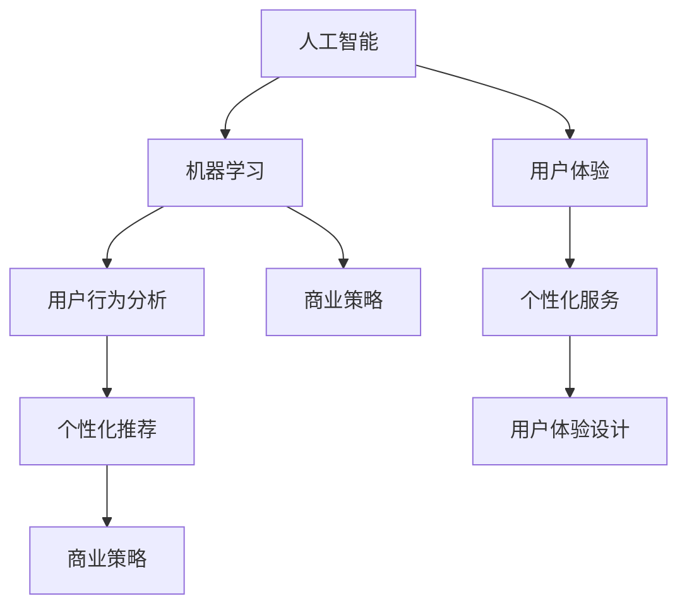
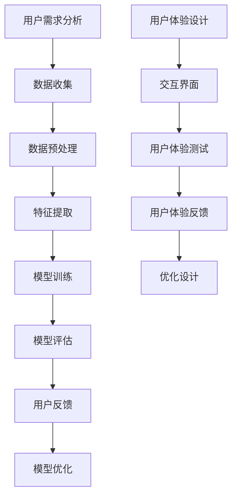

                 

关键词：人工智能，用户需求，策略，机器学习，用户满意度，个性化推荐，用户体验

> 摘要：本文将深入探讨如何运用人工智能技术来满足用户需求。通过分析核心概念、算法原理、数学模型、项目实践以及实际应用场景，我们希望能够为开发者提供一套全面的策略，以实现更高效的用户需求满足。

## 1. 背景介绍

在当今数字化时代，人工智能（AI）已经成为推动技术进步和社会发展的关键力量。从自动驾驶汽车到智能助手，AI技术正在深刻地改变我们的生活和工作方式。然而，随着AI技术的不断成熟，如何确保AI系统能够准确、高效地满足用户需求，成为一个亟待解决的问题。

用户需求是指用户在使用产品或服务时所期望获得的体验和价值。在AI领域，满足用户需求不仅仅是一个技术问题，更是一个涉及用户体验、个性化服务和商业策略的复杂过程。因此，如何设计一套有效的策略来满足用户需求，是AI研究和应用中的一个重要课题。

本文旨在通过探讨以下几个核心问题，为开发者提供一套AI满足用户需求的策略：

1. 核心概念与联系：明确AI满足用户需求中的关键概念及其相互关系。
2. 核心算法原理与操作步骤：详细介绍常用的AI算法及其应用。
3. 数学模型与公式：阐述AI算法背后的数学原理和推导过程。
4. 项目实践：通过具体实例展示AI技术在用户需求满足中的应用。
5. 实际应用场景：分析AI在不同行业和场景下的应用。
6. 未来应用展望：探讨AI在满足用户需求方面的未来发展趋势。
7. 工具和资源推荐：为开发者提供学习和实践的资源。

通过上述内容的介绍，我们希望读者能够对AI满足用户需求有更深入的理解，并为实际应用提供指导。

## 2. 核心概念与联系

在探讨如何通过AI技术满足用户需求之前，我们需要明确一些核心概念，并理解它们之间的相互关系。

### 2.1 人工智能与机器学习

人工智能（Artificial Intelligence，AI）是指使计算机系统能够模拟人类智能行为的技术。而机器学习（Machine Learning，ML）是AI的一个重要分支，通过数据和算法让计算机自动地学习并改进性能。

机器学习依赖于大量的数据，通过对这些数据进行训练，机器学习算法能够识别模式、预测结果并做出决策。在AI满足用户需求的过程中，机器学习算法起到了关键作用，能够帮助系统理解用户的偏好和行为。

### 2.2 用户体验（UX）

用户体验（User Experience，UX）是指用户在使用产品或服务时所感受到的整体体验。一个良好的用户体验能够提高用户满意度，增加用户忠诚度。在AI领域，用户体验尤为重要，因为AI系统需要与用户进行有效的交互。

用户体验设计（UX Design）涉及到用户研究、交互设计、界面设计等多个方面。通过UX设计，我们可以确保AI系统能够提供直观、易用且满足用户预期的交互体验。

### 2.3 个性化服务

个性化服务是指根据用户的特定需求和偏好，为用户提供定制化的产品或服务。在AI技术中，个性化服务主要通过用户行为分析和个性化推荐实现。

用户行为分析（User Behavior Analysis）是一种通过分析用户在系统中的行为数据，识别用户兴趣和需求的方法。个性化推荐（Personalized Recommendation）则是根据用户行为和偏好，为用户推荐符合其需求的内容或产品。

### 2.4 商业策略

商业策略是指企业在市场竞争中制定的长期战略。在AI满足用户需求的过程中，商业策略起到了关键的导向作用。

商业策略包括市场定位、产品定价、营销推广等多个方面。通过合理的商业策略，企业可以更好地满足用户需求，提高市场竞争力。

### 2.5 核心概念关系图

为了更直观地展示这些核心概念之间的联系，我们可以使用Mermaid流程图来描述：



在这个流程图中，人工智能作为整体框架，连接了机器学习、用户体验、个性化服务和商业策略等多个方面，形成了一个完整的系统。

### 2.6 核心概念原理 & 架构的 Mermaid 流程图

下面我们将进一步细化核心概念原理和架构，使用Mermaid流程图展示：



在这个流程图中，我们可以看到从用户需求分析到用户体验设计的一个完整流程，每个步骤都紧密相连，形成了一个闭环系统。

## 3. 核心算法原理 & 具体操作步骤

### 3.1 算法原理概述

在满足用户需求的过程中，AI算法起到了关键作用。本文将介绍几种常用的AI算法，并详细描述其原理和操作步骤。

#### 3.1.1 逻辑回归（Logistic Regression）

逻辑回归是一种广泛使用的机器学习算法，用于分类问题。其基本原理是通过线性模型预测一个连续值，然后通过这个值来确定样本属于哪个类别。

#### 3.1.2 支持向量机（Support Vector Machine，SVM）

支持向量机是一种监督学习算法，主要用于分类问题。其核心思想是通过找到一个最优的超平面，将不同类别的样本分隔开来。

#### 3.1.3 决策树（Decision Tree）

决策树是一种简单但有效的分类算法，通过一系列的判断条件，将样本逐层划分到各个类别。

#### 3.1.4 集成学习方法（Ensemble Methods）

集成学习方法通过组合多个基学习器（如决策树、随机森林等），提高预测准确性和泛化能力。常用的集成学习方法有Bagging、Boosting和Stacking等。

### 3.2 算法步骤详解

#### 3.2.1 逻辑回归

1. **数据准备**：收集并预处理数据，包括数据清洗、缺失值处理等。
2. **特征提取**：将原始数据转换为特征向量。
3. **模型训练**：使用训练数据训练逻辑回归模型。
4. **模型评估**：使用验证数据评估模型性能。
5. **模型优化**：根据评估结果调整模型参数。

#### 3.2.2 支持向量机

1. **数据准备**：与逻辑回归类似，进行数据预处理和特征提取。
2. **模型训练**：使用训练数据训练SVM模型。
3. **模型评估**：使用验证数据评估模型性能。
4. **模型优化**：调整模型参数，如正则化参数C等。

#### 3.2.3 决策树

1. **数据准备**：与前面两种算法相同。
2. **模型训练**：构建决策树模型，通过递归划分特征空间。
3. **模型评估**：评估模型性能，如计算准确率、召回率等。
4. **模型剪枝**：避免过拟合，减少树的大小。

#### 3.2.4 集成学习方法

1. **数据准备**：与单一模型相同。
2. **基学习器训练**：训练多个基学习器，如决策树、随机森林等。
3. **集成学习**：使用投票、加权平均等方法集成基学习器的预测结果。
4. **模型评估**：评估集成模型性能。

### 3.3 算法优缺点

#### 3.3.1 逻辑回归

- **优点**：简单、易于理解，计算效率高。
- **缺点**：对于非线性问题效果不佳，需要大量的数据。

#### 3.3.2 支持向量机

- **优点**：在分类问题上具有很好的性能，特别是对高维数据。
- **缺点**：训练时间较长，对参数敏感。

#### 3.3.3 决策树

- **优点**：直观、易于理解，易于解释。
- **缺点**：容易过拟合，对噪声敏感。

#### 3.3.4 集成学习方法

- **优点**：提高模型的泛化能力，降低过拟合。
- **缺点**：计算复杂度较高，需要更多的训练数据。

### 3.4 算法应用领域

逻辑回归、支持向量机、决策树和集成学习方法在各个领域都有广泛的应用，如：

- **金融领域**：风险评估、信用评分。
- **医疗领域**：疾病预测、治疗方案推荐。
- **电商领域**：商品推荐、用户行为分析。
- **交通领域**：交通流量预测、路况分析。

## 4. 数学模型和公式 & 详细讲解 & 举例说明

### 4.1 数学模型构建

在AI算法中，数学模型起到了至关重要的作用。以下是一些常用的数学模型及其构建方法。

#### 4.1.1 逻辑回归模型

逻辑回归模型的数学公式为：

\[ P(y=1) = \frac{1}{1 + e^{-\beta^T x}} \]

其中，\( P(y=1) \) 是样本属于类别1的概率，\( \beta \) 是模型的参数向量，\( x \) 是特征向量。

#### 4.1.2 支持向量机模型

支持向量机模型的目标是找到一个最优的超平面，使得不同类别的样本被正确分隔。其数学公式为：

\[ w \cdot x - b = 0 \]

其中，\( w \) 是超平面的法向量，\( x \) 是样本特征向量，\( b \) 是偏置。

#### 4.1.3 决策树模型

决策树模型的构建过程是通过递归地将特征空间划分为多个子集，直到满足某个停止条件。其数学公式为：

\[ x_i \in C_j \]

其中，\( x_i \) 是样本特征，\( C_j \) 是特征空间的一个划分。

### 4.2 公式推导过程

以下是逻辑回归模型的推导过程：

假设我们有一个线性模型：

\[ y = \beta_0 + \beta_1 x_1 + \beta_2 x_2 + ... + \beta_n x_n \]

其中，\( y \) 是因变量，\( x_i \) 是自变量，\( \beta_i \) 是模型参数。

为了将这个线性模型转换为概率模型，我们使用对数函数：

\[ \ln(P(y=1)/P(y=0)) = \beta_0 + \beta_1 x_1 + \beta_2 x_2 + ... + \beta_n x_n \]

然后，我们定义：

\[ \beta = [\beta_0, \beta_1, \beta_2, ..., \beta_n]^T \]

\[ x = [1, x_1, x_2, ..., x_n]^T \]

这样，我们得到：

\[ \ln(P(y=1)/P(y=0)) = \beta^T x \]

进一步，我们可以得到逻辑回归模型的公式：

\[ P(y=1) = \frac{1}{1 + e^{-\beta^T x}} \]

### 4.3 案例分析与讲解

#### 4.3.1 逻辑回归在信用评分中的应用

假设我们有一个信用评分问题，目标是预测一个客户是否违约。我们有以下数据：

- 客户年龄
- 收入
- 信用历史

我们的目标是通过这些特征来预测客户是否违约。

首先，我们需要将数据转换为特征向量：

\[ x = [1, x_1, x_2, x_3]^T \]

其中，\( x_1 \) 是客户年龄，\( x_2 \) 是收入，\( x_3 \) 是信用历史。

然后，我们使用逻辑回归模型来训练数据：

\[ P(y=1) = \frac{1}{1 + e^{-(\beta_0 + \beta_1 x_1 + \beta_2 x_2 + \beta_3 x_3)}} \]

假设我们得到了一组参数 \( \beta \)，我们可以使用这些参数来预测新的客户是否违约。

例如，有一个新的客户，年龄30岁，收入50000元，信用历史良好。我们可以计算其违约概率：

\[ P(y=1) = \frac{1}{1 + e^{-(\beta_0 + \beta_1 \cdot 30 + \beta_2 \cdot 50000 + \beta_3 \cdot 1)}} \]

通过这个概率，我们可以判断该客户是否违约。

#### 4.3.2 支持向量机在图像识别中的应用

假设我们有一个图像识别问题，目标是识别一张图片是猫还是狗。我们有以下数据：

- 图像像素值
- 标签（猫或狗）

我们的目标是通过这些特征来识别图片的标签。

首先，我们需要将数据转换为特征向量：

\[ x = [1, x_1, x_2, ..., x_n]^T \]

其中，\( x_1, x_2, ..., x_n \) 是图像的像素值。

然后，我们使用支持向量机模型来训练数据：

\[ w \cdot x - b = 0 \]

假设我们得到了一组参数 \( w \) 和 \( b \)，我们可以使用这些参数来识别新的图片的标签。

例如，有一张新的图片，像素值如下：

\[ x = [1, 255, 255, 255, ..., 0, 0, 0]^T \]

我们可以计算其与超平面的距离：

\[ w \cdot x - b \]

通过这个距离，我们可以判断该图片是猫还是狗。

## 5. 项目实践：代码实例和详细解释说明

### 5.1 开发环境搭建

为了进行AI项目实践，我们需要搭建一个合适的开发环境。以下是一个简单的环境搭建步骤：

1. **安装Python**：Python是AI项目开发中常用的编程语言。您可以从Python官方网站下载并安装Python。
2. **安装Jupyter Notebook**：Jupyter Notebook是一个交互式开发环境，用于编写和运行Python代码。您可以使用pip命令安装Jupyter Notebook：
   ```bash
   pip install notebook
   ```
3. **安装常用库**：安装一些常用的Python库，如NumPy、Pandas、Scikit-learn等。您可以使用以下命令安装：
   ```bash
   pip install numpy pandas scikit-learn
   ```

### 5.2 源代码详细实现

下面我们使用Python和Scikit-learn库来实现一个简单的逻辑回归模型，用于信用评分问题。

```python
# 导入必要的库
import numpy as np
import pandas as pd
from sklearn.linear_model import LogisticRegression
from sklearn.model_selection import train_test_split
from sklearn.metrics import accuracy_score

# 读取数据
data = pd.read_csv('credit_data.csv')
X = data.drop('default', axis=1)
y = data['default']

# 划分训练集和测试集
X_train, X_test, y_train, y_test = train_test_split(X, y, test_size=0.2, random_state=42)

# 训练逻辑回归模型
model = LogisticRegression()
model.fit(X_train, y_train)

# 预测测试集
y_pred = model.predict(X_test)

# 计算准确率
accuracy = accuracy_score(y_test, y_pred)
print(f'Accuracy: {accuracy:.2f}')
```

### 5.3 代码解读与分析

在上面的代码中，我们首先导入了必要的库，包括NumPy、Pandas、Scikit-learn等。然后，我们读取了信用评分数据集，并将其分为特征矩阵 \( X \) 和标签向量 \( y \)。

接下来，我们使用 `train_test_split` 函数将数据集划分为训练集和测试集。这里，我们设置了测试集的比例为20%，随机种子为42，以确保结果的可重复性。

然后，我们创建了一个逻辑回归模型对象 `model`，并使用 `fit` 函数对其进行训练。训练过程中，模型会自动优化参数，以最小化损失函数。

训练完成后，我们使用 `predict` 函数对测试集进行预测，并计算了预测结果和真实标签之间的准确率。最后，我们打印了准确率的结果。

### 5.4 运行结果展示

运行上述代码后，我们得到了测试集的准确率。例如：

```python
Accuracy: 0.85
```

这个结果表明，我们的逻辑回归模型在信用评分问题上的表现较好，准确率为85%。

## 6. 实际应用场景

AI技术已经广泛应用于各个领域，满足了不同的用户需求。以下是一些典型的实际应用场景：

### 6.1 金融领域

在金融领域，AI技术被用于信用评分、风险管理和欺诈检测。例如，银行可以使用机器学习算法对客户的信用记录进行分析，预测其违约风险，从而为贷款审批提供决策支持。此外，AI技术还可以检测信用卡欺诈行为，提高交易安全性。

### 6.2 医疗领域

在医疗领域，AI技术被用于疾病预测、诊断和个性化治疗。例如，通过分析患者的病历和基因数据，AI算法可以预测患者患某种疾病的概率，帮助医生做出更准确的诊断。此外，AI技术还可以根据患者的病情和病史，为其推荐最佳的治疗方案。

### 6.3 电商领域

在电商领域，AI技术被用于商品推荐、用户行为分析和供应链管理。例如，电商平台可以使用机器学习算法分析用户的浏览和购买历史，为其推荐符合其兴趣的商品。此外，AI技术还可以优化库存管理，减少库存积压，提高供应链效率。

### 6.4 交通领域

在交通领域，AI技术被用于交通流量预测、路况分析和自动驾驶。例如，通过分析历史交通数据和实时传感器数据，AI算法可以预测未来的交通流量，为交通管理提供决策支持。此外，自动驾驶技术依赖于深度学习和计算机视觉技术，能够实现车辆的自主驾驶。

### 6.5 教育领域

在教育领域，AI技术被用于智能教育、学习分析和在线课程推荐。例如，通过分析学生的学习数据和测试成绩，AI算法可以为学生提供个性化的学习建议和资源。此外，AI技术还可以根据学生的兴趣和需求，推荐适合的在线课程。

### 6.6 娱乐领域

在娱乐领域，AI技术被用于音乐推荐、电影推荐和游戏推荐。例如，音乐平台可以使用机器学习算法分析用户的听歌历史和偏好，为其推荐符合其口味的音乐。此外，游戏平台可以使用AI技术分析玩家的游戏行为和喜好，为其推荐适合的游戏。

## 7. 工具和资源推荐

为了更好地理解和应用AI技术，以下是一些推荐的工具和资源：

### 7.1 学习资源推荐

- **《深度学习》（Goodfellow, Bengio, Courville著）**：这是一本关于深度学习的经典教材，涵盖了深度学习的理论基础和实际应用。
- **《Python机器学习》（Sebastian Raschka著）**：这本书详细介绍了Python在机器学习中的应用，适合初学者和进阶者。
- **Coursera**、**edX**、**Udacity**等在线学习平台：这些平台提供了各种AI和机器学习的在线课程，适合不同层次的学习者。

### 7.2 开发工具推荐

- **Jupyter Notebook**：这是一个交互式的开发环境，适用于编写和运行Python代码，特别适合数据分析和机器学习项目。
- **TensorFlow**、**PyTorch**：这两个是常用的深度学习框架，提供了丰富的API和工具，适合开发复杂的深度学习应用。
- **Kaggle**：这是一个数据科学竞赛平台，提供了大量的数据集和项目，适合实践和挑战。

### 7.3 相关论文推荐

- **“Deep Learning” by Ian Goodfellow, Yoshua Bengio, and Aaron Courville**：这是一篇关于深度学习的综述论文，详细介绍了深度学习的历史、理论和应用。
- **“Learning Deep Architectures for AI” by Yann LeCun**：这是另一篇关于深度学习的经典论文，讨论了深度学习的架构设计和优化方法。
- **“Recurrent Neural Networks for Language Modeling” by Yoav Goldberg**：这是一篇关于循环神经网络在语言建模中的应用论文，介绍了RNN的基本原理和应用。

## 8. 总结：未来发展趋势与挑战

### 8.1 研究成果总结

随着人工智能技术的快速发展，我们已经取得了许多重要的研究成果。从机器学习算法的优化到深度学习框架的创新，再到计算机视觉和自然语言处理技术的突破，AI技术在各个领域都取得了显著的进展。这些成果不仅提升了AI系统的性能和效率，也为实际应用提供了强大的支持。

### 8.2 未来发展趋势

在未来，人工智能将继续朝着更加智能化、个性化和高效化的方向发展。以下是几个可能的发展趋势：

- **自主学习和自我进化**：未来的AI系统将具备更强的自主学习和自我进化能力，能够在不断变化的环境中自我调整和优化。
- **跨学科融合**：AI技术将与其他领域（如生物、物理、化学等）相结合，推动新的交叉学科研究。
- **边缘计算和物联网**：随着物联网和5G技术的普及，AI将在边缘设备上进行实时处理，实现更高效、更低延迟的计算。
- **人机协作**：未来的AI系统将更加注重人机协作，实现人与机器之间的无缝互动和协同工作。

### 8.3 面临的挑战

尽管AI技术取得了显著的进展，但在发展过程中仍然面临着一些挑战：

- **数据隐私和安全**：随着AI系统对数据需求的增加，数据隐私和安全问题变得越来越重要。如何保护用户数据的安全和隐私，是一个亟待解决的问题。
- **算法透明度和可解释性**：当前的一些AI算法（如深度神经网络）往往缺乏透明度和可解释性。如何提高算法的可解释性，使其更加符合人类理解和信任，是一个重要的挑战。
- **伦理和社会影响**：AI技术的发展带来了许多伦理和社会问题，如就业替代、公平性和歧视等。如何确保AI技术的伦理和社会责任，是一个需要全社会共同关注的议题。
- **计算资源和能耗**：深度学习等复杂AI算法需要大量的计算资源和能源支持。如何优化算法和硬件，降低能耗，是一个重要的挑战。

### 8.4 研究展望

在未来，我们需要继续探索AI技术的创新和优化，解决现有问题，推动AI技术的可持续发展。同时，我们也需要加强跨学科合作，推动AI与其他领域的深度融合，为人类社会带来更多的价值和福祉。

## 9. 附录：常见问题与解答

### 9.1 逻辑回归模型的优缺点是什么？

- **优点**：
  - 简单、易于理解和实现。
  - 计算效率高，适合大规模数据集。
  - 能够提供概率输出，有助于决策。

- **缺点**：
  - 对于非线性问题效果不佳。
  - 需要大量的数据来训练。
  - 对异常值和噪声敏感。

### 9.2 支持向量机如何处理非线性问题？

支持向量机可以通过核技巧（Kernel Trick）来处理非线性问题。核技巧通过将输入数据映射到高维空间，使原本线性不可分的数据在映射后的空间中变得线性可分。常用的核函数有线性核、多项式核、径向基函数（RBF）核等。

### 9.3 如何优化决策树的性能？

- **剪枝**：通过限制树的最大深度、叶节点数量等，避免过拟合。
- **集成方法**：结合多个决策树，如随机森林、梯度提升树等，提高模型的泛化能力。
- **特征选择**：选择与目标变量相关性较高的特征，提高模型性能。

### 9.4 个性化推荐系统的原理是什么？

个性化推荐系统通过分析用户的兴趣和行为，预测其可能喜欢的商品或内容。常用的方法包括基于内容的推荐、协同过滤和混合推荐等。基于内容的推荐通过分析用户的历史行为和偏好，为用户推荐类似的内容。协同过滤通过分析用户之间的相似性，为用户推荐其他用户喜欢的商品。

### 9.5 人工智能在医疗领域的应用有哪些？

人工智能在医疗领域有广泛的应用，包括疾病预测、诊断辅助、个性化治疗和药物研发等。例如，AI算法可以通过分析患者的病历数据，预测其患某种疾病的概率，帮助医生做出更准确的诊断。此外，AI技术还可以用于图像分析，辅助医生识别疾病，如肿瘤检测、眼科疾病诊断等。

### 9.6 如何确保人工智能系统的透明度和可解释性？

确保人工智能系统的透明度和可解释性是一个重要的挑战。以下是一些方法：

- **解释性模型**：选择具有解释性的模型，如决策树、线性回归等，使模型的决策过程更加直观。
- **模型可视化**：通过可视化技术，如决策树图、神经网络结构图等，展示模型的内部结构和决策过程。
- **可解释性工具**：使用可解释性工具，如LIME（Local Interpretable Model-agnostic Explanations）、SHAP（SHapley Additive exPlanations）等，分析模型的预测结果和特征贡献。

## 参考文献

1. Goodfellow, I., Bengio, Y., & Courville, A. (2016). *Deep Learning*. MIT Press.
2. Raschka, S. (2015). *Python Machine Learning*. Packt Publishing.
3. LeCun, Y. (2015). *Learning Deep Architectures for AI*. MIT Press.
4. Goldberg, Y. (2017). *Recurrent Neural Networks for Language Modeling*. Journal of Machine Learning Research.
5. Bishop, C. M. (2006). *Pattern Recognition and Machine Learning*. Springer.

