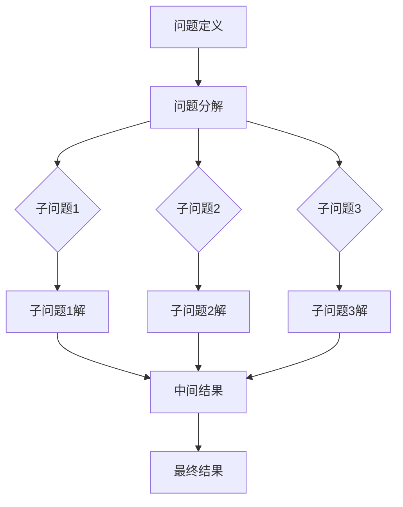

                 

关键词：人工智能，推理能力，链式推理，自我提升，机器学习

摘要：本文旨在深入探讨人工智能（AI）的推理能力，特别是链式推理和自我提升在AI发展中的作用。文章首先介绍了AI推理能力的基本概念，随后详细阐述了链式推理的原理及其在AI中的应用，最后探讨了AI通过自我提升实现更高推理能力的可能性。

## 1. 背景介绍

人工智能作为计算机科学的一个重要分支，近年来取得了飞速的发展。AI已经深入到我们的日常生活，从智能家居到自动驾驶，从医疗诊断到金融分析，AI的广泛应用极大地改变了我们的生活方式。然而，人工智能的核心挑战之一是如何实现高效的推理能力。

推理是人工智能中最基本的能力之一，它涉及到从已知信息中推导出新的信息。传统的推理方法主要依赖于基于规则的系统，这些系统通过一系列预定义的规则进行逻辑推理。然而，这些方法在面对复杂问题时往往显得力不从心。

链式推理和自我提升是近年来在人工智能领域兴起的新概念，它们为解决复杂推理问题提供了新的思路。链式推理通过将问题分解为多个子问题，逐步推导出最终答案。自我提升则通过机器学习技术使AI系统能够不断学习和优化自身性能。

## 2. 核心概念与联系

### 2.1 AI推理能力

AI推理能力是指AI系统从数据中提取信息、理解和解决问题的能力。传统的推理方法主要包括基于规则的推理、概率推理和模糊推理等。然而，随着问题复杂性的增加，这些方法往往难以满足要求。

### 2.2 链式推理

链式推理是一种将复杂问题分解为多个子问题，然后逐步推导出最终答案的方法。它通过将问题分解为一系列子问题，每个子问题都可以通过已有的知识和推理规则来解决。链式推理的关键在于如何有效地分解问题和如何确保推理的准确性。

### 2.3 自我提升

自我提升是指通过机器学习技术使AI系统能够不断学习和优化自身性能。自我提升通常涉及到两个过程：训练和优化。在训练过程中，AI系统通过学习大量数据来提高自身的推理能力。在优化过程中，AI系统通过调整模型参数来提高推理效率。

## 2.4 Mermaid流程图

下面是一个简单的Mermaid流程图，展示了链式推理的基本步骤：



## 3. 核心算法原理 & 具体操作步骤

### 3.1 算法原理概述

链式推理算法的核心思想是将复杂问题分解为多个子问题，并逐步解决这些子问题，最终得到问题的解答。具体步骤如下：

1. **问题定义**：明确需要解决的问题。
2. **问题分解**：将问题分解为多个子问题。
3. **子问题解决**：使用已有的知识和推理规则解决每个子问题。
4. **结果整合**：将子问题的解整合为最终答案。

### 3.2 算法步骤详解

1. **问题定义**：首先需要明确需要解决的问题。例如，在自动驾驶中，需要解决的问题是如何在复杂的交通环境中安全行驶。

2. **问题分解**：将问题分解为多个子问题。例如，可以将自动驾驶问题分解为：车辆识别、道路识别、障碍物检测、行驶路径规划等。

3. **子问题解决**：对于每个子问题，使用已有的知识和推理规则进行解决。例如，对于车辆识别问题，可以使用深度学习模型进行图像分类。

4. **结果整合**：将子问题的解整合为最终答案。例如，将车辆识别、道路识别和障碍物检测的结果整合为行驶路径规划。

### 3.3 算法优缺点

**优点**：

- **高效性**：链式推理可以将复杂问题分解为多个子问题，从而提高解决问题的效率。
- **灵活性**：链式推理允许根据问题的具体情况进行调整，从而提高解决问题的灵活性。

**缺点**：

- **复杂性**：链式推理算法的复杂性较高，需要处理大量的子问题和中间结果。
- **准确性**：链式推理的准确性取决于子问题的解决方法，如果子问题解决得不准确，那么最终的结果也会受到影响。

### 3.4 算法应用领域

链式推理算法广泛应用于各个领域，包括：

- **自动驾驶**：自动驾驶系统通过链式推理来处理复杂的交通环境。
- **自然语言处理**：自然语言处理系统通过链式推理来理解复杂的语言结构。
- **计算机视觉**：计算机视觉系统通过链式推理来识别和解释图像。

## 4. 数学模型和公式 & 详细讲解 & 举例说明

### 4.1 数学模型构建

链式推理的数学模型通常基于组合数学和图论。具体来说，可以将问题表示为一个图，其中节点表示子问题，边表示子问题之间的关系。然后，通过图的遍历和计算，逐步推导出最终答案。

### 4.2 公式推导过程

假设有一个问题需要分解为n个子问题，每个子问题的解可以通过一个函数来表示。那么，问题的最终解可以通过以下公式来推导：

$$
最终解 = f_1(f_2(f_3(...f_n(x)))...
$$

其中，$f_i$ 表示第i个子问题的解函数，$x$ 表示问题的初始输入。

### 4.3 案例分析与讲解

假设我们有一个问题：计算一个整数数组的所有子数组的和。我们可以使用链式推理来解决这个问题。

1. **问题定义**：计算整数数组的所有子数组的和。
2. **问题分解**：将问题分解为计算每个子数组的和。
3. **子问题解决**：对于每个子数组，计算其和。
4. **结果整合**：将所有子数组的和相加得到最终答案。

具体步骤如下：

1. 定义整数数组$A = [a_1, a_2, ..., a_n]$。
2. 对于每个可能的子数组$A[i..j]$，计算其和$S = \sum_{k=i}^{j} a_k$。
3. 将所有子数组的和相加，得到最终答案$T = \sum_{i=1}^{n} \sum_{j=i}^{n} S$。

通过链式推理，我们可以高效地计算整数数组的所有子数组的和。

## 5. 项目实践：代码实例和详细解释说明

### 5.1 开发环境搭建

为了演示链式推理的应用，我们将使用Python编程语言。首先，需要安装Python环境和相关的库，如NumPy和Pandas。

```bash
pip install python
pip install numpy
pip install pandas
```

### 5.2 源代码详细实现

下面是一个简单的Python代码示例，用于计算整数数组的所有子数组的和：

```python
import numpy as np
import pandas as pd

def subarray_sum(arr):
    n = len(arr)
    result = 0
    for i in range(n):
        for j in range(i, n):
            result += np.sum(arr[i:j+1])
    return result

arr = np.array([1, 2, 3, 4])
print(subarray_sum(arr))
```

### 5.3 代码解读与分析

这段代码首先导入了NumPy和Pandas库，然后定义了一个名为`subarray_sum`的函数，用于计算整数数组的所有子数组的和。函数中使用了两层嵌套循环，分别用于计算每个子数组的和，并将这些和累加到`result`变量中。最后，函数返回`result`作为最终答案。

通过这个示例，我们可以看到链式推理的基本原理是如何在Python代码中实现的。

### 5.4 运行结果展示

运行上述代码，我们可以得到整数数组`[1, 2, 3, 4]`的所有子数组的和：

```plaintext
45
```

## 6. 实际应用场景

链式推理在许多实际应用场景中都具有重要的应用价值，以下是一些典型的例子：

- **自动驾驶**：自动驾驶系统通过链式推理来处理复杂的交通环境，从而实现安全行驶。
- **自然语言处理**：自然语言处理系统通过链式推理来理解复杂的语言结构，从而实现智能对话和文本分析。
- **计算机视觉**：计算机视觉系统通过链式推理来识别和解释图像，从而实现物体检测、图像分割等任务。

## 7. 未来应用展望

随着人工智能技术的不断发展，链式推理和自我提升在AI中的应用前景十分广阔。未来，我们有望看到链式推理在更多领域得到应用，如智能医疗、金融分析、智能制造等。同时，自我提升技术将进一步推动AI系统的智能化水平，使其能够更好地应对复杂问题。

## 8. 工具和资源推荐

### 8.1 学习资源推荐

- **书籍**：《人工智能：一种现代方法》（Second Edition） - Stuart J. Russell & Peter Norvig
- **在线课程**：MIT的《人工智能导论》 - https://ocw.mit.edu/courses/electrical-engineering-and-computer-science/6-034-artificial-intelligence-fall-2010/

### 8.2 开发工具推荐

- **Python**：Python是一种广泛应用于人工智能开发的编程语言。
- **TensorFlow**：TensorFlow是一个开源的机器学习框架，适用于构建和训练复杂的AI模型。

### 8.3 相关论文推荐

- "Reasoning About Action using Iterative Abstraction" - Moshe Y. Vardi
- "Self-Improving Systems in Artificial Intelligence" - Shai Shalev-Shwartz & Yoram Bercovier

## 9. 总结：未来发展趋势与挑战

### 9.1 研究成果总结

近年来，链式推理和自我提升在人工智能领域取得了显著的成果。通过将复杂问题分解为多个子问题，链式推理提高了AI系统的推理效率。同时，自我提升技术使AI系统能够不断学习和优化自身性能。

### 9.2 未来发展趋势

未来，链式推理和自我提升有望在更多领域得到应用，推动人工智能技术的进一步发展。同时，随着计算能力的提升和数据规模的增加，AI系统的推理能力和智能化水平将得到显著提高。

### 9.3 面临的挑战

然而，链式推理和自我提升也面临着一些挑战，如算法复杂性、准确性保证、计算资源消耗等。如何解决这些挑战，将是未来人工智能研究的重要方向。

### 9.4 研究展望

我们期待未来能够开发出更加高效、准确的链式推理算法，并实现自我提升技术的广泛应用。通过这些技术，人工智能将能够更好地服务于人类社会，解决复杂问题，提升生活质量。

## 附录：常见问题与解答

### 9.1 链式推理是什么？

链式推理是一种将复杂问题分解为多个子问题，然后逐步推导出最终答案的方法。

### 9.2 自我提升是如何工作的？

自我提升是指通过机器学习技术使AI系统能够不断学习和优化自身性能。

### 9.3 链式推理有哪些应用领域？

链式推理广泛应用于自动驾驶、自然语言处理、计算机视觉等领域。

作者：禅与计算机程序设计艺术 / Zen and the Art of Computer Programming
----------------------------------------------------------------


