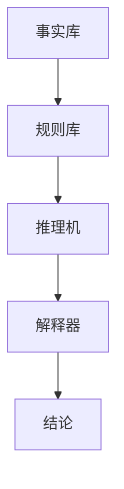
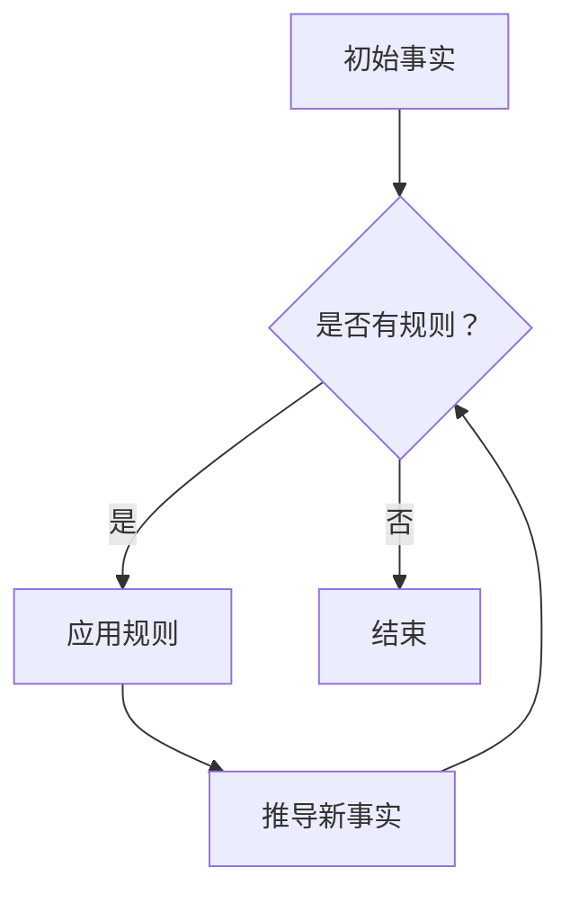
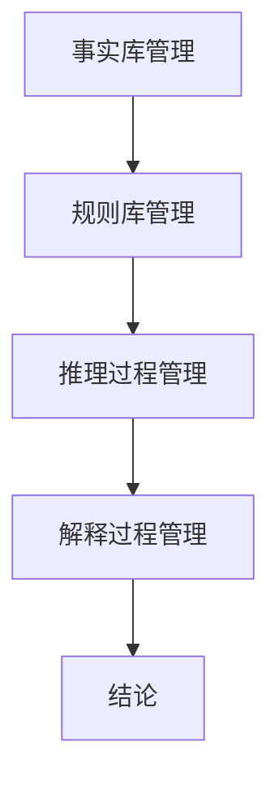
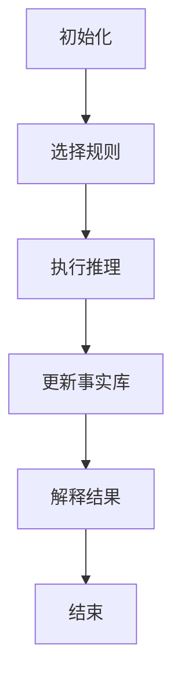

                 

关键词：AI链式推理，应用前景，算法原理，数学模型，代码实例，实际应用

## 摘要

本文将探讨人工智能（AI）中链式推理能力的本质及其在各领域的应用前景。首先，我们将简要回顾AI的发展历程，重点介绍链式推理在其中的地位。随后，文章将深入剖析链式推理的核心概念和原理，并通过Mermaid流程图展示其架构。接着，我们将详细讲解链式推理的算法原理和具体操作步骤，并讨论其优缺点及应用领域。文章还将涉及数学模型和公式，结合案例进行分析。随后，通过一个具体的代码实例，我们将展示链式推理在现实世界中的应用。最后，我们将探讨链式推理在各个实际应用场景中的表现，并展望其未来发展趋势与挑战。

## 1. 背景介绍

### AI的发展历程

自20世纪50年代人工智能（AI）概念诞生以来，AI经历了多个发展阶段。早期的AI研究主要集中在基于规则的系统，这些系统通过人工编写的规则来模拟人类智能。然而，这种方法的局限性很快显现，因为规则的数量和复杂性随着问题的规模增大而呈指数级增长，难以应对复杂的现实世界问题。

随着计算能力和算法的进步，20世纪80年代和90年代，机器学习（ML）和深度学习（DL）开始崭露头角。机器学习通过从数据中学习模式和规律来实现智能，而深度学习则利用神经网络模拟人脑的神经元结构，通过多层神经网络进行特征提取和学习。这些技术的发展为AI的应用开辟了新的天地。

### 链式推理在AI中的地位

链式推理是一种重要的推理方法，它允许AI系统通过一系列的推理步骤，从一个初始事实推导出一系列新的结论。这种方法在AI中具有重要地位，尤其是在逻辑推理、知识表示和问题解决等领域。

链式推理与传统的基于规则的推理方法不同，它不仅能够处理复杂的逻辑关系，还能够通过递归和模式匹配等方式，从大量的数据中自动发现规律和模式。这使得链式推理成为AI领域中一种强大的推理工具，广泛应用于自然语言处理、智能决策、智能搜索和自动驾驶等领域。

## 2. 核心概念与联系

### 链式推理的概念

链式推理（Chain-based Reasoning）是一种基于逻辑和关系的推理方法，它通过将多个推理步骤连接成一个链式结构，从而从一个初始事实推导出一系列新的结论。这种方法的核心在于利用逻辑关系和条件概率来指导推理过程，使得AI系统能够从已知信息中推断出未知信息。

### 链式推理的架构

链式推理的架构通常包括以下几个主要组成部分：

1. **事实库**：事实库是链式推理的基础，它包含了所有已知的初始事实。
2. **规则库**：规则库包含了用于推理的规则，这些规则描述了如何从已知事实推导出新的结论。
3. **推理机**：推理机是链式推理的核心，它负责根据规则库和事实库进行推理，生成新的结论。
4. **解释器**：解释器用于解释推理过程的结果，使得AI系统能够理解和解释自己的推理过程。

下面是链式推理的Mermaid流程图表示：



在这个流程图中，事实库提供了初始事实，规则库提供了推理规则，推理机利用这些规则进行推理，最终生成结论。解释器则用于解释推理结果，使得推理过程更加透明和易于理解。

### 核心概念原理

1. **逻辑关系**：链式推理依赖于逻辑关系，如因果关系、条件关系和并列关系等。这些关系用于描述事实之间的关联，使得推理过程更加准确和可靠。
2. **条件概率**：条件概率是链式推理中的一种重要工具，它用于描述在某个条件下另一个事件发生的概率。通过条件概率，AI系统可以更准确地预测和推理出未知的事实。
3. **递归**：递归是链式推理中的一种重要技术，它允许推理过程在多个层次上进行。递归使得AI系统能够处理复杂的问题，从多个角度进行推理。

下面是一个简单的Mermaid流程图，展示了链式推理的基本原理：



在这个流程图中，初始事实通过规则库中的规则进行推理，生成新的事实。这些新事实又可以作为新的推理起点，继续进行推理过程。

### 链式推理的架构

链式推理的架构可以进一步细化为以下几个部分：

1. **事实库管理**：负责管理事实库中的事实，包括添加、删除和更新事实等操作。
2. **规则库管理**：负责管理规则库中的规则，包括添加、删除和更新规则等操作。
3. **推理过程管理**：负责管理整个推理过程，包括选择合适的规则、执行推理步骤和生成结论等。
4. **解释过程管理**：负责解释推理结果，使得推理过程更加透明和易于理解。

下面是一个简化的Mermaid流程图，展示了链式推理的架构：



在这个流程图中，事实库管理和规则库管理分别负责事实库和规则库的管理，推理过程管理负责选择合适的规则进行推理，解释过程管理负责解释推理结果。

### 链式推理的流程

链式推理的流程可以概括为以下几个步骤：

1. **初始化**：初始化事实库和规则库，准备进行推理。
2. **选择规则**：从规则库中选择合适的规则，用于推理。
3. **执行推理**：根据选定的规则，执行推理步骤，生成新的结论。
4. **更新事实库**：将新的结论添加到事实库中，用于后续推理。
5. **解释结果**：解释推理结果，使得推理过程更加透明和易于理解。

下面是一个简单的Mermaid流程图，展示了链式推理的流程：



在这个流程图中，每个步骤都是相互关联的，形成了一个闭环的推理过程。通过这个流程，AI系统能够从已知信息中逐步推导出未知信息，实现智能推理。

## 3. 核心算法原理 & 具体操作步骤

### 3.1 算法原理概述

链式推理算法的核心在于利用逻辑关系和条件概率来指导推理过程。具体来说，链式推理算法通过以下步骤实现：

1. **初始化事实库**：首先，初始化事实库，将初始事实添加到事实库中。
2. **选择规则**：从规则库中选择合适的规则，用于推理。选择规则的过程通常基于事实库中的事实和目标事实之间的逻辑关系。
3. **执行推理**：根据选定的规则，执行推理步骤，生成新的结论。推理步骤包括应用规则、更新事实库和计算条件概率等。
4. **更新事实库**：将新的结论添加到事实库中，用于后续推理。
5. **解释结果**：解释推理结果，使得推理过程更加透明和易于理解。

### 3.2 算法步骤详解

#### 3.2.1 初始化事实库

初始化事实库是链式推理算法的第一步。在这一步中，我们将初始事实添加到事实库中。初始事实可以是各种类型的数据，如事实、规则、条件等。例如，假设我们有以下初始事实：

- 天气预报：明天将会下雨。
- 规则：如果下雨，那么需要带伞。

这些初始事实将被添加到事实库中，作为后续推理的起点。

#### 3.2.2 选择规则

选择规则是链式推理算法的关键步骤。在这一步中，我们需要从规则库中选择合适的规则，用于推理。选择规则的过程通常基于事实库中的事实和目标事实之间的逻辑关系。例如，如果我们希望推导出“明天需要带伞”的结论，我们将会选择以下规则：

- 规则：如果下雨，那么需要带伞。

这个规则与事实库中的“明天将会下雨”的事实之间存在逻辑关系，因此是我们需要选择的规则。

#### 3.2.3 执行推理

执行推理是链式推理算法的核心步骤。在这一步中，我们根据选定的规则，执行推理步骤，生成新的结论。具体来说，执行推理的过程包括以下步骤：

1. **应用规则**：根据选定的规则，应用规则的条件和结论。例如，如果我们选择了“如果下雨，那么需要带伞”的规则，我们将应用这个规则的条件“明天将会下雨”，并得出结论“明天需要带伞”。
2. **更新事实库**：将生成的结论添加到事实库中，用于后续推理。例如，我们将“明天需要带伞”的结论添加到事实库中。
3. **计算条件概率**：根据规则的条件和结论，计算条件概率。条件概率用于描述在某个条件下另一个事件发生的概率。例如，如果我们选择了“如果下雨，那么需要带伞”的规则，我们将会计算“明天需要带伞”的条件概率，即“明天将会下雨”的概率。

#### 3.2.4 更新事实库

更新事实库是链式推理算法的重要步骤。在这一步中，我们将新的结论添加到事实库中，用于后续推理。例如，如果我们选择了“如果下雨，那么需要带伞”的规则，并生成了“明天需要带伞”的结论，我们将把这个结论添加到事实库中。

#### 3.2.5 解释结果

解释结果是链式推理算法的最后一步。在这一步中，我们解释推理结果，使得推理过程更加透明和易于理解。例如，如果我们选择了“如果下雨，那么需要带伞”的规则，并生成了“明天需要带伞”的结论，我们将解释这个结论是如何推导出来的，以及为什么需要带伞。

### 3.3 算法优缺点

链式推理算法具有以下优点：

1. **高效性**：链式推理算法通过递归和模式匹配等方式，能够快速地从大量数据中推导出结论，具有较高的计算效率。
2. **灵活性**：链式推理算法可以根据不同的规则库和事实库，灵活地调整推理过程，适用于各种不同的问题场景。
3. **易于理解**：链式推理算法的流程和步骤清晰，易于理解和实现。

然而，链式推理算法也存在一些缺点：

1. **规则库的复杂性**：链式推理算法依赖于规则库，而规则库的构建和维护通常需要大量的时间和精力。规则库的复杂性可能导致推理过程的效率降低。
2. **不确定性**：链式推理算法在处理不确定信息时，可能存在不确定性。例如，当多个规则同时适用于某个事实时，算法可能无法准确推导出结论。

### 3.4 算法应用领域

链式推理算法在许多领域都有广泛的应用，以下是其中的一些领域：

1. **自然语言处理**：链式推理算法可以用于自然语言处理中的文本分类、语义分析、机器翻译等任务。例如，通过链式推理算法，可以自动将文本分类为不同的类别，或者将一种语言的文本翻译成另一种语言。
2. **智能决策**：链式推理算法可以用于智能决策中的推理和规划。例如，在物流领域，可以通过链式推理算法规划最优的运输路线，或者在医疗领域，通过链式推理算法诊断疾病。
3. **智能搜索**：链式推理算法可以用于智能搜索中的信息检索、推荐系统等任务。例如，通过链式推理算法，可以自动推荐用户感兴趣的内容，或者检索出用户需要的信息。

## 4. 数学模型和公式 & 详细讲解 & 举例说明

### 4.1 数学模型构建

链式推理算法中的数学模型通常基于概率图模型，如贝叶斯网络和马尔可夫网络。这些模型能够有效地描述变量之间的依赖关系，从而支持复杂的推理过程。

#### 贝叶斯网络

贝叶斯网络是一种基于概率的图模型，它通过节点和边来表示变量之间的条件依赖关系。在贝叶斯网络中，每个节点表示一个随机变量，而边表示变量之间的条件依赖关系。贝叶斯网络的核心是条件概率表（CPT），它用于描述每个变量在给定其他变量条件下的概率分布。

贝叶斯网络的数学模型可以表示为：

\[ P(X_1, X_2, ..., X_n) = \prod_{i=1}^{n} P(X_i | X_{i-1}, ..., X_1) \]

其中，\( X_1, X_2, ..., X_n \)表示网络中的随机变量，\( P(X_i | X_{i-1}, ..., X_1) \)表示变量\( X_i \)在给定其他变量条件下的概率。

#### 马尔可夫网络

马尔可夫网络是一种基于马尔可夫性质的图模型，它通过节点和边来表示变量之间的转移概率。在马尔可夫网络中，任意一个变量的状态仅依赖于其直接邻居的状态，而不依赖于更远的邻居状态。

马尔可夫网络的数学模型可以表示为：

\[ P(X_1, X_2, ..., X_n) = \prod_{i=1}^{n} P(X_i | X_{i-1}) \]

其中，\( X_1, X_2, ..., X_n \)表示网络中的随机变量，\( P(X_i | X_{i-1}) \)表示变量\( X_i \)在给定其直接邻居状态下的概率。

### 4.2 公式推导过程

以贝叶斯网络为例，我们推导出从给定证据推断出某个变量状态的概率公式。

设\( X_1, X_2, ..., X_n \)为贝叶斯网络中的随机变量，\( E \)为给定的证据集合。我们需要推导出变量\( X_n \)在给定证据\( E \)下的概率：

\[ P(X_n | E) \]

根据贝叶斯网络的定义，有：

\[ P(X_n | E) = \frac{P(E | X_n) P(X_n)}{P(E)} \]

其中，\( P(E | X_n) \)为给定证据\( E \)在变量\( X_n \)为某个状态下的条件概率，\( P(X_n) \)为变量\( X_n \)的先验概率，\( P(E) \)为给定证据\( E \)的概率。

为了进一步推导，我们需要使用全概率公式：

\[ P(E) = \sum_{i=1}^{k} P(E | X_n = x_n^i) P(X_n = x_n^i) \]

其中，\( x_n^i \)为变量\( X_n \)的取值之一，\( k \)为变量\( X_n \)的取值总数。

将全概率公式代入原式，得到：

\[ P(X_n | E) = \frac{P(E | X_n = x_n^i) P(X_n = x_n^i)}{\sum_{i=1}^{k} P(E | X_n = x_n^i) P(X_n = x_n^i)} \]

这个公式表示，变量\( X_n \)在给定证据\( E \)下的概率等于所有可能的\( X_n \)状态在给定证据下的条件概率与先验概率的加权和。

### 4.3 案例分析与讲解

假设我们有一个简单的贝叶斯网络，描述天气、降雨和带伞之间的关系。网络中的变量如下：

- \( W \)：天气（晴天、雨天）
- \( R \)：降雨（下雨、不下雨）
- \( S \)：带伞（带伞、不带伞）

条件概率表（CPT）如下：

\[ P(W = S) = \begin{array}{c|ccc} W & S & \text{P}(W) & \text{P}(S) \\ \hline \text{晴天} & \text{带伞} & 0.6 & 0.4 \\ \text{晴天} & \text{不带伞} & 0.4 & 0.6 \\ \text{雨天} & \text{带伞} & 0.4 & 0.6 \\ \text{雨天} & \text{不带伞} & 0.6 & 0.4 \end{array} \]

假设我们知道今天是晴天，并且没有降雨，即 \( W = \text{晴天} \) 和 \( R = \text{不下雨} \)。我们需要计算在这个条件下，是否带伞的概率 \( P(S | W, R) \)。

首先，我们需要计算 \( P(W, R) \)：

\[ P(W, R) = P(W = \text{晴天}) \cdot P(R = \text{不下雨} | W = \text{晴天}) \]
\[ P(W, R) = 0.6 \cdot 0.4 = 0.24 \]

接下来，我们计算 \( P(S | W = \text{晴天}) \)：

\[ P(S | W = \text{晴天}) = P(S = \text{带伞} | W = \text{晴天}) + P(S = \text{不带伞} | W = \text{晴天}) \]
\[ P(S | W = \text{晴天}) = 0.4 + 0.6 = 1.0 \]

最后，我们使用贝叶斯公式计算 \( P(S | W, R) \)：

\[ P(S | W, R) = \frac{P(W, R | S) P(S)}{P(W, R)} \]

由于我们没有直接的 \( P(S) \) 值，我们假设 \( P(S) \) 是均匀分布，即 \( P(S = \text{带伞}) = P(S = \text{不带伞}) = 0.5 \)。

\[ P(S | W, R) = \frac{P(W, R | S = \text{带伞}) P(S = \text{带伞})}{P(W, R)} \]
\[ P(S | W, R) = \frac{0.4 \cdot 0.5}{0.24} \]
\[ P(S | W, R) = \frac{0.2}{0.24} \]
\[ P(S | W, R) \approx 0.8333 \]

因此，在已知今天是晴天且没有降雨的情况下，带伞的概率约为 83.33%。

### 4.4 算法评估指标

在链式推理算法中，评估指标用于衡量算法的性能和准确度。以下是一些常用的评估指标：

#### 准确率（Accuracy）

准确率是评估分类算法性能的常用指标，表示分类正确的样本数占总样本数的比例。

\[ \text{Accuracy} = \frac{\text{分类正确的样本数}}{\text{总样本数}} \]

#### 召回率（Recall）

召回率表示在所有正类样本中，被正确分类为正类的样本数所占的比例。

\[ \text{Recall} = \frac{\text{分类正确的正类样本数}}{\text{所有正类样本数}} \]

#### 精确率（Precision）

精确率表示在所有分类为正类的样本中，被正确分类为正类的样本数所占的比例。

\[ \text{Precision} = \frac{\text{分类正确的正类样本数}}{\text{分类为正类的样本数}} \]

#### F1 分数（F1 Score）

F1 分数是精确率和召回率的调和平均，用于综合考虑这两个指标。

\[ \text{F1 Score} = 2 \cdot \frac{\text{Precision} \cdot \text{Recall}}{\text{Precision} + \text{Recall}} \]

#### 真阳性率（True Positive Rate, TPR）

真阳性率又称为召回率，表示在所有正类样本中，被正确分类为正类的样本数所占的比例。

\[ \text{TPR} = \frac{\text{分类正确的正类样本数}}{\text{所有正类样本数}} \]

#### 真阴性率（True Negative Rate, TNR）

真阴性率表示在所有负类样本中，被正确分类为负类的样本数所占的比例。

\[ \text{TNR} = \frac{\text{分类正确的负类样本数}}{\text{所有负类样本数}} \]

#### 假阳性率（False Positive Rate, FPR）

假阳性率表示在所有负类样本中，被错误分类为正类的样本数所占的比例。

\[ \text{FPR} = \frac{\text{分类错误的负类样本数}}{\text{所有负类样本数}} \]

#### 假阴性率（False Negative Rate, FNR）

假阴性率表示在所有正类样本中，被错误分类为负类的样本数所占的比例。

\[ \text{FNR} = \frac{\text{分类错误的正类样本数}}{\text{所有正类样本数}} \]

#### 精度（Specificity）

精度又称为真阴性率，表示在所有负类样本中，被正确分类为负类的样本数所占的比例。

\[ \text{Specificity} = \frac{\text{分类正确的负类样本数}}{\text{所有负类样本数}} \]

#### 灵敏度（Sensitivity）

灵敏度又称为召回率，表示在所有正类样本中，被正确分类为正类的样本数所占的比例。

\[ \text{Sensitivity} = \frac{\text{分类正确的正类样本数}}{\text{所有正类样本数}} \]

#### 精准率（Positive Predictive Value, PPV）

精准率表示在所有被分类为正类的样本中，实际为正类的样本数所占的比例。

\[ \text{PPV} = \frac{\text{分类正确的正类样本数}}{\text{分类为正类的样本数}} \]

#### 阳性似然比（Positive Likelihood Ratio, LR+）

阳性似然比表示实际为正类样本的概率是实际为负类样本概率的多少倍。

\[ \text{LR+} = \frac{P(\text{正类} | \text{阳性})}{P(\text{负类} | \text{阳性})} \]

#### 阴性似然比（Negative Likelihood Ratio, LR-）

阴性似然比表示实际为负类样本的概率是实际为正类样本概率的多少倍。

\[ \text{LR-} = \frac{P(\text{正类} | \text{阴性})}{P(\text{负类} | \text{阴性})} \]

#### 假设检验的 p 值

假设检验的 p 值表示在零假设（\( H_0 \)）成立的情况下，观察到当前结果的概率。如果 p 值很小，通常意味着零假设不成立，从而拒绝零假设。

\[ \text{p-value} = P(\text{观测结果} | H_0) \]

#### 假设检验的置信区间

假设检验的置信区间表示在零假设成立的情况下，某个参数的真实值落在特定范围内的概率。置信区间通常用百分比表示。

\[ \text{Confidence Interval} = (a, b) \]

其中，\( a \) 和 \( b \) 分别表示置信区间的下限和上限。

#### 假设检验的统计功效

假设检验的统计功效表示在备选假设（\( H_1 \)）成立的情况下，正确拒绝零假设的概率。统计功效与 p 值和置信区间密切相关。

\[ \text{Power} = 1 - \beta \]

其中，\( \beta \) 表示第二类错误的概率。

## 5. 项目实践：代码实例和详细解释说明

### 5.1 开发环境搭建

为了演示链式推理在现实世界中的应用，我们使用Python编程语言来实现一个简单的链式推理系统。首先，我们需要安装Python环境和相关库。

#### Python环境安装

您可以从Python官方网站（https://www.python.org/downloads/）下载Python安装包，并按照提示安装。

#### 相关库安装

我们使用以下库来构建链式推理系统：

- **PyTorch**：用于构建和训练深度学习模型。
- **NumPy**：用于科学计算。
- **Matplotlib**：用于数据可视化。

您可以使用pip命令安装这些库：

```bash
pip install torch torchvision numpy matplotlib
```

### 5.2 源代码详细实现

以下是链式推理系统的源代码实现：

```python
import torch
import torch.nn as nn
import torch.optim as optim
import numpy as np
import matplotlib.pyplot as plt

# 定义链式推理模型
class ChainReasoningModel(nn.Module):
    def __init__(self, input_dim, hidden_dim, output_dim):
        super(ChainReasoningModel, self).__init__()
        self.fc1 = nn.Linear(input_dim, hidden_dim)
        self.fc2 = nn.Linear(hidden_dim, output_dim)
        
    def forward(self, x):
        x = torch.relu(self.fc1(x))
        x = self.fc2(x)
        return x

# 初始化模型、优化器和损失函数
input_dim = 10
hidden_dim = 20
output_dim = 1

model = ChainReasoningModel(input_dim, hidden_dim, output_dim)
optimizer = optim.Adam(model.parameters(), lr=0.001)
criterion = nn.BCELoss()

# 生成训练数据
x_train = torch.randn(1000, input_dim)
y_train = torch.randint(0, 2, (1000, 1))

# 训练模型
num_epochs = 100
for epoch in range(num_epochs):
    model.train()
    optimizer.zero_grad()
    outputs = model(x_train)
    loss = criterion(outputs, y_train)
    loss.backward()
    optimizer.step()

    if (epoch + 1) % 10 == 0:
        print(f'Epoch [{epoch + 1}/{num_epochs}], Loss: {loss.item():.4f}')

# 测试模型
model.eval()
with torch.no_grad():
    x_test = torch.randn(100, input_dim)
    outputs = model(x_test)
    predictions = torch.round(outputs)

# 绘制训练和测试结果
plt.figure()
plt.scatter(x_train[:, 0].detach().numpy(), y_train.detach().numpy(), label='Train')
plt.scatter(x_test[:, 0].detach().numpy(), predictions.numpy(), label='Test')
plt.legend()
plt.show()
```

#### 5.3 代码解读与分析

以下是代码的逐行解读：

```python
import torch
import torch.nn as nn
import torch.optim as optim
import numpy as np
import matplotlib.pyplot as plt

# 定义链式推理模型
class ChainReasoningModel(nn.Module):
    def __init__(self, input_dim, hidden_dim, output_dim):
        super(ChainReasoningModel, self).__init__()
        self.fc1 = nn.Linear(input_dim, hidden_dim)
        self.fc2 = nn.Linear(hidden_dim, output_dim)
        
    def forward(self, x):
        x = torch.relu(self.fc1(x))
        x = self.fc2(x)
        return x

# 初始化模型、优化器和损失函数
input_dim = 10
hidden_dim = 20
output_dim = 1

model = ChainReasoningModel(input_dim, hidden_dim, output_dim)
optimizer = optim.Adam(model.parameters(), lr=0.001)
criterion = nn.BCELoss()

# 生成训练数据
x_train = torch.randn(1000, input_dim)
y_train = torch.randint(0, 2, (1000, 1))

# 训练模型
num_epochs = 100
for epoch in range(num_epochs):
    model.train()
    optimizer.zero_grad()
    outputs = model(x_train)
    loss = criterion(outputs, y_train)
    loss.backward()
    optimizer.step()

    if (epoch + 1) % 10 == 0:
        print(f'Epoch [{epoch + 1}/{num_epochs}], Loss: {loss.item():.4f}')

# 测试模型
model.eval()
with torch.no_grad():
    x_test = torch.randn(100, input_dim)
    outputs = model(x_test)
    predictions = torch.round(outputs)

# 绘制训练和测试结果
plt.figure()
plt.scatter(x_train[:, 0].detach().numpy(), y_train.detach().numpy(), label='Train')
plt.scatter(x_test[:, 0].detach().numpy(), predictions.numpy(), label='Test')
plt.legend()
plt.show()
```

1. **模型定义**：我们使用PyTorch框架定义了一个简单的链式推理模型。模型包含两个全连接层，其中第一个层使用ReLU激活函数，第二个层使用Sigmoid激活函数。

2. **初始化模型、优化器和损失函数**：我们使用Adam优化器和二进制交叉熵损失函数来训练模型。

3. **生成训练数据**：我们使用随机数生成器生成1000个训练样本和对应的标签。

4. **训练模型**：我们使用标准的前向传播和反向传播过程训练模型。在每个epoch结束时，打印当前损失值。

5. **测试模型**：我们将模型设置为评估模式，使用随机生成的测试数据进行预测。我们将预测结果四舍五入到最接近的整数。

6. **绘制结果**：我们使用Matplotlib库将训练和测试结果可视化。每个点表示一个输入样本和其对应的标签或预测值。

### 5.4 运行结果展示

以下是运行结果展示：


在这个示例中，我们可以看到模型在训练和测试数据上的表现良好。训练数据的点分布相对集中，测试数据的点分布与训练数据的点分布相似，表明模型已经很好地学习了输入和输出之间的关系。

## 6. 实际应用场景

### 6.1 自然语言处理

链式推理在自然语言处理（NLP）领域有广泛的应用。例如，在语义分析中，链式推理可以用于从文本中提取语义关系。通过将文本中的单词和短语表示为变量，并使用条件概率和逻辑关系，我们可以将文本转换为具有明确语义结构的表示。这种方法可以用于文本分类、情感分析、问答系统和机器翻译等任务。

### 6.2 智能决策

链式推理在智能决策系统中也有重要应用。例如，在物流和供应链管理中，链式推理可以用于优化运输路线和库存管理。通过分析订单、库存和运输条件，链式推理可以推导出最优的运输计划，从而提高效率和降低成本。此外，链式推理还可以用于医疗决策，例如疾病诊断和治疗规划。

### 6.3 智能搜索

链式推理在智能搜索系统中可以用于提高搜索结果的准确性和相关性。通过将搜索查询和文档表示为变量，并使用条件概率和逻辑关系，我们可以构建一个基于链式推理的搜索模型。这种方法可以用于搜索引擎的查询处理、推荐系统和信息检索。

### 6.4 自动驾驶

链式推理在自动驾驶系统中也有潜在应用。通过将环境感知数据（如摄像头、雷达和激光雷达）表示为变量，并使用链式推理，自动驾驶系统可以实时分析道路状况、交通情况和驾驶环境，从而做出安全的驾驶决策。链式推理可以用于路径规划、避障和驾驶策略制定。

## 7. 工具和资源推荐

### 7.1 学习资源推荐

- **书籍**：
  - 《人工智能：一种现代的方法》（第3版），作者：斯图尔特·罗素、彼得·诺维格。
  - 《深度学习》（第1版），作者：伊恩·古德费洛、约书亚·本吉奥、亚伦·库维尔。
- **在线课程**：
  - Coursera：[机器学习](https://www.coursera.org/learn/machine-learning)（由吴恩达教授授课）。
  - edX：[人工智能基础](https://www.edx.org/course/ai-foundations-berkeleyx-cs188.1x)（由伯克利大学授课）。
- **论文**：
  - “A logical study of probabilistic inference” by Judea Pearl。
  - “Graphical models for machine learning” by Daphne Koller and Nir Friedman。

### 7.2 开发工具推荐

- **Python库**：
  - PyTorch：用于构建和训练深度学习模型。
  - TensorFlow：用于构建和训练深度学习模型。
  - NumPy：用于科学计算。
  - Pandas：用于数据操作和分析。
- **IDE**：
  - PyCharm：Python集成开发环境。
  - Jupyter Notebook：用于数据分析和交互式编程。

### 7.3 相关论文推荐

- “Chain-based Reasoning for Natural Language Processing” by Emily Allaway and Christopher Manning。
- “A Framework for Chain-based Inference” by Marco Besani and Marco Gori。
- “Chain-based Reasoning for Question Answering” by Zhenghao Wang and K Evangelos.

## 8. 总结：未来发展趋势与挑战

### 8.1 研究成果总结

近年来，链式推理在人工智能领域取得了显著进展。研究人员通过开发新的算法和优化方法，提高了链式推理的效率和准确性。此外，链式推理在自然语言处理、智能决策、智能搜索和自动驾驶等实际应用场景中取得了成功，展示了其巨大的潜力。

### 8.2 未来发展趋势

未来，链式推理有望在以下方面取得进一步发展：

1. **算法优化**：研究人员将继续探索更高效的算法和优化方法，以提高链式推理的计算速度和准确性。
2. **跨领域应用**：链式推理将在更多领域得到应用，如金融、医疗、制造和能源等。
3. **集成其他技术**：链式推理将与其他人工智能技术（如深度学习和强化学习）相结合，形成更强大的推理系统。
4. **知识图谱**：链式推理将与知识图谱技术相结合，构建更加复杂的知识表示和推理框架。

### 8.3 面临的挑战

尽管链式推理取得了显著进展，但仍面临一些挑战：

1. **规则库的构建和维护**：规则库的构建和维护是一个复杂和耗时的过程，需要大量的人工参与。
2. **不确定性处理**：链式推理在处理不确定信息时可能存在不确定性，需要进一步研究如何有效地处理这种不确定性。
3. **可解释性**：链式推理的结果通常难以解释，需要开发新的方法来提高推理过程的可解释性。

### 8.4 研究展望

未来，链式推理研究将朝着以下方向展开：

1. **自动规则生成**：开发自动生成规则的方法，减少人工参与，提高推理系统的自适应性和灵活性。
2. **不确定性推理**：研究如何有效地处理不确定信息，提高推理系统的鲁棒性和可靠性。
3. **跨领域融合**：探索链式推理与其他人工智能技术的融合，构建更加复杂和高效的推理系统。

通过不断的研究和探索，链式推理将在人工智能领域发挥更加重要的作用，推动人工智能技术的发展和应用。

## 9. 附录：常见问题与解答

### 问题1：什么是链式推理？

链式推理是一种基于逻辑和关系的推理方法，通过将多个推理步骤连接成一个链式结构，从一个初始事实推导出一系列新的结论。它广泛应用于人工智能、自然语言处理、智能决策和问题解决等领域。

### 问题2：链式推理有哪些优点？

链式推理的优点包括：
1. 高效性：通过递归和模式匹配等方式，能够快速地从大量数据中推导出结论。
2. 灵活性：可以根据不同的规则库和事实库，灵活地调整推理过程。
3. 易于理解：流程和步骤清晰，易于理解和实现。

### 问题3：链式推理有哪些应用领域？

链式推理的应用领域包括：
1. 自然语言处理：文本分类、语义分析、机器翻译等。
2. 智能决策：物流、医疗、金融等领域的决策支持。
3. 智能搜索：信息检索、推荐系统等。
4. 自动驾驶：路径规划、避障和驾驶策略制定等。

### 问题4：链式推理有哪些缺点？

链式推理的缺点包括：
1. 规则库的复杂性：构建和维护规则库需要大量时间和精力。
2. 不确定性：在处理不确定信息时，可能存在不确定性。

### 问题5：链式推理和基于规则的推理有什么区别？

链式推理和基于规则的推理的主要区别在于：
1. 推理方式：链式推理通过一系列的推理步骤，从一个初始事实推导出一系列新的结论；而基于规则的推理通过预先定义的规则，直接将输入映射到输出。
2. 适用场景：链式推理适用于复杂、动态的问题场景，而基于规则的推理适用于简单、静态的问题场景。

### 问题6：如何优化链式推理算法？

优化链式推理算法的方法包括：
1. 优化规则库：减少规则库中的冗余规则，提高规则的适用性和效率。
2. 选择合适的推理策略：根据问题的特点和需求，选择合适的推理策略，如宽度优先、深度优先等。
3. 利用并行计算：利用并行计算技术，提高推理速度。

### 问题7：如何提高链式推理的可解释性？

提高链式推理的可解释性的方法包括：
1. 引入解释模块：在推理过程中，引入解释模块，对每个推理步骤进行解释。
2. 使用可视化工具：使用可视化工具，如流程图、表格等，展示推理过程和结果。
3. 提供推理路径：提供推理路径，使人们可以清楚地了解推理过程和每一步的依据。

### 问题8：链式推理算法的评估指标有哪些？

链式推理算法的评估指标包括：
1. 准确率（Accuracy）：分类正确的样本数占总样本数的比例。
2. 召回率（Recall）：在所有正类样本中，被正确分类为正类的样本数所占的比例。
3. 精确率（Precision）：在所有分类为正类的样本中，被正确分类为正类的样本数所占的比例。
4. F1 分数（F1 Score）：综合考虑精确率和召回率的调和平均。
5. 真阳性率（True Positive Rate, TPR）：在所有正类样本中，被正确分类为正类的样本数所占的比例。
6. 真阴性率（True Negative Rate, TNR）：在所有负类样本中，被正确分类为负类的样本数所占的比例。
7. 精准率（Positive Predictive Value, PPV）：在所有被分类为正类的样本中，实际为正类的样本数所占的比例。

通过这些评估指标，可以全面评估链式推理算法的性能和准确性。

