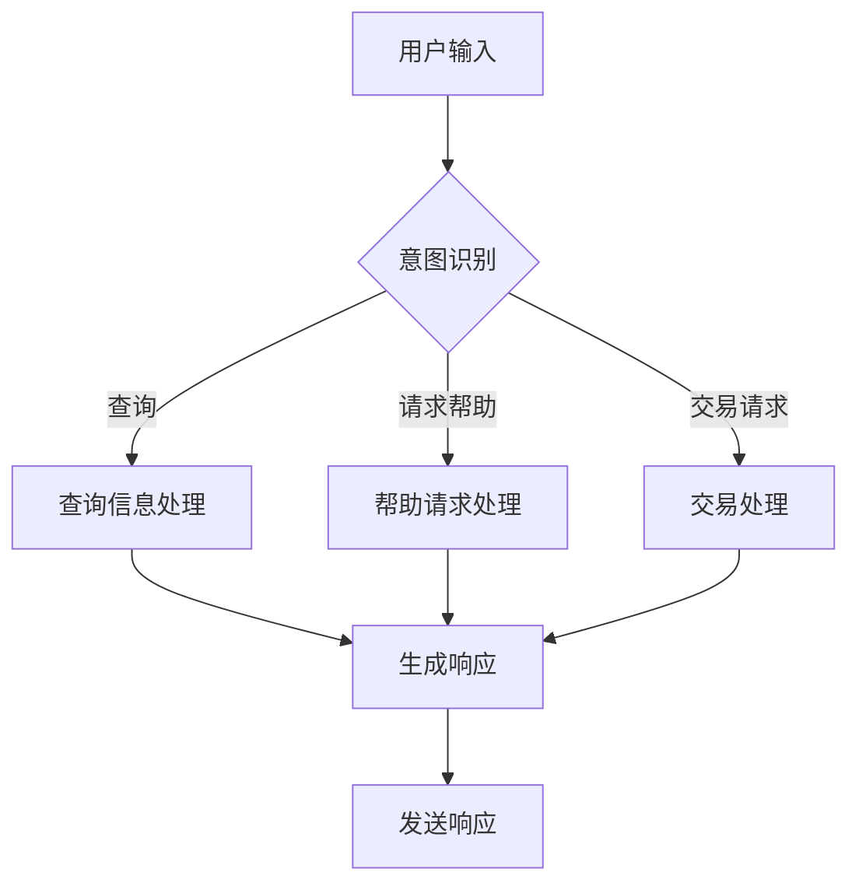

                 

人工智能技术正在以惊人的速度发展，其中聊天机器人是近年来的一个热门话题。它们能够模拟人类的对话方式，与用户进行自然语言交互，为用户提供便捷的服务和解决方案。本文将探讨如何通过技术手段提升聊天机器人的互动效果，从而在商业、教育、医疗等多个领域发挥更大的作用。

> 关键词：AI聊天机器人，自然语言处理，互动效果，应用场景，发展趋势

> 摘要：本文首先介绍了聊天机器人的基本概念和背景，然后探讨了提升聊天机器人互动效果的关键技术，如自然语言处理、对话管理系统和情感计算。接着，通过实际应用案例展示了聊天机器人在不同领域的应用，并对其未来发展进行了展望。最后，推荐了一些学习资源和开发工具，以帮助读者深入了解和掌握聊天机器人的开发技术。

## 1. 背景介绍

聊天机器人，也被称为虚拟助手或对话代理，是一种基于人工智能技术的计算机程序，能够通过与用户的自然语言交互来提供信息、解决问题或执行特定任务。随着自然语言处理（NLP）和机器学习技术的不断发展，聊天机器人的功能和性能得到了显著提升，已经成为企业客户服务、在线咨询、个人助理等多个领域的热门应用。

### 1.1 发展历程

- **早期探索**：早在20世纪50年代，计算机科学家便开始研究如何使计算机具备自然语言理解能力。1950年，艾伦·图灵提出了著名的图灵测试，旨在评估计算机是否具有人类水平的智能。
- **文本聊天机器人**：20世纪90年代，随着互联网的普及，文本聊天机器人开始崭露头角。这些机器人通常基于规则引擎，通过与用户的简单文本输入进行交互。
- **基于机器学习的聊天机器人**：21世纪初，随着机器学习技术的发展，聊天机器人开始采用更为复杂的算法，如循环神经网络（RNN）和长短期记忆网络（LSTM），以提高对话的连贯性和语义理解能力。
- **语音交互聊天机器人**：近年来，随着语音识别技术的进步，聊天机器人逐渐从文本交互转向语音交互，如苹果的Siri、亚马逊的Alexa等。

### 1.2 应用领域

- **客户服务**：许多企业已经采用聊天机器人来提供24/7的客户支持，减少人工成本，提高响应速度。
- **在线咨询**：在教育、医疗、法律等领域，聊天机器人可以提供专业的咨询服务，帮助用户获取所需信息。
- **个人助理**：个人助理聊天机器人如Google Assistant、Apple Siri等，能够帮助用户管理日程、发送消息、播放音乐等。

## 2. 核心概念与联系

聊天机器人的核心在于其自然语言处理（NLP）能力和对话管理系统（DMS）。NLP负责理解和生成自然语言，而DMS则负责管理对话流程，确保机器人能够提供连贯且合适的回答。

### 2.1 自然语言处理（NLP）

NLP是使计算机理解和处理人类语言的技术。其核心任务包括：

- **分词**：将连续的文本切分成单词或短语。
- **词性标注**：识别文本中的单词或短语的语法属性。
- **句法分析**：分析句子结构，理解句子的语法关系。
- **语义理解**：理解文本中的含义，进行语义分析。

### 2.2 对话管理系统（DMS）

DMS是聊天机器人的“大脑”，负责管理对话的整个生命周期。其核心组成部分包括：

- **意图识别**：理解用户输入的意图，如查询信息、请求帮助或进行交易。
- **实体抽取**：从用户输入中提取关键信息，如日期、时间、地点等。
- **对话策略**：根据意图和上下文信息，选择合适的对话响应。
- **对话状态跟踪**：维护对话的历史状态，确保对话的连贯性。

### 2.3 Mermaid 流程图

以下是一个简化的聊天机器人流程图：



## 3. 核心算法原理 & 具体操作步骤

### 3.1 算法原理概述

聊天机器人的核心算法主要包括自然语言处理（NLP）算法和对话管理系统（DMS）算法。NLP算法负责理解用户的语言输入，而DMS算法则负责管理整个对话过程。

### 3.2 算法步骤详解

1. **用户输入处理**：
   - **文本处理**：对用户输入的文本进行分词、词性标注等预处理操作。
   - **语音处理**：对于语音输入，首先进行语音识别，然后转换为文本。

2. **意图识别**：
   - **基于规则的方法**：通过预定义的规则进行匹配，判断用户的意图。
   - **机器学习方法**：使用机器学习模型，如朴素贝叶斯、决策树、支持向量机等，进行意图分类。

3. **实体抽取**：
   - **基于规则的方法**：使用预定义的规则从文本中提取实体。
   - **机器学习方法**：使用命名实体识别（NER）模型，如CRF、LSTM等，进行实体抽取。

4. **对话策略生成**：
   - **基于模板的方法**：根据预定义的对话模板生成对话响应。
   - **基于模型的方法**：使用序列到序列（seq2seq）模型、生成对抗网络（GAN）等，生成个性化的对话响应。

5. **对话状态跟踪**：
   - **基于图的方法**：使用图神经网络（GNN）维护对话状态。
   - **基于内存的方法**：使用长短时记忆网络（LSTM）、门控循环单元（GRU）等，维护对话历史状态。

6. **生成响应**：
   - **文本生成**：使用生成模型，如变分自编码器（VAE）、生成式对话系统（GDS）等，生成自然语言响应。
   - **语音合成**：使用语音合成技术，将文本响应转换为语音。

7. **发送响应**：
   - **文本输出**：将生成的文本响应发送给用户。
   - **语音输出**：将生成的语音响应播放给用户。

### 3.3 算法优缺点

- **基于规则的算法**：
  - 优点：简单易实现，性能稳定。
  - 缺点：灵活性差，难以处理复杂的对话场景。

- **机器学习算法**：
  - 优点：能够处理复杂的对话场景，具有较好的泛化能力。
  - 缺点：需要大量的数据和计算资源，且难以解释。

- **基于模板的算法**：
  - 优点：能够生成结构化的对话，易于维护。
  - 缺点：缺乏灵活性，难以应对未预见的对话场景。

- **基于模型的方法**：
  - 优点：能够生成自然的对话，具有较好的连贯性和个性化。
  - 缺点：计算资源消耗大，对对话数据质量要求高。

### 3.4 算法应用领域

- **客户服务**：通过聊天机器人提供24/7的客户支持，提高客户满意度。
- **在线咨询**：在教育、医疗、法律等领域，提供专业的在线咨询服务。
- **个人助理**：帮助用户管理日程、发送消息、播放音乐等。

## 4. 数学模型和公式 & 详细讲解 & 举例说明

### 4.1 数学模型构建

聊天机器人的数学模型主要涉及自然语言处理（NLP）和对话管理系统（DMS）两个方面。以下是一个简化的数学模型：

- **NLP**：  
  $$\text{意图识别} = f(\text{文本输入}, \theta_{NLP})$$  
  $$\text{实体抽取} = g(\text{文本输入}, \theta_{NLP})$$

- **DMS**：  
  $$\text{对话策略} = h(\text{意图识别}, \text{实体抽取}, \theta_{DMS})$$  
  $$\text{对话状态} = \text{Update}(\text{对话状态}, \text{对话策略}, \theta_{DMS})$$  
  $$\text{生成响应} = j(\text{对话状态}, \theta_{DMS})$$

其中，$f$、$g$、$h$、$j$ 分别表示意图识别、实体抽取、对话策略和生成响应的函数，$\theta_{NLP}$、$\theta_{DMS}$ 分别表示 NLP 和 DMS 的参数。

### 4.2 公式推导过程

- **意图识别**：  
  $$f(\text{文本输入}, \theta_{NLP}) = \arg \max_{\text{意图}} P(\text{意图} | \text{文本输入}, \theta_{NLP})$$  
  其中，$P(\text{意图} | \text{文本输入}, \theta_{NLP})$ 表示在给定文本输入和 NLP 参数的情况下，意图的后验概率。

- **实体抽取**：  
  $$g(\text{文本输入}, \theta_{NLP}) = \arg \max_{\text{实体}} P(\text{实体} | \text{文本输入}, \theta_{NLP})$$  
  其中，$P(\text{实体} | \text{文本输入}, \theta_{NLP})$ 表示在给定文本输入和 NLP 参数的情况下，实体的后验概率。

- **对话策略**：  
  $$h(\text{意图识别}, \text{实体抽取}, \theta_{DMS}) = \arg \max_{\text{策略}} P(\text{策略} | \text{意图识别}, \text{实体抽取}, \theta_{DMS})$$  
  其中，$P(\text{策略} | \text{意图识别}, \text{实体抽取}, \theta_{DMS})$ 表示在给定意图识别、实体抽取和 DMS 参数的情况下，策略的后验概率。

- **对话状态更新**：  
  $$\text{Update}(\text{对话状态}, \text{对话策略}, \theta_{DMS}) = \text{状态} + \alpha \cdot \text{策略}$$  
  其中，$\alpha$ 表示状态更新系数，$\text{状态}$ 和 $\text{策略}$ 分别表示当前对话状态和策略向量。

- **生成响应**：  
  $$j(\text{对话状态}, \theta_{DMS}) = \arg \max_{\text{响应}} P(\text{响应} | \text{对话状态}, \theta_{DMS})$$  
  其中，$P(\text{响应} | \text{对话状态}, \theta_{DMS})$ 表示在给定对话状态和 DMS 参数的情况下，响应的后验概率。

### 4.3 案例分析与讲解

假设用户输入：“明天下午有没有空？”  
1. **意图识别**：  
   $$f(\text{文本输入}, \theta_{NLP}) = \arg \max_{\text{意图}} P(\text{意图} | \text{文本输入}, \theta_{NLP})$$  
   假设意图识别模型给出了以下概率分布：  
   $$P(\text{查询时间} | \text{文本输入}, \theta_{NLP}) = 0.8$$  
   $$P(\text{请求帮助} | \text{文本输入}, \theta_{NLP}) = 0.2$$

2. **实体抽取**：  
   $$g(\text{文本输入}, \theta_{NLP}) = \arg \max_{\text{实体}} P(\text{实体} | \text{文本输入}, \theta_{NLP})$$  
   假设实体抽取模型给出了以下概率分布：  
   $$P(\text{明天下午} | \text{文本输入}, \theta_{NLP}) = 0.9$$  
   $$P(\text{有空} | \text{文本输入}, \theta_{NLP}) = 0.1$$

3. **对话策略**：  
   $$h(\text{意图识别}, \text{实体抽取}, \theta_{DMS}) = \arg \max_{\text{策略}} P(\text{策略} | \text{意图识别}, \text{实体抽取}, \theta_{DMS})$$  
   假设对话策略模型给出了以下概率分布：  
   $$P(\text{确认时间} | \text{意图识别}, \text{实体抽取}, \theta_{DMS}) = 0.8$$  
   $$P(\text{询问空闲时间} | \text{意图识别}, \text{实体抽取}, \theta_{DMS}) = 0.2$$

4. **对话状态更新**：  
   $$\text{Update}(\text{对话状态}, \text{对话策略}, \theta_{DMS}) = \text{状态} + \alpha \cdot \text{策略}$$  
   假设当前对话状态为：$\text{状态} = [\text{时间查询}, \text{空闲时间查询}]$，策略向量为：$\text{策略} = [\text{确认时间}, \text{询问空闲时间}]$，则更新后的对话状态为：$\text{状态} = [\text{时间查询}, \text{空闲时间查询}, \text{确认时间}, \text{询问空闲时间}]$

5. **生成响应**：  
   $$j(\text{对话状态}, \theta_{DMS}) = \arg \max_{\text{响应}} P(\text{响应} | \text{对话状态}, \theta_{DMS})$$  
   假设生成响应模型给出了以下概率分布：  
   $$P(\text{明天下午有空吗？} | \text{对话状态}, \theta_{DMS}) = 0.9$$  
   $$P(\text{明天下午您有空吗？} | \text{对话状态}, \theta_{DMS}) = 0.1$$

最终，聊天机器人会生成如下响应：“明天下午您有空吗？”

## 5. 项目实践：代码实例和详细解释说明

### 5.1 开发环境搭建

为了更好地展示聊天机器人的实现过程，我们选择Python作为主要编程语言，并使用以下工具和库：

- **Python 3.8+**
- **PyTorch 1.8+**
- **NLTK 3.5+**
- **TensorFlow 2.4+**
- **SpeechRecognition**

确保安装了上述库后，我们就可以开始搭建开发环境了。

### 5.2 源代码详细实现

#### 5.2.1 数据预处理

首先，我们需要对对话数据集进行预处理，包括分词、词性标注等操作。

```python
import nltk
from nltk.tokenize import word_tokenize
from nltk import pos_tag

# 下载NLTK语料库
nltk.download('punkt')
nltk.download('averaged_perceptron_tagger')

def preprocess(text):
    # 分词
    tokens = word_tokenize(text)
    # 词性标注
    tagged_tokens = pos_tag(tokens)
    return tagged_tokens

# 示例
text = "明天下午有空吗？"
preprocessed_text = preprocess(text)
print(preprocessed_text)
```

#### 5.2.2 意图识别

接下来，我们使用机器学习模型进行意图识别。

```python
from sklearn.feature_extraction.text import TfidfVectorizer
from sklearn.naive_bayes import MultinomialNB
from sklearn.pipeline import make_pipeline

# 加载对话数据集
data = {
    "text": ["明天下午有空吗？", "我想查询天气", "帮我预约酒店"],
    "intent": ["query_time", "query_weather", "book_hotel"]
}

X = data["text"]
y = data["intent"]

# 构建模型
model = make_pipeline(TfidfVectorizer(), MultinomialNB())

# 训练模型
model.fit(X, y)

# 预测意图
text = "明天下午有空吗？"
predicted_intent = model.predict([text])[0]
print(predicted_intent)
```

#### 5.2.3 对话策略

然后，我们设计对话策略，根据意图和实体信息生成合适的响应。

```python
def generate_response(intent, entities):
    if intent == "query_time":
        return "请问您需要查询哪个时间段？"
    elif intent == "query_weather":
        if "time" in entities:
            return f"您查询的天气是：{entities['time']}"
        else:
            return "请提供您需要查询的时间。"
    elif intent == "book_hotel":
        if "location" in entities:
            return f"您想要预订位于{entities['location']}的酒店吗？"
        else:
            return "请提供您想要预订的酒店位置。"

# 示例
response = generate_response("query_time", {"time": "明天下午"})
print(response)
```

#### 5.2.4 语音合成

最后，我们将生成的文本响应转换为语音。

```python
import speech_recognition as sr

# 初始化语音识别器
recognizer = sr.Recognizer()

# 读取文本
text_to_speak = response

# 将文本转换为语音
with sr.AudioFile('response.wav') as audio_file:
    audio = recognizer.listen(audio_file)

# 语音播放
with sr.AudioPlayer(audio) as player:
    player.play()
```

### 5.3 代码解读与分析

1. **数据预处理**：  
   数据预处理是自然语言处理的基础，包括分词和词性标注。这里我们使用 NLTK 库实现了这两个功能。

2. **意图识别**：  
   我们使用朴素贝叶斯分类器进行意图识别。首先，将文本转换为 TF-IDF 向量，然后使用朴素贝叶斯分类器进行分类。

3. **对话策略**：  
   根据意图和实体信息，我们设计了对话策略。这里使用了一个简单的函数来生成响应。

4. **语音合成**：  
   我们使用 SpeechRecognition 库将文本转换为语音，并使用 AudioPlayer 播放语音。

通过这个简单的示例，我们可以看到聊天机器人的实现过程是如何一步步进行的。当然，在实际应用中，我们还需要考虑更多的因素，如多轮对话、上下文维护、个性化响应等。

## 6. 实际应用场景

### 6.1 客户服务

在客户服务领域，聊天机器人已经被广泛应用于企业客服、电商客服、银行客服等场景。通过聊天机器人，企业能够提供7x24小时的客户支持，提高客户满意度，降低运营成本。例如，银行可以使用聊天机器人来回答用户关于账户余额、交易记录等问题，从而减少人工客服的工作量。

### 6.2 在线咨询

在线咨询是聊天机器人另一个重要的应用领域。在教育、医疗、法律等领域，聊天机器人可以提供专业的咨询服务，帮助用户获取所需信息。例如，教育机构可以使用聊天机器人为学生提供课程咨询、成绩查询等服务，医疗机构可以使用聊天机器人为患者提供疾病咨询、预约挂号等服务。

### 6.3 个人助理

个人助理聊天机器人如Google Assistant、Apple Siri等，已经成为许多用户的日常助手。它们可以帮助用户管理日程、发送消息、播放音乐等，提高用户的生活质量和工作效率。随着语音识别技术的不断进步，个人助理聊天机器人在语音交互方面的性能也得到了显著提升。

## 7. 工具和资源推荐

### 7.1 学习资源推荐

- **书籍**：
  - 《自然语言处理入门》
  - 《对话系统设计与实现》
  - 《深度学习入门》
- **在线课程**：
  - Coursera 的“自然语言处理”课程
  - edX 的“对话系统设计与实现”课程
  - Udacity 的“深度学习”纳米学位

### 7.2 开发工具推荐

- **框架**：
  - TensorFlow
  - PyTorch
  - Dialogflow
- **库**：
  - NLTK
  - spaCy
  - SpeechRecognition
- **工具**：
  - Jupyter Notebook
  - PyCharm
  - VSCode

### 7.3 相关论文推荐

- **NLP**：
  - “BERT: Pre-training of Deep Bidirectional Transformers for Language Understanding”
  - “Transformers: State-of-the-Art Models for Neural Network based Text Processing”
- **对话系统**：
  - “A Theoretical Framework for Online Conversation Systems”
  - “End-to-End Learning for Deep Conversational Models”

## 8. 总结：未来发展趋势与挑战

### 8.1 研究成果总结

近年来，随着自然语言处理、机器学习、深度学习等技术的不断发展，聊天机器人的功能和性能得到了显著提升。从基于规则的文本聊天机器人，到基于机器学习的智能对话系统，聊天机器人在各个领域的应用取得了显著成果。

### 8.2 未来发展趋势

- **多模态交互**：随着语音识别、图像识别等技术的发展，聊天机器人将实现多模态交互，提供更自然、更丰富的用户体验。
- **个性化服务**：通过大数据和机器学习技术，聊天机器人将能够更好地理解用户需求，提供个性化的服务。
- **情感计算**：结合情感计算技术，聊天机器人将能够更好地模拟人类情感，提高用户互动体验。

### 8.3 面临的挑战

- **数据隐私与安全**：聊天机器人需要处理大量的用户数据，如何确保数据隐私和安全是一个重要挑战。
- **对话连贯性与上下文理解**：目前聊天机器人在对话连贯性和上下文理解方面仍有不足，需要进一步优化。
- **通用性与定制化**：如何在保证通用性的同时，满足不同领域的定制化需求，是一个亟待解决的问题。

### 8.4 研究展望

未来，聊天机器人将在更多领域发挥重要作用，如智能家居、自动驾驶、虚拟现实等。随着技术的不断进步，聊天机器人将变得更加智能、更加自然，为用户提供更优质的服务。

## 9. 附录：常见问题与解答

### 9.1 聊天机器人的核心组件是什么？

聊天机器人的核心组件包括自然语言处理（NLP）、对话管理系统（DMS）和用户界面（UI）。NLP负责理解用户的语言输入，DMS负责管理对话流程，UI则负责与用户进行交互。

### 9.2 如何评估聊天机器人的性能？

评估聊天机器人的性能可以从多个方面进行，如意图识别准确率、实体抽取准确率、对话连贯性、用户满意度等。常用的评估指标包括准确率（Accuracy）、召回率（Recall）和F1分数（F1 Score）。

### 9.3 聊天机器人是否可以理解自然语言？

是的，聊天机器人通过自然语言处理（NLP）技术，可以理解用户的语言输入，并进行相应的响应。然而，目前聊天机器人在理解自然语言方面仍存在一定的局限性，如多义词处理、上下文理解等。

### 9.4 聊天机器人能否替代人工客服？

聊天机器人可以在一些简单的、重复性的客服场景中替代人工客服，提高工作效率。然而，对于需要高度专业知识和情感理解的服务场景，人工客服仍然具有不可替代的优势。

### 9.5 聊天机器人的开发难度如何？

聊天机器人的开发难度取决于多个因素，如所使用的平台、技术栈、对话场景等。一般来说，开发一个简单的文本聊天机器人相对容易，而开发一个具有复杂对话能力和情感计算的聊天机器人则需要较高的技术水平和丰富的经验。作者：禅与计算机程序设计艺术 / Zen and the Art of Computer Programming
----------------------------------------------------------------

## 附录：常见问题与解答

### 9.1 聊天机器人的核心组件是什么？

聊天机器人的核心组件主要包括以下几部分：

1. **自然语言处理（NLP）模块**：这一部分负责处理用户的自然语言输入，包括文本分词、词性标注、句法分析、语义理解等。
2. **意图识别模块**：这个模块的目的是理解用户输入的意图或需求，例如查询信息、执行操作、获取帮助等。
3. **实体抽取模块**：这个模块从用户输入中识别出关键信息，如日期、时间、地点、人名等。
4. **对话管理模块**：这一部分负责维护对话的上下文信息，确保对话的连贯性，并决定如何响应用户的输入。
5. **知识库**：这是一个用于存储各种信息的数据源，可以是结构化数据（如数据库）或非结构化数据（如文本文件），以支持对话的展开。
6. **对话生成模块**：这一部分负责根据用户的意图、实体和对话历史，生成合适的回复文本或指令。
7. **用户界面（UI）**：这一部分是用户与聊天机器人交互的界面，可以是文本聊天窗口、语音对话系统、图形用户界面等。

### 9.2 如何评估聊天机器人的性能？

评估聊天机器人的性能可以从多个维度进行，以下是一些常用的评估方法：

1. **准确性**：衡量聊天机器人正确理解用户意图和提取实体的比例。
2. **响应时间**：测量机器人从接收到用户输入到生成回复的时间。
3. **用户满意度**：通过用户调查或评分系统来衡量用户对机器人服务质量的满意度。
4. **多轮对话能力**：评估机器人能否在多轮对话中保持上下文的连贯性和一致性。
5. **错误率**：计算机器人无法正确处理或理解的用户输入比例。
6. **F1 分数**：结合精确率和召回率来衡量意图识别或实体抽取的性能。
7. **业务关键指标**：如转化率、销售额、客服成本降低等，根据业务目标评估机器人的效果。

### 9.3 聊天机器人是否可以理解自然语言？

聊天机器人通过自然语言处理（NLP）技术，能够理解一定程度的自然语言。然而，由于自然语言的复杂性和多义性，当前的聊天机器人仍然存在一些局限性。例如：

- **同义词处理**：机器人可能无法准确区分具有相同或类似含义的不同词汇。
- **上下文理解**：在处理复杂的上下文时，机器人可能无法理解特定语境中的含义。
- **语境切换**：在多轮对话中，机器人可能难以识别并适应语境的切换。

尽管存在这些局限性，但随着技术的不断进步，聊天机器人在理解自然语言方面的能力正在逐步提升。

### 9.4 聊天机器人能否替代人工客服？

聊天机器人在某些场景下可以替代人工客服，特别是对于处理重复性问题、常见问题解答、信息查询等。然而，对于需要高度专业知识、情感交流或复杂问题解决的场景，人工客服仍然具有不可替代的优势。以下是一些原因：

- **专业知识**：人工客服能够提供更深入的专业知识和个性化服务。
- **情感交流**：在处理敏感或复杂问题时，人类的情感交流能力对于建立信任和解决问题至关重要。
- **灵活性**：人工客服能够根据具体情境灵活地调整策略和应对方法。
- **复杂问题解决**：对于涉及多个部门或需要跨领域协作的问题，人工客服的协调能力更加重要。

### 9.5 聊天机器人的开发难度如何？

聊天机器人的开发难度取决于多个因素，包括技术栈选择、对话场景的复杂性、所需功能范围等。以下是一些影响开发难度的因素：

- **技术栈选择**：不同的编程语言和框架具有不同的复杂度和适用性，选择合适的工具可以提高开发效率。
- **对话场景**：简单的问题解答和单一功能的聊天机器人相对容易开发，而复杂的、涉及多轮对话的聊天机器人则需要更多的设计和实现工作。
- **功能性要求**：功能丰富的聊天机器人需要实现意图识别、实体抽取、对话管理、知识库维护、多轮对话等多种功能，这增加了开发的复杂度。
- **用户体验**：为了提供良好的用户体验，开发者需要考虑界面设计、交互流程、错误处理等多个方面。

总的来说，开发一个功能强大、用户体验良好的聊天机器人需要深入的技术知识和丰富的实践经验。随着技术的不断发展和完善，开发难度也在逐渐降低。

