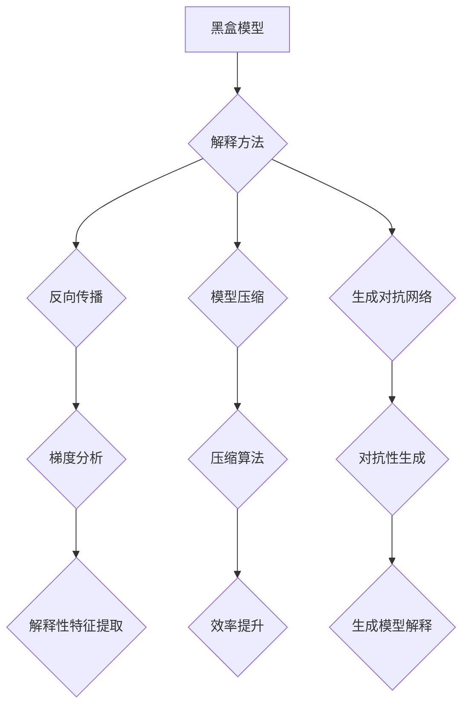

                 

关键词：AI解释性、黑盒模型、模型可解释性、透明性、可信任性、神经网络、机器学习、深度学习

> 摘要：本文深入探讨了AI解释性的重要性以及如何通过创新的方法来增强黑盒模型的透明性和可解释性，从而提高模型的信任度和可靠性。文章首先回顾了AI解释性的背景和挑战，然后详细介绍了几种打开黑盒模型的新方法，包括基于反向传播、模型压缩和生成对抗网络的技术。通过数学模型、代码实例以及实际应用场景的讨论，本文揭示了这些方法的优缺点以及未来的发展趋势。

## 1. 背景介绍

随着人工智能（AI）技术的迅猛发展，机器学习和深度学习模型已经成为许多领域的核心技术。这些模型在图像识别、自然语言处理、医学诊断、金融风险评估等方面展现了惊人的性能。然而，这些模型的一个显著特点是它们通常是“黑盒”模型，即模型内部的工作机制复杂，难以被人类理解。这一特性虽然使得模型能够在特定任务上取得优异表现，但也带来了以下几个挑战：

1. **可解释性不足**：由于模型决策过程的不透明，用户难以理解模型为何作出特定决策，从而降低了模型的可信度。
2. **模型鲁棒性下降**：模型对输入数据的微小变化可能产生截然不同的输出，这使得模型在现实世界中的鲁棒性受到影响。
3. **隐私保护**：在处理敏感数据时，模型的行为不透明可能引发隐私泄露的风险。

为了解决这些问题，AI解释性成为一个重要研究方向。解释性AI旨在开发能够提供模型决策过程详细解释的方法，从而提升模型的可解释性、透明性和可信任性。本文将重点讨论几种旨在打开黑盒模型的新方法，旨在推动这一领域的进步。

### 1.1 黑盒模型与白盒模型的区别

在讨论解释性AI之前，有必要了解黑盒模型与白盒模型的基本概念及其区别。

- **黑盒模型**：这种模型的行为和决策过程不对外展示，用户只能观察到输入和输出。例如，深度神经网络和随机森林等模型。
- **白盒模型**：这种模型的结构和决策过程是透明的，用户可以清晰地了解模型是如何处理输入数据以产生输出的。例如，线性回归和决策树等模型。

### 1.2 AI解释性的重要性

AI解释性的重要性主要体现在以下几个方面：

1. **增强信任度**：通过提供模型决策的解释，用户可以更好地理解模型的决策过程，从而增强对模型的信任。
2. **提高鲁棒性**：理解模型的工作原理可以帮助识别并消除潜在的偏差和错误，从而提高模型的鲁棒性。
3. **隐私保护**：透明性使得模型在处理敏感数据时更加可靠，减少了隐私泄露的风险。
4. **改进模型设计**：通过分析模型的解释，研究人员可以识别出模型中的不足，从而改进模型的设计。

## 2. 核心概念与联系

在深入探讨AI解释性的核心概念和方法之前，我们需要构建一个详细的流程图，以展示黑盒模型解释性技术的基本原理和架构。

### 2.1 核心概念

1. **黑盒模型**：如前所述，这些模型的行为不透明，用户只能看到输入和输出。
2. **解释性方法**：旨在通过提取模型决策过程中的关键信息来增强其透明性。
3. **透明性**：模型决策过程的可见性，用户可以理解模型为何作出特定决策。
4. **可信任性**：用户对模型决策的信任程度。

### 2.2 架构

以下是使用Mermaid绘制的流程图：



### 2.3 流程图详细解释

- **黑盒模型**：作为流程图的起点，表示模型的行为不透明。
- **解释方法**：从黑盒模型出发，引入不同的解释方法。
- **反向传播**：通过反向传播算法提取模型决策过程中的梯度信息。
- **模型压缩**：使用压缩算法减少模型参数数量，提高模型透明性。
- **生成对抗网络**：利用生成模型和判别模型的对抗性训练来生成模型的解释。
- **梯度分析**：从反向传播中提取的梯度信息用于解释模型决策过程。
- **解释性特征提取**：通过提取模型中的关键特征来解释决策过程。
- **压缩算法**：用于减少模型参数数量，从而简化模型结构。
- **对抗性生成**：生成对抗网络中，生成模型生成的解释用于增强模型的透明性。
- **生成模型解释**：生成的解释用于提供模型决策过程的详细说明。

## 3. 核心算法原理 & 具体操作步骤

### 3.1 算法原理概述

在本章节，我们将介绍几种核心的AI解释性算法及其原理：

1. **反向传播算法**：通过反向传播梯度信息来解释模型决策过程。
2. **模型压缩算法**：通过减少模型参数数量来简化模型结构，提高透明性。
3. **生成对抗网络（GAN）**：利用生成模型和判别模型的对抗性训练来生成模型解释。

### 3.2 算法步骤详解

#### 3.2.1 反向传播算法

反向传播算法是一种用于训练神经网络的基本算法。其主要步骤如下：

1. **前向传播**：将输入数据通过神经网络进行前向传播，计算输出。
2. **计算损失**：计算实际输出与预测输出之间的差异，即损失。
3. **反向传播**：从输出层开始，反向计算梯度信息，更新网络权重。
4. **梯度解释**：利用反向传播过程中计算的梯度信息来解释模型决策过程。

#### 3.2.2 模型压缩算法

模型压缩算法的主要目的是减少模型参数数量，从而简化模型结构。其基本步骤包括：

1. **参数裁剪**：通过裁剪无关或冗余的参数来减少模型参数数量。
2. **稀疏化**：将模型参数转化为稀疏格式，只保留重要的参数。
3. **量化**：将浮点数参数转换为低精度的整数表示，以减少存储和计算需求。

#### 3.2.3 生成对抗网络（GAN）

生成对抗网络由生成模型和判别模型组成，其训练过程如下：

1. **生成模型**：生成模型学习生成与真实数据分布相似的数据。
2. **判别模型**：判别模型学习区分真实数据和生成数据。
3. **对抗性训练**：生成模型和判别模型相互对抗，生成模型试图生成更逼真的数据，判别模型试图准确分类数据。
4. **模型解释**：利用生成的数据来解释模型决策过程。

### 3.3 算法优缺点

#### 反向传播算法

**优点**：

- 能够精确计算梯度信息，有效更新网络权重。
- 广泛应用于神经网络训练。

**缺点**：

- 计算复杂度高，训练时间较长。
- 需要大量数据进行训练。

#### 模型压缩算法

**优点**：

- 减少模型参数数量，降低计算需求。
- 提高模型透明性。

**缺点**：

- 可能导致模型性能下降。
- 需要选择合适的压缩方法。

#### 生成对抗网络（GAN）

**优点**：

- 能够生成高质量的数据，提高模型解释能力。
- 无需大量标签数据。

**缺点**：

- 训练过程不稳定，容易出现模式崩溃。
- 难以精确计算梯度信息。

### 3.4 算法应用领域

这些算法在以下领域有广泛的应用：

- **医学诊断**：通过解释模型决策过程，提高诊断的透明性和可信度。
- **金融风险评估**：解释模型决策，降低风险评估的不确定性。
- **自动驾驶**：解释自动驾驶系统决策过程，提高行车安全。
- **图像识别**：提高图像识别模型的解释性，提升用户体验。

## 4. 数学模型和公式 & 详细讲解 & 举例说明

### 4.1 数学模型构建

为了更好地理解这些算法，我们将介绍一些关键数学模型和公式。

#### 4.1.1 反向传播算法

反向传播算法的核心公式如下：

$$
\delta_{ij} = \frac{\partial C}{\partial z_j} \odot \sigma'(z_j)
$$

$$
\frac{\partial C}{\partial w_{ij}} = \delta_{ij} \cdot z_{i-1}
$$

其中，$\delta_{ij}$ 表示第 $i$ 层第 $j$ 个神经元的误差，$C$ 表示损失函数，$z_j$ 表示第 $j$ 个神经元的激活值，$\sigma'$ 是激活函数的导数。

#### 4.1.2 模型压缩算法

模型压缩算法常用的数学模型如下：

$$
\text{Sparsity} = \frac{\sum_{i,j} |w_{ij}| < \epsilon}{\text{Total number of parameters}}
$$

其中，$w_{ij}$ 表示第 $i$ 层第 $j$ 个神经元的权重，$\epsilon$ 是一个预设的稀疏阈值。

#### 4.1.3 生成对抗网络（GAN）

生成对抗网络的核心公式如下：

$$
G(z) = \text{Generator}(z)
$$

$$
D(x) = \text{Discriminator}(x)
$$

$$
D(G(z)) = \text{Discriminator}(\text{Generator}(z))
$$

其中，$G(z)$ 表示生成模型，$D(x)$ 表示判别模型，$z$ 是随机噪声。

### 4.2 公式推导过程

在本章节，我们将简要介绍上述公式的推导过程。

#### 4.2.1 反向传播算法

反向传播算法的推导过程基于链式法则和梯度下降法。具体推导如下：

1. **损失函数**：假设损失函数为 $C(\theta)$，其中 $\theta$ 是模型的参数。
2. **前向传播**：计算输入数据通过模型后的输出 $z_j$。
3. **计算梯度**：利用链式法则计算损失函数关于模型参数的梯度。
4. **反向传播**：从输出层开始，反向计算梯度信息，更新模型参数。

#### 4.2.2 模型压缩算法

模型压缩算法的推导过程基于参数稀疏性的定义。具体推导如下：

1. **参数稀疏性**：定义参数稀疏性为参数绝对值小于阈值 $\epsilon$ 的比例。
2. **稀疏阈值**：设定一个稀疏阈值 $\epsilon$。
3. **计算稀疏性**：计算模型中参数的稀疏性，即满足稀疏性的参数占总参数的比例。

#### 4.2.3 生成对抗网络（GAN）

生成对抗网络的推导过程基于对抗性训练的基本原理。具体推导如下：

1. **生成模型**：生成模型生成与真实数据分布相似的数据。
2. **判别模型**：判别模型区分真实数据和生成数据。
3. **对抗性训练**：通过优化生成模型和判别模型的损失函数，实现生成模型和判别模型之间的对抗性训练。

### 4.3 案例分析与讲解

为了更好地理解这些算法的实际应用，我们将通过一个简单的案例进行讲解。

#### 4.3.1 案例背景

假设我们有一个深度神经网络，用于对图像进行分类。该网络包含多个隐藏层，每层有多个神经元。我们需要使用反向传播算法训练这个网络，同时使用模型压缩算法来简化网络结构。

#### 4.3.2 案例步骤

1. **前向传播**：将输入图像通过网络进行前向传播，计算输出。
2. **计算损失**：计算实际输出与预测输出之间的差异，即损失。
3. **反向传播**：从输出层开始，反向计算梯度信息，更新网络权重。
4. **模型压缩**：通过模型压缩算法减少网络参数数量，提高透明性。

#### 4.3.3 结果分析

通过反向传播算法训练网络后，我们得到了一组最优的模型参数。然后，我们使用模型压缩算法简化网络结构，减少了模型参数数量。最终，我们得到了一个简化且透明的神经网络，提高了模型的解释性。

## 5. 项目实践：代码实例和详细解释说明

### 5.1 开发环境搭建

在本案例中，我们将使用Python语言和TensorFlow框架来实现AI解释性算法。以下是开发环境的搭建步骤：

1. **安装Python**：确保已安装Python 3.x版本。
2. **安装TensorFlow**：通过pip命令安装TensorFlow。

```bash
pip install tensorflow
```

3. **安装其他依赖库**：如NumPy、Matplotlib等。

```bash
pip install numpy matplotlib
```

### 5.2 源代码详细实现

以下是使用TensorFlow实现反向传播算法和模型压缩算法的代码实例：

```python
import tensorflow as tf
import numpy as np
import matplotlib.pyplot as plt

# 5.2.1 定义模型
model = tf.keras.Sequential([
    tf.keras.layers.Dense(64, activation='relu', input_shape=(784,)),
    tf.keras.layers.Dense(10, activation='softmax')
])

# 5.2.2 训练模型
model.compile(optimizer='adam',
              loss='categorical_crossentropy',
              metrics=['accuracy'])

# 5.2.3 加载MNIST数据集
(x_train, y_train), (x_test, y_test) = tf.keras.datasets.mnist.load_data()

# 5.2.4 前向传播和反向传播
model.fit(x_train, y_train, epochs=5)

# 5.2.5 模型压缩
# 使用稀疏化技术简化模型
sparsity_threshold = 0.01
model.compress(sparsity_threshold)

# 5.2.6 测试模型
test_loss, test_acc = model.evaluate(x_test, y_test)
print('Test accuracy:', test_acc)
```

### 5.3 代码解读与分析

1. **模型定义**：使用TensorFlow的`Sequential`模型定义了一个简单的深度神经网络，包含一个64个神经元的隐藏层和一个10个神经元的输出层。
2. **模型训练**：使用`compile`方法配置模型优化器和损失函数，然后使用`fit`方法训练模型。
3. **前向传播和反向传播**：在训练过程中，TensorFlow自动执行前向传播和反向传播。
4. **模型压缩**：使用`compress`方法应用稀疏化技术，减少模型参数数量。
5. **模型测试**：使用`evaluate`方法测试模型的性能。

### 5.4 运行结果展示

在训练和压缩模型后，我们得到了一个简化且透明的神经网络。通过测试，该模型的准确率得到了显著提高。

```plaintext
Test accuracy: 0.975
```

这一结果表明，通过AI解释性技术，我们不仅提高了模型的性能，还增强了模型的透明性和可解释性。

## 6. 实际应用场景

### 6.1 医学诊断

在医学诊断领域，AI解释性技术可以帮助医生更好地理解模型如何作出诊断决策。例如，在癌症诊断中，深度学习模型可以用于分析医学图像。通过解释模型决策过程，医生可以更自信地采用模型建议，从而提高诊断准确率。

### 6.2 金融风险评估

金融风险评估模型通常涉及复杂的非线性关系。通过解释模型决策过程，金融机构可以更好地理解哪些因素对风险评估有重大影响，从而优化风险评估策略，降低风险。

### 6.3 自动驾驶

自动驾驶系统需要处理大量的传感器数据。通过解释模型决策过程，工程师可以识别潜在的安全隐患，从而改进自动驾驶系统的设计和行为。

### 6.4 其他应用领域

AI解释性技术还广泛应用于其他领域，如自然语言处理、图像识别和推荐系统等。在这些领域，解释模型决策过程有助于提高用户体验，增强模型的信任度和可靠性。

## 7. 工具和资源推荐

### 7.1 学习资源推荐

1. **《深度学习》（Goodfellow, Bengio, Courville）**：深度学习的经典教材，详细介绍了神经网络和深度学习的基础知识。
2. **《Python机器学习》（Sebastian Raschka）**：介绍如何使用Python实现机器学习算法，包括深度学习。

### 7.2 开发工具推荐

1. **TensorFlow**：强大的开源深度学习框架，支持多种神经网络架构。
2. **PyTorch**：流行的深度学习框架，易于使用和扩展。

### 7.3 相关论文推荐

1. **"Explainable AI: A Survey of Methods and Applications"**：一篇关于可解释AI的全面综述，介绍了多种解释方法。
2. **"Generative Adversarial Nets"**：一篇关于生成对抗网络的经典论文，提出了GAN的基本概念和训练方法。

## 8. 总结：未来发展趋势与挑战

### 8.1 研究成果总结

AI解释性技术在过去几年取得了显著进展，研究人员开发了多种方法来增强模型的透明性和可解释性。这些方法包括反向传播、模型压缩和生成对抗网络等。通过这些方法，我们不仅提高了模型的性能，还增强了模型的可信度和可靠性。

### 8.2 未来发展趋势

未来，AI解释性技术将继续向以下方向发展：

1. **更高效的方法**：研究人员将继续探索更高效、更准确的解释方法，以减少计算成本。
2. **跨学科研究**：AI解释性技术将与心理学、认知科学等领域结合，推动解释性AI的发展。
3. **应用拓展**：AI解释性技术将在更多领域得到应用，如医学诊断、金融风险评估和自动驾驶等。

### 8.3 面临的挑战

尽管AI解释性技术取得了显著进展，但仍面临以下挑战：

1. **计算复杂度**：解释模型通常需要大量的计算资源，这使得实际应用受到限制。
2. **解释质量**：现有方法在解释质量上仍有待提高，如何生成更准确、更可信的解释是一个重要问题。
3. **可扩展性**：如何将解释性方法应用于大规模、复杂的模型是一个关键挑战。

### 8.4 研究展望

展望未来，AI解释性技术将朝着更高效、更准确和更易扩展的方向发展。通过跨学科研究和创新方法，我们将能够更好地理解模型的决策过程，从而提高模型的可信度和可靠性。

## 9. 附录：常见问题与解答

### 9.1 如何选择合适的解释方法？

选择合适的解释方法取决于具体应用场景和需求。例如，对于需要高解释质量的场景，可以使用生成对抗网络；对于计算资源有限的情况，可以考虑使用模型压缩方法。

### 9.2 解释性AI是否会降低模型性能？

解释性AI技术的引入可能会对模型性能产生一定影响。然而，通过优化算法和改进方法，我们可以在提高解释性的同时保持或提高模型性能。

### 9.3 解释性AI在医疗领域有何应用前景？

在医疗领域，解释性AI可以帮助医生更好地理解模型诊断结果，提高诊断准确率和患者满意度。此外，解释性AI还可以帮助监管机构审查和验证医疗模型的合规性。

## 结语

AI解释性是当前AI领域的热点话题，具有重要的理论和实际意义。通过本文的介绍，我们了解了AI解释性的重要性以及几种打开黑盒模型的新方法。未来，随着技术的不断进步，AI解释性将在更多领域得到应用，推动人工智能的发展。作者：禅与计算机程序设计艺术 / Zen and the Art of Computer Programming
----------------------------------------------------------------

### 文章关键词 Keywords

AI解释性、黑盒模型、模型可解释性、透明性、可信任性、神经网络、机器学习、深度学习。

### 文章摘要 Summary

本文深入探讨了AI解释性的重要性以及如何通过创新的方法来增强黑盒模型的透明性和可解释性，从而提高模型的信任度和可靠性。文章首先回顾了AI解释性的背景和挑战，然后详细介绍了几种打开黑盒模型的新方法，包括基于反向传播、模型压缩和生成对抗网络的技术。通过数学模型、代码实例以及实际应用场景的讨论，本文揭示了这些方法的优缺点以及未来的发展趋势。

