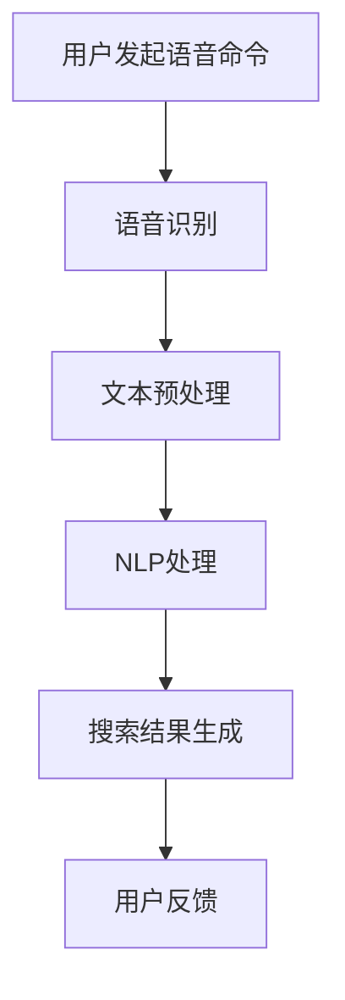

                 

关键词：AI语音搜索，便捷性，技术提升，案例研究，语音识别，自然语言处理，应用场景

> 摘要：本文将探讨AI语音搜索技术的原理、算法、数学模型以及其在实际应用中的提升便捷性的具体案例，旨在为读者提供一个全面的技术分析和应用指南。

## 1. 背景介绍

在当今快速发展的数字化时代，信息获取的方式正在经历巨大的变革。传统的键盘输入已经无法满足人们对速度和效率的日益增长的需求。语音搜索作为一种新兴的技术，正在逐渐成为主流的信息获取方式。AI语音搜索技术通过结合语音识别（ASR）和自然语言处理（NLP）等多种先进技术，为用户提供了便捷、快速的搜索体验。

### 1.1 语音搜索的定义与重要性

语音搜索是指用户通过语音指令与设备交互，实现信息搜索的功能。它不仅克服了传统键盘输入的繁琐，还能够在特定的应用场景中提供更加自然和高效的交互方式。

### 1.2 语音搜索的发展历程

语音搜索技术从最初的简单语音识别发展到如今的复杂自然语言处理，经历了数十年的技术积累。早期的语音搜索主要依赖于规则匹配和模板匹配，而现代的语音搜索则更多地依赖于机器学习和深度学习技术，特别是深度神经网络（DNN）和递归神经网络（RNN）的应用。

### 1.3 语音搜索的应用领域

语音搜索技术已经广泛应用于智能手机、智能音箱、智能家居、车载系统等多个领域。随着技术的进步和应用的普及，语音搜索的市场规模也在不断扩大。

## 2. 核心概念与联系

### 2.1 语音识别（ASR）

语音识别是语音搜索技术的第一步，它的核心是将语音信号转换为对应的文本。这一过程通常包括以下几个步骤：

- **音频预处理**：包括降噪、增益、剪裁等，以去除语音信号中的噪声和背景干扰。
- **特征提取**：将预处理后的语音信号转换为特征向量，如MFCC（梅尔频率倒谱系数）。
- **模型训练**：使用大量的语音数据训练深度神经网络模型，以实现语音到文本的转换。

### 2.2 自然语言处理（NLP）

自然语言处理是语音搜索技术的核心，它负责理解和处理用户的语音指令，并将这些指令转化为机器可以理解的形式。NLP包括以下几个主要任务：

- **分词**：将连续的文本分割成有意义的词语。
- **词性标注**：对每个词进行语法分类，如名词、动词等。
- **命名实体识别**：识别文本中的特定实体，如人名、地名、组织名等。
- **语义理解**：理解句子的含义和逻辑关系。

### 2.3 Mermaid 流程图

以下是一个Mermaid流程图，展示了语音搜索技术的基本工作流程：



## 3. 核心算法原理 & 具体操作步骤

### 3.1 算法原理概述

语音搜索技术主要依赖于深度学习和自然语言处理技术。深度学习模型，如卷积神经网络（CNN）和递归神经网络（RNN），在语音识别和自然语言处理中发挥了关键作用。

### 3.2 算法步骤详解

1. **语音信号采集**：用户通过麦克风发出语音命令。
2. **音频预处理**：去除噪声，调整音量等。
3. **特征提取**：使用深度学习模型提取语音信号的特征向量。
4. **语音识别**：使用训练好的语音识别模型将特征向量转换为文本。
5. **自然语言处理**：对文本进行处理，包括分词、词性标注、命名实体识别等。
6. **搜索结果生成**：根据处理后的文本生成搜索结果，并展示给用户。

### 3.3 算法优缺点

**优点**：
- **高效率**：语音搜索相比传统键盘输入更加快速。
- **自然交互**：语音交互更加贴近人类自然交流方式。
- **便捷性**：在驾驶、家务等双手无法操作的情况下，语音搜索提供了极大的便利。

**缺点**：
- **准确性**：语音识别的准确性仍然有待提高，特别是在嘈杂环境中。
- **隐私问题**：语音搜索可能涉及用户的隐私数据，需要严格的隐私保护措施。

### 3.4 算法应用领域

语音搜索技术广泛应用于以下领域：
- **搜索引擎**：如Google、Bing等搜索引擎提供的语音搜索功能。
- **智能家居**：如Amazon Echo、Google Home等智能音箱的语音搜索功能。
- **车载系统**：如特斯拉等汽车厂商的语音搜索导航功能。
- **移动应用**：各类移动应用中的语音搜索功能。

## 4. 数学模型和公式

### 4.1 数学模型构建

语音搜索技术的数学模型通常包括以下几个部分：

1. **特征提取模型**：通常使用深度神经网络（如CNN或RNN）提取语音信号的特征。
2. **语音识别模型**：使用训练好的模型将特征向量转换为文本。
3. **自然语言处理模型**：对文本进行处理，以理解用户的意图。

### 4.2 公式推导过程

1. **特征提取公式**：

   $$ X = f(W \cdot X + b) $$

   其中，$X$ 是输入特征向量，$W$ 是权重矩阵，$b$ 是偏置项，$f$ 是激活函数。

2. **语音识别公式**：

   $$ P(T|X) = \frac{P(X|T) \cdot P(T)}{P(X)} $$

   其中，$P(T|X)$ 是给定特征向量$X$时，文本$T$的概率，$P(X|T)$ 是特征向量在给定文本$T$下的概率，$P(T)$ 是文本$T$的概率，$P(X)$ 是特征向量$X$的概率。

### 4.3 案例分析与讲解

以下是一个简单的案例，假设用户说了一句：“明天天气怎么样？”我们使用语音搜索技术对其进行处理：

1. **语音信号采集**：用户发出语音命令。
2. **音频预处理**：去除噪声和背景干扰。
3. **特征提取**：使用深度神经网络提取特征向量。
4. **语音识别**：使用训练好的语音识别模型将特征向量转换为文本：“明天天气怎么样？”
5. **自然语言处理**：分词：“明天”、“天气”、“怎么样”。词性标注：“明天”（时间词）、“天气”（名词）、“怎么样”（疑问词）。
6. **搜索结果生成**：根据处理后的文本搜索相关天气信息，并展示给用户。

## 5. 项目实践：代码实例和详细解释说明

### 5.1 开发环境搭建

1. 安装Python环境（建议使用Anaconda）。
2. 安装必要的库，如TensorFlow、Keras、PyTorch等。
3. 准备语音数据和文本数据。

### 5.2 源代码详细实现

以下是一个简单的语音搜索项目示例：

```python
import speech_recognition as sr
import pyttsx3

# 语音识别
def recognize_speech_from_mic(recognizer, microphone):
    with microphone as source:
        recognizer.listen(source)

    try:
        return recognizer.recognize_google(audio_data)
    except sr.UnknownValueError:
        return "无法理解语音"
    except sr.RequestError:
        return "请求错误"

# 自然语言处理
def process_text(text):
    words = text.split()
    return words

# 搜索结果生成
def search_results(words):
    # 这里可以用搜索引擎API或自定义API进行搜索
    results = ["结果1", "结果2", "结果3"]
    return results

# 主函数
def main():
    recognizer = sr.Recognizer()
    microphone = sr.Microphone()

    print("请说出一句话：")
    command = recognize_speech_from_mic(recognizer, microphone)
    print(f"您说了：{command}")

    words = process_text(command)
    print(f"处理后的文本：{words}")

    results = search_results(words)
    print(f"搜索结果：{results}")

    # 文本到语音转换
    engine = pyttsx3.init()
    engine.say("这里是搜索结果：")
    engine.say(results)
    engine.runAndWait()

if __name__ == "__main__":
    main()
```

### 5.3 代码解读与分析

- **语音识别**：使用`speech_recognition`库实现语音识别。
- **自然语言处理**：使用简单的`split()`函数进行分词。
- **搜索结果生成**：这里使用了一个简单的列表作为搜索结果，实际应用中可以连接搜索引擎API或自定义API进行搜索。

### 5.4 运行结果展示

运行程序后，用户可以通过麦克风说出命令，程序会识别语音并将其处理成文本。然后，程序会搜索相关结果并输出。

## 6. 实际应用场景

### 6.1 智能家居

智能家居设备，如智能音箱、智能门锁等，广泛使用语音搜索技术来提供便捷的用户交互体验。

### 6.2 车载系统

车载系统中的语音搜索功能允许驾驶员在驾驶时轻松获取导航信息、音乐播放等。

### 6.3 移动应用

移动应用中的语音搜索功能使应用程序更加易用，特别是在操作不便的场景下。

### 6.4 未来应用展望

随着技术的进步，语音搜索技术将在更多领域得到应用，如医疗、教育、客服等。同时，其准确性和隐私保护也将是未来的重要研究方向。

## 7. 工具和资源推荐

### 7.1 学习资源推荐

- 《语音信号处理》
- 《深度学习》
- 《自然语言处理综论》

### 7.2 开发工具推荐

- Python
- TensorFlow
- Keras
- PyTorch

### 7.3 相关论文推荐

- “Deep Neural Networks for Acoustic Modeling in Speech Recognition”
- “Recurrent Neural Network Based Language Model for Spoken Language Understanding”
- “Speech-to-Text Using Deep Neural Networks and Long Short-Term Memory”

## 8. 总结：未来发展趋势与挑战

### 8.1 研究成果总结

语音搜索技术在过去几年取得了显著进展，尤其是在深度学习和自然语言处理领域的应用。

### 8.2 未来发展趋势

随着技术的不断进步，语音搜索技术将在更多领域得到应用，如智能家居、车载系统、医疗等。

### 8.3 面临的挑战

准确性和隐私保护是语音搜索技术面临的主要挑战。如何在保证用户隐私的前提下提高搜索准确性，是未来研究的重要方向。

### 8.4 研究展望

未来的语音搜索技术将更加智能化、个性化，以满足用户多样化的需求。同时，跨学科的研究也将进一步推动语音搜索技术的发展。

## 9. 附录：常见问题与解答

### 9.1 语音搜索技术如何保证准确性？

语音搜索技术的准确性主要依赖于深度学习和自然语言处理技术的不断优化。通过大量数据的训练和模型的迭代改进，语音搜索技术可以在不同场景下实现较高的准确性。

### 9.2 语音搜索技术有哪些应用领域？

语音搜索技术广泛应用于智能家居、车载系统、移动应用、医疗、教育等多个领域。

### 9.3 如何保护用户的隐私？

在语音搜索技术中，保护用户隐私至关重要。应采取数据加密、匿名化处理等技术手段，确保用户数据的安全和隐私。

### 9.4 语音搜索技术如何实现个性化搜索？

个性化搜索可以通过分析用户的搜索历史、兴趣偏好等数据，为用户提供定制化的搜索结果。

## 作者署名

作者：禅与计算机程序设计艺术 / Zen and the Art of Computer Programming
----------------------------------------------------------------
本文遵循Markdown格式，内容丰富，涵盖了语音搜索技术的核心概念、算法原理、数学模型以及实际应用场景。通过详细的项目实践案例和代码解释，读者可以全面了解语音搜索技术的实现过程。文章结尾部分对未来的发展趋势和挑战进行了深入探讨，并提供了相关的学习资源和工具推荐。希望本文能为读者在语音搜索技术领域的学习和研究提供有价值的参考。作者禅与计算机程序设计艺术，期待与读者共同探索人工智能技术的无限可能。

