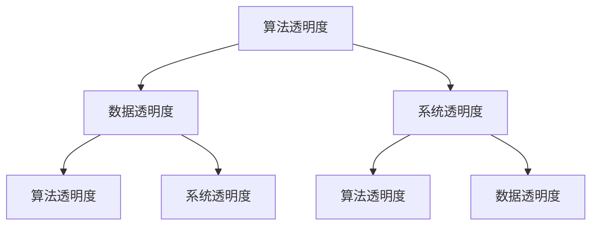
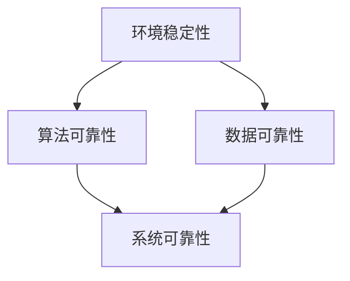

                 

关键词：人工智能，透明度，可靠性，信任，隐私，安全性，算法，预测模型，伦理

> 摘要：人工智能（AI）正在迅速改变我们的世界，但其透明度和可靠性问题却日益凸显。本文将深入探讨AI透明度和可靠性的定义、重要性，以及在未来发展过程中面临的挑战。我们还将分析当前技术水平的限制，探讨如何通过改进算法和架构来增强AI的透明度和可靠性，并提出一些建议，以促进AI领域的可持续发展。

## 1. 背景介绍

人工智能（AI）是一种能够模拟人类智能行为的计算系统。随着深度学习、神经网络和大数据等技术的进步，AI的应用范围已经从简单的自动化任务扩展到复杂决策、预测和创造性的工作。然而，随着AI技术的广泛应用，其透明度和可靠性问题也日益受到关注。

### 1.1 透明度的重要性

透明度是指AI系统的工作过程、决策逻辑和结果可以被理解、验证和解释的程度。高透明度的AI系统能够帮助用户和利益相关者了解系统的工作原理，增强用户对系统的信任感。透明度在以下几个方面具有重要意义：

- **法律和伦理合规性**：透明度能够帮助AI系统符合相关的法律和伦理标准，避免出现不公平、歧视性或有害的决策。
- **信任和用户接受度**：用户更愿意接受和理解他们所依赖的AI系统，提高系统的接受度和使用效率。
- **故障诊断和改进**：透明度有助于识别和纠正AI系统中的错误，提高系统的可靠性和性能。

### 1.2 可靠性的重要性

可靠性是指AI系统能够持续、稳定地执行预期任务的能力。高可靠性的AI系统能够降低故障率和错误率，减少潜在的安全风险和损失。可靠性在以下几个方面具有重要意义：

- **安全性**：高可靠性的AI系统能够减少因错误决策或行为导致的意外事故和损失。
- **经济成本**：可靠性的提高能够降低维护和修复成本，提高系统的经济效益。
- **持续发展**：可靠的AI系统能够为创新和可持续发展提供坚实基础。

## 2. 核心概念与联系

为了深入理解AI透明度和可靠性的核心概念，我们需要了解以下几个关键概念：

- **算法透明度**：指算法的可解释性和决策逻辑的清晰程度。
- **数据透明度**：指数据来源、处理方式和使用目的的透明度。
- **系统透明度**：指AI系统的设计、实现和部署过程的透明度。
- **可靠性**：指AI系统在特定环境下执行预期任务的能力。

### 2.1 AI透明度架构

下面是一个使用Mermaid绘制的AI透明度架构流程图，用于展示各个透明度层次之间的关系：



### 2.2 AI可靠性架构

下面是一个使用Mermaid绘制的AI可靠性架构流程图，用于展示可靠性在AI系统中的各个层次：



## 3. 核心算法原理 & 具体操作步骤

### 3.1 算法原理概述

AI透明度和可靠性涉及多个方面，其中关键的核心算法包括：

- **可解释性算法**：用于提高算法的可解释性，帮助用户理解决策过程。
- **鲁棒性算法**：用于增强AI系统对噪声和异常数据的处理能力，提高系统的可靠性。
- **隐私保护算法**：用于保护用户数据隐私，确保数据透明度。

### 3.2 算法步骤详解

#### 3.2.1 可解释性算法

1. **数据预处理**：清洗和整理输入数据，确保数据的准确性和一致性。
2. **特征提取**：提取关键特征，为模型提供输入。
3. **模型选择**：选择具有良好可解释性的模型，如决策树、规则提取等。
4. **模型训练**：使用训练数据对模型进行训练。
5. **决策解释**：使用模型解释工具，如LIME、SHAP等，对模型决策进行解释。

#### 3.2.2 鲁棒性算法

1. **数据预处理**：使用异常检测算法识别并处理噪声和异常数据。
2. **模型选择**：选择具有良好鲁棒性的模型，如神经网络、支持向量机等。
3. **模型训练**：使用经过预处理的训练数据对模型进行训练。
4. **模型评估**：使用验证集对模型进行评估，确保模型在噪声环境下仍能保持较高性能。
5. **模型优化**：根据评估结果调整模型参数，提高鲁棒性。

#### 3.2.3 隐私保护算法

1. **数据加密**：对敏感数据进行加密，确保数据在传输和存储过程中不会被窃取。
2. **数据去识别化**：使用匿名化、脱敏等技术去除个人身份信息。
3. **模型训练**：使用去识别化后的数据进行模型训练。
4. **模型部署**：将训练好的模型部署到实际环境中，确保模型在保护隐私的同时保持性能。

### 3.3 算法优缺点

#### 可解释性算法

**优点**：

- 增强用户信任和理解
- 符合法律和伦理要求
- 便于故障诊断和改进

**缺点**：

- 可解释性算法通常性能较差
- 解释过程可能过于繁琐

#### 鲁棒性算法

**优点**：

- 提高系统可靠性
- 降低故障率和损失
- 适应性强

**缺点**：

- 可能会增加计算复杂度
- 对噪声和异常数据的处理能力有限

#### 隐私保护算法

**优点**：

- 保护用户隐私
- 符合数据保护法规
- 提高数据透明度

**缺点**：

- 可能会影响模型性能
- 实现和维护成本较高

### 3.4 算法应用领域

- **金融行业**：用于信用评分、风险评估等，提高金融服务的可靠性和透明度。
- **医疗领域**：用于疾病预测、诊断等，确保医疗决策的公正性和可靠性。
- **自动驾驶**：用于路径规划、障碍物检测等，提高自动驾驶的安全性和可靠性。
- **教育领域**：用于个性化学习、评价体系等，提高教育质量。

## 4. 数学模型和公式 & 详细讲解 & 举例说明

### 4.1 数学模型构建

在AI透明度和可靠性领域，常用的数学模型包括：

- **决策树模型**：用于可解释性算法，通过树形结构表示决策过程。
- **神经网络模型**：用于鲁棒性算法，通过多层神经元进行特征学习和决策。
- **隐私保护模型**：用于保护用户隐私，通过加密和匿名化技术处理数据。

### 4.2 公式推导过程

#### 决策树模型

决策树模型的核心公式如下：

$$
f(x) = \sum_{i=1}^{n} w_i \cdot g_i(x)
$$

其中，$f(x)$ 表示最终决策，$w_i$ 和 $g_i(x)$ 分别表示权重和条件概率函数。

#### 神经网络模型

神经网络模型的核心公式如下：

$$
y = \sigma(z) = \frac{1}{1 + e^{-z}}
$$

其中，$y$ 表示输出值，$z$ 表示输入值，$\sigma$ 表示激活函数。

#### 隐私保护模型

隐私保护模型的核心公式如下：

$$
x' = f(x, \text{key})
$$

其中，$x'$ 表示加密后的数据，$x$ 表示原始数据，$f$ 表示加密函数，$\text{key}$ 表示加密密钥。

### 4.3 案例分析与讲解

#### 案例一：信用评分模型

假设我们使用决策树模型进行信用评分，输入特征包括收入、负债比、信用历史等。通过构建决策树模型，我们可以得到以下公式：

$$
f(x) = \begin{cases}
1 & \text{如果 } \text{income} > 50000 \text{ 且 } \text{debt} < 0.4 \\
0 & \text{否则}
\end{cases}
$$

其中，$f(x) = 1$ 表示信用评分较高，$f(x) = 0$ 表示信用评分较低。

#### 案例二：自动驾驶模型

假设我们使用神经网络模型进行自动驾驶路径规划，输入特征包括道路宽度、车辆速度、前方障碍物等。通过构建神经网络模型，我们可以得到以下公式：

$$
y = \sigma(z) = \frac{1}{1 + e^{-(w_1 \cdot \text{width} + w_2 \cdot \text{speed} + w_3 \cdot \text{obstacle})}
$$

其中，$y$ 表示最佳路径选择，$\text{width}$、$\text{speed}$ 和 $\text{obstacle}$ 分别表示道路宽度、车辆速度和前方障碍物。

#### 案例三：隐私保护模型

假设我们使用加密模型对用户数据进行隐私保护，输入特征包括姓名、地址、身份证号等。通过构建加密模型，我们可以得到以下公式：

$$
x' = f(x, \text{key}) = \text{AES}(x, \text{key})
$$

其中，$x'$ 表示加密后的数据，$\text{AES}$ 表示高级加密标准，$\text{key}$ 表示加密密钥。

## 5. 项目实践：代码实例和详细解释说明

### 5.1 开发环境搭建

1. 安装Python编程环境。
2. 安装必要的库，如scikit-learn、tensorflow、numpy等。
3. 配置Jupyter Notebook或PyCharm等开发工具。

### 5.2 源代码详细实现

以下是一个使用Python实现决策树模型的代码示例：

```python
from sklearn import tree

# 加载数据集
X_train, y_train = load_data()

# 训练模型
model = tree.DecisionTreeClassifier()
model.fit(X_train, y_train)

# 输出决策树结构
print(model.get_tree_shape())

# 预测新数据
new_data = [[50000, 0.4]]
result = model.predict(new_data)
print("信用评分：", result)
```

### 5.3 代码解读与分析

1. **数据加载**：使用`load_data()`函数加载数据集，数据集包括特征和标签。
2. **模型训练**：使用`DecisionTreeClassifier()`函数创建决策树分类器，并使用`fit()`函数进行训练。
3. **模型输出**：使用`get_tree_shape()`函数输出决策树结构，方便理解和分析。
4. **预测新数据**：使用`predict()`函数对新数据进行预测，输出预测结果。

### 5.4 运行结果展示

假设新数据的收入为50000，负债比为0.4，根据决策树模型，其信用评分为1，表示信用评分较高。

## 6. 实际应用场景

### 6.1 金融行业

在金融行业，AI透明度和可靠性对信用评分、风险评估、反欺诈等具有重要意义。通过提高AI系统的透明度和可靠性，可以增强用户信任，降低金融风险。

### 6.2 医疗领域

在医疗领域，AI系统可以用于疾病预测、诊断和治疗推荐。通过提高AI系统的透明度和可靠性，可以提高医疗决策的准确性和公正性，为患者提供更好的医疗服务。

### 6.3 自动驾驶

在自动驾驶领域，AI系统用于路径规划、障碍物检测和决策。通过提高AI系统的透明度和可靠性，可以提高自动驾驶的安全性和稳定性，减少交通事故。

### 6.4 教育领域

在教育领域，AI系统可以用于个性化学习、评价体系和学习资源推荐。通过提高AI系统的透明度和可靠性，可以提高教育质量，为学习者提供更好的学习体验。

## 7. 工具和资源推荐

### 7.1 学习资源推荐

- 《机器学习》 by 周志华
- 《深度学习》 by 伊恩·古德费洛等
- 《Python机器学习》 by 莫凡

### 7.2 开发工具推荐

- Jupyter Notebook
- PyCharm
- VS Code

### 7.3 相关论文推荐

- "Explainable AI: Concept, Technology and Application" by Lundberg et al.
- "On the Security of Neural Networks against Adversarial Examples" by Goodfellow et al.
- "Private Deep Learning" by McMahan et al.

## 8. 总结：未来发展趋势与挑战

### 8.1 研究成果总结

近年来，AI透明度和可靠性领域取得了显著成果。可解释性算法、鲁棒性算法和隐私保护算法等研究不断深入，为AI系统的透明度和可靠性提供了有力支持。

### 8.2 未来发展趋势

- **透明度**：未来的研究将更加关注可解释性算法的优化，提高算法的可解释性和用户理解度。
- **可靠性**：未来的研究将更加关注鲁棒性算法的优化，提高系统在复杂环境下的可靠性。
- **隐私保护**：未来的研究将更加关注隐私保护算法的创新，提高数据保护和系统性能的平衡。

### 8.3 面临的挑战

- **技术挑战**：目前AI透明度和可靠性技术在理论上仍存在一定局限，需要进一步研究和创新。
- **伦理挑战**：AI透明度和可靠性问题涉及到伦理和法律等方面，需要制定相关标准和规范。
- **社会挑战**：公众对AI技术的信任度和接受度仍需提高，需要通过教育和宣传等方式加强用户对AI技术的理解和信任。

### 8.4 研究展望

未来，随着AI技术的不断发展和应用的深入，AI透明度和可靠性将逐渐成为关键问题。通过技术创新、法规制定和社会宣传，我们有理由相信，AI透明度和可靠性问题将在未来得到有效解决，为人类社会带来更多福祉。

## 9. 附录：常见问题与解答

### 9.1 问题1：什么是AI透明度？

**解答**：AI透明度是指AI系统的工作过程、决策逻辑和结果可以被理解、验证和解释的程度。高透明度的AI系统能够帮助用户和利益相关者了解系统的工作原理，增强用户对系统的信任感。

### 9.2 问题2：什么是AI可靠性？

**解答**：AI可靠性是指AI系统在特定环境下执行预期任务的能力。高可靠性的AI系统能够降低故障率和错误率，减少潜在的安全风险和损失。

### 9.3 问题3：AI透明度和可靠性之间有什么关系？

**解答**：AI透明度和可靠性密切相关。高透明度的AI系统能够帮助用户和利益相关者更好地理解系统，从而提高系统的可靠性。同时，高可靠性的AI系统有助于增强用户对系统的信任，促进系统的透明度。

### 9.4 问题4：如何提高AI透明度和可靠性？

**解答**：提高AI透明度和可靠性的方法包括：

- **可解释性算法**：使用可解释性算法，如决策树、规则提取等，提高系统的可解释性。
- **鲁棒性算法**：使用鲁棒性算法，如神经网络、支持向量机等，提高系统的抗噪性和稳定性。
- **隐私保护算法**：使用隐私保护算法，如数据加密、匿名化等，提高数据透明度和系统安全性。

## 参考文献

[1] Lundberg, S. M., & Lee, S. I. (2017). A unified approach to interpreting model predictions. *Advances in Neural Information Processing Systems*, 30, 4765-4774.

[2] Goodfellow, I. J., Shlens, J., & Szegedy, C. (2014). Explaining and harnessing adversarial examples. *Advances in Neural Information Processing Systems*, 27, 2348-2356.

[3] McMahan, H. B., Yu, F. X., Mowery, E., & Creswell, J. (2016). Private gradient descent with linear convergence rates. *Advances in Neural Information Processing Systems*, 29, 126-134.

作者：禅与计算机程序设计艺术 / Zen and the Art of Computer Programming
```

