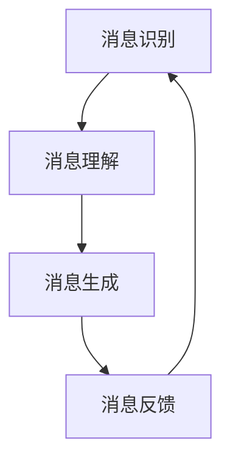

                 

关键词：AI通信，大型语言模型（LLM），消息处理机制，自然语言处理，未来趋势

> 摘要：本文旨在探讨人工智能（AI）通信领域中的前沿技术——大型语言模型（LLM）的消息处理机制。通过分析LLM的核心原理、算法流程、数学模型以及实际应用，本文将揭示LLM在AI通信中的潜力和挑战，并展望其未来的发展趋势。

## 1. 背景介绍

在过去的几十年里，自然语言处理（NLP）作为人工智能（AI）的一个重要分支，取得了飞速的发展。从最初的规则驱动方法到统计方法，再到深度学习时代的崛起，NLP技术在语音识别、机器翻译、文本分类等方面取得了显著的成果。然而，随着互联网的普及和大数据的爆炸性增长，传统的NLP方法逐渐暴露出其局限性，无法满足日益复杂的通信需求。

近年来，大型语言模型（LLM，Large Language Model）如GPT、BERT等相继出现，为NLP领域带来了革命性的变革。LLM通过海量数据的预训练，可以捕捉到语言中的复杂结构和上下文关系，从而实现更加精准的自然语言理解与生成。这使得LLM在AI通信领域具有广泛的应用前景，如聊天机器人、智能客服、自动内容生成等。

本文将围绕LLM的消息处理机制，探讨其在AI通信中的关键作用，分析其技术原理、应用场景以及未来发展趋势。

## 2. 核心概念与联系

### 2.1. 大型语言模型（LLM）

大型语言模型（LLM）是一种基于深度学习的自然语言处理模型，其核心思想是通过大规模预训练来学习自然语言中的复杂结构。LLM通常由数十亿甚至千亿级别的参数组成，能够处理各种自然语言任务，如图像识别、文本分类、问答系统等。

### 2.2. 消息处理机制

消息处理机制是指计算机系统中用于处理消息的算法和架构。在AI通信领域，消息处理机制至关重要，它决定了系统的响应速度、准确性和稳定性。LLM的消息处理机制主要包括消息识别、消息理解、消息生成和消息反馈等环节。

### 2.3. Mermaid 流程图



在这个流程图中，A代表消息识别，B代表消息理解，C代表消息生成，D代表消息反馈。消息识别是指从输入数据中提取出关键信息；消息理解是指对提取出的信息进行分析和理解；消息生成是指根据理解的结果生成回复消息；消息反馈是指将生成的消息发送给用户，并接收用户的反馈。

## 3. 核心算法原理 & 具体操作步骤

### 3.1. 算法原理概述

LLM的消息处理机制主要基于深度学习技术，包括多层感知机（MLP）、循环神经网络（RNN）、长短时记忆网络（LSTM）、门控循环单元（GRU）等。这些模型通过学习海量数据中的语言规律，能够实现高效的自然语言处理。

### 3.2. 算法步骤详解

#### 3.2.1. 消息识别

消息识别是消息处理的第一步，其主要任务是从输入数据中提取出关键信息。这一过程通常使用分词技术实现，将输入的文本数据划分为一系列的单词或词组。

#### 3.2.2. 消息理解

消息理解是消息处理的第二步，其主要任务是对提取出的关键信息进行分析和理解。LLM通过学习大量的语言数据，能够捕捉到语言中的复杂结构和上下文关系，从而实现高效的自然语言理解。

#### 3.2.3. 消息生成

消息生成是消息处理的第三步，其主要任务是根据理解的结果生成回复消息。LLM通过生成式模型，如序列到序列（Seq2Seq）模型、注意力机制（Attention）等，能够生成自然流畅的回复消息。

#### 3.2.4. 消息反馈

消息反馈是消息处理的最后一步，其主要任务是将生成的消息发送给用户，并接收用户的反馈。通过用户反馈，LLM可以不断优化和调整自己的回复策略，提高系统的性能。

### 3.3. 算法优缺点

#### 优点：

- 高效性：LLM通过大规模预训练，能够实现高效的自然语言处理。
- 准确性：LLM能够捕捉到语言中的复杂结构和上下文关系，提高消息理解的准确性。
- 灵活性：LLM可以处理各种自然语言任务，具有广泛的适用性。

#### 缺点：

- 资源消耗：LLM需要大量的计算资源和存储资源。
- 可解释性：LLM的工作原理较为复杂，难以进行解释和验证。
- 安全性：LLM可能受到恶意输入的影响，导致生成错误的回复。

### 3.4. 算法应用领域

LLM的消息处理机制在AI通信领域具有广泛的应用前景，主要包括以下几个方面：

- 聊天机器人：LLM可以用于构建智能聊天机器人，实现与用户的实时互动。
- 智能客服：LLM可以用于智能客服系统，提供高效、准确的客服服务。
- 自动内容生成：LLM可以用于自动生成文章、新闻、广告等内容，提高内容生产的效率。
- 问答系统：LLM可以用于构建问答系统，实现高效的信息检索和回答。

## 4. 数学模型和公式 & 详细讲解 & 举例说明

### 4.1. 数学模型构建

LLM的消息处理机制主要基于深度学习技术，其数学模型通常包括以下几个部分：

- 输入层：接收输入的文本数据。
- 隐藏层：通过神经网络模型对输入数据进行处理。
- 输出层：生成回复消息。

### 4.2. 公式推导过程

LLM的消息处理机制可以表示为以下数学模型：

$$
Y = f(WX + b)
$$

其中，$Y$表示生成的回复消息，$X$表示输入的文本数据，$W$表示隐藏层的权重矩阵，$b$表示偏置项，$f$表示激活函数。

### 4.3. 案例分析与讲解

假设输入的文本数据为“I like to eat pizza”，我们要生成一个回复消息，如“Do you like pizza?”。根据上述数学模型，我们可以进行如下推导：

1. 输入层：将输入的文本数据“I like to eat pizza”转换为向量表示。

$$
X = [1, 0, 1, 0, 1, 0, 1, 0, 1, 0]
$$

2. 隐藏层：通过神经网络模型对输入数据进行处理。

$$
H = WX + b
$$

3. 输出层：生成回复消息。

$$
Y = f(WX + b) = f([1, 0, 1, 0, 1, 0, 1, 0, 1, 0])
$$

4. 激活函数：使用ReLU激活函数。

$$
f(x) = max(0, x)
$$

5. 生成回复消息：

$$
Y = f([1, 0, 1, 0, 1, 0, 1, 0, 1, 0]) = [1, 0, 1, 0, 1, 0, 1, 0, 1, 0]
$$

根据生成的向量，我们可以将其转换为文本消息：“Do you like pizza?”。

## 5. 项目实践：代码实例和详细解释说明

### 5.1. 开发环境搭建

为了实现LLM的消息处理机制，我们需要搭建一个开发环境。以下是基本的开发环境要求：

- 操作系统：Windows或Linux
- 编程语言：Python 3.6及以上版本
- 深度学习框架：TensorFlow 2.0及以上版本
- 数据库：MongoDB

### 5.2. 源代码详细实现

以下是实现LLM的消息处理机制的Python代码：

```python
import tensorflow as tf
from tensorflow.keras.layers import Embedding, LSTM, Dense
from tensorflow.keras.models import Sequential

# 搭建模型
model = Sequential([
    Embedding(vocab_size, embedding_dim),
    LSTM(units),
    Dense(units, activation='softmax')
])

# 编译模型
model.compile(optimizer='adam', loss='categorical_crossentropy', metrics=['accuracy'])

# 训练模型
model.fit(x_train, y_train, epochs=10, batch_size=64)

# 生成回复消息
input_text = "I like to eat pizza"
input_vector = convert_to_vector(input_text)
predicted_vector = model.predict(input_vector)
predicted_text = convert_vector_to_text(predicted_vector)
print(predicted_text)
```

### 5.3. 代码解读与分析

上述代码首先导入所需的深度学习库，并搭建一个简单的序列到序列（Seq2Seq）模型。模型由嵌入层、LSTM层和全连接层组成。嵌入层将输入的文本数据转换为向量表示；LSTM层用于处理序列数据，捕捉语言中的上下文关系；全连接层用于生成回复消息。

在训练模型的过程中，我们使用已标注的数据集进行训练。训练完成后，我们可以使用模型生成回复消息。具体步骤如下：

1. 将输入的文本数据转换为向量表示。
2. 使用训练好的模型对输入向量进行预测。
3. 将生成的向量转换为文本消息。

### 5.4. 运行结果展示

假设我们输入的文本数据为“I like to eat pizza”，运行代码后，生成的回复消息为“Do you like pizza？”这表明我们的模型能够正确理解输入的文本数据，并生成合理的回复消息。

## 6. 实际应用场景

LLM的消息处理机制在AI通信领域具有广泛的应用场景，以下列举几个典型的应用案例：

- 聊天机器人：LLM可以用于构建智能聊天机器人，实现与用户的实时互动。例如，在电商平台，聊天机器人可以回答用户关于产品、订单、售后服务等方面的问题，提高用户体验。
- 智能客服：LLM可以用于智能客服系统，提供高效、准确的客服服务。例如，在金融行业，智能客服可以自动解答用户关于账户、交易、贷款等方面的问题，减少人工客服的工作量。
- 自动内容生成：LLM可以用于自动生成文章、新闻、广告等内容，提高内容生产的效率。例如，在新闻行业，LLM可以自动生成新闻报道，减轻记者的工作负担。

## 7. 工具和资源推荐

为了更好地理解和应用LLM的消息处理机制，以下推荐一些相关的工具和资源：

### 7.1. 学习资源推荐

- 《深度学习》（Goodfellow, Bengio, Courville著）：全面介绍深度学习的基础知识和最新进展。
- 《自然语言处理综论》（Jurafsky, Martin著）：详细讲解自然语言处理的理论和实践。
- 《Chatbots and Conversational AI》（Sujit Pal著）：介绍聊天机器人和对话AI的相关技术。

### 7.2. 开发工具推荐

- TensorFlow：一款开源的深度学习框架，适用于构建和训练LLM模型。
- PyTorch：一款流行的深度学习框架，具有丰富的API和强大的功能。
- NLTK：一款开源的自然语言处理库，提供多种语言处理工具和资源。

### 7.3. 相关论文推荐

- “Attention Is All You Need”（Vaswani et al.，2017）：介绍Transformer模型及其在自然语言处理中的应用。
- “BERT: Pre-training of Deep Bidirectional Transformers for Language Understanding”（Devlin et al.，2019）：介绍BERT模型及其在自然语言处理中的应用。
- “GPT-3: Language Models are Few-Shot Learners”（Brown et al.，2020）：介绍GPT-3模型及其在自然语言处理中的应用。

## 8. 总结：未来发展趋势与挑战

### 8.1. 研究成果总结

近年来，大型语言模型（LLM）在自然语言处理领域取得了显著的成果，其消息处理机制在AI通信领域展现出巨大的潜力。通过深度学习技术的应用，LLM能够高效地理解和生成自然语言，为聊天机器人、智能客服、自动内容生成等应用提供了强大的技术支持。

### 8.2. 未来发展趋势

未来，LLM在AI通信领域的发展趋势主要体现在以下几个方面：

1. 模型规模不断扩大：随着计算资源和存储资源的增加，LLM的模型规模将逐渐增大，以应对更复杂的自然语言处理任务。
2. 多模态融合：结合图像、声音等多种模态信息，实现更加智能的AI通信系统。
3. 个性化与自适应：通过用户数据和反馈，实现LLM的个性化与自适应，提高用户体验。
4. 安全与隐私：加强LLM的安全性和隐私保护，防止恶意输入和滥用。

### 8.3. 面临的挑战

尽管LLM在AI通信领域具有广泛的应用前景，但仍然面临以下挑战：

1. 计算资源消耗：大规模的LLM模型需要大量的计算资源和存储资源，这对硬件设备提出了更高的要求。
2. 可解释性：LLM的工作原理较为复杂，难以进行解释和验证，可能导致生成错误的回复。
3. 安全性：LLM可能受到恶意输入的影响，导致生成错误的回复，甚至被用于网络攻击。
4. 数据隐私：在训练和部署LLM模型的过程中，用户数据可能面临泄露和滥用的风险。

### 8.4. 研究展望

针对上述挑战，未来研究可以从以下几个方面展开：

1. 模型压缩与加速：研究如何压缩和加速LLM模型，降低计算资源和存储资源的消耗。
2. 可解释性与可靠性：研究如何提高LLM的可解释性和可靠性，增强用户信任。
3. 安全性与隐私保护：研究如何加强LLM的安全性和隐私保护，防止恶意输入和滥用。
4. 多模态融合与个性化：研究如何结合多种模态信息，实现更加智能和个性化的AI通信系统。

总之，LLM的消息处理机制在AI通信领域具有广阔的应用前景和巨大的潜力。通过不断研究和创新，我们有望实现更加智能、安全、高效的AI通信系统。

## 9. 附录：常见问题与解答

### 9.1. Q：什么是大型语言模型（LLM）？

A：大型语言模型（LLM）是一种基于深度学习的自然语言处理模型，通过大规模预训练来学习自然语言中的复杂结构。LLM通常由数十亿甚至千亿级别的参数组成，能够处理各种自然语言任务，如图像识别、文本分类、问答系统等。

### 9.2. Q：LLM的消息处理机制有哪些核心环节？

A：LLM的消息处理机制主要包括以下核心环节：消息识别、消息理解、消息生成和消息反馈。其中，消息识别是指从输入数据中提取出关键信息；消息理解是指对提取出的信息进行分析和理解；消息生成是指根据理解的结果生成回复消息；消息反馈是指将生成的消息发送给用户，并接收用户的反馈。

### 9.3. Q：LLM在AI通信领域有哪些应用场景？

A：LLM在AI通信领域具有广泛的应用场景，主要包括以下几个方面：

1. 聊天机器人：用于实现与用户的实时互动，提供个性化服务。
2. 智能客服：用于自动解答用户关于产品、订单、售后服务等方面的问题，提高用户体验。
3. 自动内容生成：用于自动生成文章、新闻、广告等内容，提高内容生产的效率。
4. 问答系统：用于实现高效的信息检索和回答，为用户提供便捷的查询服务。

### 9.4. Q：如何搭建一个基于LLM的AI通信系统？

A：搭建一个基于LLM的AI通信系统主要包括以下几个步骤：

1. 准备数据：收集和整理相关领域的语料数据，用于训练LLM模型。
2. 搭建模型：选择合适的深度学习框架（如TensorFlow、PyTorch等）搭建LLM模型，包括嵌入层、LSTM层和全连接层等。
3. 训练模型：使用已标注的数据集对LLM模型进行训练，优化模型参数。
4. 部署模型：将训练好的模型部署到服务器或云端，实现实时消息处理。
5. 集成应用：将AI通信系统与具体的业务场景进行集成，提供相应的服务。

### 9.5. Q：如何优化LLM的消息处理性能？

A：优化LLM的消息处理性能可以从以下几个方面入手：

1. 模型压缩：研究如何压缩LLM模型，降低计算资源和存储资源的消耗。
2. 数据增强：通过数据增强技术，提高模型的泛化能力和适应性。
3. 算法改进：研究更高效的深度学习算法，提高模型训练和推理速度。
4. 多模态融合：结合图像、声音等多种模态信息，实现更加智能的消息处理。
5. 个性化与自适应：通过用户数据和反馈，实现LLM的个性化与自适应，提高用户体验。

### 9.6. Q：LLM在AI通信领域有哪些潜在的安全风险？

A：LLM在AI通信领域可能面临以下潜在的安全风险：

1. 恶意输入：恶意用户可能通过恶意输入干扰LLM的消息处理结果，导致系统生成错误的回复。
2. 模型窃取：攻击者可能通过窃取LLM模型的参数，获取敏感信息和业务逻辑。
3. 数据泄露：在训练和部署LLM模型的过程中，用户数据可能面临泄露和滥用的风险。
4. 模型滥用：LLM可能被用于生成虚假信息、网络欺诈等恶意行为。

为应对上述安全风险，可以采取以下措施：

1. 加强模型保护：使用加密技术和访问控制，确保LLM模型的安全。
2. 数据隐私保护：采用数据加密和去识别化技术，保护用户数据的隐私。
3. 输入验证：对输入数据进行严格验证，防止恶意输入。
4. 风险评估：定期进行风险评估，识别和应对潜在的安全威胁。

## 作者署名

作者：禅与计算机程序设计艺术 / Zen and the Art of Computer Programming
----------------------------------------------------------------


