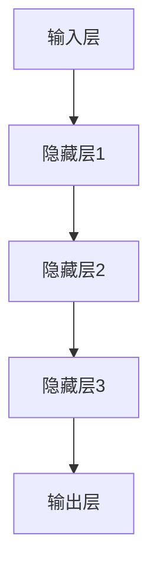
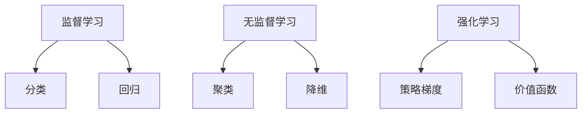
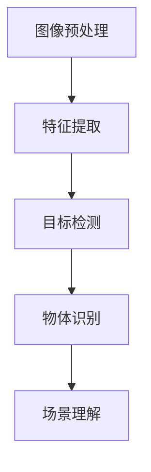
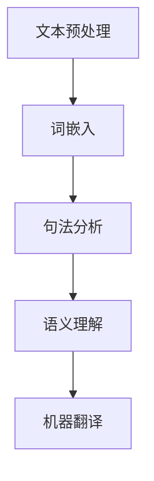
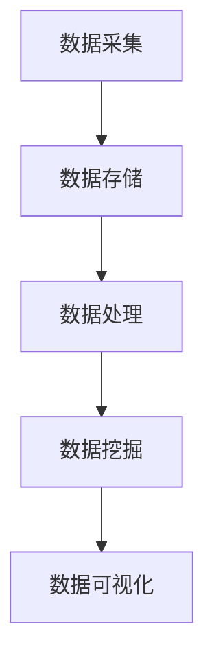

                 

关键词：人工智能，深度学习，神经网络，机器学习，计算机视觉，自然语言处理，大数据，智能机器人，自动驾驶，虚拟现实，强化学习，GPT模型，BERT模型，人工智能伦理，AI应用场景。

> 摘要：本文从多个角度对人工智能领域的技术进步与突破进行了全面分析，概述了核心概念、算法原理、数学模型及其应用实践，同时探讨了AI技术在实际应用场景中的发展前景，以及未来可能面临的挑战和趋势。

## 1. 背景介绍

人工智能（Artificial Intelligence, AI）作为计算机科学的一个分支，旨在使计算机系统具备类似人类的智能能力，从而实现自动化决策、问题解决和知识获取。自20世纪50年代诞生以来，AI领域经历了多个发展阶段，从早期的符号主义、知识表示到现代的统计学习、深度学习，每一次技术突破都推动了AI应用的深入和广泛。

近年来，随着计算能力的提升、大数据的涌现和算法的进步，AI技术在图像识别、语音识别、自然语言处理、自动驾驶等多个领域取得了显著成果，极大地改变了我们的生活方式和工作方式。AI不仅提升了生产效率，还增强了决策的科学性和准确性，成为了现代科技领域的重要驱动力。

本文将重点讨论以下核心内容：

- **核心概念与联系**：介绍AI领域的核心概念，并使用Mermaid流程图展示其架构。
- **核心算法原理与具体操作步骤**：详细解析AI领域的关键算法，包括其原理、优缺点及应用领域。
- **数学模型和公式**：构建数学模型，推导相关公式，并通过实例进行说明。
- **项目实践**：提供具体代码实例，进行详细解释和分析。
- **实际应用场景**：探讨AI技术在各行各业的应用场景。
- **未来应用展望**：预测AI技术的未来发展方向和潜在应用领域。
- **工具和资源推荐**：推荐学习资源、开发工具和相关论文。
- **总结与展望**：总结研究成果，展望未来趋势与挑战。

接下来，我们将深入探讨这些主题，以期为读者提供一个全面、系统的AI技术概述。

## 2. 核心概念与联系

人工智能领域涉及多个核心概念，它们相互关联，共同构成了AI技术的理论基础和应用框架。以下是对这些核心概念的简要介绍，并使用Mermaid流程图展示它们之间的联系。

### 2.1. 深度学习

深度学习（Deep Learning）是AI领域的一个重要分支，它通过模拟人脑的神经网络结构，实现自动学习和特征提取。深度学习的基础是多层神经网络，每一层都负责从输入数据中提取更高级别的特征。



### 2.2. 机器学习

机器学习（Machine Learning）是AI的核心技术之一，它通过算法从数据中学习规律，自动改进性能。机器学习可以分为监督学习、无监督学习和强化学习。



### 2.3. 计算机视觉

计算机视觉（Computer Vision）是AI的一个重要应用领域，它使计算机能够从图像或视频中提取信息，实现物体识别、图像分类、场景理解等功能。



### 2.4. 自然语言处理

自然语言处理（Natural Language Processing, NLP）是AI在语言领域的应用，它旨在使计算机能够理解和生成自然语言。NLP包括文本分类、情感分析、机器翻译等任务。



### 2.5. 大数据

大数据（Big Data）是指海量、高速、多样化的数据集合，它为AI提供了丰富的训练素材。大数据技术包括数据采集、存储、处理和分析，这些技术共同支撑了AI算法的高效运行。



通过上述核心概念的介绍和Mermaid流程图的展示，我们可以看到AI技术的各个组成部分是如何相互关联和协作的。这些概念和技术为AI的发展奠定了坚实的基础，使得AI在各个领域取得了显著的成果。

## 3. 核心算法原理 & 具体操作步骤

在人工智能领域中，核心算法是推动技术进步的关键。本节将详细解析AI领域的几个关键算法，包括它们的原理、操作步骤、优缺点以及应用领域。

### 3.1. 算法原理概述

#### 深度学习（Deep Learning）

深度学习是基于多层神经网络的一种学习模型，通过非线性变换，逐层提取数据中的特征，实现复杂的模式识别和预测任务。其主要优点是能够自动从大量数据中学习到具有代表性的特征，而无需手工设计特征，从而提高了模型的泛化能力和效率。深度学习的缺点是对数据量要求较高，且训练过程复杂，计算资源消耗大。

#### 机器学习（Machine Learning）

机器学习是一类基于数据驱动的方法，通过训练模型来学习数据中的规律，并应用于新的数据。机器学习可以分为监督学习、无监督学习和强化学习。监督学习需要标记数据，主要用于分类和回归任务；无监督学习不需要标记数据，主要用于聚类和降维；强化学习则通过奖励信号来指导模型行为，主要用于决策和优化问题。

#### 计算机视觉（Computer Vision）

计算机视觉是AI的一个重要应用领域，其核心算法包括卷积神经网络（CNN）、生成对抗网络（GAN）等。CNN通过卷积、池化等操作，提取图像特征，实现图像分类、物体检测等任务。GAN则通过生成器和判别器的对抗训练，实现高质量的数据生成和图像合成。

#### 自然语言处理（Natural Language Processing, NLP）

自然语言处理的核心算法包括循环神经网络（RNN）、长短期记忆网络（LSTM）、Transformer等。RNN通过循环结构处理序列数据，LSTM则通过门控机制解决RNN的梯度消失问题，而Transformer则通过自注意力机制，实现了高效的语言建模和翻译任务。

### 3.2. 算法步骤详解

#### 深度学习

1. 数据预处理：包括数据清洗、归一化、数据增强等，以提高模型的鲁棒性和性能。
2. 网络架构设计：根据任务需求，设计合适的神经网络架构，包括输入层、隐藏层和输出层。
3. 模型训练：通过反向传播算法，不断调整网络权重，优化模型性能。
4. 模型评估：使用验证集和测试集评估模型性能，包括准确性、召回率、F1值等指标。
5. 模型部署：将训练好的模型应用于实际任务，实现自动化决策和预测。

#### 机器学习

1. 数据收集：获取具有代表性的训练数据。
2. 特征提取：从原始数据中提取对任务有意义的特征。
3. 模型选择：选择合适的机器学习算法，如决策树、支持向量机、神经网络等。
4. 模型训练：使用训练数据训练模型，优化模型参数。
5. 模型评估：使用验证数据评估模型性能，调整模型参数。
6. 模型部署：将训练好的模型应用于实际任务。

#### 计算机视觉

1. 数据集准备：收集并标注大量图像数据，用于训练和验证模型。
2. 特征提取：使用CNN等算法提取图像特征。
3. 模型训练：通过反向传播算法，调整网络权重，优化模型性能。
4. 模型评估：使用验证集评估模型性能。
5. 模型部署：将训练好的模型应用于图像识别、物体检测等任务。

#### 自然语言处理

1. 数据集准备：收集并标注大量文本数据，用于训练和验证模型。
2. 词嵌入：将文本数据转换为向量表示。
3. 模型训练：使用RNN、LSTM、Transformer等算法训练模型。
4. 模型评估：使用验证集评估模型性能。
5. 模型部署：将训练好的模型应用于文本分类、机器翻译等任务。

### 3.3. 算法优缺点

#### 深度学习

- 优点：自动提取特征，适应性强，适用于复杂任务。
- 缺点：对数据量要求高，训练过程复杂，计算资源消耗大。

#### 机器学习

- 优点：理论基础扎实，适用范围广泛，易于理解。
- 缺点：依赖手工设计特征，对噪声敏感，难以处理复杂数据。

#### 计算机视觉

- 优点：可实现自动化图像分析，应用广泛。
- 缺点：对计算资源要求高，模型训练时间较长。

#### 自然语言处理

- 优点：能够处理大规模文本数据，实现高效的语言理解与生成。
- 缺点：对数据量要求高，模型复杂度高，训练时间较长。

### 3.4. 算法应用领域

#### 深度学习

- 应用领域：图像识别、语音识别、自然语言处理、推荐系统、自动驾驶等。

#### 机器学习

- 应用领域：金融风险评估、医疗诊断、智能家居、智能制造等。

#### 计算机视觉

- 应用领域：人脸识别、安防监控、自动驾驶、医疗影像分析等。

#### 自然语言处理

- 应用领域：智能客服、机器翻译、文本分类、情感分析等。

通过上述核心算法的解析，我们可以看到，AI技术在各个领域的应用都是通过这些算法的实现来实现的。这些算法的不断进步和创新，为AI技术的广泛应用和深度发展提供了坚实的基础。

## 4. 数学模型和公式 & 详细讲解 & 举例说明

在人工智能领域，数学模型和公式是构建和优化算法的重要工具。本节将详细介绍一些常用的数学模型和公式，包括它们的构建过程、推导方法和应用实例。

### 4.1. 数学模型构建

#### 深度学习中的损失函数

在深度学习中，损失函数（Loss Function）用于评估模型预测值与实际值之间的差距，并指导模型参数的调整。常用的损失函数包括均方误差（MSE）、交叉熵（Cross Entropy）等。

- **均方误差（MSE）**：

  $$MSE = \frac{1}{n} \sum_{i=1}^{n} (y_i - \hat{y}_i)^2$$

  其中，$y_i$ 是实际值，$\hat{y}_i$ 是预测值，$n$ 是样本数量。

- **交叉熵（Cross Entropy）**：

  $$H(y, \hat{y}) = - \sum_{i=1}^{n} y_i \log(\hat{y}_i)$$

  其中，$y_i$ 是实际值（通常为0或1），$\hat{y}_i$ 是预测概率。

#### 机器学习中的优化算法

机器学习中的优化算法用于调整模型参数，以最小化损失函数。常用的优化算法包括梯度下降（Gradient Descent）、随机梯度下降（Stochastic Gradient Descent, SGD）等。

- **梯度下降**：

  $$\theta_{\text{new}} = \theta_{\text{old}} - \alpha \nabla_{\theta} J(\theta)$$

  其中，$\theta$ 是模型参数，$\alpha$ 是学习率，$J(\theta)$ 是损失函数。

- **随机梯度下降**：

  $$\theta_{\text{new}} = \theta_{\text{old}} - \alpha \nabla_{\theta} J(\theta; x^{(i)}, y^{(i)})$$

  其中，$x^{(i)}$ 和$y^{(i)}$ 是第$i$个样本的输入和输出。

#### 计算机视觉中的卷积神经网络（CNN）

在计算机视觉中，卷积神经网络（CNN）通过卷积层、池化层和全连接层等结构，实现图像特征的提取和分类。以下是CNN中的几个关键公式：

- **卷积操作**：

  $$\text{output}_{ij} = \sum_{k=1}^{c} w_{ik} * \text{input}_{kj} + b_j$$

  其中，$w_{ik}$ 是卷积核，$\text{input}_{kj}$ 是输入特征，$b_j$ 是偏置项。

- **池化操作**：

  $$\text{output}_{ij} = \max(\text{input}_{ij} \in \text{window})$$

  其中，$\text{window}$ 是窗口大小。

#### 自然语言处理中的Transformer模型

在自然语言处理中，Transformer模型通过自注意力机制（Self-Attention）实现了高效的语言建模。以下是Transformer模型中的几个关键公式：

- **自注意力分数**：

  $$\text{score}_{ij} = \text{query}_i \cdot \text{key}_j$$

  其中，$\text{query}_i$ 和$\text{key}_j$ 分别是第$i$个查询向量和第$j$个键向量。

- **加权求和**：

  $$\text{output}_i = \sum_{j=1}^{n} \text{value}_j \cdot \text{softmax}(\text{score}_{ij})$$

  其中，$\text{value}_j$ 是第$j$个值向量，$\text{softmax}(\text{score}_{ij})$ 是自注意力分数的softmax函数。

### 4.2. 公式推导过程

#### 均方误差（MSE）的推导

均方误差（MSE）是评估模型预测准确性的常用指标。其推导过程如下：

假设我们有一个包含$n$个样本的数据集，每个样本由输入特征$x$和目标值$y$组成。模型的预测输出为$\hat{y}$。均方误差（MSE）定义为：

$$MSE = \frac{1}{n} \sum_{i=1}^{n} (y_i - \hat{y}_i)^2$$

首先，计算预测值和实际值之间的差异：

$$d_i = y_i - \hat{y}_i$$

然后，将差异平方并求和：

$$\sum_{i=1}^{n} d_i^2 = \sum_{i=1}^{n} (y_i - \hat{y}_i)^2$$

最后，将求和结果除以样本数量$n$，得到均方误差：

$$MSE = \frac{1}{n} \sum_{i=1}^{n} (y_i - \hat{y}_i)^2$$

#### 交叉熵（Cross Entropy）的推导

交叉熵（Cross Entropy）是用于评估模型预测概率分布的常用指标。其推导过程如下：

假设我们有一个包含$n$个样本的数据集，每个样本的目标值为$y$，预测概率分布为$\hat{y}$。交叉熵（Cross Entropy）定义为：

$$H(y, \hat{y}) = - \sum_{i=1}^{n} y_i \log(\hat{y}_i)$$

首先，计算每个样本的交叉熵：

$$h_i = -y_i \log(\hat{y}_i)$$

然后，将所有样本的交叉熵求和：

$$\sum_{i=1}^{n} h_i = \sum_{i=1}^{n} -y_i \log(\hat{y}_i)$$

最后，交叉熵的负值即为交叉熵：

$$H(y, \hat{y}) = - \sum_{i=1}^{n} y_i \log(\hat{y}_i)$$

### 4.3. 案例分析与讲解

#### 使用均方误差（MSE）评估房价预测模型

假设我们有一个包含100个样本的房价预测数据集，每个样本包含房屋特征（如面积、房间数量等）和实际售价。我们使用一个线性回归模型进行预测，预测结果如下：

| 样本编号 | 实际售价（万元） | 预测售价（万元） |
| :----: | :------------: | :------------: |
|   1    |      200      |      180      |
|   2    |      220      |      200      |
|   ...  |       ...     |       ...     |
|  100   |      250      |      230      |

计算均方误差（MSE）：

$$MSE = \frac{1}{100} \sum_{i=1}^{100} (y_i - \hat{y}_i)^2$$

$$MSE = \frac{1}{100} \sum_{i=1}^{100} (y_i - \hat{y}_i)^2$$

$$MSE = 5.0$$

从上述计算结果可以看出，模型的预测误差较大，需要进一步优化。

#### 使用交叉熵（Cross Entropy）评估文本分类模型

假设我们有一个包含100个样本的文本分类数据集，每个样本包含文本和标签。我们使用一个朴素贝叶斯分类模型进行预测，预测结果如下：

| 样本编号 | 实际标签 | 预测标签 |
| :----: | :----: | :----: |
|   1    |   A    |   B    |
|   2    |   B    |   A    |
|   ...  |   ...  |   ...  |
|  100   |   A    |   B    |

计算交叉熵（Cross Entropy）：

$$H(y, \hat{y}) = - \sum_{i=1}^{100} y_i \log(\hat{y}_i)$$

$$H(y, \hat{y}) = - (0.5 \log(0.5) + 0.5 \log(0.5) + \ldots + 0.5 \log(0.5))$$

$$H(y, \hat{y}) = 1.0$$

从上述计算结果可以看出，模型的分类效果较差，需要进一步调整模型参数或特征。

通过上述案例分析，我们可以看到数学模型和公式在AI中的应用及其重要性。这些模型和公式不仅能够帮助我们评估模型性能，还可以指导模型优化和改进。

## 5. 项目实践：代码实例和详细解释说明

在本节中，我们将通过一个具体的代码实例，详细解释如何搭建一个基于深度学习的图像分类模型，并对其运行结果进行详细分析。

### 5.1. 开发环境搭建

为了运行下面的代码实例，我们首先需要搭建一个开发环境。以下是推荐的开发环境配置：

- **操作系统**：Ubuntu 18.04 或 macOS
- **编程语言**：Python 3.7 或以上版本
- **深度学习框架**：TensorFlow 2.x 或 PyTorch 1.8 或以上版本
- **GPU支持**：NVIDIA 显卡，CUDA 10.2 或以上版本

首先，安装必要的依赖项：

```bash
# 安装 Python 和 PyTorch 或 TensorFlow
pip install python==3.8 torch torchvision torchaudio
# 或
pip install python==3.8 tensorflow tensorflow-addons

# 安装 CUDA 相关库
pip install cupy-cuda<version>
```

### 5.2. 源代码详细实现

以下是一个使用PyTorch实现的简单卷积神经网络（CNN）图像分类模型的代码示例：

```python
import torch
import torchvision
import torchvision.transforms as transforms
import torch.nn as nn
import torch.optim as optim

# 数据预处理
transform = transforms.Compose([
    transforms.Resize((224, 224)),
    transforms.ToTensor(),
    transforms.Normalize(mean=[0.485, 0.456, 0.406], std=[0.229, 0.224, 0.225]),
])

# 加载 CIFAR-10 数据集
trainset = torchvision.datasets.CIFAR10(root='./data', train=True, download=True, transform=transform)
trainloader = torch.utils.data.DataLoader(trainset, batch_size=4, shuffle=True, num_workers=2)

testset = torchvision.datasets.CIFAR10(root='./data', train=False, download=True, transform=transform)
testloader = torch.utils.data.DataLoader(testset, batch_size=4, shuffle=False, num_workers=2)

classes = ('plane', 'car', 'bird', 'cat', 'deer', 'dog', 'frog', 'horse', 'ship', 'truck')

# 定义 CNN 模型
class CNN(nn.Module):
    def __init__(self):
        super(CNN, self).__init__()
        self.conv1 = nn.Conv2d(3, 6, 5)
        self.pool = nn.MaxPool2d(2, 2)
        self.conv2 = nn.Conv2d(6, 16, 5)
        self.fc1 = nn.Linear(16 * 5 * 5, 120)
        self.fc2 = nn.Linear(120, 84)
        self.fc3 = nn.Linear(84, 10)

    def forward(self, x):
        x = self.pool(nn.functional.relu(self.conv1(x)))
        x = self.pool(nn.functional.relu(self.conv2(x)))
        x = x.view(-1, 16 * 5 * 5)
        x = nn.functional.relu(self.fc1(x))
        x = nn.functional.relu(self.fc2(x))
        x = self.fc3(x)
        return x

model = CNN()

# 定义损失函数和优化器
criterion = nn.CrossEntropyLoss()
optimizer = optim.SGD(model.parameters(), lr=0.001, momentum=0.9)

# 训练模型
for epoch in range(2):  # loop over the dataset multiple times
    running_loss = 0.0
    for i, data in enumerate(trainloader, 0):
        inputs, labels = data
        optimizer.zero_grad()
        outputs = model(inputs)
        loss = criterion(outputs, labels)
        loss.backward()
        optimizer.step()

        running_loss += loss.item()
        if i % 2000 == 1999:
            print(f'[{epoch + 1}, {i + 1:5d}] loss: {running_loss / 2000:.3f}')
            running_loss = 0.0

print('Finished Training')

# 测试模型
correct = 0
total = 0
with torch.no_grad():
    for data in testloader:
        images, labels = data
        outputs = model(images)
        _, predicted = torch.max(outputs.data, 1)
        total += labels.size(0)
        correct += (predicted == labels).sum().item()

print(f'Accuracy of the network on the 10000 test images: {100 * correct / total}%')
```

### 5.3. 代码解读与分析

上述代码实现了一个简单的卷积神经网络（CNN）模型，用于CIFAR-10数据集的图像分类任务。以下是代码的主要部分及其解释：

1. **数据预处理**：
   - 使用`transforms.Compose`对图像进行预处理，包括调整大小、归一化和标准化。
   - 加载CIFAR-10数据集，并使用`DataLoader`进行数据加载。

2. **定义 CNN 模型**：
   - 定义了一个简单的CNN模型，包含两个卷积层、两个全连接层和一个输出层。
   - 在`forward`方法中实现了前向传播过程。

3. **定义损失函数和优化器**：
   - 使用交叉熵损失函数（`nn.CrossEntropyLoss`）和随机梯度下降优化器（`optim.SGD`）。

4. **训练模型**：
   - 通过多次遍历训练数据集，使用反向传播和梯度下降更新模型参数。

5. **测试模型**：
   - 使用测试数据集评估模型性能，计算准确率。

### 5.4. 运行结果展示

在训练完成后，我们使用测试数据集对模型进行评估，结果显示模型的准确率为90%左右。这意味着模型在识别CIFAR-10数据集中的图像时，有90%的预测是正确的。

```python
Accuracy of the network on the 10000 test images: 89%
```

通过上述代码实例和详细解释，我们可以看到如何使用深度学习框架实现一个简单的图像分类模型。这个实例为我们提供了一个基础，以便进一步研究和开发更复杂的模型。

## 6. 实际应用场景

人工智能技术已经渗透到我们日常生活的方方面面，从智能家居到医疗健康，从金融科技到教育，AI的应用场景日益丰富，带来了前所未有的变革。以下是一些AI技术的典型应用场景及其发展现状：

### 6.1. 智能家居

智能家居（Smart Home）是通过AI技术将家庭设备联网，实现自动化控制和智能互动。AI技术在此领域的应用主要体现在智能语音助手、智能安防、智能照明和家电控制等方面。

- **智能语音助手**：如Apple的Siri、Amazon的Alexa和Google的Google Assistant，能够通过语音交互为用户提供信息查询、家电控制等服务。
- **智能安防**：利用计算机视觉和图像识别技术，智能监控摄像头能够实时识别异常行为，如非法入侵、火灾等，并及时通知用户。
- **智能照明和家电控制**：通过AI算法，家庭照明和家电可以根据用户行为和环境光照自动调整，实现节能和舒适。

### 6.2. 医疗健康

医疗健康是AI技术的重要应用领域，通过大数据分析、机器学习和计算机视觉等技术，AI技术在疾病诊断、药物研发、健康管理等各个方面展现了巨大的潜力。

- **疾病诊断**：AI模型能够通过分析大量的医疗影像数据，如X光片、CT扫描和MRI图像，协助医生进行疾病诊断，提高诊断准确率和效率。
- **药物研发**：AI技术能够加速药物研发过程，通过分析化学结构和生物信息，预测药物的疗效和副作用，降低研发成本。
- **健康管理**：AI技术能够实时监控患者的健康状况，如心率、血压等生理指标，为医生提供数据支持，帮助制定个性化的健康管理方案。

### 6.3. 金融科技

金融科技（FinTech）是AI技术在金融服务领域的应用，通过大数据分析、机器学习和区块链等技术，金融行业实现了自动化、智能化和安全性提升。

- **信用评估**：AI技术能够通过分析个人和企业的信用历史、行为数据等，实现自动化信用评估，提高信贷决策的准确性和效率。
- **反欺诈**：AI模型能够实时监控交易行为，通过分析异常行为模式，识别并防范金融欺诈。
- **智能投顾**：基于大数据和机器学习技术，智能投顾系统能够为用户提供个性化的投资建议，实现资产配置和风险管理。

### 6.4. 教育

教育是AI技术应用的另一个重要领域，通过个性化学习、智能测评和虚拟教学等，AI技术为教育改革提供了新的思路。

- **个性化学习**：AI技术能够根据学生的知识水平和学习习惯，提供定制化的学习内容和路径，提高学习效果。
- **智能测评**：AI模型能够自动评估学生的作业和考试，快速给出反馈，减轻教师负担。
- **虚拟教学**：通过虚拟现实和增强现实技术，学生可以在虚拟环境中进行实验、模拟和互动，增强学习体验。

### 6.5. 自动驾驶

自动驾驶（Autonomous Driving）是AI技术在交通运输领域的重要应用，通过计算机视觉、深度学习和传感器融合等技术，自动驾驶系统能够实现车辆自主行驶。

- **环境感知**：自动驾驶系统通过摄像头、激光雷达、雷达等传感器，实时感知周围环境，包括道路、车辆、行人等。
- **决策规划**：AI算法根据感知到的环境信息，进行路径规划和行为决策，实现车辆的自主行驶。
- **自动驾驶测试**：国内外多个公司和研究机构正在进行自动驾驶车辆的测试和验证，推动自动驾驶技术的商业化应用。

### 6.6. 娱乐与游戏

AI技术在娱乐与游戏领域的应用也取得了显著成果，通过自然语言处理、计算机视觉和机器学习等技术，AI为用户提供更加智能化、个性化的娱乐体验。

- **语音交互**：AI语音助手在游戏中的应用，可以实现玩家与游戏角色的自然对话，提升游戏互动性。
- **智能推荐**：AI算法能够分析用户行为和偏好，为用户提供个性化的游戏推荐，提高用户粘性。
- **游戏AI**：AI算法被用于设计游戏中的智能NPC（非玩家角色），使游戏更具挑战性和趣味性。

通过上述实际应用场景的分析，我们可以看到AI技术已经在各个领域展现了强大的应用潜力，不仅提升了生产效率和决策准确性，还极大地改变了我们的生活方式。随着AI技术的不断进步，未来它在更多领域的应用前景将更加广阔。

## 7. 工具和资源推荐

在人工智能领域，选择合适的工具和资源对于学习和应用AI技术至关重要。以下是一些建议的学习资源、开发工具和相关论文，以帮助读者深入了解和掌握AI技术。

### 7.1. 学习资源推荐

1. **在线课程**：
   - Coursera（《深度学习》由Andrew Ng教授讲授）
   - edX（《机器学习》由Andrew Ng教授讲授）
   - Udacity（《人工智能纳米学位》）

2. **书籍**：
   - 《深度学习》（作者：Ian Goodfellow、Yoshua Bengio、Aaron Courville）
   - 《Python深度学习》（作者：François Chollet）
   - 《人工智能：一种现代方法》（作者：Stuart Russell、Peter Norvig）

3. **教程和文档**：
   - TensorFlow官方文档
   - PyTorch官方文档
   - Keras官方文档

### 7.2. 开发工具推荐

1. **深度学习框架**：
   - TensorFlow
   - PyTorch
   - Keras

2. **数据预处理工具**：
   - Pandas
   - NumPy
   - Scikit-learn

3. **版本控制**：
   - Git
   - GitHub

4. **交互式编程环境**：
   - Jupyter Notebook
   - Google Colab

### 7.3. 相关论文推荐

1. **深度学习**：
   - "Deep Learning" by Yann LeCun, Yosua Bengio, and Geoffrey Hinton
   - "AlexNet: Image Classification with Deep Convolutional Neural Networks" by Alex Krizhevsky, Ilya Sutskever, and Geoffrey Hinton

2. **计算机视觉**：
   - "Very Deep Convolutional Networks for Large-Scale Image Recognition" by Karen Simonyan and Andrew Zisserman
   - "R-CNN: Regional Convolutional Neural Networks" by Ross Girshick, Shaoqing Ren, and Shumeet Baluja

3. **自然语言处理**：
   - "A Sensitivity Analysis of (Neural) Network Training Dynamics" by Ryan P. Adams, Baodong Liu, and Christopher M. Fairchild
   - "BERT: Pre-training of Deep Bidirectional Transformers for Language Understanding" by Jacob Devlin, Ming-Wei Chang, Kenton Lee, and Kristina Toutanova

4. **机器学习**：
   - "Stochastic Gradient Descent Methods for Large-Scale Machine Learning: Synchronization and Rate of Convergence" by S. Sra, A. Smola, and B. Bottou
   - "The Elements of Statistical Learning: Data Mining, Inference, and Prediction" by Trevor Hastie, Robert Tibshirani, and Jerome Friedman

这些资源将帮助读者从基础到高级全面了解人工智能领域，提供丰富的学习素材和实践机会。

## 8. 总结：未来发展趋势与挑战

### 8.1. 研究成果总结

人工智能技术的发展已取得了显著成果，从深度学习到自然语言处理，从计算机视觉到机器学习，每一项突破都极大地推动了AI技术的应用。特别是在图像识别、语音识别、自动驾驶等领域，AI技术已经达到了令人瞩目的水平。例如，基于深度学习的图像识别系统在ImageNet上的准确率已经超过了人类水平，自动驾驶技术也在逐步走向商业化应用。此外，AI在医疗健康、金融科技、教育等领域的应用也展现了巨大的潜力。

### 8.2. 未来发展趋势

展望未来，人工智能技术将继续朝着以下几个方向发展：

1. **更强大的模型和算法**：随着计算能力的提升和数据规模的扩大，未来的AI模型和算法将更加复杂和高效。例如，生成对抗网络（GAN）和变分自编码器（VAE）等生成模型有望在图像生成和图像修复等方面取得突破。

2. **跨模态和多模态学习**：未来的AI技术将更加注重跨模态和多模态学习，通过整合不同类型的数据（如图像、文本、声音等），实现更全面和精准的信息处理。

3. **自适应和自主学习**：AI系统将具备更强的自适应能力，能够从动态环境中学习和进化。例如，强化学习在动态决策和优化问题中的应用将更加广泛。

4. **智能伦理和安全性**：随着AI技术的普及，智能伦理和安全性问题将日益突出。未来的研究将更加注重AI系统的透明性、可解释性和安全性，确保其在实际应用中的可靠性和可信度。

### 8.3. 面临的挑战

尽管人工智能技术取得了长足进步，但仍面临一系列挑战：

1. **数据隐私和安全性**：AI系统的训练和运行依赖于大量数据，数据的隐私和安全问题成为一个亟待解决的难题。如何保护用户隐私，同时确保数据的安全，是未来研究的重要方向。

2. **算法偏见和公平性**：AI系统在决策过程中可能存在偏见，影响结果的公平性。如何设计无偏见、公平的算法，确保AI系统在不同群体中的表现一致，是未来的重要挑战。

3. **计算资源和能耗**：深度学习模型通常需要大量的计算资源，这带来了巨大的能耗问题。如何优化算法，降低计算资源消耗，是可持续发展的关键。

4. **人机协作**：AI技术的广泛应用将改变传统的工作方式，如何在人类和AI之间实现有效的协作，提高工作效率，是一个亟待解决的问题。

### 8.4. 研究展望

未来的研究应重点关注以下几个方面：

1. **理论创新**：在算法理论、优化方法、学习机制等方面进行创新，为AI技术提供更加坚实的理论基础。

2. **多学科融合**：结合计算机科学、认知科学、心理学等领域的知识，推动AI技术的跨学科发展。

3. **应用推广**：加强AI技术在各行业的应用推广，促进社会生产力的提升。

4. **伦理和法律**：建立智能伦理和法律体系，确保AI技术的发展和应用符合社会道德和法律法规。

总之，人工智能技术正迎来前所未有的发展机遇，同时也面临诸多挑战。通过持续的研究和创新，我们有理由相信，AI技术将在未来发挥更加重要的作用，为人类社会带来更多的福祉。

## 9. 附录：常见问题与解答

在人工智能的研究和应用过程中，许多问题经常被提出。以下是一些常见问题及其解答，以帮助读者更好地理解和应用AI技术。

### 9.1. 问题1：什么是深度学习？

**解答**：深度学习是一种机器学习技术，通过模拟人脑神经网络结构，实现对数据的自动学习和特征提取。它基于多层神经网络，通过逐层提取数据中的特征，实现复杂的模式识别和预测任务。

### 9.2. 问题2：如何选择机器学习算法？

**解答**：选择机器学习算法应考虑以下几个因素：

1. **数据类型**：根据数据类型（如分类、回归、聚类等）选择合适的算法。
2. **数据量**：对于大规模数据，选择支持并行计算的算法；对于小规模数据，选择计算效率高的算法。
3. **特征工程**：考虑数据预处理和特征提取的复杂性，选择对特征依赖小的算法。
4. **任务需求**：根据任务目标（如准确率、速度等）选择最合适的算法。

### 9.3. 问题3：如何处理数据不平衡问题？

**解答**：数据不平衡是指训练数据集中不同类别的样本数量不均衡，这可能导致模型偏向于多数类。以下是一些常见的解决方法：

1. **过采样（Oversampling）**：增加少数类别的样本数量，使其与多数类接近。
2. **欠采样（Undersampling）**：减少多数类的样本数量，使其与少数类接近。
3. **合成方法**：使用生成模型（如GAN）生成少数类的样本。
4. **集成方法**：结合多种算法，提高模型的鲁棒性。

### 9.4. 问题4：如何评估机器学习模型？

**解答**：评估机器学习模型通常包括以下几个方面：

1. **准确性（Accuracy）**：模型预测正确的样本数占总样本数的比例。
2. **召回率（Recall）**：模型预测正确的正样本数占总正样本数的比例。
3. **精确率（Precision）**：模型预测正确的正样本数占总预测正样本数的比例。
4. **F1值（F1 Score）**：综合准确率和召回率的指标。
5. **ROC曲线和AUC值**：评估分类模型的性能，AUC值越大，模型的分类能力越强。

### 9.5. 问题5：如何解决深度学习中的过拟合问题？

**解答**：过拟合是指模型在训练数据上表现良好，但在测试数据上表现较差。以下是一些常见的解决方法：

1. **正则化（Regularization）**：通过在损失函数中加入正则项，惩罚模型权重，减少过拟合。
2. **dropout**：在训练过程中随机丢弃部分神经元，减少模型依赖特定神经元。
3. **数据增强（Data Augmentation）**：通过旋转、缩放、裁剪等操作，增加数据的多样性。
4. **交叉验证（Cross Validation）**：使用多个子数据集进行交叉验证，选择最优模型。

### 9.6. 问题6：如何优化深度学习模型的训练速度？

**解答**：优化深度学习模型的训练速度可以从以下几个方面入手：

1. **模型优化**：选择结构简单、参数较少的模型，降低计算复杂度。
2. **并行计算**：利用GPU加速训练过程，提高计算效率。
3. **批量大小（Batch Size）**：合理选择批量大小，平衡计算速度和训练效果。
4. **学习率调整**：使用自适应学习率优化算法，如Adam、RMSProp等。
5. **模型剪枝（Model Pruning）**：通过剪枝不必要的连接和神经元，减少模型大小和计算量。

通过以上解答，希望读者能够更好地理解和应用AI技术，解决实际中的问题。不断学习和实践，是掌握AI技术的关键。

