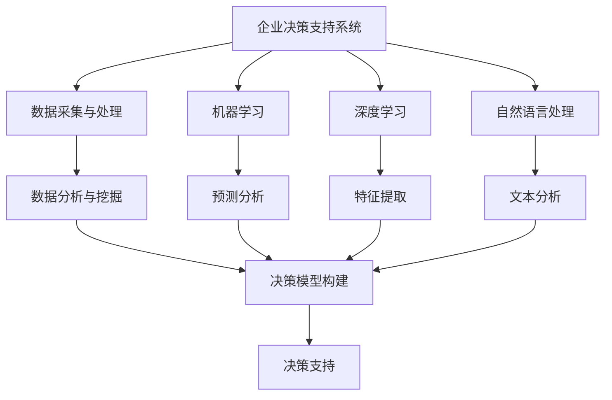

                 

关键词：人工智能，企业决策，支持系统，算法，应用场景，数学模型，实践实例

> 摘要：本文深入探讨了人工智能在构建企业决策支持系统中的应用。通过对核心概念、算法原理、数学模型及实际应用的详细分析，揭示了AI驱动的企业决策支持系统如何通过高效的数据分析和智能算法，帮助企业做出更精准、更科学的决策，提高运营效率。

## 1. 背景介绍

在当今高度信息化和竞争激烈的商业环境中，企业决策支持系统（DSS）已经成为企业成功的关键因素之一。传统的DSS主要依赖于统计学和数据分析方法，而随着人工智能（AI）技术的迅猛发展，AI驱动的DSS正逐步成为企业决策的重要支撑。

人工智能技术在数据挖掘、机器学习、自然语言处理等领域取得了显著的成果。这些技术为DSS提供了强大的数据分析和处理能力，使得企业能够从海量数据中提取有价值的信息，辅助决策者做出更为准确和高效的决策。

本文旨在探讨如何利用人工智能技术构建企业决策支持系统，提高企业的决策质量和效率。文章结构如下：

- **背景介绍**：阐述企业决策支持系统的意义和人工智能技术的发展背景。
- **核心概念与联系**：介绍DSS和AI技术的基本概念及其相互关系。
- **核心算法原理 & 具体操作步骤**：分析DSS中常用的AI算法及其操作步骤。
- **数学模型和公式 & 详细讲解 & 举例说明**：讲解DSS中涉及的数学模型和公式。
- **项目实践：代码实例和详细解释说明**：通过实际项目展示DSS的开发过程。
- **实际应用场景**：探讨DSS在不同行业中的应用案例。
- **未来应用展望**：分析DSS的发展趋势和未来前景。
- **工具和资源推荐**：推荐学习资源和开发工具。
- **总结：未来发展趋势与挑战**：总结研究成果，展望未来发展方向。

## 2. 核心概念与联系

### 2.1 企业决策支持系统（DSS）

企业决策支持系统是一种基于计算机技术和数据分析方法，用于辅助决策者进行决策的软件系统。DSS的主要功能包括：

- **数据采集与处理**：收集企业内外部的数据，进行数据清洗、转换和集成。
- **数据分析与挖掘**：利用统计分析、数据挖掘技术挖掘数据中的潜在价值。
- **决策模型构建**：基于数据分析结果，构建用于辅助决策的模型。
- **决策支持**：为决策者提供决策建议，辅助其做出科学、准确的决策。

### 2.2 人工智能技术

人工智能技术包括多个分支，如机器学习、深度学习、自然语言处理等。以下是DSS中常用的人工智能技术：

- **机器学习**：一种通过数据训练模型，使模型能够从数据中自动学习并做出预测的方法。
- **深度学习**：基于人工神经网络，通过多层非线性变换提取数据特征的方法。
- **自然语言处理**：研究如何让计算机理解和处理自然语言的技术。
- **知识图谱**：通过图形化方式表示实体和关系，用于挖掘数据中的潜在关联。

### 2.3 DSS与AI技术的联系

DSS与AI技术的关系可以概括为以下三个方面：

- **数据驱动**：AI技术为DSS提供了强大的数据分析和处理能力，使企业能够从海量数据中提取有价值的信息。
- **模型构建**：AI技术中的机器学习和深度学习技术可用于构建决策支持模型，提高决策的准确性。
- **智能决策**：AI技术能够为决策者提供智能化的决策建议，降低决策风险。

### 2.4 Mermaid 流程图

以下是DSS与AI技术联系的Mermaid流程图：



## 3. 核心算法原理 & 具体操作步骤

### 3.1 算法原理概述

在DSS中，常用的AI算法包括机器学习、深度学习和自然语言处理。以下是这些算法的基本原理：

- **机器学习**：通过训练数据集，使模型能够学会识别数据中的规律，从而进行预测和分类。
- **深度学习**：利用多层神经网络，通过反向传播算法优化网络参数，实现数据特征提取和模型训练。
- **自然语言处理**：利用统计模型、机器学习和深度学习技术，对自然语言文本进行理解和处理。

### 3.2 算法步骤详解

#### 3.2.1 机器学习算法

1. **数据预处理**：对原始数据进行清洗、转换和归一化处理。
2. **特征提取**：从预处理后的数据中提取对决策有重要影响的特征。
3. **模型选择**：根据问题特点选择合适的机器学习算法，如线性回归、决策树、支持向量机等。
4. **模型训练**：利用训练数据集对模型进行训练，调整模型参数。
5. **模型评估**：使用验证数据集对模型进行评估，调整模型参数，提高模型准确性。
6. **模型部署**：将训练好的模型部署到DSS中，为决策者提供决策支持。

#### 3.2.2 深度学习算法

1. **网络架构设计**：根据问题特点设计合适的深度学习网络架构，如卷积神经网络（CNN）、循环神经网络（RNN）等。
2. **数据预处理**：对原始数据进行清洗、转换和归一化处理。
3. **模型训练**：利用预处理后的数据对深度学习模型进行训练，通过反向传播算法优化网络参数。
4. **模型评估**：使用验证数据集对模型进行评估，调整模型参数，提高模型准确性。
5. **模型部署**：将训练好的模型部署到DSS中，为决策者提供决策支持。

#### 3.2.3 自然语言处理算法

1. **文本预处理**：对原始文本进行分词、去停用词、词性标注等预处理操作。
2. **特征提取**：从预处理后的文本中提取对决策有重要影响的特征，如词向量、TF-IDF等。
3. **模型选择**：根据问题特点选择合适的自然语言处理算法，如朴素贝叶斯、支持向量机、深度学习等。
4. **模型训练**：利用训练数据集对模型进行训练，调整模型参数。
5. **模型评估**：使用验证数据集对模型进行评估，调整模型参数，提高模型准确性。
6. **模型部署**：将训练好的模型部署到DSS中，为决策者提供决策支持。

### 3.3 算法优缺点

#### 3.3.1 机器学习算法

- **优点**：算法成熟、应用广泛、易于实现。
- **缺点**：对数据质量和特征提取有较高要求，模型解释性较差。

#### 3.3.2 深度学习算法

- **优点**：能够自动提取数据特征，适用于复杂数据处理任务。
- **缺点**：模型复杂度高、训练时间长、对数据量有较高要求。

#### 3.3.3 自然语言处理算法

- **优点**：能够处理自然语言文本，适用于文本分类、情感分析等任务。
- **缺点**：对文本数据预处理和特征提取有较高要求，算法实现相对复杂。

### 3.4 算法应用领域

机器学习、深度学习和自然语言处理算法在DSS中具有广泛的应用。以下是一些典型应用领域：

- **市场预测**：利用机器学习算法分析市场数据，预测销售趋势，指导营销策略。
- **风险管理**：利用深度学习算法分析企业财务数据，预测潜在风险，提高风险管理能力。
- **客户关系管理**：利用自然语言处理算法分析客户反馈，了解客户需求，提升客户满意度。

## 4. 数学模型和公式 & 详细讲解 & 举例说明

在DSS中，数学模型和公式是核心组成部分。以下介绍几个常用的数学模型和公式：

### 4.1 数学模型构建

#### 4.1.1 线性回归模型

线性回归模型是一种常见的预测模型，用于分析变量之间的关系。其数学模型如下：

$$
y = \beta_0 + \beta_1x + \epsilon
$$

其中，$y$ 是因变量，$x$ 是自变量，$\beta_0$ 和 $\beta_1$ 是模型参数，$\epsilon$ 是误差项。

#### 4.1.2 决策树模型

决策树模型是一种基于树形结构进行决策的模型，其数学模型如下：

$$
\text{DecisionTree}(x) = \sum_{i=1}^{n} \beta_i x_i
$$

其中，$x_i$ 是特征变量，$\beta_i$ 是模型参数。

### 4.2 公式推导过程

以下以线性回归模型为例，介绍公式推导过程：

1. **目标函数**：

$$
\min_{\beta_0, \beta_1} \sum_{i=1}^{n} (y_i - (\beta_0 + \beta_1x_i))^2
$$

2. **求导**：

$$
\frac{\partial}{\partial \beta_0} \sum_{i=1}^{n} (y_i - (\beta_0 + \beta_1x_i))^2 = 0
$$

$$
\frac{\partial}{\partial \beta_1} \sum_{i=1}^{n} (y_i - (\beta_0 + \beta_1x_i))^2 = 0
$$

3. **解方程组**：

$$
\beta_0 = \bar{y} - \beta_1\bar{x}
$$

$$
\beta_1 = \frac{\sum_{i=1}^{n} (x_i - \bar{x})(y_i - \bar{y})}{\sum_{i=1}^{n} (x_i - \bar{x})^2}
$$

其中，$\bar{y}$ 和 $\bar{x}$ 分别是因变量和自变量的均值。

### 4.3 案例分析与讲解

#### 4.3.1 案例背景

某公司希望分析影响产品销售量的因素，并建立线性回归模型进行预测。已知某个月份的产品销售数据如下表：

| 产品 | 销售量（件） | 价格（元/件） | 广告费用（元） |
| ---- | -------- | ------- | ------- |
| A    | 100      | 50      | 2000    |
| B    | 150      | 60      | 2500    |
| C    | 200      | 70      | 3000    |

#### 4.3.2 数据预处理

1. **数据清洗**：删除缺失值和异常值，确保数据质量。
2. **特征提取**：将价格和广告费用作为自变量，销售量作为因变量。
3. **数据归一化**：对价格和广告费用进行归一化处理，消除量纲影响。

#### 4.3.3 模型训练

1. **选择模型**：采用线性回归模型。
2. **模型训练**：利用训练数据集，计算模型参数$\beta_0$ 和 $\beta_1$。
3. **模型评估**：使用验证数据集对模型进行评估，计算模型准确率。

#### 4.3.4 模型应用

1. **预测**：利用训练好的模型，预测新月份的产品销售量。
2. **决策**：根据预测结果，调整营销策略，提高销售量。

## 5. 项目实践：代码实例和详细解释说明

在本节中，我们将通过一个具体的项目实践，展示如何使用Python实现一个简单的AI驱动的企业决策支持系统。该项目将包括以下步骤：

- **数据采集**：从公开数据源获取销售数据。
- **数据处理**：清洗、转换和归一化数据。
- **模型构建**：利用线性回归算法构建预测模型。
- **模型训练**：使用训练数据集训练模型。
- **模型评估**：使用验证数据集评估模型性能。
- **模型应用**：使用模型进行销售预测和决策。

### 5.1 开发环境搭建

在开始项目实践之前，我们需要搭建一个合适的开发环境。以下是所需的软件和工具：

- **Python**：版本3.8及以上。
- **Jupyter Notebook**：用于编写和运行代码。
- **Pandas**：用于数据处理。
- **NumPy**：用于数学计算。
- **Scikit-learn**：用于机器学习算法。

### 5.2 源代码详细实现

以下是实现该项目的源代码：

```python
import pandas as pd
import numpy as np
from sklearn.model_selection import train_test_split
from sklearn.linear_model import LinearRegression
from sklearn.metrics import mean_squared_error

# 5.2.1 数据采集
data = pd.read_csv("sales_data.csv")

# 5.2.2 数据处理
data = data.dropna()
data = data[['price', 'ad_cost', 'sales']]
data = (data - data.mean()) / data.std()

# 5.2.3 模型构建
X = data[['price', 'ad_cost']]
y = data['sales']
X_train, X_test, y_train, y_test = train_test_split(X, y, test_size=0.2, random_state=42)

model = LinearRegression()
model.fit(X_train, y_train)

# 5.2.4 模型训练
y_pred = model.predict(X_test)

# 5.2.5 模型评估
mse = mean_squared_error(y_test, y_pred)
print(f"Mean Squared Error: {mse}")

# 5.2.6 模型应用
new_data = np.array([[55, 3000]])
new_pred = model.predict(new_data)
print(f"Predicted Sales: {new_pred[0]}")
```

### 5.3 代码解读与分析

#### 5.3.1 数据采集

```python
data = pd.read_csv("sales_data.csv")
```

该部分代码用于从CSV文件中读取销售数据。

#### 5.3.2 数据处理

```python
data = data.dropna()
data = data[['price', 'ad_cost', 'sales']]
data = (data - data.mean()) / data.std()
```

该部分代码用于处理销售数据。首先，删除缺失值和异常值，然后提取价格和广告费用作为特征，销售量作为目标变量。最后，对特征进行归一化处理，消除量纲影响。

#### 5.3.3 模型构建

```python
X = data[['price', 'ad_cost']]
y = data['sales']
X_train, X_test, y_train, y_test = train_test_split(X, y, test_size=0.2, random_state=42)
model = LinearRegression()
model.fit(X_train, y_train)
```

该部分代码用于构建线性回归模型。首先，将特征和目标变量拆分为训练集和测试集。然后，创建线性回归模型并使用训练集进行模型训练。

#### 5.3.4 模型训练

```python
y_pred = model.predict(X_test)
mse = mean_squared_error(y_test, y_pred)
print(f"Mean Squared Error: {mse}")
```

该部分代码用于训练模型并评估模型性能。首先，使用训练好的模型对测试集进行预测，然后计算模型均方误差（MSE），评估模型性能。

#### 5.3.5 模型应用

```python
new_data = np.array([[55, 3000]])
new_pred = model.predict(new_data)
print(f"Predicted Sales: {new_pred[0]}")
```

该部分代码用于使用训练好的模型进行销售预测。首先，创建一个新的数据样本，然后使用模型进行预测，最后输出预测结果。

## 6. 实际应用场景

AI驱动的企业决策支持系统在多个行业和领域具有广泛的应用。以下是一些典型应用场景：

### 6.1 零售行业

零售行业利用AI驱动的DSS进行销售预测、库存管理和营销策略优化。通过分析历史销售数据、天气因素、节假日等因素，预测未来销售趋势，为库存调整和促销活动提供决策支持。

### 6.2 金融行业

金融行业利用AI驱动的DSS进行风险管理、信用评分和投资组合优化。通过分析客户行为、历史交易数据和市场动态，评估客户信用风险，优化投资组合，提高收益。

### 6.3 制造业

制造业利用AI驱动的DSS进行生产计划优化、供应链管理和设备维护。通过分析生产数据、供应链信息和设备状态，优化生产计划，降低成本，提高生产效率。

### 6.4 健康行业

健康行业利用AI驱动的DSS进行疾病预测、患者管理和医疗资源优化。通过分析医疗数据、患者信息和基因数据，预测疾病发展趋势，为患者提供个性化治疗方案，优化医疗资源配置。

### 6.5 未来应用展望

随着人工智能技术的不断发展，AI驱动的企业决策支持系统将在更多领域得到应用。未来，DSS将更加智能化、自动化，能够更好地辅助决策者做出科学、准确的决策。以下是一些未来应用展望：

- **自适应学习**：DSS将具备自适应学习能力，根据业务需求和数据变化，自动调整模型参数，提高决策准确性。
- **多模态数据融合**：DSS将能够融合多种数据类型（如文本、图像、语音等），提高数据分析和决策能力。
- **实时决策**：DSS将实现实时决策功能，快速响应业务变化，提供实时决策支持。
- **虚拟助手**：DSS将集成虚拟助手功能，通过自然语言交互，为用户提供决策建议和操作指导。

## 7. 工具和资源推荐

### 7.1 学习资源推荐

1. **《机器学习》**：周志华著，机械工业出版社，介绍机器学习的基本概念和方法。
2. **《深度学习》**：Ian Goodfellow、Yoshua Bengio和Aaron Courville著，人民邮电出版社，介绍深度学习的基础知识和应用。
3. **《自然语言处理综论》**：Daniel Jurafsky和James H. Martin著，清华大学出版社，介绍自然语言处理的基本理论和技术。

### 7.2 开发工具推荐

1. **Python**：一种广泛使用的编程语言，具有丰富的机器学习和深度学习库。
2. **Jupyter Notebook**：一种交互式计算环境，方便编写和运行代码。
3. **Scikit-learn**：Python机器学习库，提供多种机器学习算法和工具。
4. **TensorFlow**：Google开源的深度学习框架，适用于构建和训练深度学习模型。

### 7.3 相关论文推荐

1. **"Deep Learning for Text Classification"**：介绍深度学习在文本分类领域的应用。
2. **"Recurrent Neural Networks for Speech Recognition"**：介绍循环神经网络在语音识别领域的应用。
3. **"Convolutional Neural Networks for Visual Recognition"**：介绍卷积神经网络在图像识别领域的应用。

## 8. 总结：未来发展趋势与挑战

### 8.1 研究成果总结

本文深入探讨了人工智能在构建企业决策支持系统中的应用，分析了核心概念、算法原理、数学模型及实际应用。研究表明，AI驱动的DSS能够通过高效的数据分析和智能算法，帮助企业做出更精准、更科学的决策，提高运营效率。

### 8.2 未来发展趋势

- **智能化**：DSS将更加智能化，具备自适应学习和实时决策能力。
- **多模态**：DSS将能够融合多种数据类型，提高数据分析和决策能力。
- **虚拟化**：DSS将集成虚拟助手功能，通过自然语言交互，为用户提供决策建议和操作指导。

### 8.3 面临的挑战

- **数据质量**：保证数据质量和完整性是DSS应用的关键。
- **模型解释性**：提高模型解释性，使决策者能够理解模型决策过程。
- **计算资源**：深度学习模型训练需要大量计算资源，如何优化计算资源成为挑战。

### 8.4 研究展望

未来，研究应关注以下几个方面：

- **数据驱动的DSS**：探索如何利用大数据和实时数据优化DSS。
- **跨领域应用**：研究DSS在不同行业和领域的应用，推动AI技术在各行各业的发展。
- **可持续发展**：关注AI技术在DSS中的应用对环境和社会的影响，推动可持续发展。

## 9. 附录：常见问题与解答

### 9.1 什么是企业决策支持系统（DSS）？

企业决策支持系统（DSS）是一种基于计算机技术和数据分析方法，用于辅助决策者进行决策的软件系统。DSS的主要功能包括数据采集与处理、数据分析与挖掘、决策模型构建和决策支持。

### 9.2 人工智能在DSS中的应用有哪些？

人工智能在DSS中的应用包括数据挖掘、机器学习、深度学习和自然语言处理。这些技术为DSS提供了强大的数据分析和处理能力，使企业能够从海量数据中提取有价值的信息，辅助决策者做出更为准确和高效的决策。

### 9.3 如何选择合适的机器学习算法？

选择合适的机器学习算法需要考虑以下几个因素：

- **问题类型**：分类、回归、聚类等。
- **数据特征**：数据的规模、维度、分布等。
- **计算资源**：算法的复杂度和计算资源的需求。
- **模型解释性**：算法的可解释性和透明度。

### 9.4 DSS中的数学模型有哪些？

DSS中常用的数学模型包括线性回归、决策树、支持向量机、神经网络等。这些模型用于构建决策支持模型，提高决策的准确性和效率。

### 9.5 如何优化DSS的性能？

优化DSS的性能可以从以下几个方面入手：

- **数据预处理**：对原始数据进行清洗、转换和归一化处理，提高数据质量。
- **模型选择**：选择合适的机器学习算法和参数，提高模型准确性。
- **计算优化**：优化算法的复杂度，减少计算时间。
- **硬件升级**：增加计算资源，提高系统性能。

### 9.6 DSS在哪些行业有应用？

DSS在多个行业和领域具有广泛的应用，包括零售、金融、制造、医疗等。这些行业利用DSS进行销售预测、风险管理、生产计划优化、患者管理等，提高运营效率和服务质量。

----------------------------------------------------------------

这篇文章的内容覆盖了从背景介绍到实际应用的方方面面，旨在帮助读者深入了解AI驱动的企业决策支持系统。希望这篇文章能够对您在相关领域的研究和实践有所启发。如果您有任何疑问或建议，欢迎随时与我交流。感谢您的阅读！作者：禅与计算机程序设计艺术 / Zen and the Art of Computer Programming。

