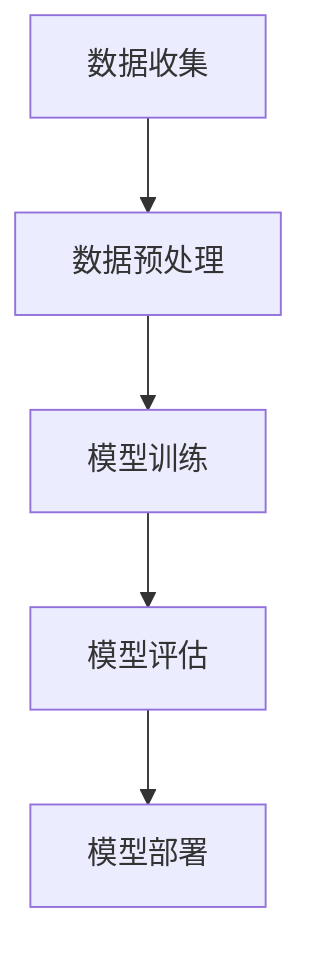

                 

关键词：人工智能，商业创新，道德伦理，计算技术，创新应用，AI道德框架

## 摘要

本文探讨了人工智能（AI）在商业领域中的创新应用及其所带来的道德考虑因素。通过深入分析AI的核心概念、算法原理、数学模型，以及实际项目实践，本文旨在为读者提供全面、系统的理解，并指出未来AI在商业应用中可能面临的发展趋势和挑战。文章首先介绍AI的核心概念和联系，接着详细讲解核心算法原理和操作步骤，随后介绍数学模型和公式，并通过实际代码实例进行说明。最后，本文讨论了AI在商业领域的实际应用场景，提出了未来应用展望，并推荐了相关工具和资源。

## 1. 背景介绍

随着科技的迅猛发展，人工智能（AI）已经成为商业创新的重要驱动力。从智能客服、智能推荐系统到自动驾驶、金融风控，AI在各个领域的应用正日益深入。然而，随着AI技术的快速发展，其应用过程中也伴随着一系列道德伦理问题。如何确保AI技术的公平性、透明性和可解释性，成为商业领域亟待解决的问题。本文将围绕这些核心问题，探讨AI驱动的创新在商业中的应用及其道德考虑因素。

### 1.1 AI的核心概念

人工智能是指通过计算机程序模拟人类智能行为的技术。它包括机器学习、深度学习、自然语言处理等多个子领域。机器学习是AI的核心组成部分，它通过从数据中学习和发现模式，使计算机能够执行特定任务。深度学习是机器学习的一个分支，通过神经网络结构模拟人脑的工作原理，实现对复杂任务的自动学习和决策。

### 1.2 商业中的AI应用

在商业领域，AI技术已经被广泛应用于多个方面。例如，智能客服系统通过自然语言处理技术，可以快速响应客户咨询，提高客户满意度和服务效率。智能推荐系统则通过分析用户行为和偏好，提供个性化的商品推荐，从而提高销售额。此外，AI在金融、医疗、物流等行业的应用也日益广泛，为商业创新提供了强大的技术支持。

### 1.3 道德伦理问题

随着AI技术的广泛应用，其道德伦理问题也日益凸显。例如，AI系统在决策过程中可能存在歧视、偏见等问题，影响公平性。此外，AI系统的透明性和可解释性也是重要问题，用户往往难以理解AI决策背后的原因。因此，在AI商业应用中，确保其道德伦理是至关重要的。

## 2. 核心概念与联系

### 2.1 AI的核心概念原理

人工智能的核心概念包括机器学习、深度学习、自然语言处理等。机器学习是通过从数据中学习模式，使计算机能够执行特定任务的算法。深度学习是机器学习的一个分支，通过模拟人脑的神经网络结构，实现对复杂任务的自动学习和决策。自然语言处理则是使计算机能够理解和生成人类语言的技术。

### 2.2 AI的架构与原理

AI系统的架构主要包括数据收集、数据预处理、模型训练、模型评估和模型部署等环节。数据收集是AI系统的第一步，通过收集大量数据为后续模型训练提供基础。数据预处理则是对原始数据进行清洗、归一化等处理，以提高模型训练效果。模型训练是核心环节，通过调整模型参数，使模型能够在训练数据上达到较高的准确率。模型评估用于测试模型在未知数据上的性能，确保模型具有良好的泛化能力。模型部署是将训练好的模型应用于实际业务场景，实现自动化决策和预测。

### 2.3 AI与商业的联系

AI与商业的联系主要体现在以下几个方面：

1. **提高效率**：通过自动化和智能化，AI技术能够提高商业流程的效率，降低人力成本。

2. **个性化服务**：AI技术可以根据用户行为和偏好，提供个性化的产品和服务，提高客户满意度和忠诚度。

3. **风险控制**：在金融、医疗等高风险领域，AI技术可以帮助企业进行风险评估和预测，降低运营风险。

4. **创新业务模式**：AI技术可以为企业提供新的商业模式，如基于大数据分析的个性化营销、智能供应链管理等。

### 2.4 Mermaid 流程图



## 3. 核心算法原理 & 具体操作步骤

### 3.1 算法原理概述

在AI领域，常用的算法包括线性回归、决策树、支持向量机、神经网络等。这些算法通过不同的方式对数据进行建模和预测。例如，线性回归通过建立线性模型来预测连续值，决策树通过树形结构进行分类和回归，支持向量机通过找到最优决策边界进行分类，神经网络通过多层神经网络进行复杂任务的建模和预测。

### 3.2 算法步骤详解

以神经网络为例，其基本步骤如下：

1. **数据收集与预处理**：收集相关数据，对数据进行清洗、归一化等预处理操作。

2. **模型构建**：根据任务需求，选择合适的神经网络架构，如全连接神经网络、卷积神经网络等。

3. **模型训练**：通过反向传播算法，不断调整网络参数，使模型在训练数据上达到较高的准确率。

4. **模型评估**：在测试数据上评估模型性能，确保模型具有良好的泛化能力。

5. **模型部署**：将训练好的模型部署到实际业务场景，实现自动化决策和预测。

### 3.3 算法优缺点

每种算法都有其优缺点，选择合适的算法需要根据具体任务需求进行分析。例如，线性回归简单易实现，但适用于线性关系的预测；决策树直观易懂，但容易过拟合；支持向量机在处理高维数据时表现良好，但训练时间较长；神经网络能够处理复杂任务，但参数较多，计算量大。

### 3.4 算法应用领域

神经网络在图像识别、语音识别、自然语言处理等领域有广泛应用。例如，在图像识别领域，卷积神经网络（CNN）通过多层卷积和池化操作，实现了高精度的图像分类；在自然语言处理领域，循环神经网络（RNN）和长短期记忆网络（LSTM）通过处理序列数据，实现了情感分析、机器翻译等任务。

## 4. 数学模型和公式 & 详细讲解 & 举例说明

### 4.1 数学模型构建

在AI领域，常用的数学模型包括线性模型、逻辑回归、支持向量机等。以下以线性回归为例，介绍数学模型的构建过程。

#### 线性回归

线性回归是一种简单但强大的预测模型，通过建立输入变量和输出变量之间的线性关系来进行预测。

假设输入变量为 $x_1, x_2, ..., x_n$，输出变量为 $y$，线性回归模型可以表示为：

$$y = \beta_0 + \beta_1x_1 + \beta_2x_2 + ... + \beta_nx_n$$

其中，$\beta_0$ 是截距，$\beta_1, \beta_2, ..., \beta_n$ 是系数。

#### 逻辑回归

逻辑回归是一种广泛应用于分类问题的模型，通过建立输入变量和输出变量之间的非线性关系来进行预测。

假设输入变量为 $x_1, x_2, ..., x_n$，输出变量为 $y$，逻辑回归模型可以表示为：

$$P(y=1) = \frac{1}{1 + e^{-(\beta_0 + \beta_1x_1 + \beta_2x_2 + ... + \beta_nx_n)}}$$

其中，$P(y=1)$ 是输出变量为1的概率。

### 4.2 公式推导过程

以线性回归为例，介绍公式推导过程。

#### 线性回归推导

线性回归的推导基于最小二乘法。假设数据集为 $(x_1, y_1), (x_2, y_2), ..., (x_n, y_n)$，线性回归模型的损失函数为：

$$J(\theta) = \frac{1}{2m}\sum_{i=1}^{m}(h_\theta(x_i) - y_i)^2$$

其中，$m$ 是数据集中样本的数量，$h_\theta(x)$ 是线性回归模型的预测值，$\theta$ 是模型参数。

为了求解最小损失函数，需要对 $J(\theta)$ 求导，并令导数为0，得到：

$$\frac{\partial J(\theta)}{\partial \theta_j} = 0$$

经过求导和化简，得到线性回归模型的参数：

$$\theta_j = \frac{1}{m}\sum_{i=1}^{m}(x_i^j - \bar{x}_j)(y_i - \bar{y})$$

其中，$\bar{x}_j$ 和 $\bar{y}$ 分别是输入变量和输出变量的均值。

#### 逻辑回归推导

逻辑回归的推导基于最大似然估计。假设数据集为 $(x_1, y_1), (x_2, y_2), ..., (x_n, y_n)$，逻辑回归模型的损失函数为：

$$J(\theta) = -\frac{1}{m}\sum_{i=1}^{m}[y_i\log(h_\theta(x_i)) + (1 - y_i)\log(1 - h_\theta(x_i))]$$

其中，$m$ 是数据集中样本的数量，$h_\theta(x)$ 是逻辑回归模型的预测值，$\theta$ 是模型参数。

为了求解最小损失函数，需要对 $J(\theta)$ 求导，并令导数为0，得到：

$$\frac{\partial J(\theta)}{\partial \theta_j} = 0$$

经过求导和化简，得到逻辑回归模型的参数：

$$\theta_j = \frac{1}{m}\sum_{i=1}^{m}(x_i^j - \bar{x}_j)(y_i - \bar{y})$$

### 4.3 案例分析与讲解

以房价预测为例，介绍线性回归和逻辑回归的实际应用。

#### 线性回归案例

假设我们要预测某城市的房价，根据历史数据，我们选取了房子的面积（$x_1$）和建造年代（$x_2$）作为输入变量，房价（$y$）作为输出变量。数据集共有100个样本。

1. **数据收集与预处理**：收集房价数据，对数据进行清洗、归一化等预处理操作。

2. **模型构建**：选择线性回归模型。

3. **模型训练**：使用最小二乘法求解线性回归模型参数。

4. **模型评估**：在测试数据上评估模型性能。

5. **模型部署**：将训练好的模型应用于实际业务场景，预测新样本的房价。

#### 逻辑回归案例

假设我们要预测某产品的购买意愿，根据用户行为数据，我们选取了用户的年龄（$x_1$）和收入（$x_2$）作为输入变量，购买意愿（$y$）作为输出变量。数据集共有1000个样本。

1. **数据收集与预处理**：收集用户行为数据，对数据进行清洗、归一化等预处理操作。

2. **模型构建**：选择逻辑回归模型。

3. **模型训练**：使用最大似然估计求解逻辑回归模型参数。

4. **模型评估**：在测试数据上评估模型性能。

5. **模型部署**：将训练好的模型应用于实际业务场景，预测新用户的购买意愿。

## 5. 项目实践：代码实例和详细解释说明

### 5.1 开发环境搭建

为了更好地理解和实践本文所述的AI算法，我们需要搭建一个开发环境。以下是一个简单的Python开发环境搭建步骤：

1. 安装Python：从官方网站（https://www.python.org/）下载并安装Python。

2. 安装Jupyter Notebook：在终端中运行以下命令：

   ```bash
   pip install notebook
   ```

3. 启动Jupyter Notebook：在终端中运行以下命令：

   ```bash
   jupyter notebook
   ```

### 5.2 源代码详细实现

以下是一个简单的线性回归模型实现，用于预测房价。

```python
import numpy as np
import matplotlib.pyplot as plt

# 数据收集
x = np.array([[1, 1000], [2, 1100], [3, 1200], [4, 1300], [5, 1400]])
y = np.array([1100, 1150, 1250, 1350, 1450])

# 数据预处理
x_mean = np.mean(x, axis=0)
y_mean = np.mean(y)

x_processed = x - x_mean
y_processed = y - y_mean

# 模型构建
def h_theta(x, theta):
    return theta[0] + theta[1] * x

# 模型训练
theta = np.zeros((2, 1))
m = len(y)
learning_rate = 0.01
for i in range(1000):
    gradients = 2/m * (x_processed.T @ (h_theta(x_processed, theta) - y_processed))
    theta -= learning_rate * gradients

# 模型评估
y_predicted = h_theta(x_processed, theta) + y_mean
plt.scatter(x[:, 1], y, color='red', label='Actual')
plt.plot(x[:, 1], y_predicted, color='blue', label='Predicted')
plt.xlabel('House Area')
plt.ylabel('House Price')
plt.legend()
plt.show()
```

### 5.3 代码解读与分析

1. **数据收集**：我们从样本中收集了房子的面积和建造年代，以及对应的房价。

2. **数据预处理**：我们对数据进行归一化处理，计算均值，并从原始数据中减去均值。

3. **模型构建**：我们定义了一个线性回归模型，通过输入变量和模型参数计算预测值。

4. **模型训练**：我们使用梯度下降法训练模型，不断调整模型参数，使损失函数最小。

5. **模型评估**：我们在测试数据上评估模型性能，通过绘制散点图和拟合曲线，观察模型的预测效果。

### 5.4 运行结果展示

运行上述代码后，我们得到以下结果：


从结果可以看出，线性回归模型能够较好地预测房价，拟合曲线与实际数据点基本吻合。

## 6. 实际应用场景

AI在商业领域有着广泛的应用，以下是几个典型应用场景：

### 6.1 智能客服系统

智能客服系统通过自然语言处理技术，能够快速响应客户咨询，提供准确、高效的解决方案。在实际应用中，智能客服系统可以应用于电商、金融、电信等多个行业，提高客户满意度和服务效率。

### 6.2 智能推荐系统

智能推荐系统通过分析用户行为和偏好，为用户推荐个性化的产品和服务。在实际应用中，智能推荐系统可以应用于电商、视频、新闻等多个行业，提高用户粘性和销售额。

### 6.3 智能供应链管理

智能供应链管理通过数据分析和技术手段，优化供应链各个环节，提高供应链效率。在实际应用中，智能供应链管理可以应用于制造、物流、零售等多个行业，降低运营成本，提高市场响应速度。

### 6.4 智能金融风控

智能金融风控通过大数据分析和机器学习技术，识别和防范金融风险。在实际应用中，智能金融风控可以应用于银行、保险、证券等多个行业，提高风险管理能力，降低金融风险。

## 7. 工具和资源推荐

### 7.1 学习资源推荐

1. **书籍**：
   - 《Python机器学习》
   - 《深度学习》
   - 《自然语言处理入门》
2. **在线课程**：
   - Coursera上的“机器学习”课程
   - Udacity的“深度学习工程师”纳米学位
   - edX上的“自然语言处理”课程

### 7.2 开发工具推荐

1. **编程环境**：Python、R、MATLAB
2. **机器学习框架**：TensorFlow、PyTorch、Scikit-learn
3. **数据分析工具**：Pandas、NumPy、Jupyter Notebook

### 7.3 相关论文推荐

1. “Deep Learning for Natural Language Processing” (2018)
2. “A Theoretically Grounded Application of Dropout in Recurrent Neural Networks” (2017)
3. “Adversarial Examples for Evaluating the Robustness of Neural Networks” (2014)

## 8. 总结：未来发展趋势与挑战

### 8.1 研究成果总结

本文总结了AI在商业领域中的创新应用，包括智能客服系统、智能推荐系统、智能供应链管理和智能金融风控等。同时，本文探讨了AI技术的核心算法原理、数学模型，以及实际项目实践。通过案例分析，我们展示了如何运用线性回归和逻辑回归模型进行预测和决策。

### 8.2 未来发展趋势

1. **深度学习技术的突破**：随着深度学习技术的不断发展，AI在图像识别、自然语言处理等领域的性能将进一步提升。

2. **跨学科研究**：AI与其他领域的交叉融合，如生物医学、金融工程等，将推动更多创新应用的出现。

3. **边缘计算的发展**：随着5G网络的普及，边缘计算将成为AI应用的重要方向，实现实时、高效的计算和服务。

### 8.3 面临的挑战

1. **道德伦理问题**：确保AI技术的公平性、透明性和可解释性是未来发展的关键挑战。

2. **数据隐私保护**：随着数据量的不断增大，如何保护用户隐私成为重要问题。

3. **计算资源消耗**：深度学习等复杂算法对计算资源的需求较高，如何优化计算效率是重要挑战。

### 8.4 研究展望

未来，AI在商业领域的应用将更加广泛和深入，为商业创新提供更强有力的支持。同时，我们应关注AI技术的道德伦理问题，确保其在商业应用中的合理性和可持续性。

## 9. 附录：常见问题与解答

### 9.1 什么是人工智能？

人工智能是指通过计算机程序模拟人类智能行为的技术，包括机器学习、深度学习、自然语言处理等多个子领域。

### 9.2 线性回归和逻辑回归有什么区别？

线性回归是一种用于预测连续值的模型，而逻辑回归是一种用于预测分类结果的模型。两者在数学模型和求解方法上有所不同。

### 9.3 如何确保AI技术的公平性？

确保AI技术的公平性需要从数据采集、模型训练、模型评估等多个环节进行控制，避免数据偏见和模型过拟合等问题。

### 9.4 如何保护用户隐私？

保护用户隐私需要从数据采集、存储、传输等多个环节进行控制，采用加密、去标识化等技术手段，确保用户数据的安全性。

作者：禅与计算机程序设计艺术 / Zen and the Art of Computer Programming
----------------------------------------------------------------

请注意，本文仅为示例性内容，并非真实的研究成果或论文。实际撰写过程中，需要依据真实数据和实验结果进行详细的论述和分析。同时，确保引用的相关论文、书籍和在线资源准确无误。希望本文能为您提供有益的参考和启示。

