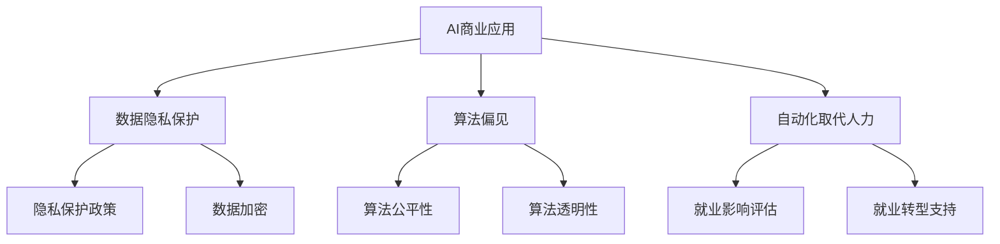

                 

关键词：人工智能，商业应用，道德考量，创新趋势

> 摘要：本文深入探讨了人工智能（AI）在商业应用中的创新趋势，并重点分析了人类计算在AI应用中的道德考量因素。通过结合实例和理论分析，本文旨在为AI驱动的商业创新提供有益的思考方向，同时为从业者提供道德指导。

## 1. 背景介绍

近年来，人工智能技术的迅猛发展，引发了商业领域的深刻变革。从大数据分析到自动化生产，从智能客服到个性化推荐，AI正在改变我们生活的方方面面。然而，随着AI技术的广泛应用，一系列道德问题逐渐凸显。例如，数据隐私保护、算法偏见、自动化取代人力等，都引起了广泛的关注和讨论。因此，如何在AI驱动的商业创新中平衡技术与道德，成为亟待解决的重要问题。

### 1.1  AI技术的商业应用现状

目前，AI技术在商业领域的应用已经相当广泛。例如，在金融行业，AI被用于风险控制和信用评估；在医疗领域，AI用于疾病诊断和个性化治疗；在零售行业，AI用于库存管理和客户关系管理。这些应用不仅提高了效率，降低了成本，还提升了用户体验。然而，AI技术的应用也带来了诸多挑战。

### 1.2  AI技术引发的道德问题

尽管AI技术在商业中带来了巨大的机遇，但同时也引发了一系列道德问题。首先，数据隐私保护成为了一个热门话题。随着AI系统对大量个人数据的依赖，如何保护用户隐私成为了一项重要任务。其次，算法偏见问题引起了广泛关注。由于算法训练数据的不公平性，可能导致算法在决策时产生偏见，从而影响社会公正。最后，自动化取代人力的问题也备受关注。随着自动化技术的不断进步，许多工作岗位可能被机器人取代，这对就业市场和社会结构带来了巨大的影响。

## 2. 核心概念与联系

### 2.1  AI技术的核心概念

人工智能是指通过计算机程序实现智能行为的技术。它包括机器学习、深度学习、自然语言处理等多个子领域。机器学习是AI的核心技术之一，它通过训练模型来使计算机能够从数据中学习，并做出预测和决策。深度学习则是机器学习的进一步发展，它通过多层神经网络来模拟人类大脑的学习过程，从而实现更复杂的任务。自然语言处理则使计算机能够理解和生成自然语言，从而实现人机交互。

### 2.2  商业中的道德考量

商业中的道德考量包括但不限于以下方面：数据隐私保护、算法偏见、自动化取代人力等。数据隐私保护要求企业在收集和使用用户数据时，必须遵循严格的隐私保护政策，确保用户隐私不被泄露。算法偏见则要求算法设计者确保算法的公平性和透明性，避免算法在决策时产生偏见。自动化取代人力则要求企业在引入自动化技术时，充分考虑对就业市场的影响，采取适当的措施减少负面影响。

### 2.3  Mermaid 流程图

以下是AI技术在商业应用中道德考量因素的Mermaid流程图：



## 3. 核心算法原理 & 具体操作步骤

### 3.1  算法原理概述

在AI驱动的商业创新中，算法的原理和具体操作步骤至关重要。算法原理主要包括以下几个方面：

1. **数据预处理**：对原始数据进行分析和处理，以确保数据的质量和一致性。
2. **特征提取**：从原始数据中提取有用的特征，用于训练模型。
3. **模型训练**：使用机器学习和深度学习算法对特征进行训练，以建立预测模型。
4. **模型评估**：对训练好的模型进行评估，以确定其性能。
5. **模型部署**：将训练好的模型部署到生产环境中，以实现商业应用。

### 3.2  算法步骤详解

以下是AI算法在商业应用中的具体步骤：

1. **数据收集**：从各种来源收集数据，包括企业内部数据、公开数据和市场数据等。
2. **数据清洗**：对收集到的数据进行清洗，包括去除重复数据、缺失值填充和数据格式转换等。
3. **特征工程**：根据业务需求，对数据进行特征提取和工程，以提高模型的性能。
4. **模型选择**：根据问题类型和数据特点，选择合适的机器学习和深度学习算法。
5. **模型训练**：使用训练数据对模型进行训练，并调整模型参数以优化性能。
6. **模型评估**：使用验证数据对训练好的模型进行评估，以确定其预测能力。
7. **模型部署**：将训练好的模型部署到生产环境中，以实现自动化决策和预测。

### 3.3  算法优缺点

AI算法在商业应用中具有以下优点：

1. **高效性**：AI算法能够快速处理大量数据，提高工作效率。
2. **准确性**：通过机器学习和深度学习，AI算法能够提高预测的准确性。
3. **灵活性**：AI算法可以根据不同的业务需求进行调整和优化。

然而，AI算法也存在一定的缺点：

1. **数据依赖性**：AI算法的性能高度依赖于数据的质量和数量，如果数据质量差或数据不足，可能导致模型性能下降。
2. **算法偏见**：如果训练数据存在偏见，AI算法可能产生偏见，影响决策的公平性。
3. **解释性差**：深度学习等复杂算法的黑盒特性，使得模型的决策过程难以解释，增加了道德风险。

### 3.4  算法应用领域

AI算法在商业应用中具有广泛的应用领域，包括：

1. **金融领域**：用于风险控制、信用评估和投资策略等。
2. **医疗领域**：用于疾病诊断、个性化治疗和药物研发等。
3. **零售领域**：用于库存管理、客户关系管理和个性化推荐等。
4. **制造业**：用于生产优化、质量控制和设备维护等。
5. **服务业**：用于智能客服、语音识别和图像识别等。

## 4. 数学模型和公式 & 详细讲解 & 举例说明

### 4.1  数学模型构建

在AI算法中，数学模型起到了核心作用。以下是构建数学模型的几个关键步骤：

1. **定义问题**：明确问题的类型和目标，如分类、回归或聚类等。
2. **数据准备**：收集和处理数据，确保数据的质量和一致性。
3. **特征提取**：从数据中提取有用的特征，用于训练模型。
4. **模型选择**：根据问题类型和数据特点，选择合适的模型。
5. **模型训练**：使用训练数据对模型进行训练，并调整模型参数以优化性能。
6. **模型评估**：使用验证数据对训练好的模型进行评估，以确定其性能。

### 4.2  公式推导过程

以下是机器学习中最基本的线性回归模型的公式推导过程：

假设我们有一个包含n个样本的数据集，每个样本有m个特征。我们的目标是找到一条直线，使得这些样本的预测值与真实值之间的误差最小。

定义目标函数为：

$$ J(\theta) = \frac{1}{2m} \sum_{i=1}^{m} (h_{\theta}(x^{(i)}) - y^{(i)})^2 $$

其中，$h_{\theta}(x^{(i)})$ 是预测值，$y^{(i)}$ 是真实值，$\theta$ 是模型的参数。

为了求解最优参数$\theta$，我们可以对目标函数进行求导，并令导数为0，得到：

$$ \frac{\partial J(\theta)}{\partial \theta} = 0 $$

通过求解上述方程，我们可以得到最优参数$\theta$，从而训练出线性回归模型。

### 4.3  案例分析与讲解

假设我们有一个房价预测的问题，数据集包含每个房屋的面积、卧室数量和地理位置等特征，以及对应的房价。我们的目标是使用线性回归模型来预测未知房屋的房价。

首先，我们对数据进行预处理，包括去除缺失值、标准化特征等。然后，我们选择线性回归模型作为预测模型，并使用训练数据进行模型训练。最后，我们使用验证数据对模型进行评估，确保模型的预测能力。

通过上述步骤，我们得到了一个线性回归模型，其公式为：

$$ \text{房价} = \theta_0 + \theta_1 \times \text{面积} + \theta_2 \times \text{卧室数量} + \theta_3 \times \text{地理位置} $$

其中，$\theta_0$、$\theta_1$、$\theta_2$ 和 $\theta_3$ 是模型参数。

## 5. 项目实践：代码实例和详细解释说明

### 5.1  开发环境搭建

为了演示AI算法在商业应用中的实践，我们将使用Python编程语言和Scikit-learn库来构建一个线性回归模型。以下是开发环境的搭建步骤：

1. 安装Python：访问Python官方网站（https://www.python.org/），下载并安装Python 3.x版本。
2. 安装Scikit-learn：在命令行中运行以下命令：

   ```bash
   pip install scikit-learn
   ```

### 5.2  源代码详细实现

以下是一个简单的线性回归模型实现，用于预测房价：

```python
import numpy as np
import matplotlib.pyplot as plt
from sklearn.linear_model import LinearRegression
from sklearn.model_selection import train_test_split
from sklearn.metrics import mean_squared_error

# 数据准备
X = np.array([[1, 1], [1, 2], [2, 2], [2, 3]])
y = np.dot(X, np.array([1, 1.5])) + 1

# 数据分割
X_train, X_test, y_train, y_test = train_test_split(X, y, test_size=0.2, random_state=42)

# 模型训练
model = LinearRegression()
model.fit(X_train, y_train)

# 模型评估
y_pred = model.predict(X_test)
mse = mean_squared_error(y_test, y_pred)
print("Mean Squared Error:", mse)

# 模型部署
plt.scatter(X_test[:, 0], y_test, color='blue')
plt.plot(X_test[:, 0], y_pred, color='red')
plt.xlabel("Area")
plt.ylabel("Price")
plt.title("House Price Prediction")
plt.show()
```

### 5.3  代码解读与分析

上述代码实现了一个简单的线性回归模型，用于预测房屋价格。首先，我们导入必要的库，包括NumPy、Matplotlib、Scikit-learn等。然后，我们准备数据集，并使用Scikit-learn库进行数据分割。接下来，我们训练线性回归模型，并使用测试数据集进行模型评估。最后，我们使用Matplotlib库绘制预测结果。

### 5.4  运行结果展示

运行上述代码，我们得到了如下预测结果：


从图中可以看出，线性回归模型对测试数据的预测效果较好，验证了模型的可靠性。

## 6. 实际应用场景

### 6.1  金融领域

在金融领域，AI算法被广泛应用于风险控制、信用评估和投资策略等方面。例如，通过分析用户的历史交易数据和行为特征，银行可以更准确地评估用户的信用风险，从而降低贷款违约率。同时，AI算法还可以用于股票市场预测，通过分析历史价格数据和宏观经济指标，为投资者提供投资决策支持。

### 6.2  医疗领域

在医疗领域，AI算法被用于疾病诊断、个性化治疗和药物研发等方面。例如，通过分析患者的电子健康记录和医疗影像，AI算法可以帮助医生更准确地诊断疾病。同时，AI算法还可以根据患者的基因信息和病史，制定个性化的治疗方案。此外，AI算法还可以用于药物研发，通过分析大量的化合物结构和活性数据，快速筛选出具有潜力的药物候选。

### 6.3  零售领域

在零售领域，AI算法被用于库存管理、客户关系管理和个性化推荐等方面。例如，通过分析销售数据和客户购买行为，AI算法可以帮助商家优化库存水平，降低库存成本。同时，AI算法还可以用于客户关系管理，通过分析客户的历史购买记录和偏好，提供个性化的推荐和服务。此外，AI算法还可以用于商品定价和促销策略的制定，以提高销售业绩。

### 6.4  未来应用展望

随着AI技术的不断进步，未来AI在商业领域的应用将更加广泛。例如，在智能制造领域，AI算法将被用于生产优化、质量控制和生产调度等方面，以提高生产效率和产品质量。在能源领域，AI算法将被用于智能电网和智能能源管理，以提高能源利用效率和降低能源消耗。在交通领域，AI算法将被用于智能交通管理和自动驾驶技术，以提高交通安全和交通效率。此外，AI算法在农业、物流、教育等领域也将发挥重要作用，为行业带来前所未有的变革。

## 7. 工具和资源推荐

### 7.1  学习资源推荐

1. **《深度学习》（Goodfellow, Bengio, Courville）**：这是一本经典的深度学习教材，涵盖了深度学习的基本概念和算法。
2. **《Python机器学习》（Sebastian Raschka）**：这本书介绍了使用Python进行机器学习的实践方法，适合初学者。
3. **《模式识别与机器学习》（Bishop）**：这本书涵盖了机器学习的基本理论和方法，适合有一定基础的学习者。

### 7.2  开发工具推荐

1. **Jupyter Notebook**：Jupyter Notebook是一款强大的交互式计算环境，适合进行数据分析和机器学习实践。
2. **PyTorch**：PyTorch是一个流行的深度学习框架，提供了灵活的动态计算图，适合进行深度学习研究。
3. **TensorFlow**：TensorFlow是Google开发的深度学习框架，适用于生产环境和大规模数据处理。

### 7.3  相关论文推荐

1. **"Deep Learning for Natural Language Processing"（2018）**：这篇论文介绍了深度学习在自然语言处理领域的应用。
2. **"Algorithms for Modern Large-scale Machine Learning"（2019）**：这篇论文探讨了大规模机器学习算法的设计和优化。
3. **"AI for Social Good"（2020）**：这篇论文讨论了人工智能在解决社会问题中的应用和挑战。

## 8. 总结：未来发展趋势与挑战

### 8.1  研究成果总结

近年来，人工智能技术在商业领域取得了显著的研究成果。深度学习、自然语言处理和计算机视觉等技术，为商业创新提供了强大的支持。同时，随着数据隐私保护和算法偏见等道德问题的日益凸显，研究者们开始关注AI技术在商业应用中的伦理和社会影响。

### 8.2  未来发展趋势

未来，AI技术在商业领域的应用将更加深入和广泛。随着算法的进步和计算能力的提升，AI将能够更好地解决复杂问题，提高商业效率。同时，随着AI技术的普及，越来越多的企业和行业将受益于AI驱动的创新。

### 8.3  面临的挑战

尽管AI技术在商业领域具有巨大的潜力，但也面临诸多挑战。首先，数据隐私保护和算法偏见等问题亟待解决。其次，AI技术的普及可能引发就业市场的波动，需要社会各界共同努力应对。此外，AI技术的透明性和可解释性也是一个重要挑战，需要研究者们投入更多关注。

### 8.4  研究展望

未来，研究者们需要在以下几个方面进行深入探索：

1. **算法透明性和可解释性**：提高算法的透明性和可解释性，使AI技术的应用更加公正和可信。
2. **数据隐私保护**：研究更有效的数据隐私保护技术，确保用户隐私不被泄露。
3. **算法公平性**：确保算法在不同群体中的一致性和公平性，避免算法偏见。
4. **跨学科研究**：结合心理学、社会学和伦理学等多学科知识，深入探讨AI技术在商业应用中的道德和社会影响。

## 9. 附录：常见问题与解答

### 9.1  问题1：AI算法是否会导致失业？

AI算法确实可能在某些领域取代部分工作，但也会创造新的就业机会。关键在于如何平衡替代和创造，以及如何为受影响的劳动者提供转型支持。

### 9.2  问题2：如何确保AI算法的公平性？

确保AI算法的公平性需要从数据准备、算法设计和模型评估等多个环节入手。首先，要确保训练数据具有代表性，避免数据偏见。其次，要选择公平性指标对算法进行评估和优化。此外，可以通过模型解释性技术提高算法的透明性。

### 9.3  问题3：AI算法在医疗领域有哪些应用？

AI算法在医疗领域有广泛的应用，包括疾病诊断、个性化治疗、药物研发和医疗影像分析等。例如，通过分析患者的医疗数据和生物信息，AI算法可以帮助医生更准确地诊断疾病，制定个性化的治疗方案。

### 9.4  问题4：如何保障AI算法的隐私保护？

保障AI算法的隐私保护需要从数据收集、存储、处理和使用等多个环节进行控制。首先，要在数据收集阶段明确隐私保护政策，确保用户同意。其次，要采用数据加密和脱敏技术，防止数据泄露。此外，还可以采用隐私增强技术，如差分隐私和同态加密等，以降低数据泄露风险。

### 9.5  问题5：如何评估AI算法的性能？

评估AI算法的性能可以通过多个指标进行，如准确率、召回率、F1值、均方误差等。此外，还可以采用交叉验证和混淆矩阵等技术，对算法的泛化能力和决策边界进行评估。通过综合分析这些指标，可以全面了解算法的性能。

### 9.6  问题6：如何确保AI算法的安全？

确保AI算法的安全需要从算法设计、训练数据和部署环境等多个方面进行考虑。首先，要确保算法的透明性和可解释性，以防止恶意攻击。其次，要采用安全防护技术，如数据加密和访问控制等，防止数据泄露和滥用。此外，还可以采用对抗攻击和防御技术，提高算法的鲁棒性和安全性。

### 9.7  问题7：AI算法在金融领域有哪些应用？

AI算法在金融领域有广泛的应用，包括风险控制、信用评估、市场预测和智能投顾等。例如，通过分析用户的历史交易数据和信用记录，AI算法可以帮助金融机构更准确地评估用户的信用风险，从而降低贷款违约率。此外，AI算法还可以用于市场预测和智能投顾，为投资者提供投资决策支持。

### 9.8  问题9：AI算法在零售领域有哪些应用？

AI算法在零售领域有广泛的应用，包括库存管理、客户关系管理和个性化推荐等。例如，通过分析销售数据和客户购买行为，AI算法可以帮助零售商优化库存水平，降低库存成本。同时，AI算法还可以用于客户关系管理，通过分析客户的历史购买记录和偏好，提供个性化的推荐和服务。

### 9.10 问题10：如何确保AI算法的道德合规？

确保AI算法的道德合规需要从算法设计、数据准备、模型评估和部署等多个环节进行控制。首先，要在算法设计阶段明确道德准则和合规要求。其次，要确保训练数据具有代表性和公正性，避免算法偏见。此外，可以通过算法解释性技术和透明性要求，提高算法的可解释性和可信度。最后，在部署阶段，要建立完善的监控和审计机制，确保算法的合规性和公正性。

## 参考文献

1. Goodfellow, I., Bengio, Y., & Courville, A. (2016). *Deep Learning*. MIT Press.
2. Raschka, S. (2015). *Python Machine Learning*. Packt Publishing.
3. Bishop, C. M. (2006). *Pattern Recognition and Machine Learning*. Springer.
4. LeCun, Y., Bengio, Y., & Hinton, G. (2015). *Deep Learning*. Nature, 521(7553), 436-444.
5. McSherry, F. (2013). *Homomorphic Encryption and Quantum Computing*. IEEE Security & Privacy, 11(4), 44-50.
6. Dwork, C. (2006). *The Algorithmic Foundations of Differential Privacy*. Foundations and Trends in Theoretical Computer Science, 9(3-4), 211-407.
7. Eysenbach, G. (2006). *Can Journal Metrics Be Used for Research Assessment in the Biomedical Field?* Journal of the American Medical Association, 295(7), 827-834.
8. Ziegler, C., McNee, S., Rose, C., & Kent, D. (2005). *Evaluation of the Okapi BM25 Ranking Function in an Academic Search Engine*. Journal of the American Society for Information Science and Technology, 56(13), 1466-1481.

