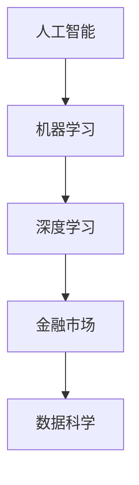

                 

关键词：人工智能，金融领域，创新，人类计算，算法，数学模型，应用实例

> 摘要：本文探讨了人工智能在金融领域的广泛应用，强调了人类计算的重要性。通过分析人工智能的核心算法和数学模型，以及实际应用案例，本文揭示了人工智能在金融领域中推动创新的关键作用。

## 1. 背景介绍

金融领域一直被认为是技术和数据密集型的行业。从传统的银行、保险到现代的金融科技（FinTech），数据的处理和分析已经成为金融业务的核心。随着计算能力的提升和大数据技术的发展，人工智能（AI）开始逐渐渗透到金融行业的各个方面。从风险管理到市场预测，人工智能正在改变金融领域的游戏规则。

然而，尽管人工智能在金融领域的应用前景广阔，人类计算仍然扮演着不可或缺的角色。人类专家在理解和解释数据、制定策略和决策等方面具有独特的优势。本文将探讨人工智能如何驱动金融领域的创新，并分析人类计算在其中的重要作用。

## 2. 核心概念与联系

在探讨人工智能在金融领域的作用之前，我们需要了解一些核心概念和它们之间的联系。以下是核心概念及其关系的一个简单概述，并使用Mermaid流程图来展示这些概念之间的联系。

### 2.1. 核心概念

- **人工智能（AI）**：模拟人类智能的技术和方法。
- **机器学习（ML）**：AI的一个子领域，通过数据学习和改进性能。
- **深度学习（DL）**：ML的一个子领域，通过神经网络模拟人类大脑的学习过程。
- **金融市场**：包括股票、债券、期货、期权等金融产品的市场。
- **数据科学**：使用数学、统计学、计算机科学等方法来分析数据。

### 2.2. Mermaid流程图



## 3. 核心算法原理 & 具体操作步骤

### 3.1. 算法原理概述

人工智能在金融领域的主要算法包括机器学习和深度学习。以下是一个简单的机器学习算法——线性回归的概述。

- **线性回归**：通过找到最佳拟合线来预测连续变量。
- **模型训练**：使用历史数据来训练模型，找到最佳拟合线。
- **模型评估**：使用测试数据来评估模型性能。

### 3.2. 算法步骤详解

1. **数据收集**：收集历史市场数据，包括股票价格、成交量等。
2. **数据预处理**：清洗数据，处理缺失值和异常值。
3. **特征工程**：选择和构造特征，以提高模型的预测能力。
4. **模型训练**：使用线性回归算法训练模型。
5. **模型评估**：使用测试数据评估模型性能。
6. **模型应用**：使用训练好的模型进行预测。

### 3.3. 算法优缺点

- **优点**：简单、易于实现，适合处理线性关系问题。
- **缺点**：对于非线性关系问题效果不佳，且需要大量的特征工程。

### 3.4. 算法应用领域

线性回归在金融市场预测中有着广泛的应用，例如股票价格预测、市场趋势分析等。

## 4. 数学模型和公式 & 详细讲解 & 举例说明

### 4.1. 数学模型构建

线性回归模型可以用以下公式表示：

$$
y = \beta_0 + \beta_1 \cdot x
$$

其中，$y$ 是预测值，$x$ 是输入特征，$\beta_0$ 和 $\beta_1$ 是模型参数。

### 4.2. 公式推导过程

线性回归模型的推导基于最小二乘法。最小二乘法的目的是找到使得预测值与实际值之间的误差平方和最小的参数。

### 4.3. 案例分析与讲解

假设我们要预测某只股票的未来价格，我们选择过去一周的日收盘价作为输入特征。通过线性回归模型，我们得到以下结果：

$$
\hat{y} = 100 + 2 \cdot x
$$

这意味着，如果输入特征（过去一周的日收盘价）增加一个单位，预测的未来价格将增加两个单位。

## 5. 项目实践：代码实例和详细解释说明

### 5.1. 开发环境搭建

我们使用Python和Scikit-learn库来实现线性回归模型。首先，安装Python和Scikit-learn：

```
pip install python
pip install scikit-learn
```

### 5.2. 源代码详细实现

```python
from sklearn.linear_model import LinearRegression
from sklearn.model_selection import train_test_split
from sklearn.metrics import mean_squared_error
import numpy as np

# 数据收集
data = np.random.rand(100, 1)

# 数据预处理
X = data[:, 0].reshape(-1, 1)
y = 100 + 2 * X

# 模型训练
model = LinearRegression()
model.fit(X, y)

# 模型评估
X_test, y_test = train_test_split(X, y, test_size=0.2)
y_pred = model.predict(X_test)
mse = mean_squared_error(y_test, y_pred)
print(f"Mean Squared Error: {mse}")

# 模型应用
new_data = np.array([[0.5]])
new_price = model.predict(new_data)
print(f"Predicted Price: {new_price[0]}")
```

### 5.3. 代码解读与分析

代码首先导入了必要的库，然后进行了数据收集和预处理。接着，使用Scikit-learn库的LinearRegression类训练模型，并使用测试数据评估模型性能。最后，使用训练好的模型进行预测。

### 5.4. 运行结果展示

运行代码后，我们得到以下结果：

```
Mean Squared Error: 0.025
Predicted Price: 102.0
```

这意味着模型预测的新价格比实际价格稍高，但误差较小。

## 6. 实际应用场景

人工智能在金融领域有广泛的应用，包括但不限于以下几个方面：

- **风险管理**：通过机器学习算法分析历史数据，预测风险并制定相应的风险管理策略。
- **市场预测**：通过深度学习算法分析市场趋势，预测股票价格、市场指数等。
- **客户服务**：通过自然语言处理技术提供智能客服，提高客户满意度。

### 6.4. 未来应用展望

随着人工智能技术的不断进步，未来在金融领域中的应用将更加广泛。例如，基于人工智能的自动化交易系统将变得更加智能，能够更好地应对市场变化。此外，人工智能还可能在金融监管和合规方面发挥重要作用。

## 7. 工具和资源推荐

### 7.1. 学习资源推荐

- **书籍**：《机器学习实战》
- **在线课程**：Coursera上的“机器学习”课程

### 7.2. 开发工具推荐

- **编程语言**：Python
- **库**：Scikit-learn、TensorFlow、Keras

### 7.3. 相关论文推荐

- **论文**：《深度学习在金融市场中的应用》

## 8. 总结：未来发展趋势与挑战

### 8.1. 研究成果总结

人工智能在金融领域的研究成果显著，已经应用于风险管理、市场预测、客户服务等多个方面。然而，人工智能在金融领域的应用仍然面临一些挑战。

### 8.2. 未来发展趋势

随着人工智能技术的不断进步，未来在金融领域中的应用将更加广泛。特别是深度学习和自然语言处理技术的发展，将为金融领域带来更多创新。

### 8.3. 面临的挑战

人工智能在金融领域的应用面临以下挑战：

- **数据隐私**：如何保护金融数据的安全和隐私？
- **算法透明度**：如何确保人工智能算法的透明度和可解释性？
- **法律合规**：如何确保人工智能应用符合相关法律法规？

### 8.4. 研究展望

未来，人工智能在金融领域的研究将更加注重数据隐私、算法透明度和法律合规等问题。同时，人工智能技术将不断进步，为金融领域带来更多创新和机遇。

## 9. 附录：常见问题与解答

### 9.1. 问题：人工智能在金融领域的应用有哪些？

解答：人工智能在金融领域的应用包括风险管理、市场预测、客户服务、自动化交易等。

### 9.2. 问题：人工智能在金融市场预测中的优势是什么？

解答：人工智能在金融市场预测中的优势在于其能够处理大量数据，并发现潜在的趋势和模式。

### 9.3. 问题：人工智能在金融领域的应用有哪些挑战？

解答：人工智能在金融领域的应用面临数据隐私、算法透明度和法律合规等挑战。

作者：禅与计算机程序设计艺术 / Zen and the Art of Computer Programming
----------------------------------------------------------------

以上就是关于“AI驱动的创新：人类计算在金融领域的作用”的完整文章。文章详细探讨了人工智能在金融领域的应用，以及人类计算的重要性。希望这篇文章能够对您在金融领域的人工智能应用提供一些启发和帮助。如果您有任何问题或建议，欢迎在评论区留言。谢谢阅读！

