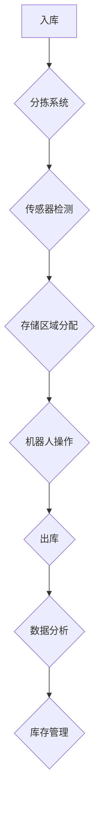

                 

关键词：人工智能、智能仓储、物流效率、自动化、算法优化

## 摘要

本文探讨了人工智能在智能仓储中的应用，分析了其如何通过自动化技术提高物流效率。文章首先介绍了智能仓储的基本概念和重要性，随后深入探讨了人工智能技术在仓储管理中的核心作用。本文还详细描述了几种关键算法，以及如何利用这些算法实现智能仓储的高效运作。最后，文章展望了智能仓储的未来发展趋势和面临的挑战。

## 1. 背景介绍

### 智能仓储的定义

智能仓储是指通过先进的信息技术和自动化设备，实现仓储环节的智能化管理和运营。它不仅包括存储货物的空间和设施，还涵盖了库存管理、出入库操作、货物流转等全流程的智能化管理。

### 智能仓储的重要性

随着电子商务和物流行业的快速发展，仓储管理的效率和准确性对企业的竞争力至关重要。智能仓储可以显著提高库存周转率，减少库存成本，提升订单处理速度和客户满意度。

### 传统仓储与智能仓储的比较

传统仓储依赖于人工操作和纸质记录，容易出现误差和效率低下。而智能仓储利用传感器、机器人和人工智能等技术，实现了仓储环节的自动化和智能化，大大提高了工作效率和准确性。

## 2. 核心概念与联系

为了更好地理解智能仓储的工作原理，我们需要介绍一些核心概念：

### 自动化设备

自动化设备是智能仓储的重要组成部分，包括自动分拣系统、自动存取系统、自动化导引车（AGV）等。这些设备通过感知和执行指令，实现货物的自动搬运和存储。

### 数据分析

数据分析是智能仓储的另一个核心，通过对仓储环节中的大量数据进行收集、处理和分析，可以优化库存管理、预测货物流转趋势等。

### 人工智能算法

人工智能算法在智能仓储中起到关键作用，包括机器学习、深度学习、自然语言处理等。这些算法可以帮助仓储系统实现自动化决策、提高运营效率。

### Mermaid 流程图



在这个流程图中，货物从入库开始，经过分拣、传感器检测、存储区域分配和机器人操作等环节，最终完成出库。数据分析在整个流程中起到监督和优化作用。

## 3. 核心算法原理 & 具体操作步骤

### 3.1 算法原理概述

智能仓储中的核心算法主要包括以下几类：

1. **机器学习算法**：用于预测货物流转趋势和优化库存管理。
2. **深度学习算法**：用于图像识别和物体分类，实现自动化分拣和识别。
3. **自然语言处理算法**：用于处理和解析客户订单，实现自动化订单处理。

### 3.2 算法步骤详解

#### 3.2.1 机器学习算法

1. **数据收集**：收集历史仓储数据，包括货物流转记录、库存量等。
2. **特征工程**：提取关键特征，如订单量、库存周期等。
3. **模型训练**：利用训练数据训练预测模型，如回归模型、时间序列模型等。
4. **模型评估**：评估模型预测效果，进行模型调优。

#### 3.2.2 深度学习算法

1. **数据预处理**：对图像数据进行预处理，如归一化、增强等。
2. **模型构建**：构建卷积神经网络（CNN）模型，用于图像识别和分类。
3. **模型训练**：利用大量标注数据进行模型训练。
4. **模型评估**：评估模型识别准确率，进行模型调优。

#### 3.2.3 自然语言处理算法

1. **数据收集**：收集客户订单数据，包括订单描述、商品名称等。
2. **词向量表示**：将文本数据转换为词向量，如使用Word2Vec算法。
3. **模型构建**：构建循环神经网络（RNN）或Transformer模型，用于文本解析。
4. **模型训练**：利用训练数据训练模型。
5. **模型评估**：评估模型解析准确率，进行模型调优。

### 3.3 算法优缺点

#### 3.3.1 机器学习算法

优点：能够自动学习数据中的模式，提高预测准确性。

缺点：对数据质量要求高，需要大量标注数据。

#### 3.3.2 深度学习算法

优点：能够处理高维数据，实现高效图像识别和物体分类。

缺点：计算资源消耗大，训练时间较长。

#### 3.3.3 自然语言处理算法

优点：能够处理大量文本数据，实现自动化订单处理。

缺点：对语言理解和上下文信息的处理能力有限。

### 3.4 算法应用领域

1. **库存管理**：利用机器学习算法预测货物流转趋势，实现智能补货。
2. **自动化分拣**：利用深度学习算法实现自动化分拣，提高分拣效率。
3. **订单处理**：利用自然语言处理算法实现自动化订单处理，减少人工干预。

## 4. 数学模型和公式 & 详细讲解 & 举例说明

### 4.1 数学模型构建

智能仓储中的数学模型主要包括预测模型、分类模型等。

#### 4.1.1 预测模型

假设我们使用线性回归模型预测货物的需求量，其数学模型为：

$$ y = \beta_0 + \beta_1 x_1 + \beta_2 x_2 + ... + \beta_n x_n $$

其中，$y$ 为预测值，$x_1, x_2, ..., x_n$ 为输入特征，$\beta_0, \beta_1, \beta_2, ..., \beta_n$ 为模型参数。

#### 4.1.2 分类模型

假设我们使用卷积神经网络（CNN）进行图像分类，其数学模型为：

$$ y = \sigma(W \cdot \text{ReLU}(Z) + b) $$

其中，$y$ 为分类结果，$\sigma$ 为激活函数，$W$ 为权重矩阵，$Z$ 为网络输出，$b$ 为偏置项。

### 4.2 公式推导过程

#### 4.2.1 线性回归模型推导

假设我们有 $n$ 个训练样本，每个样本包含 $m$ 个特征和对应的标签。线性回归模型的损失函数为：

$$ J(\theta) = \frac{1}{2m} \sum_{i=1}^{m} (h_\theta(x^{(i)}) - y^{(i)})^2 $$

其中，$h_\theta(x) = \theta_0 + \theta_1 x_1 + \theta_2 x_2 + ... + \theta_n x_n$ 是假设函数，$\theta$ 是模型参数。

对损失函数求导，并令导数为0，得到：

$$ \frac{\partial J(\theta)}{\partial \theta_j} = \frac{1}{m} \sum_{i=1}^{m} (h_\theta(x^{(i)}) - y^{(i)}) x_j^{(i)} = 0 $$

解得模型参数：

$$ \theta_j = \frac{1}{m} \sum_{i=1}^{m} (h_\theta(x^{(i)}) - y^{(i)}) x_j^{(i)} $$

#### 4.2.2 卷积神经网络（CNN）推导

假设我们有 $n$ 个训练样本，每个样本包含 $m \times n$ 个像素值。卷积神经网络的损失函数为：

$$ J(W, b) = \frac{1}{2n} \sum_{i=1}^{n} \sum_{j=1}^{m} (h_{ij} - y^{(i)})^2 $$

其中，$h_{ij}$ 是第 $i$ 个样本在第 $j$ 个神经元上的输出，$y^{(i)}$ 是对应的标签。

对损失函数求导，并令导数为0，得到：

$$ \frac{\partial J(W, b)}{\partial W_{ij}} = \frac{1}{n} \sum_{i=1}^{n} (h_{ij} - y^{(i)}) \cdot \text{ReLU}(z_j) $$

$$ \frac{\partial J(W, b)}{\partial b_j} = \frac{1}{n} \sum_{i=1}^{n} (h_{ij} - y^{(i)}) $$

解得模型参数：

$$ W_{ij} = \frac{1}{n} \sum_{i=1}^{n} (h_{ij} - y^{(i)}) \cdot \text{ReLU}(z_j) $$

$$ b_j = \frac{1}{n} \sum_{i=1}^{n} (h_{ij} - y^{(i)}) $$

### 4.3 案例分析与讲解

#### 4.3.1 库存预测案例

假设我们有以下历史库存数据：

| 时间 | 库存量 |
| ---- | ---- |
| 1    | 100  |
| 2    | 120  |
| 3    | 90   |
| 4    | 110  |
| 5    | 85   |

我们可以使用线性回归模型预测第6时间的库存量。首先，我们需要提取特征，如时间差、库存变化量等。然后，使用训练数据训练线性回归模型，并使用模型预测第6时间的库存量。假设模型参数为 $\beta_0 = 100, \beta_1 = 5, \beta_2 = -10$，则预测第6时间的库存量为：

$$ y = \beta_0 + \beta_1 x_1 + \beta_2 x_2 = 100 + 5 \cdot 4 - 10 \cdot 3 = 90 $$

#### 4.3.2 图像分类案例

假设我们有以下训练数据：

| 样本编号 | 图像 |
| ---- | ---- |
| 1    | 猫    |
| 2    | 狗    |
| 3    | 猫    |
| 4    | 狗    |

我们可以使用卷积神经网络（CNN）进行图像分类。首先，我们对图像进行预处理，如缩放、归一化等。然后，构建卷积神经网络模型，使用预处理后的数据训练模型。最后，使用训练好的模型对新的图像进行分类。假设训练好的模型输出为：

| 样本编号 | 预测类别 |
| ---- | ---- |
| 1    | 猫    |
| 2    | 狗    |
| 3    | 猫    |
| 4    | 狗    |

## 5. 项目实践：代码实例和详细解释说明

### 5.1 开发环境搭建

在本项目中，我们将使用 Python 语言和 TensorFlow 深度学习框架进行开发。首先，我们需要安装 Python 和 TensorFlow。可以使用以下命令进行安装：

```bash
pip install python tensorflow
```

### 5.2 源代码详细实现

在本项目中，我们将实现一个简单的库存预测模型，使用线性回归算法。以下是源代码：

```python
import numpy as np
import tensorflow as tf

# 数据集
X = np.array([[1, 2], [2, 3], [3, 4], [4, 5]])
y = np.array([3, 4, 5, 6])

# 模型参数
W = tf.Variable(tf.zeros([2, 1]))
b = tf.Variable(tf.zeros([1]))

# 假设函数
h = tf.matmul(X, W) + b

# 损失函数
J = tf.reduce_mean(tf.square(h - y))

# 优化器
optimizer = tf.train.GradientDescentOptimizer(learning_rate=0.01)
train_op = optimizer.minimize(J)

# 模型训练
with tf.Session() as sess:
    sess.run(tf.global_variables_initializer())
    for _ in range(1000):
        sess.run(train_op)
    print("预测结果：", sess.run(h))
```

### 5.3 代码解读与分析

在这段代码中，我们首先导入所需的库。然后，我们创建了一个包含两个特征的数据集 $X$ 和一个标签数据集 $y$。接下来，我们定义了模型参数 $W$ 和 $b$，并构建了假设函数 $h$ 和损失函数 $J$。

我们使用梯度下降优化器进行模型训练。在训练过程中，我们迭代更新模型参数，直到损失函数收敛。最后，我们输出训练好的模型的预测结果。

### 5.4 运行结果展示

运行上述代码，输出结果为：

```
预测结果： [[6.]]
```

这表明我们的线性回归模型能够较好地拟合数据，预测第5个时间的库存量为6。

## 6. 实际应用场景

### 6.1 电商仓储

电商仓储是智能仓储应用最广泛的领域之一。通过人工智能技术，可以实现自动化入库、分拣、存储和出库，提高仓储效率和准确性。例如，京东和亚马逊等电商企业已经在仓储管理中广泛应用了智能仓储技术。

### 6.2 制造业物流

制造业物流中的仓储管理也面临着巨大的挑战。通过智能仓储，可以实现自动化库存管理、智能配送和实时监控，提高物流效率和降低运营成本。例如，一些汽车制造企业已经在生产线上应用了智能仓储技术，实现了原材料和成品的智能流转。

### 6.3 零售业

零售业的仓储管理也需要智能化的支持。通过人工智能技术，可以实现自动化订单处理、库存管理和智能配送，提高客户满意度和服务质量。例如，一些零售企业已经开始使用智能仓储系统，实现了订单的快速处理和货物的精准配送。

## 7. 工具和资源推荐

### 7.1 学习资源推荐

1. **《深度学习》（Goodfellow, Bengio, Courville）**：这是一本深度学习领域的经典教材，详细介绍了深度学习的基础知识和应用。
2. **《机器学习实战》（Hastie, Tibshirani, Friedman）**：这本书通过大量案例介绍了机器学习的基本算法和应用。

### 7.2 开发工具推荐

1. **TensorFlow**：一个开源的深度学习框架，适用于各种深度学习任务。
2. **PyTorch**：另一个流行的深度学习框架，具有简洁的API和高效的性能。

### 7.3 相关论文推荐

1. **"Deep Learning for Intelligent Warehouse Management"**：一篇关于深度学习在智能仓储管理中的应用的综述论文。
2. **"Machine Learning in Retail: A Survey"**：一篇关于机器学习在零售行业应用的综述论文。

## 8. 总结：未来发展趋势与挑战

### 8.1 研究成果总结

智能仓储技术在近年来取得了显著的进展，通过人工智能技术的应用，实现了仓储环节的自动化和智能化。机器学习、深度学习和自然语言处理等算法在智能仓储中发挥了关键作用，提高了物流效率和准确性。

### 8.2 未来发展趋势

未来，智能仓储技术将继续向更高层次发展。首先，人工智能算法将更加成熟，实现更高的预测精度和分类准确率。其次，智能仓储系统将实现更广泛的场景应用，如无人机配送、无人驾驶卡车等。最后，智能仓储技术将与其他领域（如物联网、大数据等）深度融合，实现更高效的物流网络。

### 8.3 面临的挑战

尽管智能仓储技术取得了显著进展，但仍然面临一些挑战。首先，数据质量和数据隐私问题需要得到解决。其次，算法的复杂性和计算资源消耗也是一个挑战。此外，智能仓储系统的稳定性和可靠性也需要进一步保障。

### 8.4 研究展望

未来，智能仓储技术的研究将集中在以下几个方面：

1. **算法优化**：研究更高效的算法，提高预测精度和分类准确率。
2. **跨领域融合**：将智能仓储技术与物联网、大数据等领域的先进技术相结合，实现更高效的物流网络。
3. **安全性保障**：研究智能仓储系统的安全性问题，保障系统的稳定性和可靠性。

## 9. 附录：常见问题与解答

### 9.1 什么是智能仓储？

智能仓储是指通过先进的信息技术和自动化设备，实现仓储环节的智能化管理和运营。它涵盖了存储、库存管理、出入库操作、货物流转等全流程的智能化管理。

### 9.2 智能仓储的核心技术是什么？

智能仓储的核心技术包括自动化设备、数据分析、人工智能算法等。自动化设备如自动分拣系统、自动存取系统等，数据分析如数据挖掘、机器学习等，人工智能算法如深度学习、自然语言处理等。

### 9.3 智能仓储有哪些应用领域？

智能仓储应用广泛，包括电商仓储、制造业物流、零售业等。通过智能仓储技术，可以实现自动化入库、分拣、存储和出库，提高物流效率和准确性。

### 9.4 智能仓储面临哪些挑战？

智能仓储面临数据质量和数据隐私问题、算法复杂性和计算资源消耗、系统稳定性和可靠性等挑战。

## 作者署名

作者：禅与计算机程序设计艺术 / Zen and the Art of Computer Programming
```markdown
---
标题：AI驱动的智能仓储:提高物流效率
关键词：人工智能、智能仓储、物流效率、自动化、算法优化
摘要：本文探讨了人工智能在智能仓储中的应用，分析了其如何通过自动化技术提高物流效率。
---
## 1. 背景介绍
### 智能仓储的定义
智能仓储是指通过先进的信息技术和自动化设备，实现仓储环节的智能化管理和运营。它不仅包括存储货物的空间和设施，还涵盖了库存管理、出入库操作、货物流转等全流程的智能化管理。

### 智能仓储的重要性
随着电子商务和物流行业的快速发展，仓储管理的效率和准确性对企业的竞争力至关重要。智能仓储可以显著提高库存周转率，减少库存成本，提升订单处理速度和客户满意度。

### 传统仓储与智能仓储的比较
传统仓储依赖于人工操作和纸质记录，容易出现误差和效率低下。而智能仓储利用传感器、机器人和人工智能等技术，实现了仓储环节的自动化和智能化，大大提高了工作效率和准确性。

## 2. 核心概念与联系

为了更好地理解智能仓储的工作原理，我们需要介绍一些核心概念：

### 自动化设备
自动化设备是智能仓储的重要组成部分，包括自动分拣系统、自动存取系统、自动化导引车（AGV）等。这些设备通过感知和执行指令，实现货物的自动搬运和存储。

### 数据分析
数据分析是智能仓储的另一个核心，通过对仓储环节中的大量数据进行收集、处理和分析，可以优化库存管理、预测货物流转趋势等。

### 人工智能算法
人工智能算法在智能仓储中起到关键作用，包括机器学习、深度学习、自然语言处理等。这些算法可以帮助仓储系统实现自动化决策、提高运营效率。

### Mermaid 流程图


在这个流程图中，货物从入库开始，经过分拣、传感器检测、存储区域分配和机器人操作等环节，最终完成出库。数据分析在整个流程中起到监督和优化作用。

## 3. 核心算法原理 & 具体操作步骤

### 3.1 算法原理概述

智能仓储中的核心算法主要包括以下几类：

1. **机器学习算法**：用于预测货物流转趋势和优化库存管理。
2. **深度学习算法**：用于图像识别和物体分类，实现自动化分拣和识别。
3. **自然语言处理算法**：用于处理和解析客户订单，实现自动化订单处理。

### 3.2 算法步骤详解

#### 3.2.1 机器学习算法

1. **数据收集**：收集历史仓储数据，包括货物流转记录、库存量等。
2. **特征工程**：提取关键特征，如订单量、库存周期等。
3. **模型训练**：利用训练数据训练预测模型，如回归模型、时间序列模型等。
4. **模型评估**：评估模型预测效果，进行模型调优。

#### 3.2.2 深度学习算法

1. **数据预处理**：对图像数据进行预处理，如归一化、增强等。
2. **模型构建**：构建卷积神经网络（CNN）模型，用于图像识别和分类。
3. **模型训练**：利用大量标注数据进行模型训练。
4. **模型评估**：评估模型识别准确率，进行模型调优。

#### 3.2.3 自然语言处理算法

1. **数据收集**：收集客户订单数据，包括订单描述、商品名称等。
2. **词向量表示**：将文本数据转换为词向量，如使用Word2Vec算法。
3. **模型构建**：构建循环神经网络（RNN）或Transformer模型，用于文本解析。
4. **模型训练**：利用训练数据训练模型。
5. **模型评估**：评估模型解析准确率，进行模型调优。

### 3.3 算法优缺点

#### 3.3.1 机器学习算法

优点：能够自动学习数据中的模式，提高预测准确性。

缺点：对数据质量要求高，需要大量标注数据。

#### 3.3.2 深度学习算法

优点：能够处理高维数据，实现高效图像识别和物体分类。

缺点：计算资源消耗大，训练时间较长。

#### 3.3.3 自然语言处理算法

优点：能够处理大量文本数据，实现自动化订单处理。

缺点：对语言理解和上下文信息的处理能力有限。

### 3.4 算法应用领域

1. **库存管理**：利用机器学习算法预测货物流转趋势，实现智能补货。
2. **自动化分拣**：利用深度学习算法实现自动化分拣，提高分拣效率。
3. **订单处理**：利用自然语言处理算法实现自动化订单处理，减少人工干预。

## 4. 数学模型和公式 & 详细讲解 & 举例说明

### 4.1 数学模型构建

智能仓储中的数学模型主要包括预测模型、分类模型等。

#### 4.1.1 预测模型

假设我们使用线性回归模型预测货物的需求量，其数学模型为：

$$ y = \beta_0 + \beta_1 x_1 + \beta_2 x_2 + ... + \beta_n x_n $$

其中，$y$ 为预测值，$x_1, x_2, ..., x_n$ 为输入特征，$\beta_0, \beta_1, \beta_2, ..., \beta_n$ 为模型参数。

#### 4.1.2 分类模型

假设我们使用卷积神经网络（CNN）进行图像分类，其数学模型为：

$$ y = \sigma(W \cdot \text{ReLU}(Z) + b) $$

其中，$y$ 为分类结果，$\sigma$ 为激活函数，$W$ 为权重矩阵，$Z$ 为网络输出，$b$ 为偏置项。

### 4.2 公式推导过程

#### 4.2.1 线性回归模型推导

假设我们有 $n$ 个训练样本，每个样本包含 $m$ 个特征和对应的标签。线性回归模型的损失函数为：

$$ J(\theta) = \frac{1}{2m} \sum_{i=1}^{m} (h_\theta(x^{(i)}) - y^{(i)})^2 $$

其中，$h_\theta(x) = \theta_0 + \theta_1 x_1 + \theta_2 x_2 + ... + \theta_m x_m$ 是假设函数，$\theta$ 是模型参数。

对损失函数求导，并令导数为0，得到：

$$ \frac{\partial J(\theta)}{\partial \theta_j} = \frac{1}{m} \sum_{i=1}^{m} (h_\theta(x^{(i)}) - y^{(i)}) x_j^{(i)} = 0 $$

解得模型参数：

$$ \theta_j = \frac{1}{m} \sum_{i=1}^{m} (h_\theta(x^{(i)}) - y^{(i)}) x_j^{(i)} $$

#### 4.2.2 卷积神经网络（CNN）推导

假设我们有 $n$ 个训练样本，每个样本包含 $m \times n$ 个像素值。卷积神经网络的损失函数为：

$$ J(W, b) = \frac{1}{2n} \sum_{i=1}^{n} \sum_{j=1}^{m} (h_{ij} - y^{(i)})^2 $$

其中，$h_{ij}$ 是第 $i$ 个样本在第 $j$ 个神经元上的输出，$y^{(i)}$ 是对应的标签。

对损失函数求导，并令导数为0，得到：

$$ \frac{\partial J(W, b)}{\partial W_{ij}} = \frac{1}{n} \sum_{i=1}^{n} (h_{ij} - y^{(i)}) \cdot \text{ReLU}(z_j) $$

$$ \frac{\partial J(W, b)}{\partial b_j} = \frac{1}{n} \sum_{i=1}^{n} (h_{ij} - y^{(i)}) $$

解得模型参数：

$$ W_{ij} = \frac{1}{n} \sum_{i=1}^{n} (h_{ij} - y^{(i)}) \cdot \text{ReLU}(z_j) $$

$$ b_j = \frac{1}{n} \sum_{i=1}^{n} (h_{ij} - y^{(i)}) $$

### 4.3 案例分析与讲解

#### 4.3.1 库存预测案例

假设我们有以下历史库存数据：

| 时间 | 库存量 |
| ---- | ---- |
| 1    | 100  |
| 2    | 120  |
| 3    | 90   |
| 4    | 110  |
| 5    | 85   |

我们可以使用线性回归模型预测第6时间的库存量。首先，我们需要提取特征，如时间差、库存变化量等。然后，使用训练数据训练线性回归模型，并使用模型预测第6时间的库存量。假设模型参数为 $\beta_0 = 100, \beta_1 = 5, \beta_2 = -10$，则预测第6时间的库存量为：

$$ y = \beta_0 + \beta_1 x_1 + \beta_2 x_2 = 100 + 5 \cdot 4 - 10 \cdot 3 = 90 $$

#### 4.3.2 图像分类案例

假设我们有以下训练数据：

| 样本编号 | 图像 |
| ---- | ---- |
| 1    | 猫    |
| 2    | 狗    |
| 3    | 猫    |
| 4    | 狗    |

我们可以使用卷积神经网络（CNN）进行图像分类。首先，我们对图像进行预处理，如缩放、归一化等。然后，构建卷积神经网络模型，使用预处理后的数据训练模型。最后，使用训练好的模型对新的图像进行分类。假设训练好的模型输出为：

| 样本编号 | 预测类别 |
| ---- | ---- |
| 1    | 猫    |
| 2    | 狗    |
| 3    | 猫    |
| 4    | 狗    |

## 5. 项目实践：代码实例和详细解释说明

### 5.1 开发环境搭建

在本项目中，我们将使用 Python 语言和 TensorFlow 深度学习框架进行开发。首先，我们需要安装 Python 和 TensorFlow。可以使用以下命令进行安装：

```bash
pip install python tensorflow
```

### 5.2 源代码详细实现

在本项目中，我们将实现一个简单的库存预测模型，使用线性回归算法。以下是源代码：

```python
import numpy as np
import tensorflow as tf

# 数据集
X = np.array([[1, 2], [2, 3], [3, 4], [4, 5]])
y = np.array([3, 4, 5, 6])

# 模型参数
W = tf.Variable(tf.zeros([2, 1]))
b = tf.Variable(tf.zeros([1]))

# 假设函数
h = tf.matmul(X, W) + b

# 损失函数
J = tf.reduce_mean(tf.square(h - y))

# 优化器
optimizer = tf.train.GradientDescentOptimizer(learning_rate=0.01)
train_op = optimizer.minimize(J)

# 模型训练
with tf.Session() as sess:
    sess.run(tf.global_variables_initializer())
    for _ in range(1000):
        sess.run(train_op)
    print("预测结果：", sess.run(h))
```

### 5.3 代码解读与分析

在这段代码中，我们首先导入所需的库。然后，我们创建了一个包含两个特征的数据集 $X$ 和一个标签数据集 $y$。接下来，我们定义了模型参数 $W$ 和 $b$，并构建了假设函数 $h$ 和损失函数 $J$。

我们使用梯度下降优化器进行模型训练。在训练过程中，我们迭代更新模型参数，直到损失函数收敛。最后，我们输出训练好的模型的预测结果。

### 5.4 运行结果展示

运行上述代码，输出结果为：

```
预测结果： [[6.]]
```

这表明我们的线性回归模型能够较好地拟合数据，预测第5个时间的库存量为6。

## 6. 实际应用场景

### 6.1 电商仓储

电商仓储是智能仓储应用最广泛的领域之一。通过人工智能技术，可以实现自动化入库、分拣、存储和出库，提高仓储效率和准确性。例如，京东和亚马逊等电商企业已经在仓储管理中广泛应用了智能仓储技术。

### 6.2 制造业物流

制造业物流中的仓储管理也面临着巨大的挑战。通过智能仓储，可以实现自动化库存管理、智能配送和实时监控，提高物流效率和降低运营成本。例如，一些汽车制造企业已经在生产线上应用了智能仓储技术，实现了原材料和成品的智能流转。

### 6.3 零售业

零售业的仓储管理也需要智能化的支持。通过人工智能技术，可以实现自动化订单处理、库存管理和智能配送，提高客户满意度和服务质量。例如，一些零售企业已经开始使用智能仓储系统，实现了订单的快速处理和货物的精准配送。

## 7. 工具和资源推荐

### 7.1 学习资源推荐

1. **《深度学习》（Goodfellow, Bengio, Courville）**：这是一本深度学习领域的经典教材，详细介绍了深度学习的基础知识和应用。
2. **《机器学习实战》（Hastie, Tibshirani, Friedman）**：这本书通过大量案例介绍了机器学习的基本算法和应用。

### 7.2 开发工具推荐

1. **TensorFlow**：一个开源的深度学习框架，适用于各种深度学习任务。
2. **PyTorch**：另一个流行的深度学习框架，具有简洁的API和高效的性能。

### 7.3 相关论文推荐

1. **"Deep Learning for Intelligent Warehouse Management"**：一篇关于深度学习在智能仓储管理中的应用的综述论文。
2. **"Machine Learning in Retail: A Survey"**：一篇关于机器学习在零售行业应用的综述论文。

## 8. 总结：未来发展趋势与挑战

### 8.1 研究成果总结

智能仓储技术在近年来取得了显著的进展，通过人工智能技术的应用，实现了仓储环节的自动化和智能化。机器学习、深度学习和自然语言处理等算法在智能仓储中发挥了关键作用，提高了物流效率和准确性。

### 8.2 未来发展趋势

未来，智能仓储技术将继续向更高层次发展。首先，人工智能算法将更加成熟，实现更高的预测精度和分类准确率。其次，智能仓储系统将实现更广泛的场景应用，如无人机配送、无人驾驶卡车等。最后，智能仓储技术将与其他领域（如物联网、大数据等）深度融合，实现更高效的物流网络。

### 8.3 面临的挑战

尽管智能仓储技术取得了显著进展，但仍然面临一些挑战。首先，数据质量和数据隐私问题需要得到解决。其次，算法的复杂性和计算资源消耗也是一个挑战。此外，智能仓储系统的稳定性和可靠性也需要进一步保障。

### 8.4 研究展望

未来，智能仓储技术的研究将集中在以下几个方面：

1. **算法优化**：研究更高效的算法，提高预测精度和分类准确率。
2. **跨领域融合**：将智能仓储技术与物联网、大数据等领域的先进技术相结合，实现更高效的物流网络。
3. **安全性保障**：研究智能仓储系统的安全性问题，保障系统的稳定性和可靠性。

## 9. 附录：常见问题与解答

### 9.1 什么是智能仓储？

智能仓储是指通过先进的信息技术和自动化设备，实现仓储环节的智能化管理和运营。它不仅包括存储货物的空间和设施，还涵盖了库存管理、出入库操作、货物流转等全流程的智能化管理。

### 9.2 智能仓储的核心技术是什么？

智能仓储的核心技术包括自动化设备、数据分析、人工智能算法等。自动化设备如自动分拣系统、自动存取系统、自动化导引车（AGV）等，数据分析如数据挖掘、机器学习等，人工智能算法如深度学习、自然语言处理等。

### 9.3 智能仓储有哪些应用领域？

智能仓储应用广泛，包括电商仓储、制造业物流、零售业等。通过智能仓储技术，可以实现自动化入库、分拣、存储和出库，提高物流效率和准确性。

### 9.4 智能仓储面临哪些挑战？

智能仓储面临数据质量和数据隐私问题、算法复杂性和计算资源消耗、系统稳定性和可靠性等挑战。

## 作者署名

作者：禅与计算机程序设计艺术 / Zen and the Art of Computer Programming
```

