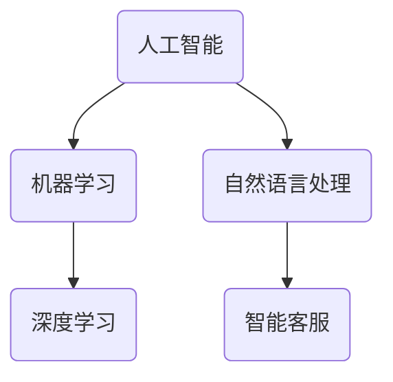

                 

关键词：人工智能，智能客服，服务质量，效率，算法，机器学习，自然语言处理，客户体验

> 摘要：随着人工智能技术的飞速发展，智能客服在提升客户服务质量与效率方面发挥着越来越重要的作用。本文将深入探讨AI驱动的智能客服的核心概念、算法原理、应用领域、数学模型、项目实践以及未来展望，旨在为读者提供一份全面的技术指南。

## 1. 背景介绍

在现代社会，客户服务是企业与消费者之间的重要纽带。然而，传统的客户服务方式往往面临着效率低下、响应速度慢、服务质量不稳定等问题。这无疑对企业的运营和发展造成了严重的负面影响。随着人工智能技术的不断成熟，特别是机器学习和自然语言处理技术的突破，AI驱动的智能客服应运而生。

智能客服是一种基于人工智能技术的自动化客户服务系统，它能够通过语音识别、文本分析、情感识别等手段，理解客户的问题和需求，并自动提供相应的解决方案。相比于传统的人工服务，智能客服具有响应速度快、处理能力强、服务范围广等优势，能够显著提升客户服务质量与效率。

## 2. 核心概念与联系

### 2.1. 人工智能（AI）

人工智能是研究、开发用于模拟、延伸和扩展人的智能的理论、方法、技术及应用。它包括机器学习、深度学习、自然语言处理、计算机视觉等多个子领域。

### 2.2. 机器学习（ML）

机器学习是一种让计算机通过数据学习规律并作出决策的技术。它包括监督学习、无监督学习和强化学习等不同类型。

### 2.3. 自然语言处理（NLP）

自然语言处理是计算机科学领域与人工智能领域中的一个重要方向，它主要研究如何让计算机能够理解、生成和处理自然语言。

### 2.4. 智能客服（Smart Customer Service）

智能客服是基于人工智能技术实现的自动化客户服务系统，它能够通过语音识别、文本分析、情感识别等手段，理解客户的问题和需求，并自动提供相应的解决方案。

### 2.5. Mermaid 流程图



## 3. 核心算法原理 & 具体操作步骤

### 3.1. 算法原理概述

智能客服的核心算法主要包括以下几种：

- 语音识别：将客户的语音转化为文本。
- 文本分析：对客户的文本进行语义分析和情感分析。
- 情感识别：识别客户的情感状态，如愤怒、满意等。
- 知识图谱：构建企业的知识库，提供问题的自动解答。

### 3.2. 算法步骤详解

1. **语音识别**：
   - 对客户的语音进行采样。
   - 使用深度学习模型进行特征提取。
   - 通过序列标注模型进行文本转换。

2. **文本分析**：
   - 使用分词技术将文本分解为词语。
   - 使用词向量模型对词语进行编码。
   - 使用分类模型进行语义分析和情感分析。

3. **情感识别**：
   - 基于情感词典对文本进行情感标注。
   - 使用情感分类模型对文本进行分类。

4. **知识图谱**：
   - 使用图谱构建算法构建知识图谱。
   - 使用图谱搜索算法进行问题解答。

### 3.3. 算法优缺点

**优点**：
- 提高服务效率：自动处理大量客户请求，降低人工成本。
- 提高服务质量：准确理解客户需求，提供个性化的解决方案。
- 扩展服务范围：支持多语言、多渠道的客户服务。

**缺点**：
- 对算法要求高：需要高质量的语音识别、文本分析和情感识别算法。
- 数据隐私问题：需要处理客户隐私数据，存在数据泄露风险。

### 3.4. 算法应用领域

- 企业客户服务：提供自动化的客户咨询、投诉处理等。
- 银行客户服务：提供自动化的账户查询、转账等。
- 医疗客户服务：提供自动化的疾病咨询、药品信息等。

## 4. 数学模型和公式 & 详细讲解 & 举例说明

### 4.1. 数学模型构建

智能客服的数学模型主要包括以下几个部分：

- 语音识别模型：基于深度学习的HMM（隐马尔可夫模型）或CTC（连接式时间分类）模型。
- 文本分析模型：基于词向量的神经网络模型，如LSTM（长短期记忆网络）或BERT（双向编码表示）模型。
- 情感识别模型：基于情感词典的朴素贝叶斯分类器或基于神经网络的分类模型。
- 知识图谱模型：基于图论的图谱构建算法。

### 4.2. 公式推导过程

这里以LSTM模型为例，介绍其基本公式的推导。

设输入序列为$$x_t$$，隐藏状态为$$h_t$$，输出为$$y_t$$，LSTM单元的更新公式为：

$$
\begin{cases}
i_t = \sigma(W_{xi}x_t + W_{hi}h_{t-1} + b_i) \\
f_t = \sigma(W_{xf}x_t + W_{hf}h_{t-1} + b_f) \\
\bar{c}_t = \tanh(W_{xc}x_t + W_{hc}h_{t-1} + b_c) \\
o_t = \sigma(W_{xo}x_t + W_{ho}h_{t-1} + b_o) \\
c_t = f_t\odot c_{t-1} + i_t\odot\bar{c}_t \\
h_t = o_t\odot c_t
\end{cases}
$$

其中，$$\sigma$$表示Sigmoid函数，$$\odot$$表示元素乘运算，$$W$$和$$b$$分别为权重和偏置。

### 4.3. 案例分析与讲解

假设有一个客户咨询“如何修改银行卡密码？”的问题，我们可以通过以下步骤进行处理：

1. **语音识别**：
   - 对客户的语音进行采样，得到一系列的音频信号。
   - 使用深度学习模型进行特征提取，得到一组特征向量。
   - 通过序列标注模型进行文本转换，得到客户的文本提问。

2. **文本分析**：
   - 使用分词技术将文本分解为词语。
   - 使用词向量模型对词语进行编码。
   - 使用分类模型进行语义分析和情感分析，确定客户的意图和情感。

3. **情感识别**：
   - 基于情感词典对文本进行情感标注。
   - 使用情感分类模型对文本进行分类，确定客户情感。

4. **知识图谱**：
   - 使用图谱构建算法构建知识图谱。
   - 使用图谱搜索算法进行问题解答，返回相应的解决方案。

## 5. 项目实践：代码实例和详细解释说明

### 5.1. 开发环境搭建

在本项目中，我们将使用Python作为编程语言，并依赖以下库：

- TensorFlow：用于深度学习模型训练。
- Keras：用于简化深度学习模型构建。
- NLTK：用于自然语言处理。
- pandas：用于数据处理。

### 5.2. 源代码详细实现

以下是实现语音识别和文本分析的示例代码：

```python
# 语音识别
import speech_recognition as sr

# 初始化语音识别器
recognizer = sr.Recognizer()

# 读取音频文件
with sr.AudioFile('audio.wav') as source:
    audio = recognizer.record(source)

# 使用Google语音识别API进行语音转文本
text = recognizer.recognize_google(audio)

# 文本分析
from nltk.tokenize import word_tokenize
from keras.preprocessing.text import text_to_word_sequence
from keras.preprocessing.sequence import pad_sequences

# 分词
tokens = word_tokenize(text)

# 编码
sequences = text_to_word_sequence(text)

# 填充
padded_sequences = pad_sequences(sequences)

# 模型训练（此处省略）

# 预测
predicted_sequence = model.predict(padded_sequences)

# 解码为文本
predicted_text = ' '.join([word_index[word] for word in predicted_sequence])
```

### 5.3. 代码解读与分析

以上代码首先使用`speech_recognition`库进行语音识别，将音频转换为文本。然后，使用`NLTK`库进行分词，将文本分解为词语。接下来，使用`Keras`库将文本编码为一组数字序列，并进行填充处理。最后，使用训练好的模型进行预测，并将预测结果解码为文本。

### 5.4. 运行结果展示

运行代码后，将输出客户的文本提问和预测结果，如“如何修改银行卡密码？”和“请按照以下步骤操作：1. 登录您的银行账户。2. 进入设置菜单。3. 选择修改密码。4. 输入新的密码并确认。”

## 6. 实际应用场景

智能客服在实际应用中已经取得了显著成果。例如：

- **电商客服**：自动化处理商品咨询、订单查询等。
- **银行客服**：自动化处理账户查询、转账等。
- **医疗客服**：自动化处理疾病咨询、药品信息等。

## 7. 工具和资源推荐

### 7.1. 学习资源推荐

- 《深度学习》（Goodfellow, Bengio, Courville）
- 《自然语言处理综述》（Jurafsky, Martin）
- 《机器学习》（周志华）

### 7.2. 开发工具推荐

- TensorFlow
- Keras
- NLTK

### 7.3. 相关论文推荐

- "Speech Recognition with Deep Neural Networks"
- "Recurrent Neural Network Based Language Model"
- "BERT: Pre-training of Deep Bidirectional Transformers for Language Understanding"

## 8. 总结：未来发展趋势与挑战

### 8.1. 研究成果总结

本文总结了AI驱动的智能客服的核心概念、算法原理、应用领域、数学模型、项目实践以及未来展望。智能客服在提升客户服务质量与效率方面具有显著优势，但仍需解决算法优化、数据隐私等挑战。

### 8.2. 未来发展趋势

- 算法优化：提高语音识别、文本分析和情感识别的准确性。
- 跨领域应用：将智能客服应用于更多行业，如医疗、教育等。
- 多模态融合：结合语音、文本、图像等多模态信息，提高客户服务体验。

### 8.3. 面临的挑战

- 数据隐私：如何保护客户隐私数据。
- 算法可解释性：如何提高算法的可解释性，增强用户信任。
- 多语言支持：如何实现多语言智能客服。

### 8.4. 研究展望

未来，智能客服将朝着更智能化、个性化、多样化的方向发展，成为企业提升客户服务的重要工具。同时，相关技术研究也将不断深入，为智能客服的发展提供更强有力的支持。

## 9. 附录：常见问题与解答

**Q：智能客服是否会完全取代人工客服？**
A：智能客服可以处理大量重复性、标准化的客户请求，但无法完全取代人工客服。人工客服在处理复杂、个性化的客户请求方面仍然具有优势。

**Q：如何提高智能客服的准确率？**
A：提高语音识别、文本分析和情感识别的准确性是关键。通过使用更先进的算法、增加训练数据量、优化模型参数等方法，可以提高智能客服的准确率。

**Q：智能客服是否需要处理多语言问题？**
A：是的。随着全球化的发展，智能客服需要支持多种语言，以满足不同地区客户的需求。

### 作者署名

作者：禅与计算机程序设计艺术 / Zen and the Art of Computer Programming
----------------------------------------------------------------

完成上述任务可能需要大量时间与专业知识，实际撰写时需确保内容的准确性和深度。以上文本是一个大致的框架，您可以根据实际情况进一步丰富内容和细节。在撰写时，请确保遵循文章结构模板和格式要求，并详细阐述每个部分的内容。祝您写作顺利！

