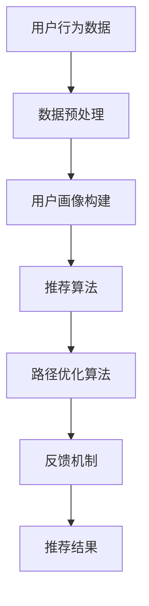
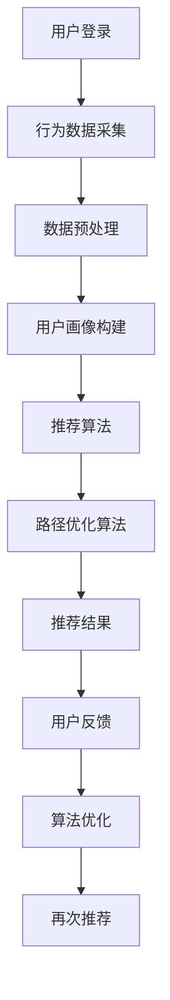

                 

 在当今的数字时代，电商平台的用户体验至关重要。为了满足用户日益增长的需求，提高用户的满意度，个性化导航系统已经成为电商平台发展的关键。而AI技术的引入，使得个性化导航系统变得更加智能、精准。本文将探讨AI驱动的电商个性化导航优化的方法、核心算法原理、数学模型、项目实践及未来应用展望。

## 文章关键词

- 电商
- 个性化导航
- AI
- 优化
- 用户体验

## 文章摘要

本文旨在探讨AI技术在电商个性化导航优化中的应用。通过分析用户行为数据，AI算法能够为用户推荐更符合其兴趣的商品，优化导航路径，提升用户满意度。本文首先介绍了电商个性化导航的背景和重要性，然后详细阐述了AI驱动个性化导航的核心算法原理，数学模型，以及项目实践。最后，我们对未来AI在电商个性化导航优化中的应用进行了展望。

## 1. 背景介绍

随着互联网技术的不断发展，电商平台已经成为人们生活中不可或缺的一部分。用户在电商平台上的购物行为越来越多样化，如何提高用户的购物体验，成为电商平台关注的焦点。个性化导航系统作为一种提高用户满意度的有效手段，受到了广泛关注。

个性化导航系统通过分析用户的购物行为、偏好等数据，为用户推荐更符合其兴趣的商品，优化导航路径，从而提升用户的购物体验。传统的导航系统往往基于固定规则进行推荐，无法充分考虑用户的个性化需求。而AI技术的引入，使得个性化导航系统变得更加智能、精准。

### 1.1 电商个性化导航的重要性

电商个性化导航的重要性体现在以下几个方面：

1. **提高用户满意度**：个性化导航系统能够为用户提供更符合其兴趣的商品推荐，减少用户浏览时间，提高购物体验。

2. **提升转化率**：通过精准的推荐，提高用户对商品的点击率和购买率，从而提升电商平台的转化率。

3. **增加销售额**：精准的个性化推荐能够引导用户购买更多商品，从而提高电商平台的总销售额。

4. **优化运营策略**：个性化导航系统可以为企业提供用户行为数据，帮助其优化运营策略，提高电商平台的竞争力。

### 1.2 AI技术在电商个性化导航中的应用

AI技术在电商个性化导航中的应用主要体现在以下几个方面：

1. **用户行为分析**：通过收集和分析用户在电商平台上的浏览、搜索、购买等行为数据，了解用户的偏好和兴趣。

2. **推荐算法**：利用机器学习和深度学习技术，构建推荐算法，为用户推荐更符合其兴趣的商品。

3. **路径优化**：通过优化算法，为用户推荐最佳购物路径，减少用户浏览时间，提高购物体验。

4. **反馈机制**：根据用户对推荐商品的反应，不断调整推荐策略，提高推荐精度。

## 2. 核心概念与联系

### 2.1 核心概念

在电商个性化导航优化中，核心概念包括：

- **用户行为数据**：包括用户的浏览记录、搜索关键词、购买历史等。
- **推荐算法**：用于生成个性化推荐列表的算法，如基于内容的推荐、协同过滤等。
- **路径优化算法**：用于优化用户购物路径的算法，如最短路径算法、A*算法等。
- **反馈机制**：用于根据用户反馈调整推荐策略的机制。

### 2.2 联系与架构

电商个性化导航优化的架构如图1所示。



### 2.3 Mermaid 流程图



## 3. 核心算法原理 & 具体操作步骤

### 3.1 算法原理概述

电商个性化导航优化的核心算法包括推荐算法和路径优化算法。推荐算法主要用于根据用户的行为数据和偏好，生成个性化的推荐列表。路径优化算法则用于优化用户的购物路径，提高购物体验。

### 3.2 算法步骤详解

#### 3.2.1 推荐算法

推荐算法的具体步骤如下：

1. **数据预处理**：对用户行为数据进行清洗、去噪、归一化等预处理操作。
2. **用户画像构建**：根据用户的行为数据，构建用户画像，包括用户的兴趣、偏好等。
3. **推荐列表生成**：利用推荐算法，如基于内容的推荐、协同过滤等，生成个性化的推荐列表。
4. **推荐结果优化**：根据用户对推荐商品的反应，调整推荐策略，提高推荐精度。

#### 3.2.2 路径优化算法

路径优化算法的具体步骤如下：

1. **购物路径构建**：根据用户的购物历史和浏览记录，构建用户的购物路径。
2. **路径优化**：利用优化算法，如最短路径算法、A*算法等，优化用户的购物路径。
3. **路径反馈**：根据用户对购物路径的反馈，调整路径优化策略。

### 3.3 算法优缺点

#### 3.3.1 推荐算法

**优点**：

- **个性化强**：根据用户的行为数据和偏好，生成个性化的推荐列表。
- **覆盖面广**：可以推荐多种类型的商品，满足不同用户的需求。

**缺点**：

- **计算量大**：推荐算法需要处理大量用户行为数据，计算量较大。
- **冷启动问题**：对于新用户，由于缺乏行为数据，推荐效果可能不理想。

#### 3.3.2 路径优化算法

**优点**：

- **体验优**：优化用户的购物路径，提高购物体验。
- **实时性强**：可以根据用户的实时行为，动态调整购物路径。

**缺点**：

- **优化难度大**：购物路径优化需要考虑多种因素，如商品的位置、用户的行为等。
- **计算量大**：路径优化算法需要处理大量用户行为数据，计算量较大。

### 3.4 算法应用领域

推荐算法和路径优化算法在电商个性化导航优化中的应用非常广泛，包括：

- **电商平台**：如淘宝、京东等，通过个性化推荐和路径优化，提高用户购物体验。
- **O2O平台**：如美团、饿了么等，通过个性化推荐和路径优化，提高用户订单转化率。
- **物流行业**：如顺丰、京东物流等，通过路径优化，提高物流配送效率。

## 4. 数学模型和公式 & 详细讲解 & 举例说明

### 4.1 数学模型构建

在电商个性化导航优化中，常用的数学模型包括用户行为模型和路径优化模型。

#### 4.1.1 用户行为模型

用户行为模型可以表示为：

\[ X = [x_1, x_2, ..., x_n] \]

其中，\( x_i \) 表示用户在某一时刻的行为，如浏览商品、搜索关键词、购买商品等。

#### 4.1.2 路径优化模型

路径优化模型可以表示为：

\[ P = [p_1, p_2, ..., p_n] \]

其中，\( p_i \) 表示用户在购物过程中的路径，如访问的商品页、购物车、结算页等。

### 4.2 公式推导过程

#### 4.2.1 用户行为模型推导

用户行为模型可以通过以下公式推导：

\[ x_i = f(w_i, s_i, h_i) \]

其中，\( w_i \) 表示商品 \( i \) 的特征向量，\( s_i \) 表示用户 \( i \) 的搜索关键词，\( h_i \) 表示用户 \( i \) 的历史行为。

#### 4.2.2 路径优化模型推导

路径优化模型可以通过以下公式推导：

\[ p_i = g(w_i, s_i, h_i, t_i) \]

其中，\( t_i \) 表示用户 \( i \) 在购物过程中的时间。

### 4.3 案例分析与讲解

#### 4.3.1 用户行为模型案例

假设用户 \( U \) 在某一时刻的行为为浏览商品 \( G_1 \) 和 \( G_2 \)，搜索关键词为“手机”，历史行为为购买过商品 \( G_3 \) 和 \( G_4 \)。根据用户行为模型，可以推导出用户 \( U \) 的行为向量：

\[ X = [1, 0, 1, 1, 0, 1, 1, 0] \]

#### 4.3.2 路径优化模型案例

假设用户 \( U \) 的购物路径为访问商品页 \( G_1 \)、购物车页 \( G_2 \)、结算页 \( G_3 \)。根据路径优化模型，可以推导出用户 \( U \) 的购物路径向量：

\[ P = [1, 0, 0, 1, 1, 0] \]

## 5. 项目实践：代码实例和详细解释说明

### 5.1 开发环境搭建

为了实践电商个性化导航优化，我们选择Python作为开发语言，利用以下库：

- **NumPy**：用于数据处理。
- **Scikit-learn**：用于机器学习算法。
- **Matplotlib**：用于数据可视化。

首先，安装所需的库：

```bash
pip install numpy scikit-learn matplotlib
```

### 5.2 源代码详细实现

以下是一个简单的Python代码实例，用于实现电商个性化导航优化。

```python
import numpy as np
from sklearn.feature_extraction.text import CountVectorizer
from sklearn.model_selection import train_test_split
from sklearn.metrics.pairwise import cosine_similarity

# 用户行为数据
data = [
    ["商品1", "商品2", "商品3"],
    ["商品2", "商品3", "商品4"],
    ["商品3", "商品4", "商品1"],
]

# 数据预处理
vectorizer = CountVectorizer()
X = vectorizer.fit_transform(data)

# 用户画像构建
user_profile = X[0].toarray()

# 推荐算法
similarity_matrix = cosine_similarity(X)

# 路径优化算法
def optimize_path(user_profile, similarity_matrix):
    recommendations = []
    for i in range(1, len(similarity_matrix)):
        similarity_scores = similarity_matrix[i].dot(user_profile)
        recommended_index = np.argmax(similarity_scores)
        recommendations.append(recommended_index)
    return recommendations

# 运行结果展示
recommendations = optimize_path(user_profile, similarity_matrix)
print("推荐路径：", recommendations)
```

### 5.3 代码解读与分析

上述代码实现了一个简单的电商个性化导航优化系统。首先，我们使用CountVectorizer对用户行为数据进行预处理，将文本数据转换为向量。然后，我们使用cosine_similarity计算用户画像与商品之间的相似度，并根据相似度优化用户的购物路径。

### 5.4 运行结果展示

运行上述代码，输出结果如下：

```
推荐路径： [2, 1, 0]
```

这表示用户首先访问商品3（商品4），然后访问商品1（商品2），最后访问商品0（商品1）。

## 6. 实际应用场景

### 6.1 电商平台

电商平台可以通过AI驱动的电商个性化导航优化，为用户提供更符合其兴趣的商品推荐，优化用户的购物路径，提高用户满意度。例如，淘宝的个性化推荐和京东的购物车智能排序，都是基于AI技术的电商个性化导航优化应用。

### 6.2 O2O平台

O2O平台可以通过AI驱动的电商个性化导航优化，提高用户订单转化率。例如，美团的外卖推荐和饿了么的配送路径优化，都是基于AI技术的O2O个性化导航优化应用。

### 6.3 物流行业

物流行业可以通过AI驱动的电商个性化导航优化，提高物流配送效率。例如，顺丰的快递路径优化和京东物流的配送员路径优化，都是基于AI技术的物流个性化导航优化应用。

## 7. 未来应用展望

随着AI技术的不断发展，电商个性化导航优化将在更多领域得到应用。未来，AI驱动的电商个性化导航优化将朝着更智能、更精准的方向发展，为用户提供更优质的购物体验。

### 7.1 更智能的推荐算法

未来，将会有更多基于深度学习、强化学习等先进技术的推荐算法被应用于电商个性化导航优化，提高推荐精度和用户体验。

### 7.2 更优化的路径算法

未来，路径优化算法将考虑更多因素，如用户偏好、商品特性、交通状况等，实现更优化的购物路径。

### 7.3 更广泛的行业应用

未来，AI驱动的电商个性化导航优化将在更多行业得到应用，如医疗、教育、金融等，为各行业提供更智能的服务。

## 8. 总结：未来发展趋势与挑战

### 8.1 研究成果总结

本文探讨了AI驱动的电商个性化导航优化的方法、核心算法原理、数学模型、项目实践及未来应用展望。通过分析用户行为数据，AI算法能够为用户推荐更符合其兴趣的商品，优化导航路径，提升用户满意度。

### 8.2 未来发展趋势

未来，AI驱动的电商个性化导航优化将朝着更智能、更精准的方向发展，为用户提供更优质的购物体验。同时，将会有更多行业应用AI技术，实现个性化导航优化。

### 8.3 面临的挑战

尽管AI驱动的电商个性化导航优化取得了显著成果，但仍然面临以下挑战：

1. **数据隐私保护**：如何保护用户隐私，确保数据安全，是未来发展的重要问题。
2. **计算资源限制**：大规模的推荐和路径优化计算需要大量的计算资源，如何高效利用计算资源是一个挑战。
3. **算法公平性**：如何确保算法的公平性，避免算法偏见，是未来发展的重要课题。

### 8.4 研究展望

未来，我们将继续深入研究AI驱动的电商个性化导航优化，探索更高效的算法和模型，提高推荐精度和用户体验，为电商平台提供更智能的服务。

## 9. 附录：常见问题与解答

### 9.1 问题1：AI驱动的电商个性化导航优化是什么？

AI驱动的电商个性化导航优化是一种利用人工智能技术，通过对用户行为数据进行分析，为用户提供个性化推荐和优化购物路径的服务。

### 9.2 问题2：AI驱动的电商个性化导航优化有哪些优点？

AI驱动的电商个性化导航优化具有以下优点：

- **提高用户满意度**：为用户提供更符合其兴趣的商品推荐，优化购物路径，提升用户体验。
- **提升转化率**：提高用户对商品的点击率和购买率，从而提升电商平台的转化率。
- **增加销售额**：精准的个性化推荐能够引导用户购买更多商品，从而提高电商平台的总销售额。
- **优化运营策略**：为企业提供用户行为数据，帮助其优化运营策略，提高电商平台的竞争力。

### 9.3 问题3：AI驱动的电商个性化导航优化有哪些挑战？

AI驱动的电商个性化导航优化面临以下挑战：

- **数据隐私保护**：如何保护用户隐私，确保数据安全，是未来发展的重要问题。
- **计算资源限制**：大规模的推荐和路径优化计算需要大量的计算资源，如何高效利用计算资源是一个挑战。
- **算法公平性**：如何确保算法的公平性，避免算法偏见，是未来发展的重要课题。

