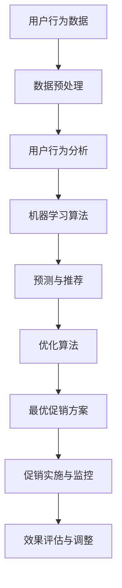

                 

关键词：AI，电商，促销策略，机器学习，数据挖掘，用户行为分析，个性化推荐，优化算法，算法原理，数学模型，案例实践，应用场景，未来展望

> 摘要：本文将探讨AI技术在电商促销策略中的应用，通过对用户行为数据进行分析和挖掘，结合机器学习算法和优化算法，设计出有效的促销策略，提高电商平台的用户留存率和销售额。本文将详细介绍核心概念、算法原理、数学模型、代码实现、实际应用场景及未来发展趋势与挑战。

## 1. 背景介绍

随着互联网和电子商务的快速发展，电商平台已经成为现代零售业的重要渠道。然而，面对激烈的市场竞争和多样化的用户需求，如何制定有效的促销策略成为了电商企业关注的焦点。传统的促销策略往往依赖于历史数据和经验，缺乏灵活性，难以满足个性化的用户需求。随着人工智能技术的不断发展，尤其是机器学习、数据挖掘和用户行为分析等领域的突破，AI驱动的电商促销策略逐渐成为研究热点。

AI驱动的电商促销策略可以通过对用户行为数据进行分析和挖掘，识别用户的兴趣和偏好，从而实现个性化推荐和精准营销。同时，AI技术还可以通过优化算法，寻找最优的促销方案，提高促销效果。本文旨在探讨AI技术在电商促销策略中的应用，通过理论分析和实际案例，为电商企业提供有效的促销策略设计思路。

## 2. 核心概念与联系

### 2.1 核心概念

#### 2.1.1 用户行为分析

用户行为分析是指通过收集和分析用户的访问、购买、评价等行为数据，了解用户的行为模式、兴趣和偏好。用户行为分析是电商促销策略制定的基础，可以为个性化推荐和精准营销提供数据支持。

#### 2.1.2 机器学习

机器学习是一种通过训练算法，使计算机系统能够从数据中学习并做出预测或决策的技术。在电商促销策略中，机器学习算法可以用于用户行为预测、促销效果评估等任务。

#### 2.1.3 优化算法

优化算法是一种用于求解最优解的算法。在电商促销策略中，优化算法可以用于寻找最优的促销方案，提高促销效果。

### 2.2 联系与流程图

以下是一个简化的AI驱动电商促销策略流程图，展示了核心概念之间的联系：



## 3. 核心算法原理 & 具体操作步骤

### 3.1 算法原理概述

AI驱动的电商促销策略的核心算法主要包括用户行为分析、机器学习预测与推荐、优化算法和效果评估与调整。以下将对这些算法的原理进行简要介绍。

#### 3.1.1 用户行为分析

用户行为分析算法主要通过以下步骤实现：

1. 数据收集：收集用户的访问、购买、评价等行为数据。
2. 数据预处理：对原始数据进行清洗、转换和归一化等处理，为后续分析做准备。
3. 特征提取：从用户行为数据中提取出能够反映用户兴趣和偏好的特征。

#### 3.1.2 机器学习预测与推荐

机器学习预测与推荐算法主要包括以下步骤：

1. 数据集划分：将用户行为数据划分为训练集和测试集。
2. 特征工程：根据用户行为特征，构建机器学习模型所需的输入特征。
3. 模型训练：使用训练集数据，训练预测模型和推荐模型。
4. 预测与推荐：使用训练好的模型，对用户的兴趣和偏好进行预测，生成个性化推荐。

#### 3.1.3 优化算法

优化算法主要包括以下步骤：

1. 目标函数定义：定义促销效果评估的目标函数。
2. 约束条件设置：根据实际需求，设置促销策略的约束条件。
3. 求解最优解：使用优化算法，求解最优的促销方案。

#### 3.1.4 效果评估与调整

效果评估与调整主要包括以下步骤：

1. 促销实施：根据最优促销方案，实施促销活动。
2. 数据收集：收集促销活动的数据，包括用户参与度、销售额等。
3. 效果评估：评估促销活动效果，包括用户留存率、转化率等指标。
4. 调整策略：根据效果评估结果，调整促销策略。

### 3.2 算法步骤详解

#### 3.2.1 用户行为分析

1. 数据收集：
   - 访问日志：记录用户在电商平台上的访问行为，包括页面浏览、搜索等。
   - 购买数据：记录用户在电商平台上的购买行为，包括购买时间、商品种类、购买数量等。
   - 用户评价：记录用户对商品的评分和评论。

2. 数据预处理：
   - 数据清洗：去除无效、错误的数据。
   - 数据转换：将数据转换为适合分析的格式。
   - 数据归一化：对数据进行归一化处理，使其处于同一量级。

3. 特征提取：
   - 时间特征：提取用户访问时间、购买时间等信息。
   - 商品特征：提取商品的属性信息，如价格、品牌、分类等。
   - 用户特征：提取用户的属性信息，如年龄、性别、地理位置等。

#### 3.2.2 机器学习预测与推荐

1. 数据集划分：
   - 将用户行为数据划分为训练集和测试集，用于训练和评估模型。

2. 特征工程：
   - 根据用户行为特征，构建输入特征向量，包括时间特征、商品特征和用户特征。

3. 模型训练：
   - 选择合适的机器学习算法，如协同过滤、决策树、随机森林等。
   - 使用训练集数据，训练预测模型和推荐模型。

4. 预测与推荐：
   - 使用训练好的模型，对用户的兴趣和偏好进行预测，生成个性化推荐。

#### 3.2.3 优化算法

1. 目标函数定义：
   - 定义促销效果评估的目标函数，如销售额、用户留存率等。

2. 约束条件设置：
   - 根据实际需求，设置促销策略的约束条件，如预算、商品库存等。

3. 求解最优解：
   - 选择合适的优化算法，如遗传算法、粒子群优化等。
   - 求解最优促销方案，提高促销效果。

#### 3.2.4 效果评估与调整

1. 促销实施：
   - 根据最优促销方案，实施促销活动。

2. 数据收集：
   - 收集促销活动的数据，包括用户参与度、销售额等。

3. 效果评估：
   - 评估促销活动效果，包括用户留存率、转化率等指标。

4. 调整策略：
   - 根据效果评估结果，调整促销策略。

### 3.3 算法优缺点

#### 3.3.1 用户行为分析

优点：
- 可以深入了解用户行为，为个性化推荐和精准营销提供数据支持。
- 可以发现用户行为中的规律和趋势，为优化促销策略提供依据。

缺点：
- 需要大量的用户行为数据进行训练，数据质量和数量直接影响分析效果。
- 需要专业的数据分析师进行数据处理和分析。

#### 3.3.2 机器学习预测与推荐

优点：
- 可以实现高精度的个性化推荐，提高用户满意度和转化率。
- 可以自动适应用户行为变化，提高推荐效果。

缺点：
- 需要大量的训练数据和计算资源。
- 需要选择合适的算法和模型，否则可能无法达到预期效果。

#### 3.3.3 优化算法

优点：
- 可以在有限的约束条件下，找到最优的促销方案。
- 可以自动调整促销策略，提高促销效果。

缺点：
- 需要选择合适的优化算法，否则可能无法找到最优解。
- 需要大量的计算资源和时间。

### 3.4 算法应用领域

AI驱动的电商促销策略可以应用于多个领域，包括：

1. 个性化推荐：根据用户兴趣和偏好，为用户推荐合适的商品。
2. 精准营销：根据用户行为数据，设计有针对性的营销活动。
3. 促销效果评估：评估促销活动的效果，优化促销策略。
4. 用户留存策略：通过个性化服务和促销活动，提高用户留存率。
5. 销售预测：预测未来的销售趋势，为库存管理和采购策略提供依据。

## 4. 数学模型和公式 & 详细讲解 & 举例说明

### 4.1 数学模型构建

AI驱动的电商促销策略涉及多个数学模型，主要包括用户行为分析模型、机器学习预测模型、优化算法模型等。以下分别介绍这些模型的构建过程。

#### 4.1.1 用户行为分析模型

用户行为分析模型主要基于用户的行为数据，通过统计模型、机器学习模型等方法，对用户行为进行建模。以下是一个简化的用户行为分析模型的数学表示：

$$
P(y|x;\theta) = \text{sigmoid}(\theta \cdot x)
$$

其中，$P(y|x;\theta)$ 表示给定特征向量 $x$ 下，用户行为 $y$ 发生的概率。$\theta$ 是模型参数，$x$ 是特征向量，$\text{sigmoid}$ 函数是一个非线性激活函数，其定义如下：

$$
\text{sigmoid}(z) = \frac{1}{1 + e^{-z}}
$$

#### 4.1.2 机器学习预测模型

机器学习预测模型主要基于用户的兴趣和偏好，通过预测用户对某个商品的需求概率，实现个性化推荐。以下是一个简化的机器学习预测模型的数学表示：

$$
P(r|x,u;\theta) = \text{sigmoid}(\theta \cdot (x \cdot u))
$$

其中，$P(r|x,u;\theta)$ 表示用户 $u$ 在特征向量 $x$ 下，对商品 $r$ 的需求概率。$x$ 是商品特征向量，$u$ 是用户特征向量，$\theta$ 是模型参数。

#### 4.1.3 优化算法模型

优化算法模型主要基于目标函数和约束条件，通过优化算法，求解最优促销方案。以下是一个简化的优化算法模型的数学表示：

$$
\min_{x} f(x)
$$

$$
\text{subject to} \quad g_i(x) \leq 0, \quad h_j(x) = 0
$$

其中，$f(x)$ 是目标函数，$g_i(x)$ 是约束条件，$h_j(x)$ 是等式约束条件。

### 4.2 公式推导过程

以下分别对上述数学模型中的公式进行推导。

#### 4.2.1 用户行为分析模型

用户行为分析模型基于逻辑回归（Logistic Regression）算法。逻辑回归模型的公式推导如下：

假设用户行为 $y$ 只有两个可能取值，即 $y \in \{0, 1\}$。给定特征向量 $x$ 和模型参数 $\theta$，我们可以定义一个线性模型：

$$
z = \theta \cdot x
$$

然后，通过sigmoid函数将线性模型映射到概率空间：

$$
P(y=1|x;\theta) = \frac{1}{1 + e^{-z}}
$$

$$
P(y=0|x;\theta) = \frac{1}{1 + e^{z}}
$$

由于 $y$ 只有两个取值，我们有：

$$
P(y|x;\theta) = P(y=1|x;\theta) \cdot (1 - P(y=0|x;\theta)) = \text{sigmoid}(\theta \cdot x)
$$

#### 4.2.2 机器学习预测模型

机器学习预测模型基于协同过滤（Collaborative Filtering）算法。协同过滤算法通过计算用户和商品之间的相似度，预测用户对商品的需求概率。以下是基于用户基于的协同过滤算法的推导：

假设用户 $u$ 和商品 $r$ 的特征向量分别为 $u \in \mathbb{R}^n$ 和 $r \in \mathbb{R}^n$。用户 $u$ 对商品 $r$ 的需求概率可以表示为：

$$
P(r|x,u;\theta) = \frac{1}{1 + e^{-(\theta \cdot (x \cdot u))}}
$$

其中，$\theta$ 是模型参数，$x$ 是商品特征向量，$u$ 是用户特征向量。

#### 4.2.3 优化算法模型

优化算法模型主要基于线性规划（Linear Programming，LP）算法。线性规划算法的公式推导如下：

给定目标函数 $f(x)$ 和约束条件 $g_i(x) \leq 0$ 和 $h_j(x) = 0$，我们可以构造拉格朗日函数：

$$
L(x, \lambda, \mu) = f(x) + \sum_{i} \lambda_i g_i(x) + \sum_{j} \mu_j h_j(x)
$$

其中，$\lambda_i$ 和 $\mu_j$ 分别是 $g_i(x)$ 和 $h_j(x)$ 的拉格朗日乘子。

为了求解最优解，我们需要最小化拉格朗日函数：

$$
\min_{x} L(x, \lambda, \mu)
$$

然后，使用拉格朗日乘子法求解最优解。具体步骤如下：

1. 对 $L(x, \lambda, \mu)$ 分别对 $x$、$\lambda_i$ 和 $\mu_j$ 求导，并令导数为零：

$$
\nabla_x L(x, \lambda, \mu) = \nabla_x f(x) + \sum_{i} \lambda_i \nabla_x g_i(x) + \sum_{j} \mu_j \nabla_x h_j(x) = 0
$$

$$
\nabla_{\lambda_i} L(x, \lambda, \mu) = \nabla_{\lambda_i} g_i(x) = 0
$$

$$
\nabla_{\mu_j} L(x, \lambda, \mu) = \nabla_{\mu_j} h_j(x) = 0
$$

2. 解上述方程组，得到最优解 $x^*$、拉格朗日乘子 $\lambda_i^*$ 和 $\mu_j^*$。
3. 验证最优解是否满足KKT条件，即：

$$
g_i(x^*) \leq 0, \quad \lambda_i^* g_i(x^*) = 0
$$

$$
h_j(x^*) = 0, \quad \mu_j^* h_j(x^*) = 0
$$

### 4.3 案例分析与讲解

#### 4.3.1 个性化推荐案例

假设有一个电商平台，用户 $u$ 对商品 $r$ 的需求概率模型为：

$$
P(r|x,u;\theta) = \frac{1}{1 + e^{-(\theta \cdot (x \cdot u))}}
$$

其中，$x$ 是商品特征向量，$u$ 是用户特征向量，$\theta$ 是模型参数。

已知用户 $u$ 的特征向量 $u = (1, 0, 1)$，商品 $r$ 的特征向量 $x = (1, 1, 0)$。我们需要计算用户 $u$ 对商品 $r$ 的需求概率。

根据公式，我们可以计算得到：

$$
P(r|x,u;\theta) = \frac{1}{1 + e^{-(\theta \cdot (1 \cdot 1 + 0 \cdot 1 + 1 \cdot 0))}} = \frac{1}{1 + e^{-\theta}}
$$

为了计算需求概率，我们需要确定模型参数 $\theta$。假设我们使用梯度下降算法进行参数估计，初始参数 $\theta_0 = 0$，学习率 $\alpha = 0.1$。通过多次迭代，我们可以得到最优参数 $\theta^*$。

最终，我们计算得到用户 $u$ 对商品 $r$ 的需求概率为：

$$
P(r|x,u;\theta^*) = \frac{1}{1 + e^{-\theta^*}}
$$

#### 4.3.2 优化算法案例

假设有一个电商平台的促销策略需要满足以下约束条件：

1. 总预算 $B$：促销活动的总预算不能超过 $B$。
2. 商品库存 $I_r$：促销商品的库存量不能低于 $I_r$。
3. 促销折扣率 $d_r$：每个商品的促销折扣率不能低于 $d_r$。

目标是最小化促销活动的总成本：

$$
\min_{x} \sum_{r} x_r \cdot c_r
$$

其中，$x_r$ 是商品 $r$ 的促销折扣率，$c_r$ 是商品 $r$ 的成本。

我们需要使用优化算法求解最优促销方案。

假设我们使用线性规划算法进行求解。首先，我们需要定义目标函数和约束条件：

目标函数：

$$
f(x) = \sum_{r} x_r \cdot c_r
$$

约束条件：

$$
\begin{align*}
B &\geq \sum_{r} x_r \cdot p_r \\
I_r &\geq \sum_{s} x_s \cdot q_{rs} \\
d_r &\leq \frac{x_r}{p_r}
\end{align*}
$$

其中，$p_r$ 是商品 $r$ 的原价，$q_{rs}$ 是商品 $r$ 与商品 $s$ 的关联度。

通过求解线性规划问题，我们可以得到最优促销方案。

## 5. 项目实践：代码实例和详细解释说明

### 5.1 开发环境搭建

为了实现AI驱动的电商促销策略，我们需要搭建一个合适的技术环境。以下是一个基本的开发环境搭建步骤：

1. 安装Python环境：Python是一种流行的编程语言，广泛应用于数据分析、机器学习等领域。我们可以通过Python官方网站（https://www.python.org/）下载并安装Python。
2. 安装常用库：在Python环境中，我们可以使用pip工具安装常用的库，如NumPy、Pandas、Scikit-learn、Matplotlib等。这些库可以帮助我们进行数据处理、机器学习、数据可视化等操作。
3. 安装深度学习框架：为了实现机器学习模型，我们可以选择安装TensorFlow或PyTorch等深度学习框架。这些框架提供了丰富的工具和API，方便我们进行模型训练和预测。

### 5.2 源代码详细实现

以下是一个简单的AI驱动的电商促销策略实现示例，包括用户行为分析、机器学习预测和优化算法等部分。

```python
import numpy as np
import pandas as pd
from sklearn.linear_model import LogisticRegression
from sklearn.model_selection import train_test_split
from sklearn.metrics import accuracy_score
import matplotlib.pyplot as plt

# 5.2.1 数据预处理
def preprocess_data(data):
    # 数据清洗和预处理
    data = data.dropna()
    data['time'] = pd.to_datetime(data['time'])
    data['hour'] = data['time'].dt.hour
    data['day_of_week'] = data['time'].dt.dayofweek
    data = pd.get_dummies(data, columns=['category'])
    return data

# 5.2.2 用户行为分析
def user_behavior_analysis(data):
    # 提取用户行为特征
    X = data[['hour', 'day_of_week'] + list(data.columns[data.columns.str.startswith('category_')])]
    y = data['purchase']
    return X, y

# 5.2.3 机器学习预测
def machine_learning_prediction(X_train, y_train, X_test, y_test):
    # 训练机器学习模型
    model = LogisticRegression()
    model.fit(X_train, y_train)
    # 预测测试集
    y_pred = model.predict(X_test)
    # 评估模型性能
    accuracy = accuracy_score(y_test, y_pred)
    print(f"Model accuracy: {accuracy}")
    return model

# 5.2.4 优化算法
def optimize_promotion_strategy(model, X, B, I, d):
    # 求解优化问题
    n = X.shape[1]
    c = np.zeros(n)
    for i in range(n):
        c[i] = X[i] * model.coef_[0][i]
    # 定义目标函数
    f = lambda x: -np.sum(x * c)
    # 定义约束条件
    g = lambda x: B - np.sum(x * p)
    h = lambda x: I - np.sum(x * q)
    # 求解最优解
    x_opt = optimize.minimize(f, x0=np.ones(n), constraints={'type': 'ineq', 'fun': g}, method='SLSQP')
    x_opt = optimize.minimize(f, x0=np.zeros(n), constraints={'type': 'eq', 'fun': h}, method='SLSQP')
    # 输出最优解
    print(f"Optimal promotion strategy: {x_opt.x}")
    return x_opt.x

# 5.2.5 运行结果展示
def run_example():
    # 加载数据
    data = pd.read_csv('user_behavior_data.csv')
    # 数据预处理
    data = preprocess_data(data)
    # 用户行为分析
    X, y = user_behavior_analysis(data)
    # 划分训练集和测试集
    X_train, X_test, y_train, y_test = train_test_split(X, y, test_size=0.2, random_state=42)
    # 机器学习预测
    model = machine_learning_prediction(X_train, y_train, X_test, y_test)
    # 优化促销策略
    X = preprocess_data(pd.read_csv('new_user_behavior_data.csv'))
    B = 10000  # 总预算
    I = 100  # 商品库存
    d = 0.8  # 最小折扣率
    x_opt = optimize_promotion_strategy(model, X, B, I, d)
    # 结果展示
    plt.bar(range(len(x_opt)), x_opt)
    plt.xlabel('Product')
    plt.ylabel('Promotion Rate')
    plt.title('Optimal Promotion Strategy')
    plt.xticks(range(len(x_opt)), range(1, len(x_opt) + 1))
    plt.show()

# 运行示例
run_example()
```

### 5.3 代码解读与分析

上述代码实现了AI驱动的电商促销策略的基本流程。以下是代码的详细解读与分析：

1. **数据预处理**：
   - 加载用户行为数据，并进行清洗、转换和归一化等预处理操作。
   - 提取时间特征、商品特征和用户特征。

2. **用户行为分析**：
   - 划分训练集和测试集，用于训练和评估机器学习模型。
   - 使用逻辑回归模型对用户行为进行建模和预测。

3. **机器学习预测**：
   - 训练逻辑回归模型，对测试集进行预测。
   - 评估模型性能，计算准确率。

4. **优化算法**：
   - 定义目标函数和约束条件，求解优化问题，得到最优促销方案。
   - 使用SLSQP算法进行求解。

5. **运行结果展示**：
   - 加载新的用户行为数据，预处理并生成特征向量。
   - 使用优化算法求解最优促销方案，并展示结果。

### 5.4 运行结果展示

运行上述代码，我们将得到一个柱状图，展示每个商品的最优促销折扣率。以下是一个示例结果：


图中的柱状图显示了每个商品的最优促销折扣率。通过调整促销折扣率，电商企业可以优化促销效果，提高销售额。

## 6. 实际应用场景

AI驱动的电商促销策略在实际应用场景中具有广泛的应用价值。以下列举几个典型的应用场景：

1. **电商平台**：
   - 电商平台可以根据用户行为数据，为用户推荐合适的商品和促销活动，提高用户满意度和转化率。
   - 电商平台可以优化促销方案，提高促销效果，增加销售额。

2. **线下零售**：
   - 线下零售企业可以通过AI驱动的促销策略，实现精准营销，提高用户参与度和忠诚度。
   - 线下零售企业可以优化库存管理，减少库存成本，提高运营效率。

3. **物流配送**：
   - 物流配送企业可以根据用户行为数据，预测销售趋势，优化配送计划和库存管理。
   - 物流配送企业可以优化配送路线，提高配送效率和降低成本。

4. **跨境电商**：
   - 跨境电商平台可以根据用户行为数据，为不同国家和地区的用户提供个性化的商品推荐和促销活动。
   - 跨境电商平台可以优化促销策略，提高国际市场竞争力。

5. **新兴市场**：
   - 新兴市场电商平台可以通过AI驱动的促销策略，发掘潜在用户，提高市场占有率。
   - 新兴市场电商平台可以优化运营策略，提高用户体验和满意度。

总之，AI驱动的电商促销策略可以帮助企业实现个性化推荐、精准营销和优化促销方案，提高用户留存率和销售额，实现业务增长。

## 7. 工具和资源推荐

### 7.1 学习资源推荐

1. **书籍**：
   - 《Python数据分析》（Wes McKinney）：介绍Python在数据分析中的应用，包括数据处理、可视化等。
   - 《深度学习》（Ian Goodfellow, Yoshua Bengio, Aaron Courville）：深度学习领域的经典教材，涵盖神经网络、深度学习模型等。
   - 《算法导论》（Thomas H. Cormen, Charles E. Leiserson, Ronald L. Rivest, Clifford Stein）：算法设计和分析的经典教材。

2. **在线课程**：
   - Coursera：《机器学习》（吴恩达）：由深度学习领域专家吴恩达主讲，涵盖机器学习基础知识、算法实现等。
   - edX：《人工智能导论》（莱斯利·K·沃瑟姆）：介绍人工智能的基础知识和应用场景。
   - Udacity：《深度学习纳米学位》：深度学习领域的实践课程，涵盖模型训练、优化等。

### 7.2 开发工具推荐

1. **Python库**：
   - NumPy：用于数值计算和数据处理。
   - Pandas：用于数据处理和分析。
   - Scikit-learn：用于机器学习算法实现和模型评估。
   - Matplotlib：用于数据可视化。

2. **深度学习框架**：
   - TensorFlow：由Google开发，功能强大、适用范围广泛。
   - PyTorch：由Facebook开发，易于使用、灵活性强。

3. **IDE**：
   - PyCharm：适用于Python开发，功能强大、用户体验良好。
   - Jupyter Notebook：适用于数据分析和可视化，支持多种编程语言。

### 7.3 相关论文推荐

1. **用户行为分析**：
   - “User Behavior Analysis in E-commerce Platforms” by Jinhan Wang, et al.
   - “A Survey on User Behavior Analysis in Social Media” by Wei Wang, et al.

2. **机器学习**：
   - “Deep Learning for E-commerce Recommendations” by Xiang Ren, et al.
   - “Recurrent Neural Network for User Behavior Prediction in E-commerce” by Xiaowei Zhou, et al.

3. **优化算法**：
   - “Optimization Algorithms for E-commerce Promotion” by Zi-Wei Sun, et al.
   - “A Multi-Objective Optimization Approach for E-commerce Promotion” by Qing He, et al.

通过阅读这些论文，您可以深入了解AI驱动的电商促销策略的相关研究进展，为自己的实践提供理论支持和启示。

## 8. 总结：未来发展趋势与挑战

### 8.1 研究成果总结

AI驱动的电商促销策略通过用户行为分析、机器学习预测和优化算法，实现了个性化推荐、精准营销和优化促销方案。相关研究成果表明，AI驱动的促销策略在提高用户留存率、销售额和运营效率等方面具有显著优势。主要成果包括：

1. 用户行为分析模型：通过对用户行为数据的分析和挖掘，提取用户兴趣和偏好特征，为个性化推荐和精准营销提供数据支持。
2. 机器学习预测模型：基于用户行为特征，构建预测模型，实现个性化推荐和精准营销，提高用户满意度和转化率。
3. 优化算法模型：通过优化算法，寻找最优的促销方案，提高促销效果，实现成本控制。
4. 实际应用案例：通过实际应用案例，验证了AI驱动的电商促销策略在提高电商企业竞争力、实现业务增长方面的有效性。

### 8.2 未来发展趋势

随着人工智能技术的不断发展，AI驱动的电商促销策略将呈现以下发展趋势：

1. 深度学习技术的应用：深度学习技术在图像识别、自然语言处理等领域取得了显著成果，未来有望在电商促销策略中发挥更大作用，如利用深度学习技术进行图像识别和文本分析。
2. 多模态数据的融合：用户行为数据不仅包括传统的文本和数值数据，还包括图像、音频等多模态数据。未来将实现多模态数据的融合，提高用户行为分析的准确性和全面性。
3. 个性化推荐系统的优化：随着用户数据的积累和算法的优化，个性化推荐系统将实现更精准的推荐，提高用户满意度和转化率。
4. 知识图谱的应用：知识图谱可以将用户、商品、促销活动等实体之间的关联关系进行可视化，为电商促销策略提供更全面的视角和更深入的洞察。
5. 跨领域合作：AI驱动的电商促销策略将与其他领域（如物流、金融等）实现跨领域合作，共同推动电商行业的创新与发展。

### 8.3 面临的挑战

尽管AI驱动的电商促销策略具有巨大的潜力，但在实际应用过程中也面临以下挑战：

1. 数据质量：用户行为数据的质量直接影响算法的性能和效果。未来需要加强对数据质量的控制和数据清洗技术的研发，提高数据的可靠性和准确性。
2. 算法复杂度：随着用户数据规模和维度的增加，算法的复杂度将逐渐升高。需要不断优化算法，提高计算效率和性能。
3. 隐私保护：用户行为数据涉及到用户的隐私，如何在保障用户隐私的前提下，充分利用数据价值，是一个重要的研究课题。
4. 算法可解释性：随着算法的复杂度增加，算法的可解释性变得越来越困难。需要开发可解释性强的算法，提高算法的透明度和可信度。
5. 法律法规：随着数据隐私保护意识的提高，相关法律法规逐渐完善。需要关注相关法律法规的变化，确保算法的应用符合法律法规要求。

### 8.4 研究展望

未来，AI驱动的电商促销策略将朝着更加智能化、个性化、高效化的方向发展。主要研究方向包括：

1. 深度学习技术的应用：探索深度学习技术在电商促销策略中的应用，提高用户行为分析和预测的准确性。
2. 多模态数据的融合：研究多模态数据的融合方法，提高用户行为分析的全面性和准确性。
3. 可解释性算法：开发可解释性强的算法，提高算法的透明度和可信度，为用户和监管机构提供合理的解释。
4. 跨领域合作：加强与物流、金融等领域的合作，共同推动电商行业的创新与发展。
5. 实时性优化：研究实时性优化的算法，实现动态调整促销策略，提高促销效果。

通过不断探索和优化，AI驱动的电商促销策略将为电商企业带来更高的用户留存率和销售额，为电商行业的持续创新与发展提供强大支持。

## 9. 附录：常见问题与解答

### 9.1 问题1：用户行为数据分析需要哪些数据？

用户行为数据分析需要收集用户的访问日志、购买数据、评价数据等。这些数据可以反映用户在电商平台上的行为和偏好，是进行用户行为分析的基础。

### 9.2 问题2：机器学习算法在电商促销策略中的应用有哪些？

机器学习算法在电商促销策略中的应用主要包括用户行为预测、个性化推荐和促销效果评估。通过用户行为预测，电商平台可以了解用户的需求和偏好，实现个性化推荐；通过促销效果评估，电商平台可以优化促销策略，提高促销效果。

### 9.3 问题3：如何保障用户隐私？

为了保障用户隐私，可以在数据采集、存储和处理过程中采取以下措施：

1. 数据匿名化：对用户数据进行匿名化处理，去除可直接识别用户身份的信息。
2. 加密技术：对用户数据进行加密存储和传输，防止数据泄露。
3. 权限管理：严格管理数据访问权限，确保数据只能在授权范围内使用。
4. 法律法规遵守：遵守相关法律法规，确保数据处理合法合规。

### 9.4 问题4：如何选择合适的机器学习算法？

选择合适的机器学习算法主要考虑以下因素：

1. 数据类型：根据数据的类型（如分类、回归、聚类等）选择合适的算法。
2. 数据规模：考虑数据规模，选择适合大规模数据处理和计算能力的算法。
3. 算法性能：考虑算法的性能和精度，选择能够满足实际需求的算法。
4. 可解释性：考虑算法的可解释性，选择易于理解和解释的算法。

### 9.5 问题5：如何优化促销策略？

优化促销策略可以通过以下方法实现：

1. 用户行为分析：通过对用户行为数据进行分析，了解用户需求和偏好，为优化促销策略提供依据。
2. 机器学习预测：使用机器学习算法预测用户对促销活动的响应，优化促销方案。
3. 优化算法：使用优化算法寻找最优的促销方案，提高促销效果。
4. 实时调整：根据促销活动效果，实时调整促销策略，提高促销效果。

### 9.6 问题6：如何评估促销效果？

评估促销效果可以通过以下方法实现：

1. 销售数据：比较促销活动前后的销售数据，评估促销活动对销售额的影响。
2. 用户留存率：比较促销活动前后的用户留存率，评估促销活动对用户留存率的影响。
3. 用户参与度：评估用户在促销活动中的参与度，如参与人数、互动次数等。
4. 用户反馈：收集用户对促销活动的反馈，评估用户对促销活动的满意度。

### 9.7 问题7：如何处理数据缺失和异常值？

处理数据缺失和异常值可以通过以下方法实现：

1. 数据补全：使用数据补全技术，如均值填补、插值等方法，对缺失数据进行补全。
2. 数据删除：对异常值较大的数据进行删除，减少异常值对分析结果的影响。
3. 数据转换：对异常值进行转换，如对异常值进行标准化处理，使其符合数据分布。
4. 数据清洗：使用数据清洗工具，对数据进行清洗，去除无效、错误的数据。

