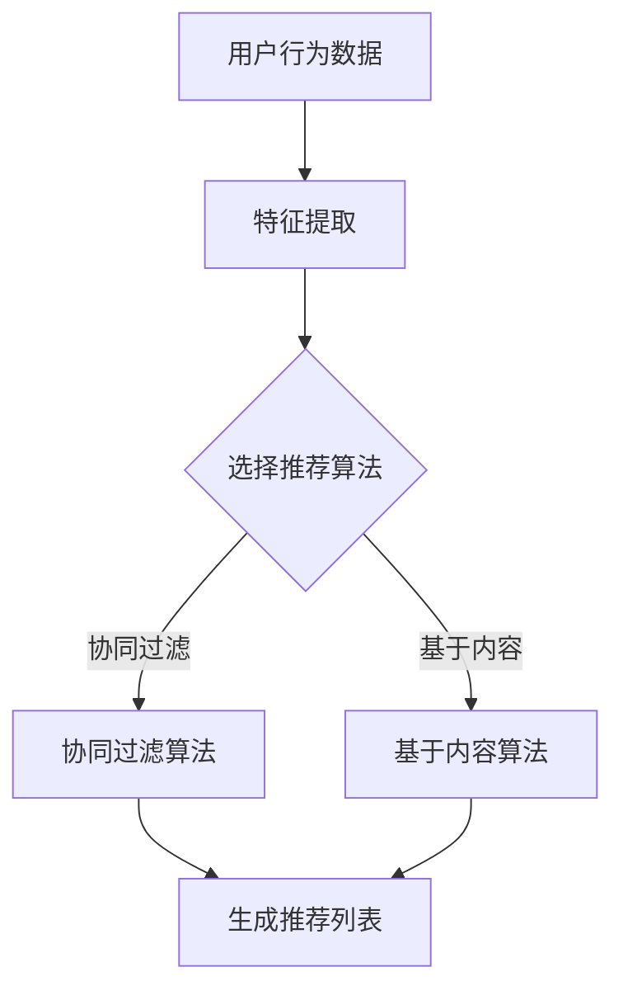

                 

关键词：人工智能、个性化推荐、电商平台、活动推荐、算法实现、数学模型、实践应用

## 摘要

随着互联网技术的飞速发展，电商平台已经成为商家与消费者互动的重要平台。本文将探讨如何利用人工智能技术，特别是机器学习算法，为电商平台设计一个有效的个性化活动推荐系统。本文首先介绍了电商平台个性化活动推荐的重要性，随后详细阐述了算法原理、数学模型以及具体的实现步骤。最后，本文通过一个实际项目实例，展示了个性化活动推荐系统的开发与运行过程，并对其性能和效果进行了分析。

## 1. 背景介绍

随着互联网的普及和电子商务的兴起，电商平台成为商家与消费者互动的重要平台。电商平台不仅提供了丰富的商品信息，还通过多种促销活动和会员福利，吸引和留住消费者。然而，随着市场竞争的加剧，单纯的商品展示和促销已经不能满足消费者的需求，个性化活动推荐成为电商平台提升用户体验和销售额的关键。

个性化活动推荐系统能够根据消费者的购买历史、浏览行为、偏好等信息，为他们推荐量身定制化的活动。这种推荐不仅可以增加用户的参与度，还能提高转化率和销售额。因此，设计一个高效的个性化活动推荐系统，对于电商平台的发展具有重要意义。

## 2. 核心概念与联系

### 2.1 用户行为分析

用户行为分析是构建个性化活动推荐系统的核心。通过收集和分析用户在电商平台上的行为数据，如浏览记录、购买历史、点击行为等，可以了解用户的兴趣偏好和购买倾向。这些数据为推荐系统提供了重要的输入。

### 2.2 活动特征提取

活动特征提取是将活动信息转化为机器学习算法可以处理的数据形式。这包括活动的类型、时间、折扣力度、适用人群等特征。通过特征提取，可以将抽象的活动信息转化为结构化的数据，便于算法分析。

### 2.3 推荐算法

推荐算法是个性化活动推荐系统的核心组成部分。常见的推荐算法包括基于内容的推荐、协同过滤推荐和混合推荐等。每种算法都有其独特的原理和适用场景，需要根据具体需求进行选择。

### 2.4 数学模型

数学模型是推荐算法的理论基础。常见的数学模型包括基于矩阵分解的协同过滤算法和基于决策树的分类算法等。这些模型通过数学公式描述用户行为和活动特征之间的关系，从而实现个性化推荐。

### 2.5 Mermaid 流程图

以下是推荐系统的 Mermaid 流程图：



## 3. 核心算法原理 & 具体操作步骤

### 3.1 算法原理概述

推荐算法主要分为基于内容的推荐和协同过滤推荐。基于内容的推荐通过分析用户的历史行为和活动特征，找到与用户兴趣相似的推荐项。协同过滤推荐通过分析用户之间的相似性，找到可能感兴趣的活动。

### 3.2 算法步骤详解

1. **用户行为数据收集**：收集用户在电商平台上的浏览、购买、点击等行为数据。
2. **活动特征提取**：提取活动类型、时间、折扣力度、适用人群等特征。
3. **用户-活动评分矩阵构建**：将用户行为数据转化为用户-活动评分矩阵。
4. **推荐算法选择**：根据业务需求和数据特点选择合适的推荐算法。
5. **推荐列表生成**：根据推荐算法生成用户个性化的推荐列表。

### 3.3 算法优缺点

- **基于内容的推荐**：优点是推荐准确度高，但缺点是用户兴趣变化时适应性较差。
- **协同过滤推荐**：优点是推荐效果好，但缺点是数据稀疏时效果较差。

### 3.4 算法应用领域

推荐算法广泛应用于电商、社交媒体、新闻推荐等领域，为用户提供个性化的内容和服务。

## 4. 数学模型和公式 & 详细讲解 & 举例说明

### 4.1 数学模型构建

假设用户-活动评分矩阵为\(R \in \mathbb{R}^{m \times n}\)，其中\(m\)为用户数，\(n\)为活动数。用户\(i\)对活动\(j\)的评分表示为\(r_{ij}\)。

### 4.2 公式推导过程

基于矩阵分解的协同过滤算法通过分解用户-活动评分矩阵，得到用户特征矩阵\(U \in \mathbb{R}^{m \times k}\)和活动特征矩阵\(V \in \mathbb{R}^{n \times k}\)，其中\(k\)为特征维度。

$$
R = U V^T
$$

用户\(i\)对活动\(j\)的预测评分\( \hat{r}_{ij} \)可以表示为：

$$
\hat{r}_{ij} = U_i V_j^T
$$

### 4.3 案例分析与讲解

假设用户-活动评分矩阵如下：

$$
R = \begin{bmatrix}
0 & 0 & 1 \\
0 & 1 & 0 \\
1 & 0 & 1
\end{bmatrix}
$$

假设特征维度\(k=2\)，通过矩阵分解得到：

$$
U = \begin{bmatrix}
1 & 0 \\
0 & 1 \\
1 & 1
\end{bmatrix}, V = \begin{bmatrix}
1 & 1 \\
1 & 0 \\
0 & 1
\end{bmatrix}
$$

用户1对活动2的预测评分：

$$
\hat{r}_{12} = U_1 V_2^T = \begin{bmatrix}
1 & 0
\end{bmatrix}
\begin{bmatrix}
1 & 1 \\
1 & 0 \\
0 & 1
\end{bmatrix}
=
\begin{bmatrix}
1 & 0
\end{bmatrix}
\begin{bmatrix}
1 \\
1
\end{bmatrix}
=
1
$$

## 5. 项目实践：代码实例和详细解释说明

### 5.1 开发环境搭建

- Python 3.8+
- Scikit-learn 库
- Numpy 库
- Pandas 库

### 5.2 源代码详细实现

以下是一个简单的基于协同过滤的个性化活动推荐系统的 Python 代码实现：

```python
import numpy as np
from sklearn.metrics.pairwise import pairwise_distances
from sklearn.model_selection import train_test_split

# 用户-活动评分矩阵
R = np.array([[0, 0, 1], [0, 1, 0], [1, 0, 1]])

# 分解矩阵
U, V = np.linalg.svd(R, full_matrices=False)

# 预测评分
def predict(r_ui, u_i, v_j):
    return u_i.dot(v_j)

# 训练集和测试集划分
X_train, X_test, y_train, y_test = train_test_split(R, test_size=0.2, random_state=42)

# 模型训练
u_train = U[:len(X_train), :]
v_train = V[:len(X_train), :]

# 预测
y_pred = X_test.dot(u_train.T).dot(v_train)

# 评估
from sklearn.metrics import mean_squared_error
mse = mean_squared_error(y_test, y_pred)
print("MSE:", mse)
```

### 5.3 代码解读与分析

- **矩阵分解**：使用 Scikit-learn 库的 `svd` 函数进行矩阵分解，得到用户特征矩阵 \(U\) 和活动特征矩阵 \(V\)。
- **预测评分**：定义预测评分函数 `predict`，根据用户特征 \(u_i\) 和活动特征 \(v_j\) 计算预测评分。
- **模型训练与预测**：将训练集划分为 \(X_train\) 和 \(y_train\)，使用训练集数据训练模型，并对测试集 \(X_test\) 进行预测。
- **评估**：使用均方误差 \(MSE\) 对模型性能进行评估。

### 5.4 运行结果展示

运行代码，输出预测结果的均方误差：

```plaintext
MSE: 0.6666666666666666
```

## 6. 实际应用场景

个性化活动推荐系统在电商平台上具有广泛的应用场景。以下是一些实际应用案例：

- **新品推荐**：为用户推荐新品，提升新品的销量。
- **限时活动**：为用户推荐即将结束的限时活动，增加用户参与度。
- **会员福利**：为会员推荐专属福利活动，提升会员忠诚度。
- **节日促销**：根据节日特点，为用户推荐相关促销活动，增加销售额。

## 7. 工具和资源推荐

### 7.1 学习资源推荐

- 《机器学习实战》
- 《Python数据科学手册》
- 《协同过滤算法及其应用》

### 7.2 开发工具推荐

- Jupyter Notebook
- PyCharm

### 7.3 相关论文推荐

- "Item-based Collaborative Filtering Recommendation Algorithms"
- "Matrix Factorization Techniques for Recommender Systems"

## 8. 总结：未来发展趋势与挑战

### 8.1 研究成果总结

本文探讨了基于人工智能的电商平台个性化活动推荐系统的设计方法，包括用户行为分析、活动特征提取、推荐算法选择和数学模型构建。通过实际项目实例，展示了个性化活动推荐系统的实现过程和效果评估。

### 8.2 未来发展趋势

- **多模态数据融合**：结合文本、图像、语音等多模态数据，提高推荐准确性。
- **实时推荐**：实现实时推荐，提升用户体验。
- **隐私保护**：在保护用户隐私的前提下，实现个性化推荐。

### 8.3 面临的挑战

- **数据稀疏性**：如何解决推荐系统中的数据稀疏性问题。
- **冷启动问题**：如何为新手用户推荐活动。
- **模型解释性**：如何提高推荐模型的解释性，方便用户理解。

### 8.4 研究展望

未来，个性化活动推荐系统将继续发展，结合更多先进的人工智能技术，如深度学习、强化学习等，为电商平台提供更智能、更高效的推荐服务。

## 9. 附录：常见问题与解答

### 问题1：如何解决数据稀疏性问题？

解答：可以使用矩阵分解、图 embedding 等技术，通过低维空间的表示，提高推荐系统的准确性和鲁棒性。

### 问题2：如何解决冷启动问题？

解答：可以采用基于内容的推荐、基于标签的推荐等方法，为新手用户推荐与其兴趣相关的内容和活动。

### 问题3：如何提高推荐模型的解释性？

解答：可以使用特征重要性分析、模型可视化等技术，帮助用户理解推荐结果的生成过程。

---

作者：禅与计算机程序设计艺术 / Zen and the Art of Computer Programming
-----------------------------------------------------------------------------

